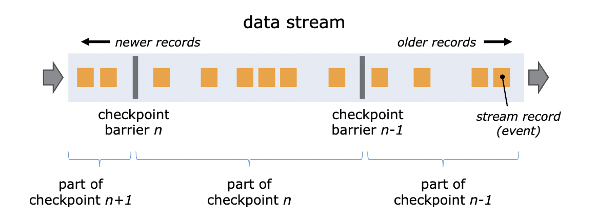
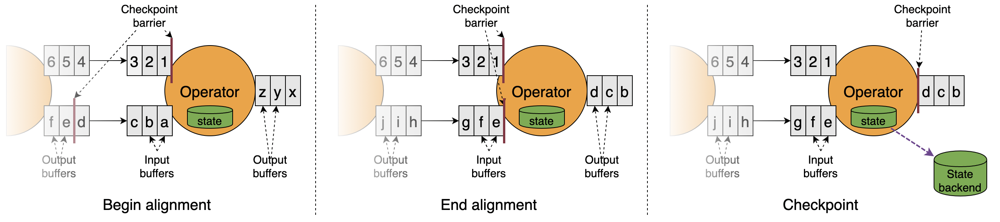
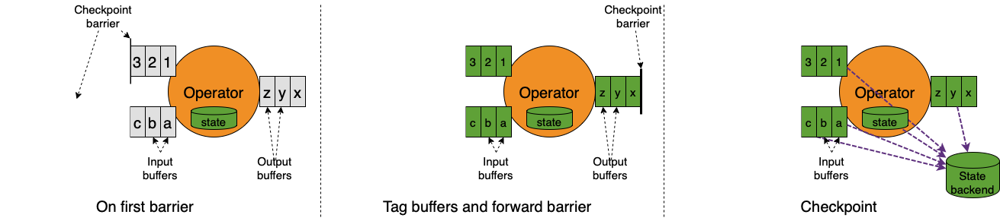
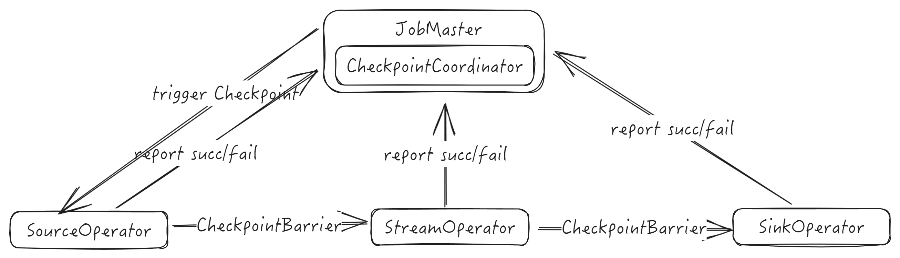
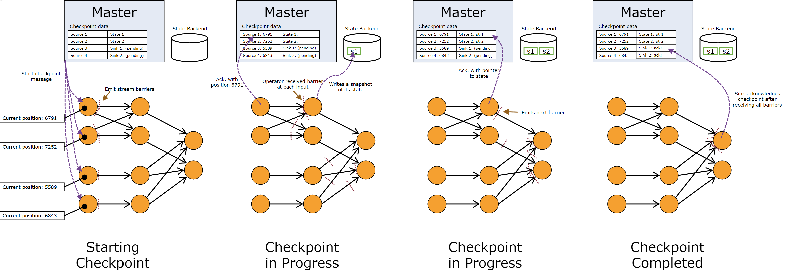

```toc
ordered: true
class-name: "table-of-contents"
```

Checkpoint是Flink容错机制的核心，在Checkpoint的过程中，Flink会生成算子中状态的快照（snapshotting）并存储到状态后端中；在算子从故障中恢复时，可以通过快照恢复故障前的状态，从而实现流式处理的Exactly-Once或At-Least-Once语义。状态快照由数据流中的Barrier触发。在Flink运行时，数据源会定期向数据流中插入Barrier，当算子收到Barrier时，即开始进行状态快照。Flink在1.11版本加入了Unaligned Checkpointing机制，允许具有多个上游的算子在全部Barrier到达之前进行checkpoint流程。

数据处理容错语义保证的可靠程度从低到高包含4个不同的层次：

+ 至多一次（At-Most-Once）：数据不重复处理，但可能丢失
+ 最少一次（At-Least-Once）：数据可能重复处理，但保证不丢失
+ 引擎内严格一次（Exactly-Once）：在计算引擎内部，数据不丢失、不重复
+ 端到端严格一次（End-to-End Exactly-Once）：从数据读取、引擎处理到写入外部存储的整个过程中，数据不重复、不丢失。端到端严格一次语义需要数据源支持可重放、外部存储支持事务机制、能够进行回滚

Flink基于轻量级分布式快照技术-异步屏障快照（Asynchronous Barrier Snapshots，ABS）算法^[借鉴了Chandy-Lamport算法，在数据源端插入 屏障（Barrier）来替代Chandy-Lamport算法中的Marker，通过控制屏障的同步来实现快照的备份和精确一次（Exactly-Once）语义]-提供了Checkpoint机制来实现容错。分布式快照技术的核心思想是生成分布式数据流和算子状态的一致性快照，并将这些快照作为发生故障时系统回退到的一致性检查点。基于检查点机制，在框架级别支持两阶段提交协议，实现了端到端严格一次的语义保证。

保存点（Savepoint）是基于Flink检查点机制的应用完整快照备份机制，可以在另一个集群或者另一个时间点，从保存的状态中将作业恢复回来，适用于应用升级、集群迁移、Flink集群版本更新等场景。保存点可以视为一个“算子ID->状态”的Map，对于每一个有状态的算子，Key是算子ID，Value是算子状态。

## Checkpoint存储

CheckpointStorage是对检查点状态存储系统的抽象，描述状态后端如何存储状态来实现流应用容错，有JobManagerCheckpointStorage和FileSystemCheckpointStorage等多个实现。JobManagerCheckpointStorage将所有算子的检查点状态存储在JobManager的内存中，不可扩展且仅支持小状态，一般用于本地测试。FileSystemCheckpointStorage将所有算子的检查点状态持久化存储在文件系统（HDFS等）中，支持大状态，一般用于生产环境。

CheckpointStorageLocation是对检查点状态存储位置的抽象，提供获取检查点输出流的方法，通过输出流将状态和元数据写入到存储系统中，输出流关闭时可以获得状态句柄（StateHandle），使用状态句柄可以重新读取写入的状态。

## 异步屏障快照算法

在数据源周期性注入屏障（Barrier）来切分数据流（屏障从不跨越记录、严格按顺序流动来作为两次快照对应记录集合的边界，每个屏障都携带其前记录对应检查点的ID），屏障作为数据流的一部分流经各个算子^[不同检查点对应的多个屏障可以在流中同时出现，即 多个检查点可以同时发生]，当一个算子从其所有输入流中收到了同一快照的屏障时，该算子就会保存自己的状态快照并向下游广播屏障，Sink算子从其所有输入流中收到了同一快照的屏障时，如果是引擎内严格一次处理保证，Sink算子对自己的状态进行快照，然后通知检查点协调器，当所有Sink算子都向检查点协调器汇报成功之后，检查点协调器向所有算子确认本次快照完成，如果是端到端严格一次处理保证，Sink算子对自己的状态进行快照，并预提交事务，再通知检查点协调器，当所有Sink算子都向检查点协调器汇报成功之后，检查点协调器向所有的算子确认本次快照完成，Sink算子提交事务，本次快照完成。当作业发生异常时，从最后一次成功的检查点中恢复状态。屏障生成不需要锁，其随着数据向下流动，也不会打断数据流，与检查点有关的所有操作都可以异步完成，可以对齐，也可以不对齐，算子可以异步快照它们的状态，因此非常轻量。



**屏障对齐** 当一个算子有多个输入时，为了达到引擎内严格一次、端到端严格一次两种保证语义，必须要屏障对齐。对于有两个上游输入通道的算子，屏障对齐过程如下

1. 开始对齐：算子收到输入通道1中的屏障，输入通道2的屏障尚未到达
2. 对齐：算子继续从输入通道1接收数据，但是并不处理，而是保存在输入缓存（input buffer）中，等待输入通道2的屏障到达^[阻塞输入通道有负面效果，一旦某个输入通道发生延迟，屏障迟迟未到，会导致其它通道全部堵塞，系统吞吐大幅下降]
3. 执行检查点：输入通道2中的屏障到达，此时屏障前的记录已经更新了状态，屏障后的记录还未更新状态，保证了状态的准确性（同时还消去了原生Chandy-Lamport算法中记录输入流状态的步骤），算子开始对其状态进行异步快照（包含快照开始时所有数据源并行流的位置offset和指向每个算子状态的指针），接着向下游广播对应检查点的屏障而无需等待快照执行完毕
4. 继续处理数据：算子进行异步快照后，首先处理输入缓存中的数据，然后再从输入通道中获取数据



<details>

<summary>伪代码</summary>

```
# 初始化Operator
upon event (init | input_channels, output_channels, fun, init_state)
do
    state := init_state;
    blocked_inputs := {};
    inputs := input_channels;
    outputs := output_channels;
    udf := fun;
# 收到Barrier的行为
upon event (receive | input, (barrier))
do
    # 将当前input通道加入blocked 集合，并block该通道，此通道的消息处理暂停
    if input != Nil
    then
        blocked_inputs := blocked_inputs ∪ {input};
        trigger (block | input);
    # 如果所有的通道都已经被block，说明所有的barrier都已经收到
    if blocked_inputs = inputs
    then
        blocked_inputs := {};
        # 向所有的outputs发出Barrier
        broadcast (send | outputs, (barrier));
        # 记录本节点当前状态
        trigger (snapshot | state);
        # 解除所有通道的block，继续处理消息
        for each inputs as input
            trigger (unblock | input);
```

</details>

**非对齐检查点** 屏障对齐是阻塞式的，如果作业出现反压，数据流动的速度减慢，屏障到达下游算子的延迟就会变大，进而影响到检查点完成的延时（变大甚至超时失败）。如果反压长久不能得到解决，快照数据与实际数据之间的差距就越来越明显，一旦作业failover，势必丢失较多的处理进度。另一方面，作业恢复后需要重新处理的数据又会积压，加重反压，造成恶性循环。非对齐检查点机制（unaligned checkpoint）取消了屏障对齐，与原生Chandy-Lamport算法更为相似一些（需要由算子来记录输入流的状态）。具体步骤如下：

1. 当输入流中的第一个屏障保存到输入缓冲区（input buffer）中时，算子开始进行Checkpoint
2. 算子通过将屏障添加到输出缓冲区（output buffer）的结尾来立即向下游算子广播屏障
3. 算子标记所有未处理的需要异步存储的记录（第一个屏障所在输入缓冲区中的记录、其他输入流对应屏障前的记录、输出缓冲区中的记录）并创建其状态的快照

算子仅在标记缓冲区、广播屏障、创建快照时短暂停止处理输入。



对齐检查点和非对齐检查点区别：

1. 对齐检查点在最后一个屏障到达算子时触发，非对齐检查点在第一个屏障到达算子时就触发
2. 对齐检查点在第一个屏障到最后一个屏障到达的区间内是阻塞的，而非对齐检查点不需要阻塞
3. 对齐检查点能够保持快照N~N + 1之间的边界，但非对齐检查点模糊了这个边界

非对齐检查点适用于容易产生反压且I/O压力较小的场景，对齐检查点的At Least Once方式适用于可以容忍重复数据或者在业务逻辑保证幂等性的场景，且能有效的减少反压。

**故障恢复** 发生故障时，Flink选择最近完成的检查点k，接着重新部署整个分布式数据流，并将检查点k中快照的状态分发给每个算子。数据源被设置成从位置Sk开始读取数据（如对于Apache Kafka，意味着通知消费者从Offset Sk开始拉取数据）。如果使用了增量快照，算子从最近一次全量快照开始，然后应用更新该状态的一连串增量快照。

+ 自动检查点恢复：可以在配置文件中提供全局配置，也可以在代码中为Job特别设定。支持以下重启策略

  + 固定延迟重启策略：配置参数fixed-delay，会尝试一个给定的次数来重启作业，如果超过了最大的重启次数，Job最终将失败，在连续的两次重启尝试之间，重启策略会等待一个固定的时间，默认为Integer.MAX_VALUE次
  + 失败率重启策略：配置参数failure-rate，在作业失败后会重启，但是超过失败率后，作业会最终被认定失败，在两个连续的重启尝试之间，重启策略会等待一个固定的时间
  + 直接失败策略：配置参数None，失败不重启

+ 手动检查点恢复：在启动之时通过设置-s参数指定检查点目录的功能，让新的jobId读取该检查点元文件信息和状态信息，从而达到指定时间节点启动作业的目的

  + 外部检查点：检查点执行完成时，在用户给定的外部持久化存储保护，当作业失败（或取消）时，外部存储的检查点会保留下来，用户在恢复时需要提供用于恢复的作业状态的检查点路径
  + 保存点：用户通过命令触发，由用户手动创建、清理，使用了标准化格式存储，允许作业升级或者配置变更，用户在恢复时需要提供用于恢复的作业状态的保存点路径

从保存点恢复作业需要考虑以下几点：

1. 算子的顺序改变：如果算子对应的UID没变，则可以恢复，如果对应的UID变了则恢复失败
2. 作业中添加了新的算子：如果是无状态算子，则没有影响，可以正常恢复，如果是有状态的算子，跟无状态的算子一样处理
3. 从作业中删除了一个有状态的算子：从保存点恢复时通过在命令中添加--allowNonRestoreState（或 -n）跳过无法恢复的算子

非对齐Checkpoint故障恢复时，除了开始处理来自上游算子的数据前先恢复未处理的数据，其余都和Checkpoint故障恢复操作相同。

## 两阶段提交协议

Flink设计实现了一种两阶段提交协议（预提交阶段和提交阶段，依赖于两阶段检查点机制），能够保证端到端严格一次，为满足以下条件的Source/Sink提供端到端严格一次支持：

1. 数据源支持断点读取，即能够记录上次读取的位置，失败之后能够从断点处继续读取
2. 外部存储支持回滚机制或者满足幂等性，回滚机制指当作业失败之后能够将部分写入的结果回滚到写入之前的状态；幂等性指重复写入不会带来错误的结果

预提交阶段，Sink把要写入外部存储的数据以状态的形式保存到状态后端中，同时以事务的方式将数据写入外部存储。如果在预提交阶段任何一个算子发生异常，导致检查点没有备份到状态后端，所有其他算子的检查点执行也必须被终止，Flink回滚到最近成功完成的检查点

提交阶段，预提交阶段完成之后，通知所有的算子，确认检查点已成功完成，然后进入提交阶段，JobMaster为作业中每个算子发起检查点已完成的回调逻辑。在预提交阶段，数据实际上已经写入外部存储，但是因为事务原因是不可读的，所有的Sink算子提交成功之后，一旦预提交完成，必须确保提交外部事务也要成功。如果提交外部事务失败，Flink应用就会崩溃，然后根据用户重启策略进行回滚，回滚到预提交时的状态，之后再次重试提交

Flink抽取两阶段提交协议公共逻辑封装进TwoPhaseCommitSinkFunction抽象类，该类继承了CheckpointedFunction接口（在预提交阶段，能够通过检查点将待写出的数据可靠地存储起来）和CheckpointListener接口（在提交阶段，能够接收JobMaster的确认通知，触发提交外部事务）。

以基于文件的Sink为例，若要实现端到端严格一次，最重要的是以下4种方法：

1. beginTransaction：开启一个事务，在临时目录下创建一个临时文件，之后写入数据到该文件中，此过程为不同的事务创建隔离，避免数据混淆
2. preCommit：在预提交阶段，将缓存数据块写出到创建的临时文件，然后关闭该文件，确保不再写入新数据到该文件，同时开启一个新事务，执行属于下一个检查点的写入操作，此过程用于准备需要提交的数据，并且将不同事务的数据隔离开来
3. commit：在提交阶段，以原子操作的方式将上一阶段的文件写入真正的文件目录下。如果提交失败，Flink应用会重启，并调用TwoPhaseCommitSinkFunction的recoverAndCommit()方法尝试恢复并重新提交事务^[两阶段提交可能会导致数据输出的延迟，即需要等待JobMaster确认检查点完成才会写入真正的文件目录]
4. abort：一旦终止事务，删除临时文件

### 检查点执行过程



Checkpoint由JobMaster通过定时器周期性触发，并由各TaskExecutor执行。首先，检查点协调器（CheckpointCoordinator）向Source算子注入屏障（Barrier）消息，接着，各Task执行CHeckpoint，并在完成后通知JobMaster，最后，JobMaster进行元数据的写入。

在执行检查点的过程中，TaskExecutor和JobMaster之间通过消息确认检查点执行成功还是取消，Flink中设计了检查点消息类体系（AbstractCheckpointMessage是所有Checkpoint消息的基础抽象类），检查点消息中有3个重要信息，该检查点所属的作业标识（JobID）、检查点编号、Task标识（ExecutionAttemptID）

+ TriggerCheckpoint：JobMaster向TaskExecutor发送的检查点触发消息
+ AcknowledgeCheckpoint消息：TaskExecutor向JobMaster发送的检查点完成确认消息
+ DeclineCheckpoint消息：TaskExecutor向JobMaster发送的算子无法执行快照消息
+ NotifyCheckpointComplete：JobMaster向TaskExecutor发送的检查点完成消息

检查点执行具体过程：



1. JobMaster触发检查点：CheckpointCoordinator通知执行数据读取的SourceTask产生CheckpointBarrier事件并注入数据流中
    1. 前置检查：
        1. 未启用Checkpoint、作业关闭过程中或尚未达到触发检查点的最小间隔时都不允许执行
        2. 检查是否所有需要执行检查点的Task都处于执行状态，能够执行检查点和向JobMaster汇报
        3. 执行CheckpointID = CheckpointIdCounter.getAndIncrement()，生成一个新的id，然后生成一个PendingCheckpoint^[PendingCheckpoint是一个启动了的检查点，但是还没有被确认，等到所有的Task都确认了本次检查点，那么这个检查点对象将转化为一个CompletedCheckpoint]
        4. 检查点执行超时时取消本次检查点
        5. 触发MasterHooks^[用户可以定义一些额外的操作，用以增强检查点的功能]
        6. 再次执行步骤1和2中的检查，如果一切正常，则向各个SourceStreamTask发送通知，触发检查点执行
    2. 向Task发送触发检查点消息：Execution表示一次ExecutionVertex的执行，对应于Task实例，在JobMaster端通过Execution的Slot可以找到对应的TaskManagerGateway，远程触发Task的检查点
2. 各算子执行检查点并汇报：JobMaster通过TaskManagerGateway触发TaskManager执行检查点，TaskManager则转交给Task执行
    1. Task层面的检查点执行准备：Task类中的CheckpointMetaData对象确保Task处于Running状态，把工作转交给StreamTask，而StreamTask也转交给更具体的类，直到最终执行用户编写的函数
    2. StreamTask执行检查点：首先在OperatorChain上执行准备CheckpointBarrier的工作，然后向下游所有Task广播CheckpointBarrier，最后触发自己的检查点^[这样做可以尽快将CheckpointBarrier广播到下游，避免影响下游CheckpointBarrier对齐，降低整个检查点执行过程的耗时]
    3. 算子生成快照：在StreamTask中经过一系列简单调用之后，异步触发OperatorChain中所有算子的检查点。算子开始从StateBackend中深度复制状态数据，并持久化到外部存储中。注册回调，执行完检查点后向JobMaster发出CompletedCheckpoint消息
    4. 算子保存快照与状态持久化：触发保存快照的动作之后，首先对OperatorState和KeyState分别进行处理，如果是异步的，则将状态写入外部存储。持久化策略负责将状态写入目标存储
    5. Task报告检查点完成：当一个算子完成其状态的持久化之后，就会向JobMaster发送检查点完成消息，具体逻辑在reportCompletedSnapshotStates中，该方法又把任务委托给了RpcCheckpointResponder类。在向JobMaster汇报的消息中，TaskStateSnapshot中保存了本次检查点的状态数据^[内存型StateBackend中保存的是真实的状态数据，文件型StateBackend中保存的是状态的句柄]，在分布式文件系统中的保存路径也是通过TaskStateSnapshot中保存的信息恢复回来的。状态的句柄分为OperatorStateHandle和KeyedStateHandle，分别对应OperatorState和KeyState，同时也区分了原始状态和托管状态
3. JobMaster确认检查点完成：JobMaster通过调度器SchedulerNG任务把消息交给CheckpointCoordinator的receiveAcknowledgeMessage()方法来响应算子检查点完成事件。CheckpointCoordinator在触发检查点时，会生成一个PendingCheckpoint，保存所有算子的ID。当PendingCheckpoint收到一个算子的完成检查点的消息时，就把这个算子从未完成检查点的节点集合移动到已完成的集合。当所有的算子都报告完成了检查点时，CheckpointCoordinator会触发`completePendingCheckpoint()`方法，该方法做了以下事情：
    1. 把pendingCgCheckpoint转换为CompletedCheckpoint
    2. 把CompletedCheckpoint加入已完成的检查点集合，并从未完成检查点集合删除该检查点，CompletedCheckpoint中保存了状态的句柄、状态的存储路径、元信息的句柄等信息
    3. 向各个算子发出RPC请求，通知该检查点已完成

source算子的performCheckpoint()方法由StreamTask的triggerCheckpoint触发，其他算子通过CheckpointBarrierHandle的notifyCheckpoint()调用StreamTask的triggerCheckpointOnBarrier()方法触发。而算子checkpoint中止则是交由SubtaskCheckpointCoordinatorImpl的abortCheckpointOnBarrier()方法执行。

## Checkpoint的发起流程

JobMaster中的检查点协调器（CheckpointCoordinator）组件负责发起Checkpoint触发的消息并接收Task对Checkpoint的响应信息（Ack），还维护响应信息中附带的状态句柄（State Handle）的全局视图。

如果作业开启了Checkpoint，DefaultExecutionGraphBuilder的buildGraph()方法中构建ExecutionGraph后，会调用ExecutionGraph的enableCheckpointing()方法，创建CheckpointCoordinator对象并同时注册一个作业状态监听器CheckpointCoordinatorDeActivator。CheckpointCoordinatorDeActivator会在作业状态转换为RUNNING时得到通知，然后调用startCheckpointScheduler()方法启动Checkpoint定时器，定时任务运行时调用CheckpointCoordinator的triggerCheckpoint()方法触发一次Checkpoint。

<details>

<summary>具体实现</summary>

```Java
class DefaultExecutionGraphBuilder {
    static DefaultExecutionGraph buildGraph() {
        ...
        DefaultExecutionGraph executionGraph = new DefaultExecutionGraph(...);
        ...
        // 开启Checkpoint时调用ExecutionGraph的enableCheckpointing()方法
        if (isCheckpointingEnabled(jobGraph)) {
            StateBackend rootBackend = ...;
            CheckpointStorage rootStorage = ...;
            executionGraph.enableCheckpointing(...);
        }
        return executionGraph;
    }
}

class DefaultExecutionGraph implements ExecutionGraph {

    void enableCheckpointing(
        CheckpointCoordinatorConfiguration chkConfig,
        List<MasterTriggerRestoreHook<?>> masterHooks,
        CheckpointIDCounter checkpointIDCounter,
        CompletedCheckpointStore checkpointStore,
        StateBackend checkpointStateBackend,
        CheckpointStorage checkpointStorage,
        CheckpointStatsTracker statsTracker,
        CheckpointsCleaner checkpointsCleaner)
    {

        Collection<OperatorCoordinatorCheckpointContext> operatorCoordinators = buildOpCoordinatorCheckpointContexts();

        checkpointStatsTracker = statsTracker;
        checkpointCoordinatorConfiguration = chkConfig;
        CheckpointFailureManager failureManager = ...

        checkpointCoordinatorTimer = 
            Executors.newSingleThreadScheduledExecutor(
                new DispatcherThreadFactory(Thread.currentThread().getThreadGroup()
                ,"Checkpoint Timer"));

        // 构建CheckpointCoordinator对象。CheckpointCoordinator负责触发、提交检查点以及持有状态全局视图
        checkpointCoordinator = new CheckpointCoordinator(
            jobInformation.getJobId(),
            chkConfig,
            operatorCoordinators,
            checkpointIDCounter,
            checkpointStore,
            checkpointStorage,
            ioExecutor,
            checkpointsCleaner,
            new ScheduledExecutorServiceAdapter(checkpointCoordinatorTimer),
            SharedStateRegistry.DEFAULT_FACTORY,
            failureManager,
            createCheckpointPlanCalculator(...),         // 创建DefaultCheckpointPlanCalculator对象
            new ExecutionAttemptMappingProvider(getAllExecutionVertices()),
            checkpointStatsTracker);

        if (checkpointCoordinator.isPeriodicCheckpointingConfigured()) {
            // 创建CheckpointCoordinatorDeActivator对象并将其注册为JobStatus监听器
            // CheckpointCoordinarorDeActivator对象监控JobStatus是activates/deactivates来启动/停止checkpoint scheduler
            jobStatusListeners.add(new CheckpointCoordinatorDeActivator(checkpointCoordinator));
        }
        ...
    }

    // JobStatus改变时通知注册的作业状态监听器
    void notifyJobStatusChange(JobStatus newState, Throwable error) {
        if (jobStatusListeners.size() > 0) {
            long timestamp = System.currentTimeMillis();
            Throwable serializedError = error == null ? null : new SerializedThrowable(error);
            for (JobStatusListener listener : jobStatusListeners) {
                listener.jobStatusChanges(getJobID(), newState, timestamp, serializedError);
            }
        }
    }
}

class CheckpointCoordinatorDeActivator implements JobStatusListener
{
    CheckpointCoordinator coordinator;
    CheckpointCoordinatorDeActivator(CheckpointCoordinator coordinator) {
        this.coordinator = coordinator;
    }
    @Override
    void jobStatusChanges(JobID jobId, JobStatus newJobStatus, long timestamp) {
        if (newJobStatus == JobStatus.RUNNING) {
            // 启动Checkpoint调度器
            coordinator.startCheckpointScheduler();
        } else {
            // 停止Checkpoint调度器
            coordinator.stopCheckpointScheduler();
        }
    }
}

class CheckpointCoordinator {

    ScheduledFuture<?> currentPeriodicTrigger;
    CheckpointRequestDecider requestDecider = new CheckpointRequestDecider(...);
    CheckpointPlanCalculator checkpointPlanCalculator;   // 构造时传入
    Map<Long, PendingCheckpoint> pendingCheckpoints = new LinkedHashMap();
    Collection<OperatorCoordinatorCheckpointContext> coordinatorsToCheckpoint; // 构造时传入
    Executor executor;    // 异步调用执行器，构造时传入

    void startCheckpointScheduler() {
        stopCheckpointScheduler();
        periodicScheduling = true;
        currentPeriodicTrigger = timer.scheduleAtFixedRate(
            () -> triggerCheckpoint(checkpointProperties, null, true),
            getRandomInitDelay(),
            baseInterval,
            TimeUnit.MILLISECONDS);
    }

    void stopCheckpointScheduler() {
        periodicScheduling = false;
        currentPeriodicTrigger.cancel(false);
        currentPeriodicTrigger = null;
    }
}
```

</details>

CheckpointCoordinator触发Checkpoint（triggerCheckpoint()方法），整个过程是异步的，包含以下几个步骤：

1. 选择要执行的Checkpoint，通过CheckpointRequestDecider从等待队列中选择一个优先级最高的CheckpointRequest（savepoint对应的请求优先级总是高于定时checkpointing任务发出的请求）

    + 检查是否可以触发Checkpoint，包括是否需要强制进行Checkpoint，当前正在排队的并发Checkpoint数目是否超过阈值，距离上一次成功Checkpoint的间隔时间是否过小等，如果这些条件不满足，则当前检查点的触发请求不会执行
    + 生成检查点执行计划（CheckpointPlan），包括要触发检查点的Task、要等待检查点完成的Task以及要提交检查点的Task
    + 检查是否所有需要触发Checkpoint的Execution都是RUNNING状态

2. 初始化checkpoint，包括initializeCheckpoint和createPendingCheckpoint两部分。initializeCheckpoint负责确定checkpoint的id和存储位置，CheckpointStorageLocation是Checkpoint存储位置的抽象，通过CheckpointStorage的initializeLocationForCheckpoint()方法创建（CheckpointStorage目前有两个具体实现，分别为FsCheckpointStorage和MemoryBackendCheckpointStorage），CheckpointStorage则是从StateBackend中创建。createPendingCheckpoint创建一个PendingCheckpoint对象来保存整个Checkpointing流程中的Checkpoint元数据，其中，Map类型的operatorStates保存了一个算子在物理层面上的状态，包括该算子在实际运行中各个并行子任务实例的OperatorState和KeyedState。PendingCheckpoint表示一个处于中间状态的Checkpoint（已经启动但没有收到所有任务checkpointing完成ack的checkpoint），保存在CheckpointId到PendingCheckpoint的映射关系中

3. 触发Master钩子，snapshotMasterState()方法会触发所有Master钩子的triggerCheckpoint()方法，当一个UDF的Source算子使用ExternallyInducedSource接口实现的UDF source方法时，在创建计算流图时会调用withMasterCheckpointHook的createMasterTriggerRestoreHook()方法创建一个Master钩子，并添加到CheckpointCoordinator中。ExternallyInducedSource接口的实现在checkpointing时不会触发checkpoint而是根据从数据源接收到的数据决定何时触发一个checkpoint。因此，在Flink进行checkpointing时，Flink会使用钩子要求数据源准备一个checkpoint数据，而实际该source触发checkpoint的时间依然是根据收到数据决定的

4. 触发算子协调器，OperatorCoordinatorCheckpoints的triggerAndAcknowledgeAllCoordinarorCheckpointsWithCompletion()方法会触发JobManager中所有算子协调器的checkpointing流程。首先执行每个每个算子协调器中OperatorCoordinatorCheckpointContext的checkpointCoordinator()方法得到每个算子协调器的ack，然后将异步结果转换成CoordinatorSnapshot，最后将所有快照合并成AllCoordinatorSnapshots。算子协调器ack过程如下：

    + eventValve标记checkpoint id
    + 算子协调器触发ack checkpoint
    + eventValve收到ack，关闭阀

5. 插入Barrier，当触发Master钩子和触发算子协调器都正确完成后，CheckpointCoordinator通过snapshotTaskState()方法调用RPC通知source算子向数据流中插入Barrier。SubtaskCheckpointCoordinatorImpl的checkpointState()方法实际执行插入Barrier的工作。插入Barrier的过程如下：

    1. 如果上一个checkpoint是失败的（abortedCheckpointIds中存在上一个checkpoint id），向下游算子广播中止上一个checkpoint的事件CancelCheckpointMarker
    2. 告知source以及和source链接在一起的所有算子执行发出Barrier前的工作
    3. 向下游算子广播Barrier事件CheckpointBarrier
    4. 如果是Unaligned Barrier，对正在发送过程中的数据元素进行快照
    5. 调用takeSnapshotSync()方法对算子状态进行快照，如果在这个步骤发生错误，清理失败的快照并向channelStateWriter发出checkpoint失败消息

6. 插入Barrier后处理，在成功插入Barrier后，CheckpointCoordinator执行OperatorCoordinatorCheckpointContext的afterSourceBarrierInjection()方法进行后续处理，重新打开OpertorEventValve。OperatorEventValue将所有缓冲的时间按顺序逐一发出

CheckpointPlan包含三个列表（List<Execution>）：

+ tasksToTrigger：要触发检查点的Task，只包含Source任务
+ tasksToWaitFor：要等待检查点完成的Task
+ tasksToCommitTo：要提交检查点的Task

触发Checkpoint时，只有Source Execution会调用triggerCheckpoint()方法，会通过RPC调用通知对应的RpcTaskManagerGateway调用triggerCheckpoint()。

<details>

<summary>具体实现</summary>

```Java
class CheckpointCoordinator
{
    CheckpointRequestDecider requestDecider;

    CompletableFuture<CompletedCheckpoint> triggerCheckpoint(
        CheckpointProperties props,
        String externalSavepointLocation,
        boolean isPeriodic)
    {
        // CheckpointRequestDecider的chooseRequestToExecute()方法提交新创建的CheckpointRequest并获取下一个要执行的CheckpointRequest
        // CheckpointRequestDecider总是会从等待队列中选择一个优先级最高的请求
        // savepoint对应的请求优先级总是高于定时checkpointing任务发出的请求，因此如果等待队列的最低优先级元素是非定时任务请求，意味着等待队列中所有的请求都是savepoint请求，新的请求就会被丢弃并且返回空值
        // 存在要执行的CheckpointRequest时由CheckpointCoordinator的startTriggeringCheckpoint()方法启动checkpointing
        CheckpointTriggerRequest request = new CheckpointTriggerRequest(props, externalSavepointLocation, isPeriodic);
        requestDecider.chooseRequestToExecute(request, isTriggering, lastCheckpointCompletionRelativeTime)
            .ifPresent(this::startTriggeringCheckpoint);
        return request.onCompletionPromise;
    }

    void startTriggeringCheckpoint(CheckpointTriggerRequest request) {
        isTriggering = true;
        long timestamp = System.currentTimeMillis();
        // 生成检查点执行计划，包括要触发检查点的Task、要等待检查点完成的Task以及要提交检查点的Task
        CompletableFuture<CheckpointPlan> checkpointPlanFuture = checkpointPlanCalculator.calculateCheckpointPlan();
        boolean initializeBaseLocations = !baseLocationsForCheckpointInitialized;
        baseLocationsForCheckpointInitialized = true;
        // 初始化checkpoint
        CompletableFuture<PendingCheckpoint> pendingCheckpointCompletableFuture =
            checkpointPlanFuture
                .thenApplyAsync(plan -> {
                    // 确定checkpoint id
                    long checkpointID = checkpointIdCounter.getAndIncrement();
                    return new Tuple2<>(plan, checkpointID);
                },
                executor)
                .thenApplyAsync((checkpointInfo) ->
                    // 创建pendingCheckpoint，保存整个checkpointing过程中的checkpoint元数据
                    createPendingCheckpoint(
                        timestamp,
                        request.props,
                        checkpointInfo.f0,
                        request.isPeriodic,
                        checkpointInfo.f1,
                        request.getOnCompletionFuture()),
                        timer);

        // 触发算子协调器checkpoint
        CompletableFuture<?> coordinatorCheckpointsComplete =
            pendingCheckpointCompletableFuture
                .thenApplyAsync(pendingCheckpoint -> {
                    // 确定checkpoint存储位置
                    CheckpointStorageLocation checkpointStorageLocation =
                        initializeCheckpointLocation(
                            pendingCheckpoint.getCheckpointID(),
                            request.props,
                            request.externalSavepointLocation,
                            initializeBaseLocations);
                        return Tuple2.of(pendingCheckpoint, checkpointStorageLocation);
                },
                executor)
                .thenComposeAsync((checkpointInfo) -> {
                    PendingCheckpoint pendingCheckpoint = checkpointInfo.f0;
                    pendingCheckpoint.setCheckpointTargetLocation(checkpointInfo.f1);
                    // 触发算子协调器的Checkpoint（只有Source算子有对应的协调器SourceCoordinator）
                    return OperatorCoordinatorCheckpoints
                        .triggerAndAcknowledgeAllCoordinatorCheckpointsWithCompletion(
                            coordinatorsToCheckpoint,
                            pendingCheckpoint,
                            timer);
                },
                timer);

        // 触发Master钩子
        CompletableFuture<?> masterStatesComplete = coordinatorCheckpointsComplete.thenComposeAsync(
            ignored -> {
                PendingCheckpoint checkpoint = FutureUtils.getWithoutException(pendingCheckpointCompletableFuture);
                return snapshotMasterState(checkpoint);
            },
            timer);

        CompletableFuture.allOf(masterStatesComplete, coordinatorCheckpointsComplete)
            .thenRunAsync(() -> {
                    // Execution对应了一个Task实例，因此JobMaster可以通过里面的Slot引用找到其TaskManagerGateway，发送远程请求触发Checkpoint
                    PendingCheckpoint checkpoint = pendingCheckpointCompletableFuture.get();

                    // triggerTasks，向Task发送消息触发Checkpoint
                    List<CompletableFuture<Acknowledge>> acks = new ArrayList<>();
                    for (Execution execution : checkpoint.getCheckpointPlan().getTasksToTrigger()) {
                        // 如果Checkpoint是同步的，则调用execution.triggerCheckpoint(...)
                        acks.add(execution.triggerSynchronousSavepoint(...));
                    }
                    FutureUtils.waitForAll(acks)
                        .exceptionally(...);

                    // 执行OperatorCoordinatorCheckpointContext的afterSourceBarrierInjection()方法重新打开OperatorEventValve（mainThreadExecutor.execute(() -> eventValve.openValveAndUnmarkCheckpoint(checkpointId))）
                    // 重新打开事件阀后，OperatorEventValve将所有缓冲事件按顺序逐一发出
                    coordinatorsToCheckpoint.forEach((ctx) -> ctx.afterSourceBarrierInjection(checkpoint.getCheckpointID()));
                    // onTriggerSuccess
                    isTriggering = false;
                    numUnsuccessfulCheckpointsTriggers.set(0);
                    requestDecider
                        .chooseQueuedRequestToExecute(
                            isTriggering,
                            lastCheckpointCompletionRelativeTime)
                       .ifPresent(this::startTriggeringCheckpoint);
                    return null;
                },
                timer);
    }

    PendingCheckpoint createPendingCheckpoint(
        long timestamp,
        CheckpointProperties props,
        CheckpointPlan checkpointPlan,
        boolean isPeriodic,
        long checkpointID,
        CompletableFuture<CompletedCheckpoint> onCompletionPromise)
    {

        PendingCheckpointStats pendingCheckpointStats =
                trackPendingCheckpointStats(checkpointID, checkpointPlan, props, timestamp);

        PendingCheckpoint checkpoint = new PendingCheckpoint(
            job,
            checkpointID,
            timestamp,
            checkpointPlan,
            OperatorInfo.getIds(coordinatorsToCheckpoint),
            masterHooks.keySet(),
            props,
            onCompletionPromise,
            pendingCheckpointStats);

        pendingCheckpoints.put(checkpointID, checkpoint);

        // 注册一个线程（cancellerHandle）关注是否有超时的情况，如果超时则会Abort当前的Checkpoint
        ScheduledFuture<?> cancellerHandle = timer.schedule(
            // () -> abortPendingCheckpoint(checkpoint, new CheckpointException(CheckpointFailureReason.CHECKPOINT_EXPIRED));
            new CheckpointCanceller(checkpoint),
            checkpointTimeout,
            TimeUnit.MILLISECONDS);
        checkpoint.setCancellerHandle(cancellerHandle);

        LOG.info("Triggering checkpoint {} (type={}) @ {} for job {}.", checkpointID, checkpoint.getProps().getCheckpointType(), timestamp, job);
        return checkpoint;
    }

    PendingCheckpointStats trackPendingCheckpointStats(
        long checkpointId,
        CheckpointPlan checkpointPlan,
        CheckpointProperties props,
        long checkpointTimestamp)
    {
        Map<JobVertexID, Integer> vertices =
            Stream.concat(checkpointPlan.getTasksToWaitFor().stream(), checkpointPlan.getFinishedTasks().stream())
                .map(Execution::getVertex)
                .map(ExecutionVertex::getJobVertex)
                .distinct()
                .collect(toMap( ExecutionJobVertex::getJobVertexId, ExecutionJobVertex::getParallelism));

        PendingCheckpointStats pendingCheckpointStats =
                statsTracker.reportPendingCheckpoint(checkpointId, checkpointTimestamp, props, vertices);

        reportFinishedTasks(pendingCheckpointStats, checkpointPlan.getFinishedTasks());

        return pendingCheckpointStats;
    }
}

class DefaultCheckpointPlanCalculator implements CheckpointPlanCalculator
{
    CompletableFuture<CheckpointPlan> calculateCheckpointPlan()
    {
        // 确保作业不是处于关闭中或未启动的状态
        return CompletableFuture.supplyAsync(() -> {
            // 检查是否所有Task都已启动
            checkAllTasksInitiated();
            CheckpointPlan result = calculateWithAllTasksRunning();
            // 检查所有任务处于RUNNING状态
            checkTasksStarted(result.getTasksToWaitFor());
            return result;
        },
        context.getMainExecutor());
    }

    CheckpointPlan calculateWithAllTasksRunning() {
        // 将SourceTask标记为需要触发检查点的任务
        List<Execution> executionsToTrigger =
            sourceTasks.stream()
                .map(ExecutionVertex::getCurrentExecutionAttempt)
                .collect(Collectors.toList());

        // 将所有Task标记为需要等待和提交Checkpoint的任务
        List<Execution> tasksToWaitFor = allTasks.stream()
            .map(ExecutionVertex::getCurrentExecutionAttempt)
            .collect(Collectors.toList());

        return new DefaultCheckpointPlan(
            Collections.unmodifiableList(executionsToTrigger),        // tasksToTrigger
            Collections.unmodifiableList(tasksToWaitFor),             // tasksToWaitFor
            Collections.unmodifiableList(allTasks),                   // tasksToCommitTo
            Collections.emptyList(),                                  // finishedTasks
            Collections.emptyList(),                                  // fullyFinishedJobVertex
            allowCheckpointsAfterTasksFinished);
    }
}

class OperatorCoordinatorCheckpoints
{
    OperatorCoordinator coordinator;

    static CompletableFuture<Void> triggerAndAcknowledgeAllCoordinatorCheckpoints(
        Collection<OperatorCoordinatorCheckpointContext> coordinators,
        PendingCheckpoint checkpoint,
        Executor acknowledgeExecutor)
    {
        CompletableFuture<AllCoordinatorSnapshots> snapshots = triggerAllCoordinatorCheckpoints(coordinators, checkpoint.getCheckpointId());

        return snapshots.thenAcceptAsync((allSnapshots) -> {
            acknowledgeAllCoordinators(checkpoint, allSnapshots.snapshots);
        },
        acknowledgeExecutor);
    }

    static CompletableFuture<AllCoordinatorSnapshots> triggerAllCoordinatorCheckpoints(
        Collection<OperatorCoordinatorCheckpointContext> coordinators,
        long checkpointId)
    {
        Collection<CompletableFuture<CoordinatorSnapshot>> individualSnapshots = new ArrayList<>(coordinators.size());

        for (OperatorCoordinatorCheckpointContext coordinator : coordinators) {
            CompletableFuture<CoordinatorSnapshot> checkpointFuture =
                    triggerCoordinatorCheckpoint(coordinator, checkpointId);
            individualSnapshots.add(checkpointFuture);
        }

        return FutureUtils.combineAll(individualSnapshots).thenApply(AllCoordinatorSnapshots::new);
    }

    static CompletableFuture<CoordinatorSnapshot> triggerCoordinatorCheckpoint(
        OperatorCoordinatorCheckpointContext coordinatorContext,
        long checkpointId)
    {
        CompletableFuture<byte[]> checkpointFuture = new CompletableFuture<>();
        coordinatorContext.checkpointCoordinator(checkpointId, checkpointFuture);

        return checkpointFuture.thenApply((state) ->
            new CoordinatorSnapshot(
                coordinatorContext,
                new ByteStreamStateHandle(coordinatorContext.operatorId().toString(), state)));
    }

    static void acknowledgeAllCoordinators(
        PendingCheckpoint checkpoint,
        Collection<CoordinatorSnapshot> snapshots)
    {
        for (CoordinatorSnapshot snapshot : snapshots) {
            PendingCheckpoint.TaskAcknowledgeResult result = checkpoint.acknowledgeCoordinatorState(snapshot.coordinator, snapshot.state);
        }
    }
}

class OperatorCoordinatorHolder implements OperatorCoordinatorCheckpointContext
{

    OperatorEventValve eventValve = new OperatorEventValve();

    void checkpointCoordinator(long checkpointId, CompletableFuture<byte[]> result) {
        mainThreadExecutor.execute(() -> checkpointCoordinatorInternal(checkpointId, result));
    }

    // eventValve标记checkpoint ID
    // 算子协调器触发ack checkpoint（正常执行时SourceCoordinator的checkpointCoordinator()方法在CompletableFuture中返回checkpoint ID的byte数组，否则抛出异常）
    // eventValve收到ack，关闭阀
    // OperatorEventValve是一个从OperatorCoordinator（JobManager侧）向OperatorEventHandler（Operator侧）发送算子事件的控制器，决定了算子事件实际是发出还是在阀中缓存（待阀打开后再发出）
    void checkpointCoordinatorInternal(long checkpointId, CompletableFuture<byte[]> result) {

        final CompletableFuture<byte[]> coordinatorCheckpoint = new CompletableFuture<>();

        coordinatorCheckpoint.thenAcceptAsync(
            (success) -> {
                completeCheckpointOnceEventsAreDone(checkpointId, result, success);
            },
            mainThreadExecutor);

        eventValve.markForCheckpoint(checkpointId);
        coordinator.checkpointCoordinator(checkpointId, coordinatorCheckpoint);
    }

    void completeCheckpointOnceEventsAreDone(
        final long checkpointId,
        final CompletableFuture<byte[]> checkpointFuture,
        final byte[] checkpointResult)
    {

        Collection<CompletableFuture<?>> pendingEvents = unconfirmedEvents.getCurrentIncompleteAndReset();
        if (pendingEvents.isEmpty()) {
            checkpointFuture.complete(checkpointResult);
            return;
        }

        LOG.info("Coordinator checkpoint {} for coordinator {} is awaiting {} pending events", checkpointId, operatorId, pendingEvents.size());

        CompletableFuture<?> conjunct = FutureUtils.waitForAll(pendingEvents);
        conjunct.thenRunAsync(() -> checkpointFuture.complete(checkpointResult));
    }
}

class OperatorEventValve implements EventSender {

    void markForCheckpoint(long checkpointId) {

        if (currentCheckpointId != NO_CHECKPOINT && currentCheckpointId != checkpointId) {
            throw new IllegalStateException(String.format("Cannot mark for checkpoint %d, already marked for checkpoint %d", checkpointId, currentCheckpointId));
        }
        if (checkpointId > lastCheckpointId) {
            currentCheckpointId = checkpointId;
            lastCheckpointId = checkpointId;
        } else {
            throw new IllegalStateException(String.format("Regressing checkpoint IDs. Previous checkpointId = %d, new checkpointId = %d", lastCheckpointId, checkpointId));
        }
    }
    boolean tryShutValve(long checkpointId) {
        checkRunsInMainThread();

        if (checkpointId == currentCheckpointId) {
            shut = true;
            return true;
        }
        return false;
    }
}

class SourceCoordinator<SplitT extends SourceSplit, EnumChkT> implements OperatorCoordinator
{
    void runInEventLoop(
        ThrowingRunnable<Throwable> action,
        String actionName,
        Object... actionNameFormatParameters)
    {

        ensureStarted();

        if (enumerator == null) {
            return;
        }

        context.runInCoordinatorThread(() -> action.run());
    }

    void checkpointCoordinator(long checkpointId, CompletableFuture<byte[]> result) {
        runInEventLoop(() -> {
            LOG.debug("Taking a state snapshot on operator {} for checkpoint {}", operatorName, checkpointId);
            context.onCheckpoint(checkpointId);
            result.complete(toBytes(checkpointId));
            },
            "taking checkpoint %d",
            checkpointId);
    }
}

class Execution
{
    CompletableFuture<Acknowledge> triggerCheckpoint(
        long checkpointId,
        long timestamp,
        CheckpointOptions checkpointOptions)
    {
        return triggerCheckpointHelper(checkpointId, timestamp, checkpointOptions);
    }

    CompletableFuture<Acknowledge> triggerCheckpointHelper(
        long checkpointId,
        long timestamp,
        CheckpointOptions checkpointOptions)
    {
        LogicalSlot slot = assignedResource;

        TaskManagerGateway taskManagerGateway = slot.getTaskManagerGateway();

        return taskManagerGateway.triggerCheckpoint(
            attemptId,
            getVertex().getJobId(),
            checkpointId,
            timestamp,
            checkpointOptions);
    }
}

class TaskExecutor extends RpcEndpoint implements TaskExecutorGateway
{
    TaskSlotTable<Task> taskSlotTable;  // 任务槽分配表

    CompletableFuture<Acknowledge> triggerCheckpoint(
        ExecutionAttemptID executionAttemptID,
        long checkpointId,
        long checkpointTimestamp,
        CheckpointOptions checkpointOptions)
    {
        log.debug("Trigger checkpoint {}@{} for {}.", checkpointId, checkpointTimestamp, executionAttemptID);

        CheckpointType checkpointType = checkpointOptions.getCheckpointType();
        Task task = taskSlotTable.getTask(executionAttemptID);

        task.triggerCheckpointBarrier(checkpointId, checkpointTimestamp, checkpointOptions);
        return CompletableFuture.completedFuture(Acknowledge.get());
    }
}

class Task implements
    Runnable,
    TaskSlotPayload,
    TaskActions,
    PartitionProducerStateProvider
{
    TaskInvokable invokable;

    void triggerCheckpointBarrier(
        long checkpointID,
        long checkpointTimestamp,
        CheckpointOptions checkpointOptions)
    {
        TaskInvokable invokable = this.invokable;
        CheckpointMetaData checkpointMetaData = new CheckpointMetaData(checkpointID, checkpointTimestamp, System.currentTimeMillis());

        ((CheckpointableTask) invokable).triggerCheckpointAsync(checkpointMetaData, checkpointOptions)
    }

}

abstract class StreamTask<OUT, OP extends StreamOperator<OUT>> implements
    TaskInvokable,
    CheckpointableTask,
    CoordinatedTask,
    AsyncExceptionHandler,
    ContainingTaskDetails
{

    CompletableFuture<Boolean> triggerCheckpointAsync(CheckpointMetaData checkpointMetaData, CheckpointOptions checkpointOptions)
    {
        CompletableFuture<Boolean> result = new CompletableFuture<>();
        mainMailboxExecutor.execute(() -> {
            boolean noUnfinishedInputGates =
                Arrays.stream(getEnvironment().getAllInputGates())
                    .allMatch(InputGate::isFinished);
            if (noUnfinishedInputGates) {
                result.complete(triggerCheckpointAsyncInMailbox(checkpointMetaData, checkpointOptions));
            } else {
                result.complete(triggerUnfinishedChannelsCheckpoint(checkpointMetaData, checkpointOptions));
            }},
            "checkpoint %s with %s",
            checkpointMetaData,
            checkpointOptions);
        return result;
    }

    boolean triggerCheckpointAsyncInMailbox(
        CheckpointMetaData checkpointMetaData,
        CheckpointOptions checkpointOptions)
    {
        latestAsyncCheckpointStartDelayNanos = 1_000_000 * Math.max(0, System.currentTimeMillis() - checkpointMetaData.getTimestamp());

        // No alignment if we inject a checkpoint
        CheckpointMetricsBuilder checkpointMetrics =
            new CheckpointMetricsBuilder()
                .setAlignmentDurationNanos(0L)
                .setBytesProcessedDuringAlignment(0L)
                .setCheckpointStartDelayNanos(latestAsyncCheckpointStartDelayNanos);

        subtaskCheckpointCoordinator.initInputsCheckpoint(
            checkpointMetaData.getCheckpointId(),
            checkpointOptions);

        boolean success = performCheckpoint(checkpointMetaData, checkpointOptions, checkpointMetrics);
        return success;
    }

    boolean performCheckpoint(
        CheckpointMetaData checkpointMetaData,
        CheckpointOptions checkpointOptions,
        CheckpointMetricsBuilder checkpointMetrics)
    {

        CheckpointType checkpointType = checkpointOptions.getCheckpointType();
        LOG.debug("Starting checkpoint {} {} on task {}", checkpointMetaData.getCheckpointId(), checkpointType, getName());

        if (isRunning) {
            actionExecutor.runThrowing(() -> {
                subtaskCheckpointCoordinator.checkpointState(
                    checkpointMetaData,
                    checkpointOptions,
                    checkpointMetrics,
                    operatorChain,
                    finishedOperators,
                    this::isRunning);
            });
            return true;
        } else {
            actionExecutor.runThrowing(() -> {
                final CancelCheckpointMarker message = new CancelCheckpointMarker(checkpointMetaData.getCheckpointId());
                recordWriter.broadcastEvent(message);
            });

            return false;
        }
    }
}

class SubtaskCheckpointCoordinatorImpl implements SubtaskCheckpointCoordinator
{
    void checkpointState(
        CheckpointMetaData metadata,
        CheckpointOptions options,
        CheckpointMetricsBuilder metrics,
        OperatorChain<?, ?> operatorChain,
        boolean isTaskFinished,
        Supplier<Boolean> isRunning)
    {
        // 从屏障/记录/水印/定时器/回调的角度看，以下步骤都会作为一个原子步骤发生，通常会尽快发出检查点屏障，以免影响下游检查点对齐
        // 具体发出Barrier的过程如下
        // 1. 如果上一个checkpoint是失败的checkpoint（abortedCheckpointIds中存在上一个checkpoint id），向下游算子广播中止上一个checkpoiont的事件CancelCheckpointMarker以避免屏障对齐造成反压
        // operatorChain.broadcastEvent()虽然和StreamElement（Watermark、数据元素等）使用了相同的RecordWriterOutput，但不是同一个路径（StreamElement使用的是XxxEmit()方法）
        lastCheckpointId = metadata.getCheckpointId();    // 记录上一个checkpoint id
        if (checkAndClearAbortedStatus(metadata.getCheckpointId())) {
            operatorChain.broadcastEvent(new CancelCheckpointMarker(metadata.getCheckpointId()));
            LOG.info("Checkpoint {} has been notified as aborted, would not trigger any checkpoint.", metadata.getCheckpointId());
            return;
        }

        if (options.getAlignment() == CheckpointOptions.AlignmentType.FORCED_ALIGNED) {
            options = options.withUnalignedSupported();
            initInputsCheckpoint(metadata.getCheckpointId(), options);
        }

        // 2. 通知Source以及和Source链接在一起的所有算子准备快照并执行发出Barrier前的工作
        operatorChain.prepareSnapshotPreBarrier(metadata.getCheckpointId());

        // 3. 向下游算子广播Barrier事件
        operatorChain.broadcastEvent(
            new CheckpointBarrier(metadata.getCheckpointId(), metadata.getTimestamp(), options), options.isUnalignedCheckpoint());

        // 4. 如果是非对齐Barrier，对正在发送过程中的数据元素进行快照
        if (options.isUnalignedCheckpoint()) {
            channelStateWriter.finishOutput(metadata.getCheckpointId());
        }

        // 5. 调用takeSnapshotSync()方法对算子状态进行快照
        // 如果在这个步骤发生错误，清理失败的快照并向channelStateWriter发出checkpoint失败消息
        Map<OperatorID, OperatorSnapshotFutures> snapshotFutures =
                new HashMap<>(operatorChain.getNumberOfOperators());
        takeSnapshotSync(snapshotFutures, metadata, metrics, options, operatorChain, isRunning);
        finishAndReportAsync(snapshotFutures, metadata, metrics, operatorChain.isTaskDeployedAsFinished(), isTaskFinished, isRunning);
    }
}
```

</details>

## Checkpoint执行

CheckpointCoordinator发出触发checkpoint的消息，最终通过RPC调用 TaskExecutorGateway的triggerCheckpoint()，即请求执行TaskExecutor的triggerCheckpoin()。因为一个TaskExecutor中可能有多个Task正在运行，因而要根据触发checkpoint的ExecutionAttemptID找到对应的Task，然后调用Task的triggerCheckpointBarrier()方法（Checkpoint触发被封装为一个异步任务）。只有作为source的Task才会触发triggerCheckpointBarrier()方法的调用。

<details>

<summary>具体实现</summary>

```Java
class Task
{
    void triggerCheckpointBarrier(
        long checkpointID,
        long checkpointTimestamp,
        CheckpointOptions checkpointOptions) {

        TaskInvokable invokable = this.invokable;
        CheckpointMetaData checkpointMetaData = new CheckpointMetaData(checkpointID, checkpointTimestamp, System.currentTimeMillis());

        assert executionState == ExecutionState.RUNNING;
        assert invokable instanceof CheckpointableTask;
        // Task中Checkpoint触发被封装为一个异步任务执行
        ((CheckpointableTask) invokable)
            .triggerCheckpointAsync(checkpointMetaData, checkpointOptions)
            .thenApply((triggerResult) -> {
                if (!triggerResult) {
                    declineCheckpoint(checkpointID, CheckpointFailureReason.TASK_FAILURE, exception);
                    return false;
                }
                return true;
             });
    }
}
```

</details>

StreamTask中有两个触发Checkpoint的方法，triggerCheckpointAsync()和triggerCheckpointOnBarrier()。Checkpoint Coordinator发起Checkpoint后，Source Task调用triggerCheckpointAsync()向下游注入CheckpointBarrier，下游Task收到CheckpointBarrier后调用triggerCheckpointOnBarrier()。

<details>

<summary>具体实现</summary>

```Java
class StreamTask
{
    CompletableFuture<Boolean> triggerCheckpointAsync(
            CheckpointMetaData checkpointMetaData, CheckpointOptions checkpointOptions) {

        CompletableFuture<Boolean> result = new CompletableFuture<>();
        mainMailboxExecutor.execute(
            () -> {
                boolean noUnfinishedInputGates = Arrays.stream(getEnvironment().getAllInputGates())
                    .allMatch(InputGate::isFinished);
                if (noUnfinishedInputGates) {
                    result.complete(triggerCheckpointAsyncInMailbox(checkpointMetaData, checkpointOptions));
                } else {
                    result.complete(triggerUnfinishedChannelsCheckpoint(checkpointMetaData, checkpointOptions));
                }
            },
            "checkpoint %s with %s",
            checkpointMetaData,
            checkpointOptions);
        return result;
    }
    boolean triggerCheckpointAsyncInMailbox(CheckpointMetaData checkpointMetaData, CheckpointOptions checkpointOptions) {

        subtaskCheckpointCoordinator.initInputsCheckpoint(checkpointMetaData.getCheckpointId(), checkpointOptions);
        boolean success = performCheckpoint(checkpointMetaData, checkpointOptions, checkpointMetrics);
        if (!success) {
            declineCheckpoint(checkpointMetaData.getCheckpointId());
        }
        return success;
    }
    boolean triggerUnfinishedChannelsCheckpoint(CheckpointMetaData checkpointMetaData, CheckpointOptions checkpointOptions) {
        Optional<CheckpointBarrierHandler> checkpointBarrierHandler = getCheckpointBarrierHandler();
        CheckpointBarrier barrier = new CheckpointBarrier(
            checkpointMetaData.getCheckpointId(),
            checkpointMetaData.getTimestamp(),
            checkpointOptions);

        for (IndexedInputGate inputGate : getEnvironment().getAllInputGates()) {
            if (!inputGate.isFinished()) {
                for (InputChannelInfo channelInfo : inputGate.getUnfinishedChannels()) {
                    checkpointBarrierHandler.get().processBarrier(barrier, channelInfo, true);
                }
            }
        }
        return true;
    }
    void triggerCheckpointOnBarrier(CheckpointMetaData checkpointMetaData, CheckpointOptions checkpointOptions, CheckpointMetricsBuilder checkpointMetrics) {
        performCheckpoint(checkpointMetaData, checkpointOptions, checkpointMetrics);
    }
    boolean performCheckpoint(
        CheckpointMetaData checkpointMetaData,
        CheckpointOptions checkpointOptions,
        CheckpointMetricsBuilder checkpointMetrics) {

        CheckpointType checkpointType = checkpointOptions.getCheckpointType();
        LOG.debug("Starting checkpoint {} {} on task {}", checkpointMetaData.getCheckpointId(), checkpointType, getName());

        if (isRunning) {
            actionExecutor.runThrowing(() -> {
                if (checkpointType.isSynchronous()) {
                    setSynchronousSavepoint(checkpointMetaData.getCheckpointId(), checkpointType.shouldDrain());
                }
                if (areCheckpointsWithFinishedTasksEnabled() && endOfDataReceived && this.finalCheckpointMinId == null) {
                    this.finalCheckpointMinId = checkpointMetaData.getCheckpointId();
                }
                subtaskCheckpointCoordinator.checkpointState(
                    checkpointMetaData,
                    checkpointOptions,
                    checkpointMetrics,
                    operatorChain,
                    finishedOperators,
                    this::isRunning);
            });
            return true;
        } else {
            // 在Checkpoint发生异常或取消Checkpoint时，向下游发送CancelCheckpointMarker消息
            actionExecutor.runThrowing(() -> {
                CancelCheckpointMarker message = new CancelCheckpointMarker(checkpointMetaData.getCheckpointId());
                recordWriter.broadcastEvent(message);
            });
        }
    }
}
```

</details>

SubtaskCheckpointCoordinator的checkpointState()方法执行具体的Checkpoint，主要包含发送CheckpointBarrier和保存状态快照两部分。保存状态快照分为两个阶段，第一阶段同步执行的，对状态进行深复制并将实际的写入操作封装在一个异步FutureTask中，第二阶段是异步执行的，执行同步阶段创建的FutureTask并在完成后向CheckpointCoordinator发送Ack响应。另外，Checkpoint配置成同步模式时，同步执行阶段的FutureTask将处于完成状态，即第一阶段同步执行FutureTask后再将其返回。

<details>

<summary>具体实现</summary>

```Java
class SubtaskCheckpointCoordinatorImpl implements SubtaskCheckpointCoordinator
{
    void checkpointState(
        CheckpointMetaData metadata,
        CheckpointOptions options,
        CheckpointMetricsBuilder metrics,
        OperatorChain<?, ?> operatorChain,
        boolean isTaskFinished,
        Supplier<Boolean> isRunning)
    {
        // 从屏障、记录、水印、定时器、回调的角度看，以下步骤都会作为一个原子步骤发生，通常会尽快发出检查点屏障，以免影响下游检查点对齐
        if (lastCheckpointId >= metadata.getCheckpointId()) {
            LOG.info("Out of order checkpoint barrier (aborted previously?): {} >= {}", lastCheckpointId, metadata.getCheckpointId());
            channelStateWriter.abort(metadata.getCheckpointId(), new CancellationException(), true);
            checkAndClearAbortedStatus(metadata.getCheckpointId());
            return;
        }
        // 0. 记录上一个触发的CheckpointId，必要时中断Checkpoint的同步阶段
        lastCheckpointId = metadata.getCheckpointId();
        if (checkAndClearAbortedStatus(metadata.getCheckpointId())) {
            // 如果上一个checkpoint是失败的checkpoint（abortedCheckpointIds中存在上一个checkpoint id），向下游算子广播中止上一个checkpoiont的事件CancelCheckpointMarker以避免屏障对齐造成反压
            // operatorChain.broadcastEvent()虽然和StreamElement（Watermark、数据元素等）使用了相同的RecordWriterOutput，但不是同一个路径（StreamElement使用的是XxxEmit()方法）
            operatorChain.broadcastEvent(new CancelCheckpointMarker(metadata.getCheckpointId()));
            LOG.info("Checkpoint {} has been notified as aborted, would not trigger any checkpoint.", metadata.getCheckpointId());
            return;
        }

        if (options.getAlignment() == CheckpointOptions.AlignmentType.FORCED_ALIGNED) {
            options = options.withUnalignedSupported();
            initInputsCheckpoint(metadata.getCheckpointId(), options);
        }

        // 1. Checkpoint前的准备工作
        operatorChain.prepareSnapshotPreBarrier(metadata.getCheckpointId());

        // 2. 向下游算子广播Barrier事件
        operatorChain.broadcastEvent(new CheckpointBarrier(metadata.getCheckpointId(), metadata.getTimestamp(), options), options.isUnalignedCheckpoint());

        // 3. 对于非对齐Checkpoint，对正在发送过程中的数据元素进行快照
        if (options.isUnalignedCheckpoint()) {
            channelStateWriter.finishOutput(metadata.getCheckpointId());
        }

        // 4. 对状态进行快照，分为两个阶段
        // 第一阶段是同步执行的，对状态进行深复制并将实际的写入操作封装在一个异步FutureTask中
        // 第二阶段是异步执行的，执行同步阶段创建的FutureTask并在完成后向CheckpointCoordinator发送Ack响应
        // 如果在这个步骤发生错误，清理失败的快照并向channelStateWriter发出checkpoint失败消息
        Map<OperatorID, OperatorSnapshotFutures> snapshotFutures = new HashMap<>(operatorChain.getNumberOfOperators());
        takeSnapshotSync(snapshotFutures, metadata, metrics, options, operatorChain, isRunning);
        finishAndReportAsync(snapshotFutures, metadata, metrics, operatorChain.isTaskDeployedAsFinished(), isTaskFinished, isRunning);
    }
}

abstract class OperatorChain<OUT, OP extends StreamOperator<OUT>>
{
    RecordWriterOutput<?>[] streamOutputs;
    void broadcastEvent(AbstractEvent event, boolean isPriorityEvent) {
        for (RecordWriterOutput<?> streamOutput : streamOutputs) {
            streamOutput.broadcastEvent(event, isPriorityEvent);
        }
    }
}
```

</details>

通过调用OperatorChain的broadcastEvent()方法向下游发送CheckpointBarrier。Task通过InputGate消费上游Task产生的数据，StreamOneInputProcessor和StreamMultipleInputProcessor中会创建CheckpointedInputGate，ChekpointedInputGate是对InputGate的一层封装，增加了使用CheckpointBarrierHandler对CheckpointBarrier等事件的处理。CheckpointBarrierHandler有SingleCheckpointBarrierHandler和两个具体的实现，分别对应AT_LEAST_ONCE和EXACTLY_ONCE两种模式。

StreamOneInputProcessor和StreamMultipleInputProcessor循环调用CheckpointedInputGate的pollNext()获取新数据，CheckpointedInputGate调用InputGate的pollNext()获取数据后根据数据类型（Buffer、Event）调用CheckpointBarrierHandler的相应方法进行处理，故CheckpointBarrierHandler获得CheckpointBarrier后可以及时进行checkpoint相关操作。

<details>

<summary>具体实现</summary>

```Java
abstract class OperatorChain<OUT, OP extends StreamOperator<OUT>>
{
    void broadcastEvent(AbstractEvent event) {
        broadcastEvent(event, false);
    }
    void broadcastEvent(AbstractEvent event, boolean isPriorityEvent) {
        for (RecordWriterOutput<?> streamOutput : streamOutputs) {
            streamOutput.broadcastEvent(event, isPriorityEvent);
        }
    }
}
class OneInputStreamTask<IN, OUT>
    extends StreamTask<OUT, OneInputStreamOperator<IN, OUT>>
{
    CheckpointBarrierHandler checkpointBarrierHandler;
    void init() {
        ...
        CheckpointedInputGate inputGate = createCheckpointedInputGate();
        StreamTaskInput<IN> input = createTaskInput(inputGate);
        inputProcessor = new StreamOneInputProcessor<>(input, output, operatorChain);
        ...
    }
    CheckpointedInputGate createCheckpointedInputGate() {
        IndexedInputGate[] inputGates = getEnvironment().getAllInputGates();
        checkpointBarrierHandler =
            InputProcessorUtil.createCheckpointBarrierHandler(
                this,
                configuration,
                getCheckpointCoordinator(),
                getTaskNameWithSubtaskAndId(),
                new List[] {Arrays.asList(inputGates)},
                Collections.emptyList(),
                mainMailboxExecutor,
                systemTimerService);

        CheckpointedInputGate[] checkpointedInputGates =
            InputProcessorUtil.createCheckpointedMultipleInputGate(
                mainMailboxExecutor,
                new List[] {Arrays.asList(inputGates)},
                getEnvironment().getMetricGroup().getIOMetricGroup(),
                checkpointBarrierHandler,
                configuration);
        return Iterables.getOnlyElement(Arrays.asList(checkpointedInputGates));
    }
    StreamTaskInput<IN> createTaskInput(CheckpointedInputGate inputGate) {
        int numberOfInputChannels = inputGate.getNumberOfInputChannels();
        StatusWatermarkValve statusWatermarkValve = new StatusWatermarkValve(numberOfInputChannels);
        TypeSerializer<IN> inSerializer =
            configuration.getTypeSerializerIn1(getUserCodeClassLoader());
        return StreamTaskNetworkInputFactory.create(
            inputGate,
            inSerializer,
            getEnvironment().getIOManager(),
            statusWatermarkValve,
            0,
            getEnvironment().getTaskStateManager().getInputRescalingDescriptor(),
            gateIndex ->
                configuration
                    .getInPhysicalEdges(getUserCodeClassLoader())
                    .get(gateIndex)
                    .getPartitioner(),
            getEnvironment().getTaskInfo());
    }
}

class CheckpointedInputGate {
    CheckpointBarrierHandler barrierHandler;
    Optional<BufferOrEvent> pollNext() {
        Optional<BufferOrEvent> next = inputGate.pollNext();
        if (!next.isPresent()) {
            if (inputGate.isFinished()) {
                isFinished = true;
            }
            return Optional.empty();
        }
        BufferOrEvent bufferOrEvent = next.get();
        if (bufferOrEvent.isEvent()) {
            // handleEvent
            Class<? extends AbstractEvent> eventClass = bufferOrEvent.getEvent().getClass();
            if (eventClass == CheckpointBarrier.class) {
                CheckpointBarrier checkpointBarrier =
                    (CheckpointBarrier) bufferOrEvent.getEvent();
                barrierHandler.processBarrier(
                    checkpointBarrier,
                    bufferOrEvent.getChannelInfo(),
                    false);
            } else if (eventClass == CancelCheckpointMarker.class) {
                barrierHandler.processCancellationBarrier(
                    (CancelCheckpointMarker) bufferOrEvent.getEvent(),
                    bufferOrEvent.getChannelInfo());
            } else if (eventClass == EndOfData.class) {
                inputGate.acknowledgeAllRecordsProcessed(bufferOrEvent.getChannelInfo());
            } else if (eventClass == EndOfPartitionEvent.class) {
                barrierHandler.processEndOfPartition(bufferOrEvent.getChannelInfo());
            } else if (eventClass == EventAnnouncement.class) {
                EventAnnouncement eventAnnouncement = (EventAnnouncement) bufferOrEvent.getEvent();
                AbstractEvent announcedEvent = eventAnnouncement.getAnnouncedEvent();
                CheckpointBarrier announcedBarrier = (CheckpointBarrier) announcedEvent;
                barrierHandler.processBarrierAnnouncement(
                    announcedBarrier,
                    eventAnnouncement.getSequenceNumber(),
                    bufferOrEvent.getChannelInfo());
            } else if (bufferOrEvent.getEvent().getClass() == EndOfChannelStateEvent.class) {
                upstreamRecoveryTracker.handleEndOfRecovery(bufferOrEvent.getChannelInfo());
            }
            return Optional.of(bufferOrEvent);
        } else if (bufferOrEvent.isBuffer()) {
            barrierHandler.addProcessedBytes(bufferOrEvent.getBuffer().getSize());
        }
        return next;
    }
}
```

</details>

CheckpointBarrierTracker仅追踪从每一个InputChannel接收到的CheckpointBarrier，当所有InputChannel的CheckpointBarrier都被接收时，就可以触发checkpoint了。

<details>

<summary>具体实现</summary>

```Java
class CheckpointBarrierTracker extends CheckpointBarrierHandler
{
    void processBarrier(CheckpointBarrier receivedBarrier, InputChannelInfo channelInfo, boolean isRpcTriggered) {
        long barrierId = receivedBarrier.getId();
        if (receivedBarrier.getId() > latestPendingCheckpointID && numOpenChannels == 1) {
            markAlignmentStart(barrierId, receivedBarrier.getTimestamp());
            markAlignmentEnd(0);
            notifyCheckpoint(receivedBarrier);
            return;
        }
        LOG.debug("Received barrier for checkpoint {} from channel {}", barrierId, channelInfo);
        CheckpointBarrierCount barrierCount = null;
        int pos = 0;
        for (CheckpointBarrierCount next : pendingCheckpoints) {
            if (next.checkpointId() == barrierId) {
                barrierCount = next;
                break;
            }
            pos++;
        }
        if (barrierCount != null) {
            int numChannelsNew = barrierCount.markChannelAligned(channelInfo);
            if (numChannelsNew == barrierCount.getTargetChannelCount()) {
                // 当前barrierId前面的所有未完成的checkpoint都可以丢弃了
                for (int i = 0; i <= pos; i++) {
                    pendingCheckpoints.pollFirst();
                }
                // 通知进行checkpoint
                if (!barrierCount.isAborted()) {
                    triggerCheckpointOnAligned(barrierCount);
                }
            }
        } else {
            if (barrierId > latestPendingCheckpointID) {
                markAlignmentStart(barrierId, receivedBarrier.getTimestamp());
                latestPendingCheckpointID = barrierId;
                pendingCheckpoints.addLast(new CheckpointBarrierCount(receivedBarrier, channelInfo, numOpenChannels));
                if (pendingCheckpoints.size() > MAX_CHECKPOINTS_TO_TRACK) {
                    pendingCheckpoints.pollFirst();
                }
            }
        }
    }
}
```

</details>

SingleCheckpointBarrierHandler除了要追踪每一个InputChannel接收到的CheckpointBarrier之外，在接收到所有的CheckpointBarrier之前，先收到CheckpointBarrier的InputChannel要进入阻塞状态。为了避免进入“反压”状态，BarrierBuffer会继续接收数据，但会对接收到的数据进行缓存，直到所有的CheckpointBarrier都到达。

<details>

<summary>具体实现</summary>

```Java
class SingleCheckpointBarrierHandler
    extends CheckpointBarrierHandler
{
    void processBarrier(CheckpointBarrier barrier, InputChannelInfo channelInfo, boolean isRpcTriggered) {
        long barrierId = barrier.getId();
        LOG.debug("{}: Received barrier from channel {} @ {}.", ...);
        if (currentCheckpointId > barrierId
            || (currentCheckpointId == barrierId && !isCheckpointPending())) {
            if (!barrier.getCheckpointOptions().isUnalignedCheckpoint()) {
                inputs[channelInfo.getGateIdx()].resumeConsumption(channelInfo);
            }
            return;
        }
        markCheckpointAlignedAndTransformState(
            channelInfo,
            barrier,
            state -> state.barrierReceived(context, channelInfo, barrier, !isRpcTriggered));
    }
}
```

</details>

takeSnapshotSync()方法对应同步阶段。解析得到CheckpointStorageLocation后，调用OperatorChain的snapshotState()方法进行快照操作。OperatorSnapshotFutures表示算子状态快照结果，包含keyedStateManagedFuture、keyedStateRawFuture、operatorStateManagedFuture、operatorStateRawFuture、inputChannelStateFuture和resultSubpartitionStateFuture。由于每一个StreamTask可能包含多个算子，因而内部使用一个Map维护OperatorID -> OperatorSnapshotFutures的关系。依次调用每一个算子（StreamOperator）的snapshotState()方法，返回结果是一个RunnableFuture，根据Checkpoint配置成同步模式和异步模式，这个Future可能处于完成状态，也可能处于未完成状态。

<details>

<summary>具体实现</summary>

```Java
class SubtaskCheckpointCoordinatorImpl
    implements SubtaskCheckpointCoordinator
{
    boolean takeSnapshotSync(
        Map<OperatorID, OperatorSnapshotFutures> operatorSnapshotsInProgress,
        CheckpointMetaData checkpointMetaData,
        CheckpointMetricsBuilder checkpointMetrics,
        CheckpointOptions checkpointOptions,
        OperatorChain<?, ?> operatorChain,
        Supplier<Boolean> isRunning) {

        long checkpointId = checkpointMetaData.getCheckpointId();

        ChannelStateWriteResult channelStateWriteResult =
            checkpointOptions.isUnalignedCheckpoint()
            ? channelStateWriter.getAndRemoveWriteResult(checkpointId)
            : ChannelStateWriteResult.EMPTY;

        CheckpointStreamFactory storage = checkpointStorage.resolveCheckpointStorageLocation(checkpointId, checkpointOptions.getTargetLocation());

        operatorChain.snapshotState(
            operatorSnapshotsInProgress,
            checkpointMetaData,
            checkpointOptions,
            isRunning,
            channelStateWriteResult,
            storage);

        checkpointStorage.clearCacheFor(checkpointId);
        LOG.debug("{} - finished synchronous part of checkpoint {}. Alignment duration: {} ms, snapshot duration {} ms, is unaligned checkpoint : {}", ...);
        return true;
    }
}

class RegularOperatorChain<OUT, OP extends StreamOperator<OUT>>
    extends OperatorChain<OUT, OP>
{
    void snapshotState(
        Map<OperatorID, OperatorSnapshotFutures> operatorSnapshotsInProgress,
        CheckpointMetaData checkpointMetaData,
        CheckpointOptions checkpointOptions,
        Supplier<Boolean> isRunning,
        ChannelStateWriter.ChannelStateWriteResult channelStateWriteResult,
        CheckpointStreamFactory storage) {
        // 对所有算子进行状态快照
        for (StreamOperatorWrapper<?, ?> operatorWrapper : getAllOperators(true)) {
            if (!operatorWrapper.isClosed()) {
                StreamOperator<?> op = operatorWrapper.getStreamOperator();
                OperatorSnapshotFutures snapshotInProgress = op.snapshotState(
                    checkpointMetaData.getCheckpointId(),
                    checkpointMetaData.getTimestamp(),
                    checkpointOptions,
                    storage);
                if (op == getMainOperator()) {
                    snapshotInProgress.setInputChannelStateFuture(
                        channelStateWriteResult.getInputChannelStateHandles()
                            .thenApply(StateObjectCollection::new)
                            .thenApply(SnapshotResult::of));
                }
                if (op == getTailOperator()) {
                    snapshotInProgress.setResultSubpartitionStateFuture(
                        channelStateWriteResult
                            .getResultSubpartitionStateHandles()
                            .thenApply(StateObjectCollection::new)
                            .thenApply(SnapshotResult::of));
                }
                operatorSnapshotsInProgress.put(op.getOperatorID(), snapshotInProgress);
            }
        }
    }
    Iterable<StreamOperatorWrapper<?, ?>> getAllOperators(boolean reverse) {
        return reverse
            ? new StreamOperatorWrapper.ReadIterator(tailOperatorWrapper, true)
            : new StreamOperatorWrapper.ReadIterator(mainOperatorWrapper, false);
    }
}
abstract class AbstractStreamOperator<OUT>
    implements StreamOperator<OUT>, SetupableStreamOperator<OUT>, CheckpointedStreamOperator
{
    OperatorSnapshotFutures snapshotState(
        long checkpointId,
        long timestamp,
        CheckpointOptions checkpointOptions,
        CheckpointStreamFactory factory) {
        return stateHandler.snapshotState(
            this,
            Optional.ofNullable(timeServiceManager),
            getOperatorName(),
            checkpointId,
            timestamp,
            checkpointOptions,
            factory,
            isUsingCustomRawKeyedState());
    }
}
```

</details>

StreamOperatorStateHandler执行保存算子状态快照的具体逻辑，定时器都作为RawKeyedState保存，用户自定义函数通过反射调用其快照操作，OperatorStateBackend保存托管OperatorState，KeyedStateBackend保存托管KeyedState。

<details>

<summary>具体实现</summary>

```Java

class StreamOperatorStateHandler
{
    OperatorSnapshotFutures snapshotState(
        CheckpointedStreamOperator streamOperator,
        Optional<InternalTimeServiceManager<?>> timeServiceManager,
        String operatorName,
        long checkpointId,
        long timestamp,
        CheckpointOptions checkpointOptions,
        CheckpointStreamFactory factory,
        boolean isUsingCustomRawKeyedState) {
        // 获取KeyGroup
        KeyGroupRange keyGroupRange =
            keyedStateBackend != null
            ? keyedStateBackend.getKeyGroupRange()
            : KeyGroupRange.EMPTY_KEY_GROUP_RANGE;
        OperatorSnapshotFutures snapshotInProgress = new OperatorSnapshotFutures();
        StateSnapshotContextSynchronousImpl snapshotContext = new StateSnapshotContextSynchronousImpl(checkpointId, timestamp, factory, keyGroupRange, closeableRegistry);
        if (timeServiceManager.isPresent()) {
            // 所有定时器都作为RawKeyedState保存
            InternalTimeServiceManager<?> manager = timeServiceManager.get();
            boolean requiresLegacyRawKeyedStateSnapshots =
                keyedStateBackend instanceof AbstractKeyedStateBackend
                && ((AbstractKeyedStateBackend<?>) keyedStateBackend).requiresLegacySynchronousTimerSnapshots(checkpointOptions.getCheckpointType());
            if (requiresLegacyRawKeyedStateSnapshots) {
                manager.snapshotToRawKeyedState(snapshotContext.getRawKeyedOperatorStateOutput(), operatorName);
            }
        }
        // 保存用户自定义函数状态快照
        streamOperator.snapshotState(snapshotContext);
        snapshotInProgress.setKeyedStateRawFuture(snapshotContext.getKeyedStateStreamFuture());
        // 保存RawState状态快照
        snapshotInProgress.setOperatorStateRawFuture(snapshotContext.getOperatorStateStreamFuture());
        // 保存托管状态（OperatorState和KeyedState）快照
        snapshotInProgress.setOperatorStateManagedFuture(operatorStateBackend.snapshot(checkpointId, timestamp, factory, checkpointOptions));
        snapshotInProgress.setKeyedStateManagedFuture(keyedStateBackend.snapshot(checkpointId, timestamp, factory, checkpointOptions));
        return snapshotInProgress;
    }
}
abstract class AbstractUdfStreamOperator<OUT, F extends Function>
    extends AbstractStreamOperator<OUT>
{
    void snapshotState(StateSnapshotContext context) {
        super.snapshotState(context);
        // snapshotFunctionState，调用用户函数的快照操作（忽略WrappingFunction的unwrap操作）
        OperatorStateBackend backend = getOperatorStateBackend();
        if (userFunction instanceof CheckpointedFunction) {
            // 实现CheckpointedFunction接口的函数直接调用snapshotState()创建快照
            ((CheckpointedFunction) userFunction).snapshotState(context);
            return true;
        }
        if (userFunction instanceof ListCheckpointed) {
            // 实现ListCheckpointed接口的函数
            // 先调用snapshotState()获取当前状态
            List<Serializable> partitionableState =
                ((ListCheckpointed<Serializable>) userFunction)
                    .snapshotState(
                        context.getCheckpointId(),
                        context.getCheckpointTimestamp()
                     );
            // 接着获取状态后端存储的状态并清空
            ListStateDescriptor<Serializable> listStateDescriptor =
                new ListStateDescriptor<>(
                    DefaultOperatorStateBackend.DEFAULT_OPERATOR_STATE_NAME,
                    new JavaSerializer<>()
                );
            ListState<Serializable> listState =
                backend.getListState(listStateDescriptor);
            listState.clear();
            // 然后将当前状态依次加入状态后端状态
            if (null != partitionableState) {
                for (Serializable statePartition : partitionableState) {
                    listState.add(statePartition);
                }
            }
        }
    }
}
```

</details>

SnapshotStrategy执行托管OperatorState的具体保存工作，由SnapshotStrategyRunner调用。以DefaultOperatorStateBackendSnapshotStrategy为例说明托管OperatorState的保存过程，首先为当前注册的所有OperatorState（包含ListState和BroadcastState）做深复制，然后将实际的写入操作封装在一个异步FutureTask中，这个FutureTask的主要任务包括：1）打开输出流；2）写入状态元数据信息；3）写入状态；4）关闭输出流，获得状态句柄。同步Checkpoint时，这个FutureTask在同步阶段就会立刻执行。KeyedState保存过程与此相似，只是更复杂一些。Flink自1.5.0版本引入了一个本地状态存储的优化，支持在TaskManager本地保存一份KeyedState，优化状态恢复的速度和网络开销，即存储检查点快照时在Task所在TaskManager的本地文件系统中存储一份副本，进行状态恢复时优先从本地状态进行恢复，从而减少网络数据传输的开销，仅支持KeyedState。在启用本地状态存储的情况下，会创建两个输出流，分别对应外部存储和本地存储，状态会输出两份，本地状态句柄存储在TaskLocalStateStore中。

<details>

<summary>具体实现</summary>

```Java
class SnapshotStrategyRunner<T extends StateObject, SR extends SnapshotResources>
{
    RunnableFuture<SnapshotResult<T>> snapshot(
        long checkpointId,
        long timestamp,
        CheckpointStreamFactory streamFactory,
        CheckpointOptions checkpointOptions) {
        long startTime = System.currentTimeMillis();
        // 对当前注册的所有OperatorState（包括ListState和BroadcastState）做深复制
        SR snapshotResources = snapshotStrategy.syncPrepareResources(checkpointId);
        // 将实际的写入操作封装在一个异步的FutureTask中，这个FutureTask的主要任务包括：
        // 1. 打开输出流
        // 2. 写入状态元数据信息
        // 3. 写入状态
        // 4. 关闭输出流，获得状态句柄
        SnapshotStrategy.SnapshotResultSupplier<T> asyncSnapshot =
            snapshotStrategy.asyncSnapshot(
                snapshotResources,
                checkpointId,
                timestamp,
                streamFactory,
                checkpointOptions);
        FutureTask<SnapshotResult<T>> asyncSnapshotTask =
            new AsyncSnapshotCallable<SnapshotResult<T>>() {
                @Override
                SnapshotResult<T> callInternal() {
                    return asyncSnapshot.get(snapshotCloseableRegistry);
                }
                // ...
            }.toAsyncSnapshotFutureTask(cancelStreamRegistry);
        if (executionType == SnapshotExecutionType.SYNCHRONOUS) {
            // 同步Checkpoint时直接运行FutureTask，即在同步阶段就完成了状态的写入
            asyncSnapshotTask.run();
        }
        return asyncSnapshotTask;
    }
}
class DefaultOperatorStateBackendSnapshotStrategy
        implements SnapshotStrategy<OperatorStateHandle, DefaultOperatorStateBackendSnapshotStrategy.DefaultOperatorStateBackendSnapshotResources>
{
    DefaultOperatorStateBackendSnapshotResources syncPrepareResources(long checkpointId) {
        if (registeredOperatorStates.isEmpty()
            && registeredBroadcastStates.isEmpty()) {
            return new DefaultOperatorStateBackendSnapshotResources(Collections.emptyMap(), Collections.emptyMap());
        }
        Map<String, PartitionableListState<?>> registeredOperatorStatesDeepCopies =
            new HashMap<>(registeredOperatorStates.size());
        final Map<String, BackendWritableBroadcastState<?, ?>> registeredBroadcastStatesDeepCopies =
            new HashMap<>(registeredBroadcastStates.size());
        ClassLoader snapshotClassLoader = Thread.currentThread().getContextClassLoader();
        Thread.currentThread().setContextClassLoader(userClassLoader);
        if (!registeredOperatorStates.isEmpty()) {
            for (Map.Entry<String, PartitionableListState<?>> entry : registeredOperatorStates.entrySet()) {
                PartitionableListState<?> listState = entry.getValue();
                if (null != listState) {
                    listState = listState.deepCopy();
                }
                registeredOperatorStatesDeepCopies.put(entry.getKey(), listState);
            }
        }
        if (!registeredBroadcastStates.isEmpty()) {
            for (Map.Entry<String, BackendWritableBroadcastState<?, ?>> entry :
                registeredBroadcastStates.entrySet()) {
                BackendWritableBroadcastState<?, ?> broadcastState = entry.getValue();
                if (null != broadcastState) {
                    broadcastState = broadcastState.deepCopy();
                }
                registeredBroadcastStatesDeepCopies.put(entry.getKey(), broadcastState);
            }
        }
        Thread.currentThread().setContextClassLoader(snapshotClassLoader);
        return new DefaultOperatorStateBackendSnapshotResources(
            registeredOperatorStatesDeepCopies,
            registeredBroadcastStatesDeepCopies);
    }
    SnapshotResultSupplier<OperatorStateHandle> asyncSnapshot(
        DefaultOperatorStateBackendSnapshotResources syncPartResource,
        long checkpointId,
        long timestamp,
        CheckpointStreamFactory streamFactory,
        CheckpointOptions checkpointOptions) {

        Map<String, PartitionableListState<?>> registeredOperatorStatesDeepCopies =
            syncPartResource.getRegisteredOperatorStatesDeepCopies();
        Map<String, BackendWritableBroadcastState<?, ?>> registeredBroadcastStatesDeepCopies =
            syncPartResource.getRegisteredBroadcastStatesDeepCopies();

        if (registeredBroadcastStatesDeepCopies.isEmpty()
            && registeredOperatorStatesDeepCopies.isEmpty()) {
            return snapshotCloseableRegistry -> SnapshotResult.empty();
        }

        return (snapshotCloseableRegistry) -> {
            // 创建状态输出流
            CheckpointStreamFactory.CheckpointStateOutputStream localOut =
                streamFactory.createCheckpointStateOutputStream(CheckpointedStateScope.EXCLUSIVE);
            snapshotCloseableRegistry.registerCloseable(localOut);

            // 收集元数据
            List<StateMetaInfoSnapshot> operatorMetaInfoSnapshots =
                new ArrayList<>(registeredOperatorStatesDeepCopies.size());
            for (Map.Entry<String, PartitionableListState<?>> entry :
                registeredOperatorStatesDeepCopies.entrySet()) {
                operatorMetaInfoSnapshots.add(entry.getValue().getStateMetaInfo().snapshot());
            }
            List<StateMetaInfoSnapshot> broadcastMetaInfoSnapshots =
                new ArrayList<>(registeredBroadcastStatesDeepCopies.size());
            for (Map.Entry<String, BackendWritableBroadcastState<?, ?>> entry :
                registeredBroadcastStatesDeepCopies.entrySet()) {
                broadcastMetaInfoSnapshots.add(entry.getValue().getStateMetaInfo().snapshot());
            }
            // 写入元数据
            DataOutputView dov = new DataOutputViewStreamWrapper(localOut);
            OperatorBackendSerializationProxy backendSerializationProxy =
                new OperatorBackendSerializationProxy(operatorMetaInfoSnapshots, broadcastMetaInfoSnapshots);
            backendSerializationProxy.write(dov);
            // 写入状态
            int initialMapCapacity =
                registeredOperatorStatesDeepCopies.size()
                + registeredBroadcastStatesDeepCopies.size();
            Map<String, OperatorStateHandle.StateMetaInfo> writtenStatesMetaData = new HashMap<>(initialMapCapacity);
            for (Map.Entry<String, PartitionableListState<?>> entry :
                registeredOperatorStatesDeepCopies.entrySet()) {
                PartitionableListState<?> value = entry.getValue();
                long[] partitionOffsets = value.write(localOut);
                OperatorStateHandle.Mode mode = value.getStateMetaInfo().getAssignmentMode();
                writtenStatesMetaData.put(
                    entry.getKey(),
                    new OperatorStateHandle.StateMetaInfo(partitionOffsets, mode));
            }
            for (Map.Entry<String, BackendWritableBroadcastState<?, ?>> entry :
                registeredBroadcastStatesDeepCopies.entrySet()) {
                BackendWritableBroadcastState<?, ?> value = entry.getValue();
                long[] partitionOffsets = {value.write(localOut)};
                OperatorStateHandle.Mode mode = value.getStateMetaInfo().getAssignmentMode();
                writtenStatesMetaData.put(
                    entry.getKey(),
                    new OperatorStateHandle.StateMetaInfo(partitionOffsets, mode));
            }
            // 关闭输出流，获得状态句柄，后面可以用这个句柄读取状态
            OperatorStateHandle retValue = null;
            StreamStateHandle stateHandle = localOut.closeAndGetHandle();
            if (stateHandle != null) {
                retValue = new OperatorStreamStateHandle(writtenStatesMetaData, stateHandle);
            }
            return SnapshotResult.of(retValue);
        };
    }
}
```

</details>

finishAndReportAsync()对应异步阶段。

<details>

<summary>具体实现</summary>

```Java
class SubtaskCheckpointCoordinatorImpl implements SubtaskCheckpointCoordinator {
    void finishAndReportAsync(
        Map<OperatorID, OperatorSnapshotFutures> snapshotFutures,
        CheckpointMetaData metadata,
        CheckpointMetricsBuilder metrics,
        boolean isFinishedOnRestore,
        boolean isOperatorsFinished,
        Supplier<Boolean> isRunning) {
        AsyncCheckpointRunnable asyncCheckpointRunnable =
            new AsyncCheckpointRunnable(
                snapshotFutures,
                metadata,
                metrics,
                System.nanoTime(),
                taskName,
                unregisterConsumer(),
                env,
                asyncExceptionHandler,
                isFinishedOnRestore,
                isOperatorsFinished,
                isRunning);
        registerAsyncCheckpointRunnable(
            asyncCheckpointRunnable.getCheckpointId(),
            asyncCheckpointRunnable);
        asyncOperationsThreadPool.execute(asyncCheckpointRunnable);
    }
}

class AsyncCheckpointRunnable
    implements Runnable
{
    void run() {
        LOG.debug("{} - started executing asynchronous part of checkpoint {}. Asynchronous start delay: {} ms", ...);
        SnapshotsFinalizeResult snapshotsFinalizeResult =
            isFinishedOnRestore
                ? new SnapshotsFinalizeResult(
                    TaskStateSnapshot.FINISHED_ON_RESTORE,
                    TaskStateSnapshot.FINISHED_ON_RESTORE,
                    0L))
                : finalizeNonFinishedSnapshots();

        // 报告快照完成
        reportCompletedSnapshotStates(
            snapshotsFinalizeResult.jobManagerTaskOperatorSubtaskStates,
            snapshotsFinalizeResult.localTaskOperatorSubtaskStates,
            asyncDurationMillis);

        finishedFuture.complete(null);
        unregisterConsumer.accept(this);
        FileSystemSafetyNet.closeSafetyNetAndGuardedResourcesForThread();
    }
    SnapshotsFinalizeResult finalizeNonFinishedSnapshots() {
        TaskStateSnapshot jobManagerTaskOperatorSubtaskStates =
            new TaskStateSnapshot(operatorSnapshotsInProgress.size(), isOperatorsFinished);
        TaskStateSnapshot localTaskOperatorSubtaskStates =
            new TaskStateSnapshot(operatorSnapshotsInProgress.size(), isOperatorsFinished);

        // 完成每一个Operator的状态写入
        // 对于同步Checkpoint，在此之前状态已经写入完成
        // 对于异步Checkpoint，在此才会写入状态
        long bytesPersistedDuringAlignment = 0;
        for (Map.Entry<OperatorID, OperatorSnapshotFutures> entry :
            operatorSnapshotsInProgress.entrySet()) {
            OperatorID operatorID = entry.getKey();
            OperatorSnapshotFutures snapshotInProgress = entry.getValue();
            // 执行同步阶段创建的FutureTask
            OperatorSnapshotFinalizer finalizedSnapshots =
                new OperatorSnapshotFinalizer(snapshotInProgress);
            jobManagerTaskOperatorSubtaskStates.putSubtaskStateByOperatorID(
                operatorID, finalizedSnapshots.getJobManagerOwnedState());
            localTaskOperatorSubtaskStates.putSubtaskStateByOperatorID(
                operatorID, finalizedSnapshots.getTaskLocalState());
            bytesPersistedDuringAlignment +=
                finalizedSnapshots
                    .getJobManagerOwnedState()
                    .getResultSubpartitionState()
                    .getStateSize();
            bytesPersistedDuringAlignment +=
                finalizedSnapshots
                    .getJobManagerOwnedState()
                    .getInputChannelState()
                    .getStateSize();
        }

        return new SnapshotsFinalizeResult(
            jobManagerTaskOperatorSubtaskStates,
            localTaskOperatorSubtaskStates,
            bytesPersistedDuringAlignment);
    }
    void reportCompletedSnapshotStates(
        TaskStateSnapshot acknowledgedTaskStateSnapshot,
        TaskStateSnapshot localTaskStateSnapshot,
        long asyncDurationMillis) {

        boolean hasAckState = acknowledgedTaskStateSnapshot.hasState();
        boolean hasLocalState = localTaskStateSnapshot.hasState();

        taskEnvironment
            .getTaskStateManager()
            .reportTaskStateSnapshots(
                checkpointMetaData,
                checkpointMetrics
                    .setTotalBytesPersisted(acknowledgedTaskStateSnapshot.getStateSize())
                    .build(),
                hasAckState ? acknowledgedTaskStateSnapshot : null,
                hasLocalState ? localTaskStateSnapshot : null);

        LOG.debug("{} - finished asynchronous part of checkpoint {}. Asynchronous duration: {} ms", ...);
    }
}

class OperatorSnapshotFinalizer
{
    OperatorSnapshotFinalizer(OperatorSnapshotFutures snapshotFutures) {
        // Managed KeyedState
        if (!snapshotFutures.getKeyedStateManagedFuture().isDone()) {
            snapshotFutures.getKeyedStateManagedFuture().run();
        }
        SnapshotResult<KeyedStateHandle> keyedManaged =
            snapshotFutures.getKeyedStateManagedFuture().get();
        // Raw KeyedState
        if (!snapshotFutures.getKeyedStateRawFuture().isDone()) {
            snapshotFutures.getKeyedStateRawFuture().run();
        }
        SnapshotResult<KeyedStateHandle> keyedRaw =
            snapshotFutures.getKeyedStateRawFuture().get();
        // Managed OperatorState
        if (!snapshotFutures.getOperatorStateManagedFuture().isDone()) {
            snapshotFutures.getOperatorStateManagedFuture().run();
        }
        SnapshotResult<OperatorStateHandle> operatorManaged =
            snapshotFutures.getOperatorStateManagedFuture().get();
        // Raw OperatorState
        if (!snapshotFutures.getOperatorStateRawFuture().isDone()) {
            snapshotFutures.getOperatorStateRawFuture().run();
        }
        SnapshotResult<OperatorStateHandle> operatorRaw =
            snapshotFutures.getOperatorStateRawFuture().get();

        SnapshotResult<StateObjectCollection<InputChannelStateHandle>> inputChannel =
            snapshotFutures.getInputChannelStateFuture().get();
        SnapshotResult<StateObjectCollection<ResultSubpartitionStateHandle>> resultSubpartition =
            snapshotFutures.getResultSubpartitionStateFuture().get();

        jobManagerOwnedState = OperatorSubtaskState.builder()
            .setManagedOperatorState(singletonOrEmpty(operatorManaged.getJobManagerOwnedSnapshot()))
            .setRawOperatorState(singletonOrEmpty(operatorRaw.getJobManagerOwnedSnapshot()))
            .setManagedKeyedState(singletonOrEmpty(keyedManaged.getJobManagerOwnedSnapshot()))
            .setRawKeyedState(singletonOrEmpty(keyedRaw.getJobManagerOwnedSnapshot()))
            .setInputChannelState(emptyIfNull(inputChannel.getJobManagerOwnedSnapshot()))
            .setResultSubpartitionState(emptyIfNull(resultSubpartition.getJobManagerOwnedSnapshot()))
            .build();

        taskLocalState = OperatorSubtaskState.builder()
            .setManagedOperatorState(singletonOrEmpty(operatorManaged.getTaskLocalSnapshot()))
            .setRawOperatorState(singletonOrEmpty(operatorRaw.getTaskLocalSnapshot()))
            .setManagedKeyedState(singletonOrEmpty(keyedManaged.getTaskLocalSnapshot()))
            .setRawKeyedState(singletonOrEmpty(keyedRaw.getTaskLocalSnapshot()))
            .setInputChannelState(emptyIfNull(inputChannel.getTaskLocalSnapshot()))
            .setResultSubpartitionState(emptyIfNull(resultSubpartition.getTaskLocalSnapshot()))
            .build();
    }
}

class TaskStateManagerImpl
    implements TaskStateManager
{
    void reportTaskStateSnapshots(
        CheckpointMetaData checkpointMetaData,
        CheckpointMetrics checkpointMetrics,
        TaskStateSnapshot acknowledgedState,
        TaskStateSnapshot localState) {
        long checkpointId = checkpointMetaData.getCheckpointId();
        localStateStore.storeLocalState(checkpointId, localState);
        //发送Ack响应给CheckpointCoordinator
        checkpointResponder.acknowledgeCheckpoint(
            jobId,
            executionAttemptID,
            checkpointId,
            checkpointMetrics,
            acknowledgedState);
    }
}
```

</details>

## Checkpoint确认

Task通过接口CheckpointResponder完成对Checkpoint的响应。CheckpointResponder实现类RpcCheckpointResponder通过RPC调用通知CheckpointCoordinatorGateway，即 JobMaster，JobMaster调用CheckpointCoordinator的receiveAcknowledgeMessage()()、receiveDeclineMessage()等方法进行处理。

<details>

<summary>具体实现</summary>

```Java
class RpcCheckpointResponder implements CheckpointResponder {
    CheckpointCoordinatorGateway checkpointCoordinatorGateway;
    void acknowledgeCheckpoint(
        JobID jobID,
        ExecutionAttemptID executionAttemptID,
        long checkpointId,
        CheckpointMetrics checkpointMetrics,
        TaskStateSnapshot subtaskState) {
        checkpointCoordinatorGateway.acknowledgeCheckpoint(
            jobID,
            executionAttemptID,
            checkpointId,
            checkpointMetrics,
            subtaskState);
    }
    void declineCheckpoint(
        JobID jobID,
        ExecutionAttemptID executionAttemptID,
        long checkpointId,
        CheckpointException checkpointException) {

        checkpointCoordinatorGateway.declineCheckpoint(
            new DeclineCheckpoint(
                jobID,
                executionAttemptID,
                checkpointId,
                checkpointException));
    }
    void reportCheckpointMetrics(
        JobID jobID,
        ExecutionAttemptID executionAttemptID,
        long checkpointId,
        CheckpointMetrics checkpointMetrics) {
        checkpointCoordinatorGateway.reportCheckpointMetrics(
            jobID,
            executionAttemptID,
            checkpointId,
            checkpointMetrics);
    }
}
class JobMaster {
    void acknowledgeCheckpoint(
        JobID jobID,
        ExecutionAttemptID executionAttemptID,
        long checkpointId,
        CheckpointMetrics checkpointMetrics,
        TaskStateSnapshot checkpointState) {
        // 最后调用CheckpointCoordinator的acknowledgeCheckpoint()方法
        schedulerNG.acknowledgeCheckpoint(
            jobID,
            executionAttemptID,
            checkpointId,
            checkpointMetrics,
            checkpointState);
    }
    void declineCheckpoint(DeclineCheckpoint decline) {
        // 最后调用CheckpointCoordinator的receiveDeclineMessage()方法
        schedulerNG.declineCheckpoint(decline);
    }
    void reportCheckpointMetrics(
        JobID jobID,
        ExecutionAttemptID executionAttemptID,
        long checkpointId,
        CheckpointMetrics checkpointMetrics) {
        // 最后调用CheckpointCoordinator的reportStats()方法
        schedulerNG.reportCheckpointMetrics(
            jobID,
            executionAttemptID,
            checkpointId,
            checkpointMetrics);
    }
}
```

</details>

CheckpointCoordinator对Ack响应的处理流程主要如下：首先根据Ack的checkpointID从pendingCheckpoints中查找对应的PendingCheckpoint，存在对应的PendingCheckpoint并且PendingCheckpoint没有被丢弃时，调用PendingCheckpoint的acknowledgeTask()方法处理Ack，若成功则判断是否已经接受了所有需要响应的Ack，是的话调用completePendingCheckpoint()方法完成此次Checkpoint。

<details>

<summary>具体实现</summary>

```Java
class CheckpointCoordinator
{
    boolean receiveAcknowledgeMessage(
        AcknowledgeCheckpoint message,
        String taskManagerLocationInfo) {
        long checkpointId = message.getCheckpointId();
        PendingCheckpoint checkpoint = pendingCheckpoints.get(checkpointId);
        if (checkpoint != null && !checkpoint.isDisposed()) {
            switch (checkpoint.acknowledgeTask(
                message.getTaskExecutionId(),
                message.getSubtaskState(),
                message.getCheckpointMetrics(),
                getStatsCallback(checkpoint))) {
                case SUCCESS:
                    LOG.debug("Received acknowledge message for checkpoint {} from task {} of job {} at {}.", ...);
                    if (checkpoint.isFullyAcknowledged()) {
                        completePendingCheckpoint(checkpoint);
                    }
                    break;
                case ...
            }
            return true;
        }
    }
}
```

</details>

PendingCheckpoint内部维护了operatorStates（OperatorID -> OperatorState）和notYetAcknowledgedTasks（ExecutionAttemptID -> ExecutionVertex）两个映射，operatorStates保存已经接收到Ack的算子的状态句柄，notYetAcknowledgedTasks保存需要Ack但还没有接收到的Task。每当接收到一个Ack消息，PendingCheckpoint就从notYetAcknowledgedTasks中移除对应的Task，并保存Ack携带的状态句柄保存，当notYetAcknowledgedTasks为空时，表明接收到所有Ack消息。OperatorState包含了一个算子所有任务的raw/managed OperatorState/KeyedState状态句柄，即表示算子的所有状态，是对算子状态句柄的一层封装。

<details>

<summary>具体实现</summary>

```Java
class OperatorState implements CompositeStateHandle {
    // subtaskIndex -> subtaskstate，任务的状态句柄
    Map<Integer, OperatorSubtaskState> operatorSubtaskStates;
}
class OperatorSubtaskState implements CompositeStateHandle {
    StateObjectCollection<OperatorStateHandle> managedOperatorState;
    StateObjectCollection<OperatorStateHandle> rawOperatorState;
    StateObjectCollection<KeyedStateHandle> managedKeyedState;
    StateObjectCollection<KeyedStateHandle> rawKeyedState;
    StateObjectCollection<InputChannelStateHandle> inputChannelState;
    StateObjectCollection<ResultSubpartitionStateHandle> resultSubpartitionState;
}
```

</details>

PendingCheckpoint确认所有Ack消息都已经接收时就可以完成此次checkpoint。

+ 调用PendingCheckpoint的finalizeCheckpoint()方法将PendingCheckpoint转化为CompletedCheckpoint，获取CheckpointMetadataOutputStream并将所有的状态句柄信息通过CheckpointMetadataOutputStream写入到存储系统中，并返回一个新创建的CompletedCheckpoint对象

+ 将CompletedCheckpoint保存到CompletedCheckpointStore中，CompletedCheckpointStore有两种实现，分别为StandaloneCompletedCheckpointStore和ZooKeeperCompletedCheckpointStore，StandaloneCompletedCheckpointStore简单地将CompletedCheckpointStore存放在一个数组中，ZooKeeperCompletedCheckpointStore提供高可用实现，先将CompletedCheckpointStore写入到RetrievableStateStorageHelper中（通常是文件系统），然后将文件句柄存在ZK中，保存的CompletedCheckpointStore数量是有限的，会删除旧的快照

+ 移除被越过的PendingCheckpoint，因为CheckpointID是递增的，那么所有比当前完成的CheckpointID小的PendingCheckpoint都可以被丢弃了

+ 依次调用Execution的notifyCheckpointComplete()通知所有Task当前Checkpoint已经完成，通过RPC调用TaskExecutor的confirmCheckpoint()告知对应的Task

<details>

<summary>具体实现</summary>

```Java
class CheckpointCoordinator {
    void completePendingCheckpoint(PendingCheckpoint pendingCheckpoint) {
        long checkpointId = pendingCheckpoint.getCheckpointId();
        CompletedCheckpoint completedCheckpoint;
        Map<OperatorID, OperatorState> operatorStates = pendingCheckpoint.getOperatorStates();
        sharedStateRegistry.registerAll(operatorStates.values());
        completedCheckpoint =
            pendingCheckpoint.finalizeCheckpoint(
                checkpointsCleaner,
                this::scheduleTriggerRequest,
                executor,
                getStatsCallback(pendingCheckpoint));
        failureManager.handleCheckpointSuccess(pendingCheckpoint.getCheckpointId());
        pendingCheckpoints.remove(checkpointId);
        scheduleTriggerRequest();
        rememberRecentCheckpointId(checkpointId);
        // 删除此检查点前的PendingCheckpoint
        dropSubsumedCheckpoints(checkpointId);

        LOG.info("Completed checkpoint {} for job {} ({} bytes, checkpointDuration={} ms, finalizationTime={} ms).", ...);
        // send the "notify complete" call to all vertices, coordinators, etc.
        sendAcknowledgeMessages(
            pendingCheckpoint.getCheckpointPlan().getTasksToCommitTo(),
            checkpointId,
            completedCheckpoint.getTimestamp());
    }
```

</details>

在Task进行checkpoint时，可能会发生异常导致checkpoint失败，在这种情况下会通过CheckpointResponder发出DeclineCheckpoint消息（回绝消息）。当CheckpointCoordinator接收到DeclineCheckpoint消息后会移除PendingCheckpoint，并尝试丢弃已经接收到的Ack消息中已完成的状态句柄。

## 状态恢复

当Flink作业失败重启或者从指定SavePoint启动时，需要将整个作业恢复到上一次成功checkpoint的状态，主要分为状态分配和Task状态初始化两个阶段。

状态分配阶段CheckpointCoordinator加载最近一次成功的CompletedCheckpoint，并将状态重新分配到不同的Task中。首先，JobMaster在创建ExecutionGraph后会尝试恢复状态到最近一次成功的checkpoint，或者加载SavePoint，最终都会调用CheckpointCoordinator的restoreLatestCheckpointedStateInternal()方法。状态的分配过程被封装在StateAssignmentOperation中，状态恢复过程中，如果任务的并行度发生变化，那么就涉及状态重新分配问题。最终，每个Task分配的状态被封装在JobManagerTaskRestore中，并通过Execution的setInitialState()关联到Execution中，JobManagerTaskRestore将作为TaskDeploymentDescriptor的一个属性下发到TaskExecutor中。

<details>

<summary>具体实现</summary>

```Java
class CheckpointCoordinator {
    CompletedCheckpointStore completedCheckpointStore;
    OptionalLong restoreLatestCheckpointedStateInternal(
        Set<ExecutionJobVertex> tasks,
        OperatorCoordinatorRestoreBehavior operatorCoordinatorRestoreBehavior,
        boolean errorIfNoCheckpoint,
        boolean allowNonRestoredState,
        boolean checkForPartiallyFinishedOperators) {

        CompletedCheckpoint latest = completedCheckpointStore.getLatestCheckpoint();
        LOG.info("Restoring job {} from {}.", job, latest);
        // 重新分配任务状态
        Map<OperatorID, OperatorState> operatorStates =
            extractOperatorStates(latest);
        StateAssignmentOperation stateAssignmentOperation =
            new StateAssignmentOperation(
                latest.getCheckpointID(),
                tasks,
                operatorStates,
                allowNonRestoredState);
        stateAssignmentOperation.assignStates();
        MasterHooks.restoreMasterHooks(
            masterHooks,
            latest.getMasterHookStates(),
            latest.getCheckpointID(),
            allowNonRestoredState,
            LOG);
        if (operatorCoordinatorRestoreBehavior != OperatorCoordinatorRestoreBehavior.SKIP) {
            restoreStateToCoordinators(latest.getCheckpointID(), operatorStates);
        }
        return OptionalLong.of(latest.getCheckpointID());
    }
}
class StateAssignmentOperation
{
    void assignStates() {
        Map<OperatorID, OperatorState> localOperators = new HashMap<>(operatorStates);
        checkStateMappingCompleteness(allowNonRestoredState, operatorStates, tasks);
        // 查找Task所有算子的状态
        for (ExecutionJobVertex executionJobVertex : tasks) {
            List<OperatorIDPair> operatorIDPairs =
                executionJobVertex.getOperatorIDs();
            Map<OperatorID, OperatorState> operatorStates =
                new HashMap<>(operatorIDPairs.size());
            for (OperatorIDPair operatorIDPair : operatorIDPairs) {
                OperatorID operatorID = operatorIDPair
                    .getUserDefinedOperatorID()
                    .filter(localOperators::containsKey)
                    .orElse(operatorIDPair.getGeneratedOperatorID());
                OperatorState operatorState =
                    localOperators.remove(operatorID);
                if (operatorState == null) {
                    operatorState =
                        new OperatorState(
                            operatorID,
                            executionJobVertex.getParallelism(),
                            executionJobVertex.getMaxParallelism());
                }
                operatorStates.put(operatorIDPair.getGeneratedOperatorID(), operatorState);
            }

            TaskStateAssignment stateAssignment =
                new TaskStateAssignment(
                    executionJobVertex,
                    operatorStates,
                    consumerAssignment,
                    vertexAssignments);
            vertexAssignments.put(executionJobVertex, stateAssignment);
            for (IntermediateResult producedDataSet : executionJobVertex.getInputs()) {
                consumerAssignment.put(
                    producedDataSet.getId(),
                    stateAssignment);
            }
        }
        // 重新分配状态
        for (TaskStateAssignment stateAssignment : vertexAssignments.values()) {
            if (stateAssignment.hasNonFinishedState) {
                assignAttemptState(stateAssignment);
            }
        }
        for (TaskStateAssignment stateAssignment : vertexAssignments.values()) {
            if (stateAssignment.hasNonFinishedState || stateAssignment.isFullyFinished) {
                assignTaskStateToExecutionJobVertices(stateAssignment);
            }
        }
    }
}
```

</details>

Task状态初始化阶段，当TaskDeploymentDescriptor被提交给TaskExecutor之后，TaskExecutor基于分配的JobManagerTaskRestore和TaskLocalStateStore创建TaskStateManager对象来管理当前Task的状态。

<details>

<summary>具体实现</summary>

```Java
class TaskExecutor
    extends RpcEndpoint
    implements TaskExecutorGateway
{
    CompletableFuture<Acknowledge> submitTask(
        TaskDeploymentDescriptor tdd,
        JobMasterId jobMasterId,
        Time timeout) {
        ...
        TaskLocalStateStore localStateStore =
            localStateStoresManager.localStateStoreForSubtask(
                jobId,
                tdd.getAllocationId(),
                taskInformation.getJobVertexId(),
                tdd.getSubtaskIndex());

        StateChangelogStorage<?> changelogStorage =
            changelogStoragesManager.stateChangelogStorageForJob(
                jobId, taskManagerConfiguration.getConfiguration());

        JobManagerTaskRestore taskRestore = tdd.getTaskRestore();

        TaskStateManager taskStateManager =
            new TaskStateManagerImpl(
                jobId,
                tdd.getExecutionAttemptId(),
                localStateStore,
                changelogStorage,
                taskRestore,
                checkpointResponder);
        ...
    }
}
```

</details>

Task启动后会先调用initializeState()方法，每一个算子都会调用StreamOperator的initializeState()进行状态的初始化。状态恢复的关键操作在于通过StreamTaskStateInitializer的streamOperatorStateContext()方法生成StreamOperatorStateContext, 通过StreamOperatorStateContext可以获取StateBackend、TimeServiceManager等。
<details>

<summary>具体实现</summary>

```Java
abstract class AbstractStreamOperator<OUT>
    implements StreamOperator<OUT>,
        SetupableStreamOperator<OUT>,
        CheckpointedStreamOperator
{
    void initializeState(StreamTaskStateInitializer streamTaskStateManager) {
        TypeSerializer<?> keySerializer =
            config.getStateKeySerializer(getUserCodeClassloader());
        StreamTask<?, ?> containingTask = getContainingTask();
        CloseableRegistry streamTaskCloseableRegistry = containingTask.getCancelables();
        // 创建StreamOperatorStateContext进行状态的恢复
        // OperatorStateBackend、KeyedStateBackend、TimeServiceManager等可以恢复到到最后一次checkpoint的状态
        StreamOperatorStateContext context =
            streamTaskStateManager.streamOperatorStateContext(
                getOperatorID(),
                getClass().getSimpleName(),
                getProcessingTimeService(),
                this,
                keySerializer,
                streamTaskCloseableRegistry,
                metrics,
                config.getManagedMemoryFractionOperatorUseCaseOfSlot(
                    ManagedMemoryUseCase.STATE_BACKEND,
                    runtimeContext.getTaskManagerRuntimeInfo()
                        .getConfiguration(),
                    runtimeContext.getUserCodeClassLoader()),
                isUsingCustomRawKeyedState());
        stateHandler = new StreamOperatorStateHandler(
            context,
            getExecutionConfig(),
            streamTaskCloseableRegistry);
        timeServiceManager = context.internalTimerServiceManager();
        stateHandler.initializeOperatorState(this);
        runtimeContext.setKeyedStateStore(
            stateHandler
                .getKeyedStateStore()
                .orElse(null)
        );
    }
}
class StreamOperatorStateHandler
{
    void initializeOperatorState(CheckpointedStreamOperator streamOperator) {
        CloseableIterable<KeyGroupStatePartitionStreamProvider> keyedStateInputs =
            context.rawKeyedStateInputs();
        CloseableIterable<StatePartitionStreamProvider> operatorStateInputs =
            context.rawOperatorStateInputs();

        OptionalLong checkpointId = context.getRestoredCheckpointId();
        StateInitializationContext initializationContext =
            new StateInitializationContextImpl(
                checkpointId.isPresent() ? checkpointId.getAsLong() : null,
                operatorStateBackend, // access to operator state backend
                keyedStateStore, // access to keyed state backend
                keyedStateInputs, // access to keyed state stream
                operatorStateInputs); // access to operator state stream

        // 进行状态初始化，在子类中实现，比如调用UDF的状态初始化方法
        streamOperator.initializeState(initializationContext);
        closeFromRegistry(operatorStateInputs, closeableRegistry);
        closeFromRegistry(keyedStateInputs, closeableRegistry);
    }
}
interface CheckpointedStreamOperator {
    void initializeState(StateInitializationContext context);
}

abstract class AbstractUdfStreamOperator<OUT, F extends Function>
    extends AbstractStreamOperator<OUT>
{
    void initializeState(StateInitializationContext context) {
        super.initializeState(context);
        // 用户函数调用状态初始化方法
        StreamingFunctionUtils.restoreFunctionState(context, userFunction);
    }
}

interface StreamOperatorStateContext {
    OperatorStateBackend operatorStateBackend();
    CheckpointableKeyedStateBackend<?> keyedStateBackend();
    InternalTimeServiceManager<?> internalTimerServiceManager();
    CloseableIterable<StatePartitionStreamProvider> rawOperatorStateInputs();
    CloseableIterable<KeyGroupStatePartitionStreamProvider> rawKeyedStateInputs();
}
```

</details>

生成StreamOperatorStateContext时，首先通过TaskStateManager的prioritizedOperatorState()方法获得每个Operator需要恢复的状态句柄，然后使用获得的状态句柄创建并还原StateBackend和TimeServiceManager。PrioritizedOperatorSubtaskState封装了多个备选的OperatorSubtaskState (快照)，这些快照相互之间是可以（部分）替换的，并按照优先级排序，列表的最后一项包含了这个子任务的所有状态，但是优先级最低，在进行状态恢复的时候，优先从高优先级的状态句柄中读取状态。状态恢复和创建StateBackend耦合在一起，借助BackendRestorerProcedure来完成，具体的逻辑在BackendRestorerProcedure的createAndRestore()方法中。

<details>

<summary>具体实现</summary>

```Java
class StreamTaskStateInitializerImpl
    implements StreamTaskStateInitializer
{
    StreamOperatorStateContext streamOperatorStateContext(
        OperatorID operatorID,
        String operatorClassName,
        ProcessingTimeService processingTimeService,
        KeyContext keyContext,
        TypeSerializer<?> keySerializer,
        CloseableRegistry streamTaskCloseableRegistry,
        MetricGroup metricGroup,
        double managedMemoryFraction,
        boolean isUsingCustomRawKeyedState) {
        TaskInfo taskInfo = environment.getTaskInfo();
        OperatorSubtaskDescriptionText operatorSubtaskDescription =
            new OperatorSubtaskDescriptionText(
                operatorID,
                operatorClassName,
                taskInfo.getIndexOfThisSubtask(),
                taskInfo.getNumberOfParallelSubtasks());
        String operatorIdentifierText =
            operatorSubtaskDescription.toString();
        // 先获取用于恢复状态的PrioritizedOperatorSubtaskState
        PrioritizedOperatorSubtaskState prioritizedOperatorSubtaskStates =
            taskStateManager.prioritizedOperatorState(operatorID);
        CheckpointableKeyedStateBackend<?> keyedStatedBackend =
            keyedStatedBackend(
                keySerializer,
                operatorIdentifierText,
                prioritizedOperatorSubtaskStates,
                streamTaskCloseableRegistry,
                metricGroup,
                managedMemoryFraction);
        OperatorStateBackend operatorStateBackend =
            operatorStateBackend(
                operatorIdentifierText,
                prioritizedOperatorSubtaskStates,
                streamTaskCloseableRegistry);
        CloseableIterable<KeyGroupStatePartitionStreamProvider> rawKeyedStateInputs =
            rawKeyedStateInputs(
                prioritizedOperatorSubtaskStates
                    .getPrioritizedRawKeyedState()
                    .iterator());
        CloseableIterable<StatePartitionStreamProvider> rawOperatorStateInputs =
            rawOperatorStateInputs(
                prioritizedOperatorSubtaskStates
                    .getPrioritizedRawOperatorState()
                    .iterator());
        InternalTimeServiceManager<?> timeServiceManager;
        Iterable<KeyGroupStatePartitionStreamProvider> restoredRawKeyedStateTimers =
            (prioritizedOperatorSubtaskStates.isRestored()
                && !isUsingCustomRawKeyedState)
            ? rawKeyedStateInputs
            : Collections.emptyList();
            timeServiceManager =
                timeServiceManagerProvider.create(
                    keyedStatedBackend,
                    environment.getUserCodeClassLoader().asClassLoader(),
                    keyContext,
                    processingTimeService,
                    restoredRawKeyedStateTimers);
            } else {
                timeServiceManager = null;
            }
            return new StreamOperatorStateContextImpl(
                    prioritizedOperatorSubtaskStates.getRestoredCheckpointId(),
                    operatorStateBackend,
                    keyedStatedBackend,
                    timeServiceManager,
                    rawOperatorStateInputs,
                    rawKeyedStateInputs);
        }
    }
}
class PrioritizedOperatorSubtaskState
{
    List<StateObjectCollection<OperatorStateHandle>> prioritizedManagedOperatorState;
    List<StateObjectCollection<OperatorStateHandle>> prioritizedRawOperatorState;
    List<StateObjectCollection<KeyedStateHandle>> prioritizedManagedKeyedState;
    List<StateObjectCollection<KeyedStateHandle>> prioritizedRawKeyedState;
    List<StateObjectCollection<InputChannelStateHandle>> prioritizedInputChannelState;
    List<StateObjectCollection<ResultSubpartitionStateHandle>> prioritizedResultSubpartitionState;
    static class Builder {
        <T extends StateObject> List<StateObjectCollection<T>> resolvePrioritizedAlternatives(
            StateObjectCollection<T> jobManagerState,
            List<StateObjectCollection<T>> alternativesByPriority,
            BiFunction<T, T, Boolean> approveFun) {
            if (alternativesByPriority == null
                || alternativesByPriority.isEmpty()
                || !jobManagerState.hasState()
                || jobManagerState.size() != 1) {
                return Collections.singletonList(jobManagerState);
            }
            T reference = jobManagerState.iterator().next();
            List<StateObjectCollection<T>> approved =
                new ArrayList<>(1 + alternativesByPriority.size());
            for (StateObjectCollection<T> alternative : alternativesByPriority) {
                if (alternative != null
                    && alternative.hasState()
                    && alternative.size() == 1
                    && BooleanUtils.isTrue(approveFun.apply(reference, alternative.iterator().next()))) {
                    approved.add(alternative);
                }
            }
            // 从JobManager获取的状态作为最低优先级的备选
            approved.add(jobManagerState);
            return Collections.unmodifiableList(approved);
        }
    }
}
class TaskStateManagerImpl
    implements TaskStateManager
{
    PrioritizedOperatorSubtaskState prioritizedOperatorState(OperatorID operatorID) {
        if (jobManagerTaskRestore == null) {
            return PrioritizedOperatorSubtaskState.emptyNotRestored();
        }
        // 从JobManager获取状态快照
        TaskStateSnapshot jobManagerStateSnapshot =
            jobManagerTaskRestore.getTaskStateSnapshot();
        OperatorSubtaskState jobManagerSubtaskState =
            jobManagerStateSnapshot.getSubtaskStateByOperatorID(operatorID);
        if (jobManagerSubtaskState == null) {
            return PrioritizedOperatorSubtaskState.empty(jobManagerTaskRestore.getRestoreCheckpointId());
        }
        // 本地状态快照作为备选
        long restoreCheckpointId =
            jobManagerTaskRestore.getRestoreCheckpointId();
        TaskStateSnapshot localStateSnapshot =
            localStateStore.retrieveLocalState(restoreCheckpointId);
        localStateStore.pruneMatchingCheckpoints(
            (long checkpointId) -> checkpointId != restoreCheckpointId);
        List<OperatorSubtaskState> alternativesByPriority =
            Collections.emptyList();
        if (localStateSnapshot != null) {
            OperatorSubtaskState localSubtaskState =
                localStateSnapshot.getSubtaskStateByOperatorID(operatorID);
            if (localSubtaskState != null) {
                alternativesByPriority =
                    Collections.singletonList(localSubtaskState);
            }
        }
        PrioritizedOperatorSubtaskState.Builder builder =
            new PrioritizedOperatorSubtaskState.Builder(
                jobManagerSubtaskState,
                alternativesByPriority,
                jobManagerTaskRestore.getRestoreCheckpointId());
        return builder.build();
    }
}
```

## 算子收到Barrier后的响应过程

算子收到Barrier并开始处理的流程从CheckpointedInputGate的pollNext()方法开始。pollNext()方法会收到4中不同的数据：

+ Buffer：指StreamElement的物理形式
+ CancelCheckpointMarker：取消上一个checkpoint的标记
+ CheckpointBarrier：启动算子checkpoint的Barrier
+ EndOfPartitionEvent：标识subpartition全部结束的标记
CancelCheckpointMarker、CheckpointBarrier、EndOfPartitionEvent会交由CheckpointBarrierHandler处理，CheckpointBarrierHandler共有2个实现，CheckpointBarrierTracker和SingleCheckpointBarrierHandler，分别对应着AT_LEAST_ONCE和EXTRACTLY_ONCE。

<details> <summary>具体实现</summary>

```Java
class CheckpointedInputGate implements PullingAsyncDataInput<BufferOrEvent> {

    CheckpointBarrierHandler barrierHandler;

    Optional<BufferOrEvent> pollNext() {
        if (!next.isPresent()) {
            return handleEmptyBuffer();
        }
        BufferOrEvent bufferOrEvent = next.get();
        if (bufferOrEvent.isEvent()) {
            return handleEvent(bufferOrEvent);
        } else if (bufferOrEvent.isBuffer()) {
            barrierHandler.addProcessedBytes(bufferOrEvent.getBuffer().getSize());
        }
        return next;
    }

    Optional<BufferOrEvent> handleEvent(BufferOrEvent bufferOrEvent) {
        Class<? extends AbstractEvent> eventClass = bufferOrEvent.getEvent().getClass();
        if (eventClass == CheckpointBarrier.class) {
            CheckpointBarrier checkpointBarrier = (CheckpointBarrier) bufferOrEvent.getEvent();
            barrierHandler.processBarrier(checkpointBarrier, bufferOrEvent.getChannelInfo(), false);
        } else if (eventClass == CancelCheckpointMarker.class) {
            barrierHandler.processCancellationBarrier((CancelCheckpointMarker) bufferOrEvent.getEvent(), bufferOrEvent.getChannelInfo());
        } else if (eventClass == EndOfData.class) {
            inputGate.acknowledgeAllRecordsProcessed(bufferOrEvent.getChannelInfo());
        } else if (eventClass == EndOfPartitionEvent.class) {
            barrierHandler.processEndOfPartition(bufferOrEvent.getChannelInfo());
        } else if (eventClass == EventAnnouncement.class) {
            EventAnnouncement eventAnnouncement = (EventAnnouncement) bufferOrEvent.getEvent();
            AbstractEvent announcedEvent = eventAnnouncement.getAnnouncedEvent();
            CheckpointBarrier announcedBarrier = (CheckpointBarrier) announcedEvent;
            barrierHandler.processBarrierAnnouncement(announcedBarrier, eventAnnouncement.getSequenceNumber(), bufferOrEvent.getChannelInfo());
        } else if (bufferOrEvent.getEvent().getClass() == EndOfChannelStateEvent.class) {
            upstreamRecoveryTracker.handleEndOfRecovery(bufferOrEvent.getChannelInfo());
        }
        return Optional.of(bufferOrEvent);
    }
}
```

</details>

CheckpointBarrierTracker和SingleCheckpointBarrierHandler专注于处理Barrier，通知算子checkpointing、中止checkpointing等过程位于抽象类中。在通知算子checkpointing（notifyCheckpoint()方法）时，会调用StreamTask的triggerCheckpointOnBarrier()方法，然后执行StreamTask的performCheckpoint()方法（按照5步流程向下游发出Barrier，快照算子自己并通知CheckpointCoordinator），在通知算子中止checkpoint（notifyAbortOnCancellationBarrier）时，会调用调用StreamTask的abortCheckpointOnBarrier()方法（实际调用SubtaskCheckpointCoordinator的abortCheckpointOnBarrier()方法）通知CheckpointCoordinator取消checkpointing，并向下游发出取消checkpoint的CancelCheckpointMarker。

<details> <summary>具体实现</summary>

```Java
abstract class CheckpointBarrierHandler {

    CheckpointableTask toNotifyOnCheckpoint;

    void notifyCheckpoint(CheckpointBarrier checkpointBarrier) {
        CheckpointMetaData checkpointMetaData = new CheckpointMetaData(
            checkpointBarrier.getId(),
            checkpointBarrier.getTimestamp(),
            System.currentTimeMillis());

        CheckpointMetricsBuilder checkpointMetrics;
        if (checkpointBarrier.getId() == startAlignmentCheckpointId)
        {
            checkpointMetrics = new CheckpointMetricsBuilder()
                .setAlignmentDurationNanos(latestAlignmentDurationNanos)
                .setBytesProcessedDuringAlignment(latestBytesProcessedDuringAlignment)
                .setCheckpointStartDelayNanos(latestCheckpointStartDelayNanos);
        } else {
            checkpointMetrics = new CheckpointMetricsBuilder()
                .setAlignmentDurationNanos(0L)
                .setBytesProcessedDuringAlignment(0L)
                .setCheckpointStartDelayNanos(0);
        }

        toNotifyOnCheckpoint.triggerCheckpointOnBarrier(checkpointMetaData, checkpointBarrier.getCheckpointOptions(), checkpointMetrics);
    }

    void notifyAbortOnCancellationBarrier(long checkpointId) {
        // 实际执行 toNotifyOnCheckpoint.abortCheckpointOnBarrier(checkpointId, cause);
        notifyAbort(checkpointId, new CheckpointException(...));
    }

    void markAlignmentStart(long checkpointId, long checkpointCreationTimestamp) {
        latestCheckpointStartDelayNanos = 1_000_000 * Math.max(0, clock.absoluteTimeMillis() - checkpointCreationTimestamp);

        resetAlignment();
        startOfAlignmentTimestamp = clock.relativeTimeNanos();
        startAlignmentCheckpointId = checkpointId;
    }

    void markAlignmentEnd(long alignmentDuration) {

        latestAlignmentDurationNanos.complete(alignmentDuration);
        latestBytesProcessedDuringAlignment.complete(bytesProcessedDuringAlignment);

        startOfAlignmentTimestamp = OUTSIDE_OF_ALIGNMENT;
        bytesProcessedDuringAlignment = 0;
    }

    void resetAlignment() {
        markAlignmentEnd(0);
        latestAlignmentDurationNanos = new CompletableFuture<>();
        latestBytesProcessedDuringAlignment = new CompletableFuture<>();
    }
}
```

</details>

在不同的语义级别和不同的checkpoint设置下，CheckpointedInputGate中会使用不同的CheckpointBarrierHandler，具体使用哪一个由InputProcessorUtils的createCheckpointBarrierHandler()方法决定。在AT_LEAST_ONCE语义下，Barrier由CheckpointBarrierTracker处理。在EXACTLY_ONCE语义下，启用非对齐Checkpoint时，由SingleCheckpointBarrierHandler.alternating()处理（当Barrier对应一般checkpoint时（由定时任务触发）使用CheckpointBarrierUnaligner处理，当Barrier对应savepoint时，使用CheckpointBarrierAligner处理），否则由SingleCheckpointBarrierHandler.aligned()处理。

<details> <summary>具体实现</summary>

```Java
class InputProcessorUtil {
    static CheckpointBarrierHandler createCheckpointBarrierHandler(
            CheckpointableTask toNotifyOnCheckpoint,
            StreamConfig config,
            SubtaskCheckpointCoordinator checkpointCoordinator,
            String taskName,
            List<IndexedInputGate>[] inputGates,
            List<StreamTaskSourceInput<?>> sourceInputs,
            MailboxExecutor mailboxExecutor,
            TimerService timerService) {

        CheckpointableInput[] inputs =
                Stream.<CheckpointableInput>concat(
                                Arrays.stream(inputGates).flatMap(Collection::stream),
                                sourceInputs.stream())
                        .sorted(Comparator.comparing(CheckpointableInput::getInputGateIndex))
                        .toArray(CheckpointableInput[]::new);

        Clock clock = SystemClock.getInstance();
        switch (config.getCheckpointMode()) {
            case EXACTLY_ONCE:
                int numberOfChannels = (int) Arrays.stream(inputs).mapToLong(gate -> gate.getChannelInfos().size()).sum();
                return createBarrierHandler(toNotifyOnCheckpoint, config, checkpointCoordinator, taskName, mailboxExecutor, timerService, inputs, clock, numberOfChannels);
            case AT_LEAST_ONCE:
                int numInputChannels = Arrays.stream(inputs).mapToInt(CheckpointableInput::getNumberOfInputChannels).sum();
                return new CheckpointBarrierTracker(numInputChannels, toNotifyOnCheckpoint, clock, config.getConfiguration().get( ExecutionCheckpointingOptions.ENABLE_CHECKPOINTS_AFTER_TASKS_FINISH));
            default:
                throw new UnsupportedOperationException(...);
        }
    }
    static SingleCheckpointBarrierHandler createBarrierHandler(
        CheckpointableTask toNotifyOnCheckpoint,
        StreamConfig config,
        SubtaskCheckpointCoordinator checkpointCoordinator,
        String taskName,
        MailboxExecutor mailboxExecutor,
        TimerService timerService,
        CheckpointableInput[] inputs,
        Clock clock,
        int numberOfChannels)
    {
        boolean enableCheckpointAfterTasksFinished =
                config.getConfiguration()
                        .get(ExecutionCheckpointingOptions.ENABLE_CHECKPOINTS_AFTER_TASKS_FINISH);
        if (config.isUnalignedCheckpointsEnabled()) {
            return SingleCheckpointBarrierHandler.alternating(
                    taskName,
                    toNotifyOnCheckpoint,
                    checkpointCoordinator,
                    clock,
                    numberOfChannels,
                    createRegisterTimerCallback(mailboxExecutor, timerService),
                    enableCheckpointAfterTasksFinished,
                    inputs);
        } else {
            return SingleCheckpointBarrierHandler.aligned(
                    taskName,
                    toNotifyOnCheckpoint,
                    clock,
                    numberOfChannels,
                    createRegisterTimerCallback(mailboxExecutor, timerService),
                    enableCheckpointAfterTasksFinished,
                    inputs);
        }
    }
}
```

</details>

**CheckpointBarrierTracker** 仅追踪Barrier并触发算子checkpointing，不会阻塞收到Barrier的通道（即上游算子partition/subpartition），因此只能保证AT_LEAST_ONCE语义。

CheckpointBarrierTracker处理CheckpointBarrier时，不用判断checkpoint的id，直接触发算子checkpointing和计数。由于CheckpointBarrierTracker不会阻塞收到Barrier的通道，在processBarrier()方法中并没有对InputChannelInfo进行任何操作，只是简单的记录了一个日志。在单通道情况下，CheckpointBarrierTracker直接通知算子启动checkpointing。多通道情况下，CheckpointBarrierTracker会维护一个按照checkpoint id升序的双向队列pendingCheckpoints，其元素保存了checkpoint id和该checkpoint id已到达的Barriers的计数器。当一个Barrier到达时，根据Barrier的id去pendingCheckpoints中寻找对应的checkpoint并记录其序号。根据找到与否进行后续操作：
+ 如果找到对应的checkpoint，将其计数器加一。如果此时计数器达到了最大通道数，即所有通道的Barrier都已经到达（在不发生错误的理想情况下），将pendingCheckpoints队列中排在该checkpoint前的全部中止，然后触发算子checkpointing
+ 如果没有找到对应的checkpoint，首先判断该checkpoint是否比队列中最后一个checkpoint晚，满足条件则往队列最后添加该checkpoint（如果队列满了则移除对头）；如果不满足则说明这个checkpoint是异常情况，无视这个checkpoint不做任何处理

<details> <summary>具体实现</summary>

```Java
class CheckpointBarrierTracker extends CheckpointBarrierHandler
{
    void processBarrier(CheckpointBarrier receivedBarrier, InputChannelInfo channelInfo, boolean isRpcTriggered)
    {
        long barrierId = receivedBarrier.getId();

        // 单通道情况下，CheckpointBarrierTracker直接通知算子启动checkpointing
        if (receivedBarrier.getId() > latestPendingCheckpointID && numOpenChannels == 1) {
            markAlignmentStartAndEnd(barrierId, receivedBarrier.getTimestamp());
            notifyCheckpoint(receivedBarrier);
            return;
        }

        // 多通道情况下
        LOG.debug("Received barrier for checkpoint {} from channel {}", barrierId, channelInfo);

        CheckpointBarrierCount barrierCount = null;
        int pos = 0;

        for (CheckpointBarrierCount next : pendingCheckpoints) {
            if (next.checkpointId() == barrierId) {
                barrierCount = next;
                break;
            }
            pos++;
        }

        if (barrierCount != null) {
            int numChannelsNew = barrierCount.markChannelAligned(channelInfo);
            if (numChannelsNew == barrierCount.getTargetChannelCount()) {
                for (int i = 0; i <= pos; i++) {
                    pendingCheckpoints.pollFirst();
                }
                if (!barrierCount.isAborted()) {
                    triggerCheckpointOnAligned(barrierCount);
                }
            }
        } else {
            if (barrierId > latestPendingCheckpointID) {
                markAlignmentStart(barrierId, receivedBarrier.getTimestamp());
                latestPendingCheckpointID = barrierId;
                pendingCheckpoints.addLast(new CheckpointBarrierCount(receivedBarrier, channelInfo, numOpenChannels));
                if (pendingCheckpoints.size() > MAX_CHECKPOINTS_TO_TRACK) {
                    pendingCheckpoints.pollFirst();
                }
            }
        }
    }
}
```

</details>

整个checkpoint能够不出现任何差错的前提包括以下3点：
1. 一个通道中不能有重复的Barrier（重复的Barrier会导致计数器比所有通道的Barrier都到达之前触发）
2. 早发出的Barrier总是更早到（如果后发出的Barrier2早于Barrier1到达算子，checkpoint1就会被无视）
3. checkpointing的到达速度不能过快（过快会导致新的checkpoint频繁挤掉最早的checkpoint，使不同通道间允许的延迟时间缩短，增加触发checkpointing的难度）

CheckpointBarrierTracker处理CancelBarrier时，依旧以所有Barrier按照顺序到达为前提。在单通道情况下，直接触发通知算子中止checkpoint。在多通道情况下，CheckpointBarrierTracker将正向遍历checkpoint等待队列，逐项移除等待的checkpoint直到找到真正待中止的那一个
+ 如果找到了对应的checkpoint，将其标记为aborted状态并执行中止，为了保证确实中止了该checkpoint，这个操作会执行两遍。此时这个checkpoint不会从队列中移除，直到该checkpoint对应的所有Barrier都到达为止才会被移除
+ 如果没有找到对应的checkpoint，且待取消的checkpoint id比原先队尾的更大，直接执行中止，然后将待中止的checkpoint标记为aborted然后放到pendingCheckpoints队头（此时队列已经被清空，加入后队列只有一个元素）；如果checkpoint id比原先队尾的小，则说明该checkpoint已经被中止了，不需要进行任何处理

<details> <summary>具体实现</summary>

```Java
class CheckpointBarrierTracker extends CheckpointBarrierHandler
{
    void processCancellationBarrier(CancelCheckpointMarker cancelBarrier, InputChannelInfo channelInfo) {
        long checkpointId = cancelBarrier.getCheckpointId();

        LOG.debug("Received cancellation barrier for checkpoint {}", checkpointId);

        // 单通道情况下
        if (cancelBarrier.getCheckpointId() > latestPendingCheckpointID && numOpenChannels == 1) {
            resetAlignment();
            notifyAbortOnCancellationBarrier(checkpointId);
            return;
        }

        // 多通道情况下
        CheckpointBarrierCount cbc;
        while ((cbc = pendingCheckpoints.peekFirst()) != null && cbc.checkpointId() < checkpointId) {
            pendingCheckpoints.removeFirst();

            if (cbc.markAborted()) {
                notifyAbortOnCancellationBarrier(cbc.checkpointId());
            }
        }

        if (cbc != null && cbc.checkpointId() == checkpointId) {
            if (cbc.markAborted()) {
                notifyAbortOnCancellationBarrier(checkpointId);
            }
            if (cbc.markChannelAligned(channelInfo) == cbc.getTargetChannelCount()) {
                pendingCheckpoints.removeFirst();
            }
        } else if (checkpointId > latestPendingCheckpointID) {
            notifyAbortOnCancellationBarrier(checkpointId);
            latestPendingCheckpointID = checkpointId;
            CheckpointBarrierCount abortedMarker =
                    new CheckpointBarrierCount(cancelBarrier.getCheckpointId(), channelInfo, numOpenChannels);
            abortedMarker.markAborted();
            pendingCheckpoints.addFirst(abortedMarker);
        }
    }
}
```

</details>

<details> <summary>具体实现</summary>

```Java
class SingleCheckpointBarrierHandler extends CheckpointBarrierHandler {

    BiFunction<Callable<?>, Duration, Cancellable> registerTimer;
    SubtaskCheckpointCoordinator subTaskCheckpointCoordinator;
    CheckpointableInput[] inputs;
    Set<InputChannelInfo> alignedChannels = new HashSet<>();
    int targetChannelCount;

    void processBarrier(CheckpointBarrier barrier, InputChannelInfo channelInfo, boolean isRpcTriggered)
    {
        long barrierId = barrier.getId();
        LOG.debug("{}: Received barrier from channel {} @ {}.", taskName, channelInfo, barrierId);

        if (currentCheckpointId > barrierId || (currentCheckpointId == barrierId && !isCheckpointPending())) {
            // 非对齐检查点在每个checkpoint第一个Barrier到达时就触发算子checkpointing
            // 并持续追踪后续的Barrier和Buffer
            if (!barrier.getCheckpointOptions().isUnalignedCheckpoint()) {
                inputs[channelInfo.getGateIdx()].resumeConsumption(channelInfo);
            }
            return;
        }

        // Barrier对齐要求多通道中所有的通道都收到同一个checkpoint对应的Barrier才会触发算子checkpointing
        // 否则会阻塞已收到Barrier的通道（使其只缓存收到的数据而不进行消费）
        // Barrier对齐需要维护所有输入通道的状态，控制通道的阻塞和释放

        checkNewCheckpoint(barrier);
        checkState(currentCheckpointId == barrierId);

        markCheckpointAlignedAndTransformState(
                channelInfo,
                barrier,
                state -> state.barrierReceived(context, channelInfo, barrier, !isRpcTriggered));
    }

    void markCheckpointAlignedAndTransformState(
        InputChannelInfo alignedChannel,
        CheckpointBarrier barrier,
        FunctionWithException<BarrierHandlerState, BarrierHandlerState, Exception> stateTransformer)
    {

        alignedChannels.add(alignedChannel);
        if (alignedChannels.size() == 1) {
            if (targetChannelCount == 1) {
                // markAlignmentStart(barrier.getId(), barrier.getTimestamp());
                // markAlignmentEnd(0);
                markAlignmentStartAndEnd(barrier.getId(), barrier.getTimestamp());
            } else {
                markAlignmentStart(barrier.getId(), barrier.getTimestamp());
            }
        }

        if (alignedChannels.size() == targetChannelCount) {
            if (targetChannelCount > 1) {
                markAlignmentEnd();
            }
        }

        currentState = stateTransformer.apply(currentState);

        if (alignedChannels.size() == targetChannelCount) {
            alignedChannels.clear();
            lastCancelledOrCompletedCheckpointId = currentCheckpointId;
            LOG.debug("{}: All the channels are aligned for checkpoint {}.", taskName, currentCheckpointId);
            resetAlignmentTimer();
            allBarriersReceivedFuture.complete(null);
        }
    }

    void checkNewCheckpoint(CheckpointBarrier barrier)
    {
        long barrierId = barrier.getId();
        if (currentCheckpointId >= barrierId) {
            return;
        }

        if (isCheckpointPending()) {
            cancelSubsumedCheckpoint(barrierId);
        }
        currentCheckpointId = barrierId;
        pendingCheckpointBarrier = barrier;
        alignedChannels.clear();
        targetChannelCount = numOpenChannels;
        allBarriersReceivedFuture = new CompletableFuture<>();

        if (alternating && barrier.getCheckpointOptions().isTimeoutable()) {
            registerAlignmentTimer(barrier);
        }
    }

    void registerAlignmentTimer(CheckpointBarrier announcedBarrier)
    {
        long alignedCheckpointTimeout = announcedBarrier.getCheckpointOptions().getAlignedCheckpointTimeout();
        long timePassedSinceCheckpointStart = getClock().absoluteTimeMillis() - announcedBarrier.getTimestamp();

        long timerDelay = Math.max(alignedCheckpointTimeout - timePassedSinceCheckpointStart, 0);

        this.currentAlignmentTimer =
            registerTimer.apply(() -> {
                long barrierId = announcedBarrier.getId();
                if (currentCheckpointId == barrierId
                    && !getAllBarriersReceivedFuture(barrierId).isDone())
                {
                    currentState = currentState.alignmentTimeout(context, announcedBarrier);
                }
                currentAlignmentTimer = null;
                return null;
            },
            Duration.ofMillis(timerDelay));
    }

    void resetAlignmentTimer() {
        if (currentAlignmentTimer != null) {
            currentAlignmentTimer.cancel();
            currentAlignmentTimer = null;
        }
    }

    void processCancellationBarrier(
        CancelCheckpointMarker cancelBarrier,
        InputChannelInfo channelInfo)
    {
        long cancelledId = cancelBarrier.getCheckpointId();
        if (cancelledId > currentCheckpointId || (cancelledId == currentCheckpointId && alignedChannels.size() > 0)) {
            LOG.debug("{}: Received cancellation {}.", taskName, cancelledId);
            abortInternal(cancelledId, new CheckpointException(CheckpointFailureReason.CHECKPOINT_DECLINED_ON_CANCELLATION_BARRIER));
        }
    }

    void abortInternal(
        long cancelledId,
        CheckpointException exception)
    {
        LOG.debug("{}: Aborting checkpoint {} after exception {}.", taskName, currentCheckpointId, exception);
        currentCheckpointId = Math.max(cancelledId, currentCheckpointId);
        lastCancelledOrCompletedCheckpointId = Math.max(lastCancelledOrCompletedCheckpointId, cancelledId);
        pendingCheckpointBarrier = null;
        alignedChannels.clear();
        targetChannelCount = 0;
        resetAlignmentTimer();
        currentState = currentState.abort(cancelledId);
        if (cancelledId == currentCheckpointId) {
            resetAlignment();
        }
        notifyAbort(cancelledId, exception);
        allBarriersReceivedFuture.completeExceptionally(exception);
    }

}
```

</details>

#### 算子快照（snapshotting）执行过程

算子快照的起点是SubtaskCheckpointCoordinatorImpl的takeSnapshotSync()方法。首先协调器从尾部开始遍历链接的算子，确认链上所有的算子都处于open状态，否则拒绝这个checkpoint。然后根据checkpoint设置获取checkpoint写入目标通道，从算子尾部向头部逐个调用RegularOperatorChain的buildOperatorSnapshotFuture()方法异步构造算子快照。在这个过程中，所有的算子都会通过StreamOperatorStateHandler的snapshotState()方法进行算子中KeyedState和OperatorState的快照。对于头部算子，需要额外向checkpoint目标通道中写入算子输入通道（即接收Buffer和Barrier的通道）的状态，对于尾部算子则需要额外写入算子结果分片（即输出Buffer和Barrier的通道）的状态。

<details> <summary>具体实现</summary>

```Java
class SubtaskCheckpointCoordinatorImpl implements SubtaskCheckpointCoordinator {

    boolean takeSnapshotSync(
        Map<OperatorID, OperatorSnapshotFutures> operatorSnapshotsInProgress,
        CheckpointMetaData checkpointMetaData,
        CheckpointMetricsBuilder checkpointMetrics,
        CheckpointOptions checkpointOptions,
        OperatorChain<?, ?> operatorChain,
        Supplier<Boolean> isRunning)
    {
        // 从尾部开始遍历链接的算子，确认链上所有的算子都处于open状态，否则拒绝这个checkpoint
        checkState(!operatorChain.isClosed(), "OperatorChain and Task should never be closed at this point");
        long checkpointId = checkpointMetaData.getCheckpointId();
        long started = System.nanoTime();

        // 根据checkpoint设置获取checkpoint写入目标通道
        ChannelStateWriteResult channelStateWriteResult =
                checkpointOptions.isUnalignedCheckpoint()
                        ? channelStateWriter.getAndRemoveWriteResult(checkpointId)
                        : ChannelStateWriteResult.EMPTY;

        CheckpointStreamFactory storage =
                checkpointStorage.resolveCheckpointStorageLocation(
                        checkpointId, checkpointOptions.getTargetLocation());

        // 从算子尾部向头部逐个调用RegularOperatorChain的buildOperatorSnapshotFuture()方法异步构造算子快照
        operatorChain.snapshotState(
            operatorSnapshotsInProgress,
            checkpointMetaData,
            checkpointOptions,
            isRunning,
            channelStateWriteResult,
            storage);

        checkpointStorage.clearCacheFor(checkpointId);

        LOG.debug("{} - finished synchronous part of checkpoint {}. Alignment duration: {} ms, snapshot duration {} ms, is unaligned checkpoint : {}", taskName, checkpointId, ...);

        checkpointMetrics.setSyncDurationMillis((System.nanoTime() - started) / 1_000_000);
        checkpointMetrics.setUnalignedCheckpoint(checkpointOptions.isUnalignedCheckpoint());
        return true;
    }
}

abstract class OperatorChain<OUT, OP extends StreamOperator<OUT>>
    implements BoundedMultiInput
{
    void snapshotChannelStates(
            StreamOperator<?> op,
            ChannelStateWriter.ChannelStateWriteResult channelStateWriteResult,
            OperatorSnapshotFutures snapshotInProgress)
    {
        if (op == getMainOperator()) {
            snapshotInProgress.setInputChannelStateFuture(
                channelStateWriteResult
                    .getInputChannelStateHandles()
                    .thenApply(StateObjectCollection::new)
                    .thenApply(SnapshotResult::of));
        }
        if (op == getTailOperator()) {
            snapshotInProgress.setResultSubpartitionStateFuture(
                channelStateWriteResult
                    .getResultSubpartitionStateHandles()
                    .thenApply(StateObjectCollection::new)
                    .thenApply(SnapshotResult::of));
        }
    }
}

class RegularOperatorChain<OUT, OP extends StreamOperator<OUT>>
        extends OperatorChain<OUT, OP>
{
    void snapshotState(
        Map<OperatorID, OperatorSnapshotFutures> operatorSnapshotsInProgress,
        CheckpointMetaData checkpointMetaData,
        CheckpointOptions checkpointOptions,
        Supplier<Boolean> isRunning,
        ChannelStateWriter.ChannelStateWriteResult channelStateWriteResult,
        CheckpointStreamFactory storage)
    {
        for (StreamOperatorWrapper<?, ?> operatorWrapper : getAllOperators(true)) {
            if (!operatorWrapper.isClosed()) {
                operatorSnapshotsInProgress.put(
                    operatorWrapper.getStreamOperator().getOperatorID(),
                    buildOperatorSnapshotFutures(
                        checkpointMetaData,
                        checkpointOptions,
                        operatorWrapper.getStreamOperator(),
                        isRunning,
                        channelStateWriteResult,
                        storage));
            }
        }
    }

    OperatorSnapshotFutures buildOperatorSnapshotFutures(
        CheckpointMetaData checkpointMetaData,
        CheckpointOptions checkpointOptions,
        StreamOperator<?> op,
        Supplier<Boolean> isRunning,
        ChannelStateWriter.ChannelStateWriteResult channelStateWriteResult,
        CheckpointStreamFactory storage)
    {
        // 快照算子状态（keyed状态和operator状态）
        OperatorSnapshotFutures snapshotInProgress = checkpointStreamOperator(op, checkpointMetaData, checkpointOptions, storage, isRunning);
        // 快照通道状态
        // 对于头部算子，需要额外向checkpoint目标通道中写入算子输入通道（即接收Buffer和Barrier的通道）的状态
        // 对于尾部算子则需要额外写入结果子粉片（即输出Buffer和Barrier的通道）的状态
        snapshotChannelStates(op, channelStateWriteResult, snapshotInProgress);
        return snapshotInProgress;
    }

    static OperatorSnapshotFutures checkpointStreamOperator(
            StreamOperator<?> op,
            CheckpointMetaData checkpointMetaData,
            CheckpointOptions checkpointOptions,
            CheckpointStreamFactory storageLocation,
            Supplier<Boolean> isRunning)
    {
        // 最终调用StreamOperatorStateHandler的snapshotState()方法
        return op.snapshotState(
            checkpointMetaData.getCheckpointId(),
            checkpointMetaData.getTimestamp(),
            checkpointOptions,
            storageLocation);
    }
}
```

</details>

算子快照流程共包含4个部分：
+ 快照时间服务
+ 算子自定义快照逻辑
+ 快照OperatorState并写入状态后端
+ 快照KeyedState并写入状态后端

<details> <summary>具体实现</summary>

```Java
class StreamOperatorStateHandler
{

    OperatorSnapshotFutures snapshotState(
            CheckpointedStreamOperator streamOperator,
            Optional<InternalTimeServiceManager<?>> timeServiceManager,
            String operatorName,
            long checkpointId,
            long timestamp,
            CheckpointOptions checkpointOptions,
            CheckpointStreamFactory factory,
            boolean isUsingCustomRawKeyedState)
            throws CheckpointException {
        KeyGroupRange keyGroupRange =
                null != keyedStateBackend
                        ? keyedStateBackend.getKeyGroupRange()
                        : KeyGroupRange.EMPTY_KEY_GROUP_RANGE;

        OperatorSnapshotFutures snapshotInProgress = new OperatorSnapshotFutures();

        StateSnapshotContextSynchronousImpl snapshotContext =
                new StateSnapshotContextSynchronousImpl(
                        checkpointId, timestamp, factory, keyGroupRange, closeableRegistry);

        snapshotState(
                streamOperator,
                timeServiceManager,
                operatorName,
                checkpointId,
                timestamp,
                checkpointOptions,
                factory,
                snapshotInProgress,
                snapshotContext,
                isUsingCustomRawKeyedState);

        return snapshotInProgress;
    }

    void snapshotState(
        CheckpointedStreamOperator streamOperator,
        Optional<InternalTimeServiceManager<?>> timeServiceManager,
        String operatorName,
        long checkpointId,
        long timestamp,
        CheckpointOptions checkpointOptions,
        CheckpointStreamFactory factory,
        OperatorSnapshotFutures snapshotInProgress,
        StateSnapshotContextSynchronousImpl snapshotContext,
        boolean isUsingCustomRawKeyedState)
    {
        // 算子快照共包含4个部分：
        // + 快照时间服务
        // + 算子自定义快照逻辑
        // + 快照算子状态并写入后端
        // + 快照keyed状态并写入后端
        if (timeServiceManager.isPresent()) {
            checkState(keyedStateBackend != null, "keyedStateBackend should be available with timeServiceManager");
            InternalTimeServiceManager<?> manager = timeServiceManager.get();

            boolean requiresLegacyRawKeyedStateSnapshots =
                    keyedStateBackend instanceof AbstractKeyedStateBackend
                            && ((AbstractKeyedStateBackend<?>) keyedStateBackend)
                                    .requiresLegacySynchronousTimerSnapshots(
                                            checkpointOptions.getCheckpointType());

            if (requiresLegacyRawKeyedStateSnapshots) {
                checkState(!isUsingCustomRawKeyedState, "Attempting to snapshot timers to raw keyed state, but this operator has custom raw keyed state to write.");
                manager.snapshotToRawKeyedState(
                        snapshotContext.getRawKeyedOperatorStateOutput(), operatorName);
            }
        }
        // AbstractStreamOperator的snapshotState()方法是个空实现，各个算子重写这个方法实现自己的额外快照逻辑
        streamOperator.snapshotState(snapshotContext);

        snapshotInProgress.setKeyedStateRawFuture(snapshotContext.getKeyedStateStreamFuture());
        snapshotInProgress.setOperatorStateRawFuture(snapshotContext.getOperatorStateStreamFuture());

        if (null != operatorStateBackend) {
            snapshotInProgress.setOperatorStateManagedFuture(
                operatorStateBackend.snapshot(checkpointId, timestamp, factory, checkpointOptions));
        }

        if (null != keyedStateBackend) {
            if (isCanonicalSavepoint(checkpointOptions.getCheckpointType())) {
                SnapshotStrategyRunner<KeyedStateHandle, ? extends FullSnapshotResources<?>> snapshotRunner = prepareCanonicalSavepoint(keyedStateBackend, closeableRegistry);

                snapshotInProgress.setKeyedStateManagedFuture(snapshotRunner.snapshot(checkpointId, timestamp, factory, checkpointOptions));

            } else {
                snapshotInProgress.setKeyedStateManagedFuture(keyedStateBackend.snapshot(checkpointId, timestamp, factory, checkpointOptions));
            }
        }
    }
}
```

</details>

#### 算子完成checkpointing后的ack过程

**算子ack** 算子在执行完快照后，如果快照没有发生异常，会调用finishAndReportAsync()方法向checkpointCoordinator进行ack（由一个AsyncCheckpointRunnable异步进行），如果ack的过程没有发生异常，AsyncCheckpointRunnable会通过RPC通知CheckpointCoordinator。CheckpointCoordinator收到算子的ack后，根据ack对应任务是否属于notYetAcknowledgedTasks判断是否是一个有效ack，如果是一个有效ack，则在acknowledgedTasks中添加这个任务并将已完成checkpoint的任务计数器加一；否则根据这个ack对应任务是否属于acknowledgedTasks返回“重复ack”或“未知ack”，然后将ack中子任务状态和指标记录到operatorStates中，最后向负责统计checkpoint数据的回调方法写入该子任务的数据并返回“成功ack”。如果此时pendingCheckpoint的notYetAcknowledgedTasks已经为空，则开始完成checkpointing的流程。

<details> <summary>具体实现</summary>

```Java
class AsyncCheckpointRunnable implements Runnable
{
    @Override
    void run() {
        long asyncStartNanos = System.nanoTime();
        long asyncStartDelayMillis = (asyncStartNanos - asyncConstructionNanos) / 1_000_000L;
        LOG.debug("{} - started executing asynchronous part of checkpoint {}. Asynchronous start delay: {} ms", taskName, checkpointMetaData.getCheckpointId(), asyncStartDelayMillis);

        SnapshotsFinalizeResult snapshotsFinalizeResult =
            isTaskDeployedAsFinished
                ? finalizedFinishedSnapshots()
                : finalizeNonFinishedSnapshots();

        long asyncEndNanos = System.nanoTime();
        long asyncDurationMillis = (asyncEndNanos - asyncConstructionNanos) / 1_000_000L;

        checkpointMetrics.setBytesPersistedDuringAlignment(snapshotsFinalizeResult.bytesPersistedDuringAlignment);
        checkpointMetrics.setAsyncDurationMillis(asyncDurationMillis);

        if (asyncCheckpointState.compareAndSet(AsyncCheckpointState.RUNNING, AsyncCheckpointState.COMPLETED))
        {
            reportCompletedSnapshotStates(
                snapshotsFinalizeResult.jobManagerTaskOperatorSubtaskStates,
                snapshotsFinalizeResult.localTaskOperatorSubtaskStates,
                asyncDurationMillis);
        } else {
            LOG.debug("{} - asynchronous part of checkpoint {} could not be completed because it was closed before.", taskName, checkpointMetaData.getCheckpointId());
        }

        finishedFuture.complete(null);
        unregisterConsumer.accept(this);
    }

    void reportCompletedSnapshotStates(
        TaskStateSnapshot acknowledgedTaskStateSnapshot,
        TaskStateSnapshot localTaskStateSnapshot,
        long asyncDurationMillis)
    {

        boolean hasAckState = acknowledgedTaskStateSnapshot.hasState();
        boolean hasLocalState = localTaskStateSnapshot.hasState();

        taskEnvironment
            .getTaskStateManager()
            .reportTaskStateSnapshots(
                checkpointMetaData,
                checkpointMetrics
                    .....
                    .build(),
                hasAckState ? acknowledgedTaskStateSnapshot : null,
                hasLocalState ? localTaskStateSnapshot : null);

        LOG.debug("{} - finished asynchronous part of checkpoint {}. Asynchronous duration: {} ms", taskName, checkpointMetaData.getCheckpointId(), asyncDurationMillis);
    }
}
```

</details>

**完成checkpoint** 在pendingCheckpoint中所有任务都完成checkpoint以后，执行completePendingCheckpoint完成整个checkpointing流程。首先将pendingCheckpoint中所有算子状态注册到sharedStateRegistry中，然后通过PendingCheckpoint的finalizeCheckpoint()方法将PendingCheckpoint转换成一个CompleteCheckpoint。协调器会试图将completeCheckpoint写入completedCheckpointStore存储，如果此时发生错误会通过sendAbortedMessage()通知所有的算子中止checkpoint。写入完成后会从pendingCheckpoints表中移除该checkpoint，然后在timer启动一个新的checkpoint。在记录checkpoint信息和丢弃失败未被清理的checkpoint后，在完成checkpointing的最后阶段，CheckpointCoordinator通过sendAcknowledgeMessage()方法向所有的算子和协调器发出checkpoint完成的通知

<details> <summary> 具体实现 </summary>

```Java
class CheckpointCoordinator
{
    void completePendingCheckpoint(PendingCheckpoint pendingCheckpoint)
    {
        long checkpointId = pendingCheckpoint.getCheckpointID();
        CompletedCheckpoint completedCheckpoint;
        CompletedCheckpoint lastSubsumed;
        CheckpointProperties props = pendingCheckpoint.getProps();

        // 将PendingCheckpoint中所有算子状态注册到SharedStateRegistry中
        completedCheckpointStore.getSharedStateRegistry().checkpointCompleted(checkpointId);
        // 通过pendingCheckpoint的finalizeCheckpoint()方法将pendingCheckpoint转换成一个CompleteCheckpoint
        completedCheckpoint = pendingCheckpoint.finalizeCheckpoint(checkpointsCleaner, this::scheduleTriggerRequest, executor);
        failureManager.handleCheckpointSuccess(pendingCheckpoint.getCheckpointID());

        if (!props.isSavepoint()) {
            lastSubsumed = addCompletedCheckpointToStoreAndSubsumeOldest(
                checkpointId,
                completedCheckpoint,
                pendingCheckpoint.getCheckpointPlan().getTasksToCommitTo());
        } else {
            lastSubsumed = null;
        }

        // statsTracker.reportCompletedCheckpoint(completedCheckpointStats);
        reportCompletedCheckpoint(completedCheckpoint);
        // 从pendingCheckpoints中移除该checkpoint
        pendingCheckpoints.remove(checkpointId);
        // 在timer启动一个新的checkpoint()
        // timer.execute(this::executeQueuedRequest);
        scheduleTriggerRequest();
        // 在记录checkpoint信息和丢弃完成的checkpoint之前的checkpoint后，通过sendAcknowledgeMessages()方法向所有算子和协调器发出checkpoint完成的通知
        // logCheckpointInfo(completedCheckpoint);
        // dropSubsumedCheckpoints(checkpointId);
        // sendAcknowledgeMessages(
        //     pendingCheckpoint.getCheckpointPlan().getTasksToCommitTo(),
        //     checkpointId,
        //     ...)
        cleanupAfterCompletedCheckpoint(pendingCheckpoint, checkpointId, completedCheckpoint, lastSubsumed, props);
    }
}
```

</details>

**拒绝checkpoint** 发生于任一算子checkpointing错误时，调用RuntimeEnvironment的declineCheckpoint()方法通过RPC通知CheckpointCoordinator，收到拒绝消息后，CheckpointCoordinator中止pendingCheckpoint，通过sendAbortedMessages()方法向所有算子发出中止通知，算子接收到后通过Abort on Notification流程中止checkpointing，然后在timer启动一个新的checkpointing

<details> <summary>具体实现</summary>

```Java
class CheckpointCoordinator
{
    void receiveDeclineMessage(DeclineCheckpoint message, String taskManagerLocationInfo)
    {

        long checkpointId = message.getCheckpointId();
        CheckpointException checkpointException = message.getSerializedCheckpointException().unwrap();
        String reason = checkpointException.getMessage();

        PendingCheckpoint checkpoint = pendingCheckpoints.get(checkpointId);

        LOG.info("Decline checkpoint {} by task {} of job {} at {}.", checkpointId, message.getTaskExecutionId(), job, taskManagerLocationInfo, checkpointException.getCause());
        abortPendingCheckpoint(checkpoint, checkpointException, message.getTaskExecutionId());
    }

    void abortPendingCheckpoint(
        PendingCheckpoint pendingCheckpoint,
        CheckpointException exception,
        ExecutionAttemptID executionAttemptID)
    {
        // 中止checkpointing
        pendingCheckpoint.abort(
            exception.getCheckpointFailureReason(),
            exception.getCause(),
            checkpointsCleaner,
            this::scheduleTriggerRequest,
            executor,
            statsTracker);

        failureManager.handleCheckpointException(
            pendingCheckpoint,
            pendingCheckpoint.getProps(),
            exception,
            executionAttemptID,
            job,
            getStatsCallback(pendingCheckpoint),
            statsTracker);

        // 向所有算子发出中止通知
        sendAbortedMessages(
            pendingCheckpoint.getCheckpointPlan().getTasksToCommitTo(),
            pendingCheckpoint.getCheckpointId(),
            pendingCheckpoint.getCheckpointTimestamp());
        pendingCheckpoints.remove(pendingCheckpoint.getCheckpointId());
        rememberRecentCheckpointId(pendingCheckpoint.getCheckpointId());
        // 在timer启动一个新的checkpointing
        timer.execute(this::executeQueuedRequest);
    }
}
```

</details>

#### 中止checkpointing

在两种情况下一个算子的checkpointing会被中止，一种是当算子收到CancelCheckpointMarker时或checkpointing时发生错误^[CheckpointCoordinator并不知道]，另一种是收到来自CheckpointCoordinator中止checkpointing的通知。

**Abort on CancelBarrier** 当CheckpointBarrierHandler收到CancelBarrier（即CancelCheckpointMarker）或是在处理CheckpointBarrier时发生错误，就会通过notifyAbortOnCancellationBarrier()方法间接或是直接调用notifyAbort()方法进行中止checkpointing的流程。

该流程的实际处理部分位于SubtaskCheckpointCoordinatorImpl的abortCheckpointOnBarrier()方法中，SubtaskCheckpointCoordinatorImpl维护了名为abortedCheckpointIds的集合用于记录被中止的checkpointing，执行中止checkpointing流程如下：
1. 移除abortedCheckpointIds中比待中止的checkpoint更早的checkpoint
2. 移除该checkpoint存储的缓存
3. 中止该checkpoint的通道状态写入
4. 通知协调器拒绝了checkpoint
5. 向下游发出CancelBarrier

<details> <summary>具体实现</summary>

```Java
class SubtaskCheckpointCoordinatorImpl implements SubtaskCheckpointCoordinator
{
    void abortCheckpointOnBarrier(
    long checkpointId, CheckpointException cause, OperatorChain<?, ?> operatorChain)
    {
        LOG.debug("Aborting checkpoint via cancel-barrier {} for task {}", checkpointId, taskName);
        // 1. 移除abortedCheckpointIds中比待中止的checkpoint更早的checkpoint
        lastCheckpointId = Math.max(lastCheckpointId, checkpointId);
        Iterator<Long> iterator = abortedCheckpointIds.iterator();
        while (iterator.hasNext()) {
            long next = iterator.next();
            if (next < lastCheckpointId) {
                iterator.remove();
            } else {
                break;
            }
        }
        // 2. 移除该checkpoint存储的缓存
        checkpointStorage.clearCacheFor(checkpointId);
        / 3. 中止该checkpoint的通道状态写入
        channelStateWriter.abort(checkpointId, cause, true);
        // 4. 通知协调器拒绝了checkpoint
        env.declineCheckpoint(checkpointId, cause);
        // 5. 向下游发出CancelBarrier
        actionExecutor.runThrowing(() ->
            operatorChain.broadcastEvent(new CancelCheckpointMarker(checkpointId)));
    }
}
```

</details>

**Abort on Notification** CheckpointCoordinator在启动checkpoint时或是在完成checkpoint时发生错误都会通过CheckpointCoordinator的sendAbortedMessages方法向所有需要提交的任务发出中止checkpoint的通知。

该流程的实际处理部分位于SubtaskCheckpointCoordinarotImpl的notifyCheckpointAborted()方法中，Abort on Notification的流程分为以下4步：
1. 协调器会试图取消checkpoint，如果取消失败且待取消的checkpoint id大于上一个checkpoint，就在abortedCheckpointIds中记录这个checkpoint
2. 中止该checkpoint的通道状态写入
3. 通知链上每个算子执行notifyCheckpointAborted()方法
4. 通知TaskStateManager中止本地状态存储的checkpoint

<details> <summary>代码实现</summary>

```Java
class SubtaskCheckpointCoordinatorImpl implements SubtaskCheckpointCoordinator
{
    void notifyCheckpointAborted(
        long checkpointId,
        OperatorChain<?, ?> operatorChain,
        Supplier<Boolean> isRunning)
    {
        boolean canceled = cancelAsyncCheckpointRunnable(checkpointId);

        if (!canceled) {
            if (checkpointId > lastCheckpointId) {
                // 记录待取消checkpoint之前未触发的checkpoint
                abortedCheckpointIds.add(checkpointId);
            }
        }

        // 中止checkpoint的通道状态写入
        channelStateWriter.abort(checkpointId, new CancellationException("checkpoint aborted via notification"), false);
        // 通知链上每个算子执行notifyCheckpointAborted()方法
        operatorChain.notifyCheckpointAborted(checkpointId);
        // 通知TaskStateManager中止本地状态存储的checkpoint
        env.getTaskStateManager().notifyCheckpointAborted(checkpointId);
        ExceptionUtils.tryRethrowException(previousException);
    }
}
```

</details>

### 检查点恢复过程

作业状态以算子为单元进行恢复，包括OperatorState恢复、KeyedState恢复、函数State恢复。

```Java
// OperatorState恢复
// 在初始化算子状态时，从OperatorStateStore中获取ListState类型的状态，由OperatorStateStore负责从对应的StateBackend中读取状态重新赋予算子中的状态变量
// 异步算子恢复状态示例
// AsyncWaitOperator中有一个名为"_async_wait_operator_state_"的状态，在算子初始化状态时，对其进行了恢复
// AsyncWaitOperator.java
public void initializeState(StateInitializationContext context) {
    super.initializeState(context);
    recoveredStreamElements = context.getOperatorStateStore().getListState(new ListStateDescriptor<>(STATE_NAME, inStreamElementSerializer));
}

// KeyedState恢复
// WindowOperator恢复KeyedState，WindowOperator使用了KeyedState在StateBackend中保存窗口数据、定时器等
public void open() {
    super.open();
    ......
    if (windowStateDescriptor != null) {
        windowState = (InternalAppendingState<K, W, IN, ACC, ACC>)getOrCreateKeyedState(windowSerializer, windowStateDescriptor);
    }
}
// 函数State恢复
// 主要是针对有状态函数（继承了CheckpointedFunction接口或ListCheckpointed接口），在Flink内置的有状态函数主要是Source、Sink函数，为了支持端到端严格一次的情况，Source函数需要能够保存数据读取的断点位置，作业故障恢复后能够从断点位置开始读取。在Sink写出数据到外部存储时，有时也会需要恢复状态（如BucketingSink和TwoPhaseCommitSinkFunction）
// StreamingFunctionUtils.java
private static boolean tryRestoreFunction(StateInitializationContext context, Function userFunction) {
    if (userFunction instanceof CheckpointedFunction) {
        ((CheckpointedFunction) userFunction).initializeState(context);
        return true;
    }
    ......
}
```

### 检查点监控

Flink的Web界面提供了以下标签页来监视作业的 checkpoint 信息：
+ 概览（Overview）：列出了以下统计信息，这些统计信息在 JobManager 丢失时无法保存，如果 JobManager 发生故障转移，这些统计信息将重置
    + Checkpoint Counts：包括Triggered（自作业开始以来触发的 checkpoint 总数）、In Progress（当前正在进行的 checkpoint 数量）、Completed（自作业开始以来成功完成的 checkpoint 总数）、Failed（自作业开始以来失败的 checkpoint 总数）、Restored（自作业开始以来进行的恢复操作的次数）
    + Latest Completed Checkpoint：最近成功完成的checkpoint
    + Latest Failed Checkpoint：最近失败的checkpoint
    + Latest Savepoint：最近触发的 savepoint 及其外部路径
    + Latest Restore：最近恢复操作信息（ID、Restore Time、Type、Path），有Restore from Checkpoint（从Checkpoint恢复）和Restore from Savepoint（从Savepoint恢复）两种类型
+ 历史记录（History）：保存有关最近触发的 checkpoint 的统计信息，包括当前正在进行的 checkpoint。配置项web.checkpoints.history设置历史记录所保存的最近检查点的数量（默认是10）
    + ID：checkpoint的ID
    + Status：Checkpoint 的当前状态，可以是正在进行（In Progress）、已完成（Completed） 或失败（Failed））
    + Acknowledged：已确认完成的子任务数量与总任务数量
    + Trigger Time：在 JobManager 上发起 checkpoint 的时间
    + Latest Acknowledgement：JobManager 接收到任何 subtask 的最新确认的时间
    + End to End Duration：从触发时间戳到最后一次确认的持续时间，完整 checkpoint 的端到端持续时间由确认 checkpoint 的最后一个 subtask 确定。这个时间通常大于单个 subtask 实际 checkpoint state 所需的时间
    + Checkpointed Data Size：在此次checkpoint的sync以及async阶段中持久化的数据量。如果启用了增量 checkpoint或者changelog，则此值可能会与全量checkpoint数据量产生区别
    + Full Checkpoint Data Size：所有已确认的 subtask 的 checkpoint 的全量数据大小
    + Processed (persisted) in-flight data：在 checkpoint 对齐期间（从接收第一个和最后一个 checkpoint barrier 之间的时间）所有已确认的 subtask 处理/持久化 的大约字节数。如果启用了 unaligned checkpoint，持久化的字节数可能会大于0
+ 摘要信息（Summary）：计算了所有已完成 checkpoint 的端到端持续时间、增量/全量Checkpoint 数据大小和 checkpoint alignment 期间缓冲的字节数的简单 min / average / maximum 统计信息
+ 配置信息（Configuration）：列出了指定的配置
    + Checkpointing Mode：恰好一次（Exactly Once）或者至少一次（At least Once）
    + Interval：配置的 checkpoint 触发间隔
    + Timeout：超时时间，超时之后，JobManager 取消 checkpoint 并触发新的 checkpoint
    + Minimum Pause Between Checkpoints：Checkpoint 之间所需的最小暂停时间（Checkpoint 成功完成后，至少要等这段时间再触发下一个，这可能会延迟正常的间隔）
    + Maximum Concurrent Checkpoints：可以同时进行的最大 checkpoint 个数
    + Persist Checkpoints Externally：启用或禁用持久化 checkpoint 到外部系统

Checkpoint详细信息：点击某个 checkpoint 的 More details 链接时，将获得其所有 operator 的 Minimum/Average/Maximum 摘要信息，以及每个 subtask 单独的详细量化信息
+ Sync Duration：Checkpoint 同步部分的持续时间，包括 operator 的快照状态，并阻塞 subtask 上的所有其他活动（处理记录、触发计时器等）
+ Async Duration：Checkpoint 异步部分的持续时间，包括将 checkpoint 写入设置的文件系统所需的时间。unaligned checkpoint还包括 subtask 必须等待最后一个 checkpoint barrier 到达的时间（checkpoint alignment 持续时间）以及持久化数据所需的时间
+ Alignment Duration：处理第一个和最后一个 checkpoint barrier 之间的时间。对于 checkpoint alignment 机制的 checkpoint，在 checkpoint alignment 过程中，已经接收到 checkpoint barrier 的 channel 将阻塞并停止处理后续的数据
+ Start Delay：从 checkpoint barrier 创建开始到 subtask 收到第一个 checkpoint barrier 所用的时间
Unaligned Checkpoint：Checkpoint 完成的时候是否是一个 unaligned checkpoint。在 alignment 超时的时候 aligned checkpoint 可以自动切换成 unaligned checkpoint

### 检查点配置

检查点目录结构：
```
/{state.checkpoints.dir}
    /{job-id}
        |
        + --shared/         // 多个检查点共用的状态
        + --taskowned/      // JobManager不能删除的状态
        + --chk-1/          // 某个检查点专有状态
        + --chk-2/
        + --chk-3/
        ...   
```

检查点配置：
```Java
StreamExecutionEnvironment env = StreamExecutionEnvironment.getExecutionEnvironment();

// Checkpoint默认禁用，通过调用StreamExecutionEnvironment的enableCheckpointing()方法启用，
env.enableCheckpointing(n);      // n为checkpoint间隔（ms）

// 设置检查点路径
env.getCheckpointConfig().setCheckpointStorage(checkpointPath);

// 设置检查点模式，精确一次：CheckpointingMode.EXACTLY_ONCE，CheckpointingMode.AT_LEAST_ONCE
// 对于大多数应用来说，精确一次是较好的选择。至少一次可能与某些延迟超低（始终只有几毫秒）的应用的关联较大
env.getCheckpointConfig().setCheckpointingMode(CheckpointingMode.EXACTLY_ONCE);

// 设置Checkpoint之间的最小时间
// 定义在checkpoint之间需要多久的时间，以确保流应用在checkpoint之间有足够的进展
// 这个值也意味着并发checkpoint的数目是一
env.getCheckpointConfig().setMinPauseBetweenCheckpoints(ms);

// 设置checkpoint超时
// 如果checkpoint执行的时间超过了该配置的阈值，还在进行中的checkpoint操作就会被抛弃
env.getCheckpointConfig().setCheckpointTimeout(ms);

// checkpoint可容忍连续失败次数
// 定义可容忍多少次连续的checkpoint失败，超过这个阈值之后会触发作业错误（fail over）。默认次数为“0”，即不容忍checkpoint失败，作业将在第一次checkpoint失败时fail over。可容忍的checkpoint失败仅适用于下列情形：Job Manager的IOException，TaskManager做checkpoint时异步部分的失败， checkpoint超时等。TaskManager做checkpoint时同步部分的失败会直接触发作业fail over。其它的checkpoint失败（如一个checkpoint被另一个checkpoint包含）会被忽略掉
env.getCheckpointConfig().setTolerableCheckpointFailureNumber(times);

// 并发checkpoint数目
// 默认情况下，在上一个checkpoint未完成（失败或者成功）的情况下，系统不会触发另一个checkpoint
// 不能和 checkpoint间的最小时间 同时使用
env.getCheckpointConfig().setMaxConcurrentCheckpoints(n);

// 周期存储checkpoint到外部系统中
// Externalized checkpoint将它们的元数据写到持久化存储上并且在job失败的时候不会被自动删除
// ExternalizedCheckpointCleanup.RETAIN_ON_CANCELLATION：job取消时保留检查点
// ExternalizedCheckpointCleanup.DELETE_ON_CANCELLATION：job取消时删除检查点
env.getCheckpointConfig().setExternalizedCheckpointCleanup(ExternalizedCheckpointCleanup.RETAIN_ON_CANCELLATION);

// 开启非对齐检查点
env.getCheckpointConfig().enableUnalignedCheckpoints();
```
