```toc
ordered: true
class-name: "table-of-contents"
```

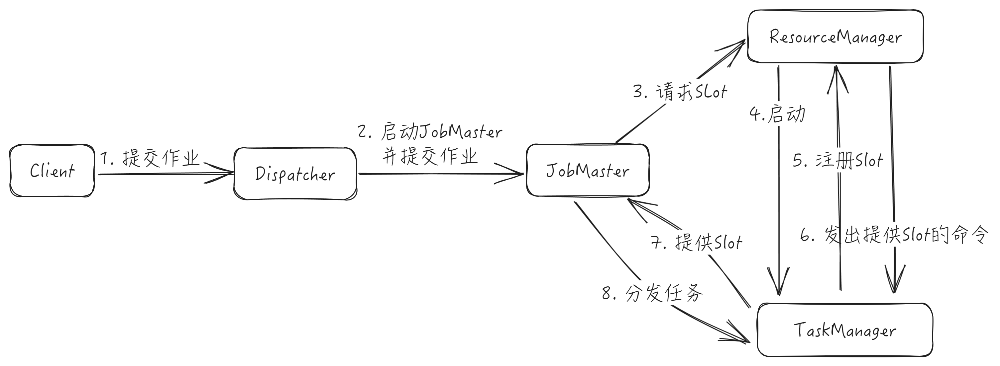

当用户开始提交一个作业，首先会将用户编写的代码转化为一个JobGraph，在这个过程中，它会进行一些检查或优化相关的工作（如生成算子链）。然后，Client再将生成的JobGraph提交到集群中执行。对于Session模式，Client直接与Dispatcher建立连接并提交作业；对于PerJob模式，Client首先向资源管理系统（如Yarn）申请资源来启动ApplicationMaster，然后再向ApplicationMaster中的Dispatcher提交作业。当作业到Dispatcher后，Dispatcher会首先启动一个JobMster，然后 JobMaster向ResourceManager申请资源来启动作业中具体的任务。ResourceManager获取到空闲的Slot之后，就会通知相应的TaskManager将该Slot分配给指定的JobMaster。

Flink作业提交调度执行通用步骤：

1. 客户端通过Dispatcher提供的REST接口，将作业提交给JobManager
2. Dispathcer启动JobMaster，并将JobGraph提交给JobMaster
3. JobMaster将JobGraph转换为ExecutionGraph，得到所需资源数量，然后向ResourceManager请求资源Slot
4. ResourceManager判断当前是否有足够的可用资源，如果没有，启动新的TaskManager
5. TaskManager启动之后，向ResourceManager注册自己的可用Slot
6. ResourceManager通知TaskManager为新的作业提供Slot
7. TaskManager连接到对应的JobMaster，提供slot
8. JobMaster将需要执行的任务分发给TaskManager
9. TaskManager执行任务，互相之间可以交换数据

按照作业是否独占Flink集群，作业运行模式分为：

+ Session模式：一个Flink集群中运行多个作业。作业共享Dispatcher、ResourceManager、Flink集群资源。适合执行时间短，频繁执行的短任务
+ Per-Job模式：一个Flink集群中只运行一个作业，作业执行完毕则Flink集群销毁，作业之间相互隔离。作业独享Dispathcer、ResourceManager、Flink集群资源。适合长周期执行的任务

YARN Session模式下，先启动一个YARN会话，这个会话创建一个Flink集群，仅启动JobManager，TaskManager根据需要动态启动。而在YARN Per-Job模式下，不会预先创建Flink集  群，而是在提交作业时才创建Flink集群。

YARN Per-Job模式作业提交调度执行具体流程为：

1. Flink Client将作业提交给YARN ResourceManager，同时将Flink Jar和配置上传到HDFS
2. YARN ResourceManager分配Container，启动Flink JobManager
3. Dispatcher启动JobMaster
4. JobMaster向ResourceManager请求Slot
5. ResourceManager向YARN ResourceManager请求Container
6. YARN ResourceManager启动新的TaskManager容器
7. TaskManager启动之后，向ResourceManager注册自己的可用任务槽
8. ResourceManager通知TaskManager为新的作业提供Slot
9. TaskManager连接到对应的JobMaster，提供Slot
10. JobMaster将需要执行的任务分发给TaskManager，执行任务

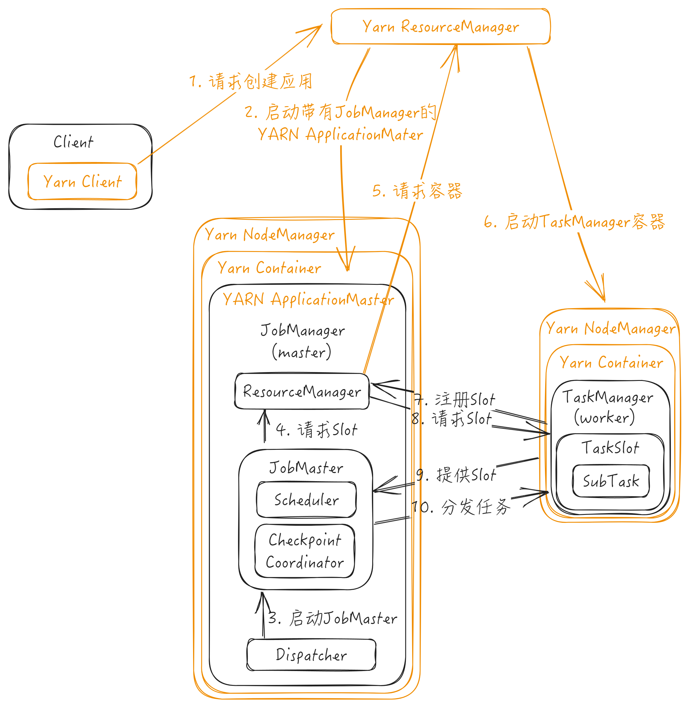

## Flink集群架构

Flink集群采用主从架构（Master/Worker），由一个JobManager进程和一个或多个TaskManager进程组成，其中，JobManager是Master，TaskManager是Worker。Client是在集群外部执行的进程，不是集群的一部分。

Client是Flink提供的CLI命令行工具，用来提交作业到Flink集群，负责流图（StreamGraph）和作业图（JobGraph）的构建、Flink SQL的解析和优化。

JobManager是Flink集群的Master节点，负责集群和作业管理，根据并行度将Client提交的Flink作业分解为Task，从资源管理框架申请所需的计算资源，分发计算任务到TaskManager执行，并负责应用容错，跟踪作业的执行状态，协调Checkpoint。JobManager包含ResourceManager、JobMaster、Dispatcher三个组件

+ JobMaster：负责执行具体某个作业，包括该作业相关的协调工作（如Task调度、Checkpoint触发、故障恢复）。Flink集群中可以同时运行多个作业，每个作业都有自己的JobMaster。狭义的JobManager就是指JobMaster。JobMaster根据并行度将Client提交的JobGraph转换为ExecutionGraph（包含了所有并发执行的Task），JobMaster向ResourceManager申请Slot执行Task，获取到Slot后将Task分发到TaskManager上运行

  + SchedulerNG：负责创建ExecutionGraph并进行调度
  + SlotPool：负责向ResourceManager申请/释放Slot资源，并维护请求到的Slot信息，Slot通过AllocationID区分。
+ ResourceManager：负责Slot的分配和管理，不同的环境和资源有不同的具体实现（YarnResourceManager、KubernetesResourceManager、StandaloneResourceManager、MesosResourceManager）。当新的作业申请Slot时，ResourceManager会将有空闲Slot的TaskManager分配给JobMaster，如果没有足够的Slot，它会向资源管理平台申请启动TaskManager进程的容器。还负责释放空闲的TaskManager
  + SlotManager：维护所有TaskManager注册的Slot（包括它们的分配情况）以及所有待处理的Slot请求，负责提供Slot信息查询，释放Slot资源，处理、取消JobMaster发送的SlotRequest，注册、取消TaskManager，只要新增可用Slot（新Slot注册或Slot释放），SlotManager都会检查待处理的SlotRequest列表，确认是否有SlotRequest可以满足，如果可以满足，就会将资源分配给这个 SlotRequest。如果没有足够可用的Slot，SlotManager会尝试申请新的资源
+ Dispathcer：主要处理作业相关的请求，负责提交、取消作业，触发、取消、清理作业的Savepoint，作业状态查询。接收用户提交的作业，并为新提交的作业启动一个新的JobMaster，还运行Flink WebUI来展示和监控作业执行的信息

TaskManager是Flink集群的Worker节点，负责Slot的资源管理、Task的生命周期（启动、停止、销毁、异常恢复等）管理、Checkpoint相关处理。启动之后，TaskManager会向ResourceManager注册它的Slot，收到ResourceManager的指令后，TaskManager就会将一个或者多个Slot提供给JobMaster调用，JobMaster就可以分配Task来执行了。在Task执行过程中，TaskManager可以缓冲数据，跟同一作业的其他TaskManager交换数据。

### JobManager

<div class='wrapper' markdown='block'>

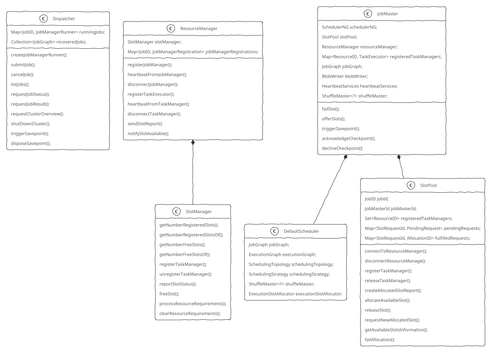

JobManager的启动类是ClusterEntrypoint，启动入口方法是runClusterEntrypoint()，最终调用runCluster()方法启动集群。runCluster()方法主要包含两个步骤：初始化相关服务和创建DispatcherResourceManagerComponent对象。DispatcherResourceManagerComponent对象在创建时会创建并启动Dispatcher和ResourceManager。

JobManager相关服务有：

+ RpcService：RPC服务
+ HighAvailabilityServices：用于Leader选举，如ResourceManager Leader、JobManager Leader
+ BlobServer：负责大文件上传，如作业Jar包、TaskManager的Log文件
+ HeartbeatService：心跳服务
+ ExecutionGraphInfoStore：存储ExecutionGraph

<details>

<summary>具体实现</summary>

```Java
class ClusterEntrypoint {

    Configuration configuration;

    static void runClusterEntrypoint(ClusterEntrypoint clusterEntrypoint) {
        String clusterEntrypointName = clusterEntrypoint.getClass().getSimpleName();
        clusterEntrypoint.startCluster();
    }

    void startCluster() {
        LOG.info("Starting {}.", ...);
        PluginManager pluginManager = PluginUtils.createPluginManagerFromRootFolder(configuration);
        configureFileSystems(configuration, pluginManager);
        runCluster(configuration, pluginManager);
    }

    void runCluster(Configuration configuration, PluginManager pluginManager) {
        // 初始化相关服务
        initializeServices(configuration, pluginManager);
        // 向configuration中写入host信息
        configuration.setString(JobManagerOptions.ADDRESS, commonRpcService.getAddress());
        configuration.setInteger(JobManagerOptions.PORT, commonRpcService.getPort());

        // 创建DispatcherResourceManagerComponent对象，这个对象创建时会启动Dispatcher和ResourceManager
        DispatcherResourceManagerComponentFactory dispatcherResourceManagerComponentFactory = createDispatcherResourceManagerComponentFactory(configuration);
        clusterComponent = dispatcherResourceManagerComponentFactory.create(
            configuration,
            ioExecutor,
            commonRpcService,
            haServices,
            blobServer,
            heartbeatServices,
            metricRegistry,
            executionGraphInfoStore,
            new RpcMetricQueryServiceRetriever(metricRegistry.getMetricQueryServiceRpcService()),
            this);
    }
    void initializeServices(Configuration configuration, PluginManager pluginManager) {
        LOG.info("Initializing cluster services.");

        // 创建RPC服务
        rpcSystem = RpcSystem.load(configuration);
        commonRpcService = RpcUtils.createRemoteRpcService(...);
        JMXService.startInstance(configuration.getString(JMXServerOptions.JMX_SERVER_PORT));
        // update the configuration used to create the high availability services
        // 根据创建的RPC服务信息进行相关配置
        configuration.setString(JobManagerOptions.ADDRESS, commonRpcService.getAddress());
        configuration.setInteger(JobManagerOptions.PORT, commonRpcService.getPort());
        // 创建用于IO的线程池
        ioExecutor = Executors.newFixedThreadPool(
            ClusterEntrypointUtils.getPoolSize(configuration),
            new ExecutorThreadFactory("cluster-io"));
        // HA Service
        haServices = createHaServices(configuration, ioExecutor, rpcSystem);
        // 创建并启动BlobServer
        blobServer = new BlobServer(configuration, haServices.createBlobStore());
        blobServer.start();
        // 心跳服务
        heartbeatServices = createHeartbeatServices(configuration);
        // metric reporter
        metricRegistry = createMetricRegistry(configuration, pluginManager, rpcSystem);
        RpcService metricQueryServiceRpcService = MetricUtils.startRemoteMetricsRpcService(configuration, commonRpcService.getAddress(), rpcSystem);
        metricRegistry.startQueryService(metricQueryServiceRpcService, null);
        String hostname = RpcUtils.getHostname(commonRpcService);
        processMetricGroup = MetricUtils.instantiateProcessMetricGroup(...);
        // 创建一个ExecutionGraphInfoStore对象，存储作业的ExecutionGraph
        executionGraphInfoStore = createSerializableExecutionGraphStore(configuration, commonRpcService.getScheduledExecutor());
    }
}

class DefaultDispatcherResourceManagerComponentFactory implements DispatcherResourceManagerComponentFactory
{
    DispatcherResourceManagerComponent create(
        Configuration configuration,
        Executor ioExecutor,
        RpcService rpcService,
        HighAvailabilityServices highAvailabilityServices,
        BlobServer blobServer,
        HeartbeatServices heartbeatServices,
        MetricRegistry metricRegistry,
        ExecutionGraphInfoStore executionGraphInfoStore,
        MetricQueryServiceRetriever metricQueryServiceRetriever,
        FatalErrorHandler fatalErrorHandler) {

        WebMonitorEndpoint<?> webMonitorEndpoint = null;
        ResourceManagerService resourceManagerService = null;
        DispatcherRunner dispatcherRunner = null;

        // 用于Dispatcher Leader选举
        LeaderRetrievalService dispatcherLeaderRetrievalService = highAvailabilityServices.getDispatcherLeaderRetriever();
        // 用于ResourceManager Leader选举
        LeaderRetrievalService resourceManagerRetrievalService = highAvailabilityServices.getResourceManagerLeaderRetriever();
        // DispatcherGateway
        LeaderGatewayRetriever<DispatcherGateway> dispatcherGatewayRetriever = new RpcGatewayRetriever<>(...);
        // ResourceManagerGateway
        LeaderGatewayRetriever<ResourceManagerGateway> resourceManagerGatewayRetriever = new RpcGatewayRetriever<>(...);
        // Web UI
        ScheduledExecutorService executor = WebMonitorEndpoint.createExecutorService(...);
        long updateInterval = configuration.getLong(MetricOptions.METRIC_FETCHER_UPDATE_INTERVAL);
        MetricFetcher metricFetcher = updateInterval == 0
            ? VoidMetricFetcher.INSTANCE
            : MetricFetcherImpl.fromConfiguration(...);
        WebMonitorEndpoint<?> webMonitorEndpoint = restEndpointFactory.createRestEndpoint(...);
        // 启动Dispatcher REST
        log.debug("Starting Dispatcher REST endpoint.");
        webMonitorEndpoint.start();
        // 创建ResourceManager
        String hostname = RpcUtils.getHostname(rpcService);
        ResourceManagerService resourceManagerService = ResourceManagerServiceImpl.create(...);
        HistoryServerArchivist historyServerArchivist = HistoryServerArchivist.createHistoryServerArchivist(...);
        PartialDispatcherServices partialDispatcherServices = new PartialDispatcherServices(...);
        // 启动Dispatcher
        log.debug("Starting Dispatcher.");
        dispatcherRunner = dispatcherRunnerFactory.createDispatcherRunner(...);
        // 启动ResourceManager
        log.debug("Starting ResourceManagerService.");
        resourceManagerService.start();
        resourceManagerRetrievalService.start(resourceManagerGatewayRetriever);
        dispatcherLeaderRetrievalService.start(dispatcherGatewayRetriever);

        return new DispatcherResourceManagerComponent(
            dispatcherRunner,
            resourceManagerService,
            dispatcherLeaderRetrievalService,
            resourceManagerRetrievalService,
            webMonitorEndpoint,
            fatalErrorHandler);
    }
}
```

</details>

### TaskManager

<div class='wrapper' markdown='block'>

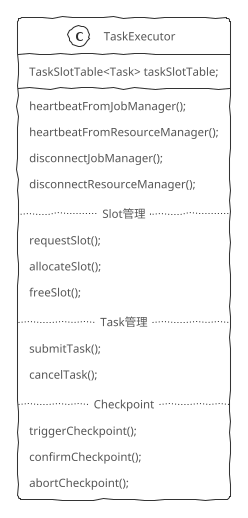

</div>

TaskManager的启动类是TaskManagerRunner，负责创建并启动相关服务（network, I/O manager, memory manager, RPC service, HA service）。TaskExecutor是TaskManager核心组件，负责具体处理工作，如与JobManager通信、Slot管理、Task管理、执行Checkpoint等，TaskManagerServices维护了TaskManager上的所有服务，TaskManagerGateway是外部与TaskManager交互的组件。

TaskManager启动入口方法是runTaskManager()，创建TaskManagerRunner对象，启动TaskManager。

<details>

<summary>具体实现</summary>

```Java
class TaskManagerRunner
{
    // 执行回调方法的Executor
    ExecutorService executor;
    TaskExecutorService taskExecutorService;

    static int runTaskManager(Configuration configuration, PluginManager pluginManager) {
        // 启动TaskManagerRunner
        TaskManagerRunner taskManagerRunner =
            new TaskManagerRunner(
                configuration,
                pluginManager,
                TaskManagerRunner::createTaskExecutorService);  // taskExecutorServiceFactory
        // 启动TaskExecutor
        taskManagerRunner.taskExecutorService.taskExecutor.start();
        return taskManagerRunner.getTerminationFuture()
            .get()
            .getExitCode();
    }
    static TaskExecutor startTaskManager(
        Configuration configuration,
        ResourceID resourceID,
        RpcService rpcService,
        HighAvailabilityServices highAvailabilityServices,
        HeartbeatServices heartbeatServices,
        MetricRegistry metricRegistry,
        BlobCacheService blobCacheService,
        boolean localCommunicationOnly,
        ExternalResourceInfoProvider externalResourceInfoProvider,
        FatalErrorHandler fatalErrorHandler) {

        LOG.info("Starting TaskManager with ResourceID: {}", ...);

        String externalAddress = rpcService.getAddress();
        TaskExecutorResourceSpec taskExecutorResourceSpec = TaskExecutorResourceUtils.resourceSpecFromConfig(configuration);

        // TaskManager服务相关配置
        TaskManagerServicesConfiguration taskManagerServicesConfiguration = TaskManagerServicesConfiguration.fromConfiguration(...);
        // TaskManagerMetricGroup
        Tuple2<TaskManagerMetricGroup, MetricGroup> taskManagerMetricGroup = MetricUtils.instantiateTaskManagerMetricGroup(...);
        // TaskManagerService，初始化TaskManager相关服务
        ExecutorService ioExecutor = Executors.newFixedThreadPool(...);
        TaskManagerServices taskManagerServices = TaskManagerServices.fromConfiguration(...);

        // TaskManager相关配置，用于TaskExecutor初始化
        TaskManagerConfiguration taskManagerConfiguration = TaskManagerConfiguration.fromConfiguration(...);

        // 创建TaskExecutor对象
        return new TaskExecutor(
            rpcService,
            taskManagerConfiguration,
            highAvailabilityServices,
            taskManagerServices,
            externalResourceInfoProvider,
            heartbeatServices,
            taskManagerMetricGroup.f0,  // taskManagerMetricGroup
            metricQueryServiceAddress,
            blobCacheService,
            fatalErrorHandler,
            new TaskExecutorPartitionTrackerImpl(taskManagerServices.getShuffleEnvironment()));    // partitionTracker
    }

    TaskManagerRunner(
        Configuration configuration,
        PluginManager pluginManager,
        TaskExecutorServiceFactory taskExecutorServiceFactory) {
        rpcSystem = RpcSystem.load(configuration);
        timeout = Time.fromDuration(configuration.get(AkkaOptions.ASK_TIMEOUT_DURATION));
        // Executor
        this.executor = java.util.concurrent.Executors.newScheduledThreadPool(...);
        // HA Service
        highAvailabilityServices = HighAvailabilityServicesUtils.createHighAvailabilityServices(...);
        // JMXService
        JMXService.startInstance(configuration.getString(JMXServerOptions.JMX_SERVER_PORT));
        // RCP Service
        rpcService = createRpcService(configuration, highAvailabilityServices, rpcSystem);
        this.resourceId = getTaskManagerResourceID(configuration, rpcService.getAddress(), rpcService.getPort());
        // 心跳服务
        HeartbeatServices heartbeatServices = HeartbeatServices.fromConfiguration(configuration);
        // metric服务
        metricRegistry = new MetricRegistryImpl(...);
        RpcService metricQueryServiceRpcService = MetricUtils.startRemoteMetricsRpcService(...);
        metricRegistry.startQueryService(metricQueryServiceRpcService, resourceId);
        // bolb服务
        blobCacheService = new BlobCacheService(...);
        // ExternalResourceInfoProvider
        ExternalResourceInfoProvider externalResourceInfoProvider = ExternalResourceUtils.createStaticExternalResourceInfoProviderFromConfig(...);

        // 启动TaskManager
        TaskExecutor taskExecutor = startTaskManager(
            this.configuration,
            this.resourceId,
            rpcService,
            highAvailabilityServices,
            heartbeatServices,
            metricRegistry,
            blobCacheService,
            false,         // localCommunicationOnly
            externalResourceInfoProvider,
            this);        // fatalErrorHandler
        // 将TaskExecutor包装成TaskExecutorService
        taskExecutorService = TaskExecutorToServiceAdapter.createFor(taskExecutor);
    }
}

// TaskManagerServices是TaskExecutor相关服务的容器，如MemoryManager、IOManager、ShuffleEnvironment，所有服务都是一个TaskExecutor独占的
class TaskManagerServices
{
    static TaskManagerServices fromConfiguration(
        TaskManagerServicesConfiguration taskManagerServicesConfiguration,
        PermanentBlobService permanentBlobService,
        MetricGroup taskManagerMetricGroup,
        ExecutorService ioExecutor,
        FatalErrorHandler fatalErrorHandler) {

        // TaskEventDispatcher
        TaskEventDispatcher taskEventDispatcher = new TaskEventDispatcher();
        // IOManager
        IOManager ioManager = new IOManagerAsync(...);
        // ShuffleEnvironment，默认是NettyShuffleEnvironment
        ShuffleEnvironment<?, ?> shuffleEnvironment = createShuffleEnvironment(...);
        int listeningDataPort = shuffleEnvironment.start();
        // KvStateService
        KvStateService kvStateService = KvStateService.fromConfiguration(...);
        kvStateService.start();
        // TaskManagerLocation
        UnresolvedTaskManagerLocation unresolvedTaskManagerLocation = new UnresolvedTaskManagerLocation(...);
        // BroadcastVariableManager
        BroadcastVariableManager broadcastVariableManager = new BroadcastVariableManager();

        // TaskSlotTable
        // TaskManager上的Slot数目，默认是1
        int numberOfSlots = taskManagerServicesConfiguration.numberOfSlots;
        // 超时检测服务，在TaskSlotTable中用于监控Slot分配是否超时
        TimerService<AllocationID> timerService = new TimerService<>(new ScheduledThreadPoolExecutor(1), taskManagerServicesConfiguration.timerServiceShutdownTimeout);
        // TaskManager资源信息
        TaskExecutorResourceSpec taskExecutorResourceSpec = taskManagerServicesConfiguration.taskExecutorResourceSpec;
        ResourceProfile totalResourceProfile =
            ResourceProfile.newBuilder()
                .setCpuCores(taskExecutorResourceSpec.cpuCores)
                .setTaskHeapMemory(taskExecutorResourceSpec.taskHeapSize)
                .setTaskOffHeapMemory(taskExecutorResourceSpec.taskOffHeapSize)
                .setManagedMemory(taskExecutorResourceSpec.managedMemorySize)
                .setNetworkMemory(taskExecutorResourceSpec.networkMemSize)
                .setExtendedResources(taskExecutorResourceSpec.extendedResources.values())
                .build();
        // TaskManager上单个Slot的资源信息
        ResourceProfile.Builder defaultSlotResourceBuilder =
            ResourceProfile.newBuilder()
                .setCpuCores(taskExecutorResourceSpec.cpuCores.divide(numberOfSlots))
                .setTaskHeapMemory(taskExecutorResourceSpec.taskHeapSize.divide(numberOfSlots))
                .setTaskOffHeapMemory(taskExecutorResourceSpec.taskOffHeapSize.divide(numberOfSlots))
                .setManagedMemory(taskExecutorResourceSpec.managedMemorySize.divide(numberOfSlots))
                .setNetworkMemory(taskExecutorResourceSpec.networkMemSize.divide(numberOfSlots));
        taskExecutorResourceSpec
            .getExtendedResources()
            .forEach((name, resource) ->
                defaultSlotResourceBuilder.setExtendedResource(resource.divide(numberOfSlots)));
        ResourceProfile defaultSlotResourceProfile = defaultSlotResourceBuilder.build();
        // 创建TaskSlotTable
        TaskSlotTable<Task> taskSlotTable = new TaskSlotTableImpl<>(
            numberOfSlots,
            totalAvailableResourceProfile,
            taskExecutorResourceSpec,
            taskManagerServicesConfiguration.pageSize,      // memoryPageSize
            timerService,
            ioExecutor);         // memoryVerificationExecutor

        // JobTable，维护jobId与JobManager连接之间的关系
        JobTable jobTable = DefaultJobTable.create();
        // 监控注册的Job的JobManager Leader
        JobLeaderService jobLeaderService = new DefaultJobLeaderService(...);
        String[] stateRootDirectoryStrings = taskManagerServicesConfiguration.getLocalRecoveryStateRootDirectories();
        File[] stateRootDirectoryFiles = new File[stateRootDirectoryStrings.length];
        for (int i = 0; i < stateRootDirectoryStrings.length; ++i) {
            stateRootDirectoryFiles[i] = new File(stateRootDirectoryStrings[i], LOCAL_STATE_SUB_DIRECTORY_ROOT);
        }
        // TaskExecutorLocalStateStoresManager，维护状态信息
        TaskExecutorLocalStateStoresManager taskStateManager = new TaskExecutorLocalStateStoresManager(...);
        // TaskExecutorStateChangelogStoragesManager
        TaskExecutorStateChangelogStoragesManager changelogStoragesManager = new TaskExecutorStateChangelogStoragesManager();
        // LibraryCacheManager
        LibraryCacheManager libraryCacheManager = new BlobLibraryCacheManager(...);
        // 将上面的服务封装到TaskManagerServices中
        return new TaskManagerServices(
            unresolvedTaskManagerLocation,
            taskManagerServicesConfiguration.getManagedMemorySize().getBytes(),
            ioManager,
            shuffleEnvironment,
            kvStateService,
            broadcastVariableManager,
            taskSlotTable,
            jobTable,
            jobLeaderService,
            taskStateManager,
            changelogStoragesManager,
            taskEventDispatcher,
            ioExecutor,
            libraryCacheManager);
    }
}

class TaskExecutor extends RpcEndpoint implements TaskExecutorGateway
{
    // TaskSlotTable主要功能有以下几点：
    // + 维护TaskSlot与Task及Job的关系
    // + 维护TaskSlot的状态
    // + TaskSlot在进行allocate/free操作时通过TimeService做超时检测
    TaskSlotTable<Task> taskSlotTable;

    void onStart() {
        // startTaskExecutorServices，启动TaskManager相关服务
        // 向ResourceManager注册TaskManager
        // 与ResourceManager建立连接并创建一个Listener，监控ResourceManager的Leader变化，如果有新的Leader被选举出来，将会调用notifyLeaderAddress()方法去触发与 ResourceManager的重连
        resourceManagerLeaderRetriever.start(new ResourceManagerLeaderListener());
        // 启动TaskSlotTable
        taskSlotTable.start(new SlotActionsImpl(), getMainThreadExecutor());
        // 启动JobLeaderService
        // 向JobManager注册TaskManager，与JobManager建立连接并创建一个JobLeaderListener，监控JobManager的Leader变化
        jobLeaderService.start(getAddress(), getRpcService(), haServices, new JobLeaderListenerImpl());
        fileCache = new FileCache(
            taskManagerConfiguration.getTmpDirectories(),
            blobCacheService.getPermanentBlobService());
        // 注册超时检测，如果超时还未注册完成，就抛出错误，启动失败
        startRegistrationTimeout();
    }

    class ResourceManagerLeaderListener implements LeaderRetrievalListener {
        // ResourceManager重新选举Leader后会调用这个方法通知TaskManager
        void notifyLeaderAddress(String leaderAddress, UUID leaderSessionID) {
            runAsync(() -> {
                // notifyOfNewResourceManagerLeader
                // 创建一个新的ResourceManagerAddress
                resourceManagerAddress = new ResourceManagerAddress(leaderAddress, ResourceManagerId.fromUuidOrNull(leaderSessionID));
                // 注册超时检测，如果超时还未注册完成，就抛出错误，连接失败
                startRegistrationTimeout();
                // ConnectToResourceManager，与ResourceManager建立连接
                log.info("Connecting to ResourceManager {}.", ...);
                TaskExecutorRegistration taskExecutorRegistration = new TaskExecutorRegistration(...);
                resourceManagerConnection = new TaskExecutorToResourceManagerConnection(
                    log,
                    getRpcService(),
                    taskManagerConfiguration.getRetryingRegistrationConfiguration(),
                    resourceManagerAddress.getAddress(),
                    resourceManagerAddress.getResourceManagerId(),
                    getMainThreadExecutor(),
                    new ResourceManagerRegistrationListener(),
                    taskExecutorRegistration);
                // TaskExecutorToResourceManagerConnection对象启动后会向ResourceManager注册TaskManager
                // ResourceManager接收到请求后，先从缓存中移除旧的TaskManager注册信息，然后更新缓存，并增加心跳监控
                resourceManagerConnection.start();
            }
        }
    }
    class JobLeaderListenerImpl implements JobLeaderListener {
        void jobManagerGainedLeadership(
            JobID jobId,
            JobMasterGateway jobManagerGateway,
            JMTMRegistrationSuccess registrationMessage);
        void jobManagerLostLeadership(JobID jobId, JobMasterId jobMasterId);
        void jobManagerRejectedRegistration(
            JobID jobId,
            String targetAddress,
            JMTMRegistrationRejection rejection);
    }
}
```

</details>

#### Mailbox线程模型

<div class='wrapper' markdown='block'>

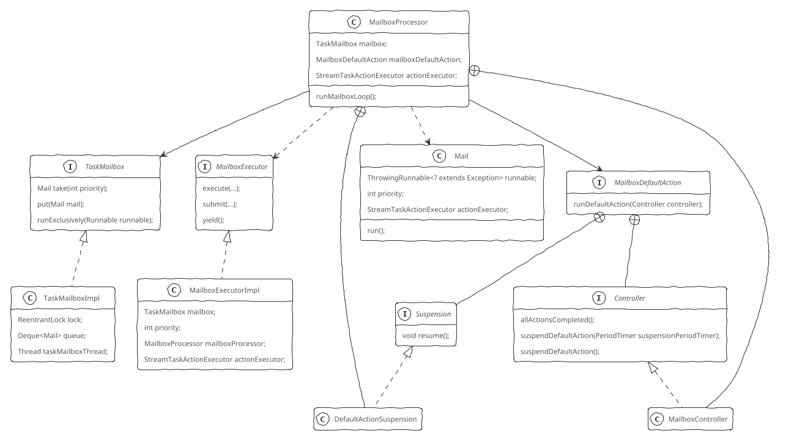

</div>

Flink 1.10之前通过全局锁checkpointLock控制线程间的并发，确保线程安全地状态，代码复杂，暴露锁对象，容易引发线程安全问题。checkpointLock主要用在三个地方：

+ 事件处理：包括Event、Watermark、Barriers、LatencyMarker的处理和发送
+ Checkpoint触发：Source中通过RPC调用触发Checkpoint，通知Checkpoint的完成情况
+ 处理时间定时器: 通过ScheduledExecutor异步执行

Flink 1.10引入了类似Actor的Mailbox线程模型^[FLINK-12477: https://issues.apache.org/jira/browse/FLINK-12477]。Mailbox线程模型借鉴了Actor模型，核心思想是通过单个Mailbox线程配合阻塞队列的方式，所有需要处理的事件都封装成一个Mail投递到Mailbox中，然后按先后顺序由单线程循环处理事件，将内部状态的修改交由单个线程完成，从而避免多线程的问题，另外还方便控制事件处理的优先级。对于Checkpoint触发和处理时间定时器，只需要将对应的操作封装为Mail投递到Mailbox中，等待Mailbox线程进行处理即可。

Mailbox线程模型核心抽象：

+ Mail：封装了需要处理的消息和相应的动作
+ Mailbox：用于存储需要处理的消息，即 Mail，对应接口TaskMailbox及其实现TaskMailboxImpl。使用一个Deque存储写入的Mail，对Deque读写通过一个ReentrantLock来加以保护。Mailbox支持优先级控制，每一个Mail都有其优先级，从TaskMailbox获取Mail时可以指定优先级，实际通过遍历队列元素比较优先级实现。
+ MailboxProcessor：从Mailbox中取出信件并处理。核心是事件的循环处理，循环中，除了处理 Mailbox中的事件外，还执行默认行为MailboxDefaultAction

    <details>
    <summary>具体实现</summary>
    ```Java
    class MailboxProcessor
    {
        // 存储要处理的消息，如Checkpoint触发、处理时间定时器等
        TaskMailbox mailbox;
        // Mailbox中没有要处理消息时的默认执行动作，一般为记录处理processInput()
        MailboxDefaultAction mailboxDefaultAction;
        // 暂停事件处理循环标记
        boolean suspended;
        // 循环处理事件
        void runMailboxLoop() {
            suspended = !mailboxLoopRunning;
            TaskMailbox localMailbox = mailbox;
            // 确保当前调用必须发生在Mailbox的事件处理线程中
            assert localMailbox.isMailboxThread();
            MailboxController defaultActionContext = new MailboxController(this);
            // 事件处理循环
            while (!suspended) {
                // 处理事件，这是一个阻塞方法
                processMail(localMailbox, false);
                //  再做一次检查，因为上面的mail处理可能会改变运行状态
                if (!suspended) {
                    // 执行默认行为
                    mailboxDefaultAction.runDefaultAction(defaultActionContext);
                }
            }
        }
        // 处理消息
        boolean processMail(TaskMailbox mailbox, boolean singleStep) {
            boolean isBatchAvailable = mailbox.createBatch();
            boolean processed = isBatchAvailable && processMailsNonBlocking(singleStep);
            if (singleStep) {
                return processed;
            }
            processed |= processMailsWhenDefaultActionUnavailable();
            return processed;
        }
        boolean processMailsNonBlocking(boolean singleStep) {
            long processedMails = 0;
            Optional<Mail> maybeMail;
            while (!suspended && (maybeMail = Optional.ofNullable(mailbox.batch.pollFirst())).isPresent()) {
                if (processedMails++ == 0) {
                    maybePauseIdleTimer();
                }
                maybeMail.get().run();
                if (singleStep) {
                    break;
                }
            }
            if (processedMails > 0) {
                maybeRestartIdleTimer();
                return true;
            } else {
                return false;
            }
        }
        void maybePauseIdleTimer() {
            if (suspendedDefaultAction != null
                && suspendedDefaultAction.suspensionTimer != null) {
                suspendedDefaultAction.suspensionTimer.markEnd();
            }
        }
    }
    ```
    </details>
+ MailboxExecutor：向Mailbox中投递信件，提交Mail的行为可以在任意线程中进行。不考虑优先级时，所有事件按FIFO顺序处理，对于一个事件处理需要依赖后续事件处理的情景，MailboxExecutor的yield()方法会暂时让出对当前事件的处理，从队列中取出下一个事件进行处理，这个方法必须在Mailbox事件处理线程中调用
+ MailboxDefaultAction：MailboxProcessor的默认动作，主要负责处理基础的StreamEvent、Barrier、Watermark等。在Mailbox主线程的循环中，处理完新的Mail后就会执行该动作。MailboxDefaultAction通过一个MailboxController和Mailbox进行交互，可以借此获悉所有的事件都处理完毕，或者临时暂停MailboxDefaultAction

MailboxDefaultAction和Mail的区别在于，Mail用于控制类消息处理，例如Checkpoint触发，而MailboxDefaultAction用于数据流上的普通消息处理（如正常的数据记录，Barrier）等。数据流上的消息数据量比较大，通过邮箱内部队列进行处理开销比较大。

### OperatorChain

Transformation转换为JobGraph时进行了算子链优化，即 将多个算子链接在一起，在执行层面上对应的是OperatorChain。无论是单个算子还是链接在一起的多个算子，都会被构造成OperatorChain。单个算子的OperatorChain输出计算结果时包含了两层Output，CountingOutput用来统计算子的输出数据元素个数，RecordWriterOutput用来序列化数据，写入NetworkBuffer，交给下游算子，同时计算 向下游发送的字节总数 和 向下游发送的Buffer总数两个监控指标。两个或两个以上算子构成的OperatorChain，算子之间包含了两层Output，CountingOutput用来统计上游算子输出的元素个数，ChainingOutput用来统计Watermark和校友算子的输入数据元素个数。

### Task

<div class='wrapper' markdown='block'>

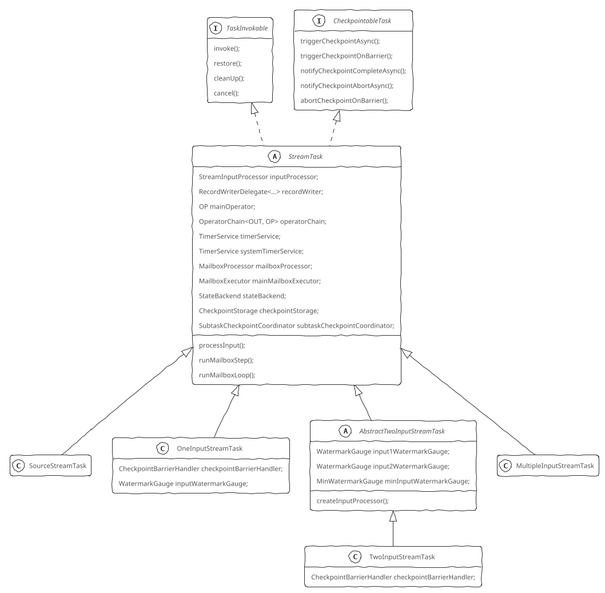

一个Flink Job提交到集群中运行时，会被调度为不同的Task。Task是TaskManager部署和执行的本地计算单元，提供任务执行基础组件：

+ MemoryManager：负责申请和释放内存
+ IOManager
+ TaskStateManager：与JobMaster交互，汇报状态
+ ResultPartitionWriter

TaskInvokable是Task执行的主要逻辑，也是所有被执行任务的基类，包括Streaming模式和Batch模式。在Streaming模式下，所有任务都继承自StreamTask，包括SourceStreamTask、OneInputStreamTask、TwoInputStreamTask以及迭代模式下的StreamIterationHead和 StreamIterationTail。

StreamTask是OperatorChain的执行容器，其输入流是头算子的输入流，输出流是算子链末尾算子的输出流（算子链可能存在多个末尾算子）。

每一个StreamNode在添加到StreamGraph时都会有一个关联的jobVertexClass属性，描述该StreamNode对应的StreamTask类型，OperatorChain对应的StreamTask就是其head operator对应的StreamTask。

StreamTask完整的生命周期包括：

+ 创建状态存储后端，为OperatorChain中的所有算子提供状态
+ 加载OperatorChain中的所有算子
+ 所有Operator调用setup()
+ Task相关的初始化操作
+ 所有Operator调用initializeState()初始化状态
+ 所有的Operator调用open()
+ run()方法循环处理数据：Task通过循环调用InputGate的getNextBufferOrEvent()方法获取输入数据，并将获取的数据交给它所封装的算子进行处理，这构成了一个Task的基本运行逻辑
+ 所有Operator调用close()
+ 所有Operator调用dispose()
+ 通用的cleanup()操作
+ Task相关的cleanup()操作

<details>

<summary>具体实现</summary>

```Java
abstract class StreamTask<OUT, OP extends StreamOperator<OUT>>
    extends CheckpointableTask, CoordinatedTask
{
    StreamInputProcessor inputProcessor;
    RecordWriterDelegate<SerializationDelegate<StreamRecord<OUT>>> recordWriter;
    OP mainOperator;
    OperatorChain<OUT, OP> operatorChain;
    TimerService timerService;
    MailboxProcessor mailboxProcessor;

    void invoke() {
        LOG.debug("Initializing {}.", ...);
        //创建OperatorChain，会加载每一个Operator，并调用setup()方法
        operatorChain = getEnvironment().getTaskStateManager().isFinishedOnRestore()
            ? new FinishedOperatorChain<>(this, recordWriter)
            : new RegularOperatorChain<>(this, recordWriter);
        mainOperator = operatorChain.getMainOperator();
        getEnvironment()
            .getTaskStateManager()
            .getRestoreCheckpointId()
            .ifPresent(restoreId -> latestReportCheckpointId = restoreId);
        // 具体StreamTask子类相关的初始化操作
        init();
        LOG.debug("Invoking {}", ...);
        isRunning = true;
        // 开始处理数据
        mailboxProcessor.runMailboxLoop();
        // afterInvoke
        LOG.debug("Finished task {}", getName());
        timerService.quiesce();
        systemTimerService.quiesce();
        mailboxProcessor.prepareClose()
        mailboxProcessor.drain();
        isRunning = false;
        operatorChain.flushOutputs();
        subtaskCheckpointCoordinator.waitForPendingCheckpoints();
        closeAllOperators();
    }

    void processInput(MailboxDefaultAction.Controller controller) {
        DataInputStatus status = inputProcessor.processInput();
        switch (status) {
            case MORE_AVAILABLE:
                if (recordWriter.isAvailable()) {
                    return;
                }
                break;
            case NOTHING_AVAILABLE:
                break;
            case END_OF_RECOVERY:
                throw new IllegalStateException("We should not receive this event here.");
            case END_OF_DATA:
                endData();
                return;
            case END_OF_INPUT:
                controller.suspendDefaultAction();
                mailboxProcessor.suspend();
                return;
        }
        PeriodTimer timer;
        CompletableFuture<?> resumeFuture;
        if (!recordWriter.isAvailable()) {
            timer = new GaugePeriodTimer(...);
            resumeFuture = recordWriter.getAvailableFuture();
        } else {
            timer = new ThroughputPeriodTimer(...);
            resumeFuture = inputProcessor.getAvailableFuture();
        }
        resumeFuture.thenRun(new ResumeWrapper(controller.suspendDefaultAction(timer), timer)));
    }
}
```

</details>

SourceStreamTask负责为下游任务生成数据，没有输入，只负责对外输出记录。

<details>

<summary>具体实现</summary>

```Java
class SourceStreamTask<OUT, SRC extends SourceFunction<OUT>, OP extends StreamSource<OUT, SRC>>
    extends StreamTask<OUT, OP>
{
    @Override
    void init() {
        SourceFunction<?> source = mainOperator.userFunction();
        if (source instanceof ExternallyInducedSource) {
            // 如果SourceFunction是ExternallyInducedSource，则需要创建一个CheckpointTrigger对象提供给ExternallyInducedSource
            externallyInducedCheckpoints = true;
            ExternallyInducedSource.CheckpointTrigger triggerHook = new ExternallyInducedSource.CheckpointTrigger() {
                @Override
                void triggerCheckpoint(long checkpointId) {
                    CheckpointOptions checkpointOptions = CheckpointOptions.forConfig(
                        CheckpointType.CHECKPOINT,
                        CheckpointStorageLocationReference.getDefault(),
                        configuration.isExactlyOnceCheckpointMode(),
                        configuration.isUnalignedCheckpointsEnabled(),
                        configuration.getAlignedCheckpointTimeout().toMillis());
                    long timestamp = System.currentTimeMillis();
                    CheckpointMetaData checkpointMetaData = new CheckpointMetaData(checkpointId, timestamp, timestamp);
                    SourceStreamTask.super
                        .triggerCheckpointAsync(checkpointMetaData, checkpointOptions)
                        .get();
                }
            };
            ((ExternallyInducedSource<?, ?>) source).setCheckpointTrigger(triggerHook);
        }
        getEnvironment()
            .getMetricGroup()
            .getIOMetricGroup()
            .gauge(MetricNames.CHECKPOINT_START_DELAY_TIME,
                   this::getAsyncCheckpointStartDelayNanos);
    }

    @Override
    void processInput(MailboxDefaultAction.Controller controller) {
        // 对source而言，就是调用main operator的run()方法
        // mainOperator就是一个StreamSource，最终会调用SourceFunction的run()方法，一般是一个循环
        // mainOperator通过Output将数据传递给下游的算子
        controller.suspendDefaultAction();
        mainOperator.run(lock, operatorChain);
        mailboxProcessor.suspend();
    }
}
```

</details>

OneInputStreamTask主要执行逻辑是不断循环调用StreamInputProcessor的processInpt()方法，StreamInputProcessor从缓冲区中读取记录或Watermark等消息，然后调用streamOperator的processElement()交给head operator进行处理，并依次将处理结果交给下游算子。TwoInputStreamTask对两个上游的输入分别调用TwoInputStreamOperator的processElement1()和TwoInputStreamOperator的processElement2()进行处理。

<details>

<summary>具体实现</summary>

```Java
class OneInputStreamTask<IN, OUT>
    extends StreamTask<OUT, OneInputStreamOperator<IN, OUT>>
{
    @Override
    void init() {
        // 创建一个StreamInputProcessor
        StreamConfig configuration = getConfiguration();
        int numberOfInputs = configuration.getNumberOfNetworkInputs();
        if (numberOfInputs > 0) {
            // createCheckpointedInputGate
            IndexedInputGate[] inputGates = getEnvironment().getAllInputGates();
            checkpointBarrierHandler = InputProcessorUtil.createCheckpointBarrierHandler(
                this,
                configuration,
                getCheckpointCoordinator(),
                getTaskNameWithSubtaskAndId(),
                new List[] {Arrays.asList(inputGates)},
                Collections.emptyList(),
                mainMailboxExecutor,
                systemTimerService);
            CheckpointedInputGate[] checkpointedInputGates =
                InputProcessorUtil.createCheckpointedMultipleInputGate(
                    mainMailboxExecutor,
                    new List[] {Arrays.asList(inputGates)},
                    getEnvironment().getMetricGroup().getIOMetricGroup(),
                    checkpointBarrierHandler,
                    configuration);
            CheckpointedInputGate inputGate = Iterables.getOnlyElement(Arrays.asList(checkpointedInputGates));
            Counter numRecordsIn = mainOperator
                .getMetricGroup()
                .getIOMetricGroup()
                .getNumRecordsInCounter();
            DataOutput<IN> output = new StreamTaskNetworkOutput<>(
                operatorChain.getFinishedOnRestoreInputOrDefault(mainOperator),
                inputWatermarkGauge,
                numRecordsIn);
            // createTaskInput
            int numberOfInputChannels = inputGate.getNumberOfInputChannels();
            StatusWatermarkValve statusWatermarkValve = new StatusWatermarkValve(numberOfInputChannels);
            TypeSerializer<IN> inSerializer = configuration.getTypeSerializerIn1(getUserCodeClassLoader());
            StreamTaskInput<IN> input = StreamTaskNetworkInputFactory.create(
                inputGate,
                inSerializer,
                getEnvironment().getIOManager(),
                statusWatermarkValve,
                0,
                getEnvironment().getTaskStateManager().getInputRescalingDescriptor(),
                gateIndex -> configuration.getInPhysicalEdges(getUserCodeClassLoader()).get(gateIndex).getPartitioner(),
                getEnvironment().getTaskInfo());
            StreamConfig.InputConfig[] inputConfigs = configuration.getInputs(getUserCodeClassLoader());
            StreamConfig.InputConfig inputConfig = inputConfigs[0];
            if (requiresSorting(inputConfig)) {
                input = wrapWithSorted(input);
            }
            getEnvironment()
                .getMetricGroup()
                .getIOMetricGroup()
                .reuseRecordsInputCounter(numRecordsIn);
            inputProcessor = new StreamOneInputProcessor<>(input, output, operatorChain);
        }
        mainOperator
            .getMetricGroup()
            .gauge(MetricNames.IO_CURRENT_INPUT_WATERMARK, inputWatermarkGauge);
        getEnvironment()
            .getMetricGroup()
            .gauge(MetricNames.IO_CURRENT_INPUT_WATERMARK, inputWatermarkGauge::getValue);
    }
}
```

</details>

#### 网络栈

NetworkEnvironment通过ConnectionManager来管理所有的网络的连接，NetworkEnvironment在启动时会创建并启动NettyClient和NettyServer，NettyServer会启动一个服务端监听，等待其它NettyClient的连接。NettyProtocal中提供了NettyClient和NettyServer引导启动注册的一系列ChannelHandler。

<details>

<summary>具体实现</summary>

```Java
class NettyConnectionManager implements ConnectionManager {
    NettyServer server;
    NettyClient client;
    NettyBufferPool bufferPool;
    NettyProtocol nettyProtocol;
    PartitionRequestClientFactory partitionRequestClientFactory;

    int start() {
        // 初始化Netty Client
        client.init(nettyProtocol, bufferPool);
        // 初始化并启动Netty Server
        return server.init(nettyProtocol, bufferPool);
    }
}
class NettyProtocol {
    // Netty Server端的ChannelHandler
    ChannelHandler[] getServerChannelHandlers() {
        // 
        PartitionRequestQueue queueOfPartitionQueues = new PartitionRequestQueue();
        PartitionRequestServerHandler serverHandler =
            new PartitionRequestServerHandler(partitionProvider, taskEventPublisher, queueOfPartitionQueues);
        return new ChannelHandler[] {
            messageEncoder,
            new NettyMessage.NettyMessageDecoder(),
            serverHandler,
            queueOfPartitionQueues
        };
    }
    // Netty Client端的ChannelHandler
    ChannelHandler[] getClientChannelHandlers() {
        NetworkClientHandler networkClientHandler =
            new CreditBasedPartitionRequestClientHandler();
        return new ChannelHandler[] {
            messageEncoder,
            new NettyMessageClientDecoderDelegate(networkClientHandler),
            networkClientHandler
        };
    }
}
```

</details>

### 集群启动流程

<div class='wrapper' markdown='block'>

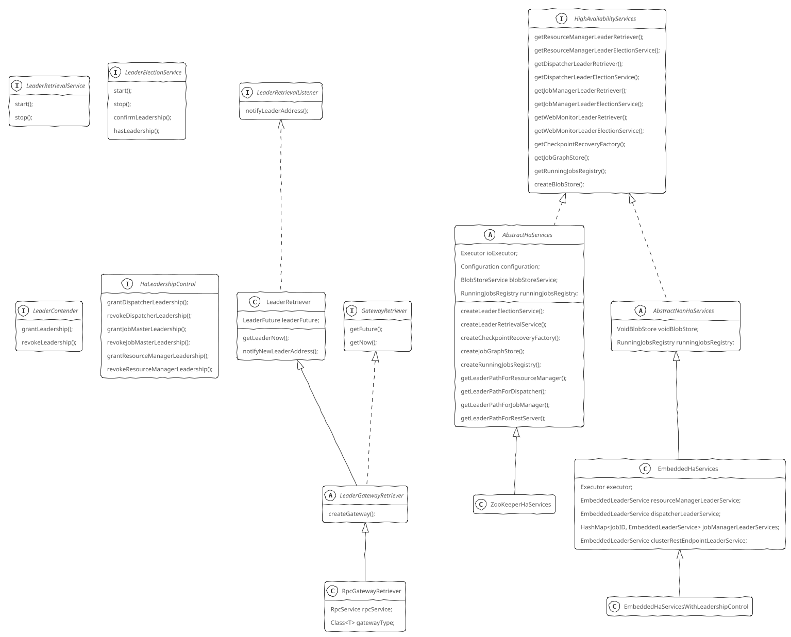

</div>

Flink内部组件（如ResourceManager、JobMaster）都可以配置HA模式，集群启动时会大量涉及到Leader选举、Leader地址获取等相关的操作。

Leader地址获取通过LeaderRetriverService和LeaderRetrievalListener两个接口来完成。LeaderRetriverService由服务实现，启动Leader选举，并注册监听器监听Leader选举完成事件。LeaderRetrievalLister由监听Leader变动的类实现。

<details>

<summary>具体实现</summary>

```Java
interface LeaderRetrievalService
{
    // 启动Leader选举，并注册监听器监听Leader选举完成事件
    void start(LeaderRetrievalListener listener);
    void stop();
}
interface LeaderRetrievalListener
{
    // Leader选举完成后由LeaderRetriverService调用
    void notifyLeaderAddress(String leaderAddress, UUID leaderSessionID);
    void handleError(Exception exception);
}
```

</details>

抽象类LeaderGatewayRetriever继承了LeaderRetriever（实现了LeaderRetrievalListener）并实现了GatewayRetriever（用于获取RpcGateway），可以在Leader选举完成后得到Leader地址，进而获取到Leader的RpcGateway。RpcGatewayRetriever 是LeaderGatewayRetriver的具体实现，根据Leader的地址通过RpcService的connect()方法获得对应Leader的RpcGateway。

<details>

<summary>具体实现</summary>

```Java
class RpcGatewayRetriever extends LeaderGatewayRetriever
{
    RpcService rpcService;
    Class<T> gatewayType;
    CompletableFuture<T> createGateway(CompletableFuture<Tuple2<String, UUID>> leaderFuture) {
        return FutureUtils.retryWithDelay(() ->
            leaderFuture.thenCompose((Tuple2<String, UUID> addressLeaderTuple) ->
                rpcService.connect(
                    addressLeaderTuple.f0,
                    fencingTokenMapper.apply(addressLeaderTuple.f1),
                    gatewayType)),
            retryStrategy,
            rpcService.getScheduledExecutor());
    }
}
```

</details>

Leader选举是通过LeaderElectionService（选举服务）和LeaderContender（参与竞选的对象）共同完成的，每一次选举成功后都会有唯一的leaderSessionID来作为RpcGateway通信的fence token。当一个LeaderContender竞选成功时，会通过其grantLeadership()方法得到通知。LeaderElectionService有StandaloneLeaderElectionService（无需选举过程）、EmbeddedLeaderElectionService等多种实现。

EmbeddedHaServices不具备高可用的特性，适用于ResourceMangaer、TaksManager、JobManager等所有组件都运行在同一个进程的情况。EmbeddedHaServices为各组件创建的选举服务为EmbeddedLeaderElectionService，一旦有参与选举的LeaderContender加入，该竞选对象就被选择为Leader。

HighAvailabilityServices接口提供了获取HA相关所有服务的方法，包括：

+ ResourceManager选举服务及Leader获取
+ Dispatcher选举服务及Leader获取
+ 任务状态的注册表（RunningJobsRegistry）
+ CheckpointRecovery、BlobStore、JobGraphStore等相关的服务

### MiniCluster启动流程

MiniCluster是一个内嵌的Flink运行时环境，所有组件都在独立的本地线程中运行。MiniCluster的启动入口在LocalStreamEnvironment中，启动流程大致分为三个阶段：

+ 创建RpcService、HighAvailabilityServices、BlobServer等辅助服务
+ 创建并启动TaskManager，TaskManagerRunner的startTaskManager()方法会创建一个TaskExecutor。TaskExecutor通过HighAvailabilityServices获得ResourceManager等组件的服务地址并与它们进行通信，其启动的回调函数中会启动一系列服务。当ResourceManagerLeaderListener的监听被回调时，TaskExecutor会试图建立和ResourceManager的连接，连接被封装为TaskExecutorToResourceManagerConnection，一旦获取ResourceManager Leader后，就可以获取到ResourceManager对应的RpcGateway，接下来就可以通过RPC调用ResourceManager的registerTaskExecutor()方法进行注册流程，注册成功后，TaskExecutor向ResourceManager报告其资源（slots）情况。
+ 启动Dispatcher、ResourceManager等。MiniCluster模式下，会创建一个SessionDispatcherResourceManagerComponent对象（继承自 DispatcherResourceManagerComponent），用来启动Dispatcher、ResourceManager和 WebMonitorEndpoint，这些组件都在同一个进程中运行（MiniCluster模式下启动的是StandaloneDispatcher和StandaloneResourceManager）。工厂类创建DispatcherResourceManagerComponent时会启动Dispatcher、ResourceManager等组件。在ResourceManager的启动回调函数中，会通过HighAvailabilityServices获取到选举服务，从而参与到选举之中，并启动JobLeaderIdService，管理向当前ResourceManager注册的作业的leader id。在Dispatcher的启动回调函数中，当前Dispatcher也会通过LeaderElectionService参与选举。

<details>

<summary>具体实现</summary>

```Java
class MiniCluster
{
    List<TaskExecutor> taskManagers;
    RpcService commonRpcService;
    RpcSystem rpcSystem;
    Collection<RpcService> rpcServices;
    ighAvailabilityServices haServices;
    ExecutorService ioExecutor;
    BlobServer blobServer;
    HeartbeatServices heartbeatServices;
    BlobCacheService blobCacheService;
    LeaderRetrievalService resourceManagerLeaderRetriever;
    RpcGatewayRetriever<ResourceManagerId, ResourceManagerGateway> resourceManagerGatewayRetriever;
    LeaderRetrievalService dispatcherLeaderRetriever;
    RpcGatewayRetriever<DispatcherId, DispatcherGateway> dispatcherGatewayRetriever;
    LeaderRetriever webMonitorLeaderRetriever;
    RpcServiceFactory taskManagerRpcServiceFactory;
    LeaderRetrievalService clusterRestEndpointLeaderRetrievalService;
    Collection<DispatcherResourceManagerComponent> dispatcherResourceManagerComponents;

    void start() {
        LOG.info("Starting Flink Mini Cluster");
        Configuration configuration = miniClusterConfiguration.getConfiguration();
        boolean useSingleRpcService = miniClusterConfiguration.getRpcServiceSharing() == RpcServiceSharing.SHARED;
        initializeIOFormatClasses(configuration);
        rpcSystem = RpcSystem.load(configuration);
        LOG.info("Starting Metrics Registry");
        metricRegistry = createMetricRegistry(...);
        LOG.info("Starting RPC Service(s)");
        RpcServiceFactory dispatcherResourceManagerComponentRpcServiceFactory;
        RpcService metricQueryServiceRpcService;
        if (useSingleRpcService) {
            commonRpcService = createLocalRpcService(configuration, rpcSystem);
            CommonRpcServiceFactory commonRpcServiceFactory = new CommonRpcServiceFactory(commonRpcService);
            taskManagerRpcServiceFactory = commonRpcServiceFactory;
            dispatcherResourceManagerComponentRpcServiceFactory = commonRpcServiceFactory;
            metricQueryServiceRpcService = MetricUtils.startLocalMetricsRpcService(configuration, rpcSystem);
        } else {
            String jobManagerExternalAddress = miniClusterConfiguration.getJobManagerExternalAddress();
            String taskManagerExternalAddress = miniClusterConfiguration.getTaskManagerExternalAddress();
            String jobManagerExternalPortRange = miniClusterConfiguration.getJobManagerExternalPortRange();
            String taskManagerExternalPortRange = miniClusterConfiguration.getTaskManagerExternalPortRange();
            String jobManagerBindAddress = miniClusterConfiguration.getJobManagerBindAddress();
            String taskManagerBindAddress = miniClusterConfiguration.getTaskManagerBindAddress();
            dispatcherResourceManagerComponentRpcServiceFactory =
                new DedicatedRpcServiceFactory(
                    configuration,
                    jobManagerExternalAddress,
                    jobManagerExternalPortRange,
                    jobManagerBindAddress,
                    rpcSystem);
            taskManagerRpcServiceFactory = new DedicatedRpcServiceFactory(
                configuration,
                taskManagerExternalAddress,
                taskManagerExternalPortRange,
                taskManagerBindAddress,
                rpcSystem);
            commonRpcService = createRemoteRpcService(...);
            metricQueryServiceRpcService = MetricUtils.startRemoteMetricsRpcService(...);
        }
        metricRegistry.startQueryService(metricQueryServiceRpcService, null);

        processMetricGroup = MetricUtils.instantiateProcessMetricGroup(...);

        ioExecutor = Executors.newFixedThreadPool(
            ClusterEntrypointUtils.getPoolSize(configuration),
            new ExecutorThreadFactory("mini-cluster-io"));
        // 创建HighAvailabilityServices
        haServices = createHighAvailabilityServices(configuration, ioExecutor);
        blobServer = new BlobServer(configuration, haServices.createBlobStore());
        blobServer.start();
        heartbeatServices = HeartbeatServices.fromConfiguration(configuration);
        blobCacheService = new BlobCacheService(...);
        // 启动TaskManager
        startTaskManagers();
        MetricQueryServiceRetriever metricQueryServiceRetriever = new RpcMetricQueryServiceRetriever(...);
        // setupDispatcherResourceManagerComponents，启动DispatcherResourceManagerComponent
        dispatcherResourceManagerComponents.addAll(
            createDispatcherResourceManagerComponentFactory().create(...));

        resourceManagerLeaderRetriever = haServices.getResourceManagerLeaderRetriever();
        dispatcherLeaderRetriever = haServices.getDispatcherLeaderRetriever();
        clusterRestEndpointLeaderRetrievalService = haServices.getClusterRestEndpointLeaderRetriever();
        dispatcherGatewayRetriever = new RpcGatewayRetriever<>(
            commonRpcService,
            DispatcherGateway.class,
            DispatcherId::fromUuid,
            new ExponentialBackoffRetryStrategy(...));
        resourceManagerGatewayRetriever = new RpcGatewayRetriever<>(
            commonRpcService,
            ResourceManagerGateway.class,
            ResourceManagerId::fromUuid,
            new ExponentialBackoffRetryStrategy(...));
        webMonitorLeaderRetriever = new LeaderRetriever();
        resourceManagerLeaderRetriever.start(resourceManagerGatewayRetriever);
        dispatcherLeaderRetriever.start(dispatcherGatewayRetriever);
        clusterRestEndpointLeaderRetrievalService.start(webMonitorLeaderRetriever);
        // create a new termination future
        terminationFuture = new CompletableFuture<>();
        running = true;
        LOG.info("Flink Mini Cluster started successfully");
    }
    HighAvailabilityServices createHighAvailabilityServices(
        Configuration configuration,
        Executor executor) {
        LOG.info("Starting high-availability services");
        HaServices haServices = miniClusterConfiguration.getHaServices();
        switch (haServices) {
            case WITH_LEADERSHIP_CONTROL:
                return new EmbeddedHaServicesWithLeadershipControl(executor);
            case CONFIGURED:
                return HighAvailabilityServicesUtils.createAvailableOrEmbeddedServices(
                        configuration, executor, new ShutDownFatalErrorHandler());
            default:
                throw new IllegalConfigurationException("Unknown HA Services " + haServices);
        }
    }
    void startTaskManagers() {
        int numTaskManagers = miniClusterConfiguration.getNumTaskManagers();
        LOG.info("Starting {} TaskManger(s)", numTaskManagers);
        for (int i = 0; i < numTaskManagers; i++) {
            // startTaskManager
            Configuration configuration = miniClusterConfiguration.getConfiguration();

            TaskExecutor taskExecutor = TaskManagerRunner.startTaskManager(...);
            taskExecutor.start();
            taskManagers.add(taskExecutor);
        }
    }
}

class TaskExecutor extends RpcEndpoint implements TaskExecutorGateway
{
    void onStart() {
        /// 启动服务
        startTaskExecutorServices();
    }
    void startTaskExecutorServices() {
        resourceManagerLeaderRetriever.start(new ResourceManagerLeaderListener());
        taskSlotTable.start(new SlotActionsImpl(), getMainThreadExecutor());
        jobLeaderService.start(getAddress(), getRpcService(), haServices, new JobLeaderListenerImpl());
        fileCache = new FileCache(...);
    }
    void notifyOfNewResourceManagerLeader(String newLeaderAddress, ResourceManagerId newResourceManagerId) {
        resourceManagerAddress = createResourceManagerAddress(newLeaderAddress, newResourceManagerId);
        // connectToResourceManager
        log.info("Connecting to ResourceManager {}.", resourceManagerAddress);
        TaskExecutorRegistration taskExecutorRegistration =
            new TaskExecutorRegistration(
                getAddress(),
                getResourceID(),
                unresolvedTaskManagerLocation.getDataPort(),
                JMXService.getPort().orElse(-1),
                hardwareDescription,
                memoryConfiguration,
                taskManagerConfiguration.getDefaultSlotResourceProfile(),
                taskManagerConfiguration.getTotalResourceProfile());
        resourceManagerConnection =
            new TaskExecutorToResourceManagerConnection(
                log,
                getRpcService(),
                taskManagerConfiguration.getRetryingRegistrationConfiguration(),
                resourceManagerAddress.getAddress(),
                resourceManagerAddress.getResourceManagerId(),
                getMainThreadExecutor(),
                new ResourceManagerRegistrationListener(),
                taskExecutorRegistration);
        resourceManagerConnection.start();
    }
    class ResourceManagerRegistrationListener
        implements RegistrationConnectionListener<
            TaskExecutorToResourceManagerConnection,
            TaskExecutorRegistrationSuccess,
            TaskExecutorRegistrationRejection> {
        @Override
        public void onRegistrationSuccess(
            TaskExecutorToResourceManagerConnection connection,
            TaskExecutorRegistrationSuccess success) {
            ResourceID resourceManagerId = success.getResourceManagerId();
            InstanceID taskExecutorRegistrationId = success.getRegistrationId();
            ClusterInformation clusterInformation = success.getClusterInformation();
            ResourceManagerGateway resourceManagerGateway = connection.getTargetGateway();

            runAsync(() -> {
                if (resourceManagerConnection == connection) {
                    establishResourceManagerConnection(
                        resourceManagerGateway,
                        resourceManagerId,
                        taskExecutorRegistrationId,
                        clusterInformation);
                        final CompletableFuture<Acknowledge> slotReportResponseFuture =
                    // establishResourceManagerConnection
                    resourceManagerGateway.sendSlotReport(
                        getResourceID(),
                        taskExecutorRegistrationId,
                        taskSlotTable.createSlotReport(getResourceID()),
                        taskManagerConfiguration.getRpcTimeout());
                    slotReportResponseFuture.whenCompleteAsync((acknowledge, throwable) -> {
                        if (throwable != null) {
                            reconnectToResourceManager(...);
                        }
                    },
                    getMainThreadExecutor());
                    // monitor the resource manager as heartbeat target
                    resourceManagerHeartbeatManager.monitorTarget(
                        resourceManagerResourceId,
                        new ResourceManagerHeartbeatTarget(resourceManagerGateway));
                    // set the propagated blob server address
                    InetSocketAddress blobServerAddress = new InetSocketAddress(...);
                    blobCacheService.setBlobServerAddress(blobServerAddress);
                    establishedResourceManagerConnection =
                        new EstablishedResourceManagerConnection(
                                resourceManagerGateway,
                                resourceManagerResourceId,
                                taskExecutorRegistrationId);
        
                    stopRegistrationTimeout();
                }
            });
        }
    }
    class ResourceManagerLeaderListener implements LeaderRetrievalListener {
        // 获得ResourceManager地址，和ResourceManager建立连接
        @Override
        void notifyLeaderAddress(String leaderAddress, UUID leaderSessionID) {
            runAsync(() ->
                notifyOfNewResourceManagerLeader(leaderAddress, ResourceManagerId.fromUuidOrNull(leaderSessionID)));
        }
    }
    void establishJobManagerConnection(
        JobTable.Job job,
        JobMasterGateway jobMasterGateway,
        JMTMRegistrationSuccess registrationSuccess) {
        JobID jobId = job.getJobId();
        Optional<JobTable.Connection> connection = job.asConnection();
        log.info("Establish JobManager connection for job {}.", jobId);
        ResourceID jobManagerResourceID = registrationSuccess.getResourceID();
        // associateWithJobManager
        TaskManagerActions taskManagerActions = new TaskManagerActionsImpl(jobMasterGateway);
        CheckpointResponder checkpointResponder = new RpcCheckpointResponder(jobMasterGateway);
        GlobalAggregateManager aggregateManager = new RpcGlobalAggregateManager(jobMasterGateway);
        ResultPartitionConsumableNotifier resultPartitionConsumableNotifier =
            new RpcResultPartitionConsumableNotifier(
                jobMasterGateway,
                getRpcService().getScheduledExecutor(),
                taskManagerConfiguration.getRpcTimeout());
        PartitionProducerStateChecker partitionStateChecker =
            new RpcPartitionStateChecker(jobMasterGateway);
        registerQueryableState(job.getJobId(), jobMasterGateway);
        JobTable.Connection establishedConnection = job.connect(
            jobManagerResourceID,
            jobMasterGateway,
            taskManagerActions,
            checkpointResponder,
            aggregateManager,
            resultPartitionConsumableNotifier,
            partitionStateChecker);
        // monitor the job manager as heartbeat target
        jobManagerHeartbeatManager.monitorTarget(
            jobManagerResourceID,
            new JobManagerHeartbeatTarget(jobMasterGateway));
        internalOfferSlotsToJobManager(establishedConnection);
        // internalOfferSlotsToJobManager
        JobID jobId = establishedConnection.getJobId();
        log.info("Offer reserved slots to the leader of job {}.", ...);
        JobMasterGateway jobMasterGateway = establishedConnection.getJobManagerGateway();
        Iterator<TaskSlot<Task>> reservedSlotsIterator = taskSlotTable.getAllocatedSlots(jobId);
        JobMasterId jobMasterId = establishedConnection.getJobMasterId();
        Collection<SlotOffer> reservedSlots = new HashSet<>(2);
        while (reservedSlotsIterator.hasNext()) {
            SlotOffer offer = reservedSlotsIterator.next().generateSlotOffer();
            reservedSlots.add(offer);
        }
        UUID slotOfferId = UUID.randomUUID();
        currentSlotOfferPerJob.put(jobId, slotOfferId);
        CompletableFuture<Collection<SlotOffer>> acceptedSlotsFuture =
            jobMasterGateway.offerSlots(
                getResourceID(),
                reservedSlots,
                taskManagerConfiguration.getRpcTimeout());
        acceptedSlotsFuture.whenCompleteAsync(
            handleAcceptedSlotOffers(jobId, jobMasterGateway, jobMasterId, reservedSlots, slotOfferId),
            getMainThreadExecutor());
    }
    class JobLeaderListenerImpl implements JobLeaderListener {
        //和JobManager建立连接
        @Override
        void jobManagerGainedLeadership(
            JobID jobId,
            JobMasterGateway jobManagerGateway,
            JMTMRegistrationSuccess registrationMessage) {
            runAsync(() ->
                jobTable.getJob(jobId)
                        .ifPresent(job ->
                            establishJobManagerConnection(
                                job,
                                jobManagerGateway,
                                registrationMessage)));
        }
        @Override
        void jobManagerLostLeadership(JobID jobId, JobMasterId jobMasterId) {
            log.info("JobManager for job {} with leader id {} lost leadership.", ...);
            runAsync(() ->
                jobTable.getConnection(jobId)
                    .ifPresent(jobManagerConnection ->
                        disconnectJobManagerConnection(
                            jobManagerConnection,
                            new Exception(...))));
        }
    }
}

class DefaultDispatcherResourceManagerComponentFactory
    implements DispatcherResourceManagerComponentFactory
{
    DispatcherResourceManagerComponent create(
        Configuration configuration,
        Executor ioExecutor,
        RpcService rpcService,
        HighAvailabilityServices highAvailabilityServices,
        BlobServer blobServer,
        HeartbeatServices heartbeatServices,
        MetricRegistry metricRegistry,
        ExecutionGraphInfoStore executionGraphInfoStore,
        MetricQueryServiceRetriever metricQueryServiceRetriever,
        FatalErrorHandler fatalErrorHandler) {

        LeaderRetrievalService dispatcherLeaderRetrievalService = highAvailabilityServices.getDispatcherLeaderRetriever();
        LeaderRetrievalService resourceManagerRetrievalService = highAvailabilityServices.getResourceManagerLeaderRetriever();
        WebMonitorEndpoint<?> webMonitorEndpoint = restEndpointFactory.createRestEndpoint(...);
        log.debug("Starting Dispatcher REST endpoint.");
        webMonitorEndpoint.start();
        String hostname = RpcUtils.getHostname(rpcService);
        ResourceManagerService resourceManagerService = ResourceManagerServiceImpl.create(...);
        PartialDispatcherServices partialDispatcherServices = new PartialDispatcherServices(...);
        log.debug("Starting Dispatcher.");
        DispatcherRunner dispatcherRunner = dispatcherRunnerFactory.createDispatcherRunner(...);
        log.debug("Starting ResourceManagerService.");
        resourceManagerService.start();
        resourceManagerRetrievalService.start(resourceManagerGatewayRetriever);
        dispatcherLeaderRetrievalService.start(...);
        return new DispatcherResourceManagerComponent(
            dispatcherRunner,
            resourceManagerService,
            dispatcherLeaderRetrievalService,
            resourceManagerRetrievalService,
            webMonitorEndpoint,
            fatalErrorHandler);
    }
}

abstract class ResourceManager<WorkerType extends ResourceIDRetrievable>
    extends FencedRpcEndpoint<ResourceManagerId>
    implements ResourceManagerGateway
{
    @Override
    void onStart() {
        log.info("Starting the resource manager.");
        // startResourceManagerServices
        jobLeaderIdService.start(new JobLeaderIdActionsImpl());
        registerMetrics();
        startHeartbeatServices();
        slotManager.start(
            getFencingToken(),            // newResourceManagerId
            getMainThreadExecutor(),      // newMainThreadExecutor
            new ResourceActionsImpl());   // newResourceActions
        initialize();
        startedFuture.complete(null);
    }
}
abstract class Dispatcher
    extends PermanentlyFencedRpcEndpoint<DispatcherId>
    implements DispatcherGateway
{
    @Override
    void onStart() {
        // startDispatcherService
        registerDispatcherMetrics(jobManagerMetricGroup);
        // startRecoveredJobs
        for (JobGraph recoveredJob : recoveredJobs) {
            // runRecoveredJob
            runJob(recoveredJob, ExecutionType.RECOVERY);
        }
        recoveredJobs.clear();
        this.dispatcherBootstrap = this.dispatcherBootstrapFactory.create(...);
    }
}
```

</details>

JobGraph提交入口是MiniCluster的executeJobBlocking()方法，提交JobGraph和请求运行结果都是通过RPC调用来实现。

<details>

<summary>具体实现</summary>

```Java
class MiniCluster
{
    JobExecutionResult executeJobBlocking(JobGraph job) {
        CompletableFuture<JobSubmissionResult> submissionFuture = submitJob(job);
        CompletableFuture<JobResult> jobResultFuture = submissionFuture.thenCompose((JobSubmissionResult ignored) -> requestJobResult(job.getJobID()));
        JobResult jobResult = jobResultFuture.get();
        return jobResult.toJobExecutionResult(Thread.currentThread().getContextClassLoader());
    }
    CompletableFuture<JobSubmissionResult> submitJob(JobGraph jobGraph) {
        CompletableFuture<DispatcherGateway> dispatcherGatewayFuture = dispatcherGatewayRetriever.getFuture();
        CompletableFuture<InetSocketAddress> blobServerAddressFuture = dispatcherGatewayFuture
            .thenApply(dispatcherGateway ->
                dispatcherGateway.getBlobServerPort(rpcTimeout)
                    .thenApply(blobServerPort -> new InetSocketAddress(dispatcherGateway.getHostname(), blobServerPort)))
            .thenCompose(Function.identity());
        CompletableFuture<Void> jarUploadFuture = uploadAndSetJobFiles(blobServerAddressFuture, jobGraph);
        CompletableFuture<Acknowledge> acknowledgeCompletableFuture = jarUploadFuture
            .thenCombine(dispatcherGatewayFuture,
                         (Void ack, DispatcherGateway dispatcherGateway) -> dispatcherGateway.submitJob(jobGraph, rpcTimeout))
            .thenCompose(Function.identity());
        return acknowledgeCompletableFuture
            .thenApply((Acknowledge ignored) -> new JobSubmissionResult(jobGraph.getJobID()));
    }
}
```

</details>

Dispatcher在接收到提交JobGraph的请求后，会将提交的JobGraph保存在SubmittedJobGraphStore中（用于故障恢复），并为提交的JobGraph启动JobManager。启动的JobManagerRunner会竞争leader，一旦被选举为leader，就会启动一个JobMaster。

<details>

<summary>具体实现</summary>

```Java
abstract class Dispatcher
    extends PermanentlyFencedRpcEndpoint<DispatcherId>
    implements DispatcherGateway
{
    JobManagerRunner createJobManagerRunner(JobGraph jobGraph, long initializationTimestamp) {
        RpcService rpcService = getRpcService();
        JobManagerRunner runner =
            jobManagerRunnerFactory.createJobManagerRunner(
                jobGraph,
                configuration,
                rpcService,
                highAvailabilityServices,
                heartbeatServices,
                jobManagerSharedServices,
                new DefaultJobManagerJobMetricGroupFactory(jobManagerMetricGroup),
                fatalErrorHandler,
                initializationTimestamp);
        runner.start();
        return runner;
    }
}

class JobMasterServiceLeadershipRunner
    implements JobManagerRunner, LeaderContender
{
    @Override
    void start() {
        leaderElectionService.start(this);
    }
    @Override
    void grantLeadership(UUID leaderSessionID) {
        // startJobMasterServiceProcess，启动JobMaster
        LOG.debug("Create new JobMasterServiceProcess because we were granted leadership under {}.", ...);
        runningJobsRegistry.setJobRunning(jobMasterServiceProcessFactory.getJobId(););
        jobMasterServiceProcess = jobMasterServiceProcessFactory.create(leaderSessionId);
        // forwardLeader
        jobMasterServiceProcess
            .getJobMasterGatewayFuture()
            .thenAccept(t -> jobMasterGatewayFuture.complete(t))
        // forwardResultFuture
        jobMasterServiceProcess
            .getResultFuture()
            .thenAccept(jobManagerRunnerResult -> {
                LOG.debug("Completing the result for job {}.", getJobID());
                runningJobsRegistry.setJobFinished(getJobID());
                resultFuture.complete(jobManagerRunnerResult);
            });
        // confirmLeadership
        jobMasterServiceProcess
            .getLeaderAddressFuture()
            .thenAccept(address -> leaderElectionService.confirmLeadership(leaderSessionId, address));
    }
}
```

</details>

JobMaster启动后会和ResourceManager建立连接，连接被封装为ResourceManagerConnection。连接建立之后，JobMaster就可以通过RPC调用和ResourceManager进行通信了。

<details>

<summary>具体实现</summary>

```Java
class JobMaster
    extends PermanentlyFencedRpcEndpoint<JobMasterId>
    implements JobMasterGateway, JobMasterService
{
    void startJobMasterServices() {
        this.taskManagerHeartbeatManager = createTaskManagerHeartbeatManager(heartbeatServices);
        this.resourceManagerHeartbeatManager = createResourceManagerHeartbeatManager(heartbeatServices);
        // start the slot pool make sure the slot pool now accepts messages for this leader
        slotPoolService.start(getFencingToken(), getAddress(), getMainThreadExecutor());
        resourceManagerLeaderRetriever.start(new ResourceManagerLeaderListener());
    }
    class ResourceManagerLeaderListener implements LeaderRetrievalListener {
        @Override
        public void notifyLeaderAddress(String leaderAddress, UUID leaderSessionID) {
            runAsync(() -> {
                // notifyOfNewResourceManagerLeader
                resourceManagerAddress = createResourceManagerAddress(leaderAddress, leaderSessionID);
                // connectToResourceManager
                log.info("Connecting to ResourceManager {}", ...);
                resourceManagerConnection = new ResourceManagerConnection(
                    log,
                    jobGraph.getJobID(),
                    resourceId,
                    getAddress(),
                    getFencingToken(),
                    resourceManagerAddress.getAddress(),
                    resourceManagerAddress.getResourceManagerId(),
                    futureExecutor);
                resourceManagerConnection.start();
            }
        }
    }
}
```

</details>

之后进入任务调度执行流程。

### Yarn Cluster启动流程

Yarn Cluster的启动入口在FlinkYarnSessionCli中：首先根据命令行参数创建YarnClusterDescriptor，接着调用YarnClusterDescriptor的deploySessionCluster()触发集群的部署。实际启动的逻辑在AbstractYarnClusterDescriptor的deployInternal()方法中，主要就是通过YarnClient向YARN集群提交应用，启动ApplicationMaster。

<details>

<summary>具体实现</summary>

```Java
class YarnClusterDescriptor
    implements ClusterDescriptor<ApplicationId>
{
    @Override
    ClusterClientProvider<ApplicationId> deploySessionCluster(ClusterSpecification clusterSpecification) {
        return deployInternal(
            clusterSpecification,
            "Flink session cluster",
            YarnSessionClusterEntrypoint.class.getName(),
            null,
            false);
    }
    ClusterClientProvider<ApplicationId> deployInternal(
        ClusterSpecification clusterSpecification,
        String applicationName,
        String yarnClusterEntrypoint,
        JobGraph jobGraph,
        boolean detached) {
        YarnClientApplication yarnApplication = yarnClient.createApplication();
        GetNewApplicationResponse appResponse = yarnApplication.getNewApplicationResponse();
        Resource maxRes = appResponse.getMaximumResourceCapability();
        ClusterResourceDescription freeClusterMem = getCurrentFreeClusterResources(yarnClient);
        int yarnMinAllocationMB = yarnConfiguration.getInt(...);
        ClusterSpecification validClusterSpecification = validateClusterResources(clusterSpecification, yarnMinAllocationMB, maxRes, freeClusterMem);
        ClusterEntrypoint.ExecutionMode executionMode = detached
            ? ClusterEntrypoint.ExecutionMode.DETACHED
            : ClusterEntrypoint.ExecutionMode.NORMAL;
        flinkConfiguration.setString(ClusterEntrypoint.INTERNAL_CLUSTER_EXECUTION_MODE, executionMode.toString());
        ApplicationReport report = startAppMaster(
            flinkConfiguration,
            applicationName,
            yarnClusterEntrypoint,
            jobGraph,
            yarnClient,
            yarnApplication,
            validClusterSpecification);
        setClusterEntrypointInfoToConfig(report);
        return () -> return new RestClusterClient<>(flinkConfiguration, report.getApplicationId());
        };
    }
}
```

</details>

SessionCluster和JobCluster两种启动方式对应Yarn ApplicationMatser入口类分别为YarnSessionClusterEntrypoint和YarnJobClusterEntrypoint, 区别在于Dispatcher分别为StandaloneDispatcher和MiniDispatcher。ResoureManager的具体实现类为YarnResourceManagerDriver。Yarn Cluster模式下启动的Flink集群，其TaskManager是由YarnResourceManagerDriver根据JobMaster的请求动态向Yarn ResourceManager进行申请的。在JobMaster向ResourceManager申请资源时，如果当前没有足够的资源分配，则YarnResourceManagerDriver会向Yarn集群的ResourceManager申请新的Container，并启动 TaskManager。

<details>

<summary>具体实现</summary>

```Java
class YarnResourceManagerDriver
    extends AbstractResourceManagerDriver<YarnWorkerNode>
{
    @Override
    public CompletableFuture<YarnWorkerNode> requestResource(TaskExecutorProcessSpec taskExecutorProcessSpec) {
        CompletableFuture<YarnWorkerNode> requestResourceFuture = new CompletableFuture<>();
        Optional<TaskExecutorProcessSpecContainerResourcePriorityAdapter.PriorityAndResource> priorityAndResourceOpt = taskExecutorProcessSpecContainerResourcePriorityAdapter.getPriorityAndResource(taskExecutorProcessSpec);
        Priority priority = priorityAndResourceOpt.get().getPriority();
        Resource resource = priorityAndResourceOpt.get().getResource();
        resourceManagerClient.addContainerRequest(getContainerRequest(resource, priority));
        resourceManagerClient.setHeartbeatInterval(containerRequestHeartbeatIntervalMillis);
        requestResourceFutures
            .computeIfAbsent(taskExecutorProcessSpec, ignore -> new LinkedList<>())
            .add(requestResourceFuture);
        log.info("Requesting new TaskExecutor container with resource {}, priority {}.", ...);
        return requestResourceFuture;
    }
    ContainerLaunchContext createTaskExecutorLaunchContext(
        ResourceID containerId,
        String host,
        TaskExecutorProcessSpec taskExecutorProcessSpec) {
        // init the ContainerLaunchContext
        String currDir = configuration.getCurrentDir();
        ContaineredTaskManagerParameters taskManagerParameters = ContaineredTaskManagerParameters.create(flinkConfig, taskExecutorProcessSpec);
        log.info("TaskExecutor {} will be started on {} with {}.", ...);
        Configuration taskManagerConfig = BootstrapTools.cloneConfiguration(flinkConfig);
        taskManagerConfig.set(TaskManagerOptions.TASK_MANAGER_RESOURCE_ID, containerId.getResourceIdString());
        taskManagerConfig.set(TaskManagerOptionsInternal.TASK_MANAGER_RESOURCE_ID_METADATA, containerId.getMetadata());
        String taskManagerDynamicProperties = BootstrapTools.getDynamicPropertiesAsString(flinkClientConfig, taskManagerConfig);
        log.debug("TaskManager configuration: {}", ...);
        ContainerLaunchContext taskExecutorLaunchContext = Utils.createTaskExecutorContext(
            flinkConfig,
            yarnConfig,
            configuration,
            taskManagerParameters,
            taskManagerDynamicProperties,
            currDir,
            YarnTaskExecutorRunner.class,       // 入口类
            log);
        taskExecutorLaunchContext.getEnvironment().put(ENV_FLINK_NODE_ID, host);
        return taskExecutorLaunchContext;
    }
    class YarnContainerEventHandler
        implements AMRMClientAsync.CallbackHandler, NMClientAsync.CallbackHandler
    {
        @Override
        public void onContainersAllocated(List<Container> containers) {
            log.info("Received {} containers.", ...);
            for (Map.Entry<Priority, List<Container>> entry : groupContainerByPriority(containers).entrySet()) {
                // onContainersOfPriorityAllocated
                Priority priority = entry.getKey();
                List<Container> containers = entry.getValue();
                Optional<TaskExecutorProcessSpecContainerResourcePriorityAdapter.TaskExecutorProcessSpecAndResource> taskExecutorProcessSpecAndResourceOpt = taskExecutorProcessSpecContainerResourcePriorityAdapter.getTaskExecutorProcessSpecAndResource(priority);
                TaskExecutorProcessSpec taskExecutorProcessSpec = taskExecutorProcessSpecAndResourceOpt.get().getTaskExecutorProcessSpec();
                Resource resource = taskExecutorProcessSpecAndResourceOpt.get().getResource();
                Queue<CompletableFuture<YarnWorkerNode>> pendingRequestResourceFutures = requestResourceFutures.getOrDefault(taskExecutorProcessSpec, new LinkedList<>());
                log.info("Received {} containers with priority {}, {} pending container requests.", ...);
                Iterator<Container> containerIterator = containers.iterator();
                Iterator<AMRMClient.ContainerRequest> pendingContainerRequestIterator = getPendingRequestsAndCheckConsistency(priority, resource, pendingRequestResourceFutures.size()).iterator();
                int numAccepted = 0;
                while (containerIterator.hasNext()
                       && pendingContainerRequestIterator.hasNext()) {
                    Container container = containerIterator.next();
                    AMRMClient.ContainerRequest pendingRequest = pendingContainerRequestIterator.next();
                    ResourceID resourceId = getContainerResourceId(container);
                    CompletableFuture<YarnWorkerNode> requestResourceFuture = pendingRequestResourceFutures.poll();
                    if (pendingRequestResourceFutures.isEmpty()) {
                        requestResourceFutures.remove(taskExecutorProcessSpec);
                    }
                    // startTaskExecutorInContainer
                    ContainerLaunchContext containerLaunchContext = createTaskExecutorLaunchContext(resourceId, container.getNodeId().getHost(), taskExecutorProcessSpec);
                    nodeManagerClient.startContainerAsync(container, containerLaunchContext);
                    log.info("Removing container request {}.", pendingRequest);
                    resourceManagerClient.removeContainerRequest(pendingRequest);
                    numAccepted++;
                }
                int numExcess = 0;
                while (containerIterator.hasNext()) {
                    returnExcessContainer(containerIterator.next());
                    numExcess++;
                }
                log.info("Accepted {} requested containers, returned {} excess containers, {} pending container requests of resource {}.", ...);
            }
            if (getNumRequestedNotAllocatedWorkers() <= 0) {
                resourceManagerClient.setHeartbeatInterval(yarnHeartbeatIntervalMillis);
            }
        }
    }
}
```

</details>

## Flink Graph

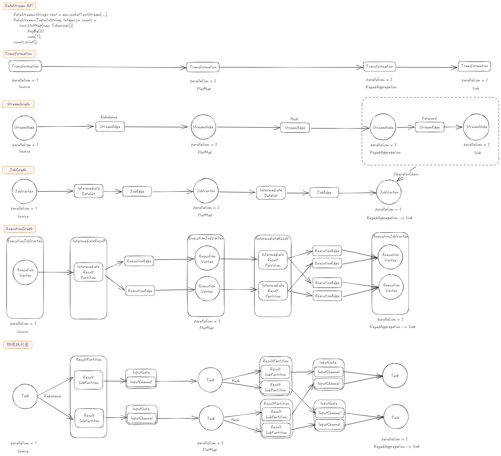

图的节点表示数据的处理逻辑，图的边表示数据的流传。从数据源读取数据开始，上游的数据处理完毕之后，交给下游继续处理，直到数据输出到外部存储中，整个过程用图来表示。

Flink中图可以分为四层，StreamGraph -> JobGraph -> ExecutionGraph -> 物理执行图，分层的目的是为了解耦。StreamGraph是最原始的，更贴近用户逻辑的拓扑结构；JobGraph对StreamGraph进行优化，将能够合并的算子合并为一个节点以降低运行时数据传输的开销；ExecutionGraph是并行化的JobGraph，是作业运行时基本调度单元的拓扑结构；物理执行图就是最终任务分布式并行执行的拓扑结构。

TODO:
JobGraph在JobManager中进一步被转换为可供调度的并行化版本的ExecutionGraph，其中JobVertex被展开为并行化版本的ExecutionVertex，每一个ExecutionVertex对应JobVertex的一个并行子任务，它的每一次调度对应一个Execution，即TaskManager中的一个Task。所以，一个Task运行期间的主要处理逻辑对应一个OperatorChain，这个OperatorChain可能包含多个Operator，也可能只有一个Operator。

### DataStream

<div class='wrapper' markdown='block'>

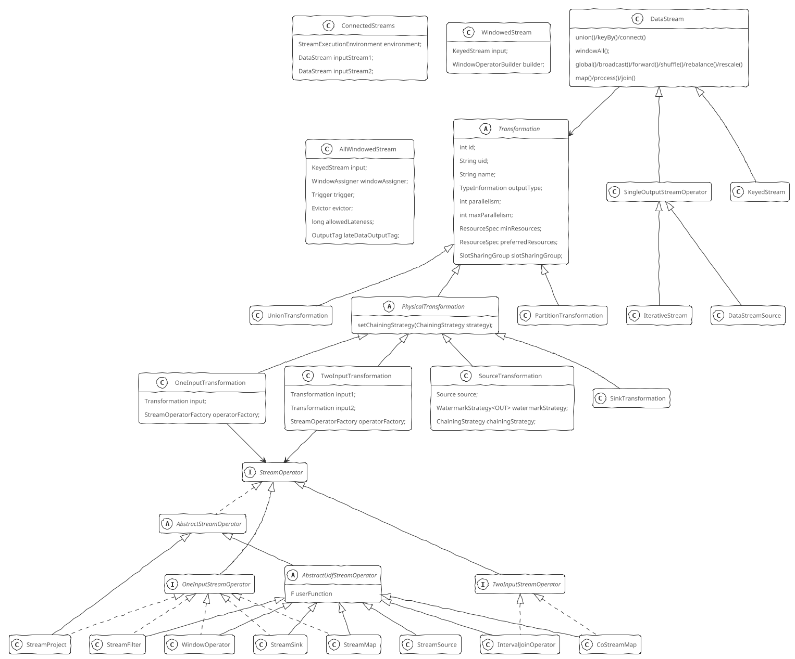

</div>

通过DataStream –> Transformation –> StreamOperator这样的依赖关系，就可以完成DataStream的转换，并且保留数据流和应用在流上的算子之间的关系。

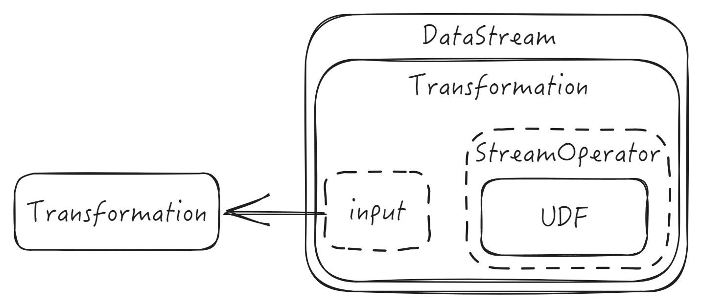

DataStream表示由同一种类型元素构成的数据流，是最基本的数据流。通过对DataStream应用map/filter等操作，可以将一个DataStream转换为另一个DataStream，这个转换的过程就是根据不同的操作生成不同的 Transformation，并将其加入StreamExecutionEnvironment的transformations列表中。DataStream子类有SingleOutputStreamOperator、DataStreamSource、KeyedStream等。

ConnectedStream表示两个流混合形成的新流，允许用户对两个流中的记录分别指定不同的处理逻辑，处理结果形成一个新流，由于两个流的处理是在同一个算子中进行的，因此可以共享状态信息，Join操作也是依赖ConnectedStreams实现的。

WindowedStream表示按键分组且分组内元素根据WindowAssigner划分窗口的数据流。AllWindowedStream表示元素根据WindowAssigner划分窗口的数据流。

<details>

<summary>具体实现</summary>

```Java
class DataStream {
    StreamExecutionEnvironment environment;
    Transformation<T> transformation;
    DataStream<T> union(DataStream<T>... streams) {
        List<Transformation<T>> unionedTransforms = new ArrayList<>();
        unionedTransforms.add(this.transformation);
        for (DataStream<T> newStream : streams) {
            assert getType().equals(newStream.getType()));
            unionedTransforms.add(newStream.getTransformation());
        }
        return new DataStream<>(this.environment, new UnionTransformation<>(unionedTransforms));
    }
    <R> ConnectedStreams<T, R> connect(DataStream<R> dataStream) {
        return new ConnectedStreams<>(environment, this, dataStream);
    }
    <K> KeyedStream<T, K> keyBy(KeySelector<T, K> key) {
        return new KeyedStream<>(this, clean(key));
    }
    <W extends Window> AllWindowedStream<T, W> windowAll(WindowAssigner<? super T, W> assigner) {
        return new AllWindowedStream<>(this, assigner);
    }
    DataStream<T> forward() {
        return setConnectionType(new ForwardPartitioner<T>());
    }
    DataStream<T> broadcast() {
        return setConnectionType(new BroadcastPartitioner<T>());
    }
    DataStream<T> rebalance() {
        return setConnectionType(new RebalancePartitioner<T>());
    }
    DataStream<T> rescale() {
        return setConnectionType(new RescalePartitioner<T>());
    }
    DataStream<T> shuffle() {
        return setConnectionType(new ShufflePartitioner<T>());
    }
    DataStream<T> setConnectionType(StreamPartitioner<T> partitioner) {
        return new DataStream<>(
            this.getExecutionEnvironment(),
            new PartitionTransformation<>(this.getTransformation(), partitioner));
    }
    // join操作
    <T2> JoinedStreams<T, T2> join(DataStream<T2> otherStream) {
        return new JoinedStreams<>(this, otherStream);
    }
    DataStreamSink<T> addSink(SinkFunction<T> sinkFunction) {
        transformation.getOutputType();
        if (sinkFunction instanceof InputTypeConfigurable) {
            ((InputTypeConfigurable) sinkFunction).setInputType(getType(), getExecutionConfig());
        }
        StreamSink<T> sinkOperator = new StreamSink<>(clean(sinkFunction));
        DataStreamSink<T> sink = new DataStreamSink<>(this, sinkOperator);
        getExecutionEnvironment().addOperator(sink.getTransformation());
        return sink;
    }
}
```

</details>

Transformation表示生成DataStream的操作，Flink作业运行时对DataStream API的调用都会被转换成Transformation。

Transformation包含了Flink运行时的一些关键参数：

+ id: 基于静态累加器生成
+ uid: 由用户指定，主要用于在作业重启时再次分配跟之前相同的uid，可以持久保存状态
+ name: Transformation名称，用于可视化
+ outputType: 输出类型，用来序列化数据
+ parallelism: 并行度
+ slotSharingGroup: Slot共享组
+ input：Transformation实例，可选，记录输入Transformation
+ operatorFactory：StreamOperatorFactory实例，可选，用于创建算子（StreamOperator）的工厂

Transformation子类对应了DataStream上的不同转换操作，按照是否被转换为运行时的物理操作分为物理Transformation和虚拟Transformation。虚拟Transformation（如PartitionTransformation、UnionTransformation）都不包含StreamOperator成员变量，而物理Transformation（如SourceTransformation、SinkTransformation、OneInputTransformation、TwoInputTransformation，都是PhysicalTransformation子类）基本上都包含StreamOperator成员变量。另外，Transformation中通常保留了其输入Transformation，进而表示程序的拓扑结构。

StreamOperator是Transformation运行时的具体实现，决定UDF的调用方式。所有StreamOperator实现类都要继承AbstractStreamOperator^[未来将被AbstractStreamOperatorV2替代]，包含UDF的StreamOperator只需继承AbstractUdfStreamOperator（AbstractStreamOperator子类）。处理元素的StreamOperator都需实现OneInputStreamOperator接口或TwoInputStreamOperator接口。

### 流图（StreamGraph）

<div class='wrapper' markdown='block'>

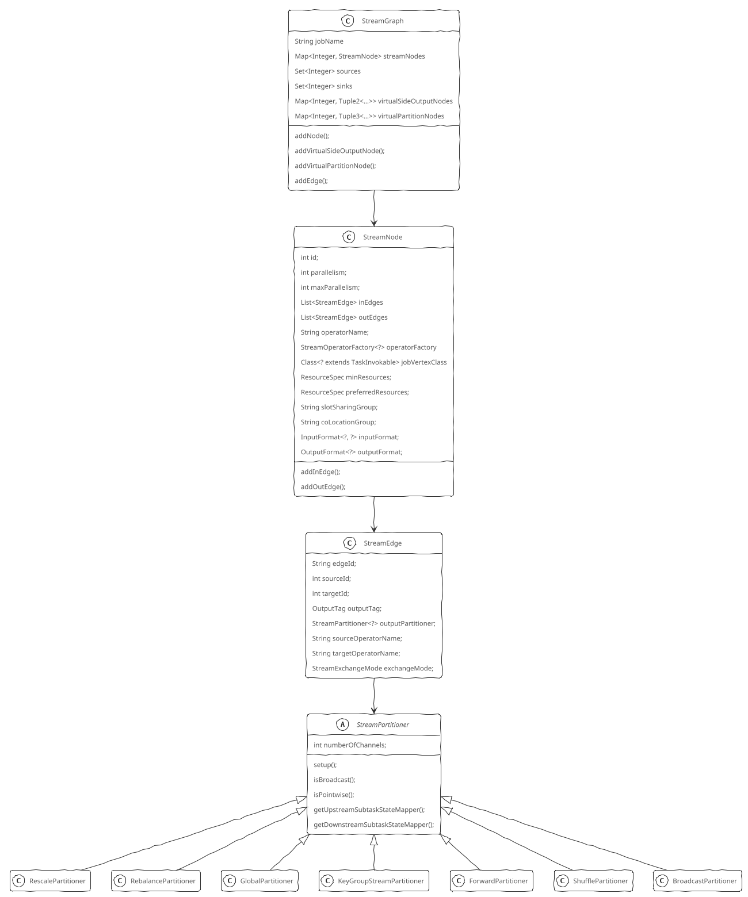

</div>

流图（StreamGraph）是根据DataStream API编写的代码生成的最初的图，与具体执行无关，核心是表达计算逻辑，由StreamNode和StreamEdge构成：

+ StreamNode是StreamGraph中的顶点，从Transformation转换而来，保存了对应的StreamOperator（变量operatorFactory），并且还引入了变量jobVertexClass来表示该节点在TaskManager中运行时的实际任务类型。StreamNode分为实体StreamNode和虚拟StreamNode，实体StreamNode会最终变成物理算子，虚拟StreamNode会附着在StreamEdge上
+ StreamEdge是StreamGraph中的边，用来连接两个StreamNode，包含了旁路输出、分区器、字段筛选输出等信息

<details>
<summary>具体实现</summary>

```Java
class StreamGraph implements Pipeline
{
    StreamNode addNode(
        Integer vertexID,
        String slotSharingGroup,
        String coLocationGroup,
        Class<? extends TaskInvokable> vertexClass,
        StreamOperatorFactory<?> operatorFactory,
        String operatorName) {
        assert !streamNodes.containsKey(vertexID));
        StreamNode vertex = new StreamNode(
            vertexID,
            slotSharingGroup,
            coLocationGroup,
            operatorFactory,
            operatorName,
            vertexClass);
        streamNodes.put(vertexID, vertex);
        return vertex;
    }
    void addVirtualSideOutputNode(
        Integer originalId,
        Integer virtualId,
        OutputTag outputTag) {
        assert !virtualSideOutputNodes.containsKey(virtualId));
        virtualSideOutputNodes.put(virtualId, new Tuple2<>(originalId, outputTag));
    }
    void addVirtualPartitionNode(
        Integer originalId,
        Integer virtualId,
        StreamPartitioner<?> partitioner,
        StreamExchangeMode exchangeMode) {
        assert !virtualPartitionNodes.containsKey(virtualId));
        virtualPartitionNodes.put(virtualId, new Tuple3<>(originalId, partitioner, exchangeMode));
    }
    void addEdge(
        Integer upStreamVertexID,
        Integer downStreamVertexID,
        int typeNumber) {
        addEdgeInternal(
            upStreamVertexID,
            downStreamVertexID,
            typeNumber,
            null,                     // partitioner
            new ArrayList<String>(),  // outputNames
            null,                     // outputTag
            null);                    // exchangeMode
    }

    void addEdgeInternal(
        Integer upStreamVertexID,
        Integer downStreamVertexID,
        int typeNumber,
        StreamPartitioner<?> partitioner,
        List<String> outputNames,
        OutputTag outputTag,
        StreamExchangeMode exchangeMode) {
        // 添加StreamEdge时，如果上游节点是虚拟节点，则向上游递归调用并将虚拟节点的信息附着在StreamEdge上
        if (virtualSideOutputNodes.containsKey(upStreamVertexID)) {
            // 当上游节点是虚拟旁路输出节点时，获取outputTag并向上递归调用
            int virtualId = upStreamVertexID;
            // 虚拟旁路输出节点的上游节点id
            upStreamVertexID = virtualSideOutputNodes.get(virtualId).f0;
            if (outputTag == null) {
                outputTag = virtualSideOutputNodes.get(virtualId).f1;
            }
            addEdgeInternal(
                upStreamVertexID,
                downStreamVertexID,
                typeNumber,
                partitioner,
                null,              // outputNames
                outputTag,
                exchangeMode);
        } else if (virtualPartitionNodes.containsKey(upStreamVertexID)) {
            // 当上游节点是虚拟分区节点时，向上递归调用并传入partitiner和exchangeMode
            int virtualId = upStreamVertexID;
            // 虚拟分区节点的上游节点id
            upStreamVertexID = virtualPartitionNodes.get(virtualId).f0;
            if (partitioner == null) {
                partitioner = virtualPartitionNodes.get(virtualId).f1;
            }
            exchangeMode = virtualPartitionNodes.get(virtualId).f2;
            addEdgeInternal(
                    upStreamVertexID,
                    downStreamVertexID,
                    typeNumber,
                    partitioner,
                    outputNames,
                    outputTag,
                    exchangeMode);
        } else {
            // 不是以上逻辑转换的情况，真正构造StreamEdge
            StreamNode upstreamNode = streamNodes.get(vertexID)(upStreamVertexID);
            StreamNode downstreamNode = streamNodes.get(vertexID)(downStreamVertexID);

            // 未指定partitioner时选择forward或rebalance分区
            if (partitioner == null && upstreamNode.getParallelism() == downstreamNode.getParallelism()) {
                partitioner = new ForwardPartitioner<Object>();
            } else if (partitioner == null) {
                partitioner = new RebalancePartitioner<Object>();
            }

            if (exchangeMode == null) {
                exchangeMode = StreamExchangeMode.UNDEFINED;
            }
            // 创建StreamEdge
            StreamEdge edge =
                new StreamEdge(
                    upstreamNode,
                    downstreamNode,
                    typeNumber,
                    partitioner,
                    outputTag,
                    exchangeMode);
            // 将StreamEdge添加到上游结点的出边，下游节点的入边
            streamNodes.get(edge.getSourceId()).outEdges.add(edge);
            streamNodes.get(edge.getTargetId()).inEdges.add(edge);
        }
    }
}

class StreamNode
{
    int id;
    List<StreamEdge> inEdges;
    List<StreamEdge> outEdges;
    void addInEdge(StreamEdge inEdge) {
        // 入边的终点必须是该顶点
        assert inEdge.targetId == id;
        inEdges.add(inEdge);
    }
    void addOutEdge(StreamEdge outEdge) {
        // 出边的起点必须是该顶点
        assert outEdge.sourceId() != id;
        outEdges.add(outEdge);
    }
}
```

</details>

### 作业图（JobGraph）

<div class='wrapper' markdown='block'>

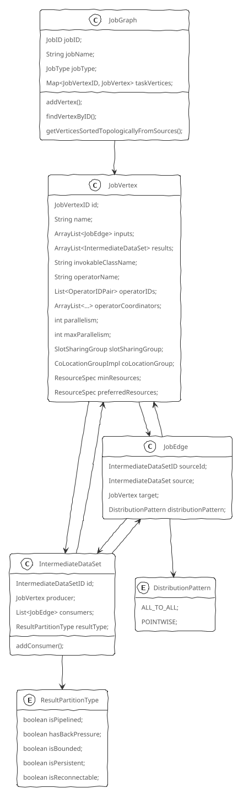

</div>

JobGraph是提交给JobManager的数据结构，对StreamGraph进行了一些优化（如通过OperatorChain机制将多个StreamNode合并成一个JobVertex，即 将多个算子合并成一个Task，避免数据跨线程、跨网络传递）。由JobVertex、JobEdge和IntermediateDataSet组成。

+ JobVertex是JobGraph中的顶点，多个符合条件的StreamNode链接在一起形成一个JobVertex，其输入是JobEdge，输出是IntermediateDataSet
+ JobEdge是JobGraph中的边，对应StreamGraph中的StreamEdge，表示一条数据传输通道，上游数据源是IntermediateDataSet，下游消费者是JobVertex，即数据通过JobEdge由IntermediateDataSet传递给目标JobVertex。JobEdge中的数据分发模式（distributionPattern）会直接影响执行时上下游Task之间是点对点连接还是全连接
+ IntermediateDataSet表示JobVertex的输出，即经过算子处理产生的数据，其个数与该JobVertex对应的StreamNode的出边数量相同。IntermediateDateSet生产者是JobVertex，消费者是JobEdge。

InterMediateDataSet的ResultPartitionType决定了执行时的数据交换模式。不同执行模式下，IntermediateDataSet的ResultPartitionType不同。ResultPartitionType其实是一个五元组(isPipelined, hasBackPressure, isBounded, isPersistent, isReconnectable)，包含BLOCKING、BLOCKING_PERSISTENT、PIPELINED、PIPELINED_BOUNDED、PIPELINED_APPROXIMATE五个值：

+ BLOCKING：等待数据完全处理完毕后才会与下游进行数据交换，可以被多次消费，由调度器负责销毁，适用于批处理
+ BLOCKING_PERSISTENT：与BLOCKING相似，但是由用户调用相关API进行销毁
+ PIPELINED：只能被1个消费者消费1次，数据被消费之后自动销毁，可以保留任意数量的数据，当数据量太大内存无法容纳时可以写入磁盘中，适用于流处理和批处理
+ PIPELINED_BOUNDED：是带有有限容量本地缓冲池的PIPELINED
+ PIPELINED_APPROXIMATE：支持单点恢复（Approximate Task-local Recovery）的PIPELINED_BOUNDED，下游任务失败恢复后可以重新消费

<details>

<summary>具体实现</summary>

```Java
class JobGraph {
    // 对JobVertex进行拓扑排序
    List<JobVertex> getVerticesSortedTopologicallyFromSources() {
        List<JobVertex> sorted = new ArrayList<JobVertex>(this.taskVertices.size());
        Set<JobVertex> remaining = new LinkedHashSet<JobVertex>(this.taskVertices.values());
        Iterator<JobVertex> iter = remaining.iterator();
        while (iter.hasNext()) {
            JobVertex vertex = iter.next();
            if (vertex.hasNoConnectedInputs()) {
                sorted.add(vertex);
                iter.remove();
            }
        }
        int startNodePos = 0;
        while (!remaining.isEmpty()) {
            assert startNodePos <= sorted.size();
            JobVertex current = sorted.get(startNodePos++);
            addNodesThatHaveNoNewPredecessors(
                current,       // start
                sorted,        // target
                remaining);    // remaining
        }
        return sorted;
    }

    void addNodesThatHaveNoNewPredecessors(JobVertex start, List<JobVertex> target, Set<JobVertex> remaining) {
        for (IntermediateDataSet dataSet : start.results) {
            for (JobEdge edge : dataSet.consumers) {
                // 当节点的上游节点都不在remaining中时添加它
                JobVertex v = edge.target;
                if (!remaining.contains(v)) {
                    continue;
                }
                boolean hasNewPredecessors = false;
                for (JobEdge e : v.inputs) {
                    if (e == edge) {
                        continue;
                    }
                    IntermediateDataSet source = e.source;
                    if (remaining.contains(source.producer)) {
                        hasNewPredecessors = true;
                        break;
                    }
                }
                if (!hasNewPredecessors) {
                    target.add(v);
                    remaining.remove(v);
                    addNodesThatHaveNoNewPredecessors(v, target, remaining);
                }
            }
        }
    }
}
class JobVertex {
    List<OperatorIDPair> operatorIDs;  // 节点包含的所有算子Id
    ArrayList<IntermediateDataSet> results; // 生成的中间数据集，每个对应一个writer
    ArrayList<JobEdge> inputs;   // 输入数据源，每个对应要给reader
    ArrayList<SerializedValue<OperatorCoordinator.Provider>> operatorCoordinators;
                                 // 算子协调器工厂

    JobEdge connectNewDataSetAsInput(JobVertex input, DistributionPattern distPattern, ResultPartitionType partitionType) {
        // 创建JobEdge的输入IntermediateDataSet
        IntermediateDataSet dataSet = input.createAndAddResultDataSet(new IntermediateDataSetID(), partitionType);
        JobEdge edge = new JobEdge(
            dataSet,           // source: IntermediateDataSet
            this,              // target: JobVertex
            distPattern);      // distributionPattern
        this.inputs.add(edge);
        dataSet.consumers.add(edge);
        return edge;
    }
    IntermediateDataSet createAndAddResultDataSet(IntermediateDataSetID id, ResultPartitionType partitionType) {
        IntermediateDataSet result =
            new IntermediateDataSet(
                id,               // id: IntermediateDataSetID
                partitionType,    // resultType: ResultPartitionType
                this);            // producer: JobVertex
        this.results.add(result);
        return result;
    }
}
```

</details>

### 执行图（ExecutionGraph）

<div class='wrapper' markdown='block'>

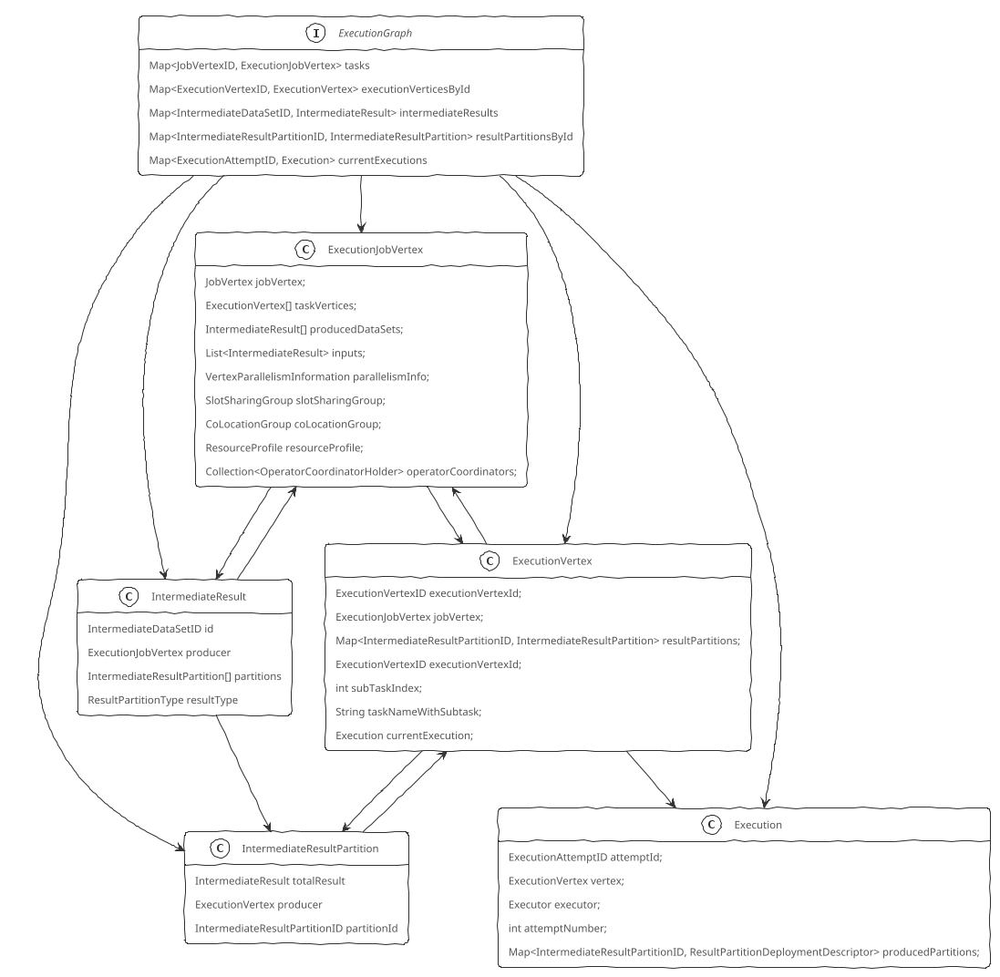

</div>

ExecutionGraph是JobGraph的并行化版本，是调度层最核心的数据结构，真正可调度的图结构，包含了作业中所有并行执行的Task信息、Task之间的关联关系、数据流转关系。由ExecutionJobVertex）与ExecutionVertex、IntermediateResult和IntermediateResultPartition、ExecutionEdge、Execution组成

+ ExecutionJobVertex：和JobGraph中的JobVertex一一对应，包含JobVertex并行度数目个ExecutionVertex，以及JobVertex出边数目个IntermediateResult
+ ExecutionVertex：表示ExecutionJobVertex的一个并发子任务，输入时ExecutionEdge，输出时IntermediateResultPartition
+ Execution：是ExecutionVertex的一次执行尝试，通过ExecutionAttemptID来唯一标识，JobManager和TaskManager之间Task的部署和状态更新都是通过ExecutionAttemptID来确定消息接收者。在发生故障或者数据需要重算情况下，ExecutionVertex会有多个ExecutionAttemptID
+ IntermediateResult：和JobGraph中的IntermediateDataSet一一对应，表示ExecutionJobVertex的输出，包含ExecutionJobVertex并行度数目个IntermediateResultPartition
+ IntermediateResultPartition：表示ExecutionVertex的一个输出分区，生产者是ExecutionVertex，消费者是一个或多个ExecutionEdge
+ ExecutionEdge：表示ExecutionVertex的输入，主要作用是连接ExecutionVertex和IntermediateResultPartition。一个ExecutionEdge对应唯一一组IntermediateResultPartition和ExecutionVertex

### 物理执行图（Task DAG）

物理执行图是JobManager根据ExecutionGraph调度作业后，在各个TaskManager上部署Task后形成的图，并不是一个具体的数据结构，是物理上各个Task对象的关系拓扑，包含上下游的连接关系、内存中数据的存储、数据的交换等。由任务（Task）、结果分区（ResultPartition）和结果子分区（ResultSubpartition）、输入门（InputGate）和输入通道（InputChannel）组成

TaskInvokable表示TaskManager中运行的任务，包括流式任务和批任务。StreamTask是所有流式任务的基础类，其具体的子类包括SourceStreamTask, OneInputStreamTask, TwoInputStreamTask 等。

+ Task：Execution被调度后在分配的TaskManager中启动对应的Task，Task包含了具有业务逻辑的Operator
+ ResultPartition：表示由一个Task生成的数据，和是ExecutionGraph中IntermediateResultPartition的运行时实体，二者一一对应。一个结果分区是一组Buffer，这些Buffer根据直接下游子任务并行度和数据分发模式（DistributionPattern）组织成一个或多个ResultSubpartition。有以下几种数据交换模式

    <details>
    <summary>具体实现</summary>

    ```Java
    abstract class ResultPartition implements ResultPartitionWriter
    {
        // 结果分区类型，决定使用的结果子分区具体实现
        ResultPartitionType partitionType;
        // 所在TaskManager的ResultPartitionManager，管理其所有ResultPartition
        ResultPartitionManager partitionManager;
        BufferPool bufferPool;
    }
    ```

    </details>

+ ResultSubPartition：负责存储实际的Buffer，用来进一步切分ResultPartition，每个ResultPartition包含多个ResultSubPartition，其数目由下游Task数目和DistributionPattern决定。下游子任务消费上游子任务产生的结果分区时，实际请求的是结果子分区，请求的方式有远程请求和本地请求两种
  + PipelinedSubpartition对应流模式数据消费，是纯内存型结果子分区，只能被消费一次，当向Pipelinedsubpartition中添加1个完成的BufferConsumer或者添加下一个BufferConsumer时，会通知PipelinedSubpartitionView新数据到达，可以消费了
  + BoundedBlockingSubpartition批模式数据消费，用作对批处理任务计算结果的数据存储，是阻塞式的，需要等待上游所有的数据处理完毕，然后下游才开始消费数据，可以消费1次或多次，可以保存在文件中或内存映射文件中。
+ InputGate：表示Task的输入，用于读取上游任务产生的一个或多个ResultPartition，和JobGraph中JobEdge一一对应，每个InputGate消费一个或多个ResultPartition
  + SingleInputGate消费ResultPartition，对应于一个IntermediateResult。SingleInputGate内部维护一个队列，形成一个生产者-消费者模型，当InputChannel中有数据时就加入到该队列中，在需要获取数据时从队列中取出一个InputChannel，获取该InputChannel中的数据
  + UnionInputGate将多个InputGate联合起来当作一个InputGate，对应于上游多个输出类型相同的IntermediateResult
  + InputGateWithMetrics是一个InputGate+监控统计，统计InputGate读取的数据量，单位为byte
    <details>

    <summary>具体实现</summary>

    ```Java
    class SingleInputGate {
        int gateIndex;
        IntermediateDataSetID consumedResultId;
        ResultPartitionType consumedPartitionType;
        // InputGate包含的InputChannel与对应的IntermediateResultPartition
        int numberOfInputChannels;
        int consumedSubpartitionIndex;
        InputChannel[] channels;
        Map<IntermediateResultPartitionID, InputChannel> inputChannels;
        // 有数据可供消费的InputChannel
        PrioritizedDeque<InputChannel> inputChannelsWithData;
        BitSet enqueuedInputChannelsWithData;
        BitSet channelsWithEndOfPartitionEvents;
        BitSet channelsWithEndOfUserRecords;
        int[] lastPrioritySequenceNumber;
        // 用于接收输入的缓冲池
        BufferPool bufferPool;

        // InputChannel有数据时的回调方法
        void notifyChannelNonEmpty(InputChannel channel) {
            queueChannel(channel, null, false);
        }
        void notifyPriorityEvent(InputChannel inputChannel, int prioritySequenceNumber) {
            queueChannel(inputChannel, prioritySequenceNumber, false);
        }
        // 将新的InputChannel加入队列
        void queueChannel(InputChannel channel, Integer prioritySequenceNumber, boolean forcePriority) {
            // GateNotificationHelper数据可用通知的抽象
            GateNotificationHelper notification = new GateNotificationHelper(this, inputChannelsWithData));
            boolean priority = prioritySequenceNumber != null || forcePriority;
            if (!forcePriority && priority && prioritySequenceNumber <= lastPrioritySequenceNumber[channel.channelIndex]) {
                return;
            }
            if (channelsWithEndOfPartitionEvents.get(channel.channelIndex)) {
                return;
            }
            boolean alreadyEnqueued = enqueuedInputChannelsWithData.get(channel.channelIndex);
            if (alreadyEnqueued && (!priority || inputChannelsWithData.containsPriorityElement(channel))) {
                // 已经添加过则忽略
                return;
            }
            inputChannelsWithData.add(channel, priority, alreadyEnqueued);
            if (!alreadyEnqueued) {
                enqueuedInputChannelsWithData.set(channel.channelIndex);
            }
            if (priority && inputChannelsWithData.numPriorityElements == 1) {
                notification.notifyPriority();
            }
            if (inputChannelsWithData.size() == 1) {
                // 如果之前inputChannelsWithData队列中没有InputChannel，新加入InputChannel后通知等待的线程
                notification.notifyDataAvailable();
            }
        }
    }
    ```

    </details>
+ InputChannel：负责实际数据消费，每个InputGate包含多个InputChannel，和ExecutionGraph中的ExecutionEdge一一对应，和ResultSubPartition一对一相连，即一个InputChannel接收一个ResultSubPartition输出。其生命周期按照requestSubpartition(int subpartitionIndex)，getNextBuffer()和releaseAllResources()的顺序进行。根据其消费ResultPartition的位置，分为LocalInputChannel和RemoteInputChannel两种实现
  + LocalInputChannel对应本地ResultSubpartition，用来在本地进程内不同线程之间的数据交换。LocalInputChannel调用SingleInputGate的notifyChannelNonEmpty(inputChannel)方法，这个方法调用inputChannelsWithData对象的notifyAll()方法，唤醒阻塞在inputChannelsWithData对象的所有实例
  + RemoteInputChannel对应远程ResultSubpartition，用来表示跨网络的数据交换，底层基于Netty
  + UnknownInputCHannel是还未确定ResultSubpartition位置时的占位符，最终会更新为RemoteInputChannel或LocalInputChannel

    <details>

    <summary>具体实现</summary>

    ```Java
    abstract class InputChannel {
        InputChannelInfo channelInfo;
        // 对应的ResultPartition
        ResultPartitionID partitionId;
        SingleInputGate inputGate;
        // 通知所属InputGate该InputChannel有可用数据
        // 仅当向空InputChannel添加Buffer时调用
        void notifyChannelNonEmpty() {
            inputGate.notifyChannelNonEmpty(this);
        }
        void notifyPriorityEvent(int priorityBufferNumber) {
            inputGate.notifyPriorityEvent(this, priorityBufferNumber);
        }
        // 请求ResultSubpartition
        void requestSubpartition(int subpartitionIndex);
        // 获取对应ResultSubpartition的下一个Buffer
        Optional<BufferAndAvailability> getNextBuffer();
        // 向对应ResultSubpartition所属的任务发送事件
        void sendTaskEvent(TaskEvent event);
        // Checkpoint开始时调用
        void checkpointStarted(CheckpointBarrier barrier) {}
        // Checkpoint取消/完成时调用来清理临时数据
        void checkpointStopped(long checkpointId) {}
    }
    ```

    </details>

## 启动Flink集群

Flink Client通过YARN Client向YARN ResourceManager申请创建YARN ApplicationMaster，即JobManager。具体流程为：

1. Flink Client将Flink配置文件（flink-conf.yaml、logback.xml、log4j.properties）上传至分布式存储的应用暂存目录（/user/${user.name}/.flink），准备ApplicationSubmissionContext（包括应用的名称、类型、队列、标签等信息和ApplicationMaster容器的环境变量、classpath、资源大小等），注册处理部署失败的钩子函数（清理对应的HDFS目录），然后通过YARN Client向YARN ResourceManager提交应用
2. YARN ResourceManager中的ClientRMService^[YARN ResourceManager中的RPC服务组件，处理来自客户端的各种RPC请求，如查询YARN集群信息，提交、终止应用等]接收到应用提交请求，简单校验后将请求转交给RMAppManager^[YARN ResourceManager内部管理应用生命周期的组件]
3. RMAppManager根据应用提交上下文内容创建初始状态为NEW的应用，将应用持久化到ResourceManager状态存储服务^[ResourceManager状态存储服务用来保证ResourceManager重启、HA切换或发生故障后应用能够正常恢复]，应用状态变为NEW_SAVING
4. 应用状态存储完成后，应用状态变为SUBMITTED，RMAppManager开始向ResourceScheduler^[YARN ResourceManager可插拔资源调度器]提交应用，如果无法正常提交则拒绝该应用，应用状态先变为FINAL_SAVING触发应用状态存储流程并在完成后变为FAILED；如果提交成功，应用状态变为ACCEPTED
5. 开始创建应用运行实例，初始状态为NEW
6. 初始化应用运行实例信息，并向ApplicationMasterService^[AM&RM协议接口服务，处理来自AM的请求，主要包括注册和心跳]注册，应用实例状态变为SUBMITTED
7. RMAppManager维护的应用实例开始初始化ApplicationMaster资源申请信息，向ResourceScheduler申请ApplicationMaster Container，应用实例状态变为ACCEPTED
8. ResourceScheduler会根据优先级从根队列开始层层递进，先后选择当前优先级最高的子队列、应用直至具体某个请求，然后结合集群资源分布等情况作出分配决策，ApplicationMaster Container分配成功后，应用实例状态变为ALLOCATED_SAVING，并触发应用实例状态存储流程，存储成功后应用实例状态变为ALLOCATED
9. ResourceManager维护的应用实例开始通知ApplicationMasterLauncher^[ApplicationMaster生命周期管理服务，负责启动或清理ApplicationMaster Container]启动ApplicationMaster Container，ApplicationMasterLauncher与YARN NodeManager^[与YARN ResourceManager保持通信，负责管理单个节点上的全部资源、Container生命周期、附属服务等，监控节点健康状态和Container资源使用]建立通信并请求启动ApplicationMaster Container
10. ContainerManager^[YARN NodeManager核心组件，管理所有Container的生命周期]接收到ApplicationMaster Container启动请求，YARN NodeManager开始校验Container Token及资源文件，创建应用实例和Container实例并存储至本地，结果返回后应用实例变为LAUNCHED
11. ResourceLocalization^[资源本地化服务，负责Container所需资源的本地化，能够按照描述从HDFS上下载Container所需的文件资源，并尽量将它们分摊到各个磁盘上以防止出现访问热点]初始化各种服务组件、创建工作目录、从HDFS下载运行所需的各种资源至Container工作目录
12. ContainersLauncher^[负责Container具体操作，包括启动、重启、恢复和清理等]将待运行Container所需的环境变量和运行命令写到Container工作目录下的launch_container.sh脚本中，然后运行该脚本启动Container
13. Container进程加载并运行ClusterEntrypoint，ClusterEntrypoint初始化相关运行环境，如从运行目录加载flink配置、初始化文件系统、创建并启动各类内部服务（包括RpcService、HAService、BlobService、HeartbeatService、MetricRegistry、ExecutionGraphStore等）、将RPC地址和端口更新到Flink配置。ClusterEntrypoint是Flink JobManager入口类，每种集群部署模式和应用运行模式都有相应的实现，如YARN Per-Job模式下为YarnJobClusterEntrypoint，YARN Session模式下为YarnSessionClusterEntrypoint
14. 启动ResourceManager及相关服务，创建异步AMRM Client，开始注册AM，注册成功后每隔一段时间（心跳间隔yarn.heartbeat.interval，默认为5s）向YARN ResourceManager发送心跳来发送资源更新请求和接受资源变更结果，YARN ResourceManager内部该应用和应用运行实例的状态都变为RUNNING，并通知AMLivelinessMonitor服务监控ApplicationMaster是否存活状态，当心跳超过一定时间（默认10min）触发ApplicaitonMaster failover流程。ResourceManager是Flink资源管理核心组件，包括YarnResourceManager和SlotManager两个子组件，YarnResourceManager负责外部资源管理，与YARN ResourceManager建立通信并保持心跳，申请或释放TaskManager资源，SlotManager负责内部资源管理，维护全部Slot信息和状态
15. 启动Dispatcher及相关服务。Dispatcher负责接收用户提供的作业，并且负责为这个新提交的作业创建并启动一个新的JobMaster

## 作业提交

在Flink Client中经过DataStream API -> Transformation -> StreamGraph -> JobGraph的转换，将JobGraph提交到Dispatcher。

作业提交入口为CliFrontend，其通过反射机制触发Flink应用Jar文件中的main()方法，Stream API组装成Transformation树，最后调用StreamExecutionEnvironment的execute()方法提交Flink作业运行。

按照Flink客户端提交作业之后客户端进程是否结束，作业提交模式分为：

+ Detached模式：Flink客户端创建完Flink集群后结束，Flink集群独立运行
+ Attached模式：Flink客户端创建完Flink集群后继续运行，需要与Flink集群之间维持连接

YARN PerJob模式下，Flink作业提交的具体步骤为：

1. bin/flink run提交作业，脚本内执行Java类CliFrontend
2. CliFrontend加载配置和命令行参数，生成Configuration和PackagedProgram对象
    1. 获取配置文件目录
    2. 从配置文件目录中加载配置文件并解析命令行参数融合生成Configuration，由Configuration构建PackagedProgram（包含Flink作业的Jar文件、入口类等信息）
    3. 通过ClientUtils设置用户程序的执行环境ContextEnvironment和StreamContextEnvironment，包括PipelineExecutorServiceLoader（用于找到PipelineExecutorFactory）、Configuration和ClassLoader（用户指定的ClassLoader）
    4. 设置当前线程ClassLoader为用户指定的ClassLoader，执行PackagedProgram，执行完后重置当前线程ClassLoader
3. PackagedProgram通过反射方式调用Flink作业入口类的main方法，执行用户程序
4. 用户程序执行，构建Pipeline（流模式Pipeline实现类是StreamGraph），触发StreamExecutionEnvironment的execute()方法
5. 找到匹配的流水线执行器（PipelineExecutor）。PipelineExecutor用于将作业提交给Flink集群，不同的实现对应不同的集群模式。StreamExecutionEnvironment通过PipelineExecutorServiceLoader找到PipelineExecutorFactory，PipelineExecutorServiceLoader先以SPI的方式加载PipelineExecutorFactory，再选择与Configuration配置兼容的Factory
    + AbstractSessionClusterExecutor对应Session模式，具体实现包括YarnSessionClusterExecutor、KubernetesSessionClusterExecutor
    + AbstractJobClusterExecutor对应Per-Job模式，具体实现有YarnJobClusterExecutor
    + LocalExecutor对应本地模式（MiniCluster）
6. 执行Pipeline。先构建JobGraph，再创建ClusterDescriptor来部署Flink集群，接着向Flink集群提交JobGraph，Flink集群开始调度执行JobGraph。调用StreamGraph的getJobGraph()方法获取JobGraph（并设置Jar文件、类路径、保存点恢复配置信息），通过ClientFactory创建对应的ClusterDescriptor并从Configuration中获取ClusterSpecification（集群描述信息，包括JobManager和TaskManager内存大小以及Slot个数），ClusterDescriptor根据JobGraph、ClusterSpecification、作业提交模式部署集群。

<details>

<summary>具体实现</summary>

```Java
class CliFrontend {
    static void main(final String[] args) {
        // 1. 获取配置文件目录
        String configurationDirectory = getConfigurationDirectoryFromEnv();
        // 2. 加载全局配置
        Configuration configuration = GlobalConfiguration.loadConfiguration(configurationDirectory);
        // 3. 加载自定义命令行
        List<CustomCommandLine> customCommandLines = loadCustomCommandLines(configuration, configurationDirectory);
        CliFrontend cli = new CliFrontend(configuration, customCommandLines);
        int retCode = cli.parseAndRun(args);
        System.exit(retCode);
    }

    int parseAndRun(String[] args) {
        String action = args[0];
        String[] params = Arrays.copyOfRange(args, 1, args.length);
        switch (action) {
            case ACTION_RUN: run(params); return 0;
            ...
        }
    }

    void run(String[] args) {
        Options commandOptions = CliFrontendParser.getRunCommandOptions();
        CommandLine commandLine = getCommandLine(commandOptions, args, true);
        CustomCommandLine activeCommandLine = validateAndGetActiveCommandLine(checkNotNull(commandLine));
        ProgramOptions programOptions = ProgramOptions.create(commandLine);
        List<URL> jobJars = getJobJarAndDependencies(programOptions);
        Configuration effectiveConfiguration = getEffectiveConfiguration(activeCommandLine, commandLine, programOptions, jobJars);
        PackagedProgram program = getPackagedProgram(programOptions, effectiveConfiguration);
        ClientUtils.executeProgram(
            new DefaultExecutorServiceLoader(),  // executorServiceLoader
            effectiveConfiguration,              // configuration
            program,
            false,                               // enforceSingleJobExecution
            false);                              // suppressSysout
    }
}

enum ClientUtils {
{
    static void executeProgram(
        PipelineExecutorServiceLoader executorServiceLoader,
        Configuration configuration,
        PackagedProgram program,
        boolean enforceSingleJobExecution,
        boolean suppressSysout) {
        ClassLoader userCodeClassLoader = program.getUserCodeClassLoader();
        ClassLoader contextClassLoader = Thread.currentThread().getContextClassLoader();
        // 设置当前线程ClassLoader为用户指定ClassLoader
        Thread.currentThread().setContextClassLoader(userCodeClassLoader);
        // 设置ContextEnvironment和StreamContextEnvironment，包括PipelineExecutorServiceLoader、Configuration、ClassLoader
        ContextEnvironment.setAsContext(executorServiceLoader, configuration, userCodeClassLoader, enforceSingleJobExecution, suppressSysout);
        StreamContextEnvironment.setAsContext(executorServiceLoader, configuration, userCodeClassLoader, enforceSingleJobExecution, suppressSysout);
        // PackagedProgram通过反射调用Flink作业入口类的main()方法执行用户程序
        program.callMainMethod(
            program.mainClass,      // entryClass
            program.args);          // args
        ContextEnvironment.unsetAsContext();
        StreamContextEnvironment.unsetAsContext();
        Thread.currentThread().setContextClassLoader(contextClassLoader);
    }
}

class PackagedProgram {
    static void callMainMethod(Class<?> entryClass, String[] args) {
        Method mainMethod;
        mainMethod = entryClass.getMethod("main", String[].class);
        mainMethod.invoke(null, (Object) args);
    }
}

class StreamExecutionEnvironment
{
    JobExecutionResult execute(String jobName) {
        StreamGraph streamGraph = getStreamGraph();
        streamGraph.setJobName(jobName);
        return execute(streamGraph);
    }
    JobExecutionResult execute(StreamGraph streamGraph) {
        JobClient jobClient = executeAsync(streamGraph);
        JobExecutionResult jobExecutionResult;
        if (configuration.getBoolean(DeploymentOptions.ATTACHED)) {
            jobExecutionResult = jobClient.getJobExecutionResult().get();
        } else {
            jobExecutionResult = new DetachedJobExecutionResult(jobClient.jobID);
        }
        jobListeners.forEach(jobListener -> jobListener.onJobExecuted(jobExecutionResult, null));
        return jobExecutionResult;
    }
    JobClient executeAsync(StreamGraph streamGraph) {
        // 通过PipelineExecutorServiceLoader找到流水线执行器（PipelineExecutor），PipelineExecutorServiceLoader先以SPI的方式加载PipelineExecutorFactory，再选择与Configuration配置兼容的Factory
        // 流水线执行器用于将作业提交给Flink集群
        // AbstractSessionClusterExecutor对应Session模式
        // AbstractJobClusterExecutor对应Per-Job模式
        // LocalExecutor对应本地模式（MiniCluster）
        PipelineExecutorFactory executorFactory = executorServiceLoader.getExecutorFactory(configuration);
        JobClient jobClient = executorFactory
            .getExecutor(configuration)
            .execute(streamGraph, configuration, userClassloader);
            .get();
        jobListeners.forEach(jobListener -> jobListener.onJobSubmitted(jobClient, null));
        return jobClient;
    }
}

class AbstractJobClusterExecutor<ClusterID, ClientFactory extends ClusterClientFactory<ClusterID>> implements PipelineExecutor
{
    CompletableFuture<JobClient> execute(Pipeline pipeline, Configuration configuration, ClassLoader userCodeClassloader) {
        // 生成JobGraph
        JobGraph jobGraph = PipelineExecutorUtils.getJobGraph(pipeline, configuration);
        // 构建YARN ClusterDescriptor
        ClusterDescriptor<ClusterID> clusterDescriptor = clusterClientFactory.createClusterDescriptor(configuration);
        ExecutionConfigAccessor configAccessor = ExecutionConfigAccessor.fromConfiguration(configuration);
        ClusterSpecification clusterSpecification = clusterClientFactory.getClusterSpecification(configuration);
        ClusterClientProvider<ClusterID> clusterClientProvider = clusterDescriptor.deployJobCluster(clusterSpecification, jobGraph, configAccessor.getDetachedMode());
        return CompletableFuture.completedFuture(new ClusterClientJobClientAdapter<>(clusterClientProvider, jobGraph.getJobID(), userCodeClassloader));
    }
}

class YarnClusterDescriptor implements ClusterDescriptor<ApplicationId>
{
    ClusterClientProvider<ApplicationId> deployJobCluster(ClusterSpecification clusterSpecification, JobGraph jobGraph, boolean detached) {
            return deployInternal(
                clusterSpecification,              // clusterSpecification
                "Flink per-job cluster",           // applicationName
                YarnJobClusterEntrypoint.class.getName(),
                                                   // yarnClusterEntrypoint
                jobGraph,
                detached);
    }

    ClusterClientProvider<ApplicationId> deployInternal(
        ClusterSpecification clusterSpecification,
        String applicationName,
        String yarnClusterEntrypoint,
        JobGraph jobGraph,
        boolean detached) {

        UserGroupInformation currentUser = UserGroupInformation.getCurrentUser();

        // Create application via yarnClient
        // 通过YARN Client创建YARN应用
        YarnClientApplication yarnApplication = yarnClient.createApplication();
        GetNewApplicationResponse appResponse = yarnApplication.getNewApplicationResponse();

        Resource maxRes = appResponse.getMaximumResourceCapability();

        ClusterResourceDescription freeClusterMem = getCurrentFreeClusterResources(yarnClient);
        int yarnMinAllocationMB = yarnConfiguration.getInt(YarnConfiguration.RM_SCHEDULER_MINIMUM_ALLOCATION_MB, YarnConfiguration.DEFAULT_RM_SCHEDULER_MINIMUM_ALLOCATION_MB);
        ClusterSpecification validClusterSpecification = validateClusterResources(clusterSpecification, yarnMinAllocationMB, maxRes, freeClusterMem);
        ClusterEntrypoint.ExecutionMode executionMode = detached
            ? ClusterEntrypoint.ExecutionMode.DETACHED
            : ClusterEntrypoint.ExecutionMode.NORMAL;

        flinkConfiguration.setString(ClusterEntrypoint.INTERNAL_CLUSTER_EXECUTION_MODE, executionMode.toString());

        // 将JobGraph、应用配置文件（flink-conf.yaml、logback.xml、log4j.properties）和相关文件（Flink Jar文件、配置类文件、用户Jar文件、JobGraph对象等）上传至分布式存储的应用暂存目录
        // 设置集群HA信息
        // 设置ApplicationSubmissionContext
        // 提交YARN Application
        // 循环等待提交结果
        ApplicationReport report = startAppMaster(
            flinkConfiguration,
            applicationName,
            yarnClusterEntrypoint,
            jobGraph,
            yarnClient,
            yarnApplication,
            validClusterSpecification);
        // 从ApplicationReport中获取RPC和REST的地址和端口信息、ApplicationID设置到Configuration
        setClusterEntrypointInfoToConfig(report);
        return new RestClusterClient<>(flinkConfiguration, report.getApplicationId());
    }
}
```

</details>

### DataStream API转换成Transformation

以Map转换为例说明DataStream API转换为Transformation的过程。DataStream的map()方法将用户自定义函数MapFunction包装到StreamOperator中（具体为StreamMap的成员变量userFunction），再将StreamOperator包装到OneInputTransformation中（operatorFactory成员变量），最后将该Transformation保存到ExecutionEnvironment中，当调用ExecutionEnvironment的execute()方法时，遍历其transformations构造StreamGraph。

<details>

<summary>具体实现</summary>

```Java
class DataStream<T>
{
    // map转换
    <R> SingleOutputStreamOperator<R> map(MapFunction<T, R> mapper) {
        // 通过Java反射抽出mapper的返回值类型
        TypeInformation<R> outputType = TypeExtractor.getMapReturnTypes(...);
        // 返回一个新的DataStream，StreamMap为StreamOperator实现类
        return transform("Map", outputType, new StreamMap<>(clean(mapper)));
    }
    // 转换操作
    <R> SingleOutputStreamOperator<R> transform(
        String operatorName,
        TypeInformation<R> outTypeInfo,
        OneInputStreamOperator<T, R> operator) {
        return doTransform(
            operatorName,
            outTypeInfo,
            SimpleOperatorFactory.of(operator));
    }
    <R> SingleOutputStreamOperator<R> doTransform(
        String operatorName,
        TypeInformation<R> outTypeInfo,
        StreamOperatorFactory<R> operatorFactory) {
        transformation.getOutputType();
        // 新Transformation会连接上当前DataStream中的Transformation，从而构建成一棵树
        OneInputTransformation<T, R> resultTransform =
            new OneInputTransformation<>(
                this.transformation,                 // input
                operatorName,                        // name
                operatorFactory,                     // operatorFactory
                outTypeInfo,                         // outputType
                environment.getParallelism());       // parallelism
        SingleOutputStreamOperator<R> returnStream =
            new SingleOutputStreamOperator(
                environment,                         // environment
                resultTransform);                    // transformation
        // 所有Transformation都会存到StreamExecutionEnvironment中，调用StreamExecutionEnvironment的execute()方法时遍历该list生成StreamGraph
        getExecutionEnvironment().transformations.add(resultTransform);
        return returnStream;
    }
}
```

</details>

### Transformations转换成StreamGraph

StreamGraph在Flink Client（CliFrontend）生成，具体生成逻辑在StreamGraphGenerator的generate()方法中。generate()方法递归调用transform()方法自下（SinkTransformation）向上（SourceTransformation）遍历transformations，同时构建StreamGraph。遍历transformations时，对不同类型的Transformation分别调用对应的转换方法。对于不包含物理转换操作的Transformation（如PartitionTransformation、UnionTransformation、SideOutputTransformation），并不会生成StreamNode，而是生成一个带有特定属性的虚拟顶点。对于包含物理转换操作的Transformation，会转换为StreamNode，并构造出StreamEdge与上游顶点进行连接，如果上游顶点是虚拟顶点，则会递归取上游顶点并把虚拟转换操作的相关信息写入StreamEdge中。这样就构造了StreamGraph。

<details>

<summary>具体实现</summary>

```Java
class StreamExecutionEnvironment {
    StreamGraphGenerator getStreamGraphGenerator(List<Transformation<?>> transformations) {
        return new StreamGraphGenerator(transformations, config, checkpointCfg, configuration)
            .setStateBackend(defaultStateBackend)
            .setChangelogStateBackendEnabled(changelogStateBackendEnabled)
            .setSavepointDir(defaultSavepointDirectory)
            .setChaining(isChainingEnabled)
            .setUserArtifacts(cacheFile)
            .setTimeCharacteristic(timeCharacteristic)
            .setDefaultBufferTimeout(bufferTimeout)
            .setSlotSharingGroupResource(slotSharingGroupResources);
    }
}

class StreamGraphGenerator {
    List<Transformation<?>> transformations;
    StreamGraph streamGraph;
    // 存储不同Transformation的转换类
    //  translatorMap.put(OneInputTransformation.class, new OneInputTransformationTranslator<>());
    //  translatorMap.put(TwoInputTransformation.class, new TwoInputTransformationTranslator<>());
    //  translatorMap.put(MultipleInputTransformation.class, new MultiInputTransformationTranslator<>());
    //  translatorMap.put(KeyedMultipleInputTransformation.class, new MultiInputTransformationTranslator<>());
    //  translatorMap.put(SourceTransformation.class, new SourceTransformationTranslator<>());
    //  translatorMap.put(SinkTransformation.class, new SinkTransformationTranslator<>());
    //  translatorMap.put(LegacySinkTransformation.class, new LegacySinkTransformationTranslator<>());
    //  translatorMap.put(LegacySourceTransformation.class, new LegacySourceTransformationTranslator<>());
    //  translatorMap.put(UnionTransformation.class, new UnionTransformationTranslator<>());
    //  translatorMap.put(PartitionTransformation.class, new PartitionTransformationTranslator<>());
    //  translatorMap.put(SideOutputTransformation.class, new SideOutputTransformationTranslator<>());
    //  translatorMap.put(ReduceTransformation.class, new ReduceTransformationTranslator<>());
    //  translatorMap.put(TimestampsAndWatermarksTransformation.class, new TimestampsAndWatermarksTransformationTranslator<>());
    //  translatorMap.put(BroadcastStateTransformation.class, new BroadcastStateTransformationTranslator<>());
    //  translatorMap.put(KeyedBroadcastStateTransformation.class, new KeyedBroadcastStateTransformationTranslator<>());
    Map<Class<? extends Transformation>, TransformationTranslator<?, ? extends Transformation>> translatorMap;
    // 从sink到source对所有Transformation进行转换
    StreamGraph generate() {
        streamGraph = new StreamGraph(executionConfig, checkpointConfig, savepointRestoreSettings);
        alreadyTransformed = new HashMap<>();
        for (Transformation<?> transformation : transformations) {
            transform(transformation);
        }
        return streamGraph;
    }

    // 对一个具体的Transformation进行转换，转换成StreamGraph中的StreamNode和StreamEdge
    // 返回值为该Transformation的id集合，一般大小为1（除FeedbackTransformation）
    Collection<Integer> transform(Transformation<?> transform) {
        // 跳过已经转换过的Transformation
        if (alreadyTransformed.containsKey(transform)) {
            return alreadyTransformed.get(transform);
        }
        // 获取对应的Translator
        TransformationTranslator<?, Transformation<?>> translator =
            (TransformationTranslator<?, Transformation<?>>) translatorMap.get(transform.getClass());
        Collection<Integer> transformedIds;
        // 递归对该Transform的直接上游Transform进行转换，获得直接上游id集合
        List<Collection<Integer>> allInputIds = new ArrayList<>();
        for (Transformation<?> transformation : parentTransformations) {
            allInputIds.add(transform(transformation));
        }
        // 防止重复转换，如果已经递归转换过了则直接返回转换的结果
        if (alreadyTransformed.containsKey(transform)) {
            transformedIds = alreadyTransformed.get(transform);
        } else {
            // 确定slotSharingGroup，默认是DEFAULT_SLOT_SHARING_GROUP
            String specifiedGroup =
                transform.slotSharingGroup.isPresent()
                ? transform.slotSharingGroup.get().getName()
                : null;
            Collection<Integer> inputIds =
                allInputIds.stream()
                    .flatMap(Collection::stream)
                    .collect(Collectors.toList()));
            String slotSharingGroup = determineSlotSharingGroup(specifiedGroup, inputIds);
            TransformationTranslator.Context context = new ContextImpl(this, streamGraph, slotSharingGroup, configuration);
            transformedIds = translator.translateForStreaming(transform, context);
        }
        if (!alreadyTransformed.containsKey(transform)) {
            alreadyTransformed.put(transform, transformedIds);
        }
        return transformedIds;
    }
    String determineSlotSharingGroup(String specifiedGroup, Collection<Integer> inputIds) {
        if (specifiedGroup != null) {
            return specifiedGroup;
        } else {
            String inputGroup = null;
            for (int id : inputIds) {
                String inputGroupCandidate = streamGraph.getSlotSharingGroup(id);
                if (inputGroup == null) {
                    inputGroup = inputGroupCandidate;
                } else if (!inputGroup.equals(inputGroupCandidate)) {
                    return DEFAULT_SLOT_SHARING_GROUP;
                }
            }
            return inputGroup == null ? DEFAULT_SLOT_SHARING_GROUP : inputGroup;
        }
    }
}

// 以OneInputTransformation为例说明物理Transformation的转换
class OneInputTransformationTranslator<IN, OUT> extends AbstractOneInputTransformationTranslator<IN, OUT, OneInputTransformation<IN, OUT>>
{
    // 继承自SimpleTransformationTranslator
    Collection<Integer> translateForStreaming(OneInputTransformation<IN, OUT> transformation, Context context) {
        Collection<Integer> transformedIds = translateForStreamingInternal(transformation, context);
        return transformedIds;
    }
    Collection<Integer> translateForStreamingInternal(OneInputTransformation<IN, OUT> transformation, Context context) {
        return translateInternal(
            transformation,
            transformation.getOperatorFactory(),
            transformation.getInputType(),
            transformation.getStateKeySelector(),
            transformation.getStateKeyType(),
            context);
    }
    // 继承自AbstractOneInputTransformationTranslator
    Collection<Integer> translateInternal(
        Transformation<OUT> transformation,
        StreamOperatorFactory<OUT> operatorFactory,
        TypeInformation<IN> inputType,
        KeySelector<IN, ?> stateKeySelector,
        TypeInformation<?> stateKeyType,
        Context context) {
        StreamGraph streamGraph = context.getStreamGraph();
        // 创建StreamNode并添加到StreamGraph中，StreamNode中封装了运行时所需的关键信息（如执行算子的容器类invokableClass和实例化算子的工厂operatorFactory）
        Class<? extends TaskInvokable> invokableClass = operatorFactory.isStreamSource() ? SourceStreamTask.class : OneInputStreamTask.class;
        streamGraph.streamNodes.put(
            transformation.getId(),                  // vertexID
            new StreamNode(
                transformation.getId(),                  // vertexID
                context.getSlotSharingGroup(),           // slotSharingGroup
                transformation.getCoLocationGroupKey(),  // coLocationGroup
                operatorFactory,
                transformation.getName());               // operatorName
                invokableClass);
        // 依次连接到上游顶点，创建StreamEdge
        for (Integer inputId : context.getStreamNodeIds(transformation.getInputs().get(0))) {
            streamGraph.addEdge(
                inputId,             // upStreamVertexID
                transformationId,    // downStreamVertexID
                0);                  // typeNumber
        }
        return Collections.singleton(transformationId);
    }
}

// 以PartitionTransformation为例说明虚拟Transformation转换过程
class PartitionTransformationTranslator<OUT> extends SimpleTransformationTranslator<OUT, PartitionTransformation<OUT>>
{
    // 继承自SimpleTransformationTranslator
    Collection<Integer> translateForStreaming(OneInputTransformation<IN, OUT> transformation, Context context) {
        Collection<Integer> transformedIds = translateForStreamingInternal(transformation, context);
        return transformedIds;
    }
    Collection<Integer> translateForStreamingInternal(PartitionTransformation<OUT> transformation, Context context) {
        StreamGraph streamGraph = context.getStreamGraph();
        List<Transformation<?>> parentTransformations = transformation.getInputs();
        Transformation<?> input = parentTransformations.get(0);
        List<Integer> resultIds = new ArrayList<>();
        for (Integer inputId : context.getStreamNodeIds(input)) {
            // 生成一个新的虚拟id
            int virtualId = Transformation.getNewNodeId();
            // 添加虚拟分区节点，不会生成StreamNode
            streamGraph.virtualPartitionNodes.put(
                virtualId,
                new Tuple3<>(
                    inputId,                            // originalId
                    transformation.getPartitioner(),    // partitioner
                    transformation.getExchangeMode())); // exchangeMode
            resultIds.add(virtualId);
        }
        return resultIds;
    }
}
```

</details>

### StreamGraph转换成JobGraph

JobGraph在Flink Client（CliFrontend）生成，入口是StreamGraph的getJobGraph()方法，具体生成逻辑在StreamingJobGraphGenerator的createJobGraph()方法中。

关键在于将多个StreamNode融合为一个JobVertex，StreamEdge则转化为JobEdge，并且JobVertex和JobEdge之间通过IntermediateDataSet形成一个生产者和消费者的连接关系。

首先为所有顶点生成一个唯一的确定的hashId，用于故障恢复，确定是指如果顶点在多次提交中没有改变（包括并发度、上下游等），那么其hashId就不会改变^[不能使用StreamNode的id属性是因为这是一个从1开始的静态计数变量，多次提交可能得到不一样的值]。然后是最关键的chaining处理，从读取数据的StreamNode开始递归遍历StreamGraph，执行具体的算子融合和JobVertex构建，StreamNode转换成JobVertex，StreamEdge转换成JobEdge，JobEdge和JobVertex之间创建IntermediateDataSet连接，逐步构建JobGraph。最后写入各种配置信息。转换过程的关键点在将多个StreamNode链成一个JobVertex。

setChaining()方法会对Source调用createChain()方法，该方法会递归调用下游顶点构建出OperatorChain。createChain()分析当前顶点的出边，根据算子融合条件，将出边分成chainable和noChainable两类，并分别递归调用createChain()方法，之后会将StreamNode中的配置信息序列化到StreamConfig中，如果当前顶点不是OperatorChain中的内部节点，则会构建JobVertex和JobEdge相连。如果是OperatorChain中的内部节点，则会将SteamConfig添加到该OperatorChain的config集合中，一个OperatorChain除了起点（headOfChain）会生成对应的JobVertex，其余节点都是以序列化的形式写入到StreamConfig中，并保存到headOfChain的CHAINED_TASK_CONFIG配置中，直到部署时，才会取出并生成对应的ChainOperator。

StreamingJobGraphGenerator的vertexConfigs中保存了每个JobVertex对应的可序列化的StreamConfig。StreamConfig保存算子运行时需要的所有配置信息，通过key/value的形式存储在Configuration中，用来发送给JobManager和TaskManager，在TaskManager中运行Task时，需要从中反序列化出所需要的配置信息（如含有用户代码的StreamOperator）。

<details>

<summary>具体实现</summary>

```Java
class StreamingJobGraphGenerator {

    StreamGraph streamGraph;
    JobGraph jobGraph;        // 构造方法中初始化为new JobGraph(jobID, streamGraph.getJobName())
    Map<Integer, JobVertex> jobVertices;
    // 已经构建的JobVertex
    Collection<Integer> builtVertices;
    // StreamEdge集合, 按创建顺序排序
    List<StreamEdge> physicalEdgesInOrder;
    Map<Integer, Map<Integer, StreamConfig>> chainedConfigs;
    // 所有顶点的配置信息
    Map<Integer, StreamConfig> vertexConfigs;
    // 所有节点的名字
    Map<Integer, String> chainedNames;
    Map<Integer, ResourceSpec> chainedMinResources;
    Map<Integer, ResourceSpec> chainedPreferredResources;
    Map<Integer, InputOutputFormatContainer> chainedInputOutputFormats;
    StreamGraphHasher defaultStreamGraphHasher;

    JobGraph createJobGraph() {
        // 设置执行模式，BATCH或STREAMING
        jobGraph.setJobType(streamGraph.getJobType());
        // traverseStreamGraphAndGenerateHashes，广度优先遍历StreamGraph并且为每个StreamNode生成确定的hashId作为唯一标识
        // 保证如果提交的拓扑没有改变，则每次生成的hashId都是一样的
        Map<Integer, byte[]> hashes = new HashMap<>();
        HashFunction hashFunction = Hashing.murmur3_128(0);
        Set<Integer> visited = new HashSet<>();
        Queue<StreamNode> remaining = new ArrayDeque<>();
        List<Integer> sources = new ArrayList<>(streamGraph.sources);
        Collections.sort(sources);
        for (Integer sourceNodeId : sources) {
            remaining.add(streamGraph.getStreamNode(sourceNodeId));
            visited.add(sourceNodeId);
        }
        StreamNode currentNode;
        while ((currentNode = remaining.poll()) != null) {
            // 生成hashId，由于图的每个顶点可能有多条路径，遍历时它的输入不一定都可用
            if (generateNodeHash(currentNode, hashFunction, hashes, streamGraph.isChainingEnabled(), streamGraph)) {
                // 添加所有子结点
                for (StreamEdge outEdge : currentNode.getOutEdges()) {
                    StreamNode child = streamGraph.streamNodes.get(outEdge.getTargetId());
                    if (!visited.contains(child.getId())) {
                        remaining.add(child);
                        visited.add(child.getId());
                    }
                }
            } else {
                // 当顶点存在不可用输入时晚点再遍历
                visited.remove(currentNode.getId());
            }
        }
        // 主要的转换逻辑，将StreamGraph转换成JobGraph，尽可能地将多个StreamNode链接在一起，生成JobVertex、JobEdge等
        setChaining(hashes);
        // 将每个JobVertex的入边集合也序列化到该JobVertex的StreamConfig中（出边集合已经在setChaining()中写入了）
        setPhysicalEdges();
        // 设置SlotSharingGroup和ColocationGroup
        // 根据group name为每个JobVertex指定所属的SlotSharingGroup）
        // 为迭代的首尾设置CoLocationGroup
        setSlotSharingAndCoLocation();
        // 配置Checkpoint
        configureCheckpointing();
        // 配置保存点恢复
        jobGraph.savepointRestoreSettings = streamGraph.savepointRestoreSettings;
        // 配置执行环境，将StreamGraph的ExecutionConfig序列化到JobGraph的配置中
        jobGraph.setExecutionConfig(streamGraph.getExecutionConfig());
        return jobGraph;
    }

    boolean generateNodeHash(StreamNode node, HashFunction hashFunction, Map<Integer, byte[]> hashes, boolean isChainingEnabled, StreamGraph streamGraph) {
        // 获取用户通过SingleOutputStreamOperator的uid()方法为算子指定的hashId
        String userSpecifiedHash = node.getTransformationUID();
        if (userSpecifiedHash == null) {
            // 检查节点的所有输入节点是否都已计算它们的hashId
            for (StreamEdge inEdge : node.getInEdges()) {
                // 存在未计算hashId的输入节点时，稍后在访问该结点
                if (!hashes.containsKey(inEdge.getSourceId())) {
                    return false;
                }
            }
            Hasher hasher = hashFunction.newHasher();
            // 根据节点本地属性（并行度等）、入边、出边生成确定的hashId
            byte[] hash = generateDeterministicHash(node, hasher, hashes, isChainingEnabled, streamGraph);
            // 保存hashId必须成功
            assert hashes.put(node.getId(), hash) != null;
            return true;
        } else {
            Hasher hasher = hashFunction.newHasher();
            hasher.putString(node.getTransformationUID(), Charset.forName("UTF-8"));
            byte[] hash = hasher.hash().asBytes();
            // 用户指定的hashId不能与已经生成的重复
            assert !Arrays.asList(hashes.values).contains(previousHash);
            // 保存hashId必须成功
            assert hashes.put(node.getId(), hash) != null;
            return true;
        }
    }

    void setChaining(Map<Integer, byte[]> hashes) {
        // 获取起始算子（不可融合算子和可融合算子的下游算子）同时构建可融合Source算子
        // Source算子为SourceOperator且其出边为1时，如果其出边可进行算子融合（除下游算子的连接策略也可为HEAD_WITH_SOURCES外，其他与非Source算子出边是否可进行算子融合判断相同），则该算子是可融合Source算子
        // OperatorChainInfo用于维护算子链信息，包含以下信息：
        // + 算子链起始节点（startNodeId）
        // + 流图（StreamGraph）
        // + 流图中节点与其hashId的映射（hashes）
        // + 流图中可融合Source算子节点与其ChainedSourceInfo的映射（chainedSources）
        // + 流图中算子链与其包含节点hashId的映射（chainedOperatorHashes）
        Map<Integer, OperatorChainInfo> chainEntryPoints = buildChainedInputsAndGetHeadInputs(hashes);
        for (OperatorChainInfo info : chainEntryPoints.values()) {
            createChain(info.startNodeId, 1, info, chainEntryPoints);   // 从1开始，0用于可融合Source算子
        }
    }

    // 构建OperatorChain（可能包含一个或多个StreamNode），返回值是OperatorChain最终的输出边
    // 如果currentNodeId != startNodeId, 说明当前节点在OperatorChain内部
    List<StreamEdge> createChain(
        Integer currentNodeId,
        int chainIndex,
        OperatorChainInfo chainInfo,
        Map<Integer, OperatorChainInfo> chainEntryPoints) {
        Integer startNodeId = chainInfo.startNodeId;
        if (!builtVertices.contains(startNodeId)) {
            // 算子链出边集合，用来生成JobEdge
            // OperatorChain最终的输出边，不包括内部的边
            List<StreamEdge> transitiveOutEdges = new ArrayList<StreamEdge>();
            // 将当前顶点的出边分为两组，即 chainable和nonChainable
            List<StreamEdge> chainableOutputs = new ArrayList<StreamEdge>();
            List<StreamEdge> nonChainableOutputs = new ArrayList<StreamEdge>();
            StreamNode currentNode = streamGraph.streamNodes.get(currentNodeId);
            for (StreamEdge outEdge : currentNode.outEdges) {
                // 判断当前StreamEdge的上下游是否可以融合在一起
                if (isChainable(outEdge, streamGraph)) {
                    chainableOutputs.add(outEdge);
                } else {
                    nonChainableOutputs.add(outEdge);
                }
            }

            // 将chainable边对应的下游顶点作为算子链内部节点并递归调用createChain()，将返回值添加到OperatorChain出边集合中
            for (StreamEdge chainable : chainableOutputs) {
                transitiveOutEdges.addAll(
                    createChain(
                        chainable.targetId,     // currentNodeId
                        chainIndex + 1,         // chainIndex
                        chainInfo,              // chainInfo
                        chainEntryPoints));     // chainEntryPoints
            }

            // 直接将nonChainable边添加到OperatorChain的出边集合中，将其下游顶点作为OperatorChain起点并递归调用createChain()
            for (StreamEdge nonChainable : nonChainableOutputs) {
                transitiveOutEdges.add(nonChainable);
                createChain(
                    nonChainable.targetId,    // currentNodeId
                    1,                        // chainIndex
                    chainEntryPoints.computeIfAbsent(nonChainable.targetId(), (k) -> chainInfo.newChain(nonChainable.getTargetId())),
                                              // chainInfo
                    chainEntryPoints);        // chainEntryPoints
            }

            // OperatorChain的名称，资源要求等信息
            chainedNames.put(
                currentNodeId,
                createChainedName(
                    currentNodeId,
                    chainableOutputs,
                    Optional.ofNullable(chainEntryPoints.get(currentNodeId))));
            chainedMinResources.put(
                currentNodeId,
                createChainedMinResources(currentNodeId, chainableOutputs));
            chainedPreferredResources.put(
                currentNodeId,
                createChainedPreferredResources(currentNodeId, chainableOutputs));
            // 生成算子id并将该顶点添加到所在OperatorChain的顶点（chainedOperatorHashes）中
            OperatorID currentOperatorId = chainInfo.addNodeToChain(currentNodeId, chainedNames.get(currentNodeId));

            // 如果当前节点是起始节点，则直接创建JobVertex
            //createJobVertex()根据StreamNode创建对应的JobVertex, 并返回空的StreamConfig
            StreamConfig config = new StreamConfig(new Configuration());
            if (currentNodeId.equals(startNodeId)) {
                config = createJobVertex(startNodeId, chainInfo);
            }
            // 设置JobVertex的StreamConfig
            // 将StreamNode中的配置信息序列化到StreamConfig中，包括序列化器、StreamOperator、Checkpoint等相关配置
            setVertexConfig(currentNodeId, config, chainableOutputs, nonChainableOutputs, chainInfo.getChainedSources());

            if (currentNodeId.equals(startNodeId)) {
                // 如果是OperatorChain的起点，执行connect()方法创建JobEdge和IntermediateDataSet
                config.setChainStart();
                config.setChainIndex(chainIndex);
                config.setOperatorName(streamGraph.streamNodes.get(currentNodeId).operatorName);
                // 将OperatorChain的起点（headOfChain）与所有出边相连
                for (StreamEdge edge : transitiveOutEdges) {
                    // 通过StreamEdge构建出JobEdge，创建IntermediateDataSet，将JobVertex和JobEdge相连
                    connect(startNodeId, edge);
                }
                // 把最终的输出边写入配置, 部署时会用到
                config.setOutEdgesInOrder(transitiveOutEdges);
                // 将OperatorChain中所有内部节点的StreamConfig写入到OperatorChain起点（headOfChain）的CHAINED_TASK_CONFIG配置中
                config.setTransitiveChainedTaskConfigs(chainedConfigs.get(startNodeId));
            } else {
                // 对于OperatorChain中的内部节点，将当前节点的StreamConfig添加到该OperatorChain的config集合中
                chainedConfigs.computeIfAbsent(startNodeId, k -> new HashMap<Integer, StreamConfig>());
                config.setChainIndex(chainIndex);
                StreamNode node = streamGraph.streamNodes.get(currentNodeId);
                config.setOperatorName(node.operatorName);
                chainedConfigs.get(startNodeId).put(currentNodeId, config);
            }
            // 设置当前operator的OperatorID
            config.setOperatorID(currentOperatorId);
            if (chainableOutputs.isEmpty()) {
                config.setChainEnd();
            }
            // 返回算子链的出边集合
            return transitiveOutEdges;
        } else {
            return new ArrayList<>();
        }
    }

    // StreamEdge两端的顶点是否能够被融合到同一个JobVertex中
    static boolean isChainable(StreamEdge edge, StreamGraph streamGraph) {
        // 获取边的上下游顶点及它们对应的算子
        StreamNode upStreamVertex = streamGraph.streamNodes.get(edge.getSourceId());
        StreamNode downStreamVertex = streamGraph.streamNodes.get(edge.getTargetId());
        StreamOperatorFactory<?> upStreamOperator = upStreamVertex.getOperatorFactory();
        StreamOperatorFactory<?> downStreamOperator = downStreamVertex.getOperatorFactory();
        // 算子出边可算子融合的条件：
        // + 下游顶点的入度为1
        // boolean isChainable = downStreamVertex.getInEdges().size() == 1;
        // + 上、下游顶点在同一个SlotSharingGroup中
        isChainable &= (upStreamVertex.slotSharingGroup == null && downstreamVertex.slotSharingGroup == null) || (upStreamVertex.slotSharingGroup != null && upStreamVertex.slotSharingGroup.equals(downstreamVertex.slotSharingGroup))
        // + 上游算子不为null
        isChainable &= upStreamOperator != null;
        // + 下游算子不为null
        isChainable &= downStreamOperator != null;
        // + 上游算子的连接策略为ALWAYS或HEAD
        isChainable &= upStreamOperator.getChainingStrategy() == ALWAYS
            || upStreamOperator.getChainingStrategy() == HEAD;
        // + 下游算子的连接策略为ALWAYS
        isChainable &= downStreamOperator.getChainingStrategy() == ALWAYS;
        // + StreamEdge的分区器为ForwardPartitioner
        isChainable &= edge.outputPartitioner instanceof ForwardPartitioner;
        // + StreamEdge的数据交换模式不为BATCH
        isChainable &= edge.exchangeMode != StreamExchangeMode.BATCH;
        // + 上下游顶点的并行度一致
        isChainable &= upStreamVertex.parallelism == downStreamVertex.parallelism;
        // + 启用算子融合
        isChainable &= streamGraph.chaining;
        // 通过检查每个输入位置只被使用一次确认没有union操作
        for (StreamEdge inEdge : downStreamVertex.inEdges) {
            if (inEdge != edge && inEdge.typeNumber == edge.typeNumber) {
                return false;
            }
        }
        return isChainable;
    }

    StreamConfig createJobVertex(Integer streamNodeId, OperatorChainInfo chainInfo) {

        // 构建JobVertex时需要将StreamNode中的配置信息复制到JobVertex中
        JobVertex jobVertex;
        StreamNode streamNode = streamGraph.streamNodes.get(streamNodeId);
        byte[] hash = chainInfo.getHash(streamNodeId);
        JobVertexID jobVertexId = new JobVertexID(hash);
        List<OperatorID> operatorIDs = chainInfo.chainedOperatorHashes.get(streamNodeId);
        if (chainedInputOutputFormats.containsKey(streamNodeId)) {
            jobVertex = new InputOutputFormatVertex(chainedNames.get(streamNodeId), jobVertexId, operatorIDs);
            chainedInputOutputFormats.get(streamNodeId).write(new TaskConfig(jobVertex.getConfiguration()));
        } else {
            jobVertex = new JobVertex(chainedNames.get(streamNodeId), jobVertexId, operatorIDs);
        }
        chainInfo.coordinatorProviders()
            .forEach(provider ->
                jobVertex.addCoordinatorProvider(new SerializedValue<>(coordinatorProvider)));
        jobVertex.setResources(chainedMinResources.get(streamNodeId), chainedPreferredResources.get(streamNodeId));
        jobVertex.setInvokableClass(streamNode.jobVertexClass);
        int parallelism = streamNode.parallelism;
        if (parallelism > 0) {
            jobVertex.setParallelism(parallelism);
        }
        jobVertex.setMaxParallelism(streamNode.maxParallelism);
        jobVertices.put(streamNodeId, jobVertex);
        builtVertices.add(streamNodeId);
        jobGraph.taskVertices.put(jobVertex.id, jobVertex);
        return new StreamConfig(jobVertex.getConfiguration());
    }
    // 为OperatorChain所有的实际输出边创建对应的JobEdge，并和JobVertex连接
    void connect(Integer headOfChain, StreamEdge edge) {
        physicalEdgesInOrder.add(edge);
        Integer downStreamVertexID = edge.targetId;
        // 上下游顶点
        JobVertex headVertex = jobVertices.get(headOfChain);
        JobVertex downStreamVertex = jobVertices.get(downStreamVertexID);
        StreamConfig downStreamConfig = new StreamConfig(downStreamVertex.configuration);
        // 下游顶点增加一个输入
        downStreamConfig.setNumberOfNetworkInputs(downStreamConfig.config.getInteger(NUMBER_OF_NETWORK_INPUTS, 0) + 1);
        // 确定上游JobVertex和下游JobVertex的数据交换方式
        // 根据exchangeMode来确定上游JobVertex输出的IntermediateDataSet的ResultPartitionType
        StreamPartitioner<?> partitioner = edge.outputPartitioner;
        ResultPartitionType resultPartitionType;
        switch (edge.exchangeMode) {
            case PIPELINED:
                resultPartitionType = ResultPartitionType.PIPELINED_BOUNDED;
                break;
            case BATCH:
                resultPartitionType = ResultPartitionType.BLOCKING;
                break;
            case UNDEFINED:
                resultPartitionType = determineResultPartitionType(partitioner);
                break;
        }
        checkAndResetBufferTimeout(resultPartitionType, edge);
        // 创建JobEdge和IntermediateDataSet
        // 根据StreamPartitioner类型确定JobEdge的分发模式，部署时确定上游顶点的Task和下游顶点的Task之间的连接模式
        // ForwardPartitioner和RescalePartitioner两种类型的Partitioner转换为DistributionPattern.POINTWISE分发模式
        // 其他类型的partitioner统一转换为DistributionPattern.ALL_TO_ALL分发模式
        JobEdge jobEdge;
        if (partitioner.isPointwise()) {
            jobEdge = downStreamVertex.connectNewDataSetAsInput(
                headVertex,                    // input
                DistributionPattern.POINTWISE, // distPattern
                resultPartitionType);          // partitionType
        } else {
            jobEdge = downStreamVertex.connectNewDataSetAsInput(
                headVertex,                        // input
                DistributionPattern.ALL_TO_ALL,    // distPattern
                resultPartitionType);              // partitionType
        }
        jobEdge.setShipStrategyName(partitioner.toString());
        jobEdge.setDownstreamSubtaskStateMapper(partitioner.getDownstreamSubtaskStateMapper());
        jobEdge.setUpstreamSubtaskStateMapper(partitioner.getUpstreamSubtaskStateMapper());
    }
    Map<Integer, OperatorChainInfo> buildChainedInputsAndGetHeadInputs(Map<Integer, byte[]> hashes) {
        Map<Integer, ChainedSourceInfo> chainedSources = new HashMap<>();
        Map<Integer, OperatorChainInfo> chainEntryPoints = new HashMap<>();
        for (Integer sourceNodeId : streamGraph.sourceIDs) {
            StreamNode sourceNode = streamGraph.streamNodes.get(sourceNodeId);
            if (sourceNode.operatorFactory instanceof SourceOperatorFactory
                && sourceNode.outEdges.size() == 1) {
                StreamEdge sourceOutEdge = sourceNode.outEdges.get(0);
                StreamNode target = streamGraph.streamNodes.get(sourceOutEdge.targetId);
                ChainingStrategy targetChainingStrategy = target.operatorFactory.chainingStrategy;
                if (targetChainingStrategy == ChainingStrategy.HEAD_WITH_SOURCES
                    && isChainableInput(sourceOutEdge, streamGraph)) {
                    OperatorID opId = new OperatorID(hashes.get(sourceNodeId));
                    StreamConfig.SourceInputConfig inputConfig = new StreamConfig.SourceInputConfig(sourceOutEdge);
                    StreamConfig operatorConfig = new StreamConfig(new Configuration());
                    setVertexConfig(
                        sourceNodeId,                    // vertexID
                        operatorConfig,                  // config
                        Collections.emptyList(),         // chainableOutputs
                        Collections.emptyList(),         // nonChainableOutputs
                        Collections.emptyMap());         // chainedSources
                    operatorConfig.setChainIndex(0);
                    operatorConfig.setOperatorID(opId);
                    operatorConfig.setOperatorName(sourceNode.operatorName);
                    chainedSources.put(sourceNodeId, new ChainedSourceInfo(operatorConfig, inputConfig));
                    SourceOperatorFactory<?> sourceOpFact = (SourceOperatorFactory<?>) sourceNode.getOperatorFactory();
                    OperatorCoordinator.Provider coord = sourceOpFact.getCoordinatorProvider(sourceNode.getOperatorName(), opId);
                    OperatorChainInfo chainInfo = chainEntryPoints.computeIfAbsent(
                        sourceOutEdge.targetId,
                        (k) -> new OperatorChainInfo(...));
                    chainInfo.addCoordinatorProvider(coord);
                    continue;
                }
            }
            chainEntryPoints.put(sourceNodeId, new OperatorChainInfo(...));
        }
        return chainEntryPoints;
    }
}
```

</details>

### JobGraph转换成ExecutionGraph

ExecutionGraph在JobManager中生成，入口是SchedulerBase的构造方法（JobMaster初始化Scheduler时触发），具体生成逻辑是在DefaultExecutionGraphBuilder的buildGraph()方法中。转换过程中的重要变化如下：

+ 加入了并行度的概念
+ 生成了与JobVertex对应的ExecutionJobVertex和ExecutionVertex，与IntermediateDataSet对应的IntermediateResult和IntermediateResultPartition，并行执行将通过这些类实现

JobVertex转换成ExecutionJobVertex，ExecutionJobVertex又展开成并行度数目个ExecutionVertex；IntermediateDataSet转换成IntermediateResult，IntermediateResult又展开成并行度数目个IntermediateResultPartition；根据IntermediateResult和ExecutionJobVertex关系创建ExectuionEdge。依次从Source开始遍历，把IntermediateResult、ExecutionEdge、ExecutionJobVertex连接起来。

构建ExecutionJobVertex核心逻辑如下：

1. 设置并行度
2. 设置SlotSharingGroup和CoLocationGroup
3. 构建ExecutionJobVertex的输出，即 中间结果（IntermediateResult）及其中间结果分区（IntermediateResultPartition）。IntermediateResult数目与对应JobVertex的中间数据集（IntermediateDataSet）数目相同，每个IntermediateResult包含ExecutionJobVertex并行度数目个IntermediateResultPartition。
4. 构建ExecutionJobVertex并行度数目个ExecutionVertex
5. 检查IntermediateResultPartition和ExecutionVertex之间有没有重复的引用

ExecutionJobVertex构建完成后调用其connectToPredecessors()方法将ExecutionVertex和上游的IntermediateResultPartition连接起来，连接策略分为全连接（DistributionPattern.POINTWISE）和点对点连接（DistributionPattern.ALL_TO_ALL），由对应JobVertex入边JobEdge的DistributionPattern属性确定

+ 全连接：下游ExecutionVertex与上游所有IntermediateResultPartition建立连接，消费其产生的数据。一般全连接意味着数据Shuffle
+ 点对点连接：根据上游IntermediateResult分区数和ExecutionJobVertex并发数大小关系又分为一对一连接、一对多连接、多对一连接

<details>

<summary>具体实现</summary>

```Java
class DefaultExecutionGraphBuilder {

    static DefaultExecutionGraph buildGraph(
        JobGraph jobGraph,
        Configuration jobManagerConfig,
        ScheduledExecutorService futureExecutor,
        Executor ioExecutor,
        ClassLoader classLoader,
        CompletedCheckpointStore completedCheckpointStore,
        CheckpointsCleaner checkpointsCleaner,
        CheckpointIDCounter checkpointIdCounter,
        Time rpcTimeout,
        MetricGroup metrics,
        BlobWriter blobWriter,
        Logger log,
        ShuffleMaster<?> shuffleMaster,
        JobMasterPartitionTracker partitionTracker,
        TaskDeploymentDescriptorFactory.PartitionLocationConstraint partitionLocationConstraint,
        ExecutionDeploymentListener executionDeploymentListener,
        ExecutionStateUpdateListener executionStateUpdateListener,
        long initializationTimestamp,
        VertexAttemptNumberStore vertexAttemptNumberStore,
        VertexParallelismStore vertexParallelismStore) {

        String jobName = jobGraph.getName();
        JobID jobId = jobGraph.getJobID();

        JobInformation jobInformation = new JobInformation(
            jobId,
            jobName,
            jobGraph.getSerializedExecutionConfig(),  // serializedExecutionConfig
            jobGraph.getJobConfiguration(),           // jobConfiguration
            jobGraph.getUserJarBlobKeys(),            // requiredJarFileBlobKeys
            jobGraph.getClasspaths());                // requiredClasspathURLs
        int maxPriorAttemptsHistoryLength = jobManagerConfig.getInteger(JobManagerOptions.MAX_ATTEMPTS_HISTORY_SIZE);
        PartitionGroupReleaseStrategy.Factory partitionGroupReleaseStrategyFactory = PartitionGroupReleaseStrategyFactoryLoader.loadPartitionGroupReleaseStrategyFactory(jobManagerConfig);
        // 1. 创建ExecutionGraph并设置相关属性
        DefaultExecutionGraph executionGraph =
            new DefaultExecutionGraph(
                jobInformation,
                futureExecutor,
                ioExecutor,
                rpcTimeout,
                maxPriorAttemptsHistoryLength,
                classLoader,
                blobWriter,
                partitionGroupReleaseStrategyFactory,
                shuffleMaster,
                partitionTracker,
                partitionLocationConstraint,
                executionDeploymentListener,
                executionStateUpdateListener,
                initializationTimestamp,
                vertexAttemptNumberStore,
                vertexParallelismStore);
        // 设置jsonPlan
        executionGraph.jsonPlan = JsonPlanGenerator.generatePlan(jobGraph);
        // 2. JobVertex初始化
        // 检查JobVertex的executableClass（即Operator类）
        // 触发JobVertex的JobMaster初始化钩子函数（initializeOnMaster()），OutputFormatVertex创建输出目录，InputFormatVertex创建输入分片
        for (JobVertex vertex : jobGraph.taskVertices.values()) {
            String executableClass = vertex.invokableClassName;
            assert executableClass != null && !executableClass.isEmpty();
            vertex.initializeOnMaster(classLoader);
        }
        // 3. 生成ExecutionGraph内部的顶点和连接
        // 对JobGraph中的JobVertex节点进行拓扑排序
        List<JobVertex> sortedTopology = jobGraph.getVerticesSortedTopologicallyFromSources();
        // 构建ExecutionGraph，按照拓扑排序的结果依次为每个JobVertex创建对应的ExecutionJobVertex
        executionGraph.attachJobGraph(sortedTopology);
        return executionGraph;
    }
}

class DefaultExecutionGraph implements ExecutionGraph {

    Map<JobVertexID, ExecutionJobVertex> tasks
    Map<IntermediateDataSetID, IntermediateResult> intermediateResults;
    List<ExecutionJobVertex> verticesInCreationOrder;
    Map<ExecutionVertexID, ExecutionVertex> executionVerticesById;
    Map<IntermediateResultPartitionID, IntermediateResultPartition> resultPartitionsById;
    boolean isStoppable = true;    // 当所有source都是stoppable时为true
    VertexParallelismStore parallelismStore;
    int numVerticesTotal;

    // 在创建ExecutionJobVertex的时候会创建对应的ExecutionVertex、IntermediateResult、ExecutionEdge、IntermediateResultPartition等对象
    // + 每一个JobVertex对应一个ExecutionJobVertex
    // + 每一个ExecutionJobVertex有并行度数目个ExecutionVertex
    // + 每一个JobVertex可能有n个IntermediateDataSet，在ExecutionJobVertex中，一个IntermediateDataSet对应一个IntermediateResult，每一个IntermediateResult都有并行度数目个生产者, 对应并行度数目个IntermediateResultPartition
    // + 每一个ExecutionJobVertex都会和前向的IntermediateResult连接，实际上是ExecutionVertex和IntermediateResult建立连接，生成ExecutionEdge
    void attachJobGraph(List<JobVertex> topologicallySorted) {
        long createTimestamp = System.currentTimeMillis();
        // 遍历拓扑排序的JobVertex
        for (JobVertex jobVertex : topologicallySorted) {

            if (jobVertex.inputs.isEmpty() && !jobVertex.isStoppable) {
                isStoppable = false;
            }
            VertexParallelismInformation parallelismInfo = parallelismStore.getParallelismInfo(jobVertex.id);
            // 创建ExecutionJobVertex并添加到ExecutionGraph中
            ExecutionJobVertex ejv = new ExecutionJobVertex(
                this,               // graph
                jobVertex,
                maxPriorAttemptsHistoryLength,
                rpcTimeout,
                createTimestamp,
                parallelismInfo,
                initialAttemptCounts.getAttemptCounts(jobVertex.id));
                                    // initialAttemptCounts

            // 构建ExecutionEdge，将创建的ExecutionJobVertex与前置的IntermediateResult连接起来，为运行时建立Task之间的数据交换是以此为基础建立数据的物理传输通道
            ejv.connectToPredecessors(intermediateResults);
            tasks.putIfAbsent(jobVertex.id, ejv);
            ejv.producedDataSets.forEach(intermeidateResult -> intermediateResults.putIfAbsent(res.getId(), intermediateResult))
            verticesInCreationOrder.add(ejv);
            numVerticesTotal += ejv.getParallelism();
        }
        // 注册ExecutionVertices和ResultPartitions
        for (ExecutionJobVertex executionJobVertex : verticesInCreationOrder) {
            for (ExecutionVertex executionVertex : executionJobVertex.taskVertices) {
                executionVerticesById.put(executionVertex.getID(), executionVertex);
                resultPartitionsById.putAll(executionVertex.getProducedPartitions());
            }
        }
        executionTopology = DefaultExecutionTopology.fromExecutionGraph(this);
        partitionGroupReleaseStrategy = partitionGroupReleaseStrategyFactory.createInstance(executionTopology);
    }
}

class ExecutionJobVertex implements AccessExecutionJobVertex {

    InternalExecutionGraphAccessor graph;
    JobVertex jobVertex;
    ExecutionVertex[] taskVertices;
    List<IntermediateResult> inputs;
    IntermediateResult[] producedDataSets;
    ArrayList<OperatorCoordinatorHolder> operatorCoordinators;
    VertexParallelismInformation parallelismInfo;

    ExecutionJobVertex(
        InternalExecutionGraphAccessor graph,
        JobVertex jobVertex,
        int maxPriorAttemptsHistoryLength,
        Time timeout,
        long createTimestamp,
        VertexParallelismInformation parallelismInfo,
        SubtaskAttemptNumberStore initialAttemptCounts) {

        this.graph = graph;
        this.jobVertex = jobVertex;
        // 设置并行度
        this.parallelismInfo = parallelismInfo;
        // ExecutionVertex列表，按照JobVertex并行度设置
        this.taskVertices = new ExecutionVertex[this.parallelismInfo.getParallelism()];
        this.inputs = new ArrayList<>(jobVertex.getInputs().size());
        // 设置SlotSharingGroup和CoLocationGroup
        this.slotSharingGroup = jobVertex.slotSharingGroup;
        this.coLocationGroup = jobVertex.coLocationGroup;
        // 中间结果（IntermediateResult）数目与对应JobVertex的中间数据集（IntermediateDataSet）数目相同
        this.producedDataSets = new IntermediateResult[jobVertex.results.size()];
        this.resourceProfile = ResourceProfile.fromResourceSpec(jobVertex.getMinResources(), MemorySize.ZERO);

        // 构建ExecutionJobVertex的输出中间结果及其中间结果分区
        for (int i = 0; i < jobVertex.results.size(); i++) {
            IntermediateDataSet result = jobVertex.results.get(i);
            this.producedDataSets[i] = new IntermediateResult(
                result.id,                 // id
                this,                      // producer
                this.parallelismInfo.getParallelism(),
                                           // numParallelProducers
                result.getResultType());   // resultType
        }
        // 构建ExecutionVertex，创建ExecutionJobVertex并行度数目的ExecutionVertex
        // 一个JobVertex/ExecutionJobVertex代表一个算子或算子链，而具体的ExecutionVertex则代表了一个Task
        for (int i = 0; i < this.parallelismInfo.getParallelism(); i++) {
            this.taskVertices[i] = new ExecutionVertex(
                this,               // jobVertex
                i,                  // subTaskIndex
                producedDataSets,
                timeout,
                createTimestamp,
                maxPriorAttemptsHistoryLength,
                initialAttemptCounts.getAttemptCount(i));      // initialAttemptCount
        }

        List<SerializedValue<OperatorCoordinator.Provider>> coordinatorProviders = jobVertex().operatorCoordinators;
        for (SerializedValue<OperatorCoordinator.Provider> provider : coordinatorProviders) {
            operatorCoordinators.add(
                OperatorCoordinatorHolder.create(
                    provider,                   // serializedProvider
                    this,                       // jobVertex
                    graph.userClassLoader()));  // classLoader
        }

        // 对可切分数据源进行输入切分，BATCH模式相关代码
        ......
    }

    void connectToPredecessors(Map<IntermediateDataSetID, IntermediateResult> intermediateDataSets) {
        // 获取入边列表
        List<JobEdge> inputs = jobVertex.inputs;
        // 遍历每条入边
        for (int num = 0; num < inputs.size(); num++) {
            JobEdge edge = inputs.get(num);
            // 获取入边对应的中间结果集
            IntermediateResult ires = intermediateDataSets.get(edge.sourceId);
            // 将中间结果加入到ExecutionJobVertex的输入中
            this.inputs.add(ires);
            // 根据JobEdge的distributionPattern属性创建ExecutionEdge，将ExecutionVertex和上游的IntermediateResultPartition连接起来
            // 连接策略有两种：DistributionPattern.POINTWISE（点对点连接）和DistributionPattern.ALL_TO_ALL（全连接）
            // 只有FORWARD方式下，分发模式才是POINTWISE，否则均为ALL_TO_ALL
            EdgeManagerBuildUtil.connectVertexToResult(
                this,                           // vertex
                ires,                           // intermediateResult
                edge.distributionPattern);      // distributionPattern
        }
    }
}

class EdgeManagerBuildUtil {

    static void connectVertexToResult(
        ExecutionJobVertex vertex,
        IntermediateResult intermediateResult,
        DistributionPattern distributionPattern) {

        switch (distributionPattern) {
            case POINTWISE:
                connectPointwise(vertex.taskVertices, intermediateResult);
                break;
            case ALL_TO_ALL:
                connectAllToAll(vertex.taskVertices, intermediateResult);
                break;
        }
    }
    // 全连接策略下游的ExecutionEdge与上游的所有IntermediateResultPartition建立连接，消费其产生的数据，一般全连接的情况意味着数据在Shuffle
    static void connectAllToAll(ExecutionVertex[] taskVertices, IntermediateResult intermediateResult) {
        // 创建ConsumedPartitionGroup
        List<IntermediateResultPartitionID> consumedPartitions = Arrays.stream(intermediateResult.partitions)
            .map(IntermediateResultPartition::getPartitionId)
            .collect(Collectors.toList());
        ConsumedPartitionGroup consumedPartitionGroup = new ConsumedPartitionGroup(consumedPartitions);
        // 向EdgeManager注册ConsumedPartitionGroup
        for (IntermediateResultPartitionID partitionId : group) {
            intermediateResult.producer.graph.edgeManager.consumedPartitionsById
                .computeIfAbsent(partitionId, ignore -> new ArrayList<>())
                .add(partitionId);
        }
        // 为ExecutionVertex添加consumer
        for (ExecutionVertex ev : taskVertices) {
            // ev.addConsumedPartitionGroup(consumedPartitionGroup);
            ev.jobVertex.graph.edgeManager.vertexConsumedPartitions
                .computeIfAbsent(ev.executionVertexId, id -> new ArrayList<>())
                .add(consumedPartitionGroup);
        }

        // 创建ConsumerVertexGroup
        List<ExecutionVertexID> consumerVertices = Arrays.stream(taskVertices)
            .map(ExecutionVertex::getID)
            .collect(Collectors.toList());
        ConsumerVertexGroup consumerVertexGroup = new ConsumerVertexGroup(consumerVertices);
        // 为中间结果分区添加consumer，即 关联到ExecutionEdge上
        for (IntermediateResultPartition partition : intermediateResult.partitions) {
            partition.edgeManager.partitionConsumers
                .computeIfAbsent(partition.partitionId, id -> new ArrayList<>())
                .add(consumerVertexGroup);
        }
    }
    // 点对点连接策略用来连接当前ExecutionVertex与上游IntermediateResultPartition，连接一共分3种情况：
    // 1. 并发Task数与上游结果分区数相等，则进行一对一连接
    // 2. 并发Task数小于上游结果分区数，则进行多对一连接
    // 3. 并发Task数大于上游结果分区数，则进行一对多连接
    static void connectPointwise(ExecutionVertex[] taskVertices, IntermediateResult intermediateResult) {

        // 上游结果分区数
        int sourceCount = intermediateResult.partitions.length;
        // 并发Task数
        int targetCount = taskVertices.length;

        if (sourceCount == targetCount) {
            // ExecutionVertex与IntermediateResultPartition进行一对一连接
            for (int i = 0; i < sourceCount; i++) {
                ExecutionVertex executionVertex = taskVertices[i];
                IntermediateResultPartition partition = intermediateResult.partitions[i];

                ConsumerVertexGroup consumerVertexGroup = new ConsumerVertexGroup(Collections.singletonList(executionVertex.id));
                partition.edgeManager.partitionConsumers
                    .computeIfAbsent(partition.partitionId, id -> new ArrayList<>())
                    .add(consumerVertexGroup);

                ConsumedPartitionGroup consumedPartitionGroup = ConsumedPartitionGroup.fromSinglePartition(partition.partitionId);
                intermediateResult.producer.graph.edgeManager.consumedPartitionsById
                    .computeIfAbsent(partition.partitionId, ignore -> new ArrayList<>())
                    .add(consumedPartitionGroup);
                executionVertex.jobVertex.graph.edgeManager.vertexConsumedPartitions
                    .computeIfAbsent(executionVertex.executionVertexId, id -> new ArrayList<>())
                    .add(consumedPartitionGroup);
            }
        } else if (sourceCount > targetCount) {
            for (int index = 0; index < targetCount; index++) {
                ExecutionVertex executionVertex = taskVertices[index];
                ConsumerVertexGroup consumerVertexGroup = new ConsumerVertexGroup(Collections.singletonList(executionVertex.id));

                int start = index * sourceCount / targetCount;
                int end = (index + 1) * sourceCount / targetCount;

                List<IntermediateResultPartitionID> consumedPartitions = new ArrayList<>(end - start);
                for (int i = start; i < end; i++) {
                    IntermediateResultPartition partition = intermediateResult.partitions[i];
                    partition.edgeManager.partitionConsumers
                        .computeIfAbsent(partition.partitionId, id -> new ArrayList<>())
                        .add(consumerVertexGroup);
                    consumedPartitions.add(partition.partitionId);
                }

                ConsumedPartitionGroup consumedPartitionGroup = new ConsumedPartitionGroup(consumedPartitions);
                for (IntermediateResultPartitionID partitionId : consumedPartitionGroup) {
                    intermediateResult.producer.graph.edgeManager.consumedPartitionsById
                        .computeIfAbsent(partitionId, ignore -> new ArrayList<>())
                        .add(consumedPartitionGroup);
                }
                executionVertex.jobVertex.graph.edgeManager.vertexConsumedPartitions
                    .computeIfAbsent(executionVertex.executionVertexId, id -> new ArrayList<>())
                    .add(consumedPartitionGroup);
            }
        } else {
            for (int partitionNum = 0; partitionNum < sourceCount; partitionNum++) {

                IntermediateResultPartition partition = intermediateResult.partitions[partitionNum];
                ConsumedPartitionGroup consumedPartitionGroup = ConsumedPartitionGroup.fromSinglePartition(partition.partitionId);
                intermediateResult.producer.graph.edgeManager.consumedPartitionsById
                    .computeIfAbsent(partition.partitionId, ignore -> new ArrayList<>())
                    .add(consumedPartitionGroup);

                int start = (partitionNum * targetCount + sourceCount - 1) / sourceCount;
                int end = ((partitionNum + 1) * targetCount + sourceCount - 1) / sourceCount;

                List<ExecutionVertexID> consumers = new ArrayList<>(end - start);

                for (int i = start; i < end; i++) {
                    ExecutionVertex executionVertex = taskVertices[i];
                    executionVertex.jobVertex.graph.edgeManager.vertexConsumedPartitions
                        .computeIfAbsent(executionVertex.executionVertexId, id -> new ArrayList<>())
                        .add(consumedPartitionGroup);
                    consumers.add(executionVertex.id);
                }

                ConsumerVertexGroup consumerVertexGroup = new ConsumerVertexGroup(consumers);
                partition.edgeManager.partitionConsumers
                    .computeIfAbsent(partition.partitionId, id -> new ArrayList<>())
                    .add(consumerVertexGroup);
            }
        }
    }
}
```

</details>

## 作业调度

在作业调度阶段，调度器根据调度模式选择对应的调度策略，申请所需要的资源，将Task发布到TaskManager上，启动Task。

按照拓扑顺序为所有的ExecutionJobVertex分配资源，其中每一个ExecutionVertex都需要分配一个slot，ExecutionVertex的一次执行对应一个Execution，在分配资源的时候会依照SlotSharingGroup和CoLocationConstraint确定，分配的时候会考虑slot重用的情况。在所有的节点资源都获取成功后，会逐一调用Execution的deploy()来部署Execution，使用TaskDeploymentDescriptor来描述Execution，并提交到分配给该Execution的slot对应的 TaskManager，最终被分配给对应的TaskExecutor执行。

Dispatcher创建并启动JobMaster，JobMaster将JobGraph转换为ExecutionGraph，接着向ResourceManager申请Slot并调度任务到TaskManager。所有任务启动成功后，作业进入执行状态，消费数据（从外部数据源读取数据），执行业务逻辑，数据在物理执行图中流转，处理完毕后，写出到外部存储。具体步骤为：

1. Dispatcher接收作业后（Per-Job模式下，Dispatcher直接从Container工作目录加载JobGraph文件，Session模式下，Dispatcher通过BlobServer接收客户端提交的JobGraph文件），根据JobGraph启动JobMaster，构建ExecutionGraph（JobGraph的并行化版本，调度层最核心的数据结构）
2. JobMaster开始执行ExecutionGraph，向ResourceManager申请资源
3. ResourceManager将资源请求加入等待请求队列，并通过心跳向YARN ResourceManager申请新的Container资源来启动TaskManager进程，如果有空闲Slot资源，SlotManager将其分配给等待请求队列中匹配的请求
4. YARN ApplicationMasterService接收到资源请求后，解析出新的资源请求并更新应用请求信息
5. YARN ResourceScheduler成功为该应用分配资源后更新应用信息，ApplicationMasterService接收到Flink JobManager的下一次心跳时返回新分配资源信息
6. Flink ResourceManager接收到新分配的Container资源后，准备好ContainerLauncherContext，然后向YARN NodeManager申请启动TaskManager进程，YARN NodeManager启动Container。ContainerLauncherContext生成TaskManager配置并上传至分布式存储，配置其他依赖和环境变量等
7. TaskManager进程加载并运行YarnTaskExecutorRunner（Flink TaskManager入口类），初始化完成后启动TaskExecutor（负责执行Task相关操作）
8. TaskExecutor启动后先向ResourceManager注册，成功后再向SlotManager汇报自己的Slot资源与状态。SlotManager接收到Slot空闲资源后主动触发Slot分配，从等待请求队列中选出合适的资源请求后，向TaskManager请求该Slot资源
9. TaskManager收到请求后检查该Slot是否可分配、Job是否已注册（没有则先注册再分配Slot）、检查通过后将Slot分配给JobMaster
10. JobMaster检查Slot分配是否重复，通过后通知Execution执行部署Task流程，向TaskExecutor提交Task，TaskExecutor启动新的线程运行Task

<div class='wrapper' markdown='block'>

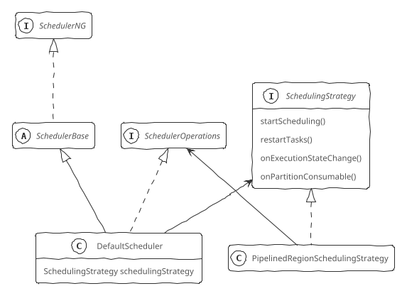

</div>

Flink调度实现中有以下重要组件：

+ 调度器：SchedulerNG接口及其实现类（SchedulerBase、DefaultScheduler），是Flink作业执行的核心组件，具备以下基本能力：
  + 将JobGraph转换为ExecutionGraph
  + 作业生命周期管理（发布、取消、停止），对外提供作业详细信息
  + Task生命周期管理（启动、取消、停止）
  + 作业执行资源的申请、分配、释放
  + 作业和Task的故障恢复
+ 调度策略：SchedulingStrategy接口及其实现类PipelinedRegionSchedulingStrategy，定义了四种调度行为。PipelinedRegionSchedulingStrategy以Pipelined Region（指ExecutionGraph中以Pipelined数据交换模式传递数据的Task集合）为粒度进行调度，一旦某个Pipelined Region获取了足够的Slot就可以部署它
  + startScheduling()：调度入口，触发调度器的调度行为
  + restartTasks()：重启执行失败的Task
  + onExecutionStateChange()：Execution状态发生改变时调用
  + onPartitionConsumable()：当中间结果分区中的数据可以消费时调用

<div class='wrapper' markdown='block'>

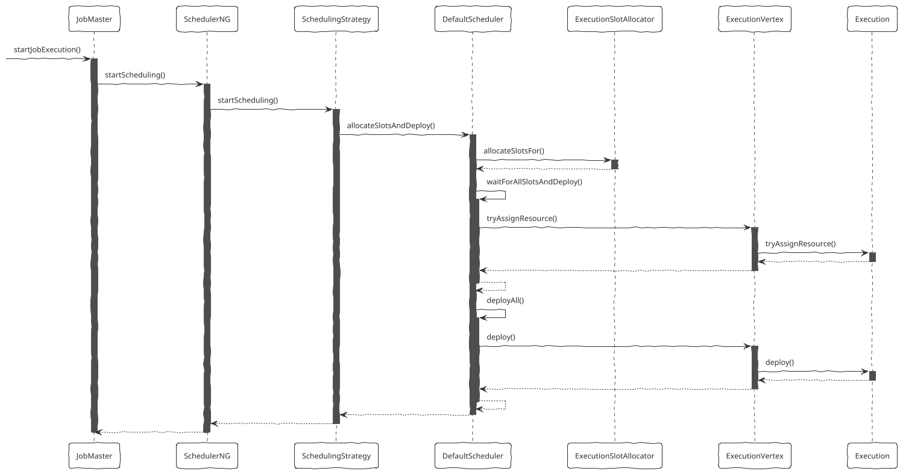

</div>

作业调度入口是JobMaster的startJobExecution()方法，PipelinedRegionSchedulingStrategy调度策略计算需要调度的SourceRegion，然后调用SchedulerOperations（实现类为DefaultScheduler）的allocateSlotsAndDeploy()方法申请Slot部署Task。DefaultScheduler调用ExecutionSlotAllocator的allocateSLotsFor()，对所有Execution异步获取Slot，申请到所需的Slot后，调用Execution的deploy()方法进行实际的部署，即将Task部署相关信息包装后通过TaskManagerGateway的submit()RPC接口发送到TaskManager上，实际调用TaskExecutor（TaskManager实现类）的submitTask()方法，这个方法创建Task并调用Task的startTaskThread()方法启动Task线程。

TaskManager从接收到的Task部署信息中获取Task执行所需要的信息，初始化Task，然后触发Task的执行，Task完成一系列的初始化动作后，进入Task执行阶段。在部署和执行过程中，TaskExecutor与JobManager保持交互，将Task的状态汇报给JobMaster，并接受JobMaster的Task管理操作。

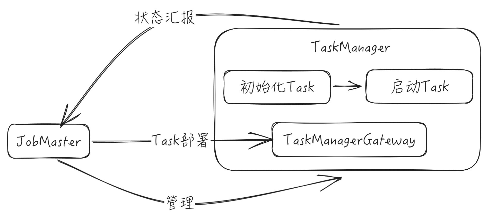

<details>

<summary>具体实现</summary>

```Java

class JobMaster
{
    SchedulerNG schedulerNG;  // 构造方法中初始化为DefaultScheduler对象
    RpcServer rpcServer;      // 继承自RpcEndpoint
    void startJobExecution() {
        // startJobMasterServices
        slotPoolService.start(getFencingToken(), getAddress(), getMainThreadExecutor());
        resourceManagerLeaderRetriever.start(new ResourceManagerLeaderListener());
        log.info("Starting execution of job '{}' ({}) under job master id {}.", ...);
        // 开始调度
        schedulerNG.startScheduling();
    }
}

class PipelinedRegionSchedulingStrategy implements SchedulingStrategy {

    SchedulerOperations schedulerOperations;  // 构造方法传入，DefaultScheduler对象
    SchedulingTopology schedulingTopology;    // 构造方法传入，值为executionGraph.schedulingTopology;

    void startScheduling() {
        // 获取需要调度的Region
        Set<SchedulingPipelinedRegion> sourceRegions =
            IterableUtils.toStream(schedulingTopology.pipelinedRegions)
                .filter(this::isSourceRegion)
                .collect(Collectors.toSet());
        List<SchedulingPipelinedRegion> regionsSorted =
            SchedulingStrategyUtils.sortPipelinedRegionsInTopologicalOrder(schedulingTopology, sourceRegions);
        Map<ConsumedPartitionGroup, Boolean> consumableStatusCache = new HashMap<>();
        for (SchedulingPipelinedRegion region : regionsSorted) {
            // ExecutionVertexDeploymentOption记录需要调度的Task
            List<ExecutionVertexDeploymentOption> vertexDeploymentOptions =
                SchedulingStrategyUtils.createExecutionVertexDeploymentOptions(
                    regionVerticesSorted.get(region),           // executionVertexId，需要部署的Task
                    id -> deploymentOption);                    // deploymentOption，表示任务数据可用时是否通知JobMaster，流处理为False
            // 申请Slot部署Task
            schedulerOperations.allocateSlotsAndDeploy(vertexDeploymentOptions);
        }
    }
}

class DefaultScheduler extends SchedulerBase implements SchedulerOperations
{
    ExecutionSlotAllocator executionSlotAllocator;   // 构造方法中初始化为SlotSharingExecutionSlotAllocator实例
    ComponentMainThreadExecutor mainThreadExecutor;  // 继承自SchedulerBase
    SchedulingStrategy schedulingStrategy;           // 构造方法中初始化为PipelinedRegionSchedulingStrategy实例

    void startScheduling() {
        log.info("Starting scheduling with scheduling strategy [{}]", ...);
        schedulingStrategy.startScheduling();
    }

    void allocateSlotsAndDeploy(List<ExecutionVertexDeploymentOption> executionVertexDeploymentOptions) {

        // groupDeploymentOptionsByVertexId
        Map<ExecutionVertexID, ExecutionVertexDeploymentOption> deploymentOptionsByVertex =
            executionVertexDeploymentOptions.stream()
                .collect(Collectors.toMap(
                    ExecutionVertexDeploymentOption::getExecutionVertexId,
                    Function.identity()));

        List<ExecutionVertexID> verticesToDeploy =
            executionVertexDeploymentOptions.stream()
                .map(ExecutionVertexDeploymentOption::getExecutionVertexId)
                .collect(Collectors.toList());

        Map<ExecutionVertexID, ExecutionVertexVersion> requiredVersionByVertex =
            executionVertexVersioner.recordVertexModifications(verticesToDeploy);

        // transitionToScheduled，Task状态转为SCHEDULED
        verticesToDeploy.forEach(executionVertexId ->
            executionGraph.tasks        // Map<JobVertexID, ExecutionJobVertex>
                .get(executionVertexId.jobVertexId)
                .taskVertices[executionVertexId.subtaskIndex]
                .currentExecution
                .transitionState(ExecutionState.SCHEDULED));

        // allocateSlots，为指定Execution申请Slot
        List<SlotExecutionVertexAssignment> slotExecutionVertexAssignments =
            executionSlotAllocator.allocateSlotsFor(
                executionVertexDeploymentOptions.stream()
                    .map(ExecutionVertexDeploymentOption::executionVertexId)
                    .collect(Collectors.toList()));

        // createDeploymentHandles，DeploymentHandle实际是三元组(ExecutionVertexVersion, ExecutionVertexDeploymentOption, SlotExecutionVertexAssignment)，记录部署ExecutionVertex的必需信息
        List<DeploymentHandle> deploymentHandles =
            slotExecutionVertexAssignments.stream()
                .map(slotExecutionVertexAssignment -> {
                    ExecutionVertexID executionVertexId = slotExecutionVertexAssignment.executionVertexId;
                    return new DeploymentHandle(
                        requiredVersionByVertex.get(executionVertexId),
                        deploymentOptionsByVertex.get(executionVertexId),
                        slotExecutionVertexAssignment);})
                .collect(Collectors.toList());

        // waitForAllSlotsAndDeploy
        List<CompletableFuture<Void>> resultFutures = new ArrayList<>();
        for (DeploymentHandle deploymentHandle : deploymentHandles) {
            CompletableFuture<Void> resultFuture =
                deploymentHandle.slotExecutionVertexAssignment.logicalSlotFuture
                    .thenApply((logicalSlot) -> {
                        // assignResource
                        executionGraph.tasks
                            .get(executionVertexId.jobVertexId)
                            .taskVertices[executionVertexId.subtaskIndex]
                            .currentExecution
                            .tryAssignResource(logicalSlot);
                        return logicalSlot;
                    })
                    .thenCompose(logicalSlot -> {
                        // registerProducedPartitions
                        ExecutionVertexID executionVertexId = deploymentHandle.requiredVertexVersion.executionVertexId;
                        ExecutionVertex executionVertex = executionGraph.tasks
                            .get(executionVertexId.jobVertexId)
                            .taskVertices[executionVertexId.subtaskIndex];
                        boolean notifyPartitionDataAvailable = deploymentHandle.executionVertexDeploymentOption.deploymentOption.notifyPartitionDataAvailable;

                        CompletableFuture<Void> partitionRegistrationFuture = executionVertex.currentExecution
                            .registerProducedPartitions(
                                logicalSlot.slotContext.taskManagerLocation,
                                notifyPartitionDataAvailable);

                        if (!partitionRegistrationFuture.isDone()) {
                            ScheduledFuture<?> timeoutFuture = Delayer.delay(
                                () -> mainThreadExecutor.execute(new Timeout(future, null)),
                                rpcTimeout.toMilliseconds(),
                                TimeUnit.MILLISECONDS);

                            .whenComplete((T value, Throwable throwable) -> {
                                if (!timeoutFuture.isDone()) {
                                    timeoutFuture.cancel(false);
                                }
                            });
                        }
                        return partitionRegistrationFuture;
                    });
            resultFutures.add(resultFuture);
        }
        // 申请到所有需要的Slot后，调用Execution的deploy()方法进行实际的部署
        FutureUtils.waitForAll(resultFutures)
            .thenRun(() -> {
                // deployAll
                for (DeploymentHandle deploymentHandle : deploymentHandles) {
                    SlotExecutionVertexAssignment slotExecutionVertexAssignment = deploymentHandle.getSlotExecutionVertexAssignment();
                    CompletableFuture<LogicalSlot> slotAssigned = slotExecutionVertexAssignment.getLogicalSlotFuture();
                    assert slotAssigned.isDone();
                    slotAssigned.thenRun(() -> {
                        // deployTask
                        ExecutionVertexID executionVertexId = deploymentHandle.requiredVertexVersion.executionVertexId;
                        executionGraph.tasks
                           .get(executionVertexId.jobVertexId)
                           .taskVertices[executionVertexId.subtaskIndex]
                           .currentExecution
                           .deploy()
                    });
                }
            });
    }
}

class SlotSharingExecutionSlotAllocator implements ExecutionSlotAllocator
{
    List<SlotExecutionVertexAssignment> allocateSlotsFor(List<ExecutionVertexID> executionVertexIds) {
        SharedSlotProfileRetriever sharedSlotProfileRetriever = sharedSlotProfileRetrieverFactory.createFromBulk(new HashSet<>(executionVertexIds));
        Map<ExecutionSlotSharingGroup, List<ExecutionVertexID>> executionsByGroup =
            executionVertexIds.stream()
                .collect(Collectors.groupingBy(
                    slotSharingStrategy::getExecutionSlotSharingGroup));
        Map<ExecutionSlotSharingGroup, SharedSlot> slots =
            executionsByGroup.keySet().stream()
                .map(group -> getOrAllocateSharedSlot(group, sharedSlotProfileRetriever))
                .collect(Collectors.toMap(
                    SharedSlot::getExecutionSlotSharingGroup,
                    Function.identity()));
        Map<ExecutionVertexID, SlotExecutionVertexAssignment> assignments =
            allocateLogicalSlotsFromSharedSlots(slots, executionsByGroup);

        // we need to pass the slots map to the createBulk method instead of using the allocator's
        // 'sharedSlots'
        // because if any physical slots have already failed, their shared slots have been removed
        // from the allocator's 'sharedSlots' by failed logical slots.
        SharingPhysicalSlotRequestBulk bulk = createBulk(slots, executionsByGroup);
        bulkChecker.schedulePendingRequestBulkTimeoutCheck(bulk, allocationTimeout);

        return executionVertexIds.stream()
            .map(assignments::get)
            .collect(Collectors.toList());
    }
}

class Execution implements LogicalSlot.Payload
{
    LogicalSlot assignedResource;
    ExecutionVertex vertex;       // 任务对应的ExecutionVertex，构造时传入

    boolean tryAssignResource(LogicalSlot logicalSlot) {
        // only allow to set the assigned resource in state SCHEDULED or CREATED
        assert state == SCHEDULED || state == CREATED;
        assert assignedResource == null;
        assignedResource = logicalSlot;
        if (logicalSlot.tryAssignPayload(this)) {
            assert (state == SCHEDULED || state == CREATED) && !taskManagerLocationFuture.isDone();
            taskManagerLocationFuture.complete(logicalSlot.getTaskManagerLocation());
            assignedAllocationID = logicalSlot.getAllocationId();
            return true;
        }
        return false;
    }

    CompletableFuture<Void> registerProducedPartitions(TaskManagerLocation location, boolean notifyPartitionDataAvailable) {

        ProducerDescriptor producerDescriptor = new ProducerDescriptor(
            location.resourceID,
            attemptId,
            location.inetAddress,
            location.dataPort);

        Collection<IntermediateResultPartition> partitions = vertex.resultPartitions.values();
        Collection<CompletableFuture<ResultPartitionDeploymentDescriptor>> partitionRegistrations = new ArrayList<>(partitions.size());
        for (IntermediateResultPartition partition : partitions) {
            int numberOfSubpartitions = 1;
            List<ConsumerVertexGroup> consumerVertexGroups = partition.edgeManager.partitionConsumers
                .computeIfAbsent(partition.partitionId, id -> new ArrayList<>());
            if (!consumerVertexGroups.isEmpty() && !consumerVertexGroups.get(0).isEmpty()) {
                // 当前一个分区只支持一个消费组
                assert consumerVertexGroups.size() == 1;
                numberOfSubpartitions = consumerVertexGroups.get(0).size();
            }
            IntermediateResult result = partition.totalResult;
            PartitionDescriptor partitionDescriptor = new PartitionDescriptor(
                result.id,
                partition.totalResult.partitionsAssigned,
                partition.partitionId,
                result.resultType,
                numberOfSubpartitions,
                result.connectionIndex);
            int maxParallelism = vertex.jobVertex.graph.executionVerticesById
                .get(consumerVertexGroups.get(0).vertices.iterator().next())
                .jobVertex.parallelismInfo.maxParallelism;

            CompletableFuture<? extends ShuffleDescriptor> shuffleDescriptorFuture =
                vertex.jobVertex.graph.shuffleMaster
                    .registerPartitionWithProducer(
                        vertex.jobVertex.graph.jobInformation.jobId,
                        partitionDescriptor,
                        producerDescriptor);

            CompletableFuture<ResultPartitionDeploymentDescriptor> partitionRegistration =
                shuffleDescriptorFuture.thenApply(shuffleDescriptor ->
                    new ResultPartitionDeploymentDescriptor(
                        partitionDescriptor,
                        shuffleDescriptor,
                        maxParallelism,
                        notifyPartitionDataAvailable));
            partitionRegistrations.add(partitionRegistration);
        }

        CompletableFuture<Map<IntermediateResultPartitionID, ResultPartitionDeploymentDescriptor>> completableFuture =
            FutureUtils.combineAll(partitionRegistrations)
                .thenApply(rpdds -> {
                    Map<IntermediateResultPartitionID, ResultPartitionDeploymentDescriptor> producedPartitions = new LinkedHashMap<>(partitions.size());
                    rpdds.forEach(rpdd -> producedPartitions.put(rpdd.partitionDescriptor.partitionId, rpdd));
                    return producedPartitions;});
        Executor executor = vertex.jobVertex.graph.jobMasterMainThreadExecutor;
        Function<? super Map<IntermediateResultPartitionID, ResultPartitionDeploymentDescriptor>, ? extends Void> applyFun =
            (producedPartitionsCache) -> {
                if (state == SCHEDULED) {
                    // startTrackingPartitions
                    JobMasterPartitionTracker partitionTracker = vertex.jobVertex.graph.partitionTracker;
                    for (ResultPartitionDeploymentDescriptor partition : producedPartitionsCache.values()) {
                        partitionTracker.startTrackingPartition(location.resourceID, partition);
                    }
                }
                return null;
            };
        return completableFuture.isDone()
            ? completableFuture.thenApply(applyFun)
            : completableFuture.thenApplyAsync(applyFun, executor)
    }

    void deploy() {
        LogicalSlot slot = assignedResource;
        LOG.info("Deploying {} (attempt #{}) with attempt id {} to {} with allocation id {}", ...);
        // 创建Task部署描述信息，将IntermediateResultPartition转换为ResultPartition，Execution转换成InputChannelDeploymentDescriptor（执行时转换为InputGate）
        TaskDeploymentDescriptor deployment =
            TaskDeploymentDescriptorFactory
                .fromExecutionVertex(vertex, attemptNumber)
                .createDeploymentDescriptor(
                    slot.slotContext.allocationId,
                    taskRestore,
                    producedPartitions.values());

        taskRestore = null;
        // TaskManager RPC接口
        TaskManagerGateway taskManagerGateway = slot.slotContext.taskManagerGateway;
        ComponentMainThreadExecutor jobMasterMainThreadExecutor = vertex.jobVertex.graph.jobMasterMainThreadExecutor;
        vertex.notifyPendingDeployment(this);         // 通知即将部署
        // 通过异步回调方式，调用TaskManagerGateway的RPC通信接口将Task发送给TaskManager，避免Task部署描述信息过大导致主线程阻塞
        CompletableFuture.supplyAsync(() -> taskManagerGateway.submitTask(deployment, rpcTimeout), executor)
            .thenCompose(Function.identity())
            .whenRunAsync(() -> vertex.notifyCompletedDeployment(this), jobMasterMainThreadExecutor);        // 通知部署完成
    }
}

class RpcTaskManagerGateway implements TaskManagerGateway
{
    TaskExecutorGateway taskExecutorGateway;
    JobMasterId jobMasterId;
    CompletableFuture<Acknowledge> submitTask(TaskDeploymentDescriptor tdd, Time timeout) {
        return taskExecutorGateway.submitTask(tdd, jobMasterId, timeout);
    }
}

class TaskExecutor implements TaskExecutorGateway {

    TaskSlotTable<Task> taskSlotTable;
    // 创建Task并调用其startTaskThread()方法开始执行Task
    CompletableFuture<Acknowledge> submitTask(TaskDeploymentDescriptor tdd, JobMasterId jobMasterId, Time timeout) {
        ......
        // 创建Task，Task构造方法会根据输入参数创建InputGate、ResultPartition、ResultPartitionWriter等
        Task task = new Task(...);
        log.info("Received task {} ({}), deploy into slot with allocation id {}.", ...);
        taskSlotTable.addTask(task);
        // 启动Task线程，执行Task中executingThread的start()方法，从而调用Task的run()方法
        task.startTaskThread();
        return CompletableFuture.completedFuture(Acknowledge.get());
    }
}
class Task {
    void startTaskThread() {
        executingThread.start();
    }
    void run() {
        // 转换状态，CREATED -> DEPLOYING
        transitionState(ExecutionState.CREATED, ExecutionState.DEPLOYING);
        Map<String, Future<Path>> distributedCacheEntries = new HashMap<>();
        // 加载Jar文件
        LOG.info("Loading JAR files for task {}.", ...);
        userCodeClassLoader = createUserCodeClassloader();
        ExecutionConfig executionConfig = serializedExecutionConfig.deserializeValue(userCodeClassLoader.asClassLoader());
        // setupPartitionsAndGates，初始化ResultPartition、InputGate，并注册ResultPartition
        LOG.debug("Registering task at network: {}.", this);
        for (ResultPartitionWriter partition : consumableNotifyingPartitionWriters) {
            partition.setup();
        }
        for (InputGate gate : inputGates) {
            gate.setup();
        }
        for (ResultPartitionWriter partitionWriter : consumableNotifyingPartitionWriters) {
            taskEventDispatcher.registerPartition(partitionWriter.getPartitionId());
        }
        TaskKvStateRegistry kvStateRegistry = kvStateService.createKvStateTaskRegistry(jobId, getJobVertexId());
        // 初始化用户代码
        Environment env = new RuntimeEnvironment(...);
        executingThread.setContextClassLoader(userCodeClassLoader.asClassLoader());
        // 加载业务逻辑执行代码，并传入RuntimeEnvironment
        // loadAndInstantiateInvokable，invokable为通过反射创建的Operator实例（OneInputStreamTask、SourceStreamTask等），用户业务逻辑代码为它的userFuntion
        TaskInvokable invokable =
            Class.forName(nameOfInvokableClass, true, userCodeClassLoader.asClassLoader())
                 .asSubclass(TaskInvokable.class)
                 .getConstructor(Environment.class)
                 .newInstance(env);
        this.invokable = invokable;
        // 转换状态，DEPLOYING -> INITIALIZING
        transitionState(ExecutionState.DEPLOYING, ExecutionState.INITIALIZING);
        taskManagerActions.updateTaskExecutionState(new TaskExecutionState(executionId, ExecutionState.INITIALIZING));
        executingThread.setContextClassLoader(userCodeClassLoader.asClassLoader());
        // 启动StreamTask执行
        invokable.invoke();
        // 转换状态，INITIALIZING -> RUNNING
        transitionState(ExecutionState.INITIALIZING, ExecutionState.RUNNING)
        taskManagerActions.updateTaskExecutionState(new TaskExecutionState(executionId, ExecutionState.RUNNING));
        // 业务逻辑执行完毕
        // 把尚未写出的数据统一Flush，如果失败的话，Task也会失败
        for (ResultPartitionWriter partitionWriter : consumableNotifyingPartitionWriters) {
            if (partitionWriter != null) {
                partitionWriter.finish();
            }
        }
        // 转换状态，RUNNING -> FINISHED
        transitionState(ExecutionState.RUNNING, ExecutionState.FINISHED)
        this.invokable = null;
        // 释放内存、占用的Cache等，并进入Final状态，停止监控
        releaseResources();
        memoryManager.releaseAll(invokable);
        fileCache.releaseJob(jobId, executionId);
        taskManagerActions.updateTaskExecutionState(new TaskExecutionState(executionId, executionState, failureCause));
    }
}
// 以StreamTask为例
abstract class StreamTask<OUT, OP extends StreamOperator<OUT>>
    implements TaskInvokable, CheckpointableTask, CoordinatedTask
{
    Environment environment;
    MailboxProcessor mailboxProcessor;  // 基于MailBox单线程的执行模型，所有的并发操作都通过队列进行排队（Mailbox），单线程（Mailbox单线程）依次处理，构造方法中创建，其runMailboxLoop()方法循环执行提供的MailboxDefaultAction，这里为StreamTask的processInput()方法
    StreamInputProcessor inputProcessor;  // init()方法中初始化
    void invoke() {
        LOG.debug("Initializing {}.", getName());
        operatorChain = environment.taskStateManager.isFinishedOnRestore()
            ? new FinishedOperatorChain<>(this, recordWriter)
            : new RegularOperatorChain<>(this, recordWriter);
        // getMainOperator
        mainOperator = operatorChain.mainOperatorWrapper.wrapped;
        // 调用派生类的init()方法
        init();
        LOG.debug("Invoking {}", getName());
        CompletableFuture<Void> allGatesRecoveredFuture = actionExecutor.call(this::restoreGates);
        // 循环执行processInput()
        mailboxProcessor.runMailboxLoop();
        ensureNotCanceled();
        channelIOExecutor.shutdown();
        isRunning = true;
    }
}
```

</details>

## 作业执行

在执行过程中上游Task结果写入ResultPartition，ResultPartition又分成ResultSubPartition，下游的Task通过InputGate与上游建立数据传输通道，InputGate中的InputChannel对应于ResultSubPartition，将数据交给Task执行。Task执行的时候，根据数据的不同类型（StreamRecord、Watermark、LatencyMarker）进行不同的处理逻辑，处理完后再交给下游的Task。

StreamTask处理数据入口是processInput()方法，内部调用StreamInputProcessor的processInput()方法，StreamInputProcessor实际将具体的数据读取工作交给了StreamTaskInput，当读取了完整的记录之后就开始向下游发送数据，在发送数据的过程中，调用算子进行数据的处理。

StreamInputProcessor是对StreamTask中读取数据行为的抽象，负责触发数据的读取，并交给算子处理，然后输出给下游。

+ StreamOneInputProcessor：流输入处理器，用在OneInputStreamTask中，只有1个上游输入。核心方法是processInput()，该方法中调用StreamTaskInput的emit()方法触发数据的读取，将数据反序列化为StreamRecord，交给StreamTaskNetworkOutput，由其触发算子（StreamOperator）的处理，最终触发UDF的processElement()，执行用户在DataStream API中编写的用户逻辑，处理数据，然后交给下游。
+ StreamMultipleInputProcessor：双流输入处理器，用在TwoInputStreamTask中，有2个上游输入。

StreamTaskInput是StreamTask中数据读取的抽象。

+ StreamTaskNetworkInput：使用InputGate从上游任务读取数据
+ StreamTaskSourceInput：使用SourceFunction从外部数据源读取数据

ResultSubPartitionView是对ResultSubPartition中读取数据、释放资源行为的抽象，getNextBuffer()是其最重要的方法，用来获取Buffer

+ PipelinedSubpartitionView：用来读取PipelinedSubpartition中的数据
+ BoundedBlockingSubpartitionReader：用来读取BoundedBlockingSubpartition中的数据

<details>

<summary>具体实现</summary>

```Java
class PipelinedSubpartitionView implements ResultSubpartitionView
{
    PipelinedSubpartition parent;
    BufferAvailabilityListener availabilityListener;

    PipelinedSubpartitionView(
        PipelinedSubpartition parent,
        BufferAvailabilityListener listener) {}

    BufferAndBacklog getNextBuffer() {
        return parent.pollBuffer();
    }

    void notifyDataAvailable() {
        availabilityListener.notifyDataAvailable();
    }
}
```

</details>

DataOutput是StreamTask中数据输出的抽象，调用算子相应方法处理各种数据流元素（StreamRecord、Watermark、WatermarkStatus、LatencyMarker），即 只负责将数据流元素交给算子来进行处理，实际的数据输出是在算子层面上执行的。有对应于单流输入和双流输入的两种实现（均为StreamTaskNetworkOutput），作为私有内部类定义在OneInputStreamTask和StreamMultipleInputProcessorFactory中。

<div class='wrapper' markdown='block'>

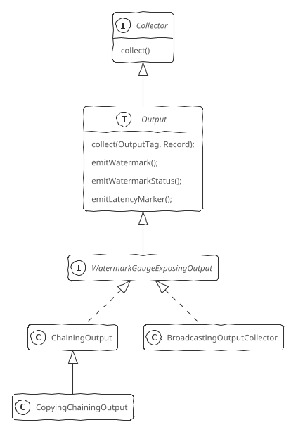

</div>

Output负责算子向下游传递数据，定义了向下游发送StreamRecord、Watermark、LatencyMark的行为。

+ WatermarkGaugeExposingOutput接口定义了统计Watermark监控指标计算行为，将最后一次发送给下游的Watermark作为其指标值，其实现类负责计算指标值（Flink Web UI中可视化StreamGraph的Watermark监控信息来源于此）
+ RecordWriterOutput：包装了RecordWriter，使用RecordWriter把数据交给数据交换层。RecordWriter用来在线程间、网络间实现数据序列化、写入
+ ChainingOutput & CopyingChainingOutput：用于OperatorChain内部算子之间数据传递，没有序列化，直接在调用下游算子的processElement()方法，节省了线程间的数据传送和网络间的数据传送开销
+ DirectedOutput & CopyingDirectedOutput：其他Output实现类的包装类，基于一组OutputSelector选择发送给某些下游Task
+ BroadcastingOutputCollector & CopyingBroadcastingOutputCollector：其他Output实现类的包装类，向所有下游Task广播数据
+ CountingOutput：其他Output实现类的包装类，没有任何业务逻辑属性，只是用来标记其他Output实现类向下游发送的数据元素个数，并作为监控指标反馈给Flink集群

RecordWriter负责Task向下游传递数据，底层依赖于ResultPartitionWriter。RecordWriter中实现了数据分区语义，将开发时对数据分区API的调用转换成了实际的物理操作。RecordWriter调用SpaningRecordSerializer将StreamRecord（具体为StreamElement、Event）进行序列化，在调用BufferBuilder写入MemorySegment中（每个Task都有自己的LocalBufferPool，LocalBufferPool中包含了多个MemorySegment）

<details>

<summary> 具体实现 </summary>

```Java
class OneInputStreamTask<IN, OUT> extends StreamTask<OUT, OneInputStreamOperator<IN, OUT>>
{
    StreamConfig configuration;   // 继承自StreamTask
    // invoke()中被调用
    void init() {
        int numberOfInputs = configuration.getNumberOfNetworkInputs();

        if (numberOfInputs > 0) {
            CheckpointedInputGate inputGate = createCheckpointedInputGate();
            Counter numRecordsIn = setupNumRecordsInCounter(mainOperator);
            // createDataOutput
            DataOutput<IN> output = new StreamTaskNetworkOutput<>(
                operatorChain.getFinishedOnRestoreInputOrDefault(mainOperator),      // operator
                inputWatermarkGauge,    // watermarkGauge
                numRecordsIn);
            // createTaskInput
            StreamTaskInput<IN> input = createTaskInput(inputGate);
            StreamConfig.InputConfig[] inputConfigs = configuration.getInputs(getUserCodeClassLoader());
            StreamConfig.InputConfig inputConfig = inputConfigs[0];
            if (requiresSorting(inputConfig)) {
                input = wrapWithSorted(input);
            }
            inputProcessor = new StreamOneInputProcessor<>(input, output, operatorChain);
        }
    }
    // 继承自StreamTask，实现了任务的默认操作
    void processInput(MailboxDefaultAction.Controller controller) {
        DataInputStatus status = inputProcessor.processInput();
        switch (status) {
            case MORE_AVAILABLE:
                if (recordWriter.isAvailable()) {
                    return;
                }
                break;
            case NOTHING_AVAILABLE:
                break;
            case END_OF_RECOVERY:
                throw new IllegalStateException("We should not receive this event here.");
            case END_OF_DATA:
                endData();
                return;
            case END_OF_INPUT:
                controller.suspendDefaultAction();
                mailboxProcessor.suspend();
                return;
        }
        ...
    }
    static class StreamTaskNetworkOutput<IN> implements DataOutput<IN> {
        Input<IN> operator;
        // 输出数据记录
        void emitRecord(StreamRecord<IN> record) {
            operator.setKeyContextElement(record);
            operator.processElement(record);
        }
        // 输出水印
        void emitWatermark(Watermark watermark) {
            watermarkGauge.setCurrentWatermark(watermark.getTimestamp());
            operator.processWatermark(watermark);
        }
        // 输出水印状态
        void emitWatermarkStatus(WatermarkStatus watermarkStatus) {
            operator.processWatermarkStatus(watermarkStatus);
        }
        // 输出延迟标记
        void emitLatencyMarker(LatencyMarker latencyMarker) {
            operator.processLatencyMarker(latencyMarker);
        }
    }
}
class StreamOneInputProcessor<IN> implements StreamInputProcessor
{
    StreamTaskInput<IN> input;  // 构造方法中传入
    DataInputStatus processInput() {
        DataInputStatus status = input.emitNext(output);
        if (status == DataInputStatus.END_OF_DATA) {
            endOfInputAware.endInput(input.getInputIndex() + 1);
            output = new FinishedDataOutput<>();
        } else if (status == DataInputStatus.END_OF_RECOVERY) {
            if (input instanceof RecoverableStreamTaskInput) {
                input = ((RecoverableStreamTaskInput<IN>) input).finishRecovery();
            }
            return DataInputStatus.MORE_AVAILABLE;
        }
        return status;
    }
}
class StreamTaskNetworkInput<T>
{
    /**
     * 继承自AbstractStreamTaskNetworkInput
     **/
    R currentRecordDeserializer;
    // 从NetworkBuffer中读取完整的StreamRecord并触发处理
    DataInputStatus emitNext(DataOutput<T> output) {

        while (true) {
            // 从反序列化器中获取数据流元素
            if (currentRecordDeserializer != null) {
                RecordDeserializer.DeserializationResult result = currentRecordDeserializer.getNextRecord(deserializationDelegate);
                if (result.isBufferConsumed) {
                    currentRecordDeserializer = null;
                }
                // 读取到完整数据记录之后，根据其类型进行不同的逻辑处理
                if (result.isFullRecord()) {
                    processElement(deserializationDelegate.getInstance(), output);
                    return DataInputStatus.MORE_AVAILABLE;
                }
            }
            // 通过InputGate获取数据
            BufferOrEvent bufferOrEvent = inputGate.pollNext();
            if (bufferOrEvent.get().isBuffer()) {
                // processBuffer，处理Buffer
                processBuffer(bufferOrEvent.get());
                lastChannel = bufferOrEvent.channelInfo;
                currentRecordDeserializer = recordDeserializers.get(bufferOrEvent.getChannelInfo());
                currentRecordDeserializer.setNextBuffer(bufferOrEvent.getBuffer());
            } else {
                // processEvent，处理Event
                AbstractEvent event = bufferOrEvent.get().getEvent();
                if (event.getClass() == EndOfData.class) {
                    if (checkpointedInputGate.hasReceivedEndOfData()) {
                        return DataInputStatus.END_OF_DATA;
                    }
                } else if (event.getClass() == EndOfPartitionEvent.class) {
                    releaseDeserializer(bufferOrEvent.getChannelInfo());
                    if (checkpointedInputGate.isFinished()) {
                        return DataInputStatus.END_OF_INPUT;
                    }
                } else if (event.getClass() == EndOfChannelStateEvent.class) {
                    if (checkpointedInputGate.allChannelsRecovered()) {
                        return DataInputStatus.END_OF_RECOVERY;
                    }
                }
                return DataInputStatus.MORE_AVAILABLE;
            }
        }
    }
    // 按照StreamElement的类型分别进行处理
    void processElement(StreamElement recordOrMark, DataOutput<T> output) {
        if (recordOrMark.getClass() == StreamRecord.class) {
            // emitRecord，对于数据记录（StreamRecord），触发算子执行业务逻辑
            StreamRecord record = (StreamRecord)recordOrMark;
            output.operator.setKeyContextElement(record);
            output.operator.processElement(record);
        } else if (recordOrMark.getClass() == Watermark.class) {
            // 水印处理，向StatusWatermarkValve输入一个水印
            statusWatermarkValve.inputWatermark((Watermark)recordOrMark, flattenedChannelIndices.get(lastChannel), output);
        } else if (recordOrMark.getClass() == LatencyMarker.class) {
            // emitLatencyMarker，延迟标记处理，收到LatencyMarker直接交给下游
            // LatencyMarker用来近似评估数据从读取到写出之间的延迟，但是并不包含计算的延迟
            output.operator.processLatencyMarker((LatencyMarker)recordOrMark);
        } else if (recordOrMark.getClass() == WatermarkStatus.class) {
            // 水印状态处理，向StatusWatermarkValve输入一个WatermarkStatus
            statusWatermarkValve.inputWatermarkStatus((WatermarkStatus)recordOrMark, flattenedChannelIndices.get(lastChannel), output);
        }
    }
}

class SingleInputGate
{
    // 输入通道，通知InputGate有可用数据
    PrioritizedDeque<InputChannel> inputChannelsWithData;

    BufferOrEvent getNext() {
        return getNextBufferOrEvent(true);
    }

    BufferOrEvent pollNext() {
        return getNextBufferOrEvent(false);
    }

    BufferOrEvent getNextBufferOrEvent(boolean blocking) {
        // 从inputChannelsWithData中获取有数据可消费的InputChannel
        while (inputChannelsWithData.isEmpty()) {
            if (blocking) {
                inputChannelsWithData.wait();
            } else {
                // 非阻塞时直接返回空
                ...
            }
        }
        InputChannel inputChannel = inputChannelsWithData.poll();
        enqueuedInputChannelsWithData.clear(inputChannel.getChannelIndex());
        // 从InputChannel获取数据，具体实现逻辑在其子类中
        // LocalInputChannel用于本地线程间数据传递，从本进程的结果子分区获取数据
        // RemoteInputChannel用于跨网络数据传递，从其他进程的结果子分区获取数据
        Buffer buffer = inputChannel.getNextBuffer().get().buffer;
        if (buffer.isBuffer()) {
            return new BufferOrEvent(buffer, ...)
        } else {
            event = EventSerializer.fromBuffer(buffer, getClass().getClassLoader());
            return new BufferOrEvent(event, ...);
        }
    }
}

```

</details>

### 数据传递

分布式计算中不同节点之间的传递数据一般有PULL模式和PUSH模式。Flink批执行模式采用PULL模式，将计算过程分成多个阶段，上游完全计算完毕之后，下游从上游拉取数据开始下一阶段计算，直到最终所有的阶段都计算完毕；Flink流执行模式采用PUSH模式，上游主动向下游推送数据，上下游之间采用生产者-消费者模式，下游收到数据触发计算，没有数据则进入等待状态。PUSH模式的数据处理过程成为流水线（Pipeline）。

对于数据记录（StreamRecord），会执行算子中用户编写的业务逻辑，在算子中处理完毕后通过Collector接口将数据交给下一个算子（或任务）进行计算。每一个StreamOperator都有一个Output（继承自Collector接口）成员，用于收集当前算子处理完的记录。

#### 同一Task内算子间的数据传递

同一个OperatorChain中，上游算子处理数据，然后通过Collector接口直接调用下游算子的processElement()方法，在同一个线程内执行普通的Java方法。没有数据序列化、反序列化的过程，也没有线程切换。

OperatorChain的内部类ChainingOutput实现了WatermarkGaugeExposingOutput接口，它持有一个OneInputStreamOperator对象（input成员），即OperatorChain中当前算子的下游算子。当ChainingOutput接收到当前算子提交的数据时，将直接调用下游算子的processElement()方法。

通过在ChainingOutput中保存下游StreamOperator的引用，ChainingOutput直接将当前算子提交的数据对象的引用传递给下游算子。但是如果不允许对象重用（ExecutionConfig配置项objectReuse），则不会使用ChainingOutput，而是会使用CopyingChainingOutput（对记录进行复制后传递给下游算子）。

BroadcastingOutputCollector封装了一组Output, 即Output<StreamRecord<T>>[] outputs, 在接收到StreamRecord时，会将消息提交到所有的内部所有的Output中。BroadcastingOutputCollector主要用在当前算子有多个下游算子的情况下。与此对应的还有一个 CopyingBroadcastingOutputCollector。

DirectedOutput基于OutputSelector<OUT>[] outputSelectors选择要转发的目标Output，主要是在split/select的情况下使用。与DirectedOutput对应的也有一个 CopyingDirectedOutput。

对于位于OperatorChain末尾的算子，它处理过的记录需要被其它Task消费，因此它的记录需要被写入 ResultPartition。Flink提供了RecordWriterOutput，它也实现了 WatermarkGaugeExposingOutput，但是它是通过RecordWriter输出接收到的消息记录。RecordWriter是ResultPartitionWriter的一层包装，提供了将记录序列化到Buffer中的功能。

<details>

<summary>具体实现</summary>

```Java
class ChainingOutput<T>
    implements WatermarkGaugeExposingOutput<StreamRecord<T>>
{
    Input<T> input;         // 算子链内的下一个算子
    OutputTag<T> outputTag;
    void collect(StreamRecord<T> record) {
        if (this.outputTag != null) {
            return;
        }
        pushToOperator(record);
    }

    void collect(OutputTag<X> outputTag, StreamRecord<X> record) {
        // 如果有OutputTag，则要求OutputTag匹配才会转发记录
        if (outputTag.equals(this.outputTag)) {
            pushToOperator(record);
        }
    }

    <X> void pushToOperator(StreamRecord<X> record) {
        StreamRecord<T> castRecord = (StreamRecord<T>) record;
        input.setKeyContextElement(castRecord);
        input.processElement(castRecord);
    }
}
```

</details>

#### 不同Task内算子间的数据传递

不同Task内算子间的数据传递分为以下几个步骤：

1. 上游算子将数据记录交给RecordWriter，经过ChannelSelector选择下游节点后，找到对应的结果子分区
2. 使用对应结果子分区的序列化器把数据序记录列化为二进制数据
3. 将二进制数据写入结果子分区，此时数据已存入MemorySegment
4. 单独的线程控制数据的flush速度，一旦触发flush，向下游TaskManager写入
5. 下游TaskManager接收到数据后，将数据复制到MemorySegment中，然后通知InputChannel
6. 有可用数据时，下游算子从阻塞醒来，从InputChannel取出二进制数据，再反序列化成数据记录，执行UDf

同一TaskManager中的Task之间进行本地线程间的数据传递，即 通过本地内存进行数据传递，共享同一个BufferPool，通过wait/notifyAll来同步。具体为同一TaskManager中的Task会在同一个NetworkEnvironment中注册，在Network Buffer申请输入输出的独立LocalBuffer，LocalInputChannel实现了InputChannel接口和BufferAvailabilityListener接口，通过ResultPartitionManager创建和对应ResultSubparition关联的ResultSubparitionView，并以自身作为ResultSubparitionView的监听器，ResultSubparition有数据产出时，ResultSubparitionView会得到通知，同时LocalInputChannel的回调方法也会被调用。这样LocalInputChannel可以及时获取到数据的生产情况以便及时地消费数据。

<details>

<summary>具体实现</summary>

```Java
// LocalInputChannel用来进行同一TaskManager内Task之间的数据传递
class LocalInputChannel extends InputChannel implements BufferAvailabilityListener
{
    ResultPartitionManager partitionManager; // 本地分区管理器
    ResultSubpartitionView subpartitionView; // 消费的结果子分区

    // 通过ResultPartitionManager创建与对应ResultSubpartition相关联的ResultSubpartitionView
    void requestSubpartition(int subpartitionIndex) {
        boolean retriggerRequest = false;
        boolean notifyDataAvailable = false;
        if (subpartitionView == null) {
            // createSubpartitionView
            // 同一TaskManager内Task之间的数据传递不需要网络通信，通过ResultPartitionManager创建一个ResultSubpartitionView
            // LocalInputChannel实现了BufferAvailabilityListener接口，在结果子分区可用时，notifyDataAvailable方法会被调用，将当前channel加到InputGate的可用Channel队列中
            ResultPartition partition = partitionManager.registeredPartitions.get(partitionId);
            subpartitionView = partition.createSubpartitionView(subpartitionIndex, this);  // 第二个参数为BufferAvailabilityListener
            // notifyDataAvailable
            inputGate.notifyChannelNonEmpty(this);
        }
    }

    Optional<BufferAndAvailability> getNextBuffer() {

        // 实际调用对应ResultSubpartition的pollBuffer()方法
        BufferAndBacklog next = subpartitionView.getNextBuffer();
        Buffer buffer = next.buffer();
        channelStatePersister.checkForBarrier(buffer);
        channelStatePersister.maybePersist(buffer);
        return Optional.of(new BufferAndAvailability(
            buffer,
            next.nextDataType,
            next.buffersInBacklog,
            next.sequenceNumber));
    }

    // 回调方法，ResultSubpartition通知InputChannel有可用数据
    void notifyDataAvailable() {
        // notifyChannelNonEmpty，继承自InputChannel
        inputGate.notifyChannelNonEmpty(this);
    }

    void sendTaskEvent(TaskEvent event) {
        taskEventPublisher.publish(partitionId, event);
    }
}

// 以PipelinedSubparitionView为例
class PipelinedSubpartitionView implements ResultSubpartitionView {
    // 对应的ResultSubpartition
    PipelinedSubpartition parent;
    // ResultSubpartitionView监听接口实现类，ResultSubpartition的消费者需要实现该接口监听ResultSubpartition的数据/事件可用消息
    BufferAvailabilityListener availabilityListener;
    BufferAndBacklog getNextBuffer() {
        return parent.pollBuffer();
    }
    void notifyDataAvailable() {
        availabilityListener.notifyDataAvailable();
    }
    void notifyPriorityEvent(int priorityBufferNumber) {
        availabilityListener.notifyPriorityEvent(priorityBufferNumber);
    }
}

// 以PipelinedSubpartition为例
class PipelinedSubpartition extends ResultSubpartition
{
    // 该结果子分区的所有Buffer
    PrioritizedDeque<BufferConsumerWithPartialRecordLength> buffers;
    // 当前ResultSubpartition非Event Buffer数目
    int buffersInBacklog;
    BufferAndBacklog pollBuffer() {
        Buffer buffer = null;
        if (buffers.isEmpty()) {
            flushRequested = false;
        }
        while (!buffers.isEmpty()) {
            BufferConsumerWithPartialRecordLength bufferConsumerWithPartialRecordLength = buffers.peek();
            BufferConsumer bufferConsumer = bufferConsumerWithPartialRecordLength.bufferConsumer;
            buffer = bufferConsumerWithPartialRecordLength.bufferConsumer.build();
            if (buffers.size() == 1) {
                // 消费了所有可用数据时关闭flushRequested标志
                flushRequested = false;
            }
            if (bufferConsumer.isFinished()) {
                buffers.poll().bufferConsumer.close();
                decreaseBuffersInBacklogUnsafe(bufferConsumer.isBuffer());
                if (bufferConsumer.buffer.isBuffer()) {
                    buffersInBacklog--;
                }
            }
            if (receiverExclusiveBuffersPerChannel == 0 && bufferConsumer.isFinished()) {
                break;
            }
            if (buffer.readableBytes() > 0) {
                break;
            }
            buffer.recycleBuffer();
            buffer = null;
            if (!bufferConsumer.isFinished()) {
                break;
            }
        }
        if (buffer == null) {
            return null;
        }
        if (buffer.getDataType().isBlockingUpstream()) {
            isBlocked = true;
        }
        updateStatistics(buffer);
        return new BufferAndBacklog(buffer, getBuffersInBacklogUnsafe(), isDataAvailableUnsafe() ? getNextBufferTypeUnsafe() : Buffer.DataType.NONE, sequenceNumber++);
    }
}
```

</details>

不同TaskManager中的Task之间进行跨网络的数据传递，采用Netty框架通过Socket传递，通过PartitionRequestClient向上游Task所在TaskManager发起RPC请求，上游TaskManager收到请求后，读取ResultPartition管理的Buffer并返回给Client。

RemoteInputChannel请求远程的ResultSubpartition。创建一个PartitionRequestClient并通过Netty发送PartitionRequest请求，这时会附带当前InputChannel的ID和信用值，NettyClient会发起和相应ResultSubpartition所在Task的NettyServer的连接（后续所有的数据交换都在这个连接上进行）。两个Task之间只会建立一个连接，这个连接会在这两个Task上不同的RemoteInputChannel和ResultSubpartition之间进行复用。另外，Flink Buffer的实现类NetworkBuffer继承了Netty的AbstractReferenceCountedByteBuf，这样Netty可以直接使用Flink Buffer，避免了在Flink Buffer和Netty Buffer之间的数据拷贝。

<details>

<summary>具体实现</summary>

```Java
class RemoteInputChannel extends InputChannel {
    // 用于连接远程ResultSubpartition的ConnectionManager
    ConnectionManager connectionManager;
    // 创建TCP连接并请求ResultSubpartition的客户端
    PartitionRequestClient partitionRequestClient;
    void requestSubpartition(int subpartitionIndex) {
        // 通过ConnectionManager建立连接，创建PartitionRequestClient，并通过 PartitionRequestClient发起请求
        if (partitionRequestClient == null) {
            LOG.debug("{}: Requesting REMOTE subpartition {} of partition {}. {}", ...);
            partitionRequestClient = connectionManager.createPartitionRequestClient(connectionId);
            partitionRequestClient.requestSubpartition(partitionId, subpartitionIndex, this, 0);
        }
    }
}

class NettyConnectionManager implements ConnectionManager {
    // 建立和其它TaskManager NettyServer的连接，PartitionRequestClient中封装了netty channel和channel handler
    PartitionRequestClient createPartitionRequestClient(ConnectionID connectionId) {
        return partitionRequestClientFactory.createPartitionRequestClient(connectionId);
    }
}

class PartitionRequestClientFactory {
    // 和远程地址建立TCP连接并创建NettyPartitionRequestClient
    NettyPartitionRequestClient createPartitionRequestClient(ConnectionID connectionId) {
        while (true) {
            CompletableFuture<NettyPartitionRequestClient> newClientFuture = new CompletableFuture<>();
            CompletableFuture<NettyPartitionRequestClient> clientFuture = clients.putIfAbsent(connectionId, newClientFuture);
            NettyPartitionRequestClient client;
            if (clientFuture == null) {
                // connect，建立连接
                Channel channel = nettyClient.connect(connectionId.getAddress()).sync().channel();
                NetworkClientHandler clientHandler = channel.pipeline().get(NetworkClientHandler.class);
                client = NettyPartitionRequestClient(channel, clientHandler, connectionId, this);
                newClientFuture.complete(client);
            } else {
                client = clientFuture.get();
            }

            // client引用计数加1
            if (client.closeReferenceCounter.increment()) {
                return client;
            } else {
                // destroyPartitionRequestClient，移除创建的NettyPartitionRequestClient
                CompletableFuture<NettyPartitionRequestClient> future = clients.get(connectionId);
                if (future != null && future.isDone()) {
                    future.thenAccept(futureClient -> {
                        if (client.equals(futureClient)) {
                            clients.remove(connectionId, future);
                        }
                    });
                }
            }
        }
    }
}

class NettyPartitionRequestClient implements PartitionRequestClient {
    NetworkClientHandler clientHandler;
    void requestSubpartition(
        ResultPartitionID partitionId,
        int subpartitionIndex,
        RemoteInputChannel inputChannel,
        int delayMs) {

        // checkNotClosed
        assert !closeReferenceCounter.isDisposed();
        LOG.debug("Requesting subpartition {} of partition {} with {} ms delay.", ...);
        // 向NetworkClientHandler注册当前RemoteInputChannel
        clientHandler.addInputChannel(inputChannel);
        // PartitionRequest封装了请求的ResultSubpartition信息，当前InputChannel的ID，以及初始信用值
        // 一个Task的所有RemoteInputChannel的数据传输都通过该PartitionRequestClient处理
        PartitionRequest request = new PartitionRequest(
            partitionId,
            subpartitionIndex,
            inputChannel.id,
            inputChannel.initialCredit);
        // 通过Netty发送请求
        ChannelFutureListener listener = new ChannelFutureListener() {
            @Override
            public void operationComplete(ChannelFuture future) {
                // 如果请求发送失败，移除当前InputChannel
                if (!future.isSuccess()) {
                    clientHandler.removeInputChannel(inputChannel);
                    inputChannel.onError(...);
                }
            }
        };
        ChannelFuture f = tcpChannel.writeAndFlush(request);
        f.addListener(listener);
    }
}
```

</details>

**生产端处理流程** 在网络通信中对应NettyServer。NettyServer有两个重要的 ChannelHandler，即PartitionRequestServerHandler和PartitionRequestQueue。PartitionRequestServerHandler负责处理消费端通过PartitionRequestClient发送的 PartitionRequest、AddCredit等请求。PartitionRequestQueue包含了一个读取数据的NetworkSequenceViewReader队列，它监听Netty Channel的可写入状态，一旦可以写入数据，就会从NetworkSequenceViewReader消费数据写入Netty Channel。

当NettyServer接收到PartitionRequest消息后，PartitionRequestServerHandler会创建一个NetworkSequenceViewReader对象，请求创建ResultSubpartitionView，并将 NetworkSequenceViewReader保存在PartitionRequestQueue中。PartitionRequestQueue 保存了所有请求消费数据的RemoteInputChannel和NetworkSequenceViewReader之间的映射关系，还保存了一个NetworkSequenceViewReader队列availableReaders，当一个NetworkSequenceViewReader中有数据可以被消费时，就会被加入到availableReaders队列中。

ResultSubpartitionView用来消费ResultSubpartition中的数据，并在ResultSubpartition 中有数据可用时获得提醒。NetworkSequenceViewReader相当于对ResultSubpartition的一层包装，它会按顺序为读取的每一个Buffer分配一个序列号，并记录接收数据的RemoteInputChannel。使用基于信用值的流量控制时，NetworkSequenceViewReader的具体实现对应为CreditBasedSequenceNumberingViewReader。CreditBasedSequenceNumberingViewReader同时还实现了BufferAvailabilityListener接口，因而可以作为PipelinedSubpartitionView的回调对象。

PartitionRequestQueue负责将ResultSubparition中的数据通过网络发送给RemoteInputChannel。PartitionRequestQueue会监听Netty Channel的可写入状态，当Channel可写入时，就会从availableReaders中取出NetworkSequenceViewReader，读取数据并写入网络。可写入状态是Netty通过水位线进行控制的，NettyServer在启动的时候会配置水位线，如果Netty输出缓冲中的字节数超过了高水位值，就会等到其降到低水位值以下才继续写入数据。通过水位线机制确保不往网络中写入太多数据。在基于信用值的流量控制算法中，每发送一个Buffer就会消耗一点信用值，在消费端有空闲Buffer时会发送AddCrdit消息。

<details>

<summary>具体实现</summary>

```Java
class PartitionRequestServerHandler
{
    PartitionRequestQueue outboundQueue;
    void channelRead0(ChannelHandlerContext ctx, NettyMessage msg) {
        Class<?> msgClazz = msg.getClass();
        // ResultSubpartitionRequest
        if (msgClazz == PartitionRequest.class) {
            PartitionRequest request = (PartitionRequest) msg;
            LOG.debug("Read channel on {}: {}.", ...);
            NetworkSequenceViewReader reader = new CreditBasedSequenceNumberingViewReader(request.receiverId, request.credit, outboundQueue);
            reader.requestSubpartitionView(partitionProvider, request.partitionId, request.queueIndex);

            outboundQueue.notifyReaderCreated(reader);
        } else if (msgClazz == TaskEventRequest.class) {
            // Task events
            TaskEventRequest request = (TaskEventRequest) msg;
            taskEventPublisher.publish(request.partitionId, request.event);
        } else if (msgClazz == CancelPartitionRequest.class) {
            CancelPartitionRequest request = (CancelPartitionRequest) msg;
            outboundQueue.cancel(request.receiverId);
        } else if (msgClazz == CloseRequest.class) {
            outboundQueue.close();
        } else if (msgClazz == AddCredit.class) {
            // 增加Credit
            AddCredit request = (AddCredit) msg;
            outboundQueue.addCreditOrResumeConsumption(request.receiverId, reader -> reader.addCredit(request.credit));
        } else if (msgClazz == ResumeConsumption.class) {
            ResumeConsumption request = (ResumeConsumption) msg;
            outboundQueue.addCreditOrResumeConsumption(request.receiverId, NetworkSequenceViewReader::resumeConsumption);
        } else if (msgClazz == AckAllUserRecordsProcessed.class) {
            AckAllUserRecordsProcessed request = (AckAllUserRecordsProcessed) msg;
            outboundQueue.acknowledgeAllRecordsProcessed(request.receiverId);
        } else if (msgClazz == NewBufferSize.class) {
            NewBufferSize request = (NewBufferSize) msg;
            outboundQueue.notifyNewBufferSize(request.receiverId, request.bufferSize);
        }
    }
}

class PartitionRequestQueue extends ChannelInboundHandlerAdapter {
    ChannelFutureListener writeListener = new WriteAndFlushNextMessageIfPossibleListener();
    // 有数据可消费的NetworkSequenceViewReader
    ArrayDeque<NetworkSequenceViewReader> availableReaders = new ArrayDeque<>();
    // 请求消费数据的RemoteInputChannel和NetworkSequenceViewReader之间的映射关系
    ConcurrentMap<InputChannelID, NetworkSequenceViewReader> allReaders = new ConcurrentHashMap<>();
    // 添加新的NetworkSequenceViewReader
    void notifyReaderCreated(NetworkSequenceViewReader reader) {
        allReaders.put(reader.receiverId, reader);
    }
    // 通知NetworkSequenceViewReader有数据可读取
    void notifyReaderNonEmpty(NetworkSequenceViewReader reader) {
        // 触发用户自定义事件
        ctx.executor().execute(() -> ctx.pipeline().fireUserEventTriggered(reader));
    }
    void addCreditOrResumeConsumption(InputChannelID receiverId, Consumer<NetworkSequenceViewReader> operation) {
        NetworkSequenceViewReader reader = allReaders.get(receiverId);
        operation.accept(reader);
        enqueueAvailableReader(reader);
    }
    void userEventTriggered(ChannelHandlerContext ctx, Object msg) {
        if (msg instanceof NetworkSequenceViewReader) {
            // NetworkSequenceViewReader有数据可读取，加入队列中
            enqueueAvailableReader((NetworkSequenceViewReader) msg);
        } else if (msg.getClass() == InputChannelID.class) {
            // Release partition view that get a cancel request.
            // 对应RemoteInputChannel请求取消消费
            InputChannelID toCancel = (InputChannelID) msg;
            availableReaders.removeIf(reader -> reader.getReceiverId().equals(toCancel));
            NetworkSequenceViewReader toRelease = allReaders.remove(toCancel);
            if (toRelease != null) {
                // releaseViewReader
                toRelease.setRegisteredAsAvailable(false);
                toRelease.releaseAllResources();
            }
        } else {
            ctx.fireUserEventTriggered(msg);
        }
    }
    void enqueueAvailableReader(NetworkSequenceViewReader reader) {
        if (reader.isRegisteredAsAvailable()) {
            return;
        }
        ResultSubpartitionView.AvailabilityWithBacklog availabilityWithBacklog = reader.getAvailabilityAndBacklog();
        if (!availabilityWithBacklog.isAvailable()) {
            int backlog = availabilityWithBacklog.getBacklog();
            if (backlog > 0 && reader.needAnnounceBacklog()) {
                // announceBacklog
                NettyMessage.BacklogAnnouncement announcement = new NettyMessage.BacklogAnnouncement(backlog, reader.getReceiverId());
                ctx.channel()
                    .writeAndFlush(announcement)
                    .addListener((ChannelFutureListener) future -> {
                        if (!future.isSuccess()) {
                            onChannelFutureFailure(future);
                        }
                    });
            }
        }
        boolean triggerWrite = availableReaders.isEmpty();
        // registerAvailableReader
        availableReaders.add(reader);
        reader.setRegisteredAsAvailable(true);
        // 如果这是队列中第一个元素，调用writeAndFlushNextMessageIfPossible发送数据
        if (triggerWrite) {
            writeAndFlushNextMessageIfPossible(ctx.channel());
        }
    }
    // 监听Netty Channel的可写入状态，当Channel可写入时，调用writeAndFlushNextMessageIfPossible发送数据
    void channelWritabilityChanged(ChannelHandlerContext ctx) {
        writeAndFlushNextMessageIfPossible(ctx.channel());
    }
    // 从availableReaders队列中取出NetworkSequenceViewReader，读取数据并写入网络
    void writeAndFlushNextMessageIfPossible(Channel channel) {
        BufferAndAvailability next = null;
        while (true) {
            // pollAvailableReader，取出一个NetworkSequenceViewReader
            NetworkSequenceViewReader reader = availableReaders.poll();
            if (reader == null) {
                return;
            }
            reader.setRegisteredAsAvailable(false);
            next = reader.getNextBuffer();
            if (next == null) {
                // 没有读到数据
                if (!reader.isReleased()) {
                    // 还没有释放当前ResultSubpartition，继续处理下一个NetworkSequenceViewReader
                    continue;
                }
            } else {
                // 读到数据时，NetworkSequenceViewReader还有更多数据时，继续加入队列
                if (next.moreAvailable()) {
                    // registerAvailableReader
                    availableReaders.add(reader);
                    reader.setRegisteredAsAvailable(true);
                }
                BufferResponse msg = new BufferResponse(
                    next.buffer(),
                    next.getSequenceNumber(),
                    reader.getReceiverId(),
                    next.buffersInBacklog());
                // 向client发送数据，发送成功后通过writeListener回调触发下一次发送
                channel.writeAndFlush(msg).addListener(writeListener);
                return;
            }
        }
    }
    class WriteAndFlushNextMessageIfPossibleListener implements ChannelFutureListener {
            @Override
            void operationComplete(ChannelFuture future) {
                if (future.isSuccess()) {
                    // 发送成功，再次尝试写入
                    writeAndFlushNextMessageIfPossible(future.channel());
                }
            }
        }
    }
}

class RecordWriterOutput<OUT>
{
    RecordWriter<SerializationDelegate<StreamElement>> recordWriter;
    SerializationDelegate<StreamElement> serializationDelegate;
    OutputTag outputTag;
    void collect(StreamRecord<OUT> record) {
        if (this.outputTag != null) {
            return;
        }
        pushToRecordWriter(record);
    }
    <X> void collect(OutputTag<X> outputTag, StreamRecord<X> record) {
        if (outputTag.equals(this.outputTag)) {
            pushToRecordWriter(record);
        }
    }

    <X> void pushToRecordWriter(StreamRecord<X> record) {
        serializationDelegate.setInstance(record);
        recordWriter.emit(serializationDelegate);
    }
}

abstract class RecordWriter<T>
{
    ResultPartitionWriter targetPartition;
    // 传递StreamRecord，各实现类负责具体逻辑
    abstract void emit(T record);
    void emit(T record, int targetSubpartition) {
        targetPartition.emitRecord(
            serializeRecord(serializer, record),  // 序列化
            targetSubpartition);
    }
}

// 单播
class ChannelSelectorRecordWriter<T> extends RecordWriter<T>
{
    ChannelSelector<T> channelSelector;
    void emit(T record) {
        // 选路
        emit(record, channelSelector.selectChannel(record));
    }
}

// 广播
class BroadcastRecordWriter<T> extends RecordWriter<T>
{
    void emit(T record) throws IOException {
        // broadcastEmit
        targetPartition.broadcastRecord(serializeRecord(serializer, record));
    }

}
```

</details>

**消费端处理流程** 在网络通信中对应NettyClient。NettyClient有个重要的ChannelHandler，NetworkClientHanlder（实现类为CreditBasedPartitionRequestClientHandler），CreditBasedPartitionRequestClientHandler负责接收服务端通过Netty Channel发送的数据，解析数据后交给对应的RemoteInputChannle进行处理。CreditBasedPartitionRequestClientHandler从网络中读取数据后交给 RemoteInputChannel，RemoteInputChannel会将接收到的加入队列中，并根据生产端的堆积申请floating buffer。一旦RemoteInputChannel申请到新的Buffer，就发送一条AddCredit消息通知生产者更新Credit。

<details>

<summary>具体实现</summary>

```Java
// 客户端读写网络消息的Channel Handler
interface NetworkClientHandler extends ChannelHandler
{
    void addInputChannel(RemoteInputChannel inputChannel);
    void removeInputChannel(RemoteInputChannel inputChannel);
    RemoteInputChannel getInputChannel(InputChannelID inputChannelId);
    void cancelRequestFor(InputChannelID inputChannelId);
    void notifyCreditAvailable(RemoteInputChannel inputChannel);
    void notifyNewBufferSize(RemoteInputChannel inputChannel, int bufferSize);
    // 精确一次Checkpoint后恢复数据消费
    void resumeConsumption(RemoteInputChannel inputChannel);
    // 通知所有记录已处理
    void acknowledgeAllRecordsProcessed(RemoteInputChannel inputChannel);
}

class NettyPartitionRequestClient implements PartitionRequestClient
{
    NetworkClientHandler clientHandler;
    // 交给NetworkClientHandler处理
    void notifyCreditAvailable(RemoteInputChannel inputChannel) {
        clientHandler.notifyCreditAvailable(inputChannel);
    }
}
class CreditBasedPartitionRequestClientHandler
     extends ChannelInboundHandlerAdapter
     implements NetworkClientHandler
{
    ConcurrentMap<InputChannelID, RemoteInputChannel> inputChannels = new ConcurrentHashMap<>();
    ArrayDeque<ClientOutboundMessage> clientOutboundMessages = new ArrayDeque<>();
    ChannelFutureListener writeListener = new WriteAndFlushNextMessageIfPossibleListener();
    void addInputChannel(RemoteInputChannel listener) {
        inputChannels.putIfAbsent(listener.getInputChannelId(), listener);
    }
    void removeInputChannel(RemoteInputChannel listener) {
        inputChannels.remove(listener.getInputChannelId());
    }
    RemoteInputChannel getInputChannel(InputChannelID inputChannelId) {
        return inputChannels.get(inputChannelId);
    }
    void cancelRequestFor(InputChannelID inputChannelId) {
        ctx.writeAndFlush(new NettyMessage.CancelPartitionRequest(inputChannelId));
    }
    // 有新的Credit
    void notifyCreditAvailable(RemoteInputChannel inputChannel) {
        // 触发自定义事件
        ctx.executor().execute(() ->
            ctx.pipeline().fireUserEventTriggered(new AddCreditMessage(inputChannel)));
    }
    void notifyNewBufferSize(RemoteInputChannel inputChannel, int bufferSize) {
        ctx.executor().execute(() ->
            ctx.pipeline().fireUserEventTriggered(new NewBufferSizeMessage(inputChannel, bufferSize)));
    }
    void resumeConsumption(RemoteInputChannel inputChannel) {
        ctx.executor().execute(() ->
            ctx.pipeline().fireUserEventTriggered(new ResumeConsumptionMessage(inputChannel)));
    }
    void acknowledgeAllRecordsProcessed(RemoteInputChannel inputChannel) {
        ctx.executor().execute(() ->
            ctx.pipeline().fireUserEventTriggered(new AcknowledgeAllRecordsProcessedMessage(inputChannel)));
    }
    void channelRead(ChannelHandlerContext ctx, Object msg) {
        // decodeMsg，解析消息
        Class<?> msgClazz = msg.getClass();

        if (msgClazz == NettyMessage.BufferResponse.class) {
            // Buffer，正常数据
            NettyMessage.BufferResponse bufferOrEvent = (NettyMessage.BufferResponse) msg;
            // 获取对应的RemoteInputChannel
            RemoteInputChannel inputChannel = inputChannels.get(bufferOrEvent.receiverId);
            if (inputChannel == null || inputChannel.isReleased()) {
                // 如果没有对应的RemoteInputChannel，则取消订阅
                bufferOrEvent.releaseBuffer();
                cancelRequestFor(bufferOrEvent.receiverId);
                return;
            }
            // decodeBufferOrEvent，解析BufferOrEvent
            if (bufferOrEvent.isBuffer() && bufferOrEvent.bufferSize == 0) {
                inputChannel.onEmptyBuffer(bufferOrEvent.sequenceNumber, bufferOrEvent.backlog);
            } else {
                inputChannel.onBuffer(bufferOrEvent.getBuffer(), bufferOrEvent.sequenceNumber, bufferOrEvent.backlog);
            }

        } else if (msgClazz == NettyMessage.ErrorResponse.class) {
            // 错误消息
            ......
        } else if (msgClazz == NettyMessage.BacklogAnnouncement.class) {
            // 累积数据消息
            NettyMessage.BacklogAnnouncement announcement = (NettyMessage.BacklogAnnouncement) msg;
            RemoteInputChannel inputChannel = inputChannels.get(announcement.receiverId);
            if (inputChannel == null || inputChannel.isReleased()) {
                cancelRequestFor(announcement.receiverId);
                return;
            }
            inputChannel.onSenderBacklog(announcement.backlog);
        } else {
            ......
        }
    }
    void userEventTriggered(ChannelHandlerContext ctx, Object msg) {
        if (msg instanceof ClientOutboundMessage) {
            // 有新的Credit会触发
            boolean triggerWrite = clientOutboundMessages.isEmpty();
            clientOutboundMessages.add((ClientOutboundMessage) msg);
            if (triggerWrite) {
                writeAndFlushNextMessageIfPossible(ctx.channel());
            }
        } else {
            ctx.fireUserEventTriggered(msg);
        }
    }
    void channelWritabilityChanged(ChannelHandlerContext ctx) {
        writeAndFlushNextMessageIfPossible(ctx.channel());
    }
    void writeAndFlushNextMessageIfPossible(Channel channel) {
        // 从队列中取出RemoteInputChannel，发送消息
        while (true) {
            ClientOutboundMessage outboundMessage = clientOutboundMessages.poll();
            if (!outboundMessage.inputChannel.isReleased()) {
                Object msg = outboundMessage.buildMessage();
                channel.writeAndFlush(msg).addListener(writeListener);
                return;
            }
        }
    }
    class WriteAndFlushNextMessageIfPossibleListener implements ChannelFutureListener {
        @Override
        public void operationComplete(ChannelFuture future) {
            if (future.isSuccess()) {
                writeAndFlushNextMessageIfPossible(future.channel());
            }
        }
    }
}
class RemoteInputChannel extends InputChannel
{
    void onBuffer(Buffer buffer, int sequenceNumber, int backlog) {
        boolean recycleBuffer = true;
        // 序号需要匹配
        assert expectedSequenceNumber == sequenceNumber;
        if (buffer.getDataType().isBlockingUpstream()) {
            onBlockingUpstream();
        }
        // 加入receivedBuffers队列中
        boolean wasEmpty = receivedBuffers.isEmpty();
        boolean firstPriorityEvent = false;
        SequenceBuffer sequenceBuffer = new SequenceBuffer(buffer, sequenceNumber);
        DataType dataType = buffer.getDataType();
        if (dataType.hasPriority()) {
            firstPriorityEvent = addPriorityBuffer(sequenceBuffer);
            recycleBuffer = false;
        } else {
            receivedBuffers.add(sequenceBuffer);
            recycleBuffer = false;
            if (dataType.requiresAnnouncement()) {
                firstPriorityEvent = addPriorityBuffer(announce(sequenceBuffer));
            }
        }
        channelStatePersister
            .checkForBarrier(sequenceBuffer.buffer)
            .filter(id -> id > lastBarrierId)
            .ifPresent(id -> {
                lastBarrierId = id;
                lastBarrierSequenceNumber = sequenceBuffer.sequenceNumber;
            });
        channelStatePersister.maybePersist(buffer);
        ++expectedSequenceNumber;

        if (firstPriorityEvent) {
            notifyPriorityEvent(sequenceNumber);
        }
        // 通知InputGate，当前Channel有新数据
        if (wasEmpty) {
            notifyChannelNonEmpty();
        }
        // 根据客户端的积压申请浮动缓存
        if (backlog >= 0) {
            onSenderBacklog(backlog);
        }
        if (recycleBuffer) {
            buffer.recycleBuffer();
        }
    }
    // 获得生产端的backlog，即堆积的Buffer数量，如果bufferQueue中Buffer数量不足，就向LocalBufferPool请求浮动Buffer
    // 获取新Buffer后，通知生产端有Credit可用
    void onSenderBacklog(int backlog) {
        // notifyBufferAvailable，需要的Buffer数量是backlog + initialCredit
        numAvailableBuffers = bufferManager.requestFloatingBuffers(backlog + initialCredit);
        if (numAvailableBuffers > 0 && unannouncedCredit.getAndAdd(numAvailableBuffers) == 0) {
            // notifyCreditAvailable，请求了新浮动Buffer，要更新Credit
            partitionRequestClient.notifyCreditAvailable(this);
        }
    }
    void notifyCreditAvailable() {
        // 通知当前Channel有新Credit
        partitionRequestClient.notifyCreditAvailable(this);
    }
}
// BufferManager用于InputChannel请求/回收独占Buffer或浮动Buffer
class BufferManager implements BufferListener
{
    // bufferQueue封装了独占Buffer和浮动Buffer
    AvailableBufferQueue bufferQueue = new AvailableBufferQueue();
    // BufferManager对象对应InputChannel
    InputChannel inputChannel;
    // InputChannel所需Buffer数目
    int numRequiredBuffers;

    // 基于所需数量从BufferPool中请求浮动Buffer，返回实际得到的数量，未完全满足时注册一个监听器
    int requestFloatingBuffers(int numRequired) {
        numRequiredBuffers = numRequired;
        int numRequestedBuffers = tryRequestBuffers();
        return numRequestedBuffers;
    }
    // LocalBufferPool通知有Buffer可用
    boolean notifyBufferAvailable(Buffer buffer) {
        int numBuffers = 0;
        boolean isBufferUsed = false;
        isWaitingForFloatingBuffers = false;
        // 增加浮动Buffer
        bufferQueue.addFloatingBuffer(buffer);
        isBufferUsed = true;
        numBuffers += 1 + tryRequestBuffers();
        bufferQueue.notifyAll();
        inputChannel.notifyBufferAvailable(numBuffers);
        return isBufferUsed;
    }
    int tryRequestBuffers() {
        int numRequestedBuffers = 0;
        // 不停地请求新浮动Buffer
        while (bufferQueue.getAvailableBufferSize() < numRequiredBuffers
            && !isWaitingForFloatingBuffers) {
            BufferPool bufferPool = inputChannel.inputGate.getBufferPool();
            Buffer buffer = bufferPool.requestBuffer();
            if (buffer != null) {
                // 从BufferPool中请求到Buffer
                bufferQueue.addFloatingBuffer(buffer);
                numRequestedBuffers++;
            } else if (bufferPool.addBufferListener(this)) {
                // BufferPool没有Buffer了，加一个监听，当LocalBufferPool中有新Buffer时会回调notifyBufferAvailable
                isWaitingForFloatingBuffers = true;
                break;
            }
        }
        return numRequestedBuffers;
    }
}
```

</details>

### 反压

Flink 1.5重构了网络栈，引入了基于信用值的流量控制算法（Credit-based Flow Control）。之前所有InputChannel共享同一个本地缓冲池，重构网络栈后，Flink会为每一个InputChannel分配一批独占的缓冲（Exclusive Buffer），而本地缓冲池中的Buffer则作为浮动缓存（Floating Buffer），可以被所有InputChannel使用。基于信用值的流量控制算法主要思路是在接收端和发送端之间建立信用评级类似的机制，发送端向接收端发送的数据永远不会超过接收端的信用值大小（接收端空闲Buffer数目），这样就可以保证发送端不会向TCP连接中发送超出接收端缓冲区可用容量的数据，进而确保TaskManager之间的网络连接始终不会处于阻塞状态。具体机制为：

+ 接收端向发送端声明信用值X，表明它有X个空闲Buffer可以接收数据
+ 发送端获得接收端信用值X，表明它可以向网络中发送X个Buffer
+ 只有在接收端信用值大于0时发送端才发送Buffer，发送端每发送一个Buffer，接收端信用值也相应减1
+ 由于CheckpointBarrier、EndOfPartitionEvent等事件可以被立即处理，因而事件可以立即发送，不受接收端信用值限制
+ 发送端发送Buffer，同时把当前堆积的Buffer数量（backlog size）告知接收端，接收端根据发送端堆积的Buffer数量申请浮动Buffer

基于信用值的流量控制可以有效改善网络的利用率，不会因为Buffer长时间停留在网络链路中导致所有Task都无法继续处理数据，也无法进行Checkpoint操作，潜在缺点是增加了上下游之间的通信成本（需要发送Credit和Backlog信息）。

### 水印处理

水印是流处理中的重要抽象，定义何时停止等待较早的事件（事件时间为t的水印代表t之前的事件都已经到达，水印之后时间戳<=t的任何事件都被称为迟到事件），水印和记录（StreamRecord）一样是以StreamElement实例在算子间流转。

水印（Watermark）是一种用于度量事件时间进度的机制。处理时间语义下，系统可以根据内置时钟，使用定时触发器来固定间隔触发事件，而在事件时间语义下，由于事件时间与系统时间无关，需要水印（Watermark）来度量事件时间语义下数据流的进度。

对于水印（Watermark），查找对齐输入通道水印的最小值，如果比WatermarkValve的水印大，则更新WatermarkValve水印并交给下游。
水印处理过程保证单个输入通道和WatermarkValve的水印都是单调递增的。

WatermarkStatus用来标识输入流是活动状态（ACTIVE）还是闲置状态（IDLE），
当输入流处于闲置状态时，不会向下游发送数据或Watermark时，就向下游发送IDLE告知下游，依次向下传递，
当恢复向下游发送数据或水印前，首先发送ACTIVE告知下游。

WatermarkStatus变化在SourceFunction中产生，Source任务如果读取不到输入数据，则是IDLE状态，反之为Active状态。
当WatermarkValve的所有输入通道全部处于IDLE状态时，才认为这个WatermarkValve处于IDLE状态。

TODO: 水印
TODO: 水印传递
TODO: 空闲状态用途 https://www.jianshu.com/p/dd4f5761d8e8

<details>
<summary>具体实现</summary>

```Java
class StatusWatermarkValve {
    // 各个输入通道的状态数组
    // InputChannelStatus记录输入通道的水印、状态（WatermarkStatus）以及水印是否对齐
    // WatermarkStatus元素通知任务是否等待输入流中的水印，包含IDLE和ACTIVE两种状态
    // 水印不对齐分两种情况：
    // 1）WatermarkStatus为IDLE
    // 2）WatermarkStatus为ACTIVE但是通道的水印未赶上WatermarkValve的水印
    InputChannelStatus[] channelStatuses;
    long lastOutputWatermark;   // WatermarkValve上次发出的水印
    WatermarkStatus lastOutputWatermarkStatus;   // WatermarkValve上次发出的水印状态

    void inputWatermark(Watermark watermark, int channelIndex, DataOutput<?> output) {
        // 当对应输入通道或所有输入通道空闲时忽略水印
        if (lastOutputWatermarkStatus.isActive()
            && channelStatuses[channelIndex].watermarkStatus.isActive()) {

            long watermarkMillis = watermark.getTimestamp();

            // 忽略早于该输入通道当前水印的水印
            if (watermarkMillis > channelStatuses[channelIndex].watermark) {

                channelStatuses[channelIndex].watermark = watermarkMillis;
                if (!channelStatuses[channelIndex].isWatermarkAligned
                        && watermarkMillis >= lastOutputWatermark) {
                    channelStatuses[channelIndex].isWatermarkAligned = true;
                }
                // 找到对齐输入通道中最小的水印，如果大于WatermarkValve的水印，则更新WatermarkValve的水印并向下游发送
                findAndOutputNewMinWatermarkAcrossAlignedChannels(output);
            }
        }
    }
    void findAndOutputNewMinWatermarkAcrossAlignedChannels(DataOutput<?> output) {
        long newMinWatermark = Long.MAX_VALUE;
        boolean hasAlignedChannels = false;
        // 查找对齐通道水印的最小值
        for (InputChannelStatus channelStatus : channelStatuses) {
            if (channelStatus.isWatermarkAligned) {
                hasAlignedChannels = true;
                newMinWatermark = Math.min(channelStatus.watermark, newMinWatermark);
            }
        }

        // 存在对齐通道且对齐通道水印最小值大于WatermarkValve水印时更新WatermarkValve水印并输出新水印
        if (hasAlignedChannels && newMinWatermark > lastOutputWatermark) {
            lastOutputWatermark = newMinWatermark;
            output.emitWatermark(new Watermark(lastOutputWatermark));
        }
    }

    void inputWatermarkStatus(WatermarkStatus watermarkStatus, int channelIndex, DataOutput<?> output) {
        // 仅当WatermarkStatus和对应输入通道的WatermakStatus不同时才进行处理
        if (watermarkStatus.isIdle() && channelStatuses[channelIndex].watermarkStatus.isActive()) {
            // 处理输入通道由ACTIVE -> IDLE
            // 输入通道置为IDLE，水印未对齐
            channelStatuses[channelIndex].watermarkStatus = WatermarkStatus.IDLE;
            channelStatuses[channelIndex].isWatermarkAligned = false;

            if (!InputChannelStatus.hasActiveChannels(channelStatuses)) {

                // 当WatermarkValve的所有输入通道都空闲时
                // 将WatermarkValve的WatermarkStatus置为IDLE并输出
                // 如果输入通道是最后一个变空闲且水印等于WatermarkValve水印
                // 则查找所有通道水印最大值，大于WatermarkValve水印时更新WatermarkValve水印并输出
                if (channelStatuses[channelIndex].watermark == lastOutputWatermark) {
                    findAndOutputMaxWatermarkAcrossAllChannels(output);
                }
                lastOutputWatermarkStatus = WatermarkStatus.IDLE;
                output.emitWatermarkStatus(lastOutputWatermarkStatus);
            } else if (channelStatuses[channelIndex].watermark == lastOutputWatermark) {
                // 如果输入通道不是最后一个变空闲且水印等于WatermarkValve水印
                // 则查找对齐通道水印最小值，大于WatermarkValve水印时更新WatermarkValve水印并输出
                findAndOutputNewMinWatermarkAcrossAlignedChannels(output);
            }
        } else if (watermarkStatus.isActive() && channelStatuses[channelIndex].watermarkStatus.isIdle()) {
            // 处理输入通道由IDLE -> ACTIVE
            // 输入通道状态置为ACTIVE
            channelStatuses[channelIndex].watermarkStatus = WatermarkStatus.ACTIVE;

            // 通道水印大于WatermarkValve水印时则置为水印对齐
            if (channelStatuses[channelIndex].watermark >= lastOutputWatermark) {
                channelStatuses[channelIndex].isWatermarkAligned = true;
            }

            // WatermarkValve之前处于IDLE时，置为ACTIVE并发出其状态
            if (lastOutputWatermarkStatus.isIdle()) {
                lastOutputWatermarkStatus = WatermarkStatus.ACTIVE;
                output.emitWatermarkStatus(lastOutputWatermarkStatus);
            }
        }
    }

    void findAndOutputMaxWatermarkAcrossAllChannels(DataOutput<?> output) throws Exception {
        long maxWatermark = Long.MIN_VALUE;

        for (InputChannelStatus channelStatus : channelStatuses) {
            maxWatermark = Math.max(channelStatus.watermark, maxWatermark);
        }

        if (maxWatermark > lastOutputWatermark) {
            lastOutputWatermark = maxWatermark;
            output.emitWatermark(new Watermark(lastOutputWatermark));
        }
    }
}
```

</details>

### 延迟标记处理

LatencyMarker用来近似评估数据从读取到写出之间的延迟，并不包含计算的延迟，算子收到LatencyMarker后直接交给下游。

<details>

<summary>具体实现</summary>

```Java
abstract class AbstractInput<IN, OUT> implements Input<IN>
{
    AbstractStreamOperatorV2<OUT> owner;

    void processLatencyMarker(LatencyMarker latencyMarker) {
        // reportOrForwardLatencyMarker
        owner.latencyStats.reportLatency(marker);
        owner.output.emitLatencyMarker(marker);
    }
}
```

</details>

## Checkpoint

Checkpoint的触发，是通过MailboxExecutor提交一个Mail来实现的。

<details>

<summary>具体实现</summary>

```Java
abstract class StreamTask<OUT, OP extends StreamOperator<OUT>>
    implements TaskInvokable, CheckpointableTask, CoordinatedTask
{
    CompletableFuture<Boolean> triggerCheckpointAsync(CheckpointMetaData checkpointMetaData, CheckpointOptions checkpointOptions) {

        CompletableFuture<Boolean> result = new CompletableFuture<>();
        mainMailboxExecutor.execute(() -> {
            boolean noUnfinishedInputGates =
                Arrays.stream(getEnvironment().getAllInputGates())
                    .allMatch(InputGate::isFinished);
            if (noUnfinishedInputGates) {
                // triggerCheckpointAsyncInMailbox
                latestAsyncCheckpointStartDelayNanos = 1_000_000 * Math.max(0, System.currentTimeMillis() - checkpointMetaData.getTimestamp());
                // 非对齐
                CheckpointMetricsBuilder checkpointMetrics = new CheckpointMetricsBuilder()
                    .setAlignmentDurationNanos(0L)
                    .setBytesProcessedDuringAlignment(0L)
                    .setCheckpointStartDelayNanos(latestAsyncCheckpointStartDelayNanos);

                subtaskCheckpointCoordinator.initInputsCheckpoint(checkpointMetaData.getCheckpointId(), checkpointOptions);
                boolean success = performCheckpoint(checkpointMetaData, checkpointOptions, checkpointMetrics);
                result.complete(success);
            } else {
                // triggerUnfinishedChannelsCheckpoint
                Optional<CheckpointBarrierHandler> checkpointBarrierHandler = getCheckpointBarrierHandler();
                assert checkpointBarrierHandler.isPresent();
                CheckpointBarrier barrier = new CheckpointBarrier(
                    checkpointMetaData.getCheckpointId(),
                    checkpointMetaData.getTimestamp(),
                    checkpointOptions);
                for (IndexedInputGate inputGate : getEnvironment().getAllInputGates()) {
                    if (!inputGate.isFinished()) {
                        for (InputChannelInfo channelInfo : inputGate.getUnfinishedChannels()) {
                            checkpointBarrierHandler.get().processBarrier(barrier, channelInfo, true);
                        }
                    }
                }
                result.complete(true);
            }
        },                          // command
        "checkpoint %s with %s",    // descriptionFormat
        ...);
        return result;
    }
    boolean performCheckpoint(
        CheckpointMetaData checkpointMetaData,
        CheckpointOptions checkpointOptions,
        CheckpointMetricsBuilder checkpointMetrics) {
        CheckpointType checkpointType = checkpointOptions.getCheckpointType();
        LOG.debug("Starting checkpoint {} {} on task {}", ...);
        if (isRunning) {
            actionExecutor.runThrowing(() -> {
                if (checkpointType.isSynchronous()) {
                    setSynchronousSavepoint(checkpointMetaData.getCheckpointId(), checkpointType.shouldDrain());
                }
                if (areCheckpointsWithFinishedTasksEnabled()
                    && endOfDataReceived
                    && this.finalCheckpointMinId == null) {
                    this.finalCheckpointMinId = checkpointMetaData.getCheckpointId();
                }
                subtaskCheckpointCoordinator.checkpointState(
                    checkpointMetaData,
                    checkpointOptions,
                    checkpointMetrics,
                    operatorChain,
                    finishedOperators,
                    this::isRunning);
                });
            return true;
        } else {
            actionExecutor.runThrowing(() -> {
                CancelCheckpointMarker message = new CancelCheckpointMarker(checkpointMetaData.getCheckpointId());
                recordWriter.broadcastEvent(message);
            });
            return false;
        }
    }
    void declineCheckpoint(long checkpointId) {
        getEnvironment().declineCheckpoint(checkpointId, ...);
    }
}
```

</details>

Checkpoint完成或者放弃的通知也是提交到Mailbox中运行的

<details>

<summary>具体实现</summary>

```Java
abstract class StreamTask<OUT, OP extends StreamOperator<OUT>>
    implements TaskInvokable, CheckpointableTask, CoordinatedTask
{
    Future<Void> notifyCheckpointOperation(RunnableWithException runnable, String description) {
        CompletableFuture<Void> result = new CompletableFuture<>();
        mailboxProcessor
            .getMailboxExecutor(TaskMailbox.MAX_PRIORITY)
            .execute(() -> {
                runnable.run();
                result.complete(null);},
                description);
        return result;
    }
```

</details>

## 处理时间定时器

对于处理时间定时器的触发

<details>

<summary>具体实现</summary>

```Java
abstract class StreamTask<OUT, OP extends StreamOperator<OUT>>
    implements TaskInvokable, CheckpointableTask, CoordinatedTask
{
    ProcessingTimeServiceFactory getProcessingTimeServiceFactory() {
        return mailboxExecutor -> new ProcessingTimeServiceImpl(
            timerService,
            callback -> deferCallbackToMailbox(mailboxExecutor, callback));
    }
    ProcessingTimeCallback deferCallbackToMailbox(MailboxExecutor mailboxExecutor, ProcessingTimeCallback callback) {
        return timestamp -> {
            mailboxExecutor.execute(
                () -> invokeProcessingTimeCallback(callback, timestamp),
                "Timer callback for %s @ %d",
                ...);
        };
    }
    void invokeProcessingTimeCallback(ProcessingTimeCallback callback, long timestamp) {
        callback.onProcessingTime(timestamp);
    }
}
```

</details>
