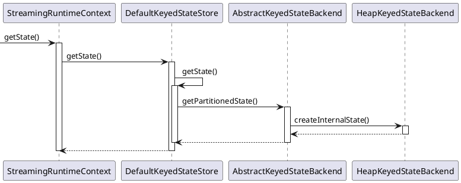

```toc
ordered: true
class-name: "table-of-contents"
```

对于流计算而言，事件持续不断地产生，如果每次计算都是相互独立的，不依赖于上下游的事件，则是无状态计算，如果计算需要依赖于之前或者后续的事件，则是有状态计算。在Flink中，状态用来保存中间计算结果或者缓存数据，另外还为为有状态计算提供容错和故障恢复。

按照数据结构的不同，Flink中定义了多种状态，应用于不同的场景：

+ `ValueState<T>`：单值状态，使用`update()`方法更新状态值，使用`value()`方法获取状态值
+ `ListState<T>`：列表状态，使用`add()` / `addAll()`方法添加元素，使用`get()`方法返回一个`Iterable<T>`来遍历状态值，使用`update()`覆盖当前列表
+ `MapState<K, V>`：Map状态，使用`put()` / `putAll()`方法添加键值对，使用`get()`方法获取元素，使用`entries()`、`keys()`、`values()`方法获取map、键、值的可迭代视图
+ `ReducingState<T>` / `AggregatingState<IN, OUT>` / `FoldingState<T, ACC>` ^[ReducingState聚合类型和添加的元素类型必须相同，而AggregatingState、FoldingState聚合类型和添加的元素类型可以不同]：聚合状态（表示添加到状态的所有值的聚合），使用`update()`方法添加元素（会使用提供的ReduceFunction / AggregateFunction / FoldFunction进行聚合），使用`get()`方法获取状态值

状态按照是否有Key分为KeyedState和OperatorState两种。KeyedState只能在KeyedStream中使用，跟具体的Key绑定，即keyedStream上的每一个Key对应一个State对象，可以使用所有类型的状态。OperatorState跟Operator的一个具体的并行实例绑定（如Kafka Connector中，每一个并行的Kafka Consumer都在OperatorState中维护当前Consumer订阅的partiton和offset），只支持ListState。OperatorState作用主要在于容错和状态重分布，OperatorState的分发模式（even-split、union和broadcast）决定了Operator在容错和状态重分布。event-split和union分发模式使用ListState实现，broadcast分发模式在BroadcastConnectedStream中使用BroadcastState模式实现，在数据流中直接将元素发送到下游所有partition中。广播状态（BroadcastState）在广播状态模式中使用，必须是MapState。广播状态模式是指来自一个流的数据需要被广播到所有下游任务，在算子本地存储，在处理另一个流的时候依赖于广播的数据，广播状态模式需要使用广播函数进行处理^[广播函数提供了处理广播数据流和普通数据流的接口]。

状态按照由Flink管理还是用户管理分为原始状态（Raw State）和托管状态（Managed State）。原始状态是用户自定义的状态，其数据结构对Flink是透明的，Flink做快照时把整个状态当作一个整体，需要用户自己管理，使用byte数组读写状态内容。托管状态是由Flink框架管理的状态，其序列化和反序列化由FLink框架提供支持，用户无感知。

状态描述（StateDescriptor）用于描述状态信息（状态名称、类型信息、序列化/反序列化器、过期时间等），每一类State都有对应的StateDescriptor。运行时，在RichFunction和ProcessFunction中，通过RuntimeContext对象，使用StateDesctiptor从状态后端（StateBackend）中获取实际的状态实例。

状态后端（StateBackend）定义了状态和检查点是如何存储的，目前Flink提供了MemoryStateBackend、FsStateBackend和RocksDBStateBackend三种状态后端。MemoryStateBackend会将工作状态存储在TaskManager的内存中，将检查点存储在JobManager的内存中；FsStateBackend 会将工作状态存储在 TaskManager 的内存中，将检查点存储在文件系统中（通常是分布式文件系统）；RocksDBStateBackend 则会把状态存储在 RocksDB 中，将检查点存储在文件系统中（类似 FsStateBackend）。

状态管理需要考虑以下几点：

+ 状态数据的存储和访问：在任务内部，如何高效地保存状态数据和使用状态数据
+ 状态数据的备份和恢复：如何高效地将状态数据保存下来，避免状态备份降低集群地吞吐量，并且在Failover的时候恢复作业到失败前的状态
+ 状态数据的划分和动态扩容：如何对状态数据进行切分，在作业修改并行度导致任务数量改变的时候确保正确地恢复到任务
+ 状态数据的清理：如何及时清理过期的状态

### 状态数据的存储和访问

Flink中使用状态有两种典型场景：
+ 状态操作接口：使用状态对象本身存储、写入、更新数据，分为面向应用开发者的状态接口和内部状态接口（Flink框架使用）。面向开发者的状态接口只提供了对状态中数据的添加、更新、删除等基本的操作接口。内部状态接口除了对状态中数据的访问之外还提供了内部的运行时信息接口，如状态中数据的序列化器、命名空间、命名空间序列化器、命名空间合并的接口
+ 状态访问接口：从状态后端获取状态本身。Flink抽象了OperatorStateStore和KeyedStateStore两个状态访问接口，屏蔽状态后端。OperatorStateStore中使用内存以Map形式来保存数据，KeyedStateStore中使用RocksDBStateBackend或者HeapKeyedStateBackend来保存数据，获取/创建状态都交给了具体的状态后端处理

状态后端（StateBackend）用于存储状态，需具备在计算过程中提供访问状态的能力、将状态持久化到外部存储的容错能力。Flink内置了3种状态后端：
+ MemoryStateBackend（内存型状态后端）：纯内存，适用于验证、测试。运行时所需要的状态数据保存在TaskManager JVM堆上内存中，键值类型的状态、窗口算子的状态使用HashTable来保存数据、触发器等，执行检查点时，会把状态的快照数据保存到JobManager进程的内存中
+ FsStateBackend（文件型状态后端）：内存+文件，适用于长周期大规模的数据。运行时所需要的状态数据保存在TaskManager JVM堆上内存中，执行检查点时，会把状态的快照数据保存到配置的文件系统中（分布式文件系统或本地文件系统）
+ RocksDBStateBackend：RocksDB，适用于长周期大规模的数据。使用嵌入式的本地数据库RocksDB将流计算数据状态存储在本地磁盘中，执行检查点时，再将整个RocksDB中保存的状态数据全量或者增量持久化到配置的文件系统中，在JobManager内存中会存储少量的检查点数据。相比基于内存的状态后端，访问状态的成本高很多，可能导致数据流的吞吐量剧烈下降

MemoryStateBackend和FsStateBackend依赖于HeapKeyStateBackend，HeapKeyStateBackend使用StateTable存储数据，StateTable有NestedMapsStateTable和CopyOnWriteStateTable两个子类，NestedMapStateTabel使用两层嵌套的HashMap保存状态数据，支持同步快照。CopyOnWriteStateTable使用CopyOnWriteStateMap来保存数据，支持异步快照。

### 状态数据的备份和恢复

**全量持久化策略** 每次把全量的状态写入状态存储中，HeapKeyedStateBackend对应HeapSnapshotStrategy策略，RocksDBStateBackend对应RocksFullSnapshotStrategy策略。在执行持久化策略时，使用异步机制，每个算子独立启动1个独立的线程，将自身的状态写入分布式可靠存储中，在做持久化的过程中，状态可能会被持续修改，基于内存的状态后端使用CopyOnWriteStateTable来保证线程安全，RocksDBStateBackend则使用RocksDB的快照机制，使用快照来保证线程安全

**增量持久化策略** 每次持久化增量的状态，只有RocksDBStateBackend支持增量持久化。RocksDB是一个基于LSM-Tree的键值存储，新的数据保存在内存中，成为memtable，一旦memtable写满了，RocksDB就会将数据压缩并写入到磁盘，memtable的数据持久化到磁盘后就变成了不可变的sstable。RocksDB会在后台合并sstable并删除其中重复的数据，然后在RocksDB删除原来的sstable，替换成新合成的sstable，新的sstable包含了被删除的sstable中的信息，通过合并，历史sstable会合并成一个新的sstable，并删除这些历史sstable，可以减少检查点的历史文件，避免大量小文件的产生。因为sstable是不可变的，Flink对比前一个检查点创建和删除的RocksDB sstable文件就可以计算出状态有哪些改变。为了确保sstable是不可变的，Flink会在RocksDB上触发刷新操作，强制将memtable刷新到磁盘上，在Flink执行检查点时，会将新sstable持久化到存储中，同时保留引用。

### 状态数据的划分和动态扩容

OpeartorState重分布：
+ ListState：并行度发生改变时，会将每个List都取出，然后把这些List合并到一个新的List，根据元素的个数均匀分配给新的Task
+ UnionListState：并行度发生改变时，会将原来的List合并，但不做划分，直接交给用户
+ BroadcastState：并行度发生改变时，直接把Broadcast数据分发到新的Task即可

KeyedState重分布：基于Key-Group，每个Key隶属于唯一的Key-Group，Key-Group分配给Task实例，每个Task至少有1个Key-Group，Key-Group数量等于最大并行度。KeyGroup分配算法：
```
假设KeyGroup的数量为numberOfKeyGroups
hash = hash(key)
KeyGroup = hash % numberOfKeyGroups   // key所属的KeyGroup是确定的
subtask = KeyGroup / (numberOfKeyGroups / parallelism)
```

### 状态数据的清理

DataStream作业中可以通过StateDescriptor的`enableTimeToLive(stateTtlConfig)`方法对状态过期进行精细控制，对每一个状态设置清理的策略，StateTtlConfig中可以设置的内容如下：
+ 过期时间：超过多长时间未访问，视为状态过期
+ 过期时间更新策略：创建和写时更新、读取和写时更新
+ 状态可见性：未清理可用，超期则不可用

Flink SQL是高层抽象，没有状态概念，可以通过Flink Table API和SQL的参数配置选项设置状态清理策略（StreamQueryConfig的withIdleStateRetentionTime()）^[定时清理状态存在可能因为状态被清理而导致计算结果不完全准确的风险，过期时间一般为1.5天左右]。

默认情况下，只有在明确读出过期值时才会删除过期值。使用StateTtlConfig的`cleanupFullSnapshot()`设置完整快照时清理状态，在获取完整状态快照时激活清理，减少其大小（在当前实现下不清除本地状态，但在从上一个快照恢复的情况下，不会包括已删除的过期状态）。使用StateTtlConfig的`cleanupIncrementally()`设置增量清理状态，当进行状态访问或者清理数据时，在回调函数中进行处理，当每次增量清理触发时，遍历状态后端中的状态，清理掉过期的。

### 状态实现

#### KeyedState

**状态初始化** 初始化过程位于AbstractStreamOperator的initializeState()方法中。StreamOperatorStateHandler在构造时，会初始化OperatorState状态后端（OperatorStateBackend）、KeyedState状态后端（KeyedStateBackend）和KeyedState状态存储（KeyedStateStore）。状态后端（KeyedStateBackend）是实际状态存储的位置，状态存储（KeyedStateStore，被注册到RuntimeContext中）负责创建和获取状态（KeyedStateStore的getXxxState()类方法），OperatorStateBackend继承了OperatorStateStore，包含了OperatorStateSotre的功能。

<details> <summary>具体实现</summary>

```Java
abstract class AbstractStreamOperatorV2<OUT> implements StreamOperator<OUT>, CheckpointedStreamOperator
{
    StreamOperatorStateHandler stateHandler;
    InternalTimeServiceManager<?> timeServiceManager;

    // 初始化OperatorState状态后端、KeyedState状态后端、KeyedState状态存储
    void initializeState(StreamTaskStateInitializer streamTaskStateManager)
    {
        TypeSerializer<?> keySerializer = config.getStateKeySerializer(getUserCodeClassloader());

        StreamOperatorStateContext context =
            streamTaskStateManager.streamOperatorStateContext(
                getOperatorID(),
                getClass().getSimpleName(),
                getProcessingTimeService(),
                this,
                keySerializer,
                cancelables,
                metrics,
                config.getManagedMemoryFractionOperatorUseCaseOfSlot(
                    ManagedMemoryUseCase.STATE_BACKEND,
                    runtimeContext.getTaskManagerRuntimeInfo().getConfiguration(),
                    runtimeContext.getUserCodeClassLoader()),
            isUsingCustomRawKeyedState());

        stateHandler = new StreamOperatorStateHandler(context, getExecutionConfig(), cancelables);
        timeServiceManager = context.internalTimerServiceManager();
        // 初始化OperatorStateBackend
        stateHandler.initializeOperatorState(this);
    }

}

class StreamOperatorStateHandler
{
    // 对于non-keyed数据流，keyedStateBackend为null
    CheckpointableKeyedStateBackend<?> keyedStateBackend;
    DefaultKeyedStateStore keyedStateStore;
    OperatorStateBackend operatorStateBackend;
    StreamOperatorStateContext context;

    // StreamOperatorStateHandler在构造时会初始化OperatorState状态后端、KeyedState状态后端、KeyedState状态存储
    StreamOperatorStateHandler(
        StreamOperatorStateContext context,
        ExecutionConfig executionConfig,
        CloseableRegistry closeableRegistry)
    {
        // 
        this.context = context;
        operatorStateBackend = context.operatorStateBackend();
        keyedStateBackend = context.keyedStateBackend();
        this.closeableRegistry = closeableRegistry;

        // 对于non-keyed数据流，keyedStateBackend、keyedStateStore都是null
        if (keyedStateBackend != null) {
            keyedStateStore = new DefaultKeyedStateStore(keyedStateBackend, executionConfig);
        } else {
            keyedStateStore = null;
        }
    }

    void initializeOperatorState(CheckpointedStreamOperator streamOperator)
    {
        CloseableIterable<KeyGroupStatePartitionStreamProvider> keyedStateInputs = context.rawKeyedStateInputs();
        CloseableIterable<StatePartitionStreamProvider> operatorStateInputs = context.rawOperatorStateInputs();

        OptionalLong checkpointId = context.getRestoredCheckpointId();
        StateInitializationContext initializationContext =
            new StateInitializationContextImpl(
                checkpointId.isPresent() ? checkpointId.getAsLong() : null,
                operatorStateBackend, // access to operator state backend
                keyedStateStore, // access to keyed state backend
                keyedStateInputs, // access to keyed state stream
                operatorStateInputs); // access to operator state stream

        // 调用自定义状态处理钩子
        // initializeState()方法默认不进行任何操作，由于算子状态直接影响到checkpoint和rebalance、rescale的重划分，不同算子对算子状态的要求也不尽相同，对算子状态使用有需求的功能算子自行实现该方法
        streamOperator.initializeState(initializationContext);
        closeFromRegistry(operatorStateInputs, closeableRegistry);
        closeFromRegistry(keyedStateInputs, closeableRegistry);
    }
}
```

</details>

**获取/创建状态** 要在Function中使用状态，需要实现RichFunction接口。RichFunction接口提供了获取运行时上下文的方法getRuntimeContext()。RichMapFunction等类名带有Rich的UDF都是RichFunction接口的实现（ProcessFunction类和KeyedProcessFunction类也是RichFunction实现），这些UDF可以通过getRuntimeContext()方法（继承自AbstractRichFunction）获取运行时上下文StreamRuntimeContext，然后从中获取任意一种类型的状态。在AbstractKeyedStateBackend的getPartitionedState()方法中做了大量的缓存工作，首先查询上一次获取状态时的返回值lastState，然后查询缓存keyValueStatesByName（一个\<name, state\>键值对）中所有获取过的状态。当两个缓存中都没有查询到所需的状态，则调用getOrCreateKeyedState()方法创建一个新的状态。注意，调用AbstractKeyedStateBackend的getpartitionedState()方法中传入的参数为VoidNamespace.INSTANCE、VoidNamespaceSerializer.INSTANCE和stateDescriptor，这意味着KeyedState是没有namespace的^[windowState的namespace标识了窗口]。

<div class="wrapper" block="markdown">



</div>

<details> <summary>具体实现</summary>

```Java
abstract class AbstractKeyedStateBackend<K>
implements CheckpointableKeyedStateBackend<K>,
           InternalCheckpointListener,
           TestableKeyedStateBackend<K>,
           InternalKeyContext<K>
{
    HashMap<String, InternalKvState<K, ?, ?>> keyValueStatesByName;
    String lastName;
    InternalKvState lastState;

    // getPartitionedState()方法中做了大量的缓存工作
    <N, S extends State> S getPartitionedState(
        N namespace,
        TypeSerializer<N> namespaceSerializer,
        StateDescriptor<S, ?> stateDescriptor)
    {

        // 首先查询上一次获取状态时的返回值lastState
        if (lastName != null && lastName.equals(stateDescriptor.getName())) {
            lastState.setCurrentNamespace(namespace);
            return (S) lastState;
        }

        // 然后查询历史记录keyValueStatesByName中所有获取过的状态
        InternalKvState<K, ?, ?> previous = keyValueStatesByName.get(stateDescriptor.getName());
        if (previous != null) {
            lastState = previous;
            lastState.setCurrentNamespace(namespace);
            lastName = stateDescriptor.getName();
            return (S) previous;
        }

        // 以上两个缓存中都没有查询到所需的状态时，调用getOrCreateKeyedState()方法创建一个新的状态
        S state = getOrCreateKeyedState(namespaceSerializer, stateDescriptor);
        InternalKvState<K, N, ?> kvState = (InternalKvState<K, N, ?>) state;

        lastName = stateDescriptor.getName();
        lastState = kvState;
        kvState.setCurrentNamespace(namespace);

        return state;
    }
}
```

</details>

getOrCreateKeyedState()方法由于会被StreamOperatorStateHandler直接调用，其内部又做了一次缓存的检查，然后通过TtlStateFactory的createStateAndWrapWithTtlIfEnabled()创建状态，并在创建完成后，将新创建的状态加入到缓存keyValueStatesByName中。参数this对应AbstractKeyedStateBackend的实现类HeapKeyedStateBackend对象，当不启用ttl时，实际创建状态的过程在HeapKeyStateBackend的createInternalState()方法中。

<details> <summary>具体实现</summary>

```Java
abstract class AbstractKeyedStateBackend<K>
implements CheckpointableKeyedStateBackend<K>,
           InternalCheckpointListener,
           TestableKeyedStateBackend<K>,
           InternalKeyContext<K>
{
    HashMap<String, InternalKvState<K, ?, ?>> keyValueStatesByName;

    <N, S extends State, V> S getOrCreateKeyedState(
        TypeSerializer<N> namespaceSerializer,
        StateDescriptor<S, V> stateDescriptor)
    {
        // 缓存检查
        InternalKvState<K, ?, ?> kvState = keyValueStatesByName.get(stateDescriptor.getName());
        if (kvState == null) {
            if (!stateDescriptor.isSerializerInitialized()) {
                stateDescriptor.initializeSerializerUnlessSet(executionConfig);
            }
            // 通过TtlStateFactory的createStateAndWrapWithTtlIfEnabled()方法创建状态
            // 参数this对应的是AbstractKeyedStateBackend的实现类HeapKeyedStateBackend实例
            // 当不启用ttl时，实际创建状态的过程位于HeapKeyedStateBackend的createInternalState()方法
            kvState =
                LatencyTrackingStateFactory.createStateAndWrapWithLatencyTrackingIfEnabled(
                    TtlStateFactory.createStateAndWrapWithTtlIfEnabled(
                        namespaceSerializer, stateDescriptor, this, ttlTimeProvider),
                    stateDescriptor,
                    latencyTrackingStateConfig);
            // 将新创建的状态加入缓存
            keyValueStatesByName.put(stateDescriptor.getName(), kvState);
            publishQueryableStateIfEnabled(stateDescriptor, kvState);
        }
        return (S) kvState;
    }
}
```

</details>

HeapKeyedStateBackend的createInternalState()方法在创建一个新的状态实例前，向状态表中注册一个新的状态（主要用于快照），然后调用StateFactory的createState()方法创建状态。

<details> <summary>具体实现</summary>

```Java
class HeapKeyedStateBackend<K> extends AbstractKeyedStateBackend<K>
{
    <N, SV, SEV, S extends State, IS extends S> IS createInternalState(
        TypeSerializer<N> namespaceSerializer,
        StateDescriptor<S, SV> stateDesc,
        StateSnapshotTransformFactory<SEV> snapshotTransformFactory)
    {
        StateFactory stateFactory = STATE_FACTORIES.get(stateDesc.getType());
        // 向状态表中注册一个新的状态，主要用于快照
        StateTable<K, N, SV> stateTable =
            tryRegisterStateTable(
                namespaceSerializer,
                stateDesc,
                getStateSnapshotTransformFactory(stateDesc, snapshotTransformFactory));
        return stateFactory.createState(stateDesc, stateTable, getKeySerializer());
    }
}
```

</details>

**ttl** TtlState是HeapState的一个装饰器，提供了根据时间使状态过期的功能（目前只支持ProcessingTime）。TtlState实际上是用TtlValue对HeapState保存的值进行了一次装饰，添加了timestamp属性lastAccessTimestamp。lastAccessTimestamp由final修饰，不可变，每次更新ttl时都会创建一个新的TtlValue替换原有的状态值。

<details> <summary>具体实现</summary>

```Java
class TtlValue<T>
{
    T userValue;
    long lastAccessTimestamp;

    TtlValue(T userValue, long lastAccessTimestamp) {
        this.userValue = userValue;
        this.lastAccessTimestamp = lastAccessTimestamp;
    }

    T getUserValue() {
        return userValue;
    }

    long getLastAccessTimestamp() {
        return lastAccessTimestamp;
    }
}
```

</details>

TtlState与HeapState创建过程的分支点位于TtlStateFactory的createStateAndWrapWithTtlIfEnabled处，当设置Ttl时，该方法将返回TtlStateFactory的createState()结果。创建一个TtlState的构造参数是TtlStateContext，TtlStateContext提供了TtlState所需的所有信息：需要装饰的原始HeapState、Ttl配置信息、时间供应器、状态描述的序列化器以及TTL增量清理回调方法。清理回调方法只在获取状态和更新状态前异步执行，对状态的功能而言是透明的。以ValueState为例，TtlValueState由3层结构组成，分别是提供基本TTL功能的AbstractDecorator、提供State基本功能的AbstractTtlState以及提供状态获取/更新功能的TtlValueState。

<details> <summary>具体实现</summary>

```Java
class TtlStateFactory<K, N, SV, TTLSV, S extends State, IS extends S>
{
    IS createState() {
        SupplierWithException<IS, Exception> stateFactory = stateFactories.get(stateDesc.getType());
        // stateFactory的get()方法为对应状态类型的createXxx()方法
        // 如ValueState对应createValueState()方法
        IS state = stateFactory.get();
        if (incrementalCleanup != null) {
            incrementalCleanup.setTtlState((AbstractTtlState<K, N, ?, TTLSV, ?>) state);
        }
        return state;
    }

    IS createValueState() {
        ValueStateDescriptor<TtlValue<SV>> ttlDescriptor =
            stateDesc.getSerializer() instanceof TtlSerializer
                ? (ValueStateDescriptor<TtlValue<SV>>) stateDesc
                : new ValueStateDescriptor<>(stateDesc.getName(), new TtlSerializer<>(LongSerializer.INSTANCE, stateDesc.getSerializer()));
        // 创建一个TtlState的构造参数是TtlStateContext
        return (IS) new TtlValueState<>(createTtlStateContext(ttlDescriptor));
    }

    <OIS extends State, TTLS extends State, V, TTLV> TtlStateContext<OIS, V> createTtlStateContext(StateDescriptor<TTLS, TTLV> ttlDescriptor)
    {
        ttlDescriptor.enableTimeToLive(stateDesc.getTtlConfig());
        OIS originalState = (OIS) stateBackend.createInternalState(
            namespaceSerializer, ttlDescriptor, getSnapshotTransformFactory());
        return new TtlStateContext<>(
            originalState,
            ttlConfig,
            timeProvider,
            (TypeSerializer<V>) stateDesc.getSerializer(),
            registerTtlIncrementalCleanupCallback((InternalKvState<?, ?, ?>) originalState));
    }
}
```

</details>

获取状态最终通过AbstractTtlDecorator的getWrappedWithTtlCheckAndUpdate()方法，只要状态过期，就会执行HeapValueState的clear()方法清楚状态的值，然后根据ttl设置的ReturnExpiredIfNotCleanedUp决定是否要返回过期值。如果设置了OnReadAndWrite的ttl刷新策略，则会使用当前时间戳创建一个新的TtlValue并更新到其装饰的HeapValueState中。

<details> <summary>具体实现</summary>

```Java
abstract class AbstractTtlDecorator<T>
{
    <SE extends Throwable, CE extends Throwable, CLE extends Throwable, V> TtlValue<V> getWrappedWithTtlCheckAndUpdate(
        SupplierWithException<TtlValue<V>, SE> getter,
        ThrowingConsumer<TtlValue<V>, CE> updater,
        ThrowingRunnable<CLE> stateClear)
    {
        TtlValue<V> ttlValue = getter.get();
        if (ttlValue == null) {
            return null;
        } else if (expired(ttlValue)) {
            // 过期时清除状态的值
            stateClear.run();
            // 根据ttl设置的ReturnExpiredIfNotCleanedUp决定是否返回过期值
            if (!returnExpired) {
                return null;
            }
        } else if (updateTsOnRead) {
            // 设置了OnReadAndWrite的ttl刷新策略时，会使用当前时间戳创建一个新的TtlValue并更新到其装饰的HeapValueState中
            updater.accept(rewrapWithNewTs(ttlValue));
        }
        return ttlValue;
    }

    boolean expired(TtlValue<V> ttlValue) {
        return TtlUtils.expired(ttlValue, ttl, timeProvider);
    }

    <V> TtlValue<V> rewrapWithNewTs(TtlValue<V> ttlValue) {
        return wrapWithTs(ttlValue.getUserValue());
    }

    <V> TtlValue<V> wrapWithTs(V value) {
        // new TtlValue<>(value, timeProvider.currentTimestamp());
        return TtlUtils.wrapWithTs(value, timeProvider.currentTimestamp());
    }
}
```

</details>

其他TtlState的处理方式和TtlValueState基本一致。TtlReducingState和TtlAggregatingState是丢弃整个过期的结果；TtlListState是遍历状态中的列表，并将未过期的值重新组成一个新的列表，代替原来的状态列表；TtlMapState直接将过期的\<key,value\>丢弃。

**增量清理** 即通过设置TtlConfig.Builder的cleanupIncrementally()方法增加的后台状态清理功能，其实现位于TtlIncrementalCleanup类中，由TtlStateFactory的registerTtlIncrementalCleanupCallback()构造回调函数，在每次访问状态和更新状态时执行。TtlStateFactory在注册增量清理回调函数时，将stateAccessed()方法注册为清理方法：首先从状态的stateTable中获取至多cleanupSize个状态，然后逐一检查这些状态是否过期，并直接将过期的状态从stateTable中移除。

<details> <summary>具体实现</summary>

```Java
class TtlStateFactory<K, N, SV, TTLSV, S extends State, IS extends S>
{
    Runnable registerTtlIncrementalCleanupCallback(InternalKvState<?, ?, ?> originalState) {
        StateTtlConfig.IncrementalCleanupStrategy config = ttlConfig.getCleanupStrategies().getIncrementalCleanupStrategy();
        boolean cleanupConfigured = config != null && incrementalCleanup != null;
        boolean isCleanupActive = cleanupConfigured && isStateIteratorSupported(originalState, incrementalCleanup.getCleanupSize());
        // 将stateAccessed()方法注册为清理方法
        Runnable callback = isCleanupActive ? incrementalCleanup::stateAccessed : () -> {};
        if (isCleanupActive && config.runCleanupForEveryRecord()) {
            stateBackend.registerKeySelectionListener(stub -> callback.run());
        }
        return callback;
    }
}

class TtlIncrementalCleanup<K, N, S>
{
    StateIncrementalVisitor<K, N, S> stateIterator;

    void stateAccessed() {
        // 从stateTable中获取至多cleanupSize个状态
        initIteratorIfNot();
        // 逐一检查这些状态是否过期，并直接将过期的状态从tateTable中移除
        runCleanup();
    }

    void initIteratorIfNot() {
        if (stateIterator == null || !stateIterator.hasNext()) {
            stateIterator = ttlState.original.getStateIncrementalVisitor(cleanupSize);
        }
    }

    void runCleanup() {
        int entryNum = 0;
        Collection<StateEntry<K, N, S>> nextEntries;
        while (entryNum < cleanupSize
                && stateIterator.hasNext()
                && !(nextEntries = stateIterator.nextEntries()).isEmpty()) {

            for (StateEntry<K, N, S> state : nextEntries) {
                S cleanState = ttlState.getUnexpiredOrNull(state.getState());
                if (cleanState == null) {
                    stateIterator.remove(state);
                } else if (cleanState != state.getState()) {
                    stateIterator.update(state, cleanState);
                }
            }

            entryNum += nextEntries.size();
        }
    }
}
```

</details>

#### OperatorState

**状态初始化** 同KeyedState

**获取/创建状态** 要在Function中使用算子状态，需要实现CheckpointedFunction接口，该接口提供了初始化状态（initializeState()）和快照状态（snapshotState()）两个方法。snapshotState()方法每次进行checkpoint时会先执行；initializeState()方法在每次初始化UDF时会执行，包括算子初始化以及从故障中恢复。可以通过初始化状态方法入参FunctionInitializationContext的getOperatorStateStore()方法获取到算子状态，然后通过DefaultOperatorStateBackend（DefaultOperatorStateBackend目前是OperatorStateStore接口的唯一实现）的getXxxState()方法获取到三种分发模式对应的ListState、UnionState和BroadcastState。

广播分发模式是指在广播流上上游算子以广播方式向下游算子的分区发送数据，BroadcastState状态只能保证所有的分区能够看到广播流中所有的数据，不能保证每个算子中的BroadcastState是一定一致的。如果算子的所有分区在看到广播流中的元素能够做出相同的状态更新，由于Flink底层使用TCP保证了数据顺序不会发生变化，就可以认为每个算子中的BroadcastState是完全一致的，因此需要保证对BroadcastState的更新在每个任务实例中是完全一致的。

BroadcastState对应的实现为HeapBroadcastState，是BroadcastState接口的唯一实现，并增加了将状态写入状态后端的相关实现（BackendWritableBroadcastState接口）。BroadcastState实现基本上是对内部存储backingMap的封装。

<details> <summary>具体实现</summary>

```Java
class HeapBroadcastState<K, V> implements BackendWritableBroadcastState<K, V>
{
    RegisteredBroadcastStateBackendMetaInfo<K, V> stateMetaInfo;
    Map<K, V> backingMap;
    MapSerializer<K, V> internalMapCopySerializer;

    HeapBroadcastState(RegisteredBroadcastStateBackendMetaInfo<K, V> stateMetaInfo)
    {
        this(stateMetaInfo, new HashMap<>());
    }

    HeapBroadcastState(HeapBroadcastState<K, V> toCopy)
    {
        this(toCopy.stateMetaInfo.deepCopy(), toCopy.internalMapCopySerializer.copy(toCopy.backingMap));
    }

    HeapBroadcastState(
        RegisteredBroadcastStateBackendMetaInfo<K, V> stateMetaInfo,
        Map<K, V> internalMap)
    {
        this.stateMetaInfo = stateMetaInfo;
        this.backingMap = internalMap;
        this.internalMapCopySerializer = new MapSerializer<>(stateMetaInfo.getKeySerializer(), stateMetaInfo.getValueSerializer());
    }

    void clear() {
        backingMap.clear();
    }

    long write(FSDataOutputStream out) {
        long partitionOffset = out.getPos();
        DataOutputView dov = new DataOutputViewStreamWrapper(out);
        dov.writeInt(backingMap.size());
        for (Map.Entry<K, V> entry : backingMap.entrySet()) {
            getStateMetaInfo().getKeySerializer().serialize(entry.getKey(), dov);
            getStateMetaInfo().getValueSerializer().serialize(entry.getValue(), dov);
        }
        return partitionOffset;
    }

    V get(K key) {
        return backingMap.get(key);
    }

    void put(K key, V value) {
        backingMap.put(key, value);
    }
}
```
</details>

BroadcastState通过DefaultOperatorStateBackend的getBroadcastState()方法得到，BroadcastState内部是一个HashMap，所以只支持MapStateDescriptor来描述。BroadcastState获取包括三个步骤：

1. 检查缓存accessedBroadcastStatesByName
2. 检查所有已注册的状态registeredBroadcastStates
3. 如果前两步都没有查到对应的状态，则新建一个新的BroadcastState并将其注册到registeredBroadcastStates中

<details> <summary>具体实现</summary>

```Java
class DefaultOperatorStateBackend implements OperatorStateBackend
{
    Map<String, BackendWritableBroadcastState<?, ?>> registeredBroadcastStates;
    Map<String, BackendWritableBroadcastState<?, ?>> accessedBroadcastStatesByName;

    <K, V> BroadcastState<K, V> getBroadcastState(MapStateDescriptor<K, V> stateDescriptor)
    {
        String name = stateDescriptor.getName();

        // 检查缓存accessedBroadcastState
        BackendWritableBroadcastState<K, V> previous = (BackendWritableBroadcastState<K, V>) accessedBroadcastStatesByName.get(name);

        if (previous != null) {
            checkStateNameAndMode(
                previous.getStateMetaInfo().getName(),
                name,
                previous.getStateMetaInfo().getAssignmentMode(),
                OperatorStateHandle.Mode.BROADCAST);
            return previous;
        }

        stateDescriptor.initializeSerializerUnlessSet(getExecutionConfig());
        TypeSerializer<K> broadcastStateKeySerializer = stateDescriptor.getKeySerializer();
        TypeSerializer<V> broadcastStateValueSerializer = stateDescriptor.getValueSerializer();

        // 检查registeredBroadcastState中所有已注册的状态
        BackendWritableBroadcastState<K, V> broadcastState = (BackendWritableBroadcastState<K, V>) registeredBroadcastStates.get(name);

        if (broadcastState == null) {
            // 没有查到对应的状态时，创建一个新的状态并将其注册到registeredBroadcastStates中
            broadcastState = new HeapBroadcastState<>(
                new RegisteredBroadcastStateBackendMetaInfo<>(
                    name,
                    OperatorStateHandle.Mode.BROADCAST,
                    broadcastStateKeySerializer,
                    broadcastStateValueSerializer));
            registeredBroadcastStates.put(name, broadcastState);
        } else {

            checkStateNameAndMode(
                broadcastState.getStateMetaInfo().getName(),
                name,
                broadcastState.getStateMetaInfo().getAssignmentMode(),
                OperatorStateHandle.Mode.BROADCAST);
            ......
        }

        // 返回结果前，将得到的BroadcastState放入缓存中
        accessedBroadcastStatesByName.put(name, broadcastState);
        return broadcastState;
    }
}
```

</details>

BroadcastState只有在广播数据流（BroadcastStream）中才能获取，可以通过DataStream的broadcast(mapStateDescriptor)方法将一个普通数据流转换成广播数据流，注意必须是带MapStateDescriptor参数的broadcast()方法，无参方法仅仅是将DataStream向下游算子发送数据的方式改为broadcast模式。广播数据流在和普通数据流连接后得到BroadcastConnectedStream，对应CoBroadcastWithKeyedOperator（连接Keyed数据流）和CoBroadcastWithNonKeyedOperator（连接non-keyed数据流）两种算子。Broadcast算子给广播数据流处理方法提供了读写上下文（rwContext），可以根据广播流获取和更新BroadcastState的内容；给一般数据流处理方法提供了只读上下文，只能获取BroadcastState状态的内容（keyed数据流中可以正常获取和更新keyed状态）。根据Broadcast算子的open()方法，在启动或恢复Broadcast算子时会从OperatorState状态后端中获取DataStream.broadcast(mapStateDescriptor)中定义的状态并加载到自身的类变量中，在算子使用过程中只能访问这些定义过的状态。

<details> <summary>具体实现</summary>

```Java
class DataStream<T>
{
    BroadcastStream<T> broadcast(MapStateDescriptor<?, ?>... broadcastStateDescriptors)
    {
        DataStream<T> broadcastStream = setConnectionType(new BroadcastPartitioner<>());
        return new BroadcastStream<>(environment, broadcastStream, broadcastStateDescriptors);
    }

    <R> BroadcastConnectedStream<T, R> connect(BroadcastStream<R> broadcastStream)
    {
        return new BroadcastConnectedStream<>(
            environment,
            this,
            broadcastStream,
            broadcastStream.getBroadcastStateDescriptors());
    }
}

class BroadcastConnectedStream<IN1, IN2>
{
    <KEY, OUT> SingleOutputStreamOperator<OUT> process(
        KeyedBroadcastProcessFunction<KEY, IN1, IN2, OUT> function,
        TypeInformation<OUT> outTypeInfo)
    {
        return transform(function, outTypeInfo);
    }

    <OUT> SingleOutputStreamOperator<OUT> process(
        BroadcastProcessFunction<IN1, IN2, OUT> function,
        TypeInformation<OUT> outTypeInfo)
    {

        return transform(function, outTypeInfo);
    }

    <KEY, OUT> SingleOutputStreamOperator<OUT> transform(
        KeyedBroadcastProcessFunction<KEY, IN1, IN2, OUT> userFunction,
        TypeInformation<OUT> outTypeInfo)
    {

        nonBroadcastStream.getType();
        broadcastStream.getType();

        KeyedStream<IN1, KEY> keyedInputStream = (KeyedStream<IN1, KEY>) nonBroadcastStream;

        KeyedBroadcastStateTransformation<KEY, IN1, IN2, OUT> transformation =
            new KeyedBroadcastStateTransformation<>(
                "Co-Process-Broadcast-Keyed",
                nonBroadcastStream.getTransformation(),
                broadcastStream.getTransformation(),
                clean(userFunction),
                broadcastStateDescriptors,
                keyedInputStream.getKeyType(),
                keyedInputStream.getKeySelector(),
                outTypeInfo,
                environment.getParallelism());

        SingleOutputStreamOperator<OUT> returnStream = new SingleOutputStreamOperator(environment, transformation);

        getExecutionEnvironment().addOperator(transformation);
        return returnStream;
    }
}
```

</details>

event-split和union分发模式对应的算子状态都是ListState，ListState的实现类是PartitionableListState。PartitionableListState实现基本上是对内部存储ArrayList的封装。

<details> <summary>具体实现</summary>

```Java
class PartitionableListState<S> implements ListState<S>
{
    RegisteredOperatorStateBackendMetaInfo<S> stateMetaInfo;
    ArrayList<S> internalList;
    ArrayListSerializer<S> internalListCopySerializer;

    PartitionableListState(RegisteredOperatorStateBackendMetaInfo<S> stateMetaInfo)
    {
        this(stateMetaInfo, new ArrayList<S>());
    }

    PartitionableListState(PartitionableListState<S> toCopy)
    {
        this(toCopy.stateMetaInfo.deepCopy(),
            toCopy.internalListCopySerializer.copy(toCopy.internalList));
    }

    PartitionableListState(
        RegisteredOperatorStateBackendMetaInfo<S> stateMetaInfo, ArrayList<S> internalList)
    {

        this.stateMetaInfo = stateMetaInfo;
        this.internalList = internalList;
        this.internalListCopySerializer = new ArrayListSerializer<>(stateMetaInfo.getPartitionStateSerializer());
    }

    void clear() {
        internalList.clear();
    }

    void add(S value) {
        internalList.add(value);
    }

    void update(List<S> values) {
        internalList.clear();
        addAll(values);
    }

    long[] write(FSDataOutputStream out)
    {
        long[] partitionOffsets = new long[internalList.size()];

        DataOutputView dov = new DataOutputViewStreamWrapper(out);

        for (int i = 0; i < internalList.size(); ++i) {
            S element = internalList.get(i);
            partitionOffsets[i] = out.getPos();
            getStateMetaInfo().getPartitionStateSerializer().serialize(element, dov);
        }

        return partitionOffsets;
    }
}
```

</details>

ListState通过DefaultOperatorStateBackend的getListstate(listStateDescriptor, mode)方法得到（event-split分发模式对应mode参数为OperatorStateHandle.Mode.SPLIT_DISTRIBUTE，union分发模式对应mode参数为OperatorStateHandle.Mode.UNION）。ListState获取步骤和BroadcastState基本一致：

1. 检查缓存accessedStateByName
2. 检查所有已注册的状态registeredOperatorStates
3. 如果前两步都没有查到对应的状态，则创建一个新的状态并将其注册到registeredOperatorStates中

通过DefaultOperatorStateBackend的getListState(listStateDescriptor)方法可以获取一个event-split分发模式的ListState，在event-split分发模式下，算子的重划分使用round-robin轮询，原先所有event-split分发模式下的ListState会被划分成若干个子列表然后分配到不同的partition中，对应方法为RoundRobinOperaorStateRepartitioner的repartitionSplitState()方法。

通过DefaultOperatorStateBackend的getUnionListState(listStateDescriptor)方法可以获取一个union分发模式的ListState，在union分发模式下，算子的重划分会将算子原先所有union分发模式的ListState全部拼接到一起，然后分配到所有分区中，对应方法为RoundRobinOperatorStateRepartitioner的repartitionUnionState()方法。

<details> <summary>具体实现</summary>

```Java
class DefaultOperatorStateBackend implements OperatorStateBackend
{
    <S> ListState<S> getListState(ListStateDescriptor<S> stateDescriptor)
    {
        return getListState(stateDescriptor, OperatorStateHandle.Mode.SPLIT_DISTRIBUTE);
    }

    <S> ListState<S> getUnionListState(ListStateDescriptor<S> stateDescriptor)
    {
        return getListState(stateDescriptor, OperatorStateHandle.Mode.UNION);
    }

    <S> ListState<S> getListState(
        ListStateDescriptor<S> stateDescriptor, OperatorStateHandle.Mode mode)
    {

        String name = stateDescriptor.getName();

        PartitionableListState<S> previous = (PartitionableListState<S>) accessedStatesByName.get(name);
        if (previous != null) {
            checkStateNameAndMode(
                previous.getStateMetaInfo().getName(),
                name,
                previous.getStateMetaInfo().getAssignmentMode(),
                mode);
            return previous;
        }

        stateDescriptor.initializeSerializerUnlessSet(getExecutionConfig());
        TypeSerializer<S> partitionStateSerializer = stateDescriptor.getElementSerializer();

        PartitionableListState<S> partitionableListState = (PartitionableListState<S>) registeredOperatorStates.get(name);

        if (null == partitionableListState) {

            partitionableListState = new PartitionableListState<>(
                new RegisteredOperatorStateBackendMetaInfo<>(name, partitionStateSerializer, mode));

            registeredOperatorStates.put(name, partitionableListState);
        } else {
            ......
        }

        accessedStatesByName.put(name, partitionableListState);
        return partitionableListState;
    }
}
```

</details>
