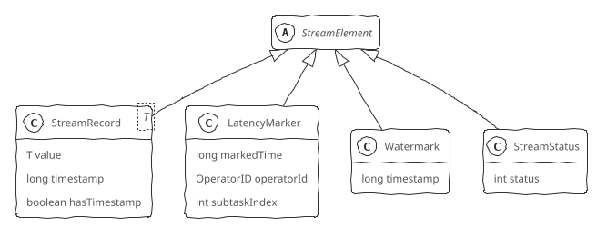
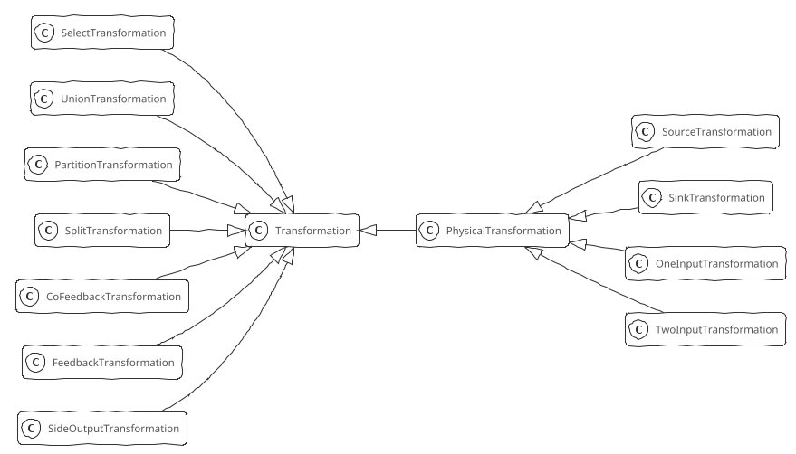
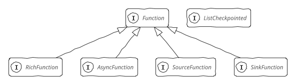
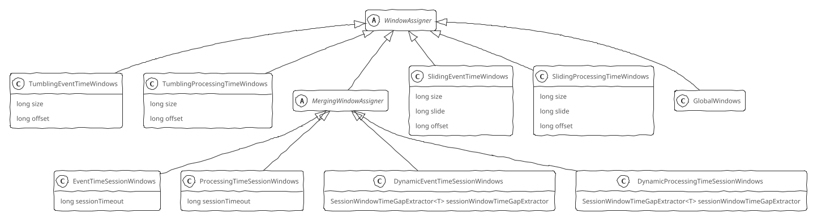
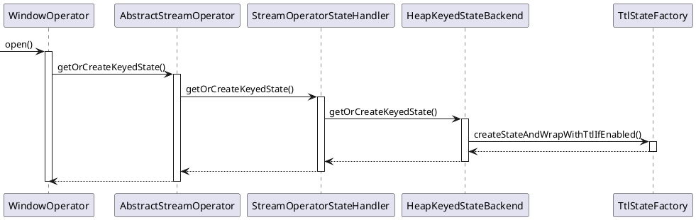
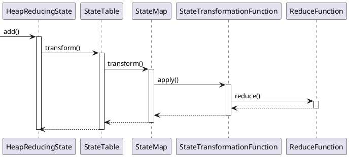

```toc
ordered: true
class-name: "table-of-contents"
```

## 核心抽象

Flink抽象了Flink API作为数据流和在数据流上的操作，抽象了Transformation作为API层到执行层转换的中间层，抽象了算子、Function、数据分区作为运行时业务逻辑的载体，抽象了数据IO屏蔽外部存储的差异。Function用于实现业务逻辑；Transformation是一个逻辑概念，记录上游数据来源，将用户处理逻辑组织成流水线；算子在运行时从上游获取数据、交给用户自定义函数执行并将执行结果交给下游，同时提供容错支持。

### 环境对象

环境对象提供了作业开发和启动执行的入口、配置信息的传递^[在作业提交、部署、运行时可以获取这些配置信息]等，包括执行环境（StreamExecutionEnvironment），运行时环境（Environment）和运行时上下文（RuntimeContext）3种环境对象。

**执行环境**是Flink应用开发时的概念，表示流计算作业的执行环境，是Flink作业开发和启动执行的入口。分为以下几种

+ LocalStreamEnvironment：表示本地执行环境^[在单个JVM中使用多线程模拟Flink集群]，一般用作本地开发、调试，基本工作流程如下：
    1. 执行Flink作业的Main函数生成StreamGraph，转化为JobGraph
    2. 设置任务运行的配置信息
    3. 根据配置信息启动对应的LocalFlinkMiniCluster
    4. 根据配置信息和MiniCluster生成对应的MiniClusterClient
    5. 通过MiniClusterClient提交JobGraph到MiniCluster

+ RemoteStreamEnvironment：表示远程Flink集群的执行环境，基本工作流程如下：
    1. 执行Flink作业的Main函数生成StreamGraph，转化为JobGraph
    2. 设置任务运行的配置信息
    3. 提交JobGraph到远程Flink集群

+ StreamContextEnvironment：Cli命令行或单元测试执行环境

+ StreamPlanEnvironment：用于在Flink Web UI管理界面中可视化展现Job时生成执行计划StreamGraph

+ ScalaShellStreamEnvironment：Scala Shell执行环境，用于在命令行中交互式开发FLink作业

**运行时环境**是Flink应用运行时作业级别的概念，定义了在运行时刻Task所需要的所有配置信息，包括在静态配置和调度器调度之后生成的动态配置信息，有RuntimeEnvironment和SavepointEnvironment两个实现类
+ RuntimeEnvironment在Task开始执行时进行初始化，封装了Task运行相关信息（包括配置信息和运行时的各种服务）
+ SavepointEnvironment是Environment的最小化实现，用在State Processor API（状态处理接口）中，State Processor API用于操作应用程序状态，借助批执行模式的DataStream API读写、修改保存点和检查点的数据。

**运行时上下文**是Flink应用运行时任务级别的概念，是用户自定义函数运行时的上下文，用户自定义函数的每个实例都有一个RuntimeContext对象（在RichFunction中通过`getRuntimeContext()`方法可以访问该对象），让用户自定义函数在运行时能够获取到作业级别的信息（如Task名称、执行配置信息、并行度信息、状态等）。不同的使用场景中有不同的RuntimeContext，具体如下：
+ StreamingRuntimeContext: 在流计算UDF中使用，用来访问作业信息、状态等
+ SavepointRuntimeContext：在State Processor API中使用
+ CepRuntimeContext：在CEP复杂事件处理中使用

### 数据流元素（StreamElement）

<div class='wrapper' markdown='block'>



</div>

数据流元素（StreamElement）有以下4种^[Barrier不属于StreamElement，Flink单独处理]，在执行层面上都被序列化成二进制数据，形成混合的数据流，在算子中将混合数据流中的数据流元素反序列化出来，根据其类型分别进行处理。

+ **数据记录（StreamRecord）**：表示数据流中的一条记录（或一个事件），包括数据值本身和事件时间戳（可选）
+ **延迟标记（LatencyMarker）**：用来近似评估数据从读取到写出之间的延迟^[不包含计算的延迟]，在Source中生成，并向下游发送，绕过业务处理逻辑，在Sink节点中使用LatencyMarker估计数据在整个DAG图中流转花费的时间，用来近似评估总体上的处理延迟，包括在数据源算子中周期性创建的时间戳、算子编号、数据源算子所在的Task编号
+ **水印（Watermark）**：是一个时间戳，用来告诉算子所有时间早于等于Watermark的记录（或事件）都已到达，不会再有比Watermark更早的记录，算子可以根据Watermark触发窗口的计算、清理资源等
+ **流状态标记（StreamStatus）**：表示两种流状态空闲状态（IDLE）和活动状态（ACTIVE），在Source中生成，并向下游发送，用来通知Task是否会继续接收到上游的记录或者Watermark

### 数据转换（Transformation）

<div class='wrapper' markdown='block'>



</div>

Transformation是衔接DataStream API和Flink内核的逻辑结构，调用DataStream API的数据处理流水线最终会转换为Transformation流水线。

Transformation有两大类：物理Transformation和虚拟Transformation。在运行时，DataStream API的调用都会被转换成Transformation，然后物理Transformation被转换为实际运行的算子，而虚拟Transformation则不会转换为具体的算子。

Transformation包含了Flink运行时的一些关键参数：
+ name: transformation名称，用于可视化
+ uid: 由用户指定，主要用于在作业重启时再次分配跟之前相同的uid，可以持久保存状态
+ bufferTimeout: buffer超时时间
+ parallelism: 并行度
+ id: 基于静态累加器生成
+ outputType: 输出类型，用来序列化数据
+ slotSharingGroup: Slot共享组

物理Transformation：
+ SourceTransformation: 用于从数据源读取数据，是Flink作业的起点，只有下游Transformation，没有上游Transformation。一个作业可以有多个SourceTransformation，从多个数据源读取数据
+ SinkTransformation: 用于将数据写到外部存储，是Flink作业的终点，只有上游Transformation，没有下游Transformation。一个作业可以有多个SinkTransformation，将数据写入不同的外部存储
+ OneInputTransformation: 单流输入Transformation，只接收一个输入流
+ TwoInputTransformation: 双流输入的Transformation，接收两种流（第1输入和第2输入）

虚拟Transformation：
+ SideOutputTransformation: 用于旁路输出，表示上游Transformation的一个分流，一个Transformation可以有多个分流，每个分流通过OUtputTag进行标识
+ SplitTransformation / SelectTransformation: SplitTransformation按条件将一个流拆分成多个流（只是逻辑上的拆分，只影响上游的流如何跟下游的流连接），SelectTransformation用来在下游选择数据流
+ PartitionTransformation: 用于改变输入元素的分区，需要接收一个StreamPartitioner对象进行分区
+ UnionTransformation: 用于将合并多个元素数据结构安全相同的输入流
+ FeedbackTransformation / CoFeedbackTransformation: 把符合条件的数据重新发回上游Transformation处理

### 算子（StreamOperator）

Flink作业运行时由Task组成一个Dataflow，每个Task中包含一个或者多个StreamOperator，一个StreamOperator就是一个计算步骤，具体的计算由StreamOperator中包装的Function来执行。

所有StreamOperator都包含生命周期管理、状态与容错管理、数据处理3个方面的关键行为，StreamOperator中还定义了OperatorChain策略用于算子融合优化。

StreamTask作为StreamOperator的容器，负责管理StreamOperator的生命周期，StreamOperator生命周期核心阶段如下：
1. setup: 初始化环境、时间服务、注册监控等
2. open: 由各个具体的StreamOperator负责实现，包含了StreamOperator的初始化逻辑（如状态初始化等），执行该方法后才会执行Function进行数据的处理
3. close: 所有的数据处理完毕之后关闭StreamOperator，此时需要确保将所有的缓存数据向下游发送
4. dispose: StreamOperator生命周期的最后阶段，此时StreamOperator已经关闭，停止处理数据，进行资源的释放

StreamOperator负责状态管理，触发检查点时保存状态快照并且将快照异步保存到外部的分布式存储，当作业失败时负责从保存的快照中恢复状态。

StreamOperator对数据的处理，包括数据记录的处理（`processElement()`）、Watermark的处理（`processWatermark()`）、LatencyMarker的处理（`processLatencyMarker()`）。

**异步算子**用于解决与外部系统交互时网络延迟所导致的系统瓶颈问题。Async I/O的实现原理是连续地向数据库发送多个请求，回复先返回的请求先处理，从而使连续地请求之间不需要阻塞等待。对于后调用的请求先返回的情况，Flink在异步算子中提供了两种输出模式：
+ 顺序输出模式：先收到的数据元素先输出，后续数据元素的异步函数调用无论是否先完成，都需要等待。可以保证消息不乱序，但是可能增加延迟，降低算子的吞吐量。原理为数据进入算子，对每一条数据元素调用异步函数，并封装为ResultFuture放入到排队队列中（如果是Watermark，也会放入到队列中），输出时，严格按照队列中的顺序输出给下游
+ 无序输出模式：先处理完的数据元素先输出。延迟低、吞吐量高，但是不保证消息顺序。原理为数据进入算子，对每一条数据元素调用异步函数，并封装为ResultFuture放入到等待完成队列中（如果是Watermark，也会放入到队列中），当异步函数返回结果时，放入已完成队列，按照顺序输出给下游。无序输出模式并不是完全无序，仍然要保持Watermark不能超越其前面数据元素的原则。等待完成队列中将按照Watermark切分成组，组内可以无序输出，组之间必须严格保证顺序。

异步算子同时也支持对异步函数调用的超时处理，支持完整的容错特性。

### Function

<div class='wrapper' markdown='block'>



</div>

在Flink中，数据处理的业务逻辑位于Function的`processElement()`方法中，算子调用Function处理数据完毕之后，通过Collector接口将数据交给下一个算子。

按照输入和输出的不同特点分类，Flink中Function大概分为3类：
+ SourceFunction: 从外部存储读取数据，无上游
+ SinkFunction: 将数据写入外部存储，无下游
+ 一般Function: 用在作业的中间处理步骤中，有上游，也有下游。进一步可分为单流输入和双流输入两种，多流输入可以通过多个双流输入串联而成

**无状态函数** 用来做无状态计算（如MapFunction），一般都是直接继承接口或通过匿名类实现接口

**富函数（RichFunction）** 提供生命周期管理、访问RuntimeContext的能力，`open()`^[Function启动时执行初始化]和`close()`^[Function停止时执行清理，释放占用的资源]方法来管理Function生命周期，`getRuntimeContext()`和`setRuntimeContext()`方法来访问RuntimeContext，进而能够获取到执行时作业级别的参数信息，操作状态

**处理函数** 可以访问流应用程序所有非循环基本构建块，事件、状态和定时器。分为ProcessFunction、CoProcessFunction、KeyedProcessFunction、KeyedCoProcessFunction，Keyed类处理函数只能用在KeyedStream上，Co类处理函数是双流输入

**广播函数** 用于广播状态模式^[将一个数据流的内容广播到另一个流中]，分为BroadcastProcessFunction和KeyedBroadcastProcessFunction，有两个数据元素处理方法，`processElement()`负责处理一般的数据流，`processBroadcastElement()`负责处理广播数据流。`processElement()`方法只能使用只读的上下文，`processBroadcastElement()`方法可以使用支持读写的上下文

**异步函数（AsyncFunction）** 是对Java异步编程框架的封装，异步函数抽象类`RichAsyncFunction`实现AsyncFunction接口，继承AbstractRichFunction获得了生命周期管理和RuntimeContext的访问能力。AsyncFunction接口定义了两种行为，异步调用行为（`asyncInvoke()`）将调用结果封装到ResultFuture中，调用超时行为（`timeout()`）防止不释放资源

**数据源函数（SourceFunction）** 提供从外部存储读取数据的能力，有几个关键行为：生命周期管理、读取数据、数据发送、生成Watermark并向下游发送、空闲标记^[如果读取不到数据，则将该Task标记为空闲，向下游发送Status#Idle，阻止Watermark向下游传递]。数据发送、生成Watermark并向下游发送、空闲标记都定义在SourceContext中，SourceContext按照带不带时间分为NonTimestampContext和WatermarkContext。NonTimestampContext为所有元素赋予-1作为时间戳，即永远不会向下游发送Watermark，在实际处理中，各个计算节点会根据本地时间定义触发器，触发执行窗口计算，而不是根据Watermark来触发。WatermarkContext定义了与Watermark相关的行为，负责管理当前的StreamStatus，确保StreamStatus向下游传递，负责空闲检测逻辑，当超过设定的事件间隔而没有收到数据或者Watermark时认为Task处于空闲状态

**输出函数（SinkFunction）** 定义了数据写出到外部存储的行为。`TwoPhaseCommitSinkFunction`是Flink中实现端到端Extractly-Once的关键函数，提供框架级别的端到端Extractly-Once的支持

**检查点函数** 提供函数级别状态管理能力，在检查点函数接口（`ListCheckpointed`）中主要设计了状态快照的备份和恢复两种行为，`snapshotStat()`用于备份保存状态到外部存储，`restoreState()`负责初始化状态，执行从上一个检查点恢复状态的逻辑，还提供了状态重分布的支持

#### 使用CoProcessFunction实现双流Join

即时双流join：
1. 创建1个State对象
2. 接收到输入流1的事件后更新State
3. 接收到输入流2的事件后遍历State，根据Join条件进行匹配，将匹配后的结果发送到下游

延迟双流join：在流式数据里，数据可能是乱序的，数据会延迟到达，并且为了提供处理效率，使用小批量计算模式，而不是每个事件触发一次Join计算
1. 创建2个State对象，分别缓存输入流1和输入流2的事件
2. 创建1个定时器，等待数据的到达，定时延迟触发Join计算
3. 接收到输入流1的事件后更新State
4. 接收到输入流2的事件后更新State
5. 定时器遍历State1和State2，根据Join条件进行匹配，将匹配后的结果发送到下游

#### 延迟计算

窗口计算是典型的延迟计算(窗口暂存数据，Watermark触发窗口的计算)。触发器在StreamOperator层面上提供支持，所有支持延迟计算的StreamOperator都继承了Triggerable接口。Triggerable接口主要定义了基于事件时间和基于处理时间的两种触发行为（`onEventTime()`和`onProcessingTime()`）。

```bob-svg
                                   Triggerable SteamOperator
               .----------------------------------------------------------------.
               |                             .-------------------------------.  |
               |                             |  InternalTimeServiceManager   |  |
  InputStream  |  .------------------.       |     .------------------.      |  |
---------------+->| processWatermark |-------+---->| advanceWatermark |      |  |
               |  '------------------'       |     '--------+---------'      |  |
               |                             |              |                |  |
               |                             |              v                |  |
               |                             |  .-----------+--------------. |  |
               |            +----------------+--|triggerTarget.onEventTime | |  |
               |            |                |  '--------------------------' |  |
               |            |                '-------------------------------'  |
               |            |                                                   |
               |            |                      .-----------------.          |
               |            v                      | ProcessFunction |          |
               |      .-----+-----.                |    .---------.  |          | OutputStream
               |      |onEventTime|----------------+--->| onTimer |--+----------+-------------->
               |      '-----------'                |    '---------'  |          |
               |                                   '-----------------'          |
               '----------------------------------------------------------------'
```

### 数据分区（Partition）

对于分布式计算引擎，需要将数据切分，交给位于不同物理节点上的Task计算。StreamPartitioner是Flink中的数据流分区抽象接口，决定了在实际运行中的数据流分发模式。所有数据分区器都实现了ChannelSeletor接口，该接口中定义了负载均衡选择行为。

```Java
/**
 * 每一个分区器都知道下游通道数量，通道数量在一次作业运行中是固定的，除非修改作业并行度，否则该值是不会改变的
 */
public interface ChannelSelector<T extends IOReadableWritable> {
    // 下游channel的数量
    void setup(int numberOfChannels);
    // 选路方法
    int selectChannel(T record);
    // 是否向下游广播
    boolean isBroadcast();
}
```

StreamPartitioner有以下几种实现：
+ ForwardPartitioner: 用于在同一个OperatorChain中上下游算子之间的数据转发，实际上数据是直接传递给下游的
+ ShufflePartitioner: 以随机方式将元素进行分区，可以确保下游的Task能够均匀地获取数据，通过`DataStream#shuffle()`方法使用ShufflePartitioner
+ RebalancePartitioner: 以Round-robin方式将元素进行分区，可以确保下游的Task可以均匀地获得数据，避免数据倾斜，通过`DataStream#rebalance()`方法使用RebalancePartitioner
+ RescalingPartitioner: 根据上下游Task数量先对上下游分区进行划分，然后以Round-robin方式将元素分给下游对应的分区（而非所有分区），通过`DataStream#rescale()`方法使用RescalingPartitioner
+ BroadcastPartitioner: 将元素广播给所有分区，通过`DataStream#broadcast()`方法使用BroadcastPartitioner
+ KeyGroupStreamPartitioner: 根据KeyGroup索引编号进行分区，不是提供给用户用的，KeyedStream在构造Transformation时默认使用KeyedGroup分区形式
+ CustomPartitionerWrapper: 使用用户自定义分区函数，为每一个元素选择目标分区

### 连接器（Connector）

连接器基于SourceFunction和SinkFunction提供了从外部存储读取/写入数据的能力，Flink在Flink-connectors模块中提供了内置的连接器，包含常见的数据源，如HDFS、Kafka、HBase等。

#### Kafka连接器实现

Kafka连接器使用SinkFunction向Kafka集群的Topic写入数据，SinkFunction中使用了Kafka的Producer，使用SourceFunction从Kafka集群读取数据，SourceFunction的实现中使用了KafkaConsumerProducer。

## 状态（State）


## 窗口

窗口（windowing）是指将stream切分成有界的数据块，然后对各个数据块进行处理。窗口实现为Window（具体实现有TimeWindow和GlobalWindow），Window本身不会存储窗口中的元素（其内部可能存储了一些元数据，如TimeWindow中有开始时间start和结束时间end），窗口中的元素实际在状态后端以键值对状态形式存储（键为Window，值为数据集合或聚合值）。

```
// 对于keyed stream，因为每个逻辑上的keyed stream都可以被单独处理，窗口计算可以由多个task并行（属于同一个 key 的元素会被发送到同一个 task）
stream
    .keyBy(...)                                        <-  仅 keyed 窗口需要
    .window(assigner)                                  <-  必填项："assigner"
    [.trigger(...)]                                    <-  可选项："trigger" (省略则使用默认 trigger)
    [.evictor(...)]                                    <-  可选项："evictor" (省略则不使用 evictor)
    [.allowedLateness(...)]                            <-  可选项："lateness" (省略则为 0)
    [.sideOutputLateData(...)]                         <-  可选项："output tag" (省略则不对迟到数据使用 side output)
    .<windowed transformation>(<window function>)      <-  必填项："function"
    [.getSideOutput(...)]                              <-  可选项："output tag"

// 对于non-keyed stream，原始stream不会被分割为多个逻辑上的stream，所以所有的窗口计算会被同一个 task 完成（并行度为1）
stream
    .windowAll(assigner)                              <-  必填项："assigner"
    [.trigger(...)]                                   <-  可选项："trigger" (else default trigger)
    [.evictor(...)]                                   <-  可选项："evictor" (else no evictor)
    [.allowedLateness(...)]                           <-  可选项："lateness" (else zero)
    [.sideOutputLateData(...)]                        <-  可选项："output tag" (else no side output for late data)
    .<windowed transformation>(<window function>)     <-  必填项："function"
    [.getSideOutput(...)]                             <-  可选项："output tag"
```

**window assigner** 实现为WindowAssigner，定义了stream中的元素如何被分发到各个窗口，即负责将stream中的每个数据分发到一个或多个窗口中，在`window()`或`windowAll()`中指定。Flink内置了常用的window assigner，包括滚动窗口（tumbling window）、滑动窗口（sliding window）、会话窗口（session window）和全局窗口（global window）。所有内置的window assigner都是基于时间分发数据的，基于时间的窗口（TimeWindow）用开始时间戳（包含）和结束时间戳（不包含）描述窗口的大小。

+ 滚动窗口：窗口大小固定，且各自之间不重叠，其assigner（TumblingProcessingTimeWindows、TumblingEventTimeWindows）分发元素到指定大小的窗口
+ 滑动窗口^[滚动窗口是一种特殊的滑动窗口]：窗口大小固定，各自之间可以重叠，window size指定窗口大小，window slide指定滑动距离（控制新窗口生成速率），其assigner（SlidingProcessingTimeWindows、SlidingEventTimeWindows）分发元素到指定大小的窗口
+ 会话窗口：窗口大小不固定（没有固定的开始或结束时间），在一段时间没有收到数据（即在一段不活跃的间隔）之后会关闭，并将接下来的数据分发到新的会话窗口，各自之间不重叠，session gap指定固定的会话间隔，session gap extractor指定动态的会话间隔，其assigner（ProcessingTimeSessionWindows、EventTimeSessionWindows、DynamicProcessingTimeSessionWindows、DynamicEventTimeSessionWindows）把数据按活跃的会话分组
+ 全局窗口：其assigner（GlobalWindows）将拥有相同 key 的所有数据分发到一个全局窗口，仅在指定了自定义trigger时有用，否则，计算不会发生，因为全局窗口没有天然的终点去触发其中积累的数据

会话窗口不同于滚动窗口和滑动窗口，它的切分依赖于事件的行为，而不是时间序列，在很多情况下会因为事件乱序使得原本相互独立的窗口因为新事件的到来导致窗口重叠，而必须进行窗口的合并。窗口的合并涉及3个要素：
+ 窗口对象的合并和清理：对于会话窗口，为每个事件分配一个SessionWindow，然后判断窗口是否需要与已有的窗口进行合并，窗口合并时按照窗口的起始时间进行排序，然后判断窗口之间是否存在时间重叠，重叠的窗口进行合并，将后序窗口合并到前序窗口中
+ 窗口状态的合并和清理：窗口合并的同时，窗口对应的状态也需要进行合并，默认复用最早的窗口的状态，将其他待合并窗口的状态合并到最早窗口的状态中
+ 窗口触发器的合并和清理：`Trigger#onMerge()`方法用于对触发器进行合并，触发器的合并实际上是删除合并的窗口的触发器，并为新窗口创建新的触发器

<div class="wrapper" markdown='block'>



</div>

**window function** 实现为WindowFunction，定义了如何计算每个窗口中的数据，窗口函数有三种ReduceFunction、AggregateFunction和ProcessWindowFunction。ReduceFunction指定两条输入数据如何合并起来产生一条输出数据，输入和输出数据的类型必须相同。AggregateFunction接收输入数据的类型(IN，输入流的元素类型)、累加器的类型（ACC）和输出数据的类型（OUT）。AggregateFunction接口有如下几个方法： 把每一条元素加进累加器、创建初始累加器、合并两个累加器、从累加器中提取输出（OUT 类型）。ReduceFunction和AggregateFunction在每条数据到达窗口后进行增量聚合。ProcessWindowFunction会得到能够遍历当前窗口内所有数据的Iterable以及关于这个窗口的元信息，窗口中的数据无法被增量聚合，需要在窗口触发前缓存所有数据

**trigger** 实现为Trigger，决定了一个窗口何时可以被窗口函数处理。当trigger认定一个窗口可以被计算时，它就会触发，即 返回FIRE或 FIRE_AND_PURGE（这是让窗口算子发送当前窗口计算结果的信号），如果一个窗口指定了ProcessWindowFunction，所有的元素都会传给 ProcessWindowFunction，如果是ReduceFunction或AggregateFunction，则直接发送聚合的结果。FIRE会保留被触发的窗口中的内容，而 FIRE_AND_PURGE会删除这些内容。Trigger接口提供了五个方法来响应不同的事件：
+ `onElement()`方法在每个元素被加入窗口时调用
+ `onEventTime()`方法在注册的事件时间定时器（event-time timer）触发时调用
+ `onProcessingTime()`方法在注册的处理时间定时器（processing-time timer）触发时调用
+ `onMerge()`方法与有状态的trigger相关，该方法会在两个窗口合并时，将窗口对应trigger的状态进行合并
+ `clear()`方法处理在对应窗口被移除时所需的逻辑

其中，`onElement()`、`onEventTime()`、`onProcessingtime()`方法通过返回TriggerResult来决定trigger如何应对到达窗口的事件：CONTINUE（什么也不做）、FIRE（触发计算）、PURGE（清空窗口内的元素）、FIRE_AND_PURGE（触发计算，计算结束后清空窗口内的元素）。

Flink内置了EventTimeTrigger（在watermark越过窗口结束时间后直接触发）、ProcessingTimeTrigger（根据processing timer触发）、CountTrigger（在窗口中的元素超过预设的限制时触发）、PurgingTrigger（接收另一个trigger并将它转换成一个会清理数据的trigger）。其中，EventTimeTrigger是TumblingEventTimeWindows、SlidingEventTimeWindows、EventTimeSessionWindows等window assigner的默认trigger，ProcessingTimeTrigger是TumblingProcessingTimeWindows、SlidingProcessingTimeWindows、ProcessingTimeSessionWindows等window assigner的默认trigger。

```Java
abstract class Trigger<T, W extends Window> {
    abstract TriggerResult onElement(T element, long timestamp, W window, TriggerContext ctx);
    abstract TriggerResult onProcessingTime(long time, W window, TriggerContext ctx);
    abstract TriggerResult onEventTime(long time, W window, TriggerContext ctx);
}
```

**evictor** 实现为Evictor接口，可以在trigger触发后、调用窗口函数之前或之后从窗口中删除元素。Evictor接口提供了两个方法`evictBefore()`、`evictAfter()`实现此功能，`evictBefore()`包含在调用窗口函数前的逻辑，而`evictAfter()`包含在窗口函数调用之后的逻辑，在调用窗口函数之前被移除的元素不会被窗口函数计算。Flink 内置有三个evictor：
+ CountEvictor：计数过滤器，在窗口中保留指定数量的元素，并从窗口头部开始丢弃其余元素
+ DeltaEvictor: 阈值过滤器，接收DeltaFunction和threshold参数，计算最后一个元素与窗口缓存中所有元素的差值，并移除差值大于或等于threshold的元素
+ TimeEvictor: 时间过滤器，接收interval参数，以毫秒表示，它会找到窗口中元素的最大timestamp max_ts并移除比max_ts - interval小的所有元素，即保留Window中最近一段时间内的元素，并丢弃其余元素

**allowed lateness** 定义了一个元素可以在迟到多长时间的情况下不被丢弃（默认值是0），在watermark超过窗口末端、到达窗口末端加上 allowed lateness之前的这段时间内到达的元素，依旧会被加入窗口。取决于窗口的trigger，一个迟到但没有被丢弃的元素可能会再次触发窗口。为了实现这个功能，Flink会将窗口状态保存到allowed lateness超时才会将窗口及其状态删除^[窗口的生命周期：一个窗口在第一个属于它的元素到达时就会被创建，然后在时间超过窗口的“结束时间戳 + 用户定义的 allowed lateness”时 被完全删除]。另外，可以通过旁路输出获取迟到的数据。

```Java
// 基于事件时间的滑动窗口数据元素分配
// SlidingEventTimeWindows.java
public Collection<TimeWindow> assignWindows(Object element, long timestamp, WindowAssignerContext context) {
    if (timestamp > LONG.MIN_VALUE) {
        List<TimeWindow> windows = new ArrayList<>((int)(size/slide));
        Long lastStart = TimeWindow.getWindowStartWithOffset(timestamp, offset, slide);
        for (long start = lastStart; start > timestamp - size; start -= slide) {
            windows.add(new TimeWindow(start, start + size));
        }
        return windows;
    } else {
        throw new RuntimeException("Record has Long.MIN_VALUE timestamp (=no timestamp marker). Is the time characteristic set to 'ProcessingTime', or did you forget to call DataStream.assignTimestampsAndWatermarks(...)'?");
    }
}
```

### 水印

在处理时间语义下，系统可以根据内置时钟，使用定时触发器来固定间隔触发事件，而在事件时间语义下，由于事件时间与系统时间无关，需要水印（Watermark）来度量事件时间语义下数据流的进度。Flink中，水印和记录（StreamRecord）一样是以StreamElement实例在算子间流转。

水印是流处理中的重要抽象，定义何时停止等待较早的事件，事件时间为t的水印代表t之前的事件都已经到达（水印之后时间戳<=t的任何事件都被称为延迟事件），是一种用于度量事件时间进度的机制。水印本身并没有改变下游系统永远无法预知上游事件/数据是否都已经到达这一事实，而是针对已经被下游系统观察到”的事件/数据进行的先验性假设。通常用水印结合窗口来正确地处理乱序事件，水印用于权衡延迟和完整性（正确性），缩短水印边界时间来降低延迟，延长水印水印边界时间提高完整性，也可以实施混合方案，先快速产生初步结果，然后再处理延迟数据时更新这些结果。当数据进入计算系统后，由接收的部分负责对数据流添加水印，数据流在计算系统的算子间流动时，由于不同的计算时延、不同的窗口划分会不可避免地发生乱序（或是在接收到数据时就已经是乱序），那么当算子读到某个Watermark(t)时，该算子就知道t时间以前所有的数据都已经到达，可以进行窗口聚合计算了。

根据水印对完整性的保证类型不同，水印又分为Perfect Watermark和Heuristic Watermark。Perfect Watermark准确地描述了输入流的完整性，在实际生产环境下由于各个算子的计算延迟和分区容错，几乎不可能达到。Heuristic Watermark则是对输入流完整性的一种启发式猜测，通常根据输入的特性（如分区、分区内顺序、文件增长速度等）进行启发式规则的设置，通过启发式规则生成的Watermark过慢会导致计算结果延迟过久，而过快则会导致经常丢失数据，计算结果准确率下降。

根据水印生成周期又可分为两大类：
+ PeridocWatermarks：周期性（一定时间间隔或达到一定的记录条数）地产生一个Watermark
    + AscendingTimestamps：递增Watermark
    + BoundedOutOfOrderTimestamp：固定延迟Watermark
+ PuntuatedWatermark：数据流中每一个递增的EventTime都会产生一个Watermark^[实际生产中Punctuated方式在TPS很高的场景下会产生大量的Watermark，在一定程度上会对下游算子造成压力，所以只有在实时性要求非常高的场景下才会选择Punctuated的方式进行Watermark的生成]

在并行流下使用水印可能会出现两类问题，一类是在非Source算子中生成水印导致数据乱序，另一类是数据特征导致的空闲Source和事件时间倾斜。

在Flink中，Watermark是数据流中的一类特殊元素，和StreamRecord类一样是StreamElement的子类，不论是StreamRecord走的Context的collect()（或collectWithTimestamp()）还是Watermark走的Context的emitWatermark()本质上都是将它们放进了数据流中。

```Java
class Watermark extends StreamElement {
    // 流结束标识
    static Watermark MAX_WATERMARK = new Watermark(Long.MAX_VALUE);
    long timestamp;
}
```

#### DataStream Watermark生成

DataStream API中水印生成分为两种：
1. 直接在Source中生成（StreamExecutionEnvironment.fromSource(source, watermarkStrategy, sourceName)）
2. 通过assignTimestampsAndWatermarks(watermarkStrategy)方法在Source后生成

当数据源各个分区内延迟不一时，Source算子会为每个分区生成单独的水印并进行对齐，非Source算子由于经过上游算子处理无法感知各个分区的存在，其生成的水印可能无法表达各个分区内数据的情况。在并行流下对于多分区数据源应该在Source算子生成水印。

**Source中生成Watermark** 生成和启动Source算子的流程中，根据配置的TimeCharacteristic不同，Flink会给Source提供不同的SourceContext。SourceContext是SourceFunction生成数据及Watermark的接口，包含以下几个方法：
+ collect(element)：从数据源中发出一个元素，但不附带时间戳，这是发出元素的默认方式。如果需要时间戳和水印，可以通过DataStream的assignTimestampsAndWatermarks(watermarkStrategy)方法分配时间戳，可以通过WatermarkStrategy的withTimestampAssigner(TimestampAssignerSupplier)方法设置分配时间戳的策略
+ collectWithTimestamp(element, timestamp)：从数据源中发出一个元素，附带给定的时间戳
+ emitWatermark(Watermark mark)：发出给定的水印
+ markAsTemporarilyIdle()：标记该数据源暂时处于空闲状态。通知系统该源将暂时停止发出元素和水印，时间间隔未确定。SourceFunction应该尽快调用该方法来确认它们处于空闲状态。一旦源调用collect(element)、collectWithTimestamp(element, timestamp) 或 emitWatermark(watermark) 发出元素或水印，系统将认为该源恢复活动状态

<details> <summary>具体实现</summary>

```Java
class StreamSource<OUT, SRC extends SourceFunction<OUT>>
    extends AbstractUdfStreamOperator<OUT, SRC>
{
    SourceFunction.SourceContext<OUT> ctx;

    void run(
        Object lockingObject,
        Output<StreamRecord<OUT>> collector,
        OperatorChain<?, ?> operatorChain)
    {

        TimeCharacteristic timeCharacteristic = getOperatorConfig().getTimeCharacteristic();

        Configuration configuration = this.getContainingTask().getEnvironment().getTaskManagerInfo().getConfiguration();
        long latencyTrackingInterval = getExecutionConfig().isLatencyTrackingConfigured()
            ? getExecutionConfig().getLatencyTrackingInterval()
            : configuration.getLong(MetricOptions.LATENCY_INTERVAL);

        LatencyMarkerEmitter<OUT> latencyEmitter = null;
        if (latencyTrackingInterval > 0) {
            latencyEmitter = new LatencyMarkerEmitter<>(
                getProcessingTimeService(),
                collector::emitLatencyMarker,
                latencyTrackingInterval,
                this.getOperatorID(),
                getRuntimeContext().getIndexOfThisSubtask());
        }

        long watermarkInterval = getRuntimeContext().getExecutionConfig().getAutoWatermarkInterval();

        this.ctx = StreamSourceContexts.getSourceContext(
            timeCharacteristic,
            getProcessingTimeService(),
            lockingObject,
            collector,
            watermarkInterval,
            -1,
            emitProgressiveWatermarks);

        userFunction.run(ctx);
        if (latencyEmitter != null) {
            latencyEmitter.close();
        }
    }
}

class StreamSourceContexts
{
    static <OUT> SourceFunction.SourceContext<OUT> getSourceContext(
        TimeCharacteristic timeCharacteristic,
        ProcessingTimeService processingTimeService,
        Object checkpointLock,
        Output<StreamRecord<OUT>> output,
        long watermarkInterval,
        long idleTimeout,
        boolean emitProgressiveWatermarks)
    {

        SourceFunction.SourceContext<OUT> ctx;
        switch (timeCharacteristic) {
            case EventTime:
                ctx = new ManualWatermarkContext<>(
                    output,
                    processingTimeService,
                    checkpointLock,
                    idleTimeout,
                    emitProgressiveWatermarks);
                break;
            case IngestionTime:
                ctx = new AutomaticWatermarkContext<>(
                    output,
                    watermarkInterval,
                    processingTimeService,
                    checkpointLock,
                    idleTimeout);
                break;
            case ProcessingTime:
                ctx = new NonTimestampContext<>(checkpointLock, output);
                break;
            default:
                throw new IllegalArgumentException(String.valueOf(timeCharacteristic));
        }
        return new SwitchingOnClose<>(ctx);
    }
}
```

</details>

SourceContext包含以下几个实现类：
+ NonTimestampContext：对应处理时间语义，直接跳过了emitWatermark部分
    <details> <summary>具体实现</summary>

    ```Java
    class NonTimestampContext<T> implements SourceFunction.SourceContext<T>
    {
        Object lock;
        Output<StreamRecord<T>> output;
        StreamRecord<T> reuse;

        NonTimestampContext(Object checkpointLock, Output<StreamRecord<T>> output) {
            this.lock = checkpointLock;
            this.output = output;
            this.reuse = new StreamRecord<>(null);
        }

        @Override
        public void collect(T element) {
            synchronized (lock) {
                output.collect(reuse.replace(element));
            }
        }

        @Override
        public void collectWithTimestamp(T element, long timestamp) {
            // ignore the timestamp
            collect(element);
        }

        @Override
        public void emitWatermark(Watermark mark) {
            // do nothing
        }

        @Override
        public void markAsTemporarilyIdle() {
            // do nothing
        }

        @Override
        public Object getCheckpointLock() {
            return lock;
        }

        @Override
        public void close() {}
    }
    ```

    </details>
+ ManualWatermarkContext：对应事件时间语义，在事件时间语义下，Watermark由数据本身决定，ManualWatermarkContext没有对Watermark的时间戳进行任何处理，allowWatermark(Watermark)直接返回了true
    <details> <summary>具体实现</summary>

    ```Java
    class ManualWatermarkContext<T> extends WatermarkContext<T>
    {
        boolean emitProgressiveWatermarks;
        Output<StreamRecord<T>> output;
        StreamRecord<T> reuse;
        idle = false;

        ManualWatermarkContext(
            Output<StreamRecord<T>> output,
            ProcessingTimeService timeService,
            Object checkpointLock,
            long idleTimeout,
            boolean emitProgressiveWatermarks)
        {

            super(timeService, checkpointLock, idleTimeout);
            this.emitProgressiveWatermarks = emitProgressiveWatermarks;
            this.output = output;
            this.reuse = new StreamRecord<>(null);
        }

        @Override
        protected void processAndCollect(T element) {
            output.collect(reuse.replace(element));
        }

        @Override
        protected void processAndCollectWithTimestamp(T element, long timestamp) {
            output.collect(reuse.replace(element, timestamp));
        }

        @Override
        protected void processAndEmitWatermark(Watermark mark) {
            output.emitWatermark(mark);
        }

        @Override
        protected void processAndEmitWatermarkStatus(WatermarkStatus watermarkStatus) {
            if (idle != watermarkStatus.isIdle()) {
                output.emitWatermarkStatus(watermarkStatus);
            }
            idle = watermarkStatus.isIdle();
        }

        @Override
        protected boolean allowWatermark(Watermark mark) {
            return emitProgressiveWatermarks || mark.getTimestamp() == Long.MAX_VALUE;
        }
    }
    ```

    </details>
+ AutomaticWatermarkContext：对应摄入时间语义，processAndCollectWithTimestamp(element, timestamp)方法直接调用了processAndCollect(element)方法进行处理，直接忽略了附带的Watermark，使用定时任务WatermarkEmittingTask来保证所有机器上的nextWatermarkTime一定会更新到WatermarkInterval的整数倍，避免机器时钟不同步导致的Watermark不同步，所以摄入时间语义下，Watermark一定是Watermark的整数倍
    <details> <summary>具体实现</summary>

    ```Java
    static class AutomaticWatermarkContext<T> extends WatermarkContext<T>
    {

        Output<StreamRecord<T>> output;
        StreamRecord<T> reuse;
        long watermarkInterval;
        ScheduledFuture<?> nextWatermarkTimer;
        long nextWatermarkTime;
        long lastRecordTime;
        boolean idle = false;

        AutomaticWatermarkContext(
            Output<StreamRecord<T>> output,
            long watermarkInterval,
            ProcessingTimeService timeService,
            Object checkpointLock,
            long idleTimeout)
        {

            super(timeService, checkpointLock, idleTimeout);
            this.output = output;
            this.watermarkInterval = watermarkInterval;
            this.reuse = new StreamRecord<>(null);
            this.lastRecordTime = Long.MIN_VALUE;
            long now = this.timeService.getCurrentProcessingTime();
            // 使用定时任务WatermarkEmittingTask来保证所有机器上的nextWatermarkTime一定会更新到WatermarkInterval的整数倍，避免机器时钟不同步导致的Watermark不同步
            this.nextWatermarkTimer = this.timeService.registerTimer(
                now + watermarkInterval,
                new WatermarkEmittingTask(this.timeService, checkpointLock, output));
        }

        @Override
        void processAndCollect(T element) {
            lastRecordTime = this.timeService.getCurrentProcessingTime();
            output.collect(reuse.replace(element, lastRecordTime));

            // 为了避免锁争用导致WatermarkEmittingTask水印同步错误，每次收集新元素时（只要满足同步条件）就会手动进行一次nextWatermarkTime同步
            if (lastRecordTime > nextWatermarkTime) {
                long watermarkTime = lastRecordTime - (lastRecordTime % watermarkInterval);
                nextWatermarkTime = watermarkTime + watermarkInterval;
                output.emitWatermark(new Watermark(watermarkTime));
           }
        }

        @Override
        protected void processAndCollectWithTimestamp(T element, long timestamp) {
            processAndCollect(element);
        }

        @Override
        protected boolean allowWatermark(Watermark mark) {
            // 当且仅当Watermark参数为Long.MAX_VALUE时（如Kafka等Source的特殊结束标识），才允许手动调用emitWatermark(Watermark)方法，此时Source认为输入已经结束
            return mark.getTimestamp() == Long.MAX_VALUE && nextWatermarkTime != Long.MAX_VALUE;
        }

        @Override
        protected void processAndEmitWatermark(Watermark mark) {
            nextWatermarkTime = Long.MAX_VALUE;
            output.emitWatermark(mark);

            ScheduledFuture<?> nextWatermarkTimer = this.nextWatermarkTimer;
            if (nextWatermarkTimer != null) {
                nextWatermarkTimer.cancel(true);
            }
        }

        @Override
        protected void processAndEmitWatermarkStatus(WatermarkStatus watermarkStatus) {
            if (idle != watermarkStatus.isIdle()) {
                output.emitWatermarkStatus(watermarkStatus);
            }
            idle = watermarkStatus.isIdle();
        }

        @Override
        public void close() {
            super.close();
            ScheduledFuture<?> nextWatermarkTimer = this.nextWatermarkTimer;
            if (nextWatermarkTimer != null) {
                nextWatermarkTimer.cancel(true);
            }
        }

        class WatermarkEmittingTask implements ProcessingTimeCallback
        {

            ProcessingTimeService timeService;
            Object lock;
            Output<StreamRecord<T>> output;

            WatermarkEmittingTask(
                ProcessingTimeService timeService,
                Object checkpointLock,
                Output<StreamRecord<T>> output)
            {
                this.timeService = timeService;
                this.lock = checkpointLock;
                this.output = output;
            }

            @Override
            public void onProcessingTime(long timestamp) {
                long currentTime = timeService.getCurrentProcessingTime();

                synchronized (lock) {
                    if (!idle) {
                        if (idleTimeout != -1 && currentTime - lastRecordTime > idleTimeout) {
                            markAsTemporarilyIdle();
                            cancelNextIdleDetectionTask();
                        } else if (currentTime > nextWatermarkTime) {
                            long watermarkTime = currentTime - (currentTime % watermarkInterval);

                            output.emitWatermark(new Watermark(watermarkTime));
                            nextWatermarkTime = watermarkTime + watermarkInterval;
                        }
                    }
                }

                long nextWatermark = currentTime + watermarkInterval;
                nextWatermarkTimer = this.timeService.registerTimer(
                    nextWatermark,
                    new WatermarkEmittingTask(this.timeService, lock, output));
            }
        }
    }
    ```

    </details>

ManualWatermarkContext和AutomaticWatermarkContext都继承了WatermarkContext抽象类，WatermarkContext抽象类对SourceContext进行了实现或部分实现（主要是加锁、状态切换等，与Watermark生成关系不大），具体的Watermark生成逻辑位于processAndCollect(element)和processAndEmitWatermark(watermark)方法中，并通过allowWatermark(watermark)方法判断Watermark的合理性。

<details> <summary>具体实现</summary>

```Java
abstract static class WatermarkContext<T>
    implements SourceFunction.SourceContext<T>
{
    ProcessingTimeService timeService;
    Object checkpointLock;
    long idleTimeout;
    ScheduledFuture<?> nextCheck;

    boolean failOnNextCheck;

    public WatermarkContext(
        ProcessingTimeService timeService,
        Object checkpointLock,
        long idleTimeout)
    {
        this.timeService = timeService;
        this.checkpointLock = checkpointLock;

        // 空闲超时不能小于1ms
        this.idleTimeout = idleTimeout;
        scheduleNextIdleDetectionTask();
    }

    @Override
    public void collect(T element) {
        synchronized (checkpointLock) {
            processAndEmitWatermarkStatus(WatermarkStatus.ACTIVE);
            if (nextCheck != null) {
                this.failOnNextCheck = false;
            } else {
                scheduleNextIdleDetectionTask();
            }
            processAndCollect(element);
        }
    }

    @Override
    public void collectWithTimestamp(T element, long timestamp) {
        synchronized (checkpointLock) {
            processAndEmitWatermarkStatus(WatermarkStatus.ACTIVE);
            if (nextCheck != null) {
                this.failOnNextCheck = false;
            } else {
                scheduleNextIdleDetectionTask();
            }
            processAndCollectWithTimestamp(element, timestamp);
        }
    }

    @Override
    public void emitWatermark(Watermark mark) {
        if (allowWatermark(mark)) {
            synchronized (checkpointLock) {
                processAndEmitWatermarkStatus(WatermarkStatus.ACTIVE);
                if (nextCheck != null) {
                    this.failOnNextCheck = false;
                } else {
                    scheduleNextIdleDetectionTask();
                }
                processAndEmitWatermark(mark);
            }
        }
    }

    @Override
    public final void markAsTemporarilyIdle() {
        synchronized (checkpointLock) {
            processAndEmitWatermarkStatus(WatermarkStatus.IDLE);
        }
    }

    @Override
    public Object getCheckpointLock() {
        return checkpointLock;
    }

    @Override
    public void close() {
        cancelNextIdleDetectionTask();
    }

    private class IdlenessDetectionTask implements ProcessingTimeCallback {
        @Override
        public void onProcessingTime(long timestamp) throws Exception {
            synchronized (checkpointLock) {
                nextCheck = null;
                if (failOnNextCheck) {
                    markAsTemporarilyIdle();
                } else {
                    scheduleNextIdleDetectionTask();
                }
            }
        }
    }

    private void scheduleNextIdleDetectionTask() {
        if (idleTimeout != -1) {
            failOnNextCheck = true;
            nextCheck = this.timeService.registerTimer(
                this.timeService.getCurrentProcessingTime() + idleTimeout,
                new IdlenessDetectionTask());
        }
    }

    protected void cancelNextIdleDetectionTask() {
        final ScheduledFuture<?> nextCheck = this.nextCheck;
        if (nextCheck != null) {
            nextCheck.cancel(true);
        }
    }

    protected abstract void processAndCollect(T element);
    protected abstract void processAndCollectWithTimestamp(T element, long timestamp);
    protected abstract boolean allowWatermark(Watermark mark);
    protected abstract void processAndEmitWatermark(Watermark mark);
    protected abstract void processAndEmitWatermarkStatus(WatermarkStatus watermarkStatus);
}
```

</details>

**WatermarkStrategy生成Watermark** 调用DataStream对象的assignTimestampsAndWatermarks(watermarkStrategy)方法生成水印，使用这种方式生成Watermark并不限于SourceOperator，可以对任意一个算子操作，其本质是对算子进行了一次transformation生成TimestampsAndWatermarksOperator算子，对算子生成的StreamRecord进行Watermark和Timestamp的后处理。

<details> <summary>具体实现</summary>

```Java
class DataStream<T> {
    SingleOutputStreamOperator<T> assignTimestampsAndWatermarks(
        WatermarkStrategy<T> watermarkStrategy)
    {
        WatermarkStrategy<T> cleanedStrategy = clean(watermarkStrategy);
        int inputParallelism = getTransformation().getParallelism();
        TimestampsAndWatermarksTransformation<T> transformation =
            new TimestampsAndWatermarksTransformation<>(
                "Timestamps/Watermarks",
                inputParallelism,
                getTransformation(),
                cleanedStrategy);
        getExecutionEnvironment().addOperator(transformation);
        return new SingleOutputStreamOperator<>(getExecutionEnvironment(), transformation);
    }
```

</details>

TimestampsAndWatermarksOperator每次处理事件都会调用一次WatermarkGenerator接口实现的onEvent()方法。WatermarkGenerator接口中的onPeriodicEmit(watermarkOutput)方法在onProcessingTime()方法中被调用，onProcessingTime()方法实现自ProcessingTimeCallback接口，当定时任务被触发时就会执行，因此，onPeriodicEmit(watermarkOutput)方法会周期性执行并生成Watermark。另外，TimestampsAndWatermarksOperator复写了其父类AbstractStreamOperator中processWatermark(watermark)方法，因此一旦一个算子使用assignTimestampsAndWatermarks(watermarkStrategy)进行水印的添加，它将不再处理来自上游的Watermark并按照自己设定的逻辑生成并向下游发送新的Watermark。TimestampsAndWatermarksOperator使用WatermarkEmitter作为WatermarkOutput接口的实现，在传播Watermark时，比较当前待发出的Watermark与已发出所有Watermark中最晚的时间戳currentWatermark，如果当前待发出Watermark比currentWatermark早，则会被丢弃。

<details> <summary>具体实现</summary>

```Java
class TimestampsAndWatermarksOperator<T>
    extends AbstractStreamOperator<T>
    implements OneInputStreamOperator<T, T>, ProcessingTimeCallback
{
    WatermarkStrategy<T> watermarkStrategy;
    TimestampAssigner<T> timestampAssigner;
    WatermarkGenerator<T> watermarkGenerator;
    WatermarkOutput wmOutput;
    long watermarkInterval;
    boolean emitProgressiveWatermarks;

    public TimestampsAndWatermarksOperator(
        WatermarkStrategy<T> watermarkStrategy,
        boolean emitProgressiveWatermarks)
    {
        this.watermarkStrategy = checkNotNull(watermarkStrategy);
        this.emitProgressiveWatermarks = emitProgressiveWatermarks;
        this.chainingStrategy = ChainingStrategy.DEFAULT_CHAINING_STRATEGY;
    }

    @Override
    public void open()
    {
        super.open();
        timestampAssigner = watermarkStrategy.createTimestampAssigner(this::getMetricGroup);
        watermarkGenerator = emitProgressiveWatermarks
            ? watermarkStrategy.createWatermarkGenerator(this::getMetricGroup)
            : new NoWatermarksGenerator<>();
        // 使用WatermarkEmitter作为WatermarkOutput接口的实现
        // 在传播Watermark时，比较当前待发出的Watermark与已发出所有的Watermark中最晚的时间戳currentWatermark，如果当前待发出Watermark比currentWatermark早，则会被丢弃
        wmOutput = new WatermarkEmitter(output);
        watermarkInterval = getExecutionConfig().getAutoWatermarkInterval();
        if (watermarkInterval > 0 && emitProgressiveWatermarks) {
            long now = getProcessingTimeService().getCurrentProcessingTime();
            getProcessingTimeService().registerTimer(now + watermarkInterval, this);
        }
    }

    @Override
    public void processElement(StreamRecord<T> element)
    {
        T event = element.getValue();
        long previousTimestamp = element.hasTimestamp() ? element.getTimestamp() : Long.MIN_VALUE;
        // 提取时间戳
        long newTimestamp = timestampAssigner.extractTimestamp(event, previousTimestamp);

        element.setTimestamp(newTimestamp);
        output.collect(element);
        // 每次处理事件都会调用一次WatermarkGenerator接口实现的OnEvent()方法
        watermarkGenerator.onEvent(event, newTimestamp, wmOutput);
    }

    @Override
    public void onProcessingTime(long timestamp)
    {
        // 调用WatermarkGenerator接口中的onPeriodicEmit()方法
        watermarkGenerator.onPeriodicEmit(wmOutput);
        long now = getProcessingTimeService().getCurrentProcessingTime();
        // onProcessingTime()方法实现自ProcessingTimeCallback接口，当定时任务被触发时就会执行
        // 因此，onPeriodicEmit()方法会周期性执行并生成Watermark
        getProcessingTimeService().registerTimer(now + watermarkInterval, this);
    }

    @Override
    public void processWatermark(org.apache.flink.streaming.api.watermark.Watermark mark)
    {
        // 覆写了父类AbstractStreamOperator的processWatermark()方法
        // 一旦一个算子使用assignTimestampsAndWatermarks(watermarkStrategy)进行水印添加，它将不再处理来自上游的Watermark并按照自己设定的逻辑生成并向下游发送新的Watermark
        // 遇到流结束标识Watermark时将向下游发送以避免阻塞下游Watermark处理
        if (mark.getTimestamp() == Long.MAX_VALUE) {
            wmOutput.emitWatermark(Watermark.MAX_WATERMARK);
        }
    }

    @Override
    public void processWatermarkStatus(WatermarkStatus watermarkStatus) {}

    @Override
    public void finish() {
        super.finish();
        watermarkGenerator.onPeriodicEmit(wmOutput);
    }

    static final class WatermarkEmitter implements WatermarkOutput
    {

        Output<?> output;
        long currentWatermark;
        boolean idle;

        public WatermarkEmitter(Output<?> output) {
            this.output = output;
            this.currentWatermark = Long.MIN_VALUE;
        }

        @Override
        public void emitWatermark(Watermark watermark) {
            long ts = watermark.getTimestamp();

            if (ts <= currentWatermark) {
                return;
            }
            currentWatermark = ts;
            markActive();
            output.emitWatermark(new org.apache.flink.streaming.api.watermark.Watermark(ts));
        }

        @Override
        public void markIdle() {
            if (!idle) {
                idle = true;
                output.emitWatermarkStatus(WatermarkStatus.IDLE);
            }
        }

        @Override
        public void markActive() {
            if (idle) {
                idle = false;
                output.emitWatermarkStatus(WatermarkStatus.ACTIVE);
            }
        }
    }
}
```

</details>

WatermarkStrategy函数接口（唯一抽象方法是createWatermarkGenerator()）定义如何生成水印，组装了WaterMarkGenerator（用于生成水印）和TimestampAssigner（用于提取事件时间，默认为RecordTimestampAssigner）。withTimestampAssigner()方法用于设置TimestampAssigner，withIdleness(duration)方法用于设置空闲Source发现。Flink中内置了两种WatermarkStrategy实现（实现类都是BoundedOutOfOrdernessWatermarks）：
+ WatermarkStrategy的forMonotonousTimestamps()方法使用单调递增的时间戳分配器，周期性以当前最大时间戳生成水印，适用于时间戳单调递增
+ WatermarkStrategy的forBoundedOutOfOrderness()方法使用固定最大延迟的时间戳分配器，周期性以当前最大时间戳减去允许的最大延迟生成水印，适用于乱序事件

WatermarkGenerator基于事件或周期性生成水印，其onTime()方法为每个事件调用一次，用于记录最大时间戳或生成水印（需设置ExecutionConfig.setAutoWatermarkInterval(0)），其onPeriodicEmit()方法被周期性触发，用于生成水印，触发间隔由ExecutionConfig.getAutoWatermarkInterval()设置，默认为200ms，可通过streamExecutionEnvironment.getConfig().setAutoWatermarkInterval(interval)设置。

**发出Watermark** Watermark是通过Output的emitWatermark()方法发出的，Output接口有很多实现，其中IterationTailOutput没有实现Watermark的处理（迭代流将下游算子的结果重新指向上游算子的输入，其带有的Watermark无法继续使用），CountingOutput（记录Watermark数量，AbstractStreamOperator类默认的output）、DirectedOutput等均是Output的装饰器，用于实现各种指标的度量，具体实现是RecordWriterOutput类，ChainingOutput不会执行Output的逻辑，而是将record依次反向递归推给链上的算子处理。

RecordWriterOutput实现自WatermarkGaugeExposingOutput接口，该接口强化了Output，提供了一个获取当前Watermark进度的方法，在发出Watermark时进行了两部操作，先是将Output的Watermark进度更新为即将发出的Watermark时间戳，然后使用广播发送的方式向所有下游算子发出Watermark。

<details> <summary>具体实现</summary>

```Java
interface WatermarkGaugeExposingOutput<T> extends Output<T>
{
    Gauge<Long> getWatermarkGauge();
}

class ChainingOutput<T> implements WatermarkGaugeExposingOutput<StreamRecord<T>>
{
    @Override
    public void emitWatermark(Watermark mark) {
        if (announcedStatus.isIdle()) {
            return;
        }
        watermarkGauge.setCurrentWatermark(mark.getTimestamp());
        input.processWatermark(mark);
    }
}

class RecordWriterOutput<OUT> implements WatermarkGaugeExposingOutput<StreamRecord<OUT>>
{
    @Override
    public void emitWatermark(Watermark mark) {
        if (announcedStatus.isIdle()) {
            return;
        }

        // 将Output的Watermark进度更新为即将发出的Watermark时间戳
        watermarkGauge.setCurrentWatermark(mark.getTimestamp());
        // 使用广播发送的方式向所有下游算子发出Watermark
        serializationDelegate.setInstance(mark);
        recordWriter.broadcastEmit(serializationDelegate);
    }
}
```

</details>

**Watermark阀** Output仅负责发出Watermark而不负责决定一个Watermark能不能向下游传播，当数据流在不断流动时，Watermark基本不会对算子产生影响，而当Source进入闲置状态时，Watermark可能会引发一系列混乱。一种场景是算子仅有一个上游算子，该算子进入闲置状态，但定时任务依然在继续发出Watermark。另一种场景是算子有多个上游算子，其中的某个上游算子进入闲置状态/从闲置状态中恢复但Watermark大幅落后于其他上游算子。多个上游时使用上游中最小的Watermark从结果上看是一定不会出错的，但实际生产环境中，下游算子实际出发计算的Watermark大幅晚于应该的Watermark，导致按时到达的正常输入数据挤压在下游算子中。针对这种情况，Flink提供了StatusWatermarkValve来控制Watermark（和Streamstatus）。StatusWatermarkValve的主要工作流程是：接收来自上游的Watermark和StreamStatus，更新接收上游数据的Channel状态，然后决定是否要将接收到的Watermark或StreamStatus输出到下游算子中。

在Watermark部分，其具体工作流程为：

1. 判断新到的Watermark是否是一个有意义的Watermark（其时间戳晚于该Channel先前收到的最晚的Watermark），如果有意义则在Channel状态中更新Watermark状态
2. 判断新到的Watermark时间戳是否比lastOutputWatermark时间更晚（即判断是不是多上游场景中延迟的Watermark），如果不是一个延迟Watermark，则将这个Channel标记为aligned channel
3. 检查所有aligned channel中的Watermark状态，记录其中最早的Watermark时间戳，如果存在aligned channel，且该最早时间戳比lastOutputWatermark晚，向下游输出该时间戳作为Watermark

另一方面，StreamStatus的变化也会导致Valve输出Watermark，当收到的StreamStatus将一个ACTIVE的channel状态修改为IDLE时：
+ 如果此时所有的Channel都变为闲置（IDlE）状态，且该channel输出了lastOutputWatermark，则执行FlushAll操作，输出所有Channel状态中时间戳最大的Watermark，以触发下游算子可能的最晚的计算
+ 如果此时还有其他激活（ACTIVE）状态的channel，且该channel输出了lastOutputWatermark，则发出aligned channel中最早的Watermark

<details> <summary>具体实现</summary>

```Java
public class StatusWatermarkValve {
    // 存储所有通道的当前状态
    InputChannelStatus[] channelStatuses;
    // 阀门发出的最后一个Watermark
    long lastOutputWatermark;
    // 阀门发出的最后一个WatermarkStatus
    private WatermarkStatus lastOutputWatermarkStatus;

    pStatusWatermarkValve(int numInputChannels) {
        this.channelStatuses = new InputChannelStatus[numInputChannels];
        for (int i = 0; i < numInputChannels; i++) {
            channelStatuses[i] = new InputChannelStatus();
            channelStatuses[i].watermark = Long.MIN_VALUE;
            channelStatuses[i].watermarkStatus = WatermarkStatus.ACTIVE;
            channelStatuses[i].isWatermarkAligned = true;
        }
        this.lastOutputWatermark = Long.MIN_VALUE;
        this.lastOutputWatermarkStatus = WatermarkStatus.ACTIVE;
    }

    void inputWatermark(Watermark watermark, int channelIndex, DataOutput<?> output)
    {
        // 如果新Watermark对应的通道（或所有通道）为空闲状态则忽略它
        if (lastOutputWatermarkStatus.isActive()
                && channelStatuses[channelIndex].watermarkStatus.isActive()) {
            long watermarkMillis = watermark.getTimestamp();
            // channel, ignore it also.
            // 如果新Watermark早于该通道先前收到的最晚的Watermark则忽略
            if (watermarkMillis > channelStatuses[channelIndex].watermark) {
                // 更新新Watermark对应通道Watermark状态
                channelStatuses[channelIndex].watermark = watermarkMillis;
                // previously unaligned input channels are now aligned if its watermark has caught
                // up
                // 如果不是一个延迟Watermark（比阀门发出的最后一个Watermark要晚），则将对应通道标记为对齐通道
                if (!channelStatuses[channelIndex].isWatermarkAligned
                        && watermarkMillis >= lastOutputWatermark) {
                    channelStatuses[channelIndex].isWatermarkAligned = true;
                }

                // 检查所有对齐通道中的Watermark状态，记录其中最早的Watermark时间戳
                // 如果比阀门发出的最后一个Watermark晚，则向下游输出该时间戳作为Watermark
                findAndOutputNewMinWatermarkAcrossAlignedChannels(output);
            }
        }
    }

    void inputWatermarkStatus(WatermarkStatus watermarkStatus, int channelIndex, DataOutput<?> output)
    {
        // 仅处理会导致通道状态变化的WatermarkStatus
        if (watermarkStatus.isIdle() && channelStatuses[channelIndex].watermarkStatus.isActive()) {
            // 通道状态由激活到空闲的处理
            channelStatuses[channelIndex].watermarkStatus = WatermarkStatus.IDLE;
            // 空闲通道不是对齐通道
            channelStatuses[channelIndex].isWatermarkAligned = false;
            if (!InputChannelStatus.hasActiveChannels(channelStatuses)) {
                // 如果所有通道都变为空闲状态，且该通道输出了lastOutputWatermark，则执行FlushAll操作，输出所有通道中时间戳最大的Watermark以触发下游算子可能的最晚的计算
                if (channelStatuses[channelIndex].watermark == lastOutputWatermark) {
                    findAndOutputMaxWatermarkAcrossAllChannels(output);
                }
                lastOutputWatermarkStatus = WatermarkStatus.IDLE;
                output.emitWatermarkStatus(lastOutputWatermarkStatus);
            } else if (channelStatuses[channelIndex].watermark == lastOutputWatermark) {
                // 如果还有其他激活状态的Channel且该Channel输出了lastOutputWatermark，则发出对齐通道中最早的Watermark
                findAndOutputNewMinWatermarkAcrossAlignedChannels(output);
            }
        } else if (watermarkStatus.isActive()
                && channelStatuses[channelIndex].watermarkStatus.isIdle()) {
            // 通道状态由空闲到激活的处理
            channelStatuses[channelIndex].watermarkStatus = WatermarkStatus.ACTIVE;
            // 如果对应通道最后一个Watermark晚于lastOutputWatermark，将其设置为对齐阀门
            if (channelStatuses[channelIndex].watermark >= lastOutputWatermark) {
                channelStatuses[channelIndex].isWatermarkAligned = true;
            }
            // 如果阀门之前被标记为空闲状态，则将其标记为激活状态并发出流激活状态
            if (lastOutputWatermarkStatus.isIdle()) {
                lastOutputWatermarkStatus = WatermarkStatus.ACTIVE;
                output.emitWatermarkStatus(lastOutputWatermarkStatus);
            }
        }
    }

    void findAndOutputNewMinWatermarkAcrossAlignedChannels(DataOutput<?> output)
    {
        long newMinWatermark = Long.MAX_VALUE;
        boolean hasAlignedChannels = false;
        // 检查所有对齐通道中的WatermarkStatus并记录其中最早的Watermark时间戳
        for (InputChannelStatus channelStatus : channelStatuses) {
            if (channelStatus.isWatermarkAligned) {
                hasAlignedChannels = true;
                newMinWatermark = Math.min(channelStatus.watermark, newMinWatermark);
            }
        }
        // 如果存在对齐通道并且该最早时间戳比lastOutputWatermark晚，则向下游输出该时间戳作为Watermark
        if (hasAlignedChannels && newMinWatermark > lastOutputWatermark) {
            lastOutputWatermark = newMinWatermark;
            output.emitWatermark(new Watermark(lastOutputWatermark));
        }
    }

    void findAndOutputMaxWatermarkAcrossAllChannels(DataOutput<?> output)
    {
        long maxWatermark = Long.MIN_VALUE;
        // 检查所有通道状态并获取其中最晚的Watermark时间戳
        for (InputChannelStatus channelStatus : channelStatuses) {
            maxWatermark = Math.max(channelStatus.watermark, maxWatermark);
        }
        // 如果最晚的Watermark时间戳大于lastOutputWatermark，则向下游输出该时间戳作为Watermark
        if (maxWatermark > lastOutputWatermark) {
            lastOutputWatermark = maxWatermark;
            output.emitWatermark(new Watermark(lastOutputWatermark));
        }
    }

    static class InputChannelStatus {
        long watermark;
        WatermarkStatus watermarkStatus;
        boolean isWatermarkAligned;

        // 检查是否存在激活状态的通道
        static boolean hasActiveChannels(InputChannelStatus[] channelStatuses) {
            for (InputChannelStatus status : channelStatuses) {
                if (status.watermarkStatus.isActive()) {
                    return true;
                }
            }
            return false;
        }
    }

    InputChannelStatus getInputChannelStatus(int channelIndex) {
        return channelStatuses[channelIndex];
    }
}
```

</details>

**处理Watermark** Flink流算子分为两类，只有一个输入流、实现OneInputStreamOperator接口的单输入流算子和有两个输入流、实现TwoInputStreamOperator接口的双输入流算子，单输入流算子Watermark处理方法是processWatermark(watermark)，双输入流算子Watermark处理方法是processWatermark1(watermark)和processWatermark2(watermark)，两种输入流算子的Watermark处理方法是完全一致的，都是取输入流中最小的Watermark再处理，处理完成以后向下游发送该Watermark。

<details> <summary>具体实现</summary>

```Java
abstract class AbstractStreamOperator<OUT>
    implements StreamOperator<OUT>,
        SetupableStreamOperator<OUT>,
        CheckpointedStreamOperator,
{
    void processWatermark(Watermark mark) throws Exception {
        if (timeServiceManager != null) {
            timeServiceManager.advanceWatermark(mark);
        }
        output.emitWatermark(mark);
    }

    void processWatermark(Watermark mark, int index) throws Exception {
        if (combinedWatermark.updateWatermark(index, mark.getTimestamp())) {
            processWatermark(new Watermark(combinedWatermark.getCombinedWatermark()));
        }
    }

    void processWatermark1(Watermark mark) throws Exception {
        processWatermark(mark, 0);
    }

    void processWatermark2(Watermark mark) throws Exception {
        processWatermark(mark, 1);
    }
}

abstract class AbstractStreamOperatorV2<OUT>
    implements StreamOperator<OUT>, CheckpointedStreamOperator
{
    void processWatermark(Watermark mark) throws Exception {
        if (timeServiceManager != null) {
            timeServiceManager.advanceWatermark(mark);
        }
        output.emitWatermark(mark);
    }

    void reportWatermark(Watermark mark, int inputId) throws Exception {
        if (combinedWatermark.updateWatermark(inputId - 1, mark.getTimestamp())) {
            processWatermark(new Watermark(combinedWatermark.getCombinedWatermark()));
        }
    }
}
```

</details>

实际处理Watermark的流程为InternalTimerServiceImpl的advanceWatermark()方法，基本处理逻辑就是，当一个新Watermark到来时，将EventTime的计时器队列中所有到时间的计时器取出来，然后触发对应的触发器Triggerable的onEventTime()方法，单输入流触发器包括与窗口相关的WindowOperator及其子类和与窗口无关的KeyedProcessOperator，双输入流触发器包括IntervalJoinOperator、KeyedCoProcessOperator和CoBroadcastWithKeyedOperator。

<details> <summary>具体实现</summary>

```Java
class InternalTimerServiceImpl<K, N> implements InternalTimerService<N>
{
    void advanceWatermark(long time) {
        currentWatermark = time;
        InternalTimer<K, N> timer;
        while ((timer = eventTimeTimersQueue.peek()) != null
                && timer.getTimestamp() <= time)
        {
            keyContext.setCurrentKey(timer.getKey());
            eventTimeTimersQueue.poll();
            triggerTarget.onEventTime(timer);
        }
    }
}
```

</details>

大部分继承AbstractStreamOperator（或AbstractStreamOperatorV2）的流算子都使用了父类提供的Watermark处理方法，并记录了当前Watermark，一部分算子无视了来自上游的Watermark，这些算子往往自己生成Watermark（如TimestampsAndWatermarksOperator）。Async I/O算子AsyncWaitOperator将Watermark当成一个处理完成的数据元素放入异步I/O队列中，处理根据异步I/O结果是否有序有不同的处理流程，Watermark的到达一定会触发一次Async I/O的结果输出。

<details> <summary>具体实现</summary>

```Java
class AsyncWaitOperator<IN, OUT>
    extends AbstractUdfStreamOperator<OUT, AsyncFunction<IN, OUT>>
    implements OneInputStreamOperator<IN, OUT>, BoundedOneInput
{
    void processWatermark(Watermark mark) {
        addToWorkQueue(mark);
        // Watermark的完成状态永远是true，总能在触发输出时被发出并移出队列
        outputCompletedElement();
    }

    ResultFuture<OUT> addToWorkQueue(StreamElement streamElement)
    {
        Optional<ResultFuture<OUT>> queueEntry;
        while (!(queueEntry = queue.tryPut(streamElement)).isPresent()) {
            mailboxExecutor.yield();
        }
        return queueEntry.get();
    }

    void outputCompletedElement() {
        if (queue.hasCompletedElements()) {
            queue.emitCompletedElement(timestampedCollector);
            // if there are more completed elements, emit them with subsequent mails
            if (queue.hasCompletedElements()) {
                mailboxExecutor.execute(this::outputCompletedElement, "AsyncWaitOperator#outputCompletedElement");
            }
        }
    }
}
```

</details>

结果有序的情况下，Watermark被直接放入到异步I/O处理队列中。

<details> <summary>具体实现</summary>

```Java
class OrderedStreamElementQueue<OUT> implements StreamElementQueue<OUT>
{
    boolean hasCompletedElements() {
        return !queue.isEmpty() && queue.peek().isDone();
    }

    void emitCompletedElement(TimestampedCollector<OUT> output) {
        if (hasCompletedElements()) {
            StreamElementQueueEntry<OUT> head = queue.poll();
            head.emitResult(output);
        }
    }

    Optional<ResultFuture<OUT>> tryPut(StreamElement streamElement) {
        if (queue.size() < capacity) {
            StreamElementQueueEntry<OUT> queueEntry = createEntry(streamElement);
            queue.add(queueEntry);
            return Optional.of(queueEntry);
        } else {
            return Optional.empty();
        }
    }

    StreamElementQueueEntry<OUT> createEntry(StreamElement streamElement) {
        if (streamElement.isRecord()) {
            return new StreamRecordQueueEntry<>((StreamRecord<?>) streamElement);
        }
        if (streamElement.isWatermark()) {
            return new WatermarkQueueEntry<>((Watermark) streamElement);
        }
    }
}
```

</details>

结果无序的情况下，Watermark会把数据元素分割成若干段，只有先前所有的段都已经完成（或超时）并发出后，才能发出下一个段的异步I/O返回数据。Watermark的到来会创建一个容量为1的新段（或重用前一个已经处理完毕但还没有回收的段），然后在该段后再创建一个正常容量的段。由于Watermark所在的段只包含Watermark一个元素，且Watermark的完成状态永远是true，所以Watermark对应段总能在触发输出时被发出并移除队列。

<details> <summary>具体实现</summary>

```Java
class UnorderedStreamElementQueue<OUT> implements StreamElementQueue<OUT>
{
    boolean hasCompletedElements() {
        return !this.segments.isEmpty() && this.segments.getFirst().hasCompleted();
    }

    void emitCompletedElement(TimestampedCollector<OUT> output) {
        if (segments.isEmpty()) {
            return;
        }
        Segment currentSegment = segments.getFirst();
        numberOfEntries -= currentSegment.emitCompleted(output);
        if (segments.size() > 1 && currentSegment.isEmpty()) {
            segments.pop();
        }
    }

    StreamElementQueueEntry<OUT> addWatermark(Watermark watermark) {
        Segment<OUT> watermarkSegment;
        if (!segments.isEmpty() && segments.getLast().isEmpty()) {
            watermarkSegment = segments.getLast();
        } else {
            watermarkSegment = addSegment(1);
        }
        StreamElementQueueEntry<OUT> watermarkEntry = new WatermarkQueueEntry<>(watermark);
        watermarkSegment.add(watermarkEntry);
        addSegment(capacity);
        return watermarkEntry;
    }
}
```

</details>

**水印传播** 对于无需缓存数据的算子（如map），在接收到Watermark后直接发向下游。对于需要缓存数据的算子（如window），如果接收到的Watermark没有触发计算，则直接发向下游，否则等计算结果发送后再发送下游。在并行流中，还需进行Watermark对齐，即 算子会将来自上游各个算子的最小Watermark作为当前Watermark，并向下游的所有算子广播Watermark。
+ 空闲Source问题：在多分区情况下，如果存在长时间没有数据的空闲分区，由于Watermark对齐，Watermark就无法推进，会导致算子缓存过多数据，使得作业状态不断增大，影响Checkpoint，另外也会导致计算结果延迟变大。可以通过WatermarkStrategy的`withIdleness()`方法设置判断Source为空闲的最大时间间隔来解决空闲Source问题，Watermark对齐时不会考虑空闲Source
+ 事件时间倾斜问题：在多分区情况下，部分分区中数据的事件时间推进远落后于其他分区，由于Watermark对齐，Watermark就无法推进。Flink 1.15中通过在WatermarkStrategy中添加`withWatermarkAlignment()`来实现各个Source的Watermark同步推进（必须在Source算子生成Watermark）。设置withWatermarkAlignment时，如果两个Source间Watermark的差值超过了一个给定值maxAllowedWatermarkDrift, 那么停止读取Watermark推进较快的Source, 等到两个Source间的Watermark小于maxAllowedWatermarkDrift时再重新开始读取该Source，在实现上Flink增加了一个协调者为各个Source的Watermark进行校准, 每个Source实例需要定期向协调者报告目前的Watermark, 并接受协调者的返回决定是否需要继续拉取数据。withWatermarkAlignment有三个参数：第一个参数用于对Source进行分组, 只有在同一个分组中的Source才会实行Watermark同步；第二个参数表示maxAllowedWatermarkDrift；第三个参数表示同步间隔。

#### Flink SQL Watermark生成

```
语法：watermark for rowtimeColumnName as <watermark_strategy_expression>
```

Flink SQL Watermark主要是在TableSource中生成的，其定义了3类生成策略：
+ PeridocWatermarksAssigner：周期性（一定时间间隔或达到一定的记录条数）地产生一个Watermark
    + AscendingTimestamps：递增Watermark，作用在Flink SQL中的Rowtime属性上，Watermark = 当前收到的数据元素的最大时间戳 - 1^[减1是为了确保有最大时间戳的事件不会被当作迟到数据丢弃]
    + BoundedOutOfOrderTimestamp：固定延迟Watermark，作用在Flink SQL的Rowtime属性上，Watermark = 当前收到的数据元素的最大时间戳-固定延迟
+ PuntuatedWatermarkAssigner：数据流中每一个递增的EventTime都会产生一个Watermark^[实际生产中Punctuated方式在TPS很高的场景下会产生大量的Watermark，在一定程度上会对下游算子造成压力，所以只有在实时性要求非常高的场景下才会选择Punctuated的方式进行Watermark的生成]
+ PreserveWatermak：用于DataStream API和Table & SQL混合编程，此时，Flink SQL中不设定Watermark策略，使用底层DataStream中的Watermark策略也是可以的，这时Flink SQL的Table Source中不做处理

WatermarkStrategy的返回值是Nullable(Bigint)或Nullable(Timestamp(3))，每个记录都会生成Watermark，但只有当生成的Watermark不为null, 且大于之前已经发出的最大Watermark时, 当前Watermark才会下发。Watermark发出的时间间隔由ExecutionConfig.getAutoWatermarkInterval()决定, 如果要实现Punctuated模式, 需要调用ExecutionConfig.setAutoWatermarkInterval(0)。Rowtime属性列也可以是一个计算字段。在DDL中定义的WatermarkStrategy会尽可能下推到Source算子

### 定时器

定时器（Timer）是Flink提供的用于感知时间变化并进行处理的机制，本质上是通过ScheduledThreadPoolExecutor的`schedule()`实现的，定时器触发时会调用triggable的`onTimer()`方法。定时器实现为InternalTimer接口，包含四个要素：
+ key
+ namespace：命名空间，
+ timestamp：触发时间戳
+ timerHeapIndex：在优先队列中的下标

定时器有以下四个特点：
+ 定时器只允许在按键值分区的数据流上注册
+ 对每个键值和时间戳只能注册一个定时器，重复注册的定时器仅最后一个生效
+ 检查点进行时定时器和其他状态一起写入检查点
+ 定时器是可以被删除的

定时器服务（TimerService）用于管理定时器，定时器按触发时间排序保存在优先队列中。实现为TimerService接口和InternalTimerService接口，可以获取当前事件时间（`currentWatermark()`）和处理时间（`currentProcessingTime()`）、注册或删除定时器，仅支持keyed operator。InternalTimerServiceImpl是基于Java堆实现的InternalTimerService，其中使用两个包含TimerHeapInternalTimer的优先队列（KeyGroupedInternalPriorityQueue）分别维护事件时间定时器和处理时间定时器，定时器的注册和删除都是通过优先队列添加或删除元素实现的。AbstractStreamOperator（所有流算子的基类）中的`getInternalTimerService()`方法^[最终调用InternalTimeServiceManager（具体实现为InternalTimeServiceManagerImpl）中的getInternalTimerService()方法]用于获取InternalTimerService实例。一个算子可以有多个定时器服务实例，定时器服务由名称区分。

InternalTimeServiceManager用于管理各个InternalTimeService，使用HashMap维护一个键下所有的定时器服务实例（键为定时器服务实例名称），如果使用同一个名称创建多次定时器服务实例，后续都返回第一次创建的实例。

Flink的定时器（Timer）使用InternalTimer接口定义行为，窗口的触发器与定时器是紧密联系的，在InternalTimerServiceImpl中触发Timer然后回调用户逻辑。对于事件时间，会根据Watermark的时间，从事件时间的定时器队列中找到比给定时间小的所有定时器，触发该Timer所在的算子，然后由算子去调用UDF中的`onTimer()`方法。处理时间也是类似的逻辑，区别在于，处理时间是从处理时间Timer优先级队列中找到Timer，处理时间依赖于当前系统，所以其使用的是周期性调度

```Java
public interface TimerService {
    long currentProcessingTime();       // 返回当前处理时间戳
    long currentWatermark();            // 返回当前事件时间戳
    void registerProcessingTimeTimer(long time);       // 注册一个指定处理时间触发的定时器
    void deleteProcessingTimeTimer(long time);         // 删除指定处理时间的定时器
    void registerEventTimeTimer(long time);            // 注册一个指定事件时间触发的定时器
    void deleteEventTimeTimer(long time);              // 注册指定事件时间的定时器
}

public interface InternalTimerService<N> {
    long currentProcessingTime();       // 返回当前处理时间戳
    long currentWatermark();            // 返回当前事件时间戳
    void registerProcessingTimeTimer(N namespace, long time);       // 注册一个指定处理时间触发的定时器
    void deleteProcessingTimeTimer(N namespace, long time);         // 删除指定处理时间的定时器
    void registerEventTimeTimer(N namespace, long time);            // 注册一个指定事件时间触发的定时器
    void deleteEventTimeTimer(N namespace, long time);              // 注册指定事件时间的定时器
    void forEachEventTimeTimer(BiConsumerWithException<N, Long, Exception> consumer);     // 对每个注册的事件时间定时器执行操作
    void forEachProcessingTimeTimer(BiConsumerWithException<N, Long, Exception> consumer);      // 对每个注册的处理时间定时器执行操作
}

class InternalTimerServiceImpl<K, N> implements InternalTimerService<N> {

    ProcessingTimeService processingTimeService;
    KeyGroupedInternalPriorityQueue<TimerHeapInternalTimer<K, N>> processingTimeTimersQueue;
    KeyGroupedInternalPriorityQueue<TimerHeapInternalTimer<K, N>> eventTimeTimersQueue;
    Triggerable<K, N> triggerTarget;

    // 启动InternalTimerServiceImpl
    public void startTimerService(TypeSerializer<K> keySerializer, TypeSerializer<N> namespaceSerializer, Triggerable<K, N> triggerTarget) {
        this.keySerializer = keySerializer;
        this.namespaceSerializer = namespaceSerializer;
        this.triggerTarget = triggerTarget;
        this.keyDeserializer = null;
        this.namespaceDeserializer = null;
        InternalTimer<K, N> headTimer = processingTimeTimersQueue.peek();
        if (headTimer != null) {
            // 调用ProcessingTimeService
            nextTimer = processingTimeService.registerTimer(headTimer.getTimestamp(), this::onProcessingTime);
        }
    }

    // 注册处理时间定时器
    void registerProcessingTimeTimer(N namespace, long time) {

        InternalTimer<K, N> oldHead = processingTimeTimersQueue.peek();
        if (processingTimeTimersQueue.add(new TimerHeapInternalTimer<>(time, (K) keyContext.getCurrentKey(), namespace))) {
            long nextTriggerTime = oldHead != null ? oldHead.getTimestamp() : Long.MAX_VALUE;
            // check if we need to re-schedule our timer to earlier
            if (time < nextTriggerTime) {
                if (nextTimer != null) {
                    nextTimer.cancel(false);
                }
                nextTimer = processingTimeService.registerTimer(time, this::onProcessingTime);
            }
        }
    }

    // 删除处理时间定时器
    void deleteProcessingTimeTimer(N namespace, long time) {
        processingTimeTimersQueue.remove(new TimerHeapInternalTimer<>(time, (K) keyContext.getCurrentKey(), namespace));
    }

    // 注册事件时间定时器
    void registerEventTimeTimer(N namespace, long time) {
        eventTimeTimersQueue.add(new TimerHeapInternalTimer<>(time, (K) keyContext.getCurrentKey(), namespace));
    }

    // 删除事件时间定时器
    void deleteEventTimeTimer(N namespace, long time) {
        eventTimeTimersQueue.remove(new TimerHeapInternalTimer<>(time, (K) keyContext.getCurrentKey(), namespace));
    }

    public void advanceWatermark(long time) {
    currentWatermark = time;
    InternalTimer<K, N> timer;
    while((timer = eventTimeTimersQueue.peek()) != null && timer.getTimestamp() <= time) {
    +ventTimeTimersQueue.poll();
    +eyContext.setCurrentKey(timer.getKey());
    +riggerTarget.onEventTime(timer);
    }
    }
}

// InternalTimer接口
// InternalTimer.java
public interface InternalTimer<K, N> extends PriorityComparable<InternalTimer<?, ?>>, Keyed<K> {
    KeyExtractorFunction<InternalTimer<?, ?>> KEY_EXTRACTOR_FUNCTION = InternalTimer::getKey;
    PriorityComparator<InternalTimer<?, ?>> TIMER_COMPARATOR = (left, right) -> Long.compare(left.getTimestamp(), right.getTimestamp());
    long getTimestamp();
    K getKey();
    N getNamespace();
}

class TimerHeapInternalTimer<K, N> implements InternalTimer<K, N>, HeapPriorityQueueElement {
    K key;

}

// 事件时间触发与回调
// InternalTimerServiceImpl.java

abstract class AbstractStreamOperator<OUT> implements StreamOperator<OUT>, SetupableStreamOperator<OUT>, CheckpointedStreamOperator {

    InternalTimeServiceManager<?> timeServiceManager;

    void initializeState(StreamTaskStateInitializer streamTaskStateManager) {
        StreamOperatorStateContext context = streamTaskStateManager.streamOperatorStateContext(...);
        timeServiceManager = context.internalTimerServiceManager();
    }

    public <K, N> InternalTimerService<N> getInternalTimerService(String name, TypeSerializer<N> namespaceSerializer, Triggerable<K, N> triggerable) {
        InternalTimeServiceManager<K> keyedTimeServiceHandler = (InternalTimeServiceManager<K>) timeServiceManager;
        KeyedStateBackend<K> keyedStateBackend = getKeyedStateBackend();

        /** 最终调用InternalTimeServiceManager（具体实现为InternalTimeServiceManagerImpl）中的getInternalTimerService()方法
          * TimerSerializer<K, N> timerSerializer = new TimerSerializer<>(keySerializer, namespaceSerializer);
          * InternalTimerServiceImpl<K, N> timerService = (InternalTimerServiceImpl<K, N>) timerServices.get(name);       // timerServices为Map实例保存已经创建的定时器服务
          * if (timerService == null) {
          *     timerService = new InternalTimerServiceImpl<>(localKeyGroupRange, keyContext, processingTimeService, priorityQueueSetFactory.create("_timer_state/processing_" + name, timerSerializer), priorityQueueSetFactory.create("_timer_state/event_" + name, timerSerializer));
          *     timerServices.put(name, timerService);
          * }
          * timerService.startTimerService(timerSerializer.getKeySerializer(), timerSerializer.getNamespaceSerializer(), triggerable);
          * return timerService;
          */

        return keyedTimeServiceHandler.getInternalTimerService(name, keyedStateBackend.getKeySerializer(), namespaceSerializer, triggerable);
    }
}
```

**事件时间定时器触发** InternalTimeServiceManagerImpl的`advanceWatermark()`方法

**处理时间定时器触发** ProcessingTimeService定义当前处理时间并执行所有相关操作，如注册定时器，具体实现是SystemProcessingTimeService。SystemProcessingTimeService使用System.currentTimeMillis()作为当前处理时间，使用调度线程池（ScheduledThreadPoolExecutor）注册定时器。

```
class SystemProcessingTimeService implements TimerService {
    ScheduledThreadPoolExecutor timerService;     // 调度并触发任务的线程池

    SystemProcessingTimeService(ExceptionHandler exceptionHandler, ThreadFactory threadFactory) {

        this.exceptionHandler = checkNotNull(exceptionHandler);
        this.status = new AtomicInteger(STATUS_ALIVE);
        this.quiesceCompletedFuture = new CompletableFuture<>();

        this.timerService = new ScheduledTaskExecutor(1);
        // tasks should be removed if the future is canceled
        this.timerService.setRemoveOnCancelPolicy(true);

        // make sure shutdown removes all pending tasks
        this.timerService.setContinueExistingPeriodicTasksAfterShutdownPolicy(false);
        this.timerService.setExecuteExistingDelayedTasksAfterShutdownPolicy(false);
    }

    public long getCurrentProcessingTime() {
        return System.currentTimeMillis();
    }

    // 注册一个指定时间运行的任务
    public ScheduledFuture<?> registerTimer(long timestamp, ProcessingTimeCallback callback) {

        long delay = ProcessingTimeServiceUtil.getProcessingTimeDelay(
                        timestamp, getCurrentProcessingTime());
        return timerService.schedule(
                    new ScheduledTask(status, exceptionHandler, callback, timestamp, 0), delay, TimeUnit.MILLISECONDS);
    }
}
```

#### 优先级队列

Flink在优先级队列中使用了KeyGroup，是按照KeyGroup去重的，并不是按照全局的Key去重。Flink自己实现了优先级队列来管理Timer，共有两种实现：
+ 基于堆内存的优先级队列HeapPriorityQueueSet：基于Java堆内存的优先级队列，实现思路与Java的PriorityQueue类似，使用了二叉树
+ 基于RocksDB的优先级队列：分为Cache+RocksDB量级，Cache中保存了前N个元素，其余的保存在RocksDB中，写入的时候采用Write-through策略，即写入Cache的同时要更新RocksDB中的数据，可能要访问磁盘。

基于堆内存的优先级队列比基于RocksDB的优先级队列性能好，但是受限于内存大小，无法容纳太多的数据；基于RocksDB的优先级队列牺牲了部分性能，可以容纳大量的数据。

### 窗口实现

```bob-svg
                               .----------------.
                               | WindowAssigner |
                               '--------+-------'
                                        ^
                                        |
                                        |
                              .---------+------.           .---------.        .-----------------.
            ,---------------->| processElement |---------->| Evictor +------->| Window Function +-------+
            |                 '---------+------'           '----+----'        '-----------------'       |
            |                           |                       ^                                       |
            |StreamElement              v                       |                         StreamElement |
            |                  .--------+-------.               |                                       |
            |                  |     Trigger    |               |                                       v
.-----------+---.              '--------+-------'               |                            .----------+----.
|     .--. .--. |                       ^                       |                            |     .--. .--. |
|"..."|  | |  | |                       |                       |                            |.... |  | |  | |
|     '--' '--' |              .--------+-------.       .-------+----------.                 |     '--' '--' |
'------+--------'              |  TimeService   +------>|   "onEventTime"  |                 '-------+-------'
       |                       '--------+-------'       | onProcessingTime |                         ^
       | Watermark                      ^               '------------------'                         |
       |                                |                                                            |
       |                      .---------+--------.                                                   |
       +--------------------->| processWatermark +---------------------------------------------------+
                              '------------------'
```

根据数据流是否keyed，窗口分为keyed窗口（通过keyedStream的window()生成）和non-keyed窗口（通过DataStream的windowAll()生成），这两者的区别在于keyed窗口中不同key对应的窗口之间概念上是完全独立的，因此每个状态在相同的配置下可能具有不同的触发时间。这两种窗口分别对应WindowStream和AllWindowStream，其构成都包括4个部分：窗口分配器（WindowAssigner）、触发器（Trigger）、回收器（Evictor）和窗口计算方法（ProcesswindowFunction），视Evictor是否存在由WindowOperator和EvictingWindowOperator这两个算子实现。

在Flink中，窗口并不真正拥有数据，即窗口不暂存数据，而是由数据自身决定属于哪个或哪些窗口。根据窗口自身是否有时间信息，分为TimeWindow和GlobalWindow（GlobalWindow的最大时间戳是Long.MAX_VALUE，是Watermark的结束标识符）。

```Java
abstract class Window {
    // 获取该窗口内元素的最大时间戳
    abstract long maxTimestamp();
}

// 表示时间间隔[start, end)的窗口
class TimeWindow extends Window {

    long start;
    long end;

    TimeWindow(long start, long end) {
        this.start = start;
        this.end = end;
    }

    long maxTimestamp() {
        return end - 1;
    }
    ......
}

// 包含所有元素的窗口
class GlobalWindow extends Window {

    static GlobalWindow INSTANCE = new GlobalWindow();

    static GlobalWindow get() {
        return INSTANCE;
    }

    long maxTimestamp() {
        return Long.MAX_VALUE;
    }
    ......
}
```

**窗口的生命周期** 当窗口分配器将属于窗口的第一个数据元素分配给窗口时，一个新的窗口被创建，当时间（ProcessingTime或Watermark）超过窗口的结束时间戳（或结束时间戳+最大允许晚到时间）时，窗口将会被完全移除。窗口的触发器决定一个进入窗口的元素是否触发窗口计算或是清除窗口中的数据元素（仅清除数据元素而不是窗口本身，后续数据依然可以进入窗口），而回收器可以在触发器触发后、窗口计算运行前/后执行。

#### 窗口的分配器

**窗口的分配** 当一个元素进入算子后，首先由一个窗口分配器WindowAssigner为其分配所属的窗口。每个WindowAssigner都有默认的触发器，因此在创建窗口处理过程时不是必须调用WindowedStream或AllWindowedStream的trigger()方法。内置的窗口可以分为滚动窗口（TumblingWindow）
、滑动窗口（SlidingWindow）、会话窗口（SessionWindow）、动态会话窗口和全局窗口（GlobalWindow），又根据时间触发器类型是处理时间还是事件时间，总共有9种内置窗口分配器（全局窗口不区分时间类型）。全局窗口只有一个窗口，窗口的触发完全依赖自定义触发器。滚动窗口和滑动窗口在配置完成后就已经固定了，每个窗口的起始时间会被固定为距离timestamp-offset最近的windowSize整数倍时间戳。会话窗口和动态会话窗口在创建时，每次总是创建一个新的以事件的时间戳为起点、会话过期时间（动态会话的过期时间由事件时间或处理时间通过SessionWindowTimeGapExtractor的extract()方法获取）为终点的窗口，然后检查窗口之间是否有重叠并合并重叠窗口。

<details> <summary>具体实现</summary>

```Java
// 全局窗口只有一个窗口，窗口的触发完全依赖自定义触发器
class GlobalWindows extends WindowAssigner<Object, GlobalWindow>
{
    @Override
    public Collection<GlobalWindow> assignWindows(
        Object element,
        long timestamp,
        WindowAssignerContext context)
    {
        return Collections.singletonList(GlobalWindow.get());
    }
}

// 滚动窗口在配置完成后就已经固定了，每个窗口的起始时间会被固定为距离timestamp-offset最近的windowSize整数倍时间戳
class TumblingEventTimeWindows extends WindowAssigner<Object, TimeWindow>
{
    @Override
    public Collection<TimeWindow> assignWindows(
        Object element,
        long timestamp,
        WindowAssignerContext context)
    {
        if (timestamp > Long.MIN_VALUE) {
            if (staggerOffset == null) {
                staggerOffset = windowStagger.getStaggerOffset(context.getCurrentProcessingTime(), size);
            }
            long start = TimeWindow.getWindowStartWithOffset(
                timestamp,
                (globalOffset + staggerOffset) % size,
                size);
            return Collections.singletonList(new TimeWindow(start, start + size));
        }
    }
}

class TumblingProcessingTimeWindows extends WindowAssigner<Object, TimeWindow>
{
    @Override
    public Collection<TimeWindow> assignWindows(
        Object element,
        long timestamp,
        WindowAssignerContext context)
    {
        long now = context.getCurrentProcessingTime();
        if (staggerOffset == null) {
            staggerOffset = windowStagger.getStaggerOffset(context.getCurrentProcessingTime(), size);
        }
        long start = TimeWindow.getWindowStartWithOffset(
            now,
            (globalOffset + staggerOffset) % size,
            size);
        return Collections.singletonList(new TimeWindow(start, start + size));
    }
}

// 滑动窗口在配置完成后就已经固定了，每个窗口的起始时间会被固定为距离timestamp-offset最近的windowSize整数倍时间戳
class SlidingEventTimeWindows extends WindowAssigner<Object, TimeWindow>
{
    @Override
    public Collection<TimeWindow> assignWindows(
        Object element,
        long timestamp,
        WindowAssignerContext context)
    {
        if (timestamp > Long.MIN_VALUE) {
            List<TimeWindow> windows = new ArrayList<>((int) (size / slide));
            long lastStart = TimeWindow.getWindowStartWithOffset(timestamp, offset, slide);
            for (long start = lastStart; start > timestamp - size; start -= slide) {
                windows.add(new TimeWindow(start, start + size));
            }
            return windows;
        }
    }
}

class SlidingProcessingTimeWindows extends WindowAssigner<Object, TimeWindow>
{
    @Override
    public Collection<TimeWindow> assignWindows(
        Object element,
        long timestamp,
        WindowAssignerContext context)
    {
        timestamp = context.getCurrentProcessingTime();
        List<TimeWindow> windows = new ArrayList<>((int) (size / slide));
        long lastStart = TimeWindow.getWindowStartWithOffset(timestamp, offset, slide);
        for (long start = lastStart; start > timestamp - size; start -= slide) {
            windows.add(new TimeWindow(start, start + size));
        }
        return windows;
    }
}

class TimeWindow extends Window
{
    static long getWindowStartWithOffset(long timestamp, long offset, long windowSize) {
        long remainder = (timestamp - offset) % windowSize;
        if (remainder < 0) {
            return timestamp - (remainder + windowSize);
        } else {
            return timestamp - remainder;
        }
    }
}

// 会话窗口和动态会话窗口在创建时，每次总是创建一个新的以事件的时间戳为起点、会话过期时间为终点的窗口，然后检查窗口之间是否有重叠并合并重叠窗口
class EventTimeSessionWindows extends MergingWindowAssigner<Object, TimeWindow>
{
    long sessionTimeout;

    @Override
    public Collection<TimeWindow> assignWindows(
        Object element,
        long timestamp,
        WindowAssignerContext context)
    {
        return Collections.singletonList(new TimeWindow(timestamp, timestamp + sessionTimeout));
    }
}

class ProcessingTimeSessionWindows extends MergingWindowAssigner<Object, TimeWindow>
{
    long sessionTimeout;

    @Override
    public Collection<TimeWindow> assignWindows(
        Object element,
        long timestamp,
        WindowAssignerContext context)
    {
        long currentProcessingTime = context.getCurrentProcessingTime();
        return Collections.singletonList(
            new TimeWindow(currentProcessingTime, currentProcessingTime + sessionTimeout));
    }
}

class DynamicEventTimeSessionWindows<T> extends MergingWindowAssigner<T, TimeWindow>
{
    @Override
    public Collection<TimeWindow> assignWindows(
        T element,
        long timestamp,
        WindowAssignerContext context)
    {
        long sessionTimeout = sessionWindowTimeGapExtractor.extract(element);
        return Collections.singletonList(new TimeWindow(timestamp, timestamp + sessionTimeout));
    }
}

class DynamicProcessingTimeSessionWindows<T> extends MergingWindowAssigner<T, TimeWindow>
{
    @Override
    public Collection<TimeWindow> assignWindows(
        T element,
        long timestamp,
        WindowAssignerContext context)
    {
        long currentProcessingTime = context.getCurrentProcessingTime();
        long sessionTimeout = sessionWindowTimeGapExtractor.extract(element);
        return Collections.singletonList(
            new TimeWindow(currentProcessingTime, currentProcessingTime + sessionTimeout));
    }
}
```

</details>

**窗口的合并** 对于会话窗口，一个新数据元素的到来可能会触发重叠窗口的合并，合并状态保存于WindowOperator的mergingSetsState变量中，是一个ListState^[不是WindowMergingState，WindowMergingState用来保存窗口状态]，窗口合并的过程使用MergingWindowset工具类记录合并前和合并后的窗口状态，并以WindowOperator的processElement()、MergingWindowSet的addWindow()、MergingWindowAssigner的mergeWindows()、TimeWindow的mergeWindows()的顺序执行合并过程，其中MeringWindowAssigner的mergeWindows()方法是MergingWindowAssigner对TimeWindow的mergeWindows()方法的一层封装。窗口合并的过程非常简单，首先将窗口按照其起始时间升序排序，然后从第一个窗口开始逐步吸收后一个窗口，即判断前后两个窗口是否相交（TimeWindow的intersects(timeWindow)方法），如果相交则覆盖后一个窗口（TimeWindow的cover(timeWindow)方法），合并完成后得到一个二元组列表，第一个元素对应合并后的新窗口，第二个元素对应哪些窗口合并得到了这个新窗口，最后对所有合并得到的新窗口执行合并回调逻辑。

<details> <summary>具体实现</summary>

```Java
class TimeWindow extends Window
{
    boolean intersects(TimeWindow other) {
        return this.start <= other.end && this.end >= other.start;
    }

    TimeWindow cover(TimeWindow other) {
        return new TimeWindow(Math.min(start, other.start), Math.max(end, other.end));
    }

    static void mergeWindows(
        Collection<TimeWindow> windows,
        MergingWindowAssigner.MergeCallback<TimeWindow> c)
    {

        // 将窗口按照起始时间升序排序，然后合并重叠的窗口
        List<TimeWindow> sortedWindows = new ArrayList<>(windows);

        Collections.sort(
            sortedWindows,
            new Comparator<TimeWindow>() {
                @Override
                public int compare(TimeWindow o1, TimeWindow o2) {
                    return Long.compare(o1.getStart(), o2.getStart());
                }
            });

        List<Tuple2<TimeWindow, Set<TimeWindow>>> merged = new ArrayList<>();
        Tuple2<TimeWindow, Set<TimeWindow>> currentMerge = null;

        for (TimeWindow candidate : sortedWindows) {
            if (currentMerge == null) {
                currentMerge = new Tuple2<>();
                currentMerge.f0 = candidate;
                currentMerge.f1 = new HashSet<>();
                currentMerge.f1.add(candidate);
            } else if (currentMerge.f0.intersects(candidate)) {
                // 如果前后两个窗口相交则覆盖后一个窗口
                currentMerge.f0 = currentMerge.f0.cover(candidate);
                currentMerge.f1.add(candidate);
            } else {
                merged.add(currentMerge);
                currentMerge = new Tuple2<>();
                currentMerge.f0 = candidate;
                currentMerge.f1 = new HashSet<>();
                currentMerge.f1.add(candidate);
            }
        }

        if (currentMerge != null) {
            merged.add(currentMerge);
        }

        // 对所有合并得到的新窗口（元组第二个元素个数大于1）执行合并回调逻辑
        for (Tuple2<TimeWindow, Set<TimeWindow>> m : merged) {
            if (m.f1.size() > 1) {
                c.merge(m.f1, m.f0);
            }
        }
    }
}
```

</details>

MergingWindowSet在回调方法MergingWindowAssigner的MergeCallback()方法中记录了进行合并的窗口并输出日志。在执行实际的合并后，MergingWindowSet遍历合并结果列表并依次执行以下过程以更新状态（保存在HashMap类型的mapping变量中）：
1. 判断新加入的窗口是否被合并，并修改返回结果
2. 在mapping中移除所有被合并的窗口
3. 在mapping中加入合并后的窗口，并将合并后的窗口中任意一个的状态作为其状态窗口
4. 执行MergeFunction
如果新加入的窗口没有被合并，那么在状态中保存该窗口。从返回结果上看，addWindow()方法返回新窗口经过合并后得到的窗口，如果没有进行合并则返回新窗口自身。

<details> <summary>具体实现</summary>

```Java
class MergingWindowSet<W extends Window>
{
    // 从Window到保存窗口状态的Window的映射
    Map<W, W> mapping;

    W addWindow(W newWindow, MergeFunction<W> mergeFunction)
    {

        List<W> windows = new ArrayList<>();

        windows.addAll(this.mapping.keySet());
        windows.add(newWindow);

        Map<W, Collection<W>> mergeResults = new HashMap<>();
        windowAssigner.mergeWindows(
            windows,
            new MergingWindowAssigner.MergeCallback<W>() {
                @Override
                public void merge(Collection<W> toBeMerged, W mergeResult) {
                    if (LOG.isDebugEnabled()) {
                        LOG.debug("Merging {} into {}", toBeMerged, mergeResult);
                    }
                    mergeResults.put(mergeResult, toBeMerged);
                }
            });

        W resultWindow = newWindow;
        boolean mergedNewWindow = false;

        // 执行合并过程
        for (Map.Entry<W, Collection<W>> c : mergeResults.entrySet()) {
            W mergeResult = c.getKey();
            Collection<W> mergedWindows = c.getValue();

            // 判断新加入的窗口是否被合并，并修改返回结果
            if (mergedWindows.remove(newWindow)) {
                mergedNewWindow = true;
                resultWindow = mergeResult;
            }

            W mergedStateWindow = this.mapping.get(mergedWindows.iterator().next());

            // 在mapping中移除所有被合并的窗口
            List<W> mergedStateWindows = new ArrayList<>();
            for (W mergedWindow : mergedWindows) {
                W res = this.mapping.remove(mergedWindow);
                if (res != null) {
                    mergedStateWindows.add(res);
                }
            }

            // 在mapping中加入合并后的窗口，并将被合并的窗口中任意一个的状态作为其状态窗口
            this.mapping.put(mergeResult, mergedStateWindow);
            mergedStateWindows.remove(mergedStateWindow);

            // 执行MergeFunction
            if (!(mergedWindows.contains(mergeResult) && mergedWindows.size() == 1)) {
                mergeFunction.merge(
                    mergeResult,
                    mergedWindows,
                    this.mapping.get(mergeResult),
                    mergedStateWindows);
            }
        }

        // 如果新加入的窗口没有被合并，那么在其状态中保存该窗口
        if (mergeResults.isEmpty() || (resultWindow.equals(newWindow) && !mergedNewWindow)) {
            this.mapping.put(resultWindow, resultWindow);
        }

        return resultWindow;
    }

}
```

</details>

最后，在WindowOperator层面，合并窗口将更新并清除被合并窗口的触发器上下文，并将这些窗口的状态合并并更新到算子状态windowMergingState中。

<details> <summary>具体实现</summary>

```Java
class WindowOperator<K, IN, ACC, OUT, W extends Window>
    extends AbstractUdfStreamOperator<OUT, InternalWindowFunction<ACC, OUT, K, W>>
    implements OneInputStreamOperator<IN, OUT>, Triggerable<K, W>
{
    void processElement(StreamRecord<IN> element) {
        Collection<W> elementWindows = windowAssigner.assignWindows(
            element.getValue(), element.getTimestamp(), windowAssignerContext);

        // if element is handled by none of assigned elementWindows
        boolean isSkippedElement = true;
        K key = this.<K>getKeyedStateBackend().getCurrentKey();

        if (windowAssigner instanceof MergingWindowAssigner) {
            MergingWindowSet<W> mergingWindows = getMergingWindowSet();
            for (W window : elementWindows) {
                W actualWindow = mergingWindows.addWindow(
                    window,
                    new MergingWindowSet.MergeFunction<W>() {
                        @Override
                        public void merge(
                            W mergeResult,
                            Collection<W> mergedWindows,
                            W stateWindowResult,
                            Collection<W> mergedStateWindows)
                        {

                            if ((windowAssigner.isEventTime()
                                && mergeResult.maxTimestamp() + allowedLateness <= internalTimerService .currentWatermark()))
                            {
                                throw new UnsupportedOperationException("The end timestamp of an event-time window cannot become earlier than the current watermark y merging. Current watermark: " + internalTimerService.currentWatermark() + " window: " + mergeResult);
                            } else if (!windowAssigner.isEventTime()) {
                                long currentProcessingTime = internalTimerService.currentProcessingTime();
                                if (mergeResult.maxTimestamp() <= currentProcessingTime) {
                                    throw new UnsupportedOperationException("The end timestamp of a processing-time window cannot become earlier than the current processing time by merging. Current processing time: " + currentProcessingTime + " window: " + mergeResult);
                                }
                            }

                            triggerContext.key = key;
                            triggerContext.window = mergeResult;

                            triggerContext.onMerge(mergedWindows);

                            for (W m : mergedWindows) {
                                triggerContext.window = m;
                                triggerContext.clear();
                                deleteCleanupTimer(m);
                            }

                            windowMergingState.mergeNamespaces(stateWindowResult, mergedStateWindows);
                        }
                    });

                // 删除迟到的窗口
                if (isWindowLate(actualWindow)) {
                    mergingWindows.retireWindow(actualWindow);
                    continue;
                }
                isSkippedElement = false;

                W stateWindow = mergingWindows.getStateWindow(actualWindow);
                if (stateWindow == null) {
                    throw new IllegalStateException("Window " + window + " is not in in-flight window set.");
                }

                // 触发器触发
                ......
            }

            mergingWindows.persist();
        } else {
            ......
        }

        if (isSkippedElement && isElementLate(element)) {
            if (lateDataOutputTag != null) {
                sideOutput(element);
            } else {
                this.numLateRecordsDropped.inc();
            }
        }
    }
}
```

</details>

#### 窗口的触发器

```Java
abstract class Trigger<T, W extends Window>
{
    abstract TriggerResult onElement(T element, long timestamp, W window, TriggerContext ctx);
    abstract TriggerResult onProcessingTime(long time, W window, TriggerContext ctx);
    abstract TriggerResult onEventTime(long time, W window, TriggerContext ctx);
    boolean canMerge() {
        return false;
    }
    void onMerge(W window, OnMergeContext ctx) throws Exception {
        throw new UnsupportedOperationException("This trigger does not support merging.");
    }
    abstract void clear(W window, TriggerContext ctx);

    interface TriggerContext {
        long getCurrentProcessingTime();
        long getCurrentWatermark();
        void registerProcessingTimeTimer(long time);
        void deleteProcessingTimeTimer(long time);
        void registerEventTimeTimer(long time);
        void deleteEventTimeTimer(long time);
        <S extends State> S getPartitionedState(StateDescriptor<S, ?> stateDescriptor);
    }

    interface OnMergeContext extends TriggerContext {
        <S extends MergingState<?, ?>> void mergePartitionedState(StateDescriptor<S, ?> stateDescriptor);
    }
}
```

窗口触发器（Trigger）共分为两个部分，具体触发逻辑实现（Trigger接口）和触发器上下文（Trigger.TriggerContext接口）。Trigger属于窗口算子，不属于任何一个窗口，TriggerContext只提供了状态和时间的get()方法，其本身也不负责维护窗口的状态，因此在使用触发器时（修改触发器、计算处罚结果）需要窗口算子将上下文切换到对应窗口的namespace。Flink中内置了与窗口配套的触发器，包括EventTimeTrigger（事件时间窗口默认触发器）、ProcessingTimeTrigger（处理时间窗口的默认触发器）、NeverTrigger（全局窗口触发器），另外还有CounterTrigger、ContinuousEventTimeTrigger、ContinousProcessingTimeTrigger和DeltaTrigger。

触发器的触发结果包括四种情况，分别是CONTINUE（没有触发）、FIRE_AND_PURGE（触发窗口计算方法然后清除窗口内元素）、FIRE（只触发窗口计算方法）和PURGE（只清除窗口内元素）。

```Java
enum TriggerResult {
    // 没有触发
    CONTINUE(false, false),
    // 触发窗口计算方法然后清除窗口内元素
    FIRE_AND_PURGE(true, true),
    // 只触发窗口计算方法
    FIRE(true, false),
    // 只清除窗口内元素
    PURGE(false, true);
    boolean fire;
    boolean purge;
```

**触发器的触发** 在新数据元素进入算子或处理时间计时器或Watermark进入算子时会计算触发结果，对应WindowOperator的processElement()、onProcessingTime()、onEventTime()三个方法。

由数据元素触发的触发器计算紧跟在窗口分配和窗口合并后。当窗口分配和窗口合并完成后，触发器会对元素进行计算，得到一个触发结果：
+ 当触发结果为CONTiNUE时，不进行任何操作
+ 当触发结果为FIRE时，从窗口状态中取出当前窗口的状态，触发执行窗口计算方法，并发出一个结果
+ 当触发结果为PURGE时，清空当前窗口的状态
+ 当触发结果为FIRE_AND_PURGE时，会先后执行FIRE和PURGE的流程

<details> <summary>具体实现</summary>

```Java
class WindowOperator<K, IN, ACC, OUT, W extends Window>
    extends AbstractUdfStreamOperator<OUT, InternalWindowFunction<ACC, OUT, K, W>>
    implements OneInputStreamOperator<IN, OUT>, Triggerable<K, W>
{
    // 存储窗口内容的状态，每个窗口都是一个命名空间
    InternalAppendingState<K, W, IN, ACC, ACC> windowState;
    Context triggerContext = new Context(null, null);
    // 继承自AbstractUdfStreamOperator
    F userFunction;

    void processElement(StreamRecord<IN> element) {
        // 窗口分配和合并
        ......

        triggerContext.key = key;
        triggerContext.window = actualWindow;

        TriggerResult triggerResult = triggerContext.onElement(element);

        if (triggerResult.isFire()) {
            // 执行窗口计算方法并发出一个结果
            ACC contents = windowState.get();
            if (contents == null) {
                continue;
            }
            emitWindowContents(actualWindow, contents);
        }

        if (triggerResult.isPurge()) {
            // 清空当前窗口的状态
            windowState.clear();
        }
        registerCleanupTimer(actualWindow);

        ......
    }

    void emitWindowContents(W window, ACC contents)
    {
        timestampedCollector.setAbsoluteTimestamp(window.maxTimestamp());
        processContext.window = window;
        userFunction.process(triggerContext.key, window, processContext, contents, timestampedCollector);
    }
}
```

</details>

由时间触发的触发器计算过程基本与数据元素一致。Watermark触发WindowOperator的onEventTime()方法，调用链为InternalTimerServiceImpl的advanceWatermark() -> Triggerable的onEventTime()；ProcessingTime定时任务触发WindowOperator的onProcessingTime()方法，调用链为InternalTimerServiceImpl的onProcessingTime() -> Triggerable的onProcessingTime()。onEventTime()和onProcessingTime()的计算逻辑是完全一致的，因此系统的时间特性几乎对触发器透明。

<details> <summary>具体实现</summary>

```Java
class WindowOperator<K, IN, ACC, OUT, W extends Window>
    extends AbstractUdfStreamOperator<OUT, InternalWindowFunction<ACC, OUT, K, W>>
    implements OneInputStreamOperator<IN, OUT>, Triggerable<K, W>
{
    Context triggerContext = new Context(null, null);

    @Override
    public void onEventTime(InternalTimer<K, W> timer) throws Exception {

        triggerContext.key = timer.getKey();
        triggerContext.window = timer.getNamespace();

        MergingWindowSet<W> mergingWindows;

        if (windowAssigner instanceof MergingWindowAssigner) {
            // 窗口合并
            mergingWindows = getMergingWindowSet();
            W stateWindow = mergingWindows.getStateWindow(triggerContext.window);
            if (stateWindow == null) {
                return;
            } else {
                windowState.setCurrentNamespace(stateWindow);
            }
        } else {
            windowState.setCurrentNamespace(triggerContext.window);
            mergingWindows = null;
        }

        TriggerResult triggerResult = triggerContext.onEventTime(timer.getTimestamp());

        if (triggerResult.isFire()) {
            ACC contents = windowState.get();
            if (contents != null) {
                emitWindowContents(triggerContext.window, contents);
            }
        }

        if (triggerResult.isPurge()) {
            windowState.clear();
        }

        if (windowAssigner.isEventTime()
            && isCleanupTime(triggerContext.window, timer.getTimestamp())) {
            // 清除过期窗口的所有状态
            clearAllState(triggerContext.window, windowState, mergingWindows);
        }

        if (mergingWindows != null) {
            mergingWindows.persist();
        }
    }

        @Override
    public void onProcessingTime(InternalTimer<K, W> timer) throws Exception {
        triggerContext.key = timer.getKey();
        triggerContext.window = timer.getNamespace();

        MergingWindowSet<W> mergingWindows;

        if (windowAssigner instanceof MergingWindowAssigner) {
            // 窗口合并
            mergingWindows = getMergingWindowSet();
            W stateWindow = mergingWindows.getStateWindow(triggerContext.window);
            if (stateWindow == null) {
                return;
            } else {
                windowState.setCurrentNamespace(stateWindow);
            }
        } else {
            windowState.setCurrentNamespace(triggerContext.window);
            mergingWindows = null;
        }

        TriggerResult triggerResult = triggerContext.onProcessingTime(timer.getTimestamp());

        if (triggerResult.isFire()) {
            ACC contents = windowState.get();
            if (contents != null) {
                emitWindowContents(triggerContext.window, contents);
            }
        }

        if (triggerResult.isPurge()) {
            windowState.clear();
        }

        if (!windowAssigner.isEventTime()
            && isCleanupTime(triggerContext.window, timer.getTimestamp())) {
            // 清除过期窗口的所有状态
            clearAllState(triggerContext.window, windowState, mergingWindows);
        }

        if (mergingWindows != null) {
            mergingWindows.persist();
        }
    }

    boolean isCleanupTime(W window, long time) {
        return time == cleanupTime(window);
    }
}
```

</details>

#### 窗口的回收器

回收器（Evictor）主要用于触发器触发后窗口计算方法执行前或窗口计算方法执行后处理窗口元素。设置了回收器后，窗口的逻辑实现由WindowOperator变成了EvictingWindowOperator，其主要变化包括两个部分：
1. 使用evictingWindowState代替了原先windowState来管理窗口状态
2. 在EvictingWindowOperator的emitWindowContent()方法的实现部分增加了回收器的处理流程

**回收器的实现** 包括两个部分，具体逻辑实现（实现Evictor接口）和回收器上下文（实现Evictor.EvictorContext接口）。Evictor的evictBefore()方法用于在触发器触发后窗口计算前执行窗口元素的回收，Evictor的evictAfter()方法用于在窗口计算后执行元素的回收。Flink提供了TimeEvictor（回收超过最大keepTime的元素）、CountEvictor（回收超过maxCount的元素）和DeltaEvictor（回收超过差值阈值的元素）的实现。

<details> <summary>具体实现</summary>

```Java
interface Evictor<T, W extends Window>
{
    void evictBefore(Iterable<TimestampedValue<T>> elements, int size, W window, EvictorContext evictorContext);
    void evictAfter(Iterable<TimestampedValue<T>> elements, int size, W window, EvictorContext evictorContext);
    interface EvictorContext {
        long getCurrentProcessingTime();
        MetricGroup getMetricGroup();
        long getCurrentWatermark();
    }
}
```

</details>

**回收器的触发** 回收器在触发器返回FIRE（或FIRE_AND_PURGE）后触发，即EvictingWindowOperator的emitWindowContexts()方法的执行逻辑内部。回收器不直接改变窗口的状态，仅对窗口状态导出的窗口元素值迭代器进行修改，再由窗口算子回填更新到窗口状态中。

<details> <summary>具体实现</summary>

```Java
class EvictingWindowOperator<K, IN, OUT, W extends Window>
    extends WindowOperator<K, IN, Iterable<IN>, OUT, W>
{
    void emitWindowContents(
        W window,
        Iterable<StreamRecord<IN>> contents,
        ListState<StreamRecord<IN>> windowState)
    {
        timestampedCollector.setAbsoluteTimestamp(window.maxTimestamp());
        FluentIterable<TimestampedValue<IN>> recordsWithTimestamp =
            FluentIterable.from(contents)
                .transform(new Function<StreamRecord<IN>, TimestampedValue<IN>>() {
                    @Override
                    public TimestampedValue<IN> apply(StreamRecord<IN> input) {
                        return TimestampedValue.from(input);
                    }
                });
        evictorContext.evictBefore(recordsWithTimestamp, Iterables.size(recordsWithTimestamp));

        FluentIterable<IN> projectedContents =
            recordsWithTimestamp.transform(
                new Function<TimestampedValue<IN>, IN>() {
                    @Override
                    public IN apply(TimestampedValue<IN> input) {
                        return input.getValue();
                    }
                });

        processContext.window = triggerContext.window;
        userFunction.process(
            triggerContext.key,
            triggerContext.window,
            processContext,
            projectedContents,
            timestampedCollector);
        evictorContext.evictAfter(recordsWithTimestamp, Iterables.size(recordsWithTimestamp));

        windowState.clear();
        for (TimestampedValue<IN> record : recordsWithTimestamp) {
            windowState.add(record.getStreamRecord());
        }
    }
}
```

</details>

#### 窗口的状态

窗口状态由窗口算子维护，其中保存了窗口的命名空间到属于该窗口元素的值列表的映射表，即窗口并不真正拥有数据本身，只拥有数据的内容。WindowOperator的属性windowState保存了每个窗口中存储的数据元素的值，windowMergingState保存了合并窗口的合并状态，mergingSetsState保存了合并窗口的元数据，后两者仅在需要合并窗口的场景下会实际使用。

**窗口状态的实现** 窗口状态初始化位于StreamOperator的open()方法中。windowState是一个可追加的键值对状态，其工作方式为先设置状态的命名空间，即指定key，然后调用AppendingState的add()方法更新状态时会向设置的命名空间中追加一个元素。

<details> <summary>具体实现</summary>

```Java
WindowOperator<K, IN, ACC, OUT, W extends Window>
    extends AbstractUdfStreamOperator<OUT, InternalWindowFunction<ACC, OUT, K, W>>
    implements OneInputStreamOperator<IN, OUT>, Triggerable<K, W>
{
    void open() {
        ......
        if (windowStateDescriptor != null) {
            windowState = (InternalAppendingState<K, W, IN, ACC, ACC>)getOrCreateKeyedState(windowSerializer, windowStateDescriptor);
        }
    }

    // 继承自AbstractStreamOperator
    <N, S extends State, T> S getOrCreateKeyedState(
        TypeSerializer<N> namespaceSerializer,
        StateDescriptor<S, T> stateDescriptor)
    {
        return stateHandler.getOrCreateKeyedState(namespaceSerializer, stateDescriptor);
    }
}
```

</details>

具体窗口状态实现类选择的调用栈如下：

<div class="wrapper" block="markdown">



</div>

最后在TtlStateFactory的createStateAndWrapWithTtlIfEnable()方法中根据系统是否起用了ttl和状态描述符的类型生成TtlState（HeapState的一层封装）或HeapState。

<details> <summary>具体实现</summary>

```Java
class TtlStateFactory<K, N, SV, TTLSV, S extends State, IS extends S>
{
    static <K, N, SV, TTLSV, S extends State, IS extends S> IS createStateAndWrapWithTtlIfEnabled(
        TypeSerializer<N> namespaceSerializer,
        StateDescriptor<S, SV> stateDesc,
        KeyedStateBackend<K> stateBackend,
        TtlTimeProvider timeProvider)
    {
        return stateDesc.getTtlConfig().isEnabled()
            ? new TtlStateFactory<K, N, SV, TTLSV, S, IS>(namespaceSerializer, stateDesc, stateBackend, timeProvider).createState()
            : stateBackend.createInternalState(namespaceSerializer, stateDesc);
    }
}
```

</details>

使用ProcessWindowFunction进行reduce和aggregate计算理论上不会损失性能，Reduce、Fold、Aggregate和Process Function的性能差异是由WindowOperator实现windowState使用了不同的InternalAppendingState实现导致的（注意，当使用回收器时，所有4种Function均使用了ListState），Reduce、Aggregate、Fold和Process Function分别使用了HeapReducingState、HeapAggregatingState、HeapAggregatingState和HeapListState作为实际的状态实现。

<details> <summary>具体实现</summary>

```Java
class HeapReducingState<K, N, V>
    extends AbstractHeapMergingState<K, N, V, V, V>
    implements InternalReducingState<K, N, V>
{
    ReduceTransformation<V> reduceTransformation;
    StateTable<K, N, SV> stateTable;
    N currentNamespace;

    @Override
    public V get() {
        // stateTable.get(currentNamespace);
        return getInternal();
    }

    @Override
    public void add(V value) {

        if (value == null) {
            clear();
            return;
        }
        stateTable.transform(currentNamespace, value, reduceTransformation);
    }
}

class HeapAggregatingState<K, N, IN, ACC, OUT>
    extends AbstractHeapMergingState<K, N, IN, ACC, OUT>
    implements InternalAggregatingState<K, N, IN, ACC, OUT>
{
    AggregateTransformation<IN, ACC, OUT> aggregateTransformation;
    StateTable<K, N, SV> stateTable;
    N currentNamespace;

    @Override
    public OUT get() {
        // stateTable.get(currentNamespace);
        ACC accumulator = getInternal();
        // 由于Aggregating操作的计算结果类型可能与数据元素类型不一致，在最后需要对累加器结果进行一次转换
        return accumulator != null ? aggregateTransformation.aggFunction.getResult(accumulator) : null;
    }

    @Override
    public void add(IN value) throws IOException {
        N namespace = currentNamespace;
        if (value == null) {
            clear();
            return;
        }
        stateTable.transform(namespace, value, aggregateTransformation);
    }
}

class HeapListState<K, N, V>
    extends AbstractHeapMergingState<K, N, V, List<V>, Iterable<V>>
    implements InternalListState<K, N, V>
{
    StateTable<K, N, SV> stateTable;
    N currentNamespace;

    @Override
    public Iterable<V> get() {
        // stateTable.get(currentNamespace);
        return getInternal();
    }

    @Override
    public void add(V value) {
        N namespace = currentNamespace;

        StateTable<K, N, List<V>> map = stateTable;
        List<V> list = map.get(namespace);

        if (list == null) {
            list = new ArrayList<>();
            map.put(namespace, list);
        }
        list.add(value);
    }
}
```

</details>

HeapReducingState的add()方法调用栈如下：

<div class='wrapper' block='markdown'>



</div>

HeapListState的add()方法实现仅仅是向目标命名空间的列表中添加一个新元素（不存在则创建），这意味着，使用ProcessWindowFunction进行窗口处理，在元素进入窗口时仅会被追加到窗口状态的末尾，而不会像ReducingFunction和AggregatingFunction一样对每个进入窗口的元素立即进行聚合。


**数据元素触发的状态变化** 在处理数据元素时，将新数据元素的值添加到其所在的窗口中，在触发器计算结果后，如果是触发则取出该窗口中的所有值执行窗口计算方法，如果是清除则清除窗口状态中窗口对应命名空间中所有元素

**时间触发的状态变化** 根据触发器计算的结果决定取出状态进行计算还是清除状态，之后，将计算触发计算的窗口是否过期（ProcessingTime为窗口最大时间戳，EventTime为窗口最大时间戳+允许晚到的最大间隔），然后清除过期窗口的所有状态

**合并窗口状态** 窗口算子拥有两个额外的状态windowMergingState和mergingSetsState来合并窗口。windowMergingState用于记录合并窗口的状态，是windowState的一个用于合并的引用，在触发窗口合并时，会执行窗口状态的合并方法InternalMergingState的mergeNamespaces()方法，执行ReducingState的ReducingFunction，执行AggregatingState的AggregatingFunction，或是执行ListState的addAll。mergingSetsState则是记录了窗口的元数据，mergingSetsState的变更位于MergeWindowSet的persist()方法处（MergeWindowSet的state变量即mergingSetsState的引用）。

<details> <summary>具体实现</summary>

```Java
class WindowOperator<K, IN, ACC, OUT, W extends Window>
    extends AbstractUdfStreamOperator<OUT, InternalWindowFunction<ACC, OUT, K, W>>
    implements OneInputStreamOperator<IN, OUT>, Triggerable<K, W>
{
    InternalMergingState<K, W, IN, ACC, ACC> windowMergingState;
    InternalListState<K, VoidNamespace, Tuple2<W, W>> mergingSetsState;

    @Override
    public void open() throws Exception {
        ......
        if (windowState instanceof InternalMergingState) {
            windowMergingState = (InternalMergingState<K, W, IN, ACC, ACC>) windowState;
        }

        Class<Tuple2<W, W>> typedTuple = (Class<Tuple2<W, W>>) (Class<?>) Tuple2.class;
        TupleSerializer<Tuple2<W, W>> tupleSerializer = new TupleSerializer<>(typedTuple, new TypeSerializer[] {windowSerializer, windowSerializer});

        ListStateDescriptor<Tuple2<W, W>> mergingSetsStateDescriptor = new ListStateDescriptor<>("merging-window-set", tupleSerializer);

        mergingSetsState = (InternalListState<K, VoidNamespace, Tuple2<W, W>>) getOrCreateKeyedState(VoidNamespaceSerializer.INSTANCE, mergingSetsStateDescriptor);
        mergingSetsState.setCurrentNamespace(VoidNamespace.INSTANCE);
    }
}

class MergingWindowSet<W extends Window>
{
    Map<W, W> mapping;
    ListState<Tuple2<W, W>> state;

    void persist() {
        if (!mapping.equals(initialMapping)) {
            state.clear();
            for (Map.Entry<W, W> window : mapping.entrySet()) {
                state.add(new Tuple2<>(window.getKey(), window.getValue()));
            }
        }
    }
}
```

</details>

**带有回收器的窗口状态** 窗口算子EvictingWindowOperator使用evictingWindowState在逻辑上替代了windowState，并使用null初始化windowState（同时也导致windowMergingState不再使用，直接用evictingWindowState而不是一个引用记录合并窗口状态）。使用回收器时，状态一定为ListState。带有回收器的窗口算子的合并窗口流程与无回收器算子一致，均为MergeWindowSet的persist()方法。由于回收器在执行窗口计算方法前后会回收窗口中的元素，因此在触发器返回FIRE后，即EvictingWindowOperator的emitWindowContents()处需要对窗口的状态进行更新。

<details> <summary>具体实现</summary>

```Java
class EvictingWindowOperator<K, IN, OUT, W extends Window>
    extends WindowOperator<K, IN, Iterable<IN>, OUT, W>
{
    StateDescriptor<? extends ListState<StreamRecord<IN>>, ?> evictingWindowStateDescriptor;
    Evictor<? super IN, ? super W> evictor;

    public EvictingWindowOperator(
        WindowAssigner<? super IN, W> windowAssigner,
        TypeSerializer<W> windowSerializer,
        KeySelector<IN, K> keySelector,
        TypeSerializer<K> keySerializer,
        StateDescriptor<? extends ListState<StreamRecord<IN>>, ?> windowStateDescriptor,
        InternalWindowFunction<Iterable<IN>, OUT, K, W> windowFunction,
        Trigger<? super IN, ? super W> trigger,
        Evictor<? super IN, ? super W> evictor,
        long allowedLateness,
        OutputTag<IN> lateDataOutputTag)
    {

        super(windowAssigner,
            windowSerializer,
            keySelector,
            keySerializer,
            null,
            windowFunction,
            trigger,
            allowedLateness,
            lateDataOutputTag);

        this.evictor = checkNotNull(evictor);
        this.evictingWindowStateDescriptor = checkNotNull(windowStateDescriptor);
    }

    @Override
    public void open() {
        super.open();
        evictorContext = new EvictorContext(null, null);
        evictingWindowState = (InternalListState<K, W, StreamRecord<IN>>)getOrCreateKeyedState(windowSerializer, evictingWindowStateDescriptor);
    }
}
```

</details>

WindowOperator是窗口具体实现，每个元素进入WindowOperator时，首先会被交给WindowAssigner，WindowAssigner决定元素被放到哪个或哪些窗口（可能会创建新窗口或者合并旧的窗口），然后调用Trigger的`onElement()`方法判断是否触发计算。

另外，WindowOperator中注册了一个定时器，定时器超时时会调用其`onEventTime()`方法和`onProcessingTime()`方法，这两个方法中分别调用Trigger的`onEventTime()`方法和`onProcessingTime()`方法判断是否触发计算。

如果触发计算则调用计算函数处理窗口中的元素（如果是EvictingWindowOperator，会先过滤窗口中的元素），如果清空则清空窗口中的元素。

Flink对一些聚合类的窗口计算做了优化，这些计算不需要将窗口中的所有数据都保存下来，只需要保存一个中间结果值就可以了。每个进入窗口的元素都会执行一次聚合函数并修改中间结果值，这样可以大大降低内存的消耗并提升性能。但是如果是用户定义了Evictor，则不会启用对聚合窗口的优化，因为Evictor需要遍历窗口中的所有元素，必须将窗口中的所有元素都存下来。

```Java
class WindowOperator<K, IN, ACC, OUT, W extends Window> extends AbstractUdfStreamOperator<OUT, InternalWindowFunction<ACC, OUT, K, W>> implements OneInputStreamOperator<IN, OUT>, Triggerable<K, W> {
    WindowAssigner<? super IN, W> windowAssigner;
    KeySelector<IN, K> keySelector;
    Trigger<? super IN, ? super W> trigger;
    StateDescriptor<? extends AppendingState<IN, ACC>, ?> windowStateDescriptor;
    long allowedLateness;
    OutputTag<IN> lateDataOutputTag;             // 延迟时间超过allowedLateness的元素将输出到这里
    TypeSerializer<K> keySerializer;             // 检查点中序列化键
    TypeSerializer<W> windowSerializer;          // 检查点中序列化窗口
    InternalWindowFunction<ACC, OUT, K, W> userFunction;      // 计算函数
    InternalTimerService<W> internalTimerService;

    public WindowOperator(WindowAssigner<? super IN, W> windowAssigner, TypeSerializer<W> windowSerializer, KeySelector<IN, K> keySelector, TypeSerializer<K> keySerializer, StateDescriptor<? extends AppendingState<IN, ACC>, ?> windowStateDescriptor, InternalWindowFunction<ACC, OUT, K, W> windowFunction, Trigger<? super IN, ? super W> trigger, long allowedLateness, OutputTag<IN> lateDataOutputTag) {
        super(windowFunction);

        this.windowAssigner = windowAssigner;
        this.windowSerializer = windowSerializer;
        this.keySelector = keySelector;
        this.keySerializer = keySerializer;
        this.windowStateDescriptor = windowStateDescriptor;
        this.trigger = trigger;
        this.allowedLateness = allowedLateness;
        this.lateDataOutputTag = lateDataOutputTag;
        this.userFunction = windowFunction;

        setChainingStrategy(ChainingStrategy.ALWAYS);
    }

    public void open() {
        super.open();
        internalTimerService = getInternalTimerService("window-timers", windowSerializer, this);
        windowAssignerContext = new WindowAssigner.WindowAssignerContext() {
            @Override
            public long getCurrentProcessingTime() {
                return internalTimerService.currentProcessingTime();
            }
        };
        // 创建（或恢复）用于保存窗口内容的状态
        if (windowStateDescriptor != null) {
            windowState = (InternalAppendingState<K, W, IN, ACC, ACC>)getOrCreateKeyedState(windowSerializer, windowStateDescriptor);
        }
    }

    public void processElement(StreamRecord<IN> element) {
        // 元素被分到的窗口
        Collection<W> elementWindows = windowAssigner.assignWindows(element.getValue(), element.getTimestamp(), windowAssignerContext);
        K key = this.<K>getKeyedStateBackend().getCurrentKey();
        if (windowAssigner instanceof MergingWindowAssigner) {
            ......
        } else {
            for (W window : elementWindows) {
                windowState.setCurrentNamespace(window);
                // 添加元素
                windowState.add(element.getValue());

                triggerContext.key = key;
                triggerContext.window = window;
                TriggerResult triggerResult = triggerContext.onElement(element);
                if (triggerResult.isFire()) {
                    ACC contents = windowState.get();
                    emitWindowContents(actualWindow, contents);
                }
                if (triggerResult.isPurge()) {
                    windowState.clear();
                }
                registerCleanupTimer(actualWindow);
            }
        }
    }

    public void onEventTime(InternalTimer<K, W> timer) {
        triggerContext.key = timer.getKey();
        triggerContext.window = timer.getNamespace();
        if (windowAssigner instanceof MergingWindowAssigner) {
            ......
        } else {
            windowState.setCurrentNamespace(triggerContext.window);
        }

        TriggerResult triggerResult = triggerContext.onEventTime(timer.getTimestamp());

        if (triggerResult.isFire()) {
            ACC contents = windowState.get();
            emitWindowContents(triggerContext.window, contents);
        }

        if (triggerResult.isPurge()) {
            windowState.clear();
        }

        if (windowAssigner.isEventTime() && isCleanupTime(triggerContext.window, timer.getTimestamp())) {
            clearAllState(triggerContext.window, windowState, mergingWindows);
        }

    }

    public void onProcessingTime(InternalTimer<K, W> timer) {
        triggerContext.key = timer.getKey();
        triggerContext.window = timer.getNamespace();
        if (windowAssigner instanceof MergingWindowAssigner) {
            ......
        } else {
            windowState.setCurrentNamespace(triggerContext.window);
        }

        TriggerResult triggerResult = triggerContext.onProcessingTime(timer.getTimestamp());

        if (triggerResult.isFire()) {
            ACC contents = windowState.get();
            emitWindowContents(triggerContext.window, contents);
        }

        if (triggerResult.isPurge()) {
            windowState.clear();
        }

        if (!windowAssigner.isEventTime() && isCleanupTime(triggerContext.window, timer.getTimestamp())) {
            clearAllState(triggerContext.window, windowState, mergingWindows);
        }
    }

    // 调用计算函数处理窗口元素
    private void emitWindowContents(W window, ACC contents) throws Exception {
        timestampedCollector.setAbsoluteTimestamp(window.maxTimestamp());
        processContext.window = window;
        userFunction.process(triggerContext.key, window, processContext, contents, timestampedCollector);
    }

    private void clearAllState(W window, AppendingState<IN, ACC> windowState, MergingWindowSet<W> mergingWindows) {
        windowState.clear();
        triggerContext.clear();
        processContext.window = window;
        processContext.clear();
    }

}
```

## 检查点（Checkpoint）

