```toc
ordered: true
class-name: "table-of-contents"
```

## 核心抽象

Flink抽象了Flink API作为数据流和在数据流上的操作，抽象了Transformation作为API层到执行层转换的中间层，抽象了算子、Function、数据分区作为运行时业务逻辑的载体，抽象了数据IO屏蔽外部存储的差异。Function用于实现业务逻辑；Transformation是一个逻辑概念，记录上游数据来源，将用户处理逻辑组织成流水线；算子在运行时从上游获取数据、交给用户自定义函数执行并将执行结果交给下游，同时提供容错支持。

### 环境对象

环境对象提供了作业开发和启动执行的入口、配置信息的传递^[在作业提交、部署、运行时可以获取这些配置信息]等，包括执行环境（StreamExecutionEnvironment），运行时环境（Environment）和运行时上下文（RuntimeContext）3种环境对象。

**执行环境**是Flink应用开发时的概念，表示流计算作业的执行环境，是Flink作业开发和启动执行的入口。分为以下几种

+ LocalStreamEnvironment：表示本地执行环境^[在单个JVM中使用多线程模拟Flink集群]，一般用作本地开发、调试，基本工作流程如下：
    1. 执行Flink作业的Main函数生成StreamGraph，转化为JobGraph
    2. 设置任务运行的配置信息
    3. 根据配置信息启动对应的LocalFlinkMiniCluster
    4. 根据配置信息和MiniCluster生成对应的MiniClusterClient
    5. 通过MiniClusterClient提交JobGraph到MiniCluster

+ RemoteStreamEnvironment：表示远程Flink集群的执行环境，基本工作流程如下：
    1. 执行Flink作业的Main函数生成StreamGraph，转化为JobGraph
    2. 设置任务运行的配置信息
    3. 提交JobGraph到远程Flink集群

+ StreamContextEnvironment：Cli命令行或单元测试执行环境

+ StreamPlanEnvironment：用于在Flink Web UI管理界面中可视化展现Job时生成执行计划StreamGraph

+ ScalaShellStreamEnvironment：Scala Shell执行环境，用于在命令行中交互式开发FLink作业

**运行时环境**是Flink应用运行时作业级别的概念，定义了在运行时刻Task所需要的所有配置信息，包括在静态配置和调度器调度之后生成的动态配置信息，有RuntimeEnvironment和SavepointEnvironment两个实现类
+ RuntimeEnvironment在Task开始执行时进行初始化，封装了Task运行相关信息（包括配置信息和运行时的各种服务）
+ SavepointEnvironment是Environment的最小化实现，用在State Processor API（状态处理接口）中，State Processor API用于操作应用程序状态，借助批执行模式的DataStream API读写、修改保存点和检查点的数据。

**运行时上下文**是Flink应用运行时任务级别的概念，是用户自定义函数运行时的上下文，用户自定义函数的每个实例都有一个RuntimeContext对象（在RichFunction中通过`getRuntimeContext()`方法可以访问该对象），让用户自定义函数在运行时能够获取到作业级别的信息（如Task名称、执行配置信息、并行度信息、状态等）。不同的使用场景中有不同的RuntimeContext，具体如下：
+ StreamingRuntimeContext: 在流计算UDF中使用，用来访问作业信息、状态等
+ SavepointRuntimeContext：在State Processor API中使用
+ CepRuntimeContext：在CEP复杂事件处理中使用

### 数据流元素（StreamElement）

<div class='wrapper' markdown='block'>

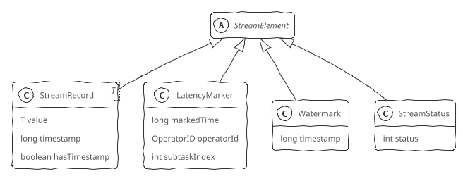

</div>

数据流元素（StreamElement）有以下4种^[Barrier不属于StreamElement，Flink单独处理]，在执行层面上都被序列化成二进制数据，形成混合的数据流，在算子中将混合数据流中的数据流元素反序列化出来，根据其类型分别进行处理。

+ **数据记录（StreamRecord）**：表示数据流中的一条记录（或一个事件），包括数据值本身和事件时间戳（可选）
+ **延迟标记（LatencyMarker）**：用来近似评估数据从读取到写出之间的延迟^[不包含计算的延迟]，在Source中生成，并向下游发送，绕过业务处理逻辑，在Sink节点中使用LatencyMarker估计数据在整个DAG图中流转花费的时间，用来近似评估总体上的处理延迟，包括在数据源算子中周期性创建的时间戳、算子编号、数据源算子所在的Task编号
+ **水印（Watermark）**：是一个时间戳，用来告诉算子所有时间早于等于Watermark的记录（或事件）都已到达，不会再有比Watermark更早的记录，算子可以根据Watermark触发窗口的计算、清理资源等
+ **流状态标记（StreamStatus）**：表示两种流状态空闲状态（IDLE）和活动状态（ACTIVE），在Source中生成，并向下游发送，用来通知Task是否会继续接收到上游的记录或者Watermark

### 数据转换（Transformation）

<div class='wrapper' markdown='block'>

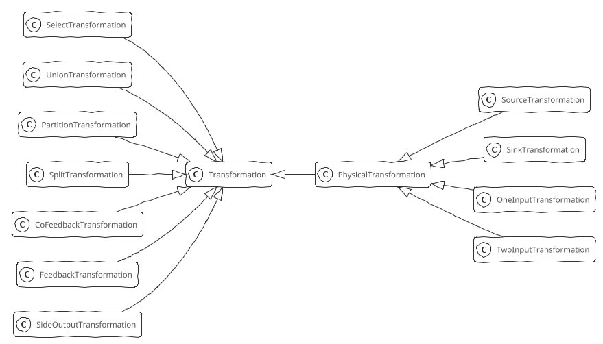

</div>

Transformation是衔接DataStream API和Flink内核的逻辑结构，调用DataStream API的数据处理流水线最终会转换为Transformation流水线。

Transformation有两大类：物理Transformation和虚拟Transformation。在运行时，DataStream API的调用都会被转换成Transformation，然后物理Transformation被转换为实际运行的算子，而虚拟Transformation则不会转换为具体的算子。

Transformation包含了Flink运行时的一些关键参数：
+ name: transformation名称，用于可视化
+ uid: 由用户指定，主要用于在作业重启时再次分配跟之前相同的uid，可以持久保存状态
+ bufferTimeout: buffer超时时间
+ parallelism: 并行度
+ id: 基于静态累加器生成
+ outputType: 输出类型，用来序列化数据
+ slotSharingGroup: Slot共享组

物理Transformation：
+ SourceTransformation: 用于从数据源读取数据，是Flink作业的起点，只有下游Transformation，没有上游Transformation。一个作业可以有多个SourceTransformation，从多个数据源读取数据
+ SinkTransformation: 用于将数据写到外部存储，是Flink作业的终点，只有上游Transformation，没有下游Transformation。一个作业可以有多个SinkTransformation，将数据写入不同的外部存储
+ OneInputTransformation: 单流输入Transformation，只接收一个输入流
+ TwoInputTransformation: 双流输入的Transformation，接收两种流（第1输入和第2输入）

虚拟Transformation：
+ SideOutputTransformation: 用于旁路输出，表示上游Transformation的一个分流，一个Transformation可以有多个分流，每个分流通过OUtputTag进行标识
+ SplitTransformation / SelectTransformation: SplitTransformation按条件将一个流拆分成多个流（只是逻辑上的拆分，只影响上游的流如何跟下游的流连接），SelectTransformation用来在下游选择数据流
+ PartitionTransformation: 用于改变输入元素的分区，需要接收一个StreamPartitioner对象进行分区
+ UnionTransformation: 用于将合并多个元素数据结构安全相同的输入流
+ FeedbackTransformation / CoFeedbackTransformation: 把符合条件的数据重新发回上游Transformation处理

### 算子（StreamOperator）

Flink作业运行时由Task组成一个Dataflow，每个Task中包含一个或者多个StreamOperator，一个StreamOperator就是一个计算步骤，具体的计算由StreamOperator中包装的Function来执行。

所有StreamOperator都包含生命周期管理、状态与容错管理、数据处理3个方面的关键行为，StreamOperator中还定义了OperatorChain策略用于算子融合优化。

StreamTask作为StreamOperator的容器，负责管理StreamOperator的生命周期，StreamOperator生命周期核心阶段如下：
1. setup: 初始化环境、时间服务、注册监控等
2. open: 由各个具体的StreamOperator负责实现，包含了StreamOperator的初始化逻辑（如状态初始化等），执行该方法后才会执行Function进行数据的处理
3. close: 所有的数据处理完毕之后关闭StreamOperator，此时需要确保将所有的缓存数据向下游发送
4. dispose: StreamOperator生命周期的最后阶段，此时StreamOperator已经关闭，停止处理数据，进行资源的释放

StreamOperator负责状态管理，触发检查点时保存状态快照并且将快照异步保存到外部的分布式存储，当作业失败时负责从保存的快照中恢复状态。

StreamOperator对数据的处理，包括数据记录的处理（`processElement()`）、Watermark的处理（`processWatermark()`）、LatencyMarker的处理（`processLatencyMarker()`）。

**异步算子**用于解决与外部系统交互时网络延迟所导致的系统瓶颈问题。Async I/O的实现原理是连续地向数据库发送多个请求，回复先返回的请求先处理，从而使连续地请求之间不需要阻塞等待。对于后调用的请求先返回的情况，Flink在异步算子中提供了两种输出模式：
+ 顺序输出模式：先收到的数据元素先输出，后续数据元素的异步函数调用无论是否先完成，都需要等待。可以保证消息不乱序，但是可能增加延迟，降低算子的吞吐量。原理为数据进入算子，对每一条数据元素调用异步函数，并封装为ResultFuture放入到排队队列中（如果是Watermark，也会放入到队列中），输出时，严格按照队列中的顺序输出给下游
+ 无序输出模式：先处理完的数据元素先输出。延迟低、吞吐量高，但是不保证消息顺序。原理为数据进入算子，对每一条数据元素调用异步函数，并封装为ResultFuture放入到等待完成队列中（如果是Watermark，也会放入到队列中），当异步函数返回结果时，放入已完成队列，按照顺序输出给下游。无序输出模式并不是完全无序，仍然要保持Watermark不能超越其前面数据元素的原则。等待完成队列中将按照Watermark切分成组，组内可以无序输出，组之间必须严格保证顺序。

异步算子同时也支持对异步函数调用的超时处理，支持完整的容错特性。

### Function

<div class='wrapper' markdown='block'>

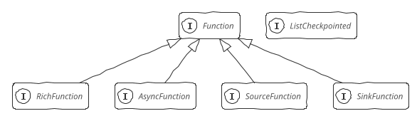

</div>

在Flink中，数据处理的业务逻辑位于Function的`processElement()`方法中，算子调用Function处理数据完毕之后，通过Collector接口将数据交给下一个算子。

按照输入和输出的不同特点分类，Flink中Function大概分为3类：
+ SourceFunction: 从外部存储读取数据，无上游
+ SinkFunction: 将数据写入外部存储，无下游
+ 一般Function: 用在作业的中间处理步骤中，有上游，也有下游。进一步可分为单流输入和双流输入两种，多流输入可以通过多个双流输入串联而成

**无状态函数** 用来做无状态计算（如MapFunction），一般都是直接继承接口或通过匿名类实现接口

**富函数（RichFunction）** 提供生命周期管理、访问RuntimeContext的能力，`open()`^[Function启动时执行初始化]和`close()`^[Function停止时执行清理，释放占用的资源]方法来管理Function生命周期，`getRuntimeContext()`和`setRuntimeContext()`方法来访问RuntimeContext，进而能够获取到执行时作业级别的参数信息，操作状态

**处理函数** 可以访问流应用程序所有非循环基本构建块，事件、状态和定时器。分为ProcessFunction、CoProcessFunction、KeyedProcessFunction、KeyedCoProcessFunction，Keyed类处理函数只能用在KeyedStream上，Co类处理函数是双流输入

**广播函数** 用于广播状态模式^[将一个数据流的内容广播到另一个流中]，分为BroadcastProcessFunction和KeyedBroadcastProcessFunction，有两个数据元素处理方法，`processElement()`负责处理一般的数据流，`processBroadcastElement()`负责处理广播数据流。`processElement()`方法只能使用只读的上下文，`processBroadcastElement()`方法可以使用支持读写的上下文

**异步函数（AsyncFunction）** 是对Java异步编程框架的封装，异步函数抽象类`RichAsyncFunction`实现AsyncFunction接口，继承AbstractRichFunction获得了生命周期管理和RuntimeContext的访问能力。AsyncFunction接口定义了两种行为，异步调用行为（`asyncInvoke()`）将调用结果封装到ResultFuture中，调用超时行为（`timeout()`）防止不释放资源

**数据源函数（SourceFunction）** 提供从外部存储读取数据的能力，有几个关键行为：生命周期管理、读取数据、数据发送、生成Watermark并向下游发送、空闲标记^[如果读取不到数据，则将该Task标记为空闲，向下游发送Status#Idle，阻止Watermark向下游传递]。数据发送、生成Watermark并向下游发送、空闲标记都定义在SourceContext中，SourceContext按照带不带时间分为NonTimestampContext和WatermarkContext。NonTimestampContext为所有元素赋予-1作为时间戳，即永远不会向下游发送Watermark，在实际处理中，各个计算节点会根据本地时间定义触发器，触发执行窗口计算，而不是根据Watermark来触发。WatermarkContext定义了与Watermark相关的行为，负责管理当前的StreamStatus，确保StreamStatus向下游传递，负责空闲检测逻辑，当超过设定的事件间隔而没有收到数据或者Watermark时认为Task处于空闲状态

**输出函数（SinkFunction）** 定义了数据写出到外部存储的行为。`TwoPhaseCommitSinkFunction`是Flink中实现端到端Extractly-Once的关键函数，提供框架级别的端到端Extractly-Once的支持

**检查点函数** 提供函数级别状态管理能力，在检查点函数接口（`ListCheckpointed`）中主要设计了状态快照的备份和恢复两种行为，`snapshotStat()`用于备份保存状态到外部存储，`restoreState()`负责初始化状态，执行从上一个检查点恢复状态的逻辑，还提供了状态重分布的支持

#### 使用CoProcessFunction实现双流Join

即时双流join：
1. 创建1个State对象
2. 接收到输入流1的事件后更新State
3. 接收到输入流2的事件后遍历State，根据Join条件进行匹配，将匹配后的结果发送到下游

延迟双流join：在流式数据里，数据可能是乱序的，数据会延迟到达，并且为了提供处理效率，使用小批量计算模式，而不是每个事件触发一次Join计算
1. 创建2个State对象，分别缓存输入流1和输入流2的事件
2. 创建1个定时器，等待数据的到达，定时延迟触发Join计算
3. 接收到输入流1的事件后更新State
4. 接收到输入流2的事件后更新State
5. 定时器遍历State1和State2，根据Join条件进行匹配，将匹配后的结果发送到下游

#### 延迟计算

窗口计算是典型的延迟计算(窗口暂存数据，Watermark触发窗口的计算)。触发器在StreamOperator层面上提供支持，所有支持延迟计算的StreamOperator都继承了Triggerable接口。Triggerable接口主要定义了基于事件时间和基于处理时间的两种触发行为（`onEventTime()`和`onProcessingTime()`）。

```bob-svg
                                   Triggerable SteamOperator
               .----------------------------------------------------------------.
               |                             .-------------------------------.  |
               |                             |  InternalTimeServiceManager   |  |
  InputStream  |  .------------------.       |     .------------------.      |  |
---------------+->| processWatermark |-------+---->| advanceWatermark |      |  |
               |  '------------------'       |     '--------+---------'      |  |
               |                             |              |                |  |
               |                             |              v                |  |
               |                             |  .-----------+--------------. |  |
               |            +----------------+--|triggerTarget.onEventTime | |  |
               |            |                |  '--------------------------' |  |
               |            |                '-------------------------------'  |
               |            |                                                   |
               |            |                      .-----------------.          |
               |            v                      | ProcessFunction |          |
               |      .-----+-----.                |    .---------.  |          | OutputStream
               |      |onEventTime|----------------+--->| onTimer |--+----------+-------------->
               |      '-----------'                |    '---------'  |          |
               |                                   '-----------------'          |
               '----------------------------------------------------------------'
```

### 数据分区（Partition）

对于分布式计算引擎，需要将数据切分，交给位于不同物理节点上的Task计算。StreamPartitioner是Flink中的数据流分区抽象接口，决定了在实际运行中的数据流分发模式。所有数据分区器都实现了ChannelSeletor接口，该接口中定义了负载均衡选择行为。

```Java
/**
 * 每一个分区器都知道下游通道数量，通道数量在一次作业运行中是固定的，除非修改作业并行度，否则该值是不会改变的
 */
public interface ChannelSelector<T extends IOReadableWritable> {
    // 下游channel的数量
    void setup(int numberOfChannels);
    // 选路方法
    int selectChannel(T record);
    // 是否向下游广播
    boolean isBroadcast();
}
```

StreamPartitioner有以下几种实现：
+ ForwardPartitioner: 用于在同一个OperatorChain中上下游算子之间的数据转发，实际上数据是直接传递给下游的
+ ShufflePartitioner: 以随机方式将元素进行分区，可以确保下游的Task能够均匀地获取数据，通过`DataStream#shuffle()`方法使用ShufflePartitioner
+ RebalancePartitioner: 以Round-robin方式将元素进行分区，可以确保下游的Task可以均匀地获得数据，避免数据倾斜，通过`DataStream#rebalance()`方法使用RebalancePartitioner
+ RescalingPartitioner: 根据上下游Task数量先对上下游分区进行划分，然后以Round-robin方式将元素分给下游对应的分区（而非所有分区），通过`DataStream#rescale()`方法使用RescalingPartitioner
+ BroadcastPartitioner: 将元素广播给所有分区，通过`DataStream#broadcast()`方法使用BroadcastPartitioner
+ KeyGroupStreamPartitioner: 根据KeyGroup索引编号进行分区，不是提供给用户用的，KeyedStream在构造Transformation时默认使用KeyedGroup分区形式
+ CustomPartitionerWrapper: 使用用户自定义分区函数，为每一个元素选择目标分区

### 连接器（Connector）

连接器基于SourceFunction和SinkFunction提供了从外部存储读取/写入数据的能力，Flink在Flink-connectors模块中提供了内置的连接器，包含常见的数据源，如HDFS、Kafka、HBase等。

#### Kafka连接器实现

Kafka连接器使用SinkFunction向Kafka集群的Topic写入数据，SinkFunction中使用了Kafka的Producer，使用SourceFunction从Kafka集群读取数据，SourceFunction的实现中使用了KafkaConsumerProducer。

## 状态（State）

对于流计算而言，事件持续不断地产生，如果每次计算都是相互独立的，不依赖于上下游的事件，则是无状态计算，如果计算需要依赖于之前或者后续的事件，则是有状态计算。在Flink中，状态用来保存中间计算结果或者缓存数据，另外还为为有状态计算提供容错和故障恢复。

按照数据结构的不同，Flink中定义了多种状态，应用于不同的场景：
+ `ValueState<T>`：单值状态，使用`update()`方法更新状态值，使用`value()`方法获取状态值
+ `ListState<T>`：列表状态，使用`add()` / `addAll()`方法添加元素，使用`get()`方法返回一个`Iterable<T>`来遍历状态值，使用`update()`覆盖当前列表
+ `MapState<K, V>`：Map状态，使用`put()` / `putAll()`方法添加键值对，使用`get()`方法获取元素，使用`entries()`、`keys()`、`values()`方法获取map、键、值的可迭代视图
+ `ReducingState<T>` / `AggregatingState<IN, OUT>` / `FoldingState<T, ACC>` ^[ReducingState聚合类型和添加的元素类型必须相同，而AggregatingState、FoldingState聚合类型和添加的元素类型可以不同]：聚合状态（表示添加到状态的所有值的聚合），使用`update()`方法添加元素（会使用提供的ReduceFunction / AggregateFunction / FoldFunction进行聚合），使用`get()`方法获取状态值

状态描述（StateDescriptor）用于描述状态信息（状态名称、类型信息、序列化/反序列化器、过期时间等），每一类State都有对应的StateDescriptor。运行时，在RichFunction和ProcessFunction中，通过RuntimeContext对象，使用StateDesctiptor从状态后端（StateBackend）中获取实际的状态实例。

状态按照是否有Key分为KeyedState和OperatorState两种。KeyedState只能在keyed数据流中使用，是元素级的，跟特定的Key绑定，即keyed数据流上的每一个Key对应一个State对象，可以使用所有类型的状态。OperatorState在keyed数据流和non-keyed数据流中都能使用，是算子级的，跟算子的一个实例绑定，即整个算子只对应一个State对象，只支持ListState。OperatorState作用主要在于容错和重划分，OperatorState的分发模式（even-split、union和broadcast）决定了算子在容错和重划分时的状态分配。event-split和union分发模式使用ListState实现，broadcast分发模式在BroadcastConnectedStream中使用BroadcastState模式实现，在数据流中直接将元素发送到下游所有partition中。

按照由Flink管理还是用户自行管理，状态分为原始状态（Raw State）和托管状态（Managed State）。原始状态是用户自定义的状态，Flink做快照时把整个状态当作一个整体，需要用户自己管理，使用byte数组读写状态内容。托管状态是由Flink框架管理的状态，其序列化和反序列化由FLink框架提供支持，用户无感知。

广播状态（BroadcastState）在广播状态模式中使用，必须是MapState。广播状态模式是指来自一个流的数据需要被广播到所有下游任务，在算子本地存储，在处理另一个流的时候依赖于广播的数据，广播状态模式需要使用广播函数进行处理^[广播函数提供了处理广播数据流和普通数据流的接口]。

状态管理需要考虑以下几点：
+ 状态数据的存储和访问：在任务内部，如何高效地保存状态数据和使用状态数据
+ 状态数据的备份和恢复：如何高效地将状态数据保存下来，避免状态备份降低集群地吞吐量，并且在Failover的时候恢复作业到失败前的状态
+ 状态数据的划分和动态扩容：如何对状态数据进行切分，在作业修改并行度导致任务数量改变的时候确保正确地恢复到任务
+ 状态数据的清理：如何及时清理过期的状态

### 状态数据的存储和访问

Flink中使用状态有两种典型场景：
+ 状态操作接口：使用状态对象本身存储、写入、更新数据，分为面向应用开发者的状态接口和内部状态接口（Flink框架使用）。面向开发者的状态接口只提供了对状态中数据的添加、更新、删除等基本的操作接口。内部状态接口除了对状态中数据的访问之外还提供了内部的运行时信息接口，如状态中数据的序列化器、命名空间、命名空间序列化器、命名空间合并的接口
+ 状态访问接口：从状态后端获取状态本身。Flink抽象了OperatorStateStore和KeyedStateStore两个状态访问接口，屏蔽状态后端。OperatorStateStore中使用内存以Map形式来保存数据，KeyedStateStore中使用RocksDBStateBackend或者HeapKeyedStateBackend来保存数据，获取/创建状态都交给了具体的状态后端处理

状态后端（StateBackend）用于存储状态，需具备在计算过程中提供访问状态的能力、将状态持久化到外部存储的容错能力。Flink内置了3种状态后端：
+ MemoryStateBackend（内存型状态后端）：纯内存，适用于验证、测试。运行时所需要的状态数据保存在TaskManager JVM堆上内存中，键值类型的状态、窗口算子的状态使用HashTable来保存数据、触发器等，执行检查点时，会把状态的快照数据保存到JobManager进程的内存中
+ FsStateBackend（文件型状态后端）：内存+文件，适用于长周期大规模的数据。运行时所需要的状态数据保存在TaskManager JVM堆上内存中，执行检查点时，会把状态的快照数据保存到配置的文件系统中（分布式文件系统或本地文件系统）
+ RocksDBStateBackend：RocksDB，适用于长周期大规模的数据。使用嵌入式的本地数据库RocksDB将流计算数据状态存储在本地磁盘中，执行检查点时，再将整个RocksDB中保存的状态数据全量或者增量持久化到配置的文件系统中，在JobManager内存中会存储少量的检查点数据。相比基于内存的状态后端，访问状态的成本高很多，可能导致数据流的吞吐量剧烈下降

MemoryStateBackend和FsStateBackend依赖于HeapKeyStateBackend，HeapKeyStateBackend使用StateTable存储数据，StateTable有NestedMapsStateTable和CopyOnWriteStateTable两个子类，NestedMapStateTabel使用两层嵌套的HashMap保存状态数据，支持同步快照。CopyOnWriteStateTable使用CopyOnWriteStateMap来保存数据，支持异步快照。

### 状态数据的备份和恢复

**全量持久化策略** 每次把全量的状态写入状态存储中，HeapKeyedStateBackend对应HeapSnapshotStrategy策略，RocksDBStateBackend对应RocksFullSnapshotStrategy策略。在执行持久化策略时，使用异步机制，每个算子独立启动1个独立的线程，将自身的状态写入分布式可靠存储中，在做持久化的过程中，状态可能会被持续修改，基于内存的状态后端使用CopyOnWriteStateTable来保证线程安全，RocksDBStateBackend则使用RocksDB的快照机制，使用快照来保证线程安全

**增量持久化策略** 每次持久化增量的状态，只有RocksDBStateBackend支持增量持久化。RocksDB是一个基于LSM-Tree的键值存储，新的数据保存在内存中，成为memtable，一旦memtable写满了，RocksDB就会将数据压缩并写入到磁盘，memtable的数据持久化到磁盘后就变成了不可变的sstable。RocksDB会在后台合并sstable并删除其中重复的数据，然后在RocksDB删除原来的sstable，替换成新合成的sstable，新的sstable包含了被删除的sstable中的信息，通过合并，历史sstable会合并成一个新的sstable，并删除这些历史sstable，可以减少检查点的历史文件，避免大量小文件的产生。因为sstable是不可变的，Flink对比前一个检查点创建和删除的RocksDB sstable文件就可以计算出状态有哪些改变。为了确保sstable是不可变的，Flink会在RocksDB上触发刷新操作，强制将memtable刷新到磁盘上，在Flink执行检查点时，会将新sstable持久化到存储中，同时保留引用。

### 状态数据的划分和动态扩容

OpeartorState重分布：
+ ListState：并行度发生改变时，会将每个List都取出，然后把这些List合并到一个新的List，根据元素的个数均匀分配给新的Task
+ UnionListState：并行度发生改变时，会将原来的List合并，但不做划分，直接交给用户
+ BroadcastState：并行度发生改变时，直接把Broadcast数据分发到新的Task即可

KeyedState重分布：基于Key-Group，每个Key隶属于唯一的Key-Group，Key-Group分配给Task实例，每个Task至少有1个Key-Group，Key-Group数量等于最大并行度。KeyGroup分配算法：
```
假设KeyGroup的数量为numberOfKeyGroups
hash = hash(key)
KeyGroup = hash % numberOfKeyGroups   // key所属的KeyGroup是确定的
subtask = KeyGroup / (numberOfKeyGroups / parallelism)
```

### 状态数据的清理

DataStream作业中可以通过StateDescriptor的`enableTimeToLive(stateTtlConfig)`方法对状态过期进行精细控制，对每一个状态设置清理的策略，StateTtlConfig中可以设置的内容如下：
+ 过期时间：超过多长时间未访问，视为状态过期
+ 过期时间更新策略：创建和写时更新、读取和写时更新
+ 状态可见性：未清理可用，超期则不可用

Flink SQL是高层抽象，没有状态概念，可以通过Flink Table API和SQL的参数配置选项设置状态清理策略（StreamQueryConfig的withIdleStateRetentionTime()）^[定时清理状态存在可能因为状态被清理而导致计算结果不完全准确的风险，过期时间一般为1.5天左右]。

默认情况下，只有在明确读出过期值时才会删除过期值。使用StateTtlConfig的`cleanupFullSnapshot()`设置完整快照时清理状态，在获取完整状态快照时激活清理，减少其大小（在当前实现下不清除本地状态，但在从上一个快照恢复的情况下，不会包括已删除的过期状态）。使用StateTtlConfig的`cleanupIncrementally()`设置增量清理状态，当进行状态访问或者清理数据时，在回调函数中进行处理，当每次增量清理触发时，遍历状态后端中的状态，清理掉过期的。

### 状态实现

#### KeyedState

**状态初始化** 初始化过程位于AbstractStreamOperator的initializeState()方法中。StreamOperatorStateHandler在构造时，会初始化OperatorState状态后端（OperatorStateBackend）、KeyedState状态后端（KeyedStateBackend）和KeyedState状态存储（KeyedStateStore）。状态后端（KeyedStateBackend）是实际状态存储的位置，状态存储（KeyedStateStore，被注册到RuntimeContext中）负责创建和获取状态（KeyedStateStore的getXxxState()类方法），OperatorStateBackend继承了OperatorStateStore，包含了OperatorStateSotre的功能。

<details> <summary>具体实现</summary>

```Java
abstract class AbstractStreamOperatorV2<OUT> implements StreamOperator<OUT>, CheckpointedStreamOperator
{
    StreamOperatorStateHandler stateHandler;
    InternalTimeServiceManager<?> timeServiceManager;

    // 初始化OperatorState状态后端、KeyedState状态后端、KeyedState状态存储
    void initializeState(StreamTaskStateInitializer streamTaskStateManager)
    {
        TypeSerializer<?> keySerializer = config.getStateKeySerializer(getUserCodeClassloader());

        StreamOperatorStateContext context =
            streamTaskStateManager.streamOperatorStateContext(
                getOperatorID(),
                getClass().getSimpleName(),
                getProcessingTimeService(),
                this,
                keySerializer,
                cancelables,
                metrics,
                config.getManagedMemoryFractionOperatorUseCaseOfSlot(
                    ManagedMemoryUseCase.STATE_BACKEND,
                    runtimeContext.getTaskManagerRuntimeInfo().getConfiguration(),
                    runtimeContext.getUserCodeClassLoader()),
            isUsingCustomRawKeyedState());

        stateHandler = new StreamOperatorStateHandler(context, getExecutionConfig(), cancelables);
        timeServiceManager = context.internalTimerServiceManager();
        // 初始化OperatorStateBackend
        stateHandler.initializeOperatorState(this);
    }

}

class StreamOperatorStateHandler
{
    // 对于non-keyed数据流，keyedStateBackend为null
    CheckpointableKeyedStateBackend<?> keyedStateBackend;
    DefaultKeyedStateStore keyedStateStore;
    OperatorStateBackend operatorStateBackend;
    StreamOperatorStateContext context;

    // StreamOperatorStateHandler在构造时会初始化OperatorState状态后端、KeyedState状态后端、KeyedState状态存储
    StreamOperatorStateHandler(
        StreamOperatorStateContext context,
        ExecutionConfig executionConfig,
        CloseableRegistry closeableRegistry)
    {
        // 
        this.context = context;
        operatorStateBackend = context.operatorStateBackend();
        keyedStateBackend = context.keyedStateBackend();
        this.closeableRegistry = closeableRegistry;

        // 对于non-keyed数据流，keyedStateBackend、keyedStateStore都是null
        if (keyedStateBackend != null) {
            keyedStateStore = new DefaultKeyedStateStore(keyedStateBackend, executionConfig);
        } else {
            keyedStateStore = null;
        }
    }

    void initializeOperatorState(CheckpointedStreamOperator streamOperator)
    {
        CloseableIterable<KeyGroupStatePartitionStreamProvider> keyedStateInputs = context.rawKeyedStateInputs();
        CloseableIterable<StatePartitionStreamProvider> operatorStateInputs = context.rawOperatorStateInputs();

        OptionalLong checkpointId = context.getRestoredCheckpointId();
        StateInitializationContext initializationContext =
            new StateInitializationContextImpl(
                checkpointId.isPresent() ? checkpointId.getAsLong() : null,
                operatorStateBackend, // access to operator state backend
                keyedStateStore, // access to keyed state backend
                keyedStateInputs, // access to keyed state stream
                operatorStateInputs); // access to operator state stream

        // 调用自定义状态处理钩子
        // initializeState()方法默认不进行任何操作，由于算子状态直接影响到checkpoint和rebalance、rescale的重划分，不同算子对算子状态的要求也不尽相同，对算子状态使用有需求的功能算子自行实现该方法
        streamOperator.initializeState(initializationContext);
        closeFromRegistry(operatorStateInputs, closeableRegistry);
        closeFromRegistry(keyedStateInputs, closeableRegistry);
    }
}
```

</details>

**获取/创建状态** 要在Function中使用状态，需要实现RichFunction接口。RichFunction接口提供了获取运行时上下文的方法getRuntimeContext()。RichMapFunction等类名带有Rich的UDF都是RichFunction接口的实现（ProcessFunction类和KeyedProcessFunction类也是RichFunction实现），这些UDF可以通过getRuntimeContext()方法（继承自AbstractRichFunction）获取运行时上下文StreamRuntimeContext，然后从中获取任意一种类型的状态。在AbstractKeyedStateBackend的getPartitionedState()方法中做了大量的缓存工作，首先查询上一次获取状态时的返回值lastState，然后查询缓存keyValueStatesByName（一个\<name, state\>键值对）中所有获取过的状态。当两个缓存中都没有查询到所需的状态，则调用getOrCreateKeyedState()方法创建一个新的状态。注意，调用AbstractKeyedStateBackend的getpartitionedState()方法中传入的参数为VoidNamespace.INSTANCE、VoidNamespaceSerializer.INSTANCE和stateDescriptor，这意味着KeyedState是没有namespace的^[windowState的namespace标识了窗口]。

<div class="wrapper" block="markdown">

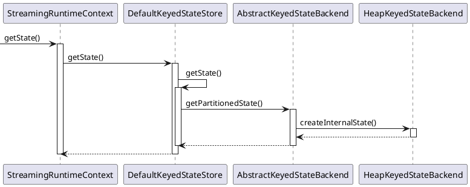

</div>

<details> <summary>具体实现</summary>

```Java
abstract class AbstractKeyedStateBackend<K>
implements CheckpointableKeyedStateBackend<K>,
           InternalCheckpointListener,
           TestableKeyedStateBackend<K>,
           InternalKeyContext<K>
{
    HashMap<String, InternalKvState<K, ?, ?>> keyValueStatesByName;
    String lastName;
    InternalKvState lastState;

    // getPartitionedState()方法中做了大量的缓存工作
    <N, S extends State> S getPartitionedState(
        N namespace,
        TypeSerializer<N> namespaceSerializer,
        StateDescriptor<S, ?> stateDescriptor)
    {

        // 首先查询上一次获取状态时的返回值lastState
        if (lastName != null && lastName.equals(stateDescriptor.getName())) {
            lastState.setCurrentNamespace(namespace);
            return (S) lastState;
        }

        // 然后查询历史记录keyValueStatesByName中所有获取过的状态
        InternalKvState<K, ?, ?> previous = keyValueStatesByName.get(stateDescriptor.getName());
        if (previous != null) {
            lastState = previous;
            lastState.setCurrentNamespace(namespace);
            lastName = stateDescriptor.getName();
            return (S) previous;
        }

        // 以上两个缓存中都没有查询到所需的状态时，调用getOrCreateKeyedState()方法创建一个新的状态
        S state = getOrCreateKeyedState(namespaceSerializer, stateDescriptor);
        InternalKvState<K, N, ?> kvState = (InternalKvState<K, N, ?>) state;

        lastName = stateDescriptor.getName();
        lastState = kvState;
        kvState.setCurrentNamespace(namespace);

        return state;
    }
}
```

</details>

getOrCreateKeyedState()方法由于会被StreamOperatorStateHandler直接调用，其内部又做了一次缓存的检查，然后通过TtlStateFactory的createStateAndWrapWithTtlIfEnabled()创建状态，并在创建完成后，将新创建的状态加入到缓存keyValueStatesByName中。参数this对应AbstractKeyedStateBackend的实现类HeapKeyedStateBackend对象，当不启用ttl时，实际创建状态的过程在HeapKeyStateBackend的createInternalState()方法中。

<details> <summary>具体实现</summary>

```Java
abstract class AbstractKeyedStateBackend<K>
implements CheckpointableKeyedStateBackend<K>,
           InternalCheckpointListener,
           TestableKeyedStateBackend<K>,
           InternalKeyContext<K>
{
    HashMap<String, InternalKvState<K, ?, ?>> keyValueStatesByName;

    <N, S extends State, V> S getOrCreateKeyedState(
        TypeSerializer<N> namespaceSerializer,
        StateDescriptor<S, V> stateDescriptor)
    {
        // 缓存检查
        InternalKvState<K, ?, ?> kvState = keyValueStatesByName.get(stateDescriptor.getName());
        if (kvState == null) {
            if (!stateDescriptor.isSerializerInitialized()) {
                stateDescriptor.initializeSerializerUnlessSet(executionConfig);
            }
            // 通过TtlStateFactory的createStateAndWrapWithTtlIfEnabled()方法创建状态
            // 参数this对应的是AbstractKeyedStateBackend的实现类HeapKeyedStateBackend实例
            // 当不启用ttl时，实际创建状态的过程位于HeapKeyedStateBackend的createInternalState()方法
            kvState =
                LatencyTrackingStateFactory.createStateAndWrapWithLatencyTrackingIfEnabled(
                    TtlStateFactory.createStateAndWrapWithTtlIfEnabled(
                        namespaceSerializer, stateDescriptor, this, ttlTimeProvider),
                    stateDescriptor,
                    latencyTrackingStateConfig);
            // 将新创建的状态加入缓存
            keyValueStatesByName.put(stateDescriptor.getName(), kvState);
            publishQueryableStateIfEnabled(stateDescriptor, kvState);
        }
        return (S) kvState;
    }
}
```

</details>

HeapKeyedStateBackend的createInternalState()方法在创建一个新的状态实例前，向状态表中注册一个新的状态（主要用于快照），然后调用StateFactory的createState()方法创建状态。

<details> <summary>具体实现</summary>

```Java
class HeapKeyedStateBackend<K> extends AbstractKeyedStateBackend<K>
{
    <N, SV, SEV, S extends State, IS extends S> IS createInternalState(
        TypeSerializer<N> namespaceSerializer,
        StateDescriptor<S, SV> stateDesc,
        StateSnapshotTransformFactory<SEV> snapshotTransformFactory)
    {
        StateFactory stateFactory = STATE_FACTORIES.get(stateDesc.getType());
        // 向状态表中注册一个新的状态，主要用于快照
        StateTable<K, N, SV> stateTable =
            tryRegisterStateTable(
                namespaceSerializer,
                stateDesc,
                getStateSnapshotTransformFactory(stateDesc, snapshotTransformFactory));
        return stateFactory.createState(stateDesc, stateTable, getKeySerializer());
    }
}
```

</details>

**ttl** TtlState是HeapState的一个装饰器，提供了根据时间使状态过期的功能（目前只支持ProcessingTime）。TtlState实际上是用TtlValue对HeapState保存的值进行了一次装饰，添加了timestamp属性lastAccessTimestamp。lastAccessTimestamp由final修饰，不可变，每次更新ttl时都会创建一个新的TtlValue替换原有的状态值。

<details> <summary>具体实现</summary>

```Java
class TtlValue<T>
{
    T userValue;
    long lastAccessTimestamp;

    TtlValue(T userValue, long lastAccessTimestamp) {
        this.userValue = userValue;
        this.lastAccessTimestamp = lastAccessTimestamp;
    }

    T getUserValue() {
        return userValue;
    }

    long getLastAccessTimestamp() {
        return lastAccessTimestamp;
    }
}
```

</details>

TtlState与HeapState创建过程的分支点位于TtlStateFactory的createStateAndWrapWithTtlIfEnabled处，当设置Ttl时，该方法将返回TtlStateFactory的createState()结果。创建一个TtlState的构造参数是TtlStateContext，TtlStateContext提供了TtlState所需的所有信息：需要装饰的原始HeapState、Ttl配置信息、时间供应器、状态描述的序列化器以及TTL增量清理回调方法。清理回调方法只在获取状态和更新状态前异步执行，对状态的功能而言是透明的。以ValueState为例，TtlValueState由3层结构组成，分别是提供基本TTL功能的AbstractDecorator、提供State基本功能的AbstractTtlState以及提供状态获取/更新功能的TtlValueState。

<details> <summary>具体实现</summary>

```Java
class TtlStateFactory<K, N, SV, TTLSV, S extends State, IS extends S>
{
    IS createState() {
        SupplierWithException<IS, Exception> stateFactory = stateFactories.get(stateDesc.getType());
        // stateFactory的get()方法为对应状态类型的createXxx()方法
        // 如ValueState对应createValueState()方法
        IS state = stateFactory.get();
        if (incrementalCleanup != null) {
            incrementalCleanup.setTtlState((AbstractTtlState<K, N, ?, TTLSV, ?>) state);
        }
        return state;
    }

    IS createValueState() {
        ValueStateDescriptor<TtlValue<SV>> ttlDescriptor =
            stateDesc.getSerializer() instanceof TtlSerializer
                ? (ValueStateDescriptor<TtlValue<SV>>) stateDesc
                : new ValueStateDescriptor<>(stateDesc.getName(), new TtlSerializer<>(LongSerializer.INSTANCE, stateDesc.getSerializer()));
        // 创建一个TtlState的构造参数是TtlStateContext
        return (IS) new TtlValueState<>(createTtlStateContext(ttlDescriptor));
    }

    <OIS extends State, TTLS extends State, V, TTLV> TtlStateContext<OIS, V> createTtlStateContext(StateDescriptor<TTLS, TTLV> ttlDescriptor)
    {
        ttlDescriptor.enableTimeToLive(stateDesc.getTtlConfig());
        OIS originalState = (OIS) stateBackend.createInternalState(
            namespaceSerializer, ttlDescriptor, getSnapshotTransformFactory());
        return new TtlStateContext<>(
            originalState,
            ttlConfig,
            timeProvider,
            (TypeSerializer<V>) stateDesc.getSerializer(),
            registerTtlIncrementalCleanupCallback((InternalKvState<?, ?, ?>) originalState));
    }
}
```

</details>

获取状态最终通过AbstractTtlDecorator的getWrappedWithTtlCheckAndUpdate()方法，只要状态过期，就会执行HeapValueState的clear()方法清楚状态的值，然后根据ttl设置的ReturnExpiredIfNotCleanedUp决定是否要返回过期值。如果设置了OnReadAndWrite的ttl刷新策略，则会使用当前时间戳创建一个新的TtlValue并更新到其装饰的HeapValueState中。

<details> <summary>具体实现</summary>

```Java
abstract class AbstractTtlDecorator<T>
{
    <SE extends Throwable, CE extends Throwable, CLE extends Throwable, V> TtlValue<V> getWrappedWithTtlCheckAndUpdate(
        SupplierWithException<TtlValue<V>, SE> getter,
        ThrowingConsumer<TtlValue<V>, CE> updater,
        ThrowingRunnable<CLE> stateClear)
    {
        TtlValue<V> ttlValue = getter.get();
        if (ttlValue == null) {
            return null;
        } else if (expired(ttlValue)) {
            // 过期时清除状态的值
            stateClear.run();
            // 根据ttl设置的ReturnExpiredIfNotCleanedUp决定是否返回过期值
            if (!returnExpired) {
                return null;
            }
        } else if (updateTsOnRead) {
            // 设置了OnReadAndWrite的ttl刷新策略时，会使用当前时间戳创建一个新的TtlValue并更新到其装饰的HeapValueState中
            updater.accept(rewrapWithNewTs(ttlValue));
        }
        return ttlValue;
    }

    boolean expired(TtlValue<V> ttlValue) {
        return TtlUtils.expired(ttlValue, ttl, timeProvider);
    }

    <V> TtlValue<V> rewrapWithNewTs(TtlValue<V> ttlValue) {
        return wrapWithTs(ttlValue.getUserValue());
    }

    <V> TtlValue<V> wrapWithTs(V value) {
        // new TtlValue<>(value, timeProvider.currentTimestamp());
        return TtlUtils.wrapWithTs(value, timeProvider.currentTimestamp());
    }
}
```

</details>

其他TtlState的处理方式和TtlValueState基本一致。TtlReducingState和TtlAggregatingState是丢弃整个过期的结果；TtlListState是遍历状态中的列表，并将未过期的值重新组成一个新的列表，代替原来的状态列表；TtlMapState直接将过期的\<key,value\>丢弃。

**增量清理** 即通过设置TtlConfig.Builder的cleanupIncrementally()方法增加的后台状态清理功能，其实现位于TtlIncrementalCleanup类中，由TtlStateFactory的registerTtlIncrementalCleanupCallback()构造回调函数，在每次访问状态和更新状态时执行。TtlStateFactory在注册增量清理回调函数时，将stateAccessed()方法注册为清理方法：首先从状态的stateTable中获取至多cleanupSize个状态，然后逐一检查这些状态是否过期，并直接将过期的状态从stateTable中移除。

<details> <summary>具体实现</summary>

```Java
class TtlStateFactory<K, N, SV, TTLSV, S extends State, IS extends S>
{
    Runnable registerTtlIncrementalCleanupCallback(InternalKvState<?, ?, ?> originalState) {
        StateTtlConfig.IncrementalCleanupStrategy config = ttlConfig.getCleanupStrategies().getIncrementalCleanupStrategy();
        boolean cleanupConfigured = config != null && incrementalCleanup != null;
        boolean isCleanupActive = cleanupConfigured && isStateIteratorSupported(originalState, incrementalCleanup.getCleanupSize());
        // 将stateAccessed()方法注册为清理方法
        Runnable callback = isCleanupActive ? incrementalCleanup::stateAccessed : () -> {};
        if (isCleanupActive && config.runCleanupForEveryRecord()) {
            stateBackend.registerKeySelectionListener(stub -> callback.run());
        }
        return callback;
    }
}

class TtlIncrementalCleanup<K, N, S>
{
    StateIncrementalVisitor<K, N, S> stateIterator;

    void stateAccessed() {
        // 从stateTable中获取至多cleanupSize个状态
        initIteratorIfNot();
        // 逐一检查这些状态是否过期，并直接将过期的状态从tateTable中移除
        runCleanup();
    }

    void initIteratorIfNot() {
        if (stateIterator == null || !stateIterator.hasNext()) {
            stateIterator = ttlState.original.getStateIncrementalVisitor(cleanupSize);
        }
    }

    void runCleanup() {
        int entryNum = 0;
        Collection<StateEntry<K, N, S>> nextEntries;
        while (entryNum < cleanupSize
                && stateIterator.hasNext()
                && !(nextEntries = stateIterator.nextEntries()).isEmpty()) {

            for (StateEntry<K, N, S> state : nextEntries) {
                S cleanState = ttlState.getUnexpiredOrNull(state.getState());
                if (cleanState == null) {
                    stateIterator.remove(state);
                } else if (cleanState != state.getState()) {
                    stateIterator.update(state, cleanState);
                }
            }

            entryNum += nextEntries.size();
        }
    }
}
```

</details>

#### OperatorState

**状态初始化** 同KeyedState

**获取/创建状态** 要在Function中使用算子状态，需要实现CheckpointedFunction接口，该接口提供了初始化状态（initializeState()）和快照状态（snapshotState()）两个方法。snapshotState()方法每次进行checkpoint时会先执行；initializeState()方法在每次初始化UDF时会执行，包括算子初始化以及从故障中恢复。可以通过初始化状态方法入参FunctionInitializationContext的getOperatorStateStore()方法获取到算子状态，然后通过DefaultOperatorStateBackend（DefaultOperatorStateBackend目前是OperatorStateStore接口的唯一实现）的getXxxState()方法获取到三种分发模式对应的ListState、UnionState和BroadcastState。

广播分发模式是指在广播流上上游算子以广播方式向下游算子的分区发送数据，BroadcastState状态只能保证所有的分区能够看到广播流中所有的数据，不能保证每个算子中的BroadcastState是一定一致的。如果算子的所有分区在看到广播流中的元素能够做出相同的状态更新，由于Flink底层使用TCP保证了数据顺序不会发生变化，就可以认为每个算子中的BroadcastState是完全一致的，因此需要保证对BroadcastState的更新在每个任务实例中是完全一致的。

BroadcastState对应的实现为HeapBroadcastState，是BroadcastState接口的唯一实现，并增加了将状态写入状态后端的相关实现（BackendWritableBroadcastState接口）。BroadcastState实现基本上是对内部存储backingMap的封装。

<details> <summary>具体实现</summary>

```Java
class HeapBroadcastState<K, V> implements BackendWritableBroadcastState<K, V>
{
    RegisteredBroadcastStateBackendMetaInfo<K, V> stateMetaInfo;
    Map<K, V> backingMap;
    MapSerializer<K, V> internalMapCopySerializer;

    HeapBroadcastState(RegisteredBroadcastStateBackendMetaInfo<K, V> stateMetaInfo)
    {
        this(stateMetaInfo, new HashMap<>());
    }

    HeapBroadcastState(HeapBroadcastState<K, V> toCopy)
    {
        this(toCopy.stateMetaInfo.deepCopy(), toCopy.internalMapCopySerializer.copy(toCopy.backingMap));
    }

    HeapBroadcastState(
        RegisteredBroadcastStateBackendMetaInfo<K, V> stateMetaInfo,
        Map<K, V> internalMap)
    {
        this.stateMetaInfo = stateMetaInfo;
        this.backingMap = internalMap;
        this.internalMapCopySerializer = new MapSerializer<>(stateMetaInfo.getKeySerializer(), stateMetaInfo.getValueSerializer());
    }

    void clear() {
        backingMap.clear();
    }

    long write(FSDataOutputStream out) {
        long partitionOffset = out.getPos();
        DataOutputView dov = new DataOutputViewStreamWrapper(out);
        dov.writeInt(backingMap.size());
        for (Map.Entry<K, V> entry : backingMap.entrySet()) {
            getStateMetaInfo().getKeySerializer().serialize(entry.getKey(), dov);
            getStateMetaInfo().getValueSerializer().serialize(entry.getValue(), dov);
        }
        return partitionOffset;
    }

    V get(K key) {
        return backingMap.get(key);
    }

    void put(K key, V value) {
        backingMap.put(key, value);
    }
}
```
</details>

BroadcastState通过DefaultOperatorStateBackend的getBroadcastState()方法得到，BroadcastState内部是一个HashMap，所以只支持MapStateDescriptor来描述。BroadcastState获取包括三个步骤：

1. 检查缓存accessedBroadcastStatesByName
2. 检查所有已注册的状态registeredBroadcastStates
3. 如果前两步都没有查到对应的状态，则新建一个新的BroadcastState并将其注册到registeredBroadcastStates中

<details> <summary>具体实现</summary>

```Java
class DefaultOperatorStateBackend implements OperatorStateBackend
{
    Map<String, BackendWritableBroadcastState<?, ?>> registeredBroadcastStates;
    Map<String, BackendWritableBroadcastState<?, ?>> accessedBroadcastStatesByName;

    <K, V> BroadcastState<K, V> getBroadcastState(MapStateDescriptor<K, V> stateDescriptor)
    {
        String name = stateDescriptor.getName();

        // 检查缓存accessedBroadcastState
        BackendWritableBroadcastState<K, V> previous = (BackendWritableBroadcastState<K, V>) accessedBroadcastStatesByName.get(name);

        if (previous != null) {
            checkStateNameAndMode(
                previous.getStateMetaInfo().getName(),
                name,
                previous.getStateMetaInfo().getAssignmentMode(),
                OperatorStateHandle.Mode.BROADCAST);
            return previous;
        }

        stateDescriptor.initializeSerializerUnlessSet(getExecutionConfig());
        TypeSerializer<K> broadcastStateKeySerializer = stateDescriptor.getKeySerializer();
        TypeSerializer<V> broadcastStateValueSerializer = stateDescriptor.getValueSerializer();

        // 检查registeredBroadcastState中所有已注册的状态
        BackendWritableBroadcastState<K, V> broadcastState = (BackendWritableBroadcastState<K, V>) registeredBroadcastStates.get(name);

        if (broadcastState == null) {
            // 没有查到对应的状态时，创建一个新的状态并将其注册到registeredBroadcastStates中
            broadcastState = new HeapBroadcastState<>(
                new RegisteredBroadcastStateBackendMetaInfo<>(
                    name,
                    OperatorStateHandle.Mode.BROADCAST,
                    broadcastStateKeySerializer,
                    broadcastStateValueSerializer));
            registeredBroadcastStates.put(name, broadcastState);
        } else {

            checkStateNameAndMode(
                broadcastState.getStateMetaInfo().getName(),
                name,
                broadcastState.getStateMetaInfo().getAssignmentMode(),
                OperatorStateHandle.Mode.BROADCAST);
            ......
        }

        // 返回结果前，将得到的BroadcastState放入缓存中
        accessedBroadcastStatesByName.put(name, broadcastState);
        return broadcastState;
    }
}
```

</details>

BroadcastState只有在广播数据流（BroadcastStream）中才能获取，可以通过DataStream的broadcast(mapStateDescriptor)方法将一个普通数据流转换成广播数据流，注意必须是带MapStateDescriptor参数的broadcast()方法，无参方法仅仅是将DataStream向下游算子发送数据的方式改为broadcast模式。广播数据流在和普通数据流连接后得到BroadcastConnectedStream，对应CoBroadcastWithKeyedOperator（连接Keyed数据流）和CoBroadcastWithNonKeyedOperator（连接non-keyed数据流）两种算子。Broadcast算子给广播数据流处理方法提供了读写上下文（rwContext），可以根据广播流获取和更新BroadcastState的内容；给一般数据流处理方法提供了只读上下文，只能获取BroadcastState状态的内容（keyed数据流中可以正常获取和更新keyed状态）。根据Broadcast算子的open()方法，在启动或恢复Broadcast算子时会从OperatorState状态后端中获取DataStream.broadcast(mapStateDescriptor)中定义的状态并加载到自身的类变量中，在算子使用过程中只能访问这些定义过的状态。

<details> <summary>具体实现</summary>

```Java
class DataStream<T>
{
    BroadcastStream<T> broadcast(MapStateDescriptor<?, ?>... broadcastStateDescriptors)
    {
        DataStream<T> broadcastStream = setConnectionType(new BroadcastPartitioner<>());
        return new BroadcastStream<>(environment, broadcastStream, broadcastStateDescriptors);
    }

    <R> BroadcastConnectedStream<T, R> connect(BroadcastStream<R> broadcastStream)
    {
        return new BroadcastConnectedStream<>(
            environment,
            this,
            broadcastStream,
            broadcastStream.getBroadcastStateDescriptors());
    }
}

class BroadcastConnectedStream<IN1, IN2>
{
    <KEY, OUT> SingleOutputStreamOperator<OUT> process(
        KeyedBroadcastProcessFunction<KEY, IN1, IN2, OUT> function,
        TypeInformation<OUT> outTypeInfo)
    {
        return transform(function, outTypeInfo);
    }

    <OUT> SingleOutputStreamOperator<OUT> process(
        BroadcastProcessFunction<IN1, IN2, OUT> function,
        TypeInformation<OUT> outTypeInfo)
    {

        return transform(function, outTypeInfo);
    }

    <KEY, OUT> SingleOutputStreamOperator<OUT> transform(
        KeyedBroadcastProcessFunction<KEY, IN1, IN2, OUT> userFunction,
        TypeInformation<OUT> outTypeInfo)
    {

        nonBroadcastStream.getType();
        broadcastStream.getType();

        KeyedStream<IN1, KEY> keyedInputStream = (KeyedStream<IN1, KEY>) nonBroadcastStream;

        KeyedBroadcastStateTransformation<KEY, IN1, IN2, OUT> transformation =
            new KeyedBroadcastStateTransformation<>(
                "Co-Process-Broadcast-Keyed",
                nonBroadcastStream.getTransformation(),
                broadcastStream.getTransformation(),
                clean(userFunction),
                broadcastStateDescriptors,
                keyedInputStream.getKeyType(),
                keyedInputStream.getKeySelector(),
                outTypeInfo,
                environment.getParallelism());

        SingleOutputStreamOperator<OUT> returnStream = new SingleOutputStreamOperator(environment, transformation);

        getExecutionEnvironment().addOperator(transformation);
        return returnStream;
    }
}
```

</details>

event-split和union分发模式对应的算子状态都是ListState，ListState的实现类是PartitionableListState。PartitionableListState实现基本上是对内部存储ArrayList的封装。

<details> <summary>具体实现</summary>

```Java
class PartitionableListState<S> implements ListState<S>
{
    RegisteredOperatorStateBackendMetaInfo<S> stateMetaInfo;
    ArrayList<S> internalList;
    ArrayListSerializer<S> internalListCopySerializer;

    PartitionableListState(RegisteredOperatorStateBackendMetaInfo<S> stateMetaInfo)
    {
        this(stateMetaInfo, new ArrayList<S>());
    }

    PartitionableListState(PartitionableListState<S> toCopy)
    {
        this(toCopy.stateMetaInfo.deepCopy(),
            toCopy.internalListCopySerializer.copy(toCopy.internalList));
    }

    PartitionableListState(
        RegisteredOperatorStateBackendMetaInfo<S> stateMetaInfo, ArrayList<S> internalList)
    {

        this.stateMetaInfo = stateMetaInfo;
        this.internalList = internalList;
        this.internalListCopySerializer = new ArrayListSerializer<>(stateMetaInfo.getPartitionStateSerializer());
    }

    void clear() {
        internalList.clear();
    }

    void add(S value) {
        internalList.add(value);
    }

    void update(List<S> values) {
        internalList.clear();
        addAll(values);
    }

    long[] write(FSDataOutputStream out)
    {
        long[] partitionOffsets = new long[internalList.size()];

        DataOutputView dov = new DataOutputViewStreamWrapper(out);

        for (int i = 0; i < internalList.size(); ++i) {
            S element = internalList.get(i);
            partitionOffsets[i] = out.getPos();
            getStateMetaInfo().getPartitionStateSerializer().serialize(element, dov);
        }

        return partitionOffsets;
    }
}
```

</details>

ListState通过DefaultOperatorStateBackend的getListstate(listStateDescriptor, mode)方法得到（event-split分发模式对应mode参数为OperatorStateHandle.Mode.SPLIT_DISTRIBUTE，union分发模式对应mode参数为OperatorStateHandle.Mode.UNION）。ListState获取步骤和BroadcastState基本一致：

1. 检查缓存accessedStateByName
2. 检查所有已注册的状态registeredOperatorStates
3. 如果前两步都没有查到对应的状态，则创建一个新的状态并将其注册到registeredOperatorStates中

通过DefaultOperatorStateBackend的getListState(listStateDescriptor)方法可以获取一个event-split分发模式的ListState，在event-split分发模式下，算子的重划分使用round-robin轮询，原先所有event-split分发模式下的ListState会被划分成若干个子列表然后分配到不同的partition中，对应方法为RoundRobinOperaorStateRepartitioner的repartitionSplitState()方法。

通过DefaultOperatorStateBackend的getUnionListState(listStateDescriptor)方法可以获取一个union分发模式的ListState，在union分发模式下，算子的重划分会将算子原先所有union分发模式的ListState全部拼接到一起，然后分配到所有分区中，对应方法为RoundRobinOperatorStateRepartitioner的repartitionUnionState()方法。

<details> <summary>具体实现</summary>

```Java
class DefaultOperatorStateBackend implements OperatorStateBackend
{
    <S> ListState<S> getListState(ListStateDescriptor<S> stateDescriptor)
    {
        return getListState(stateDescriptor, OperatorStateHandle.Mode.SPLIT_DISTRIBUTE);
    }

    <S> ListState<S> getUnionListState(ListStateDescriptor<S> stateDescriptor)
    {
        return getListState(stateDescriptor, OperatorStateHandle.Mode.UNION);
    }

    <S> ListState<S> getListState(
        ListStateDescriptor<S> stateDescriptor, OperatorStateHandle.Mode mode)
    {

        String name = stateDescriptor.getName();

        PartitionableListState<S> previous = (PartitionableListState<S>) accessedStatesByName.get(name);
        if (previous != null) {
            checkStateNameAndMode(
                previous.getStateMetaInfo().getName(),
                name,
                previous.getStateMetaInfo().getAssignmentMode(),
                mode);
            return previous;
        }

        stateDescriptor.initializeSerializerUnlessSet(getExecutionConfig());
        TypeSerializer<S> partitionStateSerializer = stateDescriptor.getElementSerializer();

        PartitionableListState<S> partitionableListState = (PartitionableListState<S>) registeredOperatorStates.get(name);

        if (null == partitionableListState) {

            partitionableListState = new PartitionableListState<>(
                new RegisteredOperatorStateBackendMetaInfo<>(name, partitionStateSerializer, mode));

            registeredOperatorStates.put(name, partitionableListState);
        } else {
            ......
        }

        accessedStatesByName.put(name, partitionableListState);
        return partitionableListState;
    }
}
```

</details>

## 窗口

窗口（windowing）是指将stream切分成有界的数据块，然后对各个数据块进行处理。窗口实现为Window（具体实现有TimeWindow和GlobalWindow），Window本身不会存储窗口中的元素（其内部可能存储了一些元数据，如TimeWindow中有开始时间start和结束时间end），窗口中的元素实际在状态后端以键值对状态形式存储（键为Window，值为数据集合或聚合值）。

```
// 对于keyed stream，因为每个逻辑上的keyed stream都可以被单独处理，窗口计算可以由多个task并行（属于同一个 key 的元素会被发送到同一个 task）
stream
    .keyBy(...)                                        <-  仅 keyed 窗口需要
    .window(assigner)                                  <-  必填项："assigner"
    [.trigger(...)]                                    <-  可选项："trigger" (省略则使用默认 trigger)
    [.evictor(...)]                                    <-  可选项："evictor" (省略则不使用 evictor)
    [.allowedLateness(...)]                            <-  可选项："lateness" (省略则为 0)
    [.sideOutputLateData(...)]                         <-  可选项："output tag" (省略则不对迟到数据使用 side output)
    .<windowed transformation>(<window function>)      <-  必填项："function"
    [.getSideOutput(...)]                              <-  可选项："output tag"

// 对于non-keyed stream，原始stream不会被分割为多个逻辑上的stream，所以所有的窗口计算会被同一个 task 完成（并行度为1）
stream
    .windowAll(assigner)                              <-  必填项："assigner"
    [.trigger(...)]                                   <-  可选项："trigger" (else default trigger)
    [.evictor(...)]                                   <-  可选项："evictor" (else no evictor)
    [.allowedLateness(...)]                           <-  可选项："lateness" (else zero)
    [.sideOutputLateData(...)]                        <-  可选项："output tag" (else no side output for late data)
    .<windowed transformation>(<window function>)     <-  必填项："function"
    [.getSideOutput(...)]                             <-  可选项："output tag"
```

**window assigner** 实现为WindowAssigner，定义了stream中的元素如何被分发到各个窗口，即负责将stream中的每个数据分发到一个或多个窗口中，在`window()`或`windowAll()`中指定。Flink内置了常用的window assigner，包括滚动窗口（tumbling window）、滑动窗口（sliding window）、会话窗口（session window）和全局窗口（global window）。所有内置的window assigner都是基于时间分发数据的，基于时间的窗口（TimeWindow）用开始时间戳（包含）和结束时间戳（不包含）描述窗口的大小。

+ 滚动窗口：窗口大小固定，且各自之间不重叠，其assigner（TumblingProcessingTimeWindows、TumblingEventTimeWindows）分发元素到指定大小的窗口
+ 滑动窗口^[滚动窗口是一种特殊的滑动窗口]：窗口大小固定，各自之间可以重叠，window size指定窗口大小，window slide指定滑动距离（控制新窗口生成速率），其assigner（SlidingProcessingTimeWindows、SlidingEventTimeWindows）分发元素到指定大小的窗口
+ 会话窗口：窗口大小不固定（没有固定的开始或结束时间），在一段时间没有收到数据（即在一段不活跃的间隔）之后会关闭，并将接下来的数据分发到新的会话窗口，各自之间不重叠，session gap指定固定的会话间隔，session gap extractor指定动态的会话间隔，其assigner（ProcessingTimeSessionWindows、EventTimeSessionWindows、DynamicProcessingTimeSessionWindows、DynamicEventTimeSessionWindows）把数据按活跃的会话分组
+ 全局窗口：其assigner（GlobalWindows）将拥有相同 key 的所有数据分发到一个全局窗口，仅在指定了自定义trigger时有用，否则，计算不会发生，因为全局窗口没有天然的终点去触发其中积累的数据

会话窗口不同于滚动窗口和滑动窗口，它的切分依赖于事件的行为，而不是时间序列，在很多情况下会因为事件乱序使得原本相互独立的窗口因为新事件的到来导致窗口重叠，而必须进行窗口的合并。窗口的合并涉及3个要素：
+ 窗口对象的合并和清理：对于会话窗口，为每个事件分配一个SessionWindow，然后判断窗口是否需要与已有的窗口进行合并，窗口合并时按照窗口的起始时间进行排序，然后判断窗口之间是否存在时间重叠，重叠的窗口进行合并，将后序窗口合并到前序窗口中
+ 窗口状态的合并和清理：窗口合并的同时，窗口对应的状态也需要进行合并，默认复用最早的窗口的状态，将其他待合并窗口的状态合并到最早窗口的状态中
+ 窗口触发器的合并和清理：`Trigger#onMerge()`方法用于对触发器进行合并，触发器的合并实际上是删除合并的窗口的触发器，并为新窗口创建新的触发器

<div class="wrapper" markdown='block'>

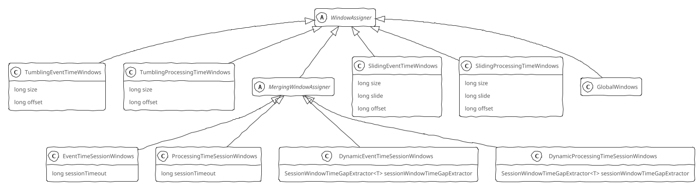

</div>

**window function** 实现为WindowFunction，定义了如何计算每个窗口中的数据，窗口函数有三种ReduceFunction、AggregateFunction和ProcessWindowFunction。ReduceFunction指定两条输入数据如何合并起来产生一条输出数据，输入和输出数据的类型必须相同。AggregateFunction接收输入数据的类型(IN，输入流的元素类型)、累加器的类型（ACC）和输出数据的类型（OUT）。AggregateFunction接口有如下几个方法： 把每一条元素加进累加器、创建初始累加器、合并两个累加器、从累加器中提取输出（OUT 类型）。ReduceFunction和AggregateFunction在每条数据到达窗口后进行增量聚合。ProcessWindowFunction会得到能够遍历当前窗口内所有数据的Iterable以及关于这个窗口的元信息，窗口中的数据无法被增量聚合，需要在窗口触发前缓存所有数据

**trigger** 实现为Trigger，决定了一个窗口何时可以被窗口函数处理。当trigger认定一个窗口可以被计算时，它就会触发，即 返回FIRE或 FIRE_AND_PURGE（这是让窗口算子发送当前窗口计算结果的信号），如果一个窗口指定了ProcessWindowFunction，所有的元素都会传给 ProcessWindowFunction，如果是ReduceFunction或AggregateFunction，则直接发送聚合的结果。FIRE会保留被触发的窗口中的内容，而 FIRE_AND_PURGE会删除这些内容。Trigger接口提供了五个方法来响应不同的事件：
+ `onElement()`方法在每个元素被加入窗口时调用
+ `onEventTime()`方法在注册的事件时间定时器（event-time timer）触发时调用
+ `onProcessingTime()`方法在注册的处理时间定时器（processing-time timer）触发时调用
+ `onMerge()`方法与有状态的trigger相关，该方法会在两个窗口合并时，将窗口对应trigger的状态进行合并
+ `clear()`方法处理在对应窗口被移除时所需的逻辑

其中，`onElement()`、`onEventTime()`、`onProcessingtime()`方法通过返回TriggerResult来决定trigger如何应对到达窗口的事件：CONTINUE（什么也不做）、FIRE（触发计算）、PURGE（清空窗口内的元素）、FIRE_AND_PURGE（触发计算，计算结束后清空窗口内的元素）。

Flink内置了EventTimeTrigger（在watermark越过窗口结束时间后直接触发）、ProcessingTimeTrigger（根据processing timer触发）、CountTrigger（在窗口中的元素超过预设的限制时触发）、PurgingTrigger（接收另一个trigger并将它转换成一个会清理数据的trigger）。其中，EventTimeTrigger是TumblingEventTimeWindows、SlidingEventTimeWindows、EventTimeSessionWindows等window assigner的默认trigger，ProcessingTimeTrigger是TumblingProcessingTimeWindows、SlidingProcessingTimeWindows、ProcessingTimeSessionWindows等window assigner的默认trigger。

```Java
abstract class Trigger<T, W extends Window> {
    abstract TriggerResult onElement(T element, long timestamp, W window, TriggerContext ctx);
    abstract TriggerResult onProcessingTime(long time, W window, TriggerContext ctx);
    abstract TriggerResult onEventTime(long time, W window, TriggerContext ctx);
}
```

**evictor** 实现为Evictor接口，可以在trigger触发后、调用窗口函数之前或之后从窗口中删除元素。Evictor接口提供了两个方法`evictBefore()`、`evictAfter()`实现此功能，`evictBefore()`包含在调用窗口函数前的逻辑，而`evictAfter()`包含在窗口函数调用之后的逻辑，在调用窗口函数之前被移除的元素不会被窗口函数计算。Flink 内置有三个evictor：
+ CountEvictor：计数过滤器，在窗口中保留指定数量的元素，并从窗口头部开始丢弃其余元素
+ DeltaEvictor: 阈值过滤器，接收DeltaFunction和threshold参数，计算最后一个元素与窗口缓存中所有元素的差值，并移除差值大于或等于threshold的元素
+ TimeEvictor: 时间过滤器，接收interval参数，以毫秒表示，它会找到窗口中元素的最大timestamp max_ts并移除比max_ts - interval小的所有元素，即保留Window中最近一段时间内的元素，并丢弃其余元素

**allowed lateness** 定义了一个元素可以在迟到多长时间的情况下不被丢弃（默认值是0），在watermark超过窗口末端、到达窗口末端加上 allowed lateness之前的这段时间内到达的元素，依旧会被加入窗口。取决于窗口的trigger，一个迟到但没有被丢弃的元素可能会再次触发窗口。为了实现这个功能，Flink会将窗口状态保存到allowed lateness超时才会将窗口及其状态删除^[窗口的生命周期：一个窗口在第一个属于它的元素到达时就会被创建，然后在时间超过窗口的“结束时间戳 + 用户定义的 allowed lateness”时 被完全删除]。另外，可以通过旁路输出获取迟到的数据。

```Java
// 基于事件时间的滑动窗口数据元素分配
// SlidingEventTimeWindows.java
public Collection<TimeWindow> assignWindows(Object element, long timestamp, WindowAssignerContext context) {
    if (timestamp > LONG.MIN_VALUE) {
        List<TimeWindow> windows = new ArrayList<>((int)(size/slide));
        Long lastStart = TimeWindow.getWindowStartWithOffset(timestamp, offset, slide);
        for (long start = lastStart; start > timestamp - size; start -= slide) {
            windows.add(new TimeWindow(start, start + size));
        }
        return windows;
    } else {
        throw new RuntimeException("Record has Long.MIN_VALUE timestamp (=no timestamp marker). Is the time characteristic set to 'ProcessingTime', or did you forget to call DataStream.assignTimestampsAndWatermarks(...)'?");
    }
}
```

### 水印

在处理时间语义下，系统可以根据内置时钟，使用定时触发器来固定间隔触发事件，而在事件时间语义下，由于事件时间与系统时间无关，需要水印（Watermark）来度量事件时间语义下数据流的进度。Flink中，水印和记录（StreamRecord）一样是以StreamElement实例在算子间流转。

水印是流处理中的重要抽象，定义何时停止等待较早的事件，事件时间为t的水印代表t之前的事件都已经到达（水印之后时间戳<=t的任何事件都被称为延迟事件），是一种用于度量事件时间进度的机制。水印本身并没有改变下游系统永远无法预知上游事件/数据是否都已经到达这一事实，而是针对已经被下游系统观察到”的事件/数据进行的先验性假设。通常用水印结合窗口来正确地处理乱序事件，水印用于权衡延迟和完整性（正确性），缩短水印边界时间来降低延迟，延长水印水印边界时间提高完整性，也可以实施混合方案，先快速产生初步结果，然后再处理延迟数据时更新这些结果。当数据进入计算系统后，由接收的部分负责对数据流添加水印，数据流在计算系统的算子间流动时，由于不同的计算时延、不同的窗口划分会不可避免地发生乱序（或是在接收到数据时就已经是乱序），那么当算子读到某个Watermark(t)时，该算子就知道t时间以前所有的数据都已经到达，可以进行窗口聚合计算了。

根据水印对完整性的保证类型不同，水印又分为Perfect Watermark和Heuristic Watermark。Perfect Watermark准确地描述了输入流的完整性，在实际生产环境下由于各个算子的计算延迟和分区容错，几乎不可能达到。Heuristic Watermark则是对输入流完整性的一种启发式猜测，通常根据输入的特性（如分区、分区内顺序、文件增长速度等）进行启发式规则的设置，通过启发式规则生成的Watermark过慢会导致计算结果延迟过久，而过快则会导致经常丢失数据，计算结果准确率下降。

根据水印生成周期又可分为两大类：
+ PeridocWatermarks：周期性（一定时间间隔或达到一定的记录条数）地产生一个Watermark
    + AscendingTimestamps：递增Watermark
    + BoundedOutOfOrderTimestamp：固定延迟Watermark
+ PuntuatedWatermark：数据流中每一个递增的EventTime都会产生一个Watermark^[实际生产中Punctuated方式在TPS很高的场景下会产生大量的Watermark，在一定程度上会对下游算子造成压力，所以只有在实时性要求非常高的场景下才会选择Punctuated的方式进行Watermark的生成]

在并行流下使用水印可能会出现两类问题，一类是在非Source算子中生成水印导致数据乱序，另一类是数据特征导致的空闲Source和事件时间倾斜。

在Flink中，Watermark是数据流中的一类特殊元素，和StreamRecord类一样是StreamElement的子类，不论是StreamRecord走的Context的collect()（或collectWithTimestamp()）还是Watermark走的Context的emitWatermark()本质上都是将它们放进了数据流中。

```Java
class Watermark extends StreamElement {
    // 流结束标识
    static Watermark MAX_WATERMARK = new Watermark(Long.MAX_VALUE);
    long timestamp;
}
```

#### DataStream Watermark生成

DataStream API中水印生成分为两种：
1. 直接在Source中生成（StreamExecutionEnvironment.fromSource(source, watermarkStrategy, sourceName)）
2. 通过assignTimestampsAndWatermarks(watermarkStrategy)方法在Source后生成

当数据源各个分区内延迟不一时，Source算子会为每个分区生成单独的水印并进行对齐，非Source算子由于经过上游算子处理无法感知各个分区的存在，其生成的水印可能无法表达各个分区内数据的情况。在并行流下对于多分区数据源应该在Source算子生成水印。

**Source中生成Watermark** 生成和启动Source算子的流程中，根据配置的TimeCharacteristic不同，Flink会给Source提供不同的SourceContext。SourceContext是SourceFunction生成数据及Watermark的接口，包含以下几个方法：
+ collect(element)：从数据源中发出一个元素，但不附带时间戳，这是发出元素的默认方式。如果需要时间戳和水印，可以通过DataStream的assignTimestampsAndWatermarks(watermarkStrategy)方法分配时间戳，可以通过WatermarkStrategy的withTimestampAssigner(TimestampAssignerSupplier)方法设置分配时间戳的策略
+ collectWithTimestamp(element, timestamp)：从数据源中发出一个元素，附带给定的时间戳
+ emitWatermark(Watermark mark)：发出给定的水印
+ markAsTemporarilyIdle()：标记该数据源暂时处于空闲状态。通知系统该源将暂时停止发出元素和水印，时间间隔未确定。SourceFunction应该尽快调用该方法来确认它们处于空闲状态。一旦源调用collect(element)、collectWithTimestamp(element, timestamp) 或 emitWatermark(watermark) 发出元素或水印，系统将认为该源恢复活动状态

<details> <summary>具体实现</summary>

```Java
class StreamSource<OUT, SRC extends SourceFunction<OUT>>
    extends AbstractUdfStreamOperator<OUT, SRC>
{
    SourceFunction.SourceContext<OUT> ctx;

    void run(
        Object lockingObject,
        Output<StreamRecord<OUT>> collector,
        OperatorChain<?, ?> operatorChain)
    {

        TimeCharacteristic timeCharacteristic = getOperatorConfig().getTimeCharacteristic();

        Configuration configuration = this.getContainingTask().getEnvironment().getTaskManagerInfo().getConfiguration();
        long latencyTrackingInterval = getExecutionConfig().isLatencyTrackingConfigured()
            ? getExecutionConfig().getLatencyTrackingInterval()
            : configuration.getLong(MetricOptions.LATENCY_INTERVAL);

        LatencyMarkerEmitter<OUT> latencyEmitter = null;
        if (latencyTrackingInterval > 0) {
            latencyEmitter = new LatencyMarkerEmitter<>(
                getProcessingTimeService(),
                collector::emitLatencyMarker,
                latencyTrackingInterval,
                this.getOperatorID(),
                getRuntimeContext().getIndexOfThisSubtask());
        }

        long watermarkInterval = getRuntimeContext().getExecutionConfig().getAutoWatermarkInterval();

        this.ctx = StreamSourceContexts.getSourceContext(
            timeCharacteristic,
            getProcessingTimeService(),
            lockingObject,
            collector,
            watermarkInterval,
            -1,
            emitProgressiveWatermarks);

        userFunction.run(ctx);
        if (latencyEmitter != null) {
            latencyEmitter.close();
        }
    }
}

class StreamSourceContexts
{
    static <OUT> SourceFunction.SourceContext<OUT> getSourceContext(
        TimeCharacteristic timeCharacteristic,
        ProcessingTimeService processingTimeService,
        Object checkpointLock,
        Output<StreamRecord<OUT>> output,
        long watermarkInterval,
        long idleTimeout,
        boolean emitProgressiveWatermarks)
    {

        SourceFunction.SourceContext<OUT> ctx;
        switch (timeCharacteristic) {
            case EventTime:
                ctx = new ManualWatermarkContext<>(
                    output,
                    processingTimeService,
                    checkpointLock,
                    idleTimeout,
                    emitProgressiveWatermarks);
                break;
            case IngestionTime:
                ctx = new AutomaticWatermarkContext<>(
                    output,
                    watermarkInterval,
                    processingTimeService,
                    checkpointLock,
                    idleTimeout);
                break;
            case ProcessingTime:
                ctx = new NonTimestampContext<>(checkpointLock, output);
                break;
            default:
                throw new IllegalArgumentException(String.valueOf(timeCharacteristic));
        }
        return new SwitchingOnClose<>(ctx);
    }
}
```

</details>

SourceContext包含以下几个实现类：
+ NonTimestampContext：对应处理时间语义，直接跳过了emitWatermark部分
    <details> <summary>具体实现</summary>

    ```Java
    class NonTimestampContext<T> implements SourceFunction.SourceContext<T>
    {
        Object lock;
        Output<StreamRecord<T>> output;
        StreamRecord<T> reuse;

        NonTimestampContext(Object checkpointLock, Output<StreamRecord<T>> output) {
            this.lock = checkpointLock;
            this.output = output;
            this.reuse = new StreamRecord<>(null);
        }

        @Override
        public void collect(T element) {
            synchronized (lock) {
                output.collect(reuse.replace(element));
            }
        }

        @Override
        public void collectWithTimestamp(T element, long timestamp) {
            // ignore the timestamp
            collect(element);
        }

        @Override
        public void emitWatermark(Watermark mark) {
            // do nothing
        }

        @Override
        public void markAsTemporarilyIdle() {
            // do nothing
        }

        @Override
        public Object getCheckpointLock() {
            return lock;
        }

        @Override
        public void close() {}
    }
    ```

    </details>
+ ManualWatermarkContext：对应事件时间语义，在事件时间语义下，Watermark由数据本身决定，ManualWatermarkContext没有对Watermark的时间戳进行任何处理，allowWatermark(Watermark)直接返回了true
    <details> <summary>具体实现</summary>

    ```Java
    class ManualWatermarkContext<T> extends WatermarkContext<T>
    {
        boolean emitProgressiveWatermarks;
        Output<StreamRecord<T>> output;
        StreamRecord<T> reuse;
        idle = false;

        ManualWatermarkContext(
            Output<StreamRecord<T>> output,
            ProcessingTimeService timeService,
            Object checkpointLock,
            long idleTimeout,
            boolean emitProgressiveWatermarks)
        {

            super(timeService, checkpointLock, idleTimeout);
            this.emitProgressiveWatermarks = emitProgressiveWatermarks;
            this.output = output;
            this.reuse = new StreamRecord<>(null);
        }

        @Override
        protected void processAndCollect(T element) {
            output.collect(reuse.replace(element));
        }

        @Override
        protected void processAndCollectWithTimestamp(T element, long timestamp) {
            output.collect(reuse.replace(element, timestamp));
        }

        @Override
        protected void processAndEmitWatermark(Watermark mark) {
            output.emitWatermark(mark);
        }

        @Override
        protected void processAndEmitWatermarkStatus(WatermarkStatus watermarkStatus) {
            if (idle != watermarkStatus.isIdle()) {
                output.emitWatermarkStatus(watermarkStatus);
            }
            idle = watermarkStatus.isIdle();
        }

        @Override
        protected boolean allowWatermark(Watermark mark) {
            return emitProgressiveWatermarks || mark.getTimestamp() == Long.MAX_VALUE;
        }
    }
    ```

    </details>
+ AutomaticWatermarkContext：对应摄入时间语义，processAndCollectWithTimestamp(element, timestamp)方法直接调用了processAndCollect(element)方法进行处理，直接忽略了附带的Watermark，使用定时任务WatermarkEmittingTask来保证所有机器上的nextWatermarkTime一定会更新到WatermarkInterval的整数倍，避免机器时钟不同步导致的Watermark不同步，所以摄入时间语义下，Watermark一定是Watermark的整数倍
    <details> <summary>具体实现</summary>

    ```Java
    static class AutomaticWatermarkContext<T> extends WatermarkContext<T>
    {

        Output<StreamRecord<T>> output;
        StreamRecord<T> reuse;
        long watermarkInterval;
        ScheduledFuture<?> nextWatermarkTimer;
        long nextWatermarkTime;
        long lastRecordTime;
        boolean idle = false;

        AutomaticWatermarkContext(
            Output<StreamRecord<T>> output,
            long watermarkInterval,
            ProcessingTimeService timeService,
            Object checkpointLock,
            long idleTimeout)
        {

            super(timeService, checkpointLock, idleTimeout);
            this.output = output;
            this.watermarkInterval = watermarkInterval;
            this.reuse = new StreamRecord<>(null);
            this.lastRecordTime = Long.MIN_VALUE;
            long now = this.timeService.getCurrentProcessingTime();
            // 使用定时任务WatermarkEmittingTask来保证所有机器上的nextWatermarkTime一定会更新到WatermarkInterval的整数倍，避免机器时钟不同步导致的Watermark不同步
            this.nextWatermarkTimer = this.timeService.registerTimer(
                now + watermarkInterval,
                new WatermarkEmittingTask(this.timeService, checkpointLock, output));
        }

        @Override
        void processAndCollect(T element) {
            lastRecordTime = this.timeService.getCurrentProcessingTime();
            output.collect(reuse.replace(element, lastRecordTime));

            // 为了避免锁争用导致WatermarkEmittingTask水印同步错误，每次收集新元素时（只要满足同步条件）就会手动进行一次nextWatermarkTime同步
            if (lastRecordTime > nextWatermarkTime) {
                long watermarkTime = lastRecordTime - (lastRecordTime % watermarkInterval);
                nextWatermarkTime = watermarkTime + watermarkInterval;
                output.emitWatermark(new Watermark(watermarkTime));
           }
        }

        @Override
        protected void processAndCollectWithTimestamp(T element, long timestamp) {
            processAndCollect(element);
        }

        @Override
        protected boolean allowWatermark(Watermark mark) {
            // 当且仅当Watermark参数为Long.MAX_VALUE时（如Kafka等Source的特殊结束标识），才允许手动调用emitWatermark(Watermark)方法，此时Source认为输入已经结束
            return mark.getTimestamp() == Long.MAX_VALUE && nextWatermarkTime != Long.MAX_VALUE;
        }

        @Override
        protected void processAndEmitWatermark(Watermark mark) {
            nextWatermarkTime = Long.MAX_VALUE;
            output.emitWatermark(mark);

            ScheduledFuture<?> nextWatermarkTimer = this.nextWatermarkTimer;
            if (nextWatermarkTimer != null) {
                nextWatermarkTimer.cancel(true);
            }
        }

        @Override
        protected void processAndEmitWatermarkStatus(WatermarkStatus watermarkStatus) {
            if (idle != watermarkStatus.isIdle()) {
                output.emitWatermarkStatus(watermarkStatus);
            }
            idle = watermarkStatus.isIdle();
        }

        @Override
        public void close() {
            super.close();
            ScheduledFuture<?> nextWatermarkTimer = this.nextWatermarkTimer;
            if (nextWatermarkTimer != null) {
                nextWatermarkTimer.cancel(true);
            }
        }

        class WatermarkEmittingTask implements ProcessingTimeCallback
        {

            ProcessingTimeService timeService;
            Object lock;
            Output<StreamRecord<T>> output;

            WatermarkEmittingTask(
                ProcessingTimeService timeService,
                Object checkpointLock,
                Output<StreamRecord<T>> output)
            {
                this.timeService = timeService;
                this.lock = checkpointLock;
                this.output = output;
            }

            @Override
            public void onProcessingTime(long timestamp) {
                long currentTime = timeService.getCurrentProcessingTime();

                synchronized (lock) {
                    if (!idle) {
                        if (idleTimeout != -1 && currentTime - lastRecordTime > idleTimeout) {
                            markAsTemporarilyIdle();
                            cancelNextIdleDetectionTask();
                        } else if (currentTime > nextWatermarkTime) {
                            long watermarkTime = currentTime - (currentTime % watermarkInterval);

                            output.emitWatermark(new Watermark(watermarkTime));
                            nextWatermarkTime = watermarkTime + watermarkInterval;
                        }
                    }
                }

                long nextWatermark = currentTime + watermarkInterval;
                nextWatermarkTimer = this.timeService.registerTimer(
                    nextWatermark,
                    new WatermarkEmittingTask(this.timeService, lock, output));
            }
        }
    }
    ```

    </details>

ManualWatermarkContext和AutomaticWatermarkContext都继承了WatermarkContext抽象类，WatermarkContext抽象类对SourceContext进行了实现或部分实现（主要是加锁、状态切换等，与Watermark生成关系不大），具体的Watermark生成逻辑位于processAndCollect(element)和processAndEmitWatermark(watermark)方法中，并通过allowWatermark(watermark)方法判断Watermark的合理性。

<details> <summary>具体实现</summary>

```Java
abstract static class WatermarkContext<T>
    implements SourceFunction.SourceContext<T>
{
    ProcessingTimeService timeService;
    Object checkpointLock;
    long idleTimeout;
    ScheduledFuture<?> nextCheck;

    boolean failOnNextCheck;

    public WatermarkContext(
        ProcessingTimeService timeService,
        Object checkpointLock,
        long idleTimeout)
    {
        this.timeService = timeService;
        this.checkpointLock = checkpointLock;

        // 空闲超时不能小于1ms
        this.idleTimeout = idleTimeout;
        scheduleNextIdleDetectionTask();
    }

    @Override
    public void collect(T element) {
        synchronized (checkpointLock) {
            processAndEmitWatermarkStatus(WatermarkStatus.ACTIVE);
            if (nextCheck != null) {
                this.failOnNextCheck = false;
            } else {
                scheduleNextIdleDetectionTask();
            }
            processAndCollect(element);
        }
    }

    @Override
    public void collectWithTimestamp(T element, long timestamp) {
        synchronized (checkpointLock) {
            processAndEmitWatermarkStatus(WatermarkStatus.ACTIVE);
            if (nextCheck != null) {
                this.failOnNextCheck = false;
            } else {
                scheduleNextIdleDetectionTask();
            }
            processAndCollectWithTimestamp(element, timestamp);
        }
    }

    @Override
    public void emitWatermark(Watermark mark) {
        if (allowWatermark(mark)) {
            synchronized (checkpointLock) {
                processAndEmitWatermarkStatus(WatermarkStatus.ACTIVE);
                if (nextCheck != null) {
                    this.failOnNextCheck = false;
                } else {
                    scheduleNextIdleDetectionTask();
                }
                processAndEmitWatermark(mark);
            }
        }
    }

    @Override
    public final void markAsTemporarilyIdle() {
        synchronized (checkpointLock) {
            processAndEmitWatermarkStatus(WatermarkStatus.IDLE);
        }
    }

    @Override
    public Object getCheckpointLock() {
        return checkpointLock;
    }

    @Override
    public void close() {
        cancelNextIdleDetectionTask();
    }

    private class IdlenessDetectionTask implements ProcessingTimeCallback {
        @Override
        public void onProcessingTime(long timestamp) throws Exception {
            synchronized (checkpointLock) {
                nextCheck = null;
                if (failOnNextCheck) {
                    markAsTemporarilyIdle();
                } else {
                    scheduleNextIdleDetectionTask();
                }
            }
        }
    }

    private void scheduleNextIdleDetectionTask() {
        if (idleTimeout != -1) {
            failOnNextCheck = true;
            nextCheck = this.timeService.registerTimer(
                this.timeService.getCurrentProcessingTime() + idleTimeout,
                new IdlenessDetectionTask());
        }
    }

    protected void cancelNextIdleDetectionTask() {
        final ScheduledFuture<?> nextCheck = this.nextCheck;
        if (nextCheck != null) {
            nextCheck.cancel(true);
        }
    }

    protected abstract void processAndCollect(T element);
    protected abstract void processAndCollectWithTimestamp(T element, long timestamp);
    protected abstract boolean allowWatermark(Watermark mark);
    protected abstract void processAndEmitWatermark(Watermark mark);
    protected abstract void processAndEmitWatermarkStatus(WatermarkStatus watermarkStatus);
}
```

</details>

**WatermarkStrategy生成Watermark** 调用DataStream对象的assignTimestampsAndWatermarks(watermarkStrategy)方法生成水印，使用这种方式生成Watermark并不限于SourceOperator，可以对任意一个算子操作，其本质是对算子进行了一次transformation生成TimestampsAndWatermarksOperator算子，对算子生成的StreamRecord进行Watermark和Timestamp的后处理。

<details> <summary>具体实现</summary>

```Java
class DataStream<T> {
    SingleOutputStreamOperator<T> assignTimestampsAndWatermarks(
        WatermarkStrategy<T> watermarkStrategy)
    {
        WatermarkStrategy<T> cleanedStrategy = clean(watermarkStrategy);
        int inputParallelism = getTransformation().getParallelism();
        TimestampsAndWatermarksTransformation<T> transformation =
            new TimestampsAndWatermarksTransformation<>(
                "Timestamps/Watermarks",
                inputParallelism,
                getTransformation(),
                cleanedStrategy);
        getExecutionEnvironment().addOperator(transformation);
        return new SingleOutputStreamOperator<>(getExecutionEnvironment(), transformation);
    }
```

</details>

TimestampsAndWatermarksOperator每次处理事件都会调用一次WatermarkGenerator接口实现的onEvent()方法。WatermarkGenerator接口中的onPeriodicEmit(watermarkOutput)方法在onProcessingTime()方法中被调用，onProcessingTime()方法实现自ProcessingTimeCallback接口，当定时任务被触发时就会执行，因此，onPeriodicEmit(watermarkOutput)方法会周期性执行并生成Watermark。另外，TimestampsAndWatermarksOperator复写了其父类AbstractStreamOperator中processWatermark(watermark)方法，因此一旦一个算子使用assignTimestampsAndWatermarks(watermarkStrategy)进行水印的添加，它将不再处理来自上游的Watermark并按照自己设定的逻辑生成并向下游发送新的Watermark。TimestampsAndWatermarksOperator使用WatermarkEmitter作为WatermarkOutput接口的实现，在传播Watermark时，比较当前待发出的Watermark与已发出所有Watermark中最晚的时间戳currentWatermark，如果当前待发出Watermark比currentWatermark早，则会被丢弃。

<details> <summary>具体实现</summary>

```Java
class TimestampsAndWatermarksOperator<T>
    extends AbstractStreamOperator<T>
    implements OneInputStreamOperator<T, T>, ProcessingTimeCallback
{
    WatermarkStrategy<T> watermarkStrategy;
    TimestampAssigner<T> timestampAssigner;
    WatermarkGenerator<T> watermarkGenerator;
    WatermarkOutput wmOutput;
    long watermarkInterval;
    boolean emitProgressiveWatermarks;

    public TimestampsAndWatermarksOperator(
        WatermarkStrategy<T> watermarkStrategy,
        boolean emitProgressiveWatermarks)
    {
        this.watermarkStrategy = checkNotNull(watermarkStrategy);
        this.emitProgressiveWatermarks = emitProgressiveWatermarks;
        this.chainingStrategy = ChainingStrategy.DEFAULT_CHAINING_STRATEGY;
    }

    @Override
    public void open()
    {
        super.open();
        timestampAssigner = watermarkStrategy.createTimestampAssigner(this::getMetricGroup);
        watermarkGenerator = emitProgressiveWatermarks
            ? watermarkStrategy.createWatermarkGenerator(this::getMetricGroup)
            : new NoWatermarksGenerator<>();
        // 使用WatermarkEmitter作为WatermarkOutput接口的实现
        // 在传播Watermark时，比较当前待发出的Watermark与已发出所有的Watermark中最晚的时间戳currentWatermark，如果当前待发出Watermark比currentWatermark早，则会被丢弃
        wmOutput = new WatermarkEmitter(output);
        watermarkInterval = getExecutionConfig().getAutoWatermarkInterval();
        if (watermarkInterval > 0 && emitProgressiveWatermarks) {
            long now = getProcessingTimeService().getCurrentProcessingTime();
            getProcessingTimeService().registerTimer(now + watermarkInterval, this);
        }
    }

    @Override
    public void processElement(StreamRecord<T> element)
    {
        T event = element.getValue();
        long previousTimestamp = element.hasTimestamp() ? element.getTimestamp() : Long.MIN_VALUE;
        // 提取时间戳
        long newTimestamp = timestampAssigner.extractTimestamp(event, previousTimestamp);

        element.setTimestamp(newTimestamp);
        output.collect(element);
        // 每次处理事件都会调用一次WatermarkGenerator接口实现的OnEvent()方法
        watermarkGenerator.onEvent(event, newTimestamp, wmOutput);
    }

    @Override
    public void onProcessingTime(long timestamp)
    {
        // 调用WatermarkGenerator接口中的onPeriodicEmit()方法
        watermarkGenerator.onPeriodicEmit(wmOutput);
        long now = getProcessingTimeService().getCurrentProcessingTime();
        // onProcessingTime()方法实现自ProcessingTimeCallback接口，当定时任务被触发时就会执行
        // 因此，onPeriodicEmit()方法会周期性执行并生成Watermark
        getProcessingTimeService().registerTimer(now + watermarkInterval, this);
    }

    @Override
    public void processWatermark(org.apache.flink.streaming.api.watermark.Watermark mark)
    {
        // 覆写了父类AbstractStreamOperator的processWatermark()方法
        // 一旦一个算子使用assignTimestampsAndWatermarks(watermarkStrategy)进行水印添加，它将不再处理来自上游的Watermark并按照自己设定的逻辑生成并向下游发送新的Watermark
        // 遇到流结束标识Watermark时将向下游发送以避免阻塞下游Watermark处理
        if (mark.getTimestamp() == Long.MAX_VALUE) {
            wmOutput.emitWatermark(Watermark.MAX_WATERMARK);
        }
    }

    @Override
    public void processWatermarkStatus(WatermarkStatus watermarkStatus) {}

    @Override
    public void finish() {
        super.finish();
        watermarkGenerator.onPeriodicEmit(wmOutput);
    }

    static final class WatermarkEmitter implements WatermarkOutput
    {

        Output<?> output;
        long currentWatermark;
        boolean idle;

        public WatermarkEmitter(Output<?> output) {
            this.output = output;
            this.currentWatermark = Long.MIN_VALUE;
        }

        @Override
        public void emitWatermark(Watermark watermark) {
            long ts = watermark.getTimestamp();

            if (ts <= currentWatermark) {
                return;
            }
            currentWatermark = ts;
            markActive();
            output.emitWatermark(new org.apache.flink.streaming.api.watermark.Watermark(ts));
        }

        @Override
        public void markIdle() {
            if (!idle) {
                idle = true;
                output.emitWatermarkStatus(WatermarkStatus.IDLE);
            }
        }

        @Override
        public void markActive() {
            if (idle) {
                idle = false;
                output.emitWatermarkStatus(WatermarkStatus.ACTIVE);
            }
        }
    }
}
```

</details>

WatermarkStrategy函数接口（唯一抽象方法是createWatermarkGenerator()）定义如何生成水印，组装了WaterMarkGenerator（用于生成水印）和TimestampAssigner（用于提取事件时间，默认为RecordTimestampAssigner）。withTimestampAssigner()方法用于设置TimestampAssigner，withIdleness(duration)方法用于设置空闲Source发现。Flink中内置了两种WatermarkStrategy实现（实现类都是BoundedOutOfOrdernessWatermarks）：
+ WatermarkStrategy的forMonotonousTimestamps()方法使用单调递增的时间戳分配器，周期性以当前最大时间戳生成水印，适用于时间戳单调递增
+ WatermarkStrategy的forBoundedOutOfOrderness()方法使用固定最大延迟的时间戳分配器，周期性以当前最大时间戳减去允许的最大延迟生成水印，适用于乱序事件

WatermarkGenerator基于事件或周期性生成水印，其onTime()方法为每个事件调用一次，用于记录最大时间戳或生成水印（需设置ExecutionConfig.setAutoWatermarkInterval(0)），其onPeriodicEmit()方法被周期性触发，用于生成水印，触发间隔由ExecutionConfig.getAutoWatermarkInterval()设置，默认为200ms，可通过streamExecutionEnvironment.getConfig().setAutoWatermarkInterval(interval)设置。

**发出Watermark** Watermark是通过Output的emitWatermark()方法发出的，Output接口有很多实现，其中IterationTailOutput没有实现Watermark的处理（迭代流将下游算子的结果重新指向上游算子的输入，其带有的Watermark无法继续使用），CountingOutput（记录Watermark数量，AbstractStreamOperator类默认的output）、DirectedOutput等均是Output的装饰器，用于实现各种指标的度量，具体实现是RecordWriterOutput类，ChainingOutput不会执行Output的逻辑，而是将record依次反向递归推给链上的算子处理。

RecordWriterOutput实现自WatermarkGaugeExposingOutput接口，该接口强化了Output，提供了一个获取当前Watermark进度的方法，在发出Watermark时进行了两部操作，先是将Output的Watermark进度更新为即将发出的Watermark时间戳，然后使用广播发送的方式向所有下游算子发出Watermark。

<details> <summary>具体实现</summary>

```Java
interface WatermarkGaugeExposingOutput<T> extends Output<T>
{
    Gauge<Long> getWatermarkGauge();
}

class ChainingOutput<T> implements WatermarkGaugeExposingOutput<StreamRecord<T>>
{
    @Override
    public void emitWatermark(Watermark mark) {
        if (announcedStatus.isIdle()) {
            return;
        }
        watermarkGauge.setCurrentWatermark(mark.getTimestamp());
        input.processWatermark(mark);
    }
}

class RecordWriterOutput<OUT> implements WatermarkGaugeExposingOutput<StreamRecord<OUT>>
{
    @Override
    public void emitWatermark(Watermark mark) {
        if (announcedStatus.isIdle()) {
            return;
        }

        // 将Output的Watermark进度更新为即将发出的Watermark时间戳
        watermarkGauge.setCurrentWatermark(mark.getTimestamp());
        // 使用广播发送的方式向所有下游算子发出Watermark
        serializationDelegate.setInstance(mark);
        recordWriter.broadcastEmit(serializationDelegate);
    }
}
```

</details>

**Watermark阀** Output仅负责发出Watermark而不负责决定一个Watermark能不能向下游传播，当数据流在不断流动时，Watermark基本不会对算子产生影响，而当Source进入闲置状态时，Watermark可能会引发一系列混乱。一种场景是算子仅有一个上游算子，该算子进入闲置状态，但定时任务依然在继续发出Watermark。另一种场景是算子有多个上游算子，其中的某个上游算子进入闲置状态/从闲置状态中恢复但Watermark大幅落后于其他上游算子。多个上游时使用上游中最小的Watermark从结果上看是一定不会出错的，但实际生产环境中，下游算子实际出发计算的Watermark大幅晚于应该的Watermark，导致按时到达的正常输入数据挤压在下游算子中。针对这种情况，Flink提供了StatusWatermarkValve来控制Watermark（和Streamstatus）。StatusWatermarkValve的主要工作流程是：接收来自上游的Watermark和StreamStatus，更新接收上游数据的Channel状态，然后决定是否要将接收到的Watermark或StreamStatus输出到下游算子中。

在Watermark部分，其具体工作流程为：

1. 判断新到的Watermark是否是一个有意义的Watermark（其时间戳晚于该Channel先前收到的最晚的Watermark），如果有意义则在Channel状态中更新Watermark状态
2. 判断新到的Watermark时间戳是否比lastOutputWatermark时间更晚（即判断是不是多上游场景中延迟的Watermark），如果不是一个延迟Watermark，则将这个Channel标记为aligned channel
3. 检查所有aligned channel中的Watermark状态，记录其中最早的Watermark时间戳，如果存在aligned channel，且该最早时间戳比lastOutputWatermark晚，向下游输出该时间戳作为Watermark

另一方面，StreamStatus的变化也会导致Valve输出Watermark，当收到的StreamStatus将一个ACTIVE的channel状态修改为IDLE时：
+ 如果此时所有的Channel都变为闲置（IDlE）状态，且该channel输出了lastOutputWatermark，则执行FlushAll操作，输出所有Channel状态中时间戳最大的Watermark，以触发下游算子可能的最晚的计算
+ 如果此时还有其他激活（ACTIVE）状态的channel，且该channel输出了lastOutputWatermark，则发出aligned channel中最早的Watermark

<details> <summary>具体实现</summary>

```Java
public class StatusWatermarkValve {
    // 存储所有通道的当前状态
    InputChannelStatus[] channelStatuses;
    // 阀门发出的最后一个Watermark
    long lastOutputWatermark;
    // 阀门发出的最后一个WatermarkStatus
    private WatermarkStatus lastOutputWatermarkStatus;

    pStatusWatermarkValve(int numInputChannels) {
        this.channelStatuses = new InputChannelStatus[numInputChannels];
        for (int i = 0; i < numInputChannels; i++) {
            channelStatuses[i] = new InputChannelStatus();
            channelStatuses[i].watermark = Long.MIN_VALUE;
            channelStatuses[i].watermarkStatus = WatermarkStatus.ACTIVE;
            channelStatuses[i].isWatermarkAligned = true;
        }
        this.lastOutputWatermark = Long.MIN_VALUE;
        this.lastOutputWatermarkStatus = WatermarkStatus.ACTIVE;
    }

    void inputWatermark(Watermark watermark, int channelIndex, DataOutput<?> output)
    {
        // 如果新Watermark对应的通道（或所有通道）为空闲状态则忽略它
        if (lastOutputWatermarkStatus.isActive()
                && channelStatuses[channelIndex].watermarkStatus.isActive()) {
            long watermarkMillis = watermark.getTimestamp();
            // channel, ignore it also.
            // 如果新Watermark早于该通道先前收到的最晚的Watermark则忽略
            if (watermarkMillis > channelStatuses[channelIndex].watermark) {
                // 更新新Watermark对应通道Watermark状态
                channelStatuses[channelIndex].watermark = watermarkMillis;
                // previously unaligned input channels are now aligned if its watermark has caught
                // up
                // 如果不是一个延迟Watermark（比阀门发出的最后一个Watermark要晚），则将对应通道标记为对齐通道
                if (!channelStatuses[channelIndex].isWatermarkAligned
                        && watermarkMillis >= lastOutputWatermark) {
                    channelStatuses[channelIndex].isWatermarkAligned = true;
                }

                // 检查所有对齐通道中的Watermark状态，记录其中最早的Watermark时间戳
                // 如果比阀门发出的最后一个Watermark晚，则向下游输出该时间戳作为Watermark
                findAndOutputNewMinWatermarkAcrossAlignedChannels(output);
            }
        }
    }

    void inputWatermarkStatus(WatermarkStatus watermarkStatus, int channelIndex, DataOutput<?> output)
    {
        // 仅处理会导致通道状态变化的WatermarkStatus
        if (watermarkStatus.isIdle() && channelStatuses[channelIndex].watermarkStatus.isActive()) {
            // 通道状态由激活到空闲的处理
            channelStatuses[channelIndex].watermarkStatus = WatermarkStatus.IDLE;
            // 空闲通道不是对齐通道
            channelStatuses[channelIndex].isWatermarkAligned = false;
            if (!InputChannelStatus.hasActiveChannels(channelStatuses)) {
                // 如果所有通道都变为空闲状态，且该通道输出了lastOutputWatermark，则执行FlushAll操作，输出所有通道中时间戳最大的Watermark以触发下游算子可能的最晚的计算
                if (channelStatuses[channelIndex].watermark == lastOutputWatermark) {
                    findAndOutputMaxWatermarkAcrossAllChannels(output);
                }
                lastOutputWatermarkStatus = WatermarkStatus.IDLE;
                output.emitWatermarkStatus(lastOutputWatermarkStatus);
            } else if (channelStatuses[channelIndex].watermark == lastOutputWatermark) {
                // 如果还有其他激活状态的Channel且该Channel输出了lastOutputWatermark，则发出对齐通道中最早的Watermark
                findAndOutputNewMinWatermarkAcrossAlignedChannels(output);
            }
        } else if (watermarkStatus.isActive()
                && channelStatuses[channelIndex].watermarkStatus.isIdle()) {
            // 通道状态由空闲到激活的处理
            channelStatuses[channelIndex].watermarkStatus = WatermarkStatus.ACTIVE;
            // 如果对应通道最后一个Watermark晚于lastOutputWatermark，将其设置为对齐阀门
            if (channelStatuses[channelIndex].watermark >= lastOutputWatermark) {
                channelStatuses[channelIndex].isWatermarkAligned = true;
            }
            // 如果阀门之前被标记为空闲状态，则将其标记为激活状态并发出流激活状态
            if (lastOutputWatermarkStatus.isIdle()) {
                lastOutputWatermarkStatus = WatermarkStatus.ACTIVE;
                output.emitWatermarkStatus(lastOutputWatermarkStatus);
            }
        }
    }

    void findAndOutputNewMinWatermarkAcrossAlignedChannels(DataOutput<?> output)
    {
        long newMinWatermark = Long.MAX_VALUE;
        boolean hasAlignedChannels = false;
        // 检查所有对齐通道中的WatermarkStatus并记录其中最早的Watermark时间戳
        for (InputChannelStatus channelStatus : channelStatuses) {
            if (channelStatus.isWatermarkAligned) {
                hasAlignedChannels = true;
                newMinWatermark = Math.min(channelStatus.watermark, newMinWatermark);
            }
        }
        // 如果存在对齐通道并且该最早时间戳比lastOutputWatermark晚，则向下游输出该时间戳作为Watermark
        if (hasAlignedChannels && newMinWatermark > lastOutputWatermark) {
            lastOutputWatermark = newMinWatermark;
            output.emitWatermark(new Watermark(lastOutputWatermark));
        }
    }

    void findAndOutputMaxWatermarkAcrossAllChannels(DataOutput<?> output)
    {
        long maxWatermark = Long.MIN_VALUE;
        // 检查所有通道状态并获取其中最晚的Watermark时间戳
        for (InputChannelStatus channelStatus : channelStatuses) {
            maxWatermark = Math.max(channelStatus.watermark, maxWatermark);
        }
        // 如果最晚的Watermark时间戳大于lastOutputWatermark，则向下游输出该时间戳作为Watermark
        if (maxWatermark > lastOutputWatermark) {
            lastOutputWatermark = maxWatermark;
            output.emitWatermark(new Watermark(lastOutputWatermark));
        }
    }

    static class InputChannelStatus {
        long watermark;
        WatermarkStatus watermarkStatus;
        boolean isWatermarkAligned;

        // 检查是否存在激活状态的通道
        static boolean hasActiveChannels(InputChannelStatus[] channelStatuses) {
            for (InputChannelStatus status : channelStatuses) {
                if (status.watermarkStatus.isActive()) {
                    return true;
                }
            }
            return false;
        }
    }

    InputChannelStatus getInputChannelStatus(int channelIndex) {
        return channelStatuses[channelIndex];
    }
}
```

</details>

**处理Watermark** Flink流算子分为两类，只有一个输入流、实现OneInputStreamOperator接口的单输入流算子和有两个输入流、实现TwoInputStreamOperator接口的双输入流算子，单输入流算子Watermark处理方法是processWatermark(watermark)，双输入流算子Watermark处理方法是processWatermark1(watermark)和processWatermark2(watermark)，两种输入流算子的Watermark处理方法是完全一致的，都是取输入流中最小的Watermark再处理，处理完成以后向下游发送该Watermark。

<details> <summary>具体实现</summary>

```Java
abstract class AbstractStreamOperator<OUT>
    implements StreamOperator<OUT>,
        SetupableStreamOperator<OUT>,
        CheckpointedStreamOperator,
{
    void processWatermark(Watermark mark) throws Exception {
        if (timeServiceManager != null) {
            timeServiceManager.advanceWatermark(mark);
        }
        output.emitWatermark(mark);
    }

    void processWatermark(Watermark mark, int index) throws Exception {
        if (combinedWatermark.updateWatermark(index, mark.getTimestamp())) {
            processWatermark(new Watermark(combinedWatermark.getCombinedWatermark()));
        }
    }

    void processWatermark1(Watermark mark) throws Exception {
        processWatermark(mark, 0);
    }

    void processWatermark2(Watermark mark) throws Exception {
        processWatermark(mark, 1);
    }
}

abstract class AbstractStreamOperatorV2<OUT>
    implements StreamOperator<OUT>, CheckpointedStreamOperator
{
    void processWatermark(Watermark mark) throws Exception {
        if (timeServiceManager != null) {
            timeServiceManager.advanceWatermark(mark);
        }
        output.emitWatermark(mark);
    }

    void reportWatermark(Watermark mark, int inputId) throws Exception {
        if (combinedWatermark.updateWatermark(inputId - 1, mark.getTimestamp())) {
            processWatermark(new Watermark(combinedWatermark.getCombinedWatermark()));
        }
    }
}
```

</details>

实际处理Watermark的流程为InternalTimerServiceImpl的advanceWatermark()方法，基本处理逻辑就是，当一个新Watermark到来时，将EventTime的计时器队列中所有到时间的计时器取出来，然后触发对应的触发器Triggerable的onEventTime()方法，单输入流触发器包括与窗口相关的WindowOperator及其子类和与窗口无关的KeyedProcessOperator，双输入流触发器包括IntervalJoinOperator、KeyedCoProcessOperator和CoBroadcastWithKeyedOperator。

<details> <summary>具体实现</summary>

```Java
class InternalTimerServiceImpl<K, N> implements InternalTimerService<N>
{
    void advanceWatermark(long time) {
        currentWatermark = time;
        InternalTimer<K, N> timer;
        while ((timer = eventTimeTimersQueue.peek()) != null
                && timer.getTimestamp() <= time)
        {
            keyContext.setCurrentKey(timer.getKey());
            eventTimeTimersQueue.poll();
            triggerTarget.onEventTime(timer);
        }
    }
}
```

</details>

大部分继承AbstractStreamOperator（或AbstractStreamOperatorV2）的流算子都使用了父类提供的Watermark处理方法，并记录了当前Watermark，一部分算子无视了来自上游的Watermark，这些算子往往自己生成Watermark（如TimestampsAndWatermarksOperator）。Async I/O算子AsyncWaitOperator将Watermark当成一个处理完成的数据元素放入异步I/O队列中，处理根据异步I/O结果是否有序有不同的处理流程，Watermark的到达一定会触发一次Async I/O的结果输出。

<details> <summary>具体实现</summary>

```Java
class AsyncWaitOperator<IN, OUT>
    extends AbstractUdfStreamOperator<OUT, AsyncFunction<IN, OUT>>
    implements OneInputStreamOperator<IN, OUT>, BoundedOneInput
{
    void processWatermark(Watermark mark) {
        addToWorkQueue(mark);
        // Watermark的完成状态永远是true，总能在触发输出时被发出并移出队列
        outputCompletedElement();
    }

    ResultFuture<OUT> addToWorkQueue(StreamElement streamElement)
    {
        Optional<ResultFuture<OUT>> queueEntry;
        while (!(queueEntry = queue.tryPut(streamElement)).isPresent()) {
            mailboxExecutor.yield();
        }
        return queueEntry.get();
    }

    void outputCompletedElement() {
        if (queue.hasCompletedElements()) {
            queue.emitCompletedElement(timestampedCollector);
            // if there are more completed elements, emit them with subsequent mails
            if (queue.hasCompletedElements()) {
                mailboxExecutor.execute(this::outputCompletedElement, "AsyncWaitOperator#outputCompletedElement");
            }
        }
    }
}
```

</details>

结果有序的情况下，Watermark被直接放入到异步I/O处理队列中。

<details> <summary>具体实现</summary>

```Java
class OrderedStreamElementQueue<OUT> implements StreamElementQueue<OUT>
{
    boolean hasCompletedElements() {
        return !queue.isEmpty() && queue.peek().isDone();
    }

    void emitCompletedElement(TimestampedCollector<OUT> output) {
        if (hasCompletedElements()) {
            StreamElementQueueEntry<OUT> head = queue.poll();
            head.emitResult(output);
        }
    }

    Optional<ResultFuture<OUT>> tryPut(StreamElement streamElement) {
        if (queue.size() < capacity) {
            StreamElementQueueEntry<OUT> queueEntry = createEntry(streamElement);
            queue.add(queueEntry);
            return Optional.of(queueEntry);
        } else {
            return Optional.empty();
        }
    }

    StreamElementQueueEntry<OUT> createEntry(StreamElement streamElement) {
        if (streamElement.isRecord()) {
            return new StreamRecordQueueEntry<>((StreamRecord<?>) streamElement);
        }
        if (streamElement.isWatermark()) {
            return new WatermarkQueueEntry<>((Watermark) streamElement);
        }
    }
}
```

</details>

结果无序的情况下，Watermark会把数据元素分割成若干段，只有先前所有的段都已经完成（或超时）并发出后，才能发出下一个段的异步I/O返回数据。Watermark的到来会创建一个容量为1的新段（或重用前一个已经处理完毕但还没有回收的段），然后在该段后再创建一个正常容量的段。由于Watermark所在的段只包含Watermark一个元素，且Watermark的完成状态永远是true，所以Watermark对应段总能在触发输出时被发出并移除队列。

<details> <summary>具体实现</summary>

```Java
class UnorderedStreamElementQueue<OUT> implements StreamElementQueue<OUT>
{
    boolean hasCompletedElements() {
        return !this.segments.isEmpty() && this.segments.getFirst().hasCompleted();
    }

    void emitCompletedElement(TimestampedCollector<OUT> output) {
        if (segments.isEmpty()) {
            return;
        }
        Segment currentSegment = segments.getFirst();
        numberOfEntries -= currentSegment.emitCompleted(output);
        if (segments.size() > 1 && currentSegment.isEmpty()) {
            segments.pop();
        }
    }

    StreamElementQueueEntry<OUT> addWatermark(Watermark watermark) {
        Segment<OUT> watermarkSegment;
        if (!segments.isEmpty() && segments.getLast().isEmpty()) {
            watermarkSegment = segments.getLast();
        } else {
            watermarkSegment = addSegment(1);
        }
        StreamElementQueueEntry<OUT> watermarkEntry = new WatermarkQueueEntry<>(watermark);
        watermarkSegment.add(watermarkEntry);
        addSegment(capacity);
        return watermarkEntry;
    }
}
```

</details>

**水印传播** 对于无需缓存数据的算子（如map），在接收到Watermark后直接发向下游。对于需要缓存数据的算子（如window），如果接收到的Watermark没有触发计算，则直接发向下游，否则等计算结果发送后再发送下游。在并行流中，还需进行Watermark对齐，即 算子会将来自上游各个算子的最小Watermark作为当前Watermark，并向下游的所有算子广播Watermark。
+ 空闲Source问题：在多分区情况下，如果存在长时间没有数据的空闲分区，由于Watermark对齐，Watermark就无法推进，会导致算子缓存过多数据，使得作业状态不断增大，影响Checkpoint，另外也会导致计算结果延迟变大。可以通过WatermarkStrategy的`withIdleness()`方法设置判断Source为空闲的最大时间间隔来解决空闲Source问题，Watermark对齐时不会考虑空闲Source
+ 事件时间倾斜问题：在多分区情况下，部分分区中数据的事件时间推进远落后于其他分区，由于Watermark对齐，Watermark就无法推进。Flink 1.15中通过在WatermarkStrategy中添加`withWatermarkAlignment()`来实现各个Source的Watermark同步推进（必须在Source算子生成Watermark）。设置withWatermarkAlignment时，如果两个Source间Watermark的差值超过了一个给定值maxAllowedWatermarkDrift, 那么停止读取Watermark推进较快的Source, 等到两个Source间的Watermark小于maxAllowedWatermarkDrift时再重新开始读取该Source，在实现上Flink增加了一个协调者为各个Source的Watermark进行校准, 每个Source实例需要定期向协调者报告目前的Watermark, 并接受协调者的返回决定是否需要继续拉取数据。withWatermarkAlignment有三个参数：第一个参数用于对Source进行分组, 只有在同一个分组中的Source才会实行Watermark同步；第二个参数表示maxAllowedWatermarkDrift；第三个参数表示同步间隔。

#### Flink SQL Watermark生成

```
语法：watermark for rowtimeColumnName as <watermark_strategy_expression>
```

Flink SQL Watermark主要是在TableSource中生成的，其定义了3类生成策略：
+ PeridocWatermarksAssigner：周期性（一定时间间隔或达到一定的记录条数）地产生一个Watermark
    + AscendingTimestamps：递增Watermark，作用在Flink SQL中的Rowtime属性上，Watermark = 当前收到的数据元素的最大时间戳 - 1^[减1是为了确保有最大时间戳的事件不会被当作迟到数据丢弃]
    + BoundedOutOfOrderTimestamp：固定延迟Watermark，作用在Flink SQL的Rowtime属性上，Watermark = 当前收到的数据元素的最大时间戳-固定延迟
+ PuntuatedWatermarkAssigner：数据流中每一个递增的EventTime都会产生一个Watermark^[实际生产中Punctuated方式在TPS很高的场景下会产生大量的Watermark，在一定程度上会对下游算子造成压力，所以只有在实时性要求非常高的场景下才会选择Punctuated的方式进行Watermark的生成]
+ PreserveWatermak：用于DataStream API和Table & SQL混合编程，此时，Flink SQL中不设定Watermark策略，使用底层DataStream中的Watermark策略也是可以的，这时Flink SQL的Table Source中不做处理

WatermarkStrategy的返回值是Nullable(Bigint)或Nullable(Timestamp(3))，每个记录都会生成Watermark，但只有当生成的Watermark不为null, 且大于之前已经发出的最大Watermark时, 当前Watermark才会下发。Watermark发出的时间间隔由ExecutionConfig.getAutoWatermarkInterval()决定, 如果要实现Punctuated模式, 需要调用ExecutionConfig.setAutoWatermarkInterval(0)。Rowtime属性列也可以是一个计算字段。在DDL中定义的WatermarkStrategy会尽可能下推到Source算子

### 定时器

定时器（Timer）是Flink提供的用于感知时间变化并进行处理的机制，本质上是通过ScheduledThreadPoolExecutor的`schedule()`实现的，定时器触发时会调用triggable的`onTimer()`方法。定时器实现为InternalTimer接口，包含四个要素：
+ key
+ namespace：命名空间，
+ timestamp：触发时间戳
+ timerHeapIndex：在优先队列中的下标

定时器有以下四个特点：
+ 定时器只允许在按键值分区的数据流上注册
+ 对每个键值和时间戳只能注册一个定时器，重复注册的定时器仅最后一个生效
+ 检查点进行时定时器和其他状态一起写入检查点
+ 定时器是可以被删除的

定时器服务（TimerService）用于管理定时器，定时器按触发时间排序保存在优先队列中。实现为TimerService接口和InternalTimerService接口，可以获取当前事件时间（`currentWatermark()`）和处理时间（`currentProcessingTime()`）、注册或删除定时器，仅支持keyed operator。InternalTimerServiceImpl是基于Java堆实现的InternalTimerService，其中使用两个包含TimerHeapInternalTimer的优先队列（KeyGroupedInternalPriorityQueue）分别维护事件时间定时器和处理时间定时器，定时器的注册和删除都是通过优先队列添加或删除元素实现的。AbstractStreamOperator（所有流算子的基类）中的`getInternalTimerService()`方法^[最终调用InternalTimeServiceManager（具体实现为InternalTimeServiceManagerImpl）中的getInternalTimerService()方法]用于获取InternalTimerService实例。一个算子可以有多个定时器服务实例，定时器服务由名称区分。

InternalTimeServiceManager用于管理各个InternalTimeService，使用HashMap维护一个键下所有的定时器服务实例（键为定时器服务实例名称），如果使用同一个名称创建多次定时器服务实例，后续都返回第一次创建的实例。

Flink的定时器（Timer）使用InternalTimer接口定义行为，窗口的触发器与定时器是紧密联系的，在InternalTimerServiceImpl中触发Timer然后回调用户逻辑。对于事件时间，会根据Watermark的时间，从事件时间的定时器队列中找到比给定时间小的所有定时器，触发该Timer所在的算子，然后由算子去调用UDF中的`onTimer()`方法。处理时间也是类似的逻辑，区别在于，处理时间是从处理时间Timer优先级队列中找到Timer，处理时间依赖于当前系统，所以其使用的是周期性调度

```Java
public interface TimerService {
    long currentProcessingTime();       // 返回当前处理时间戳
    long currentWatermark();            // 返回当前事件时间戳
    void registerProcessingTimeTimer(long time);       // 注册一个指定处理时间触发的定时器
    void deleteProcessingTimeTimer(long time);         // 删除指定处理时间的定时器
    void registerEventTimeTimer(long time);            // 注册一个指定事件时间触发的定时器
    void deleteEventTimeTimer(long time);              // 注册指定事件时间的定时器
}

public interface InternalTimerService<N> {
    long currentProcessingTime();       // 返回当前处理时间戳
    long currentWatermark();            // 返回当前事件时间戳
    void registerProcessingTimeTimer(N namespace, long time);       // 注册一个指定处理时间触发的定时器
    void deleteProcessingTimeTimer(N namespace, long time);         // 删除指定处理时间的定时器
    void registerEventTimeTimer(N namespace, long time);            // 注册一个指定事件时间触发的定时器
    void deleteEventTimeTimer(N namespace, long time);              // 注册指定事件时间的定时器
    void forEachEventTimeTimer(BiConsumerWithException<N, Long, Exception> consumer);     // 对每个注册的事件时间定时器执行操作
    void forEachProcessingTimeTimer(BiConsumerWithException<N, Long, Exception> consumer);      // 对每个注册的处理时间定时器执行操作
}

class InternalTimerServiceImpl<K, N> implements InternalTimerService<N> {

    ProcessingTimeService processingTimeService;
    KeyGroupedInternalPriorityQueue<TimerHeapInternalTimer<K, N>> processingTimeTimersQueue;
    KeyGroupedInternalPriorityQueue<TimerHeapInternalTimer<K, N>> eventTimeTimersQueue;
    Triggerable<K, N> triggerTarget;

    // 启动InternalTimerServiceImpl
    public void startTimerService(TypeSerializer<K> keySerializer, TypeSerializer<N> namespaceSerializer, Triggerable<K, N> triggerTarget) {
        this.keySerializer = keySerializer;
        this.namespaceSerializer = namespaceSerializer;
        this.triggerTarget = triggerTarget;
        this.keyDeserializer = null;
        this.namespaceDeserializer = null;
        InternalTimer<K, N> headTimer = processingTimeTimersQueue.peek();
        if (headTimer != null) {
            // 调用ProcessingTimeService
            nextTimer = processingTimeService.registerTimer(headTimer.getTimestamp(), this::onProcessingTime);
        }
    }

    // 注册处理时间定时器
    void registerProcessingTimeTimer(N namespace, long time) {

        InternalTimer<K, N> oldHead = processingTimeTimersQueue.peek();
        if (processingTimeTimersQueue.add(new TimerHeapInternalTimer<>(time, (K) keyContext.getCurrentKey(), namespace))) {
            long nextTriggerTime = oldHead != null ? oldHead.getTimestamp() : Long.MAX_VALUE;
            // check if we need to re-schedule our timer to earlier
            if (time < nextTriggerTime) {
                if (nextTimer != null) {
                    nextTimer.cancel(false);
                }
                nextTimer = processingTimeService.registerTimer(time, this::onProcessingTime);
            }
        }
    }

    // 删除处理时间定时器
    void deleteProcessingTimeTimer(N namespace, long time) {
        processingTimeTimersQueue.remove(new TimerHeapInternalTimer<>(time, (K) keyContext.getCurrentKey(), namespace));
    }

    // 注册事件时间定时器
    void registerEventTimeTimer(N namespace, long time) {
        eventTimeTimersQueue.add(new TimerHeapInternalTimer<>(time, (K) keyContext.getCurrentKey(), namespace));
    }

    // 删除事件时间定时器
    void deleteEventTimeTimer(N namespace, long time) {
        eventTimeTimersQueue.remove(new TimerHeapInternalTimer<>(time, (K) keyContext.getCurrentKey(), namespace));
    }

    public void advanceWatermark(long time) {
    currentWatermark = time;
    InternalTimer<K, N> timer;
    while((timer = eventTimeTimersQueue.peek()) != null && timer.getTimestamp() <= time) {
    +ventTimeTimersQueue.poll();
    +eyContext.setCurrentKey(timer.getKey());
    +riggerTarget.onEventTime(timer);
    }
    }
}

// InternalTimer接口
// InternalTimer.java
public interface InternalTimer<K, N> extends PriorityComparable<InternalTimer<?, ?>>, Keyed<K> {
    KeyExtractorFunction<InternalTimer<?, ?>> KEY_EXTRACTOR_FUNCTION = InternalTimer::getKey;
    PriorityComparator<InternalTimer<?, ?>> TIMER_COMPARATOR = (left, right) -> Long.compare(left.getTimestamp(), right.getTimestamp());
    long getTimestamp();
    K getKey();
    N getNamespace();
}

class TimerHeapInternalTimer<K, N> implements InternalTimer<K, N>, HeapPriorityQueueElement {
    K key;

}

// 事件时间触发与回调
// InternalTimerServiceImpl.java

abstract class AbstractStreamOperator<OUT> implements StreamOperator<OUT>, SetupableStreamOperator<OUT>, CheckpointedStreamOperator {

    InternalTimeServiceManager<?> timeServiceManager;

    void initializeState(StreamTaskStateInitializer streamTaskStateManager) {
        StreamOperatorStateContext context = streamTaskStateManager.streamOperatorStateContext(...);
        timeServiceManager = context.internalTimerServiceManager();
    }

    public <K, N> InternalTimerService<N> getInternalTimerService(String name, TypeSerializer<N> namespaceSerializer, Triggerable<K, N> triggerable) {
        InternalTimeServiceManager<K> keyedTimeServiceHandler = (InternalTimeServiceManager<K>) timeServiceManager;
        KeyedStateBackend<K> keyedStateBackend = getKeyedStateBackend();

        /** 最终调用InternalTimeServiceManager（具体实现为InternalTimeServiceManagerImpl）中的getInternalTimerService()方法
          * TimerSerializer<K, N> timerSerializer = new TimerSerializer<>(keySerializer, namespaceSerializer);
          * InternalTimerServiceImpl<K, N> timerService = (InternalTimerServiceImpl<K, N>) timerServices.get(name);       // timerServices为Map实例保存已经创建的定时器服务
          * if (timerService == null) {
          *     timerService = new InternalTimerServiceImpl<>(localKeyGroupRange, keyContext, processingTimeService, priorityQueueSetFactory.create("_timer_state/processing_" + name, timerSerializer), priorityQueueSetFactory.create("_timer_state/event_" + name, timerSerializer));
          *     timerServices.put(name, timerService);
          * }
          * timerService.startTimerService(timerSerializer.getKeySerializer(), timerSerializer.getNamespaceSerializer(), triggerable);
          * return timerService;
          */

        return keyedTimeServiceHandler.getInternalTimerService(name, keyedStateBackend.getKeySerializer(), namespaceSerializer, triggerable);
    }
}
```

**事件时间定时器触发** InternalTimeServiceManagerImpl的`advanceWatermark()`方法

**处理时间定时器触发** ProcessingTimeService定义当前处理时间并执行所有相关操作，如注册定时器，具体实现是SystemProcessingTimeService。SystemProcessingTimeService使用System.currentTimeMillis()作为当前处理时间，使用调度线程池（ScheduledThreadPoolExecutor）注册定时器。

```
class SystemProcessingTimeService implements TimerService {
    ScheduledThreadPoolExecutor timerService;     // 调度并触发任务的线程池

    SystemProcessingTimeService(ExceptionHandler exceptionHandler, ThreadFactory threadFactory) {

        this.exceptionHandler = checkNotNull(exceptionHandler);
        this.status = new AtomicInteger(STATUS_ALIVE);
        this.quiesceCompletedFuture = new CompletableFuture<>();

        this.timerService = new ScheduledTaskExecutor(1);
        // tasks should be removed if the future is canceled
        this.timerService.setRemoveOnCancelPolicy(true);

        // make sure shutdown removes all pending tasks
        this.timerService.setContinueExistingPeriodicTasksAfterShutdownPolicy(false);
        this.timerService.setExecuteExistingDelayedTasksAfterShutdownPolicy(false);
    }

    public long getCurrentProcessingTime() {
        return System.currentTimeMillis();
    }

    // 注册一个指定时间运行的任务
    public ScheduledFuture<?> registerTimer(long timestamp, ProcessingTimeCallback callback) {

        long delay = ProcessingTimeServiceUtil.getProcessingTimeDelay(
                        timestamp, getCurrentProcessingTime());
        return timerService.schedule(
                    new ScheduledTask(status, exceptionHandler, callback, timestamp, 0), delay, TimeUnit.MILLISECONDS);
    }
}
```

#### 优先级队列

Flink在优先级队列中使用了KeyGroup，是按照KeyGroup去重的，并不是按照全局的Key去重。Flink自己实现了优先级队列来管理Timer，共有两种实现：
+ 基于堆内存的优先级队列HeapPriorityQueueSet：基于Java堆内存的优先级队列，实现思路与Java的PriorityQueue类似，使用了二叉树
+ 基于RocksDB的优先级队列：分为Cache+RocksDB量级，Cache中保存了前N个元素，其余的保存在RocksDB中，写入的时候采用Write-through策略，即写入Cache的同时要更新RocksDB中的数据，可能要访问磁盘。

基于堆内存的优先级队列比基于RocksDB的优先级队列性能好，但是受限于内存大小，无法容纳太多的数据；基于RocksDB的优先级队列牺牲了部分性能，可以容纳大量的数据。

### 窗口实现

```bob-svg
                               .----------------.
                               | WindowAssigner |
                               '--------+-------'
                                        ^
                                        |
                                        |
                              .---------+------.           .---------.        .-----------------.
            ,---------------->| processElement |---------->| Evictor +------->| Window Function +-------+
            |                 '---------+------'           '----+----'        '-----------------'       |
            |                           |                       ^                                       |
            |StreamElement              v                       |                         StreamElement |
            |                  .--------+-------.               |                                       |
            |                  |     Trigger    |               |                                       v
.-----------+---.              '--------+-------'               |                            .----------+----.
|     .--. .--. |                       ^                       |                            |     .--. .--. |
|"..."|  | |  | |                       |                       |                            |.... |  | |  | |
|     '--' '--' |              .--------+-------.       .-------+----------.                 |     '--' '--' |
'------+--------'              |  TimeService   +------>|   "onEventTime"  |                 '-------+-------'
       |                       '--------+-------'       | onProcessingTime |                         ^
       | Watermark                      ^               '------------------'                         |
       |                                |                                                            |
       |                      .---------+--------.                                                   |
       +--------------------->| processWatermark +---------------------------------------------------+
                              '------------------'
```

根据数据流是否keyed，窗口分为keyed窗口（通过keyedStream的window()生成）和non-keyed窗口（通过DataStream的windowAll()生成），这两者的区别在于keyed窗口中不同key对应的窗口之间概念上是完全独立的，因此每个状态在相同的配置下可能具有不同的触发时间。这两种窗口分别对应WindowStream和AllWindowStream，其构成都包括4个部分：窗口分配器（WindowAssigner）、触发器（Trigger）、回收器（Evictor）和窗口计算方法（ProcesswindowFunction），视Evictor是否存在由WindowOperator和EvictingWindowOperator这两个算子实现。

在Flink中，窗口并不真正拥有数据，即窗口不暂存数据，而是由数据自身决定属于哪个或哪些窗口。根据窗口自身是否有时间信息，分为TimeWindow和GlobalWindow（GlobalWindow的最大时间戳是Long.MAX_VALUE，是Watermark的结束标识符）。

```Java
abstract class Window {
    // 获取该窗口内元素的最大时间戳
    abstract long maxTimestamp();
}

// 表示时间间隔[start, end)的窗口
class TimeWindow extends Window {

    long start;
    long end;

    TimeWindow(long start, long end) {
        this.start = start;
        this.end = end;
    }

    long maxTimestamp() {
        return end - 1;
    }
    ......
}

// 包含所有元素的窗口
class GlobalWindow extends Window {

    static GlobalWindow INSTANCE = new GlobalWindow();

    static GlobalWindow get() {
        return INSTANCE;
    }

    long maxTimestamp() {
        return Long.MAX_VALUE;
    }
    ......
}
```

**窗口的生命周期** 当窗口分配器将属于窗口的第一个数据元素分配给窗口时，一个新的窗口被创建，当时间（ProcessingTime或Watermark）超过窗口的结束时间戳（或结束时间戳+最大允许晚到时间）时，窗口将会被完全移除。窗口的触发器决定一个进入窗口的元素是否触发窗口计算或是清除窗口中的数据元素（仅清除数据元素而不是窗口本身，后续数据依然可以进入窗口），而回收器可以在触发器触发后、窗口计算运行前/后执行。

#### 窗口的分配器

**窗口的分配** 当一个元素进入算子后，首先由一个窗口分配器WindowAssigner为其分配所属的窗口。每个WindowAssigner都有默认的触发器，因此在创建窗口处理过程时不是必须调用WindowedStream或AllWindowedStream的trigger()方法。内置的窗口可以分为滚动窗口（TumblingWindow）
、滑动窗口（SlidingWindow）、会话窗口（SessionWindow）、动态会话窗口和全局窗口（GlobalWindow），又根据时间触发器类型是处理时间还是事件时间，总共有9种内置窗口分配器（全局窗口不区分时间类型）。全局窗口只有一个窗口，窗口的触发完全依赖自定义触发器。滚动窗口和滑动窗口在配置完成后就已经固定了，每个窗口的起始时间会被固定为距离timestamp-offset最近的windowSize整数倍时间戳。会话窗口和动态会话窗口在创建时，每次总是创建一个新的以事件的时间戳为起点、会话过期时间（动态会话的过期时间由事件时间或处理时间通过SessionWindowTimeGapExtractor的extract()方法获取）为终点的窗口，然后检查窗口之间是否有重叠并合并重叠窗口。

<details> <summary>具体实现</summary>

```Java
// 全局窗口只有一个窗口，窗口的触发完全依赖自定义触发器
class GlobalWindows extends WindowAssigner<Object, GlobalWindow>
{
    @Override
    public Collection<GlobalWindow> assignWindows(
        Object element,
        long timestamp,
        WindowAssignerContext context)
    {
        return Collections.singletonList(GlobalWindow.get());
    }
}

// 滚动窗口在配置完成后就已经固定了，每个窗口的起始时间会被固定为距离timestamp-offset最近的windowSize整数倍时间戳
class TumblingEventTimeWindows extends WindowAssigner<Object, TimeWindow>
{
    @Override
    public Collection<TimeWindow> assignWindows(
        Object element,
        long timestamp,
        WindowAssignerContext context)
    {
        if (timestamp > Long.MIN_VALUE) {
            if (staggerOffset == null) {
                staggerOffset = windowStagger.getStaggerOffset(context.getCurrentProcessingTime(), size);
            }
            long start = TimeWindow.getWindowStartWithOffset(
                timestamp,
                (globalOffset + staggerOffset) % size,
                size);
            return Collections.singletonList(new TimeWindow(start, start + size));
        }
    }
}

class TumblingProcessingTimeWindows extends WindowAssigner<Object, TimeWindow>
{
    @Override
    public Collection<TimeWindow> assignWindows(
        Object element,
        long timestamp,
        WindowAssignerContext context)
    {
        long now = context.getCurrentProcessingTime();
        if (staggerOffset == null) {
            staggerOffset = windowStagger.getStaggerOffset(context.getCurrentProcessingTime(), size);
        }
        long start = TimeWindow.getWindowStartWithOffset(
            now,
            (globalOffset + staggerOffset) % size,
            size);
        return Collections.singletonList(new TimeWindow(start, start + size));
    }
}

// 滑动窗口在配置完成后就已经固定了，每个窗口的起始时间会被固定为距离timestamp-offset最近的windowSize整数倍时间戳
class SlidingEventTimeWindows extends WindowAssigner<Object, TimeWindow>
{
    @Override
    public Collection<TimeWindow> assignWindows(
        Object element,
        long timestamp,
        WindowAssignerContext context)
    {
        if (timestamp > Long.MIN_VALUE) {
            List<TimeWindow> windows = new ArrayList<>((int) (size / slide));
            long lastStart = TimeWindow.getWindowStartWithOffset(timestamp, offset, slide);
            for (long start = lastStart; start > timestamp - size; start -= slide) {
                windows.add(new TimeWindow(start, start + size));
            }
            return windows;
        }
    }
}

class SlidingProcessingTimeWindows extends WindowAssigner<Object, TimeWindow>
{
    @Override
    public Collection<TimeWindow> assignWindows(
        Object element,
        long timestamp,
        WindowAssignerContext context)
    {
        timestamp = context.getCurrentProcessingTime();
        List<TimeWindow> windows = new ArrayList<>((int) (size / slide));
        long lastStart = TimeWindow.getWindowStartWithOffset(timestamp, offset, slide);
        for (long start = lastStart; start > timestamp - size; start -= slide) {
            windows.add(new TimeWindow(start, start + size));
        }
        return windows;
    }
}

class TimeWindow extends Window
{
    static long getWindowStartWithOffset(long timestamp, long offset, long windowSize) {
        long remainder = (timestamp - offset) % windowSize;
        if (remainder < 0) {
            return timestamp - (remainder + windowSize);
        } else {
            return timestamp - remainder;
        }
    }
}

// 会话窗口和动态会话窗口在创建时，每次总是创建一个新的以事件的时间戳为起点、会话过期时间为终点的窗口，然后检查窗口之间是否有重叠并合并重叠窗口
class EventTimeSessionWindows extends MergingWindowAssigner<Object, TimeWindow>
{
    long sessionTimeout;

    @Override
    public Collection<TimeWindow> assignWindows(
        Object element,
        long timestamp,
        WindowAssignerContext context)
    {
        return Collections.singletonList(new TimeWindow(timestamp, timestamp + sessionTimeout));
    }
}

class ProcessingTimeSessionWindows extends MergingWindowAssigner<Object, TimeWindow>
{
    long sessionTimeout;

    @Override
    public Collection<TimeWindow> assignWindows(
        Object element,
        long timestamp,
        WindowAssignerContext context)
    {
        long currentProcessingTime = context.getCurrentProcessingTime();
        return Collections.singletonList(
            new TimeWindow(currentProcessingTime, currentProcessingTime + sessionTimeout));
    }
}

class DynamicEventTimeSessionWindows<T> extends MergingWindowAssigner<T, TimeWindow>
{
    @Override
    public Collection<TimeWindow> assignWindows(
        T element,
        long timestamp,
        WindowAssignerContext context)
    {
        long sessionTimeout = sessionWindowTimeGapExtractor.extract(element);
        return Collections.singletonList(new TimeWindow(timestamp, timestamp + sessionTimeout));
    }
}

class DynamicProcessingTimeSessionWindows<T> extends MergingWindowAssigner<T, TimeWindow>
{
    @Override
    public Collection<TimeWindow> assignWindows(
        T element,
        long timestamp,
        WindowAssignerContext context)
    {
        long currentProcessingTime = context.getCurrentProcessingTime();
        long sessionTimeout = sessionWindowTimeGapExtractor.extract(element);
        return Collections.singletonList(
            new TimeWindow(currentProcessingTime, currentProcessingTime + sessionTimeout));
    }
}
```

</details>

**窗口的合并** 对于会话窗口，一个新数据元素的到来可能会触发重叠窗口的合并，合并状态保存于WindowOperator的mergingSetsState变量中，是一个ListState^[不是WindowMergingState，WindowMergingState用来保存窗口状态]，窗口合并的过程使用MergingWindowset工具类记录合并前和合并后的窗口状态，并以WindowOperator的processElement()、MergingWindowSet的addWindow()、MergingWindowAssigner的mergeWindows()、TimeWindow的mergeWindows()的顺序执行合并过程，其中MeringWindowAssigner的mergeWindows()方法是MergingWindowAssigner对TimeWindow的mergeWindows()方法的一层封装。窗口合并的过程非常简单，首先将窗口按照其起始时间升序排序，然后从第一个窗口开始逐步吸收后一个窗口，即判断前后两个窗口是否相交（TimeWindow的intersects(timeWindow)方法），如果相交则覆盖后一个窗口（TimeWindow的cover(timeWindow)方法），合并完成后得到一个二元组列表，第一个元素对应合并后的新窗口，第二个元素对应哪些窗口合并得到了这个新窗口，最后对所有合并得到的新窗口执行合并回调逻辑。

<details> <summary>具体实现</summary>

```Java
class TimeWindow extends Window
{
    boolean intersects(TimeWindow other) {
        return this.start <= other.end && this.end >= other.start;
    }

    TimeWindow cover(TimeWindow other) {
        return new TimeWindow(Math.min(start, other.start), Math.max(end, other.end));
    }

    static void mergeWindows(
        Collection<TimeWindow> windows,
        MergingWindowAssigner.MergeCallback<TimeWindow> c)
    {

        // 将窗口按照起始时间升序排序，然后合并重叠的窗口
        List<TimeWindow> sortedWindows = new ArrayList<>(windows);

        Collections.sort(
            sortedWindows,
            new Comparator<TimeWindow>() {
                @Override
                public int compare(TimeWindow o1, TimeWindow o2) {
                    return Long.compare(o1.getStart(), o2.getStart());
                }
            });

        List<Tuple2<TimeWindow, Set<TimeWindow>>> merged = new ArrayList<>();
        Tuple2<TimeWindow, Set<TimeWindow>> currentMerge = null;

        for (TimeWindow candidate : sortedWindows) {
            if (currentMerge == null) {
                currentMerge = new Tuple2<>();
                currentMerge.f0 = candidate;
                currentMerge.f1 = new HashSet<>();
                currentMerge.f1.add(candidate);
            } else if (currentMerge.f0.intersects(candidate)) {
                // 如果前后两个窗口相交则覆盖后一个窗口
                currentMerge.f0 = currentMerge.f0.cover(candidate);
                currentMerge.f1.add(candidate);
            } else {
                merged.add(currentMerge);
                currentMerge = new Tuple2<>();
                currentMerge.f0 = candidate;
                currentMerge.f1 = new HashSet<>();
                currentMerge.f1.add(candidate);
            }
        }

        if (currentMerge != null) {
            merged.add(currentMerge);
        }

        // 对所有合并得到的新窗口（元组第二个元素个数大于1）执行合并回调逻辑
        for (Tuple2<TimeWindow, Set<TimeWindow>> m : merged) {
            if (m.f1.size() > 1) {
                c.merge(m.f1, m.f0);
            }
        }
    }
}
```

</details>

MergingWindowSet在回调方法MergingWindowAssigner的MergeCallback()方法中记录了进行合并的窗口并输出日志。在执行实际的合并后，MergingWindowSet遍历合并结果列表并依次执行以下过程以更新状态（保存在HashMap类型的mapping变量中）：
1. 判断新加入的窗口是否被合并，并修改返回结果
2. 在mapping中移除所有被合并的窗口
3. 在mapping中加入合并后的窗口，并将合并后的窗口中任意一个的状态作为其状态窗口
4. 执行MergeFunction
如果新加入的窗口没有被合并，那么在状态中保存该窗口。从返回结果上看，addWindow()方法返回新窗口经过合并后得到的窗口，如果没有进行合并则返回新窗口自身。

<details> <summary>具体实现</summary>

```Java
class MergingWindowSet<W extends Window>
{
    // 从Window到保存窗口状态的Window的映射
    Map<W, W> mapping;

    W addWindow(W newWindow, MergeFunction<W> mergeFunction)
    {

        List<W> windows = new ArrayList<>();

        windows.addAll(this.mapping.keySet());
        windows.add(newWindow);

        Map<W, Collection<W>> mergeResults = new HashMap<>();
        windowAssigner.mergeWindows(
            windows,
            new MergingWindowAssigner.MergeCallback<W>() {
                @Override
                public void merge(Collection<W> toBeMerged, W mergeResult) {
                    if (LOG.isDebugEnabled()) {
                        LOG.debug("Merging {} into {}", toBeMerged, mergeResult);
                    }
                    mergeResults.put(mergeResult, toBeMerged);
                }
            });

        W resultWindow = newWindow;
        boolean mergedNewWindow = false;

        // 执行合并过程
        for (Map.Entry<W, Collection<W>> c : mergeResults.entrySet()) {
            W mergeResult = c.getKey();
            Collection<W> mergedWindows = c.getValue();

            // 判断新加入的窗口是否被合并，并修改返回结果
            if (mergedWindows.remove(newWindow)) {
                mergedNewWindow = true;
                resultWindow = mergeResult;
            }

            W mergedStateWindow = this.mapping.get(mergedWindows.iterator().next());

            // 在mapping中移除所有被合并的窗口
            List<W> mergedStateWindows = new ArrayList<>();
            for (W mergedWindow : mergedWindows) {
                W res = this.mapping.remove(mergedWindow);
                if (res != null) {
                    mergedStateWindows.add(res);
                }
            }

            // 在mapping中加入合并后的窗口，并将被合并的窗口中任意一个的状态作为其状态窗口
            this.mapping.put(mergeResult, mergedStateWindow);
            mergedStateWindows.remove(mergedStateWindow);

            // 执行MergeFunction
            if (!(mergedWindows.contains(mergeResult) && mergedWindows.size() == 1)) {
                mergeFunction.merge(
                    mergeResult,
                    mergedWindows,
                    this.mapping.get(mergeResult),
                    mergedStateWindows);
            }
        }

        // 如果新加入的窗口没有被合并，那么在其状态中保存该窗口
        if (mergeResults.isEmpty() || (resultWindow.equals(newWindow) && !mergedNewWindow)) {
            this.mapping.put(resultWindow, resultWindow);
        }

        return resultWindow;
    }

}
```

</details>

最后，在WindowOperator层面，合并窗口将更新并清除被合并窗口的触发器上下文，并将这些窗口的状态合并并更新到算子状态windowMergingState中。

<details> <summary>具体实现</summary>

```Java
class WindowOperator<K, IN, ACC, OUT, W extends Window>
    extends AbstractUdfStreamOperator<OUT, InternalWindowFunction<ACC, OUT, K, W>>
    implements OneInputStreamOperator<IN, OUT>, Triggerable<K, W>
{
    void processElement(StreamRecord<IN> element) {
        Collection<W> elementWindows = windowAssigner.assignWindows(
            element.getValue(), element.getTimestamp(), windowAssignerContext);

        // if element is handled by none of assigned elementWindows
        boolean isSkippedElement = true;
        K key = this.<K>getKeyedStateBackend().getCurrentKey();

        if (windowAssigner instanceof MergingWindowAssigner) {
            MergingWindowSet<W> mergingWindows = getMergingWindowSet();
            for (W window : elementWindows) {
                W actualWindow = mergingWindows.addWindow(
                    window,
                    new MergingWindowSet.MergeFunction<W>() {
                        @Override
                        public void merge(
                            W mergeResult,
                            Collection<W> mergedWindows,
                            W stateWindowResult,
                            Collection<W> mergedStateWindows)
                        {

                            if ((windowAssigner.isEventTime()
                                && mergeResult.maxTimestamp() + allowedLateness <= internalTimerService .currentWatermark()))
                            {
                                throw new UnsupportedOperationException("The end timestamp of an event-time window cannot become earlier than the current watermark y merging. Current watermark: " + internalTimerService.currentWatermark() + " window: " + mergeResult);
                            } else if (!windowAssigner.isEventTime()) {
                                long currentProcessingTime = internalTimerService.currentProcessingTime();
                                if (mergeResult.maxTimestamp() <= currentProcessingTime) {
                                    throw new UnsupportedOperationException("The end timestamp of a processing-time window cannot become earlier than the current processing time by merging. Current processing time: " + currentProcessingTime + " window: " + mergeResult);
                                }
                            }

                            triggerContext.key = key;
                            triggerContext.window = mergeResult;

                            triggerContext.onMerge(mergedWindows);

                            for (W m : mergedWindows) {
                                triggerContext.window = m;
                                triggerContext.clear();
                                deleteCleanupTimer(m);
                            }

                            windowMergingState.mergeNamespaces(stateWindowResult, mergedStateWindows);
                        }
                    });

                // 删除迟到的窗口
                if (isWindowLate(actualWindow)) {
                    mergingWindows.retireWindow(actualWindow);
                    continue;
                }
                isSkippedElement = false;

                W stateWindow = mergingWindows.getStateWindow(actualWindow);
                if (stateWindow == null) {
                    throw new IllegalStateException("Window " + window + " is not in in-flight window set.");
                }

                // 触发器触发
                ......
            }

            mergingWindows.persist();
        } else {
            ......
        }

        if (isSkippedElement && isElementLate(element)) {
            if (lateDataOutputTag != null) {
                sideOutput(element);
            } else {
                this.numLateRecordsDropped.inc();
            }
        }
    }
}
```

</details>

#### 窗口的触发器

```Java
abstract class Trigger<T, W extends Window>
{
    abstract TriggerResult onElement(T element, long timestamp, W window, TriggerContext ctx);
    abstract TriggerResult onProcessingTime(long time, W window, TriggerContext ctx);
    abstract TriggerResult onEventTime(long time, W window, TriggerContext ctx);
    boolean canMerge() {
        return false;
    }
    void onMerge(W window, OnMergeContext ctx) throws Exception {
        throw new UnsupportedOperationException("This trigger does not support merging.");
    }
    abstract void clear(W window, TriggerContext ctx);

    interface TriggerContext {
        long getCurrentProcessingTime();
        long getCurrentWatermark();
        void registerProcessingTimeTimer(long time);
        void deleteProcessingTimeTimer(long time);
        void registerEventTimeTimer(long time);
        void deleteEventTimeTimer(long time);
        <S extends State> S getPartitionedState(StateDescriptor<S, ?> stateDescriptor);
    }

    interface OnMergeContext extends TriggerContext {
        <S extends MergingState<?, ?>> void mergePartitionedState(StateDescriptor<S, ?> stateDescriptor);
    }
}
```

窗口触发器（Trigger）共分为两个部分，具体触发逻辑实现（Trigger接口）和触发器上下文（Trigger.TriggerContext接口）。Trigger属于窗口算子，不属于任何一个窗口，TriggerContext只提供了状态和时间的get()方法，其本身也不负责维护窗口的状态，因此在使用触发器时（修改触发器、计算处罚结果）需要窗口算子将上下文切换到对应窗口的namespace。Flink中内置了与窗口配套的触发器，包括EventTimeTrigger（事件时间窗口默认触发器）、ProcessingTimeTrigger（处理时间窗口的默认触发器）、NeverTrigger（全局窗口触发器），另外还有CounterTrigger、ContinuousEventTimeTrigger、ContinousProcessingTimeTrigger和DeltaTrigger。

触发器的触发结果包括四种情况，分别是CONTINUE（没有触发）、FIRE_AND_PURGE（触发窗口计算方法然后清除窗口内元素）、FIRE（只触发窗口计算方法）和PURGE（只清除窗口内元素）。

```Java
enum TriggerResult {
    // 没有触发
    CONTINUE(false, false),
    // 触发窗口计算方法然后清除窗口内元素
    FIRE_AND_PURGE(true, true),
    // 只触发窗口计算方法
    FIRE(true, false),
    // 只清除窗口内元素
    PURGE(false, true);
    boolean fire;
    boolean purge;
```

**触发器的触发** 在新数据元素进入算子或处理时间计时器或Watermark进入算子时会计算触发结果，对应WindowOperator的processElement()、onProcessingTime()、onEventTime()三个方法。

由数据元素触发的触发器计算紧跟在窗口分配和窗口合并后。当窗口分配和窗口合并完成后，触发器会对元素进行计算，得到一个触发结果：
+ 当触发结果为CONTiNUE时，不进行任何操作
+ 当触发结果为FIRE时，从窗口状态中取出当前窗口的状态，触发执行窗口计算方法，并发出一个结果
+ 当触发结果为PURGE时，清空当前窗口的状态
+ 当触发结果为FIRE_AND_PURGE时，会先后执行FIRE和PURGE的流程

<details> <summary>具体实现</summary>

```Java
class WindowOperator<K, IN, ACC, OUT, W extends Window>
    extends AbstractUdfStreamOperator<OUT, InternalWindowFunction<ACC, OUT, K, W>>
    implements OneInputStreamOperator<IN, OUT>, Triggerable<K, W>
{
    // 存储窗口内容的状态，每个窗口都是一个命名空间
    InternalAppendingState<K, W, IN, ACC, ACC> windowState;
    Context triggerContext = new Context(null, null);
    // 继承自AbstractUdfStreamOperator
    F userFunction;

    void processElement(StreamRecord<IN> element) {
        // 窗口分配和合并
        ......

        triggerContext.key = key;
        triggerContext.window = actualWindow;

        TriggerResult triggerResult = triggerContext.onElement(element);

        if (triggerResult.isFire()) {
            // 执行窗口计算方法并发出一个结果
            ACC contents = windowState.get();
            if (contents == null) {
                continue;
            }
            emitWindowContents(actualWindow, contents);
        }

        if (triggerResult.isPurge()) {
            // 清空当前窗口的状态
            windowState.clear();
        }
        registerCleanupTimer(actualWindow);

        ......
    }

    void emitWindowContents(W window, ACC contents)
    {
        timestampedCollector.setAbsoluteTimestamp(window.maxTimestamp());
        processContext.window = window;
        userFunction.process(triggerContext.key, window, processContext, contents, timestampedCollector);
    }
}
```

</details>

由时间触发的触发器计算过程基本与数据元素一致。Watermark触发WindowOperator的onEventTime()方法，调用链为InternalTimerServiceImpl的advanceWatermark() -> Triggerable的onEventTime()；ProcessingTime定时任务触发WindowOperator的onProcessingTime()方法，调用链为InternalTimerServiceImpl的onProcessingTime() -> Triggerable的onProcessingTime()。onEventTime()和onProcessingTime()的计算逻辑是完全一致的，因此系统的时间特性几乎对触发器透明。

<details> <summary>具体实现</summary>

```Java
class WindowOperator<K, IN, ACC, OUT, W extends Window>
    extends AbstractUdfStreamOperator<OUT, InternalWindowFunction<ACC, OUT, K, W>>
    implements OneInputStreamOperator<IN, OUT>, Triggerable<K, W>
{
    Context triggerContext = new Context(null, null);

    @Override
    public void onEventTime(InternalTimer<K, W> timer) throws Exception {

        triggerContext.key = timer.getKey();
        triggerContext.window = timer.getNamespace();

        MergingWindowSet<W> mergingWindows;

        if (windowAssigner instanceof MergingWindowAssigner) {
            // 窗口合并
            mergingWindows = getMergingWindowSet();
            W stateWindow = mergingWindows.getStateWindow(triggerContext.window);
            if (stateWindow == null) {
                return;
            } else {
                windowState.setCurrentNamespace(stateWindow);
            }
        } else {
            windowState.setCurrentNamespace(triggerContext.window);
            mergingWindows = null;
        }

        TriggerResult triggerResult = triggerContext.onEventTime(timer.getTimestamp());

        if (triggerResult.isFire()) {
            ACC contents = windowState.get();
            if (contents != null) {
                emitWindowContents(triggerContext.window, contents);
            }
        }

        if (triggerResult.isPurge()) {
            windowState.clear();
        }

        if (windowAssigner.isEventTime()
            && isCleanupTime(triggerContext.window, timer.getTimestamp())) {
            // 清除过期窗口的所有状态
            clearAllState(triggerContext.window, windowState, mergingWindows);
        }

        if (mergingWindows != null) {
            mergingWindows.persist();
        }
    }

        @Override
    public void onProcessingTime(InternalTimer<K, W> timer) throws Exception {
        triggerContext.key = timer.getKey();
        triggerContext.window = timer.getNamespace();

        MergingWindowSet<W> mergingWindows;

        if (windowAssigner instanceof MergingWindowAssigner) {
            // 窗口合并
            mergingWindows = getMergingWindowSet();
            W stateWindow = mergingWindows.getStateWindow(triggerContext.window);
            if (stateWindow == null) {
                return;
            } else {
                windowState.setCurrentNamespace(stateWindow);
            }
        } else {
            windowState.setCurrentNamespace(triggerContext.window);
            mergingWindows = null;
        }

        TriggerResult triggerResult = triggerContext.onProcessingTime(timer.getTimestamp());

        if (triggerResult.isFire()) {
            ACC contents = windowState.get();
            if (contents != null) {
                emitWindowContents(triggerContext.window, contents);
            }
        }

        if (triggerResult.isPurge()) {
            windowState.clear();
        }

        if (!windowAssigner.isEventTime()
            && isCleanupTime(triggerContext.window, timer.getTimestamp())) {
            // 清除过期窗口的所有状态
            clearAllState(triggerContext.window, windowState, mergingWindows);
        }

        if (mergingWindows != null) {
            mergingWindows.persist();
        }
    }

    boolean isCleanupTime(W window, long time) {
        return time == cleanupTime(window);
    }
}
```

</details>

#### 窗口的回收器

回收器（Evictor）主要用于触发器触发后窗口计算方法执行前或窗口计算方法执行后处理窗口元素。设置了回收器后，窗口的逻辑实现由WindowOperator变成了EvictingWindowOperator，其主要变化包括两个部分：
1. 使用evictingWindowState代替了原先windowState来管理窗口状态
2. 在EvictingWindowOperator的emitWindowContent()方法的实现部分增加了回收器的处理流程

**回收器的实现** 包括两个部分，具体逻辑实现（实现Evictor接口）和回收器上下文（实现Evictor.EvictorContext接口）。Evictor的evictBefore()方法用于在触发器触发后窗口计算前执行窗口元素的回收，Evictor的evictAfter()方法用于在窗口计算后执行元素的回收。Flink提供了TimeEvictor（回收超过最大keepTime的元素）、CountEvictor（回收超过maxCount的元素）和DeltaEvictor（回收超过差值阈值的元素）的实现。

<details> <summary>具体实现</summary>

```Java
interface Evictor<T, W extends Window>
{
    void evictBefore(Iterable<TimestampedValue<T>> elements, int size, W window, EvictorContext evictorContext);
    void evictAfter(Iterable<TimestampedValue<T>> elements, int size, W window, EvictorContext evictorContext);
    interface EvictorContext {
        long getCurrentProcessingTime();
        MetricGroup getMetricGroup();
        long getCurrentWatermark();
    }
}
```

</details>

**回收器的触发** 回收器在触发器返回FIRE（或FIRE_AND_PURGE）后触发，即EvictingWindowOperator的emitWindowContexts()方法的执行逻辑内部。回收器不直接改变窗口的状态，仅对窗口状态导出的窗口元素值迭代器进行修改，再由窗口算子回填更新到窗口状态中。

<details> <summary>具体实现</summary>

```Java
class EvictingWindowOperator<K, IN, OUT, W extends Window>
    extends WindowOperator<K, IN, Iterable<IN>, OUT, W>
{
    void emitWindowContents(
        W window,
        Iterable<StreamRecord<IN>> contents,
        ListState<StreamRecord<IN>> windowState)
    {
        timestampedCollector.setAbsoluteTimestamp(window.maxTimestamp());
        FluentIterable<TimestampedValue<IN>> recordsWithTimestamp =
            FluentIterable.from(contents)
                .transform(new Function<StreamRecord<IN>, TimestampedValue<IN>>() {
                    @Override
                    public TimestampedValue<IN> apply(StreamRecord<IN> input) {
                        return TimestampedValue.from(input);
                    }
                });
        evictorContext.evictBefore(recordsWithTimestamp, Iterables.size(recordsWithTimestamp));

        FluentIterable<IN> projectedContents =
            recordsWithTimestamp.transform(
                new Function<TimestampedValue<IN>, IN>() {
                    @Override
                    public IN apply(TimestampedValue<IN> input) {
                        return input.getValue();
                    }
                });

        processContext.window = triggerContext.window;
        userFunction.process(
            triggerContext.key,
            triggerContext.window,
            processContext,
            projectedContents,
            timestampedCollector);
        evictorContext.evictAfter(recordsWithTimestamp, Iterables.size(recordsWithTimestamp));

        windowState.clear();
        for (TimestampedValue<IN> record : recordsWithTimestamp) {
            windowState.add(record.getStreamRecord());
        }
    }
}
```

</details>

#### 窗口的状态

窗口状态由窗口算子维护，其中保存了窗口的命名空间到属于该窗口元素的值列表的映射表，即窗口并不真正拥有数据本身，只拥有数据的内容。WindowOperator的属性windowState保存了每个窗口中存储的数据元素的值，windowMergingState保存了合并窗口的合并状态，mergingSetsState保存了合并窗口的元数据，后两者仅在需要合并窗口的场景下会实际使用。

**窗口状态的实现** 窗口状态初始化位于StreamOperator的open()方法中。windowState是一个可追加的键值对状态，其工作方式为先设置状态的命名空间，即指定key，然后调用AppendingState的add()方法更新状态时会向设置的命名空间中追加一个元素。

<details> <summary>具体实现</summary>

```Java
WindowOperator<K, IN, ACC, OUT, W extends Window>
    extends AbstractUdfStreamOperator<OUT, InternalWindowFunction<ACC, OUT, K, W>>
    implements OneInputStreamOperator<IN, OUT>, Triggerable<K, W>
{
    void open() {
        ......
        if (windowStateDescriptor != null) {
            windowState = (InternalAppendingState<K, W, IN, ACC, ACC>)getOrCreateKeyedState(windowSerializer, windowStateDescriptor);
        }
    }

    // 继承自AbstractStreamOperator
    <N, S extends State, T> S getOrCreateKeyedState(
        TypeSerializer<N> namespaceSerializer,
        StateDescriptor<S, T> stateDescriptor)
    {
        return stateHandler.getOrCreateKeyedState(namespaceSerializer, stateDescriptor);
    }
}
```

</details>

具体窗口状态实现类选择的调用栈如下：

<div class="wrapper" block="markdown">

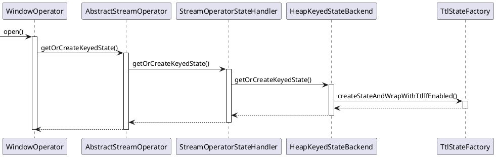

</div>

最后在TtlStateFactory的createStateAndWrapWithTtlIfEnable()方法中根据系统是否起用了ttl和状态描述符的类型生成TtlState（HeapState的一层封装）或HeapState。

<details> <summary>具体实现</summary>

```Java
class TtlStateFactory<K, N, SV, TTLSV, S extends State, IS extends S>
{
    static <K, N, SV, TTLSV, S extends State, IS extends S> IS createStateAndWrapWithTtlIfEnabled(
        TypeSerializer<N> namespaceSerializer,
        StateDescriptor<S, SV> stateDesc,
        KeyedStateBackend<K> stateBackend,
        TtlTimeProvider timeProvider)
    {
        return stateDesc.getTtlConfig().isEnabled()
            ? new TtlStateFactory<K, N, SV, TTLSV, S, IS>(namespaceSerializer, stateDesc, stateBackend, timeProvider).createState()
            : stateBackend.createInternalState(namespaceSerializer, stateDesc);
    }
}
```

</details>

使用ProcessWindowFunction进行reduce和aggregate计算理论上不会损失性能，Reduce、Fold、Aggregate和Process Function的性能差异是由WindowOperator实现windowState使用了不同的InternalAppendingState实现导致的（注意，当使用回收器时，所有4种Function均使用了ListState），Reduce、Aggregate、Fold和Process Function分别使用了HeapReducingState、HeapAggregatingState、HeapAggregatingState和HeapListState作为实际的状态实现。

<details> <summary>具体实现</summary>

```Java
class HeapReducingState<K, N, V>
    extends AbstractHeapMergingState<K, N, V, V, V>
    implements InternalReducingState<K, N, V>
{
    ReduceTransformation<V> reduceTransformation;
    StateTable<K, N, SV> stateTable;
    N currentNamespace;

    @Override
    public V get() {
        // stateTable.get(currentNamespace);
        return getInternal();
    }

    @Override
    public void add(V value) {

        if (value == null) {
            clear();
            return;
        }
        stateTable.transform(currentNamespace, value, reduceTransformation);
    }
}

class HeapAggregatingState<K, N, IN, ACC, OUT>
    extends AbstractHeapMergingState<K, N, IN, ACC, OUT>
    implements InternalAggregatingState<K, N, IN, ACC, OUT>
{
    AggregateTransformation<IN, ACC, OUT> aggregateTransformation;
    StateTable<K, N, SV> stateTable;
    N currentNamespace;

    @Override
    public OUT get() {
        // stateTable.get(currentNamespace);
        ACC accumulator = getInternal();
        // 由于Aggregating操作的计算结果类型可能与数据元素类型不一致，在最后需要对累加器结果进行一次转换
        return accumulator != null ? aggregateTransformation.aggFunction.getResult(accumulator) : null;
    }

    @Override
    public void add(IN value) throws IOException {
        N namespace = currentNamespace;
        if (value == null) {
            clear();
            return;
        }
        stateTable.transform(namespace, value, aggregateTransformation);
    }
}

class HeapListState<K, N, V>
    extends AbstractHeapMergingState<K, N, V, List<V>, Iterable<V>>
    implements InternalListState<K, N, V>
{
    StateTable<K, N, SV> stateTable;
    N currentNamespace;

    @Override
    public Iterable<V> get() {
        // stateTable.get(currentNamespace);
        return getInternal();
    }

    @Override
    public void add(V value) {
        N namespace = currentNamespace;

        StateTable<K, N, List<V>> map = stateTable;
        List<V> list = map.get(namespace);

        if (list == null) {
            list = new ArrayList<>();
            map.put(namespace, list);
        }
        list.add(value);
    }
}
```

</details>

HeapReducingState的add()方法调用栈如下：

<div class='wrapper' block='markdown'>

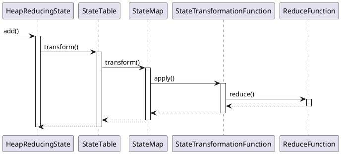

</div>

HeapListState的add()方法实现仅仅是向目标命名空间的列表中添加一个新元素（不存在则创建），这意味着，使用ProcessWindowFunction进行窗口处理，在元素进入窗口时仅会被追加到窗口状态的末尾，而不会像ReducingFunction和AggregatingFunction一样对每个进入窗口的元素立即进行聚合。


**数据元素触发的状态变化** 在处理数据元素时，将新数据元素的值添加到其所在的窗口中，在触发器计算结果后，如果是触发则取出该窗口中的所有值执行窗口计算方法，如果是清除则清除窗口状态中窗口对应命名空间中所有元素

**时间触发的状态变化** 根据触发器计算的结果决定取出状态进行计算还是清除状态，之后，将计算触发计算的窗口是否过期（ProcessingTime为窗口最大时间戳，EventTime为窗口最大时间戳+允许晚到的最大间隔），然后清除过期窗口的所有状态

**合并窗口状态** 窗口算子拥有两个额外的状态windowMergingState和mergingSetsState来合并窗口。windowMergingState用于记录合并窗口的状态，是windowState的一个用于合并的引用，在触发窗口合并时，会执行窗口状态的合并方法InternalMergingState的mergeNamespaces()方法，执行ReducingState的ReducingFunction，执行AggregatingState的AggregatingFunction，或是执行ListState的addAll。mergingSetsState则是记录了窗口的元数据，mergingSetsState的变更位于MergeWindowSet的persist()方法处（MergeWindowSet的state变量即mergingSetsState的引用）。

<details> <summary>具体实现</summary>

```Java
class WindowOperator<K, IN, ACC, OUT, W extends Window>
    extends AbstractUdfStreamOperator<OUT, InternalWindowFunction<ACC, OUT, K, W>>
    implements OneInputStreamOperator<IN, OUT>, Triggerable<K, W>
{
    InternalMergingState<K, W, IN, ACC, ACC> windowMergingState;
    InternalListState<K, VoidNamespace, Tuple2<W, W>> mergingSetsState;

    @Override
    public void open() throws Exception {
        ......
        if (windowState instanceof InternalMergingState) {
            windowMergingState = (InternalMergingState<K, W, IN, ACC, ACC>) windowState;
        }

        Class<Tuple2<W, W>> typedTuple = (Class<Tuple2<W, W>>) (Class<?>) Tuple2.class;
        TupleSerializer<Tuple2<W, W>> tupleSerializer = new TupleSerializer<>(typedTuple, new TypeSerializer[] {windowSerializer, windowSerializer});

        ListStateDescriptor<Tuple2<W, W>> mergingSetsStateDescriptor = new ListStateDescriptor<>("merging-window-set", tupleSerializer);

        mergingSetsState = (InternalListState<K, VoidNamespace, Tuple2<W, W>>) getOrCreateKeyedState(VoidNamespaceSerializer.INSTANCE, mergingSetsStateDescriptor);
        mergingSetsState.setCurrentNamespace(VoidNamespace.INSTANCE);
    }
}

class MergingWindowSet<W extends Window>
{
    Map<W, W> mapping;
    ListState<Tuple2<W, W>> state;

    void persist() {
        if (!mapping.equals(initialMapping)) {
            state.clear();
            for (Map.Entry<W, W> window : mapping.entrySet()) {
                state.add(new Tuple2<>(window.getKey(), window.getValue()));
            }
        }
    }
}
```

</details>

**带有回收器的窗口状态** 窗口算子EvictingWindowOperator使用evictingWindowState在逻辑上替代了windowState，并使用null初始化windowState（同时也导致windowMergingState不再使用，直接用evictingWindowState而不是一个引用记录合并窗口状态）。使用回收器时，状态一定为ListState。带有回收器的窗口算子的合并窗口流程与无回收器算子一致，均为MergeWindowSet的persist()方法。由于回收器在执行窗口计算方法前后会回收窗口中的元素，因此在触发器返回FIRE后，即EvictingWindowOperator的emitWindowContents()处需要对窗口的状态进行更新。

<details> <summary>具体实现</summary>

```Java
class EvictingWindowOperator<K, IN, OUT, W extends Window>
    extends WindowOperator<K, IN, Iterable<IN>, OUT, W>
{
    StateDescriptor<? extends ListState<StreamRecord<IN>>, ?> evictingWindowStateDescriptor;
    Evictor<? super IN, ? super W> evictor;

    public EvictingWindowOperator(
        WindowAssigner<? super IN, W> windowAssigner,
        TypeSerializer<W> windowSerializer,
        KeySelector<IN, K> keySelector,
        TypeSerializer<K> keySerializer,
        StateDescriptor<? extends ListState<StreamRecord<IN>>, ?> windowStateDescriptor,
        InternalWindowFunction<Iterable<IN>, OUT, K, W> windowFunction,
        Trigger<? super IN, ? super W> trigger,
        Evictor<? super IN, ? super W> evictor,
        long allowedLateness,
        OutputTag<IN> lateDataOutputTag)
    {

        super(windowAssigner,
            windowSerializer,
            keySelector,
            keySerializer,
            null,
            windowFunction,
            trigger,
            allowedLateness,
            lateDataOutputTag);

        this.evictor = checkNotNull(evictor);
        this.evictingWindowStateDescriptor = checkNotNull(windowStateDescriptor);
    }

    @Override
    public void open() {
        super.open();
        evictorContext = new EvictorContext(null, null);
        evictingWindowState = (InternalListState<K, W, StreamRecord<IN>>)getOrCreateKeyedState(windowSerializer, evictingWindowStateDescriptor);
    }
}
```

</details>

WindowOperator是窗口具体实现，每个元素进入WindowOperator时，首先会被交给WindowAssigner，WindowAssigner决定元素被放到哪个或哪些窗口（可能会创建新窗口或者合并旧的窗口），然后调用Trigger的`onElement()`方法判断是否触发计算。

另外，WindowOperator中注册了一个定时器，定时器超时时会调用其`onEventTime()`方法和`onProcessingTime()`方法，这两个方法中分别调用Trigger的`onEventTime()`方法和`onProcessingTime()`方法判断是否触发计算。

如果触发计算则调用计算函数处理窗口中的元素（如果是EvictingWindowOperator，会先过滤窗口中的元素），如果清空则清空窗口中的元素。

Flink对一些聚合类的窗口计算做了优化，这些计算不需要将窗口中的所有数据都保存下来，只需要保存一个中间结果值就可以了。每个进入窗口的元素都会执行一次聚合函数并修改中间结果值，这样可以大大降低内存的消耗并提升性能。但是如果是用户定义了Evictor，则不会启用对聚合窗口的优化，因为Evictor需要遍历窗口中的所有元素，必须将窗口中的所有元素都存下来。

```Java
class WindowOperator<K, IN, ACC, OUT, W extends Window> extends AbstractUdfStreamOperator<OUT, InternalWindowFunction<ACC, OUT, K, W>> implements OneInputStreamOperator<IN, OUT>, Triggerable<K, W> {
    WindowAssigner<? super IN, W> windowAssigner;
    KeySelector<IN, K> keySelector;
    Trigger<? super IN, ? super W> trigger;
    StateDescriptor<? extends AppendingState<IN, ACC>, ?> windowStateDescriptor;
    long allowedLateness;
    OutputTag<IN> lateDataOutputTag;             // 延迟时间超过allowedLateness的元素将输出到这里
    TypeSerializer<K> keySerializer;             // 检查点中序列化键
    TypeSerializer<W> windowSerializer;          // 检查点中序列化窗口
    InternalWindowFunction<ACC, OUT, K, W> userFunction;      // 计算函数
    InternalTimerService<W> internalTimerService;

    public WindowOperator(WindowAssigner<? super IN, W> windowAssigner, TypeSerializer<W> windowSerializer, KeySelector<IN, K> keySelector, TypeSerializer<K> keySerializer, StateDescriptor<? extends AppendingState<IN, ACC>, ?> windowStateDescriptor, InternalWindowFunction<ACC, OUT, K, W> windowFunction, Trigger<? super IN, ? super W> trigger, long allowedLateness, OutputTag<IN> lateDataOutputTag) {
        super(windowFunction);

        this.windowAssigner = windowAssigner;
        this.windowSerializer = windowSerializer;
        this.keySelector = keySelector;
        this.keySerializer = keySerializer;
        this.windowStateDescriptor = windowStateDescriptor;
        this.trigger = trigger;
        this.allowedLateness = allowedLateness;
        this.lateDataOutputTag = lateDataOutputTag;
        this.userFunction = windowFunction;

        setChainingStrategy(ChainingStrategy.ALWAYS);
    }

    public void open() {
        super.open();
        internalTimerService = getInternalTimerService("window-timers", windowSerializer, this);
        windowAssignerContext = new WindowAssigner.WindowAssignerContext() {
            @Override
            public long getCurrentProcessingTime() {
                return internalTimerService.currentProcessingTime();
            }
        };
        // 创建（或恢复）用于保存窗口内容的状态
        if (windowStateDescriptor != null) {
            windowState = (InternalAppendingState<K, W, IN, ACC, ACC>)getOrCreateKeyedState(windowSerializer, windowStateDescriptor);
        }
    }

    public void processElement(StreamRecord<IN> element) {
        // 元素被分到的窗口
        Collection<W> elementWindows = windowAssigner.assignWindows(element.getValue(), element.getTimestamp(), windowAssignerContext);
        K key = this.<K>getKeyedStateBackend().getCurrentKey();
        if (windowAssigner instanceof MergingWindowAssigner) {
            ......
        } else {
            for (W window : elementWindows) {
                windowState.setCurrentNamespace(window);
                // 添加元素
                windowState.add(element.getValue());

                triggerContext.key = key;
                triggerContext.window = window;
                TriggerResult triggerResult = triggerContext.onElement(element);
                if (triggerResult.isFire()) {
                    ACC contents = windowState.get();
                    emitWindowContents(actualWindow, contents);
                }
                if (triggerResult.isPurge()) {
                    windowState.clear();
                }
                registerCleanupTimer(actualWindow);
            }
        }
    }

    public void onEventTime(InternalTimer<K, W> timer) {
        triggerContext.key = timer.getKey();
        triggerContext.window = timer.getNamespace();
        if (windowAssigner instanceof MergingWindowAssigner) {
            ......
        } else {
            windowState.setCurrentNamespace(triggerContext.window);
        }

        TriggerResult triggerResult = triggerContext.onEventTime(timer.getTimestamp());

        if (triggerResult.isFire()) {
            ACC contents = windowState.get();
            emitWindowContents(triggerContext.window, contents);
        }

        if (triggerResult.isPurge()) {
            windowState.clear();
        }

        if (windowAssigner.isEventTime() && isCleanupTime(triggerContext.window, timer.getTimestamp())) {
            clearAllState(triggerContext.window, windowState, mergingWindows);
        }

    }

    public void onProcessingTime(InternalTimer<K, W> timer) {
        triggerContext.key = timer.getKey();
        triggerContext.window = timer.getNamespace();
        if (windowAssigner instanceof MergingWindowAssigner) {
            ......
        } else {
            windowState.setCurrentNamespace(triggerContext.window);
        }

        TriggerResult triggerResult = triggerContext.onProcessingTime(timer.getTimestamp());

        if (triggerResult.isFire()) {
            ACC contents = windowState.get();
            emitWindowContents(triggerContext.window, contents);
        }

        if (triggerResult.isPurge()) {
            windowState.clear();
        }

        if (!windowAssigner.isEventTime() && isCleanupTime(triggerContext.window, timer.getTimestamp())) {
            clearAllState(triggerContext.window, windowState, mergingWindows);
        }
    }

    // 调用计算函数处理窗口元素
    private void emitWindowContents(W window, ACC contents) throws Exception {
        timestampedCollector.setAbsoluteTimestamp(window.maxTimestamp());
        processContext.window = window;
        userFunction.process(triggerContext.key, window, processContext, contents, timestampedCollector);
    }

    private void clearAllState(W window, AppendingState<IN, ACC> windowState, MergingWindowSet<W> mergingWindows) {
        windowState.clear();
        triggerContext.clear();
        processContext.window = window;
        processContext.clear();
    }

}
```

## 检查点（Checkpoint）

Checkpoint是Flink容错机制的核心，在Checkpoint的过程中，Flink会生成算子中状态的快照（snapshotting）并存储到状态后端中；在算子从故障中恢复时，可以通过快照恢复故障前的状态，从而实现流式处理的Exactly-Once或At-Least-Once语义。状态快照由数据流中的Barrier触发。在Flink运行时，数据源会定期向数据流中插入Barrier，当算子收到Barrier时，即开始进行状态快照。Flink在1.11版本加入了Unaligned Checkpointing机制，允许具有多个上游的算子在全部Barrier到达之前进行checkpoint流程。

数据处理容错语义保证的可靠程度从低到高包含4个不同的层次：
+ 至多一次（At-Most-Once）：数据不重复处理，但可能丢失
+ 最少一次（At-Least-Once）：数据可能重复处理，但保证不丢失
+ 引擎内严格一次（Exactly-Once）：在计算引擎内部，数据不丢失、不重复
+ 端到端严格一次（End-to-End Exactly-Once）：从数据读取、引擎处理到写入外部存储的整个过程中，数据不重复、不丢失。端到端严格一次语义需要数据源支持可重放、外部存储支持事务机制、能够进行回滚

Flink基于轻量级分布式快照技术-异步屏障快照（Asynchronous Barrier Snapshots，ABS）算法^[借鉴了Chandy-Lamport算法，在数据源端插入 屏障（Barrier）来替代Chandy-Lamport算法中的Marker，通过控制屏障的同步来实现快照的备份和精确一次（Exactly-Once）语义]-提供了Checkpoint机制来实现容错。分布式快照技术的核心思想是生成分布式数据流和算子状态的一致性快照，并将这些快照作为发生故障时系统回退到的一致性检查点。基于检查点机制，在框架级别支持两阶段提交协议，实现了端到端严格一次的语义保证。

保存点（Savepoint）是基于Flink检查点机制的应用完整快照备份机制，可以在另一个集群或者另一个时间点，从保存的状态中将作业恢复回来，适用于应用升级、集群迁移、Flink集群版本更新等场景。保存点可以视为一个“算子ID->状态”的Map，对于每一个有状态的算子，Key是算子ID，Value是算子状态。

**异步屏障快照算法** 在数据源周期性注入屏障（Barrier）来切分数据流（屏障从不跨越记录、严格按顺序流动来作为两次快照对应记录集合的边界，每个屏障都携带其前记录对应检查点的ID），屏障作为数据流的一部分流经各个算子^[不同检查点对应的多个屏障可以在流中同时出现，即 多个检查点可以同时发生]，当一个算子从其所有输入流中收到了同一快照的屏障时，该算子就会保存自己的状态快照并向下游广播屏障，Sink算子从其所有输入流中收到了同一快照的屏障时，如果是引擎内严格一次处理保证，Sink算子对自己的状态进行快照，然后通知检查点协调器，当所有Sink算子都向检查点协调器汇报成功之后，检查点协调器向所有算子确认本次快照完成，如果是端到端严格一次处理保证，Sink算子对自己的状态进行快照，并预提交事务，再通知检查点协调器，当所有Sink算子都向检查点协调器汇报成功之后，检查点协调器向所有的算子确认本次快照完成，Sink算子提交事务，本次快照完成。当作业发生异常时，从最后一次成功的检查点中恢复状态。屏障生成不需要锁，其随着数据向下流动，也不会打断数据流，与检查点有关的所有操作都可以异步完成，可以对齐，也可以不对齐，算子可以异步快照它们的状态，因此非常轻量。

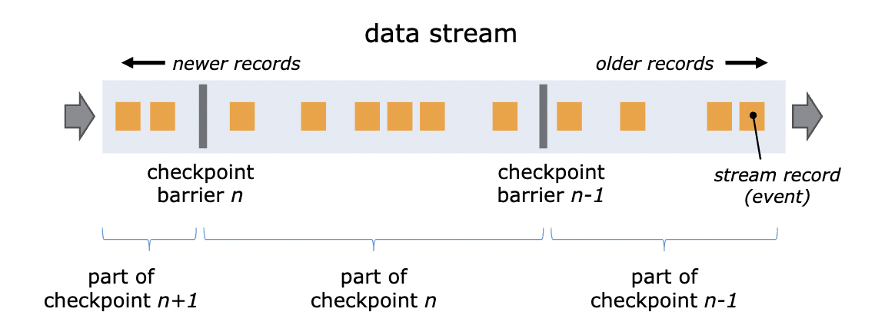

**屏障对齐** 当一个算子有多个输入时，为了达到引擎内严格一次、端到端严格一次两种保证语义，必须要屏障对齐。对于有两个上游输入通道的算子，屏障对齐过程如下
1. 开始对齐：算子收到输入通道1中的屏障，输入通道2的屏障尚未到达
2. 对齐：算子继续从输入通道1接收数据，但是并不处理，而是保存在输入缓存（input buffer）中，等待输入通道2的屏障到达^[阻塞输入通道有负面效果，一旦某个输入通道发生延迟，屏障迟迟未到，会导致其它通道全部堵塞，系统吞吐大幅下降]
3. 执行检查点：输入通道2中的屏障到达，此时屏障前的记录已经更新了状态，屏障后的记录还未更新状态，保证了状态的准确性（同时还消去了原生Chandy-Lamport算法中记录输入流状态的步骤），算子开始对其状态进行异步快照（包含快照开始时所有数据源并行流的位置offset和指向每个算子状态的指针），接着向下游广播对应检查点的屏障而无需等待快照执行完毕
4. 继续处理数据：算子进行异步快照后，首先处理输入缓存中的数据，然后再从输入通道中获取数据

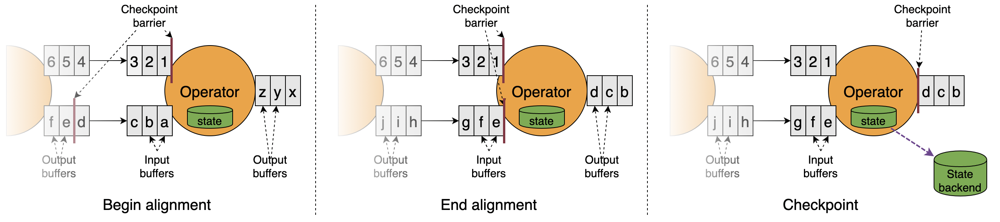

```
# 伪代码：
# 初始化Operator
upon event (init | input_channels, output_channels, fun, init_state)
do
    state := init_state;
    blocked_inputs := {};
    inputs := input_channels;
    outputs := output_channels;
    udf := fun;
# 收到Barrier的行为
upon event (receive | input, (barrier))
do
    # 将当前input通道加入blocked 集合，并block该通道，此通道的消息处理暂停
    if input != Nil
    then
        blocked_inputs := blocked_inputs ∪ {input};
        trigger (block | input);
    # 如果所有的通道都已经被block，说明所有的barrier都已经收到
    if blocked_inputs = inputs
    then
        blocked_inputs := {};
        # 向所有的outputs发出Barrier
        broadcast (send | outputs, (barrier));
        # 记录本节点当前状态
        trigger (snapshot | state);
        # 解除所有通道的block，继续处理消息
        for each inputs as input
            trigger (unblock | input);
```

**故障恢复** 发生故障时，Flink选择最近完成的检查点k，接着系统重新部署整个分布式数据流，并将检查点k中快照的状态分发给每个算子。数据源被设置成从位置Sk开始读取数据（如对于Apache Kafka，意味着通知消费者从Offset Sk开始拉取数据）。如果使用了增量快照，算子从最近一次全量快照开始，然后应用更新该状态的一连串增量快照。

+ 自动检查点恢复：可以在配置文件中提供全局配置，也可以在代码中为Job特别设定。支持以下重启策略
    + 固定延迟重启策略：配置参数fixed-delay，会尝试一个给定的次数来重启作业，如果超过了最大的重启次数，Job最终将失败，在连续的两次重启尝试之间，重启策略会等待一个固定的时间，默认为Integer.MAX_VALUE次
    + 失败率重启策略：配置参数failure-rate，在作业失败后会重启，但是超过失败率后，作业会最终被认定失败，在两个连续的重启尝试之间，重启策略会等待一个固定的时间
    + 直接失败策略：配置参数None，失败不重启

+ 手动检查点恢复：在启动之时通过设置-s参数指定检查点目录的功能，让新的jobId读取该检查点元文件信息和状态信息，从而达到指定时间节点启动作业的目的
    + 外部检查点：检查点执行完成时，在用户给定的外部持久化存储保护，当作业失败（或取消）时，外部存储的检查点会保留下来，用户在恢复时需要提供用于恢复的作业状态的检查点路径
    + 保存点：用户通过命令触发，由用户手动创建、清理，使用了标准化格式存储，允许作业升级或者配置变更，用户在恢复时需要提供用于恢复的作业状态的保存点路径

从保存点恢复作业需要考虑以下几点：
1. 算子的顺序改变：如果算子对应的UID没变，则可以恢复，如果对应的UID变了则恢复失败
2. 作业中添加了新的算子：如果是无状态算子，则没有影响，可以正常恢复，如果是有状态的算子，跟无状态的算子一样处理
3. 从作业中删除了一个有状态的算子：从保存点恢复时通过在命令中添加--allowNonRestoreState（或 -n）跳过无法恢复的算子

### 非对齐检查点

屏障对齐是阻塞式的，如果作业出现反压，数据流动的速度减慢，屏障到达下游算子的延迟就会变大，进而影响到检查点完成的延时（变大甚至超时失败）。如果反压长久不能得到解决，快照数据与实际数据之间的差距就越来越明显，一旦作业failover，势必丢失较多的处理进度。另一方面，作业恢复后需要重新处理的数据又会积压，加重反压，造成恶性循环。

为了规避风险，Flink 1.11开始支持非对齐检查点（unaligned checkpoint）。非对齐检查点机制取消了屏障对齐，与原生Chandy-Lamport算法更为相似一些（需要由算子来记录输入流的状态）。具体步骤如下：

1. 当输入流中的第一个屏障保存到输入缓冲区（input buffer）中时，算子开始进行Checkpoint
2. 算子通过将屏障添加到输出缓冲区（output buffer）的结尾来立即向下游算子广播屏障
3. 算子标记所有未处理的需要异步存储的记录（第一个屏障所在输入缓冲区中的记录、其他输入流对应屏障前的记录、输出缓冲区中的记录）并创建其状态的快照

算子仅在标记缓冲区、广播屏障、创建快照时短暂停止处理输入。

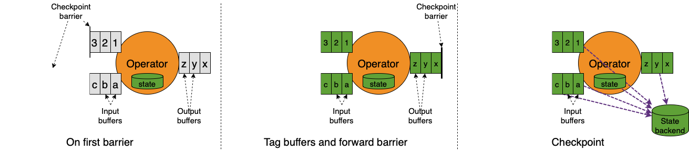

非对齐Checkpoint故障恢复时，除了开始处理来自上游算子的数据前先恢复未处理的数据，其余都和Checkpoint故障恢复操作相同。

对齐检查点和非对齐检查点区别：
1. 对齐检查点在最后一个屏障到达算子时触发，非对齐检查点在第一个屏障到达算子时就触发
2. 对齐检查点在第一个屏障到最后一个屏障到达的区间内是阻塞的，而非对齐检查点不需要阻塞
3. 对齐检查点能够保持快照N~N + 1之间的边界，但非对齐检查点模糊了这个边界

非对齐检查点适用于容易产生反压且I/O压力较小的场景，对齐检查点的At Least Once方式适用于可以容忍重复数据或者在业务逻辑保证幂等性的场景，且能有效的减少反压。

### 两阶段提交协议

Flink设计实现了一种两阶段提交协议（预提交阶段和提交阶段，依赖于两阶段检查点机制），能够保证端到端严格一次，为满足以下条件的Source/Sink提供端到端严格一次支持：
1. 数据源支持断点读取，即能够记录上次读取的位置，失败之后能够从断点处继续读取
2. 外部存储支持回滚机制或者满足幂等性，回滚机制指当作业失败之后能够将部分写入的结果回滚到写入之前的状态；幂等性指重复写入不会带来错误的结果

**预提交阶段** Sink把要写入外部存储的数据以状态的形式保存到状态后端中，同时以事务的方式将数据写入外部存储。如果在预提交阶段任何一个算子发生异常，导致检查点没有备份到状态后端，所有其他算子的检查点执行也必须被终止，Flink回滚到最近成功完成的检查点

**提交阶段** 预提交阶段完成之后，通知所有的算子，确认检查点已成功完成，然后进入提交阶段，JobMaster为作业中每个算子发起检查点已完成的回调逻辑。在预提交阶段，数据实际上已经写入外部存储，但是因为事务原因是不可读的，所有的Sink算子提交成功之后，一旦预提交完成，必须确保提交外部事务也要成功。如果提交外部事务失败，Flink应用就会崩溃，然后根据用户重启策略进行回滚，回滚到预提交时的状态，之后再次重试提交

Flink抽取两阶段提交协议公共逻辑封装进TwoPhaseCommitSinkFunction抽象类，该类继承了CheckpointedFunction接口（在预提交阶段，能够通过检查点将待写出的数据可靠地存储起来）和CheckpointListener接口（在提交阶段，能够接收JobMaster的确认通知，触发提交外部事务）。

以基于文件的Sink为例，若要实现端到端严格一次，最重要的是以下4种方法：
1. beginTransaction：开启一个事务，在临时目录下创建一个临时文件，之后写入数据到该文件中，此过程为不同的事务创建隔离，避免数据混淆
2. preCommit：在预提交阶段，将缓存数据块写出到创建的临时文件，然后关闭该文件，确保不再写入新数据到该文件，同时开启一个新事务，执行属于下一个检查点的写入操作，此过程用于准备需要提交的数据，并且将不同事务的数据隔离开来
3. commit：在提交阶段，以原子操作的方式将上一阶段的文件写入真正的文件目录下。如果提交失败，Flink应用会重启，并调用TwoPhaseCommitSinkFunction的recoverAndCommit()方法尝试恢复并重新提交事务^[两阶段提交可能会导致数据输出的延迟，即需要等待JobMaster确认检查点完成才会写入真正的文件目录]
4. abort：一旦终止事务，删除临时文件

### 检查点执行过程

<div class = "wrapper" block="markdown">

```bob-svg
                                    .---------------------.
           trigger Checkpoint       |     JobMaster       |
      +-----------------------------+   .-------------.   |
      |                             |   | Checkpoint  |   |
      |     +---------------------->+   | Coordinator |   +<-------------------------+
      |     |   report "succ/fail"  |   '-------------'   |    report "succ/fail"    |
      |     |                       '----------+----------'                          |
      |     |                                  ^                                     |
      v     |                                  | report "succ/fail"                  |
 .----+-----+----.                             |                              .------+--------.
 | StreamSource  |                     .-------+--------.                     |  StreamSink   |
 |               |-------------------->+ StreamOperator +-------------------->+               |
 |Source Operator| Checkpoint Barrier  '----------------' Checkpoint Barrier  | Sink Operator |
 '---------------'                                                            '---------------'
```

</div>

JobMaster中的检查点协调器（CheckpointCoordinator）组件负责检查点的管理，包括触发检查点、确认检查点完成。Checkpoint由JobMaster通过定时器周期性触发（CheckpointCoordinatorDeActivator监听JobStatus的变化启动和停止周期性的Checkpoint调度任务），并由各TaskExecutor执行（算子是最底层的执行者）。触发检查点时，首先，检查点协调器向Source算子注入屏障（Barrier）消息，接着，各Task完成Checkpoint后通知JobManager Checkpoint确认完成（检查点协调器持有和维护各个Task在确认完成消息中上报的状态引用），最后，JobMaster进行元数据的写入。

在执行检查点的过程中，TaskExecutor和JobMaster之间通过消息确认检查点执行成功还是取消，Flink中设计了检查点消息类体系（AbstractCheckpointMessage是所有Checkpoint消息的基础抽象类），检查点消息中有3个重要信息，该检查点所属的作业标识（JobID）、检查点编号、Task标识（ExecutionAttemptID）
+ TriggerCheckpoint：JobMaster向TaskExecutor发送的检查点触发消息
+ AcknowledgeCheckpoint消息：TaskExecutor向JobMaster发送的检查点完成确认消息
+ DeclineCheckpoint消息：TaskExecutor向JobMaster发送的算子无法执行快照消息
+ NotifyCheckpointComplete：JobMaster向TaskExecutor发送的检查点完成消息

<div class="wrapper" block="markdown">

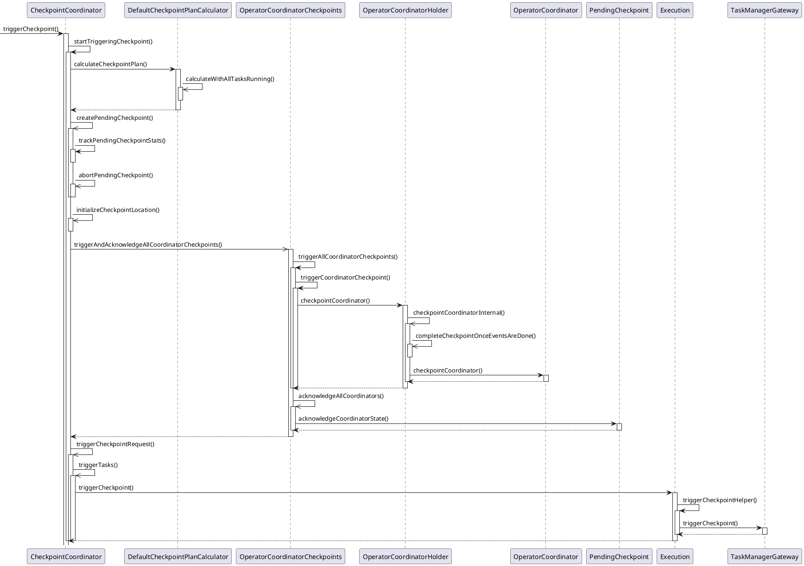

</div>

检查点执行具体过程：
1. JobMaster触发检查点：CheckpointCoordinator通知执行数据读取的SourceTask产生CheckpointBarrier事件并注入数据流中
    1. 前置检查：
        1. 未启用Checkpoint、作业关闭过程中或尚未达到触发检查点的最小间隔时都不允许执行
        2. 检查是否所有需要执行检查点的Task都处于执行状态，能够执行检查点和向JobMaster汇报
        3. 执行CheckpointID = CheckpointIdCounter.getAndIncrement()，生成一个新的id，然后生成一个PendingCheckpoint^[PendingCheckpoint是一个启动了的检查点，但是还没有被确认，等到所有的Task都确认了本次检查点，那么这个检查点对象将转化为一个CompletedCheckpoint]
        4. 检查点执行超时时取消本次检查点
        5. 触发MasterHooks^[用户可以定义一些额外的操作，用以增强检查点的功能]
        6. 再次执行步骤1和2中的检查，如果一切正常，则向各个SourceStreamTask发送通知，触发检查点执行
    2. 向Task发送触发检查点消息：Execution表示一次ExecutionVertex的执行，对应于Task实例，在JobMaster端通过Execution的Slot可以找到对应的TaskManagerGateway，远程触发Task的检查点
2. 各算子执行检查点并汇报：JobMaster通过TaskManagerGateway触发TaskManager执行检查点，TaskManager则转交给Task执行
    1. Task层面的检查点执行准备：Task类中的CheckpointMetaData对象确保Task处于Running状态，把工作转交给StreamTask，而StreamTask也转交给更具体的类，直到最终执行用户编写的函数
    2. StreamTask执行检查点：首先在OperatorChain上执行准备CheckpointBarrier的工作，然后向下游所有Task广播CheckpointBarrier，最后触发自己的检查点^[这样做可以尽快将CheckpointBarrier广播到下游，避免影响下游CheckpointBarrier对齐，降低整个检查点执行过程的耗时]
    3. 算子生成快照：在StreamTask中经过一系列简单调用之后，异步触发OperatorChain中所有算子的检查点。算子开始从StateBackend中深度复制状态数据，并持久化到外部存储中。注册回调，执行完检查点后向JobMaster发出CompletedCheckpoint消息
    4. 算子保存快照与状态持久化：触发保存快照的动作之后，首先对OperatorState和KeyState分别进行处理，如果是异步的，则将状态写入外部存储。持久化策略负责将状态写入目标存储
    5. Task报告检查点完成：当一个算子完成其状态的持久化之后，就会向JobMaster发送检查点完成消息，具体逻辑在reportCompletedSnapshotStates中，该方法又把任务委托给了RpcCheckpointResponder类。在向JobMaster汇报的消息中，TaskStateSnapshot中保存了本次检查点的状态数据^[内存型StateBackend中保存的是真实的状态数据，文件型StateBackend中保存的是状态的句柄]，在分布式文件系统中的保存路径也是通过TaskStateSnapshot中保存的信息恢复回来的。状态的句柄分为OperatorStateHandle和KeyedStateHandle，分别对应OperatorState和KeyState，同时也区分了原始状态和托管状态
3. JobMaster确认检查点完成：JobMaster通过调度器SchedulerNG任务把消息交给CheckpointCoordinator的receiveAcknowledgeMessage()方法来响应算子检查点完成事件。CheckpointCoordinator在触发检查点时，会生成一个PendingCheckpoint，保存所有算子的ID。当PendingCheckpoint收到一个算子的完成检查点的消息时，就把这个算子从未完成检查点的节点集合移动到已完成的集合。当所有的算子都报告完成了检查点时，CheckpointCoordinator会触发`completePendingCheckpoint()`方法，该方法做了以下事情：
    1. 把pendingCgCheckpoint转换为CompletedCheckpoint
    2. 把CompletedCheckpoint加入已完成的检查点集合，并从未完成检查点集合删除该检查点，CompletedCheckpoint中保存了状态的句柄、状态的存储路径、元信息的句柄等信息
    3. 向各个算子发出RPC请求，通知该检查点已完成

source算子的performCheckpoint()方法由StreamTask的triggerCheckpoint触发，其他算子通过CheckpointBarrierHandle的notifyCheckpoint()调用StreamTask的triggerCheckpointOnBarrier()方法触发。而算子checkpoint中止则是交由SubtaskCheckpointCoordinatorImpl的abortCheckpointOnBarrier()方法执行。

#### 周期触发checkpointing

设置了检查点间隔（env.enablecheckpointing(long interval)）时，会有定时任务根据设置的间隔触发checkpointing。入口在DefaultExecutionGraphBuilder的buildGraph()方法中，在enableCheckpointing()方法中会创建CheckpointCoordinator，同时添加一个Job监听器CheckpointCoordinatorDeActivator，CheckpointCoordinatorDeActivator会在Job状态转换为RUNNING时，调用startCheckpointScheduler()方法，通过定时调用ScheduledTrigger来向各SourceTask发送Checkpoint请求。另外，可以手动启动一个savepoint来触发checkpointing。

<details> <summary>具体实现</summary>

```Java
class DefaultExecutionGraphBuilder {
    static DefaultExecutionGraph buildGraph() {
        ...
        DefaultExecutionGraph executionGraph = new DefaultExecutionGraph(...);
        ...
        // 开启Checkpoint时调用ExecutionGraph的enableCheckpointing()方法
        if (isCheckpointingEnabled(jobGraph)) {
            StateBackend rootBackend = ...;
            CheckpointStorage rootStorage = ...;
            executionGraph.enableCheckpointing(...);
        }
        return executionGraph;
    }
}

class DefaultExecutionGraph implements ExecutionGraph {

    void enableCheckpointing(
        CheckpointCoordinatorConfiguration chkConfig,
        List<MasterTriggerRestoreHook<?>> masterHooks,
        CheckpointIDCounter checkpointIDCounter,
        CompletedCheckpointStore checkpointStore,
        StateBackend checkpointStateBackend,
        CheckpointStorage checkpointStorage,
        CheckpointStatsTracker statsTracker,
        CheckpointsCleaner checkpointsCleaner)
    {

        Collection<OperatorCoordinatorCheckpointContext> operatorCoordinators = buildOpCoordinatorCheckpointContexts();

        checkpointStatsTracker = statsTracker;
        checkpointCoordinatorConfiguration = chkConfig;

        CheckpointFailureManager failureManager = ...

        checkpointCoordinatorTimer = 
            Executors.newSingleThreadScheduledExecutor(
                new DispatcherThreadFactory(Thread.currentThread().getThreadGroup()
                ,"Checkpoint Timer"));

        // 构建CheckpointCoordinator对象。CheckpointCoordinator负责触发、提交检查点以及持有并保存状态
        checkpointCoordinator =
            new CheckpointCoordinator(
                jobInformation.getJobId(),
                chkConfig,
                operatorCoordinators,
                checkpointIDCounter,
                checkpointStore,
                checkpointStorage,
                ioExecutor,
                checkpointsCleaner,
                new ScheduledExecutorServiceAdapter(checkpointCoordinatorTimer),
                SharedStateRegistry.DEFAULT_FACTORY,
                failureManager,
                createCheckpointPlanCalculator(...),         // 创建DefaultCheckpointPlanCalculator对象
                new ExecutionAttemptMappingProvider(getAllExecutionVertices()),
                checkpointStatsTracker);

        if (checkpointCoordinator.isPeriodicCheckpointingConfigured()) {
            // 创建CheckpointCoordinatorDeActivator对象并将其注册为JobStatus监听器
            // CheckpointCoordinarorDeActivator对象监控JobStatus是activates/deactivates来启动/停止checkpoint scheduler
            jobStatusListeners.add(new CheckpointCoordinatorDeActivator(checkpointCoordinator));
        }
        ...
    }

    // 通知JobStatus改变
    void notifyJobStatusChange(JobStatus newState, Throwable error) {
        if (jobStatusListeners.size() > 0) {
            long timestamp = System.currentTimeMillis();
            Throwable serializedError = error == null ? null : new SerializedThrowable(error);

            for (JobStatusListener listener : jobStatusListeners) {
                listener.jobStatusChanges(getJobID(), newState, timestamp, serializedError);
            }
        }
    }
}

class CheckpointCoordinatorDeActivator implements JobStatusListener
{

    CheckpointCoordinator coordinator;

    CheckpointCoordinatorDeActivator(CheckpointCoordinator coordinator) {
        this.coordinator = coordinator;
    }

    @Override
    void jobStatusChanges(JobID jobId, JobStatus newJobStatus, long timestamp) {
        if (newJobStatus == JobStatus.RUNNING) {
            // 启动Checkpoint调度器
            coordinator.startCheckpointScheduler();
        } else {
            // 停止Checkpoint调度器
            coordinator.stopCheckpointScheduler();
        }
    }
}

// CheckpointCoordinator触发检查点
class CheckpointCoordinator {

    ScheduledFuture<?> currentPeriodicTrigger;
    CheckpointRequestDecider requestDecider = new CheckpointRequestDecider(...);
    CheckpointPlanCalculator checkpointPlanCalculator;   // 构造时传入
    Map<Long, PendingCheckpoint> pendingCheckpoints = new LinkedHashMap();
    Collection<OperatorCoordinatorCheckpointContext> coordinatorsToCheckpoint; // 构造时传入
    Executor executor;    // 异步调用执行器，构造时传入

    void startCheckpointScheduler() {
        stopCheckpointScheduler();
        periodicScheduling = true;
        currentPeriodicTrigger = scheduleTriggerWithDelay(getRandomInitDelay());
    }

    void stopCheckpointScheduler() {
        periodicScheduling = false;
        cancelPeriodicTrigger();
    }

    ScheduledFuture<?> scheduleTriggerWithDelay(long initDelay) {
        return timer.scheduleAtFixedRate(
            new ScheduledTrigger(),         // () -> triggerCheckpoint(checkpointProperties, null, true);
            initDelay,
            baseInterval,
            TimeUnit.MILLISECONDS);
    }

}
```

</details>

#### 开始checkpointing

checkpointing由JobManager中CheckpointCoordinator的triggerCheckpoint()方法启动。checkpointing请求首先会由CheckpointRequestDecider的chooseRequestToExecute()方法决定具体执行等待队列中的哪一个checkpointing请求。CheckpointRequestDecider总是会从等待队列中选择一个优先级最高的请求（savepoint对应的请求优先级总是高于定时checkpointing任务发出的请求），存在要执行的checkpointing请求后，由CheckpointCoordinator的startTriggeringCheckpoint()方法启动checkpointing。启动checkpointing的整个过程是异步的，包括以下几个步骤：
1. 通过initializeCheckpoint()方法初始化checkpoint并通过createPendingCheckpoint()方法构造一个pendingCheckpoint（已经启动但没有收到所有任务checkpointing完成ack的checkpoint）
2. 通过snapshotMasterState()方法快照master状态
3. 通过OperatorCoordinatorCheckpoints的triggerAndAcknowledgeAllCoordinatorCheckpointsWithCompletion通知并触发算子协调器的checkpointing流程（只有Source算子有对应的协调器SourceCoordinator），该操作会关闭OperatorEventValve
4. 通过snapshotTaskState()方法使用RPC调用每个source算子的TaskExecutor执行Task的triggerCheckpointBarrier()方法向数据流中插入Barrier
5. 调用所有OperatorCoordinatorCheckpointContext的afterSourceBarrierInjection()方法重新打开OperatorEventValve

<details> <summary>具体实现</summary>

```Java
class CheckpointCoordinator
{
    CompletableFuture<CompletedCheckpoint> triggerCheckpoint(
        CheckpointProperties props,
        String externalSavepointLocation,
        boolean isPeriodic)
    {
        // CheckpointRequestDecider的chooseRequestToExecute()方法提交新创建的CheckpointRequest并获取下一个要执行的CheckpointRequest
        // CheckpointRequestDecider总是会从等待队列中选择一个优先级最高的请求
        // savepoint对应的请求优先级总是高于定时checkpointing任务发出的请求，因此如果等待队列的最低优先级元素是非定时任务请求，意味着等待队列中所有的请求都是savepoint请求，新的请求就会被丢弃并且返回空值
        // 存在要执行的CheckpointRequest时由CheckpointCoordinator的startTriggeringCheckpoint()方法启动checkpointing
        CheckpointTriggerRequest request = new CheckpointTriggerRequest(props, externalSavepointLocation, isPeriodic);
        requestDecider.chooseRequestToExecute(request, isTriggering, lastCheckpointCompletionRelativeTime)
            .ifPresent(this::startTriggeringCheckpoint);
        return request.onCompletionPromise;
    }

    void startTriggeringCheckpoint(CheckpointTriggerRequest request) {

        isTriggering = true;
        long timestamp = System.currentTimeMillis();

        // 生成检查点执行计划，包括要触发检查点的Task、要等待检查点完成的Task以及要提交检查点的Task
        CompletableFuture<CheckpointPlan> checkpointPlanFuture = checkpointPlanCalculator.calculateCheckpointPlan();

        boolean initializeBaseLocations = !baseLocationsForCheckpointInitialized;
        baseLocationsForCheckpointInitialized = true;

        // 初始化checkpoint
        CompletableFuture<PendingCheckpoint> pendingCheckpointCompletableFuture =
            checkpointPlanFuture
                .thenApplyAsync(plan -> {
                    // 确定checkpoint id
                    long checkpointID = checkpointIdCounter.getAndIncrement();
                    return new Tuple2<>(plan, checkpointID);
                },
                executor)
                .thenApplyAsync((checkpointInfo) ->
                    // 创建pendingCheckpoint，保存整个checkpointing过程中的checkpoint元数据
                    createPendingCheckpoint(
                        timestamp,
                        request.props,
                        checkpointInfo.f0,
                        request.isPeriodic,
                        checkpointInfo.f1,
                        request.getOnCompletionFuture()),
                        timer);

        // 触发算子协调器checkpoint
        CompletableFuture<?> coordinatorCheckpointsComplete =
            pendingCheckpointCompletableFuture
                .thenApplyAsync(pendingCheckpoint -> {
                    // 确定checkpoint存储位置
                    CheckpointStorageLocation checkpointStorageLocation =
                        initializeCheckpointLocation(
                            pendingCheckpoint.getCheckpointID(),
                            request.props,
                            request.externalSavepointLocation,
                            initializeBaseLocations);
                        return Tuple2.of(pendingCheckpoint, checkpointStorageLocation);
                },
                executor)
                .thenComposeAsync((checkpointInfo) -> {
                    PendingCheckpoint pendingCheckpoint = checkpointInfo.f0;
                    pendingCheckpoint.setCheckpointTargetLocation(checkpointInfo.f1);
                    // 触发算子协调器的Checkpoint（只有Source算子有对应的协调器SourceCoordinator）
                    return OperatorCoordinatorCheckpoints
                        .triggerAndAcknowledgeAllCoordinatorCheckpointsWithCompletion(
                            coordinatorsToCheckpoint,
                            pendingCheckpoint,
                            timer);
                },
                timer);

        // 触发Master钩子
        CompletableFuture<?> masterStatesComplete = coordinatorCheckpointsComplete.thenComposeAsync(
            ignored -> {
                PendingCheckpoint checkpoint = FutureUtils.getWithoutException(pendingCheckpointCompletableFuture);
                return snapshotMasterState(checkpoint);
            },
            timer);

        CompletableFuture.allOf(masterStatesComplete, coordinatorCheckpointsComplete)
            .thenRunAsync(
                () -> {
                    // Execution对应了一个Task实例，因此JobMaster可以通过里面的Slot引用找到其TaskManagerGateway，发送远程请求触发Checkpoint
                    PendingCheckpoint checkpoint = pendingCheckpointCompletableFuture.get();

                    // 插入Barrier
                    triggerTasks(request, timestamp, checkpoint);

                    // 插入Barrier成功后后续工作
                    // 执行OperatorCoordinatorCheckpointContext的afterSourceBarrierInjection()方法重新打开OperatorEventValve
                    // 重新打开事件阀后，OperatorEventValve将所有缓冲事件按顺序逐一发出
                    coordinatorsToCheckpoint.forEach(
                        // mainThreadExecutor.execute(() -> eventValve.openValveAndUnmarkCheckpoint(checkpointId))
                        (ctx) -> ctx.afterSourceBarrierInjection(checkpoint.getCheckpointID()));
                    // isTriggering = false;
                    // numUnsuccessfulCheckpointsTriggers.set(0);
                    // requestDecider
                    //     .chooseQueuedRequestToExecute(
                    //          isTriggering,
                    //          lastCheckpointCompletionRelativeTime)
                    //     .ifPresent(this::startTriggeringCheckpoint);
                    onTriggerSuccess();
                    return null;
                },
                timer);
    }
}

class DefaultCheckpointPlanCalculator implements CheckpointPlanCalculator
{
    CompletableFuture<CheckpointPlan> calculateCheckpointPlan()
    {
        // 确保作业不是处于关闭中或未启动的状态
        return CompletableFuture.supplyAsync(() -> {
            // 检查是否所有Task都已启动
            checkAllTasksInitiated();
            CheckpointPlan result = calculateWithAllTasksRunning();
            // 检查所有任务处于RUNNING状态
            checkTasksStarted(result.getTasksToWaitFor());
            return result;
        },
        context.getMainExecutor());
    }

    CheckpointPlan calculateWithAllTasksRunning() {
        // 将SourceTask标记为需要触发检查点的任务
        List<Execution> executionsToTrigger =
            sourceTasks.stream()
                .map(ExecutionVertex::getCurrentExecutionAttempt)
                .collect(Collectors.toList());

        // 将所有Task标记为需要等待和提交Checkpoint的任务
        List<Execution> tasksToWaitFor = allTasks.stream()
            .map(ExecutionVertex::getCurrentExecutionAttempt)
            .collect(Collectors.toList());

        return new DefaultCheckpointPlan(
            Collections.unmodifiableList(executionsToTrigger),        // tasksToTrigger
            Collections.unmodifiableList(tasksToWaitFor),             // tasksToWaitFor
            Collections.unmodifiableList(allTasks),                   // tasksToCommitTo
            Collections.emptyList(),                                  // finishedTasks
            Collections.emptyList(),                                  // fullyFinishedJobVertex
            allowCheckpointsAfterTasksFinished);
    }
}
```

</details>

**初始化checkpoint** 包括initializeCheckpoint和createPendingCheckpoint两部分，前者负责确定checkpoint的id和存储位置，后者创建一个PendingCheckpoint对象来保存整个checkpointing流程中的checkpoint元数据，其中，Map类型的operatorStates保存了一个算子在物理层面上的状态，包括该算子在实际运行中各个并行子任务实例的OperatorState和KeyedState。

<details> <summary>具体实现</summary>

```Java
class CheckpointCoordinator
{
    PendingCheckpoint createPendingCheckpoint(
        long timestamp,
        CheckpointProperties props,
        CheckpointPlan checkpointPlan,
        boolean isPeriodic,
        long checkpointID,
        CompletableFuture<CompletedCheckpoint> onCompletionPromise)
    {

        PendingCheckpointStats pendingCheckpointStats =
                trackPendingCheckpointStats(checkpointID, checkpointPlan, props, timestamp);

        PendingCheckpoint checkpoint = new PendingCheckpoint(
            job,
            checkpointID,
            timestamp,
            checkpointPlan,
            OperatorInfo.getIds(coordinatorsToCheckpoint),
            masterHooks.keySet(),
            props,
            onCompletionPromise,
            pendingCheckpointStats);

        pendingCheckpoints.put(checkpointID, checkpoint);

        // 注册一个线程（cancellerHandle）关注是否有超时的情况，如果超时则会Abort当前的Checkpoint
        ScheduledFuture<?> cancellerHandle = timer.schedule(
            // () -> abortPendingCheckpoint(checkpoint, new CheckpointException(CheckpointFailureReason.CHECKPOINT_EXPIRED));
            new CheckpointCanceller(checkpoint),
            checkpointTimeout,
            TimeUnit.MILLISECONDS);
        checkpoint.setCancellerHandle(cancellerHandle);

        LOG.info("Triggering checkpoint {} (type={}) @ {} for job {}.", checkpointID, checkpoint.getProps().getCheckpointType(), timestamp, job);
        return checkpoint;
    }

    PendingCheckpointStats trackPendingCheckpointStats(
        long checkpointId,
        CheckpointPlan checkpointPlan,
        CheckpointProperties props,
        long checkpointTimestamp)
    {
        Map<JobVertexID, Integer> vertices =
            Stream.concat(checkpointPlan.getTasksToWaitFor().stream(), checkpointPlan.getFinishedTasks().stream())
                .map(Execution::getVertex)
                .map(ExecutionVertex::getJobVertex)
                .distinct()
                .collect(toMap( ExecutionJobVertex::getJobVertexId, ExecutionJobVertex::getParallelism));

        PendingCheckpointStats pendingCheckpointStats =
                statsTracker.reportPendingCheckpoint(checkpointId, checkpointTimestamp, props, vertices);

        reportFinishedTasks(pendingCheckpointStats, checkpointPlan.getFinishedTasks());

        return pendingCheckpointStats;
    }
}
```

</details>

**触发Master钩子** snapshotMasterState()方法会触发所有Master钩子的triggerCheckpoint()方法，当一个UDF的Source算子使用ExternallyInducedSource接口实现的UDF source方法时，在创建计算流图时会调用withMasterCheckpointHook的createMasterTriggerRestoreHook()方法创建一个Master钩子，并添加到CheckpointCoordinator中。ExternallyInducedSource接口的实现在checkpointing时不会触发checkpoint而是根据从数据源接收到的数据决定何时触发一个checkpoint。因此，在Flink进行checkpointing时，Flink会使用钩子要求数据源准备一个checkpoint数据，而实际该source触发checkpoint的时间依然是根据收到数据决定的

**触发算子协调器** OperatorCoordinatorCheckpoints的triggerAndAcknowledgeAllCoordinarorCheckpointsWithCompletion()方法会触发JobManager中所有算子协调器的checkpointing流程。首先执行每个每个算子协调器中OperatorCoordinatorCheckpointContext的checkpointCoordinator()方法得到每个算子协调器的ack，然后将异步结果转换成CoordinatorSnapshot，最后将所有快照合并成AllCoordinatorSnapshots。算子协调器ack过程如下：
+ eventValve标记checkpoint id
+ 算子协调器触发ack checkpoint
+ eventValve收到ack，关闭阀

<details> <summary>具体实现</summary>

```Java
class OperatorCoordinatorCheckpoints
{
    OperatorCoordinator coordinator;

    static CompletableFuture<Void> triggerAndAcknowledgeAllCoordinatorCheckpoints(
        Collection<OperatorCoordinatorCheckpointContext> coordinators,
        PendingCheckpoint checkpoint,
        Executor acknowledgeExecutor)
    {
        CompletableFuture<AllCoordinatorSnapshots> snapshots = triggerAllCoordinatorCheckpoints(coordinators, checkpoint.getCheckpointId());

        return snapshots.thenAcceptAsync((allSnapshots) -> {
            acknowledgeAllCoordinators(checkpoint, allSnapshots.snapshots);
        },
        acknowledgeExecutor);
    }

    static CompletableFuture<AllCoordinatorSnapshots> triggerAllCoordinatorCheckpoints(
        Collection<OperatorCoordinatorCheckpointContext> coordinators,
        long checkpointId)
    {
        Collection<CompletableFuture<CoordinatorSnapshot>> individualSnapshots = new ArrayList<>(coordinators.size());

        for (OperatorCoordinatorCheckpointContext coordinator : coordinators) {
            CompletableFuture<CoordinatorSnapshot> checkpointFuture =
                    triggerCoordinatorCheckpoint(coordinator, checkpointId);
            individualSnapshots.add(checkpointFuture);
        }

        return FutureUtils.combineAll(individualSnapshots).thenApply(AllCoordinatorSnapshots::new);
    }

    static CompletableFuture<CoordinatorSnapshot> triggerCoordinatorCheckpoint(
        OperatorCoordinatorCheckpointContext coordinatorContext,
        long checkpointId)
    {
        CompletableFuture<byte[]> checkpointFuture = new CompletableFuture<>();
        coordinatorContext.checkpointCoordinator(checkpointId, checkpointFuture);

        return checkpointFuture.thenApply((state) ->
            new CoordinatorSnapshot(
                coordinatorContext,
                new ByteStreamStateHandle(coordinatorContext.operatorId().toString(), state)));
    }

    static void acknowledgeAllCoordinators(
        PendingCheckpoint checkpoint,
        Collection<CoordinatorSnapshot> snapshots)
    {
        for (CoordinatorSnapshot snapshot : snapshots) {
            PendingCheckpoint.TaskAcknowledgeResult result = checkpoint.acknowledgeCoordinatorState(snapshot.coordinator, snapshot.state);
        }
    }
}

class OperatorCoordinatorHolder implements OperatorCoordinatorCheckpointContext
{

    OperatorEventValve eventValve = new OperatorEventValve();

    void checkpointCoordinator(long checkpointId, CompletableFuture<byte[]> result) {
	    mainThreadExecutor.execute(() -> checkpointCoordinatorInternal(checkpointId, result));
    }

    // eventValve标记checkpoint ID
    // 算子协调器触发ack checkpoint（正常执行时SourceCoordinator的checkpointCoordinator()方法在CompletableFuture中返回checkpoint ID的byte数组，否则抛出异常）
    // eventValve收到ack，关闭阀
    // OperatorEventValve是一个从OperatorCoordinator（JobManager侧）向OperatorEventHandler（Operator侧）发送算子事件的控制器，决定了算子事件实际是发出还是在阀中缓存（待阀打开后再发出）
    void checkpointCoordinatorInternal(long checkpointId, CompletableFuture<byte[]> result) {

        final CompletableFuture<byte[]> coordinatorCheckpoint = new CompletableFuture<>();

        coordinatorCheckpoint.thenAcceptAsync(
            (success) -> {
                completeCheckpointOnceEventsAreDone(checkpointId, result, success);
            },
            mainThreadExecutor);

        eventValve.markForCheckpoint(checkpointId);
        coordinator.checkpointCoordinator(checkpointId, coordinatorCheckpoint);
    }

    void completeCheckpointOnceEventsAreDone(
        final long checkpointId,
        final CompletableFuture<byte[]> checkpointFuture,
        final byte[] checkpointResult)
    {

        Collection<CompletableFuture<?>> pendingEvents = unconfirmedEvents.getCurrentIncompleteAndReset();
        if (pendingEvents.isEmpty()) {
            checkpointFuture.complete(checkpointResult);
            return;
        }

        LOG.info("Coordinator checkpoint {} for coordinator {} is awaiting {} pending events", checkpointId, operatorId, pendingEvents.size());

        CompletableFuture<?> conjunct = FutureUtils.waitForAll(pendingEvents);
        conjunct.thenRunAsync(() -> checkpointFuture.complete(checkpointResult));
    }
}

class OperatorEventValve implements EventSender {

    void markForCheckpoint(long checkpointId) {

        if (currentCheckpointId != NO_CHECKPOINT && currentCheckpointId != checkpointId) {
            throw new IllegalStateException(String.format("Cannot mark for checkpoint %d, already marked for checkpoint %d", checkpointId, currentCheckpointId));
        }
        if (checkpointId > lastCheckpointId) {
            currentCheckpointId = checkpointId;
            lastCheckpointId = checkpointId;
        } else {
            throw new IllegalStateException(String.format("Regressing checkpoint IDs. Previous checkpointId = %d, new checkpointId = %d", lastCheckpointId, checkpointId));
        }
    }
    boolean tryShutValve(long checkpointId) {
        checkRunsInMainThread();

        if (checkpointId == currentCheckpointId) {
            shut = true;
            return true;
        }
        return false;
    }
}

class SourceCoordinator<SplitT extends SourceSplit, EnumChkT> implements OperatorCoordinator
{
    void runInEventLoop(
        ThrowingRunnable<Throwable> action,
        String actionName,
        Object... actionNameFormatParameters)
    {

        ensureStarted();

        if (enumerator == null) {
            return;
        }

        context.runInCoordinatorThread(() -> action.run());
    }

    void checkpointCoordinator(long checkpointId, CompletableFuture<byte[]> result) {
        runInEventLoop(() -> {
            LOG.debug("Taking a state snapshot on operator {} for checkpoint {}", operatorName, checkpointId);
            context.onCheckpoint(checkpointId);
            result.complete(toBytes(checkpointId));
            },
            "taking checkpoint %d",
            checkpointId);
    }
}
```

</details>

**插入Barrier** 当触发Master钩子和触发算子协调器都正确完成后，CheckpointCoordinator通过snapshotTaskState()方法调用RPC通知source算子向数据流中插入Barrier。SubtaskCheckpointCoordinatorImpl的checkpointState()方法实际执行插入Barrier的工作。插入Barrier的过程如下：
1. 如果上一个checkpoint是失败的（abortedCheckpointIds中存在上一个checkpoint id），向下游算子广播中止上一个checkpoint的事件CancelCheckpointMarker
2. 告知source以及和source链接在一起的所有算子执行发出Barrier前的工作
3. 向下游算子广播Barrier事件CheckpointBarrier
4. 如果是Unaligned Barrier，对正在发送过程中的数据元素进行快照
5. 调用takeSnapshotSync()方法对算子状态进行快照，如果在这个步骤发生错误，清理失败的快照并向channelStateWriter发出checkpoint失败消息

<details> <summary>具体实现</summary>

```Java
class CheckpointCoordinator
{
    CompletableFuture<Void> triggerTasks(
        CheckpointTriggerRequest request,
        long timestamp,
        PendingCheckpoint checkpoint)
    {
        long checkpointId = checkpoint.getCheckpointID();
        SnapshotType type;
        if (this.forceFullSnapshot && !request.props.isSavepoint()) {
            type = CheckpointType.FULL_CHECKPOINT;
        } else {
            type = request.props.getCheckpointType();
        }

        CheckpointOptions checkpointOptions =
            CheckpointOptions.forConfig(
                type,
                checkpoint.getCheckpointStorageLocation().getLocationReference(),
                isExactlyOnceMode,
                unalignedCheckpointsEnabled,
                alignedCheckpointTimeout);

        // 通知作业的各个SourceTask触发Checkpoint
        List<CompletableFuture<Acknowledge>> acks = new ArrayList<>();
        for (Execution execution : checkpoint.getCheckpointPlan().getTasksToTrigger()) {
            acks.add(execution.triggerCheckpoint(checkpointId, timestamp, checkpointOptions));
        }
        return FutureUtils.waitForAll(acks);
    }
}

class Execution
{
    CompletableFuture<Acknowledge> triggerCheckpoint(
        long checkpointId,
        long timestamp,
        CheckpointOptions checkpointOptions)
    {
        return triggerCheckpointHelper(checkpointId, timestamp, checkpointOptions);
    }

    CompletableFuture<Acknowledge> triggerCheckpointHelper(
        long checkpointId,
        long timestamp,
        CheckpointOptions checkpointOptions)
    {
        LogicalSlot slot = assignedResource;

        TaskManagerGateway taskManagerGateway = slot.getTaskManagerGateway();

        return taskManagerGateway.triggerCheckpoint(
            attemptId,
            getVertex().getJobId(),
            checkpointId,
            timestamp,
            checkpointOptions);
    }
}

class TaskExecutor extends RpcEndpoint implements TaskExecutorGateway
{
    TaskSlotTable<Task> taskSlotTable;  // 任务槽分配表

    CompletableFuture<Acknowledge> triggerCheckpoint(
        ExecutionAttemptID executionAttemptID,
        long checkpointId,
        long checkpointTimestamp,
        CheckpointOptions checkpointOptions)
    {
        log.debug("Trigger checkpoint {}@{} for {}.", checkpointId, checkpointTimestamp, executionAttemptID);

        CheckpointType checkpointType = checkpointOptions.getCheckpointType();
        Task task = taskSlotTable.getTask(executionAttemptID);

        task.triggerCheckpointBarrier(checkpointId, checkpointTimestamp, checkpointOptions);
        return CompletableFuture.completedFuture(Acknowledge.get());
    }
}

class Task implements
    Runnable,
    TaskSlotPayload,
    TaskActions,
    PartitionProducerStateProvider
{
    TaskInvokable invokable;

    void triggerCheckpointBarrier(
        long checkpointID,
        long checkpointTimestamp,
        CheckpointOptions checkpointOptions)
    {
        TaskInvokable invokable = this.invokable;
        CheckpointMetaData checkpointMetaData = new CheckpointMetaData(checkpointID, checkpointTimestamp, System.currentTimeMillis());

        ((CheckpointableTask) invokable).triggerCheckpointAsync(checkpointMetaData, checkpointOptions)
    }

}

abstract class StreamTask<OUT, OP extends StreamOperator<OUT>> implements
    TaskInvokable,
    CheckpointableTask,
    CoordinatedTask,
    AsyncExceptionHandler,
    ContainingTaskDetails
{

    CompletableFuture<Boolean> triggerCheckpointAsync(CheckpointMetaData checkpointMetaData, CheckpointOptions checkpointOptions)
    {
        CompletableFuture<Boolean> result = new CompletableFuture<>();
        mainMailboxExecutor.execute(() -> {
            boolean noUnfinishedInputGates =
                Arrays.stream(getEnvironment().getAllInputGates())
                    .allMatch(InputGate::isFinished);
            if (noUnfinishedInputGates) {
                result.complete(triggerCheckpointAsyncInMailbox(checkpointMetaData, checkpointOptions));
            } else {
                result.complete(triggerUnfinishedChannelsCheckpoint(checkpointMetaData, checkpointOptions));
            }},
            "checkpoint %s with %s",
            checkpointMetaData,
            checkpointOptions);
        return result;
    }

    boolean triggerCheckpointAsyncInMailbox(
        CheckpointMetaData checkpointMetaData,
        CheckpointOptions checkpointOptions)
    {
        latestAsyncCheckpointStartDelayNanos = 1_000_000 * Math.max(0, System.currentTimeMillis() - checkpointMetaData.getTimestamp());

        // No alignment if we inject a checkpoint
        CheckpointMetricsBuilder checkpointMetrics =
            new CheckpointMetricsBuilder()
                .setAlignmentDurationNanos(0L)
                .setBytesProcessedDuringAlignment(0L)
                .setCheckpointStartDelayNanos(latestAsyncCheckpointStartDelayNanos);

        subtaskCheckpointCoordinator.initInputsCheckpoint(
            checkpointMetaData.getCheckpointId(),
            checkpointOptions);

        boolean success = performCheckpoint(checkpointMetaData, checkpointOptions, checkpointMetrics);
        return success;
    }

    boolean performCheckpoint(
        CheckpointMetaData checkpointMetaData,
        CheckpointOptions checkpointOptions,
        CheckpointMetricsBuilder checkpointMetrics)
    {

        CheckpointType checkpointType = checkpointOptions.getCheckpointType();
        LOG.debug("Starting checkpoint {} {} on task {}", checkpointMetaData.getCheckpointId(), checkpointType, getName());

        if (isRunning) {
            actionExecutor.runThrowing(() -> {
                subtaskCheckpointCoordinator.checkpointState(
                    checkpointMetaData,
                    checkpointOptions,
                    checkpointMetrics,
                    operatorChain,
                    finishedOperators,
                    this::isRunning);
            });
            return true;
        } else {
            actionExecutor.runThrowing(() -> {
                final CancelCheckpointMarker message = new CancelCheckpointMarker(checkpointMetaData.getCheckpointId());
                recordWriter.broadcastEvent(message);
            });

            return false;
        }
    }
}

class SubtaskCheckpointCoordinatorImpl implements SubtaskCheckpointCoordinator
{
    void checkpointState(
        CheckpointMetaData metadata,
        CheckpointOptions options,
        CheckpointMetricsBuilder metrics,
        OperatorChain<?, ?> operatorChain,
        boolean isTaskFinished,
        Supplier<Boolean> isRunning)
    {
        // 从屏障/记录/水印/定时器/回调的角度看，以下步骤都会作为一个原子步骤发生，通常会尽快发出检查点屏障，以免影响下游检查点对齐
        // 具体发出Barrier的过程如下
        // 1. 如果上一个checkpoint是失败的checkpoint（abortedCheckpointIds中存在上一个checkpoint id），向下游算子广播中止上一个checkpoiont的事件CancelCheckpointMarker以避免屏障对齐造成反压
        // operatorChain.broadcastEvent()虽然和StreamElement（Watermark、数据元素等）使用了相同的RecordWriterOutput，但不是同一个路径（StreamElement使用的是XxxEmit()方法）
        lastCheckpointId = metadata.getCheckpointId();    // 记录上一个checkpoint id
        if (checkAndClearAbortedStatus(metadata.getCheckpointId())) {
            operatorChain.broadcastEvent(new CancelCheckpointMarker(metadata.getCheckpointId()));
            LOG.info("Checkpoint {} has been notified as aborted, would not trigger any checkpoint.", metadata.getCheckpointId());
            return;
        }

        if (options.getAlignment() == CheckpointOptions.AlignmentType.FORCED_ALIGNED) {
            options = options.withUnalignedSupported();
            initInputsCheckpoint(metadata.getCheckpointId(), options);
        }

        // 2. 通知Source以及和Source链接在一起的所有算子准备快照并执行发出Barrier前的工作
        operatorChain.prepareSnapshotPreBarrier(metadata.getCheckpointId());

        // 3. 向下游算子广播Barrier事件
        operatorChain.broadcastEvent(
            new CheckpointBarrier(metadata.getCheckpointId(), metadata.getTimestamp(), options), options.isUnalignedCheckpoint());

        // 4. 如果是非对齐Barrier，对正在发送过程中的数据元素进行快照
        if (options.isUnalignedCheckpoint()) {
            channelStateWriter.finishOutput(metadata.getCheckpointId());
        }

        // 5. 调用takeSnapshotSync()方法对算子状态进行快照
        // 如果在这个步骤发生错误，清理失败的快照并向channelStateWriter发出checkpoint失败消息
        Map<OperatorID, OperatorSnapshotFutures> snapshotFutures =
                new HashMap<>(operatorChain.getNumberOfOperators());
        takeSnapshotSync(snapshotFutures, metadata, metrics, options, operatorChain, isRunning);
        finishAndReportAsync(snapshotFutures, metadata, metrics, operatorChain.isTaskDeployedAsFinished(), isTaskFinished, isRunning);
    }
}
```

</details>

**插入Barrier后处理** 在成功插入Barrier后，CheckpointCoordinator执行OperatorCoordinatorCheckpointContext的afterSourceBarrierInjection()方法进行后续处理，重新打开OpertorEventValve。OperatorEventValue将所有缓冲的时间按顺序逐一发出

#### 算子收到Barrier后的响应过程

算子收到Barrier并开始处理的流程从CheckpointedInputGate的pollNext()方法开始。pollNext()方法会收到4中不同的数据：
+ Buffer：指StreamElement的物理形式
+ CancelCheckpointMarker：取消上一个checkpoint的标记
+ CheckpointBarrier：启动算子checkpoint的Barrier
+ EndOfPartitionEvent：标识subpartition全部结束的标记
CancelCheckpointMarker、CheckpointBarrier、EndOfPartitionEvent会交由CheckpointBarrierHandler处理，CheckpointBarrierHandler共有2个实现，CheckpointBarrierTracker和SingleCheckpointBarrierHandler，分别对应着AT_LEAST_ONCE和EXTRACTLY_ONCE。

<details> <summary>具体实现</summary>

```Java
class CheckpointedInputGate implements PullingAsyncDataInput<BufferOrEvent> {

    CheckpointBarrierHandler barrierHandler;

    Optional<BufferOrEvent> pollNext() {
        if (!next.isPresent()) {
            return handleEmptyBuffer();
        }
        BufferOrEvent bufferOrEvent = next.get();
        if (bufferOrEvent.isEvent()) {
            return handleEvent(bufferOrEvent);
        } else if (bufferOrEvent.isBuffer()) {
            barrierHandler.addProcessedBytes(bufferOrEvent.getBuffer().getSize());
        }
        return next;
    }

    Optional<BufferOrEvent> handleEvent(BufferOrEvent bufferOrEvent) {
        Class<? extends AbstractEvent> eventClass = bufferOrEvent.getEvent().getClass();
        if (eventClass == CheckpointBarrier.class) {
            CheckpointBarrier checkpointBarrier = (CheckpointBarrier) bufferOrEvent.getEvent();
            barrierHandler.processBarrier(checkpointBarrier, bufferOrEvent.getChannelInfo(), false);
        } else if (eventClass == CancelCheckpointMarker.class) {
            barrierHandler.processCancellationBarrier((CancelCheckpointMarker) bufferOrEvent.getEvent(), bufferOrEvent.getChannelInfo());
        } else if (eventClass == EndOfData.class) {
            inputGate.acknowledgeAllRecordsProcessed(bufferOrEvent.getChannelInfo());
        } else if (eventClass == EndOfPartitionEvent.class) {
            barrierHandler.processEndOfPartition(bufferOrEvent.getChannelInfo());
        } else if (eventClass == EventAnnouncement.class) {
            EventAnnouncement eventAnnouncement = (EventAnnouncement) bufferOrEvent.getEvent();
            AbstractEvent announcedEvent = eventAnnouncement.getAnnouncedEvent();
            CheckpointBarrier announcedBarrier = (CheckpointBarrier) announcedEvent;
            barrierHandler.processBarrierAnnouncement(announcedBarrier, eventAnnouncement.getSequenceNumber(), bufferOrEvent.getChannelInfo());
        } else if (bufferOrEvent.getEvent().getClass() == EndOfChannelStateEvent.class) {
            upstreamRecoveryTracker.handleEndOfRecovery(bufferOrEvent.getChannelInfo());
        }
        return Optional.of(bufferOrEvent);
    }
}
```

</details>

CheckpointBarrierTracker和SingleCheckpointBarrierHandler专注于处理Barrier，通知算子checkpointing、中止checkpointing等过程位于抽象类中。在通知算子checkpointing（notifyCheckpoint()方法）时，会调用StreamTask的triggerCheckpointOnBarrier()方法，然后执行StreamTask的performCheckpoint()方法（按照5步流程向下游发出Barrier，快照算子自己并通知CheckpointCoordinator），在通知算子中止checkpoint（notifyAbortOnCancellationBarrier）时，会调用调用StreamTask的abortCheckpointOnBarrier()方法（实际调用SubtaskCheckpointCoordinator的abortCheckpointOnBarrier()方法）通知CheckpointCoordinator取消checkpointing，并向下游发出取消checkpoint的CancelCheckpointMarker。

<details> <summary>具体实现</summary>

```Java
abstract class CheckpointBarrierHandler {

    CheckpointableTask toNotifyOnCheckpoint;

    void notifyCheckpoint(CheckpointBarrier checkpointBarrier) {
        CheckpointMetaData checkpointMetaData = new CheckpointMetaData(
            checkpointBarrier.getId(),
            checkpointBarrier.getTimestamp(),
            System.currentTimeMillis());

        CheckpointMetricsBuilder checkpointMetrics;
        if (checkpointBarrier.getId() == startAlignmentCheckpointId)
        {
            checkpointMetrics = new CheckpointMetricsBuilder()
                .setAlignmentDurationNanos(latestAlignmentDurationNanos)
                .setBytesProcessedDuringAlignment(latestBytesProcessedDuringAlignment)
                .setCheckpointStartDelayNanos(latestCheckpointStartDelayNanos);
        } else {
            checkpointMetrics = new CheckpointMetricsBuilder()
                .setAlignmentDurationNanos(0L)
                .setBytesProcessedDuringAlignment(0L)
                .setCheckpointStartDelayNanos(0);
        }

        toNotifyOnCheckpoint.triggerCheckpointOnBarrier(checkpointMetaData, checkpointBarrier.getCheckpointOptions(), checkpointMetrics);
    }

    void notifyAbortOnCancellationBarrier(long checkpointId) {
        // 实际执行 toNotifyOnCheckpoint.abortCheckpointOnBarrier(checkpointId, cause);
        notifyAbort(checkpointId, new CheckpointException(...));
    }

    void markAlignmentStart(long checkpointId, long checkpointCreationTimestamp) {
        latestCheckpointStartDelayNanos = 1_000_000 * Math.max(0, clock.absoluteTimeMillis() - checkpointCreationTimestamp);

        resetAlignment();
        startOfAlignmentTimestamp = clock.relativeTimeNanos();
        startAlignmentCheckpointId = checkpointId;
    }

    void markAlignmentEnd(long alignmentDuration) {

        latestAlignmentDurationNanos.complete(alignmentDuration);
        latestBytesProcessedDuringAlignment.complete(bytesProcessedDuringAlignment);

        startOfAlignmentTimestamp = OUTSIDE_OF_ALIGNMENT;
        bytesProcessedDuringAlignment = 0;
    }

    void resetAlignment() {
        markAlignmentEnd(0);
        latestAlignmentDurationNanos = new CompletableFuture<>();
        latestBytesProcessedDuringAlignment = new CompletableFuture<>();
    }
}
```

</details>

在不同的语义级别和不同的checkpoint设置下，CheckpointedInputGate中会使用不同的CheckpointBarrierHandler，具体使用哪一个由InputProcessorUtils的createCheckpointBarrierHandler()方法决定。在AT_LEAST_ONCE语义下，Barrier由CheckpointBarrierTracker处理。在EXACTLY_ONCE语义下，启用非对齐Checkpoint时，由SingleCheckpointBarrierHandler.alternating()处理（当Barrier对应一般checkpoint时（由定时任务触发）使用CheckpointBarrierUnaligner处理，当Barrier对应savepoint时，使用CheckpointBarrierAligner处理），否则由SingleCheckpointBarrierHandler.aligned()处理。

<details> <summary>具体实现</summary>

```Java
class InputProcessorUtil {
    static CheckpointBarrierHandler createCheckpointBarrierHandler(
            CheckpointableTask toNotifyOnCheckpoint,
            StreamConfig config,
            SubtaskCheckpointCoordinator checkpointCoordinator,
            String taskName,
            List<IndexedInputGate>[] inputGates,
            List<StreamTaskSourceInput<?>> sourceInputs,
            MailboxExecutor mailboxExecutor,
            TimerService timerService) {

        CheckpointableInput[] inputs =
                Stream.<CheckpointableInput>concat(
                                Arrays.stream(inputGates).flatMap(Collection::stream),
                                sourceInputs.stream())
                        .sorted(Comparator.comparing(CheckpointableInput::getInputGateIndex))
                        .toArray(CheckpointableInput[]::new);

        Clock clock = SystemClock.getInstance();
        switch (config.getCheckpointMode()) {
            case EXACTLY_ONCE:
                int numberOfChannels = (int) Arrays.stream(inputs).mapToLong(gate -> gate.getChannelInfos().size()).sum();
                return createBarrierHandler(toNotifyOnCheckpoint, config, checkpointCoordinator, taskName, mailboxExecutor, timerService, inputs, clock, numberOfChannels);
            case AT_LEAST_ONCE:
                int numInputChannels = Arrays.stream(inputs).mapToInt(CheckpointableInput::getNumberOfInputChannels).sum();
                return new CheckpointBarrierTracker(numInputChannels, toNotifyOnCheckpoint, clock, config.getConfiguration().get( ExecutionCheckpointingOptions.ENABLE_CHECKPOINTS_AFTER_TASKS_FINISH));
            default:
                throw new UnsupportedOperationException(...);
        }
    }
    static SingleCheckpointBarrierHandler createBarrierHandler(
        CheckpointableTask toNotifyOnCheckpoint,
        StreamConfig config,
        SubtaskCheckpointCoordinator checkpointCoordinator,
        String taskName,
        MailboxExecutor mailboxExecutor,
        TimerService timerService,
        CheckpointableInput[] inputs,
        Clock clock,
        int numberOfChannels)
    {
        boolean enableCheckpointAfterTasksFinished =
                config.getConfiguration()
                        .get(ExecutionCheckpointingOptions.ENABLE_CHECKPOINTS_AFTER_TASKS_FINISH);
        if (config.isUnalignedCheckpointsEnabled()) {
            return SingleCheckpointBarrierHandler.alternating(
                    taskName,
                    toNotifyOnCheckpoint,
                    checkpointCoordinator,
                    clock,
                    numberOfChannels,
                    createRegisterTimerCallback(mailboxExecutor, timerService),
                    enableCheckpointAfterTasksFinished,
                    inputs);
        } else {
            return SingleCheckpointBarrierHandler.aligned(
                    taskName,
                    toNotifyOnCheckpoint,
                    clock,
                    numberOfChannels,
                    createRegisterTimerCallback(mailboxExecutor, timerService),
                    enableCheckpointAfterTasksFinished,
                    inputs);
        }
    }
}
```

</details>

**CheckpointBarrierTracker** 仅追踪Barrier并触发算子checkpointing，不会阻塞收到Barrier的通道（即上游算子partition/subpartition），因此只能保证AT_LEAST_ONCE语义。

CheckpointBarrierTracker处理CheckpointBarrier时，不用判断checkpoint的id，直接触发算子checkpointing和计数。由于CheckpointBarrierTracker不会阻塞收到Barrier的通道，在processBarrier()方法中并没有对InputChannelInfo进行任何操作，只是简单的记录了一个日志。在单通道情况下，CheckpointBarrierTracker直接通知算子启动checkpointing。多通道情况下，CheckpointBarrierTracker会维护一个按照checkpoint id升序的双向队列pendingCheckpoints，其元素保存了checkpoint id和该checkpoint id已到达的Barriers的计数器。当一个Barrier到达时，根据Barrier的id去pendingCheckpoints中寻找对应的checkpoint并记录其序号。根据找到与否进行后续操作：
+ 如果找到对应的checkpoint，将其计数器加一。如果此时计数器达到了最大通道数，即所有通道的Barrier都已经到达（在不发生错误的理想情况下），将pendingCheckpoints队列中排在该checkpoint前的全部中止，然后触发算子checkpointing
+ 如果没有找到对应的checkpoint，首先判断该checkpoint是否比队列中最后一个checkpoint晚，满足条件则往队列最后添加该checkpoint（如果队列满了则移除对头）；如果不满足则说明这个checkpoint是异常情况，无视这个checkpoint不做任何处理

<details> <summary>具体实现</summary>

```Java
class CheckpointBarrierTracker extends CheckpointBarrierHandler
{
    void processBarrier(CheckpointBarrier receivedBarrier, InputChannelInfo channelInfo, boolean isRpcTriggered)
    {
        long barrierId = receivedBarrier.getId();

        // 单通道情况下，CheckpointBarrierTracker直接通知算子启动checkpointing
        if (receivedBarrier.getId() > latestPendingCheckpointID && numOpenChannels == 1) {
            markAlignmentStartAndEnd(barrierId, receivedBarrier.getTimestamp());
            notifyCheckpoint(receivedBarrier);
            return;
        }

        // 多通道情况下
        LOG.debug("Received barrier for checkpoint {} from channel {}", barrierId, channelInfo);

        CheckpointBarrierCount barrierCount = null;
        int pos = 0;

        for (CheckpointBarrierCount next : pendingCheckpoints) {
            if (next.checkpointId() == barrierId) {
                barrierCount = next;
                break;
            }
            pos++;
        }

        if (barrierCount != null) {
            int numChannelsNew = barrierCount.markChannelAligned(channelInfo);
            if (numChannelsNew == barrierCount.getTargetChannelCount()) {
                for (int i = 0; i <= pos; i++) {
                    pendingCheckpoints.pollFirst();
                }
                if (!barrierCount.isAborted()) {
                    triggerCheckpointOnAligned(barrierCount);
                }
            }
        } else {
            if (barrierId > latestPendingCheckpointID) {
                markAlignmentStart(barrierId, receivedBarrier.getTimestamp());
                latestPendingCheckpointID = barrierId;
                pendingCheckpoints.addLast(new CheckpointBarrierCount(receivedBarrier, channelInfo, numOpenChannels));
                if (pendingCheckpoints.size() > MAX_CHECKPOINTS_TO_TRACK) {
                    pendingCheckpoints.pollFirst();
                }
            }
        }
    }
}
```

</details>

整个checkpoint能够不出现任何差错的前提包括以下3点：
1. 一个通道中不能有重复的Barrier（重复的Barrier会导致计数器比所有通道的Barrier都到达之前触发）
2. 早发出的Barrier总是更早到（如果后发出的Barrier2早于Barrier1到达算子，checkpoint1就会被无视）
3. checkpointing的到达速度不能过快（过快会导致新的checkpoint频繁挤掉最早的checkpoint，使不同通道间允许的延迟时间缩短，增加触发checkpointing的难度）

CheckpointBarrierTracker处理CancelBarrier时，依旧以所有Barrier按照顺序到达为前提。在单通道情况下，直接触发通知算子中止checkpoint。在多通道情况下，CheckpointBarrierTracker将正向遍历checkpoint等待队列，逐项移除等待的checkpoint直到找到真正待中止的那一个
+ 如果找到了对应的checkpoint，将其标记为aborted状态并执行中止，为了保证确实中止了该checkpoint，这个操作会执行两遍。此时这个checkpoint不会从队列中移除，直到该checkpoint对应的所有Barrier都到达为止才会被移除
+ 如果没有找到对应的checkpoint，且待取消的checkpoint id比原先队尾的更大，直接执行中止，然后将待中止的checkpoint标记为aborted然后放到pendingCheckpoints队头（此时队列已经被清空，加入后队列只有一个元素）；如果checkpoint id比原先队尾的小，则说明该checkpoint已经被中止了，不需要进行任何处理

<details> <summary>具体实现</summary>

```Java
class CheckpointBarrierTracker extends CheckpointBarrierHandler
{
    void processCancellationBarrier(CancelCheckpointMarker cancelBarrier, InputChannelInfo channelInfo) {
        long checkpointId = cancelBarrier.getCheckpointId();

        LOG.debug("Received cancellation barrier for checkpoint {}", checkpointId);

        // 单通道情况下
        if (cancelBarrier.getCheckpointId() > latestPendingCheckpointID && numOpenChannels == 1) {
            resetAlignment();
            notifyAbortOnCancellationBarrier(checkpointId);
            return;
        }

        // 多通道情况下
        CheckpointBarrierCount cbc;
        while ((cbc = pendingCheckpoints.peekFirst()) != null && cbc.checkpointId() < checkpointId) {
            pendingCheckpoints.removeFirst();

            if (cbc.markAborted()) {
                notifyAbortOnCancellationBarrier(cbc.checkpointId());
            }
        }

        if (cbc != null && cbc.checkpointId() == checkpointId) {
            if (cbc.markAborted()) {
                notifyAbortOnCancellationBarrier(checkpointId);
            }
            if (cbc.markChannelAligned(channelInfo) == cbc.getTargetChannelCount()) {
                pendingCheckpoints.removeFirst();
            }
        } else if (checkpointId > latestPendingCheckpointID) {
            notifyAbortOnCancellationBarrier(checkpointId);
            latestPendingCheckpointID = checkpointId;
            CheckpointBarrierCount abortedMarker =
                    new CheckpointBarrierCount(cancelBarrier.getCheckpointId(), channelInfo, numOpenChannels);
            abortedMarker.markAborted();
            pendingCheckpoints.addFirst(abortedMarker);
        }
    }
}
```

</details>

<details> <summary>具体实现</summary>

```Java
class SingleCheckpointBarrierHandler extends CheckpointBarrierHandler {

    BiFunction<Callable<?>, Duration, Cancellable> registerTimer;
    SubtaskCheckpointCoordinator subTaskCheckpointCoordinator;
    CheckpointableInput[] inputs;
    Set<InputChannelInfo> alignedChannels = new HashSet<>();
    int targetChannelCount;

    void processBarrier(CheckpointBarrier barrier, InputChannelInfo channelInfo, boolean isRpcTriggered)
    {
        long barrierId = barrier.getId();
        LOG.debug("{}: Received barrier from channel {} @ {}.", taskName, channelInfo, barrierId);

        if (currentCheckpointId > barrierId || (currentCheckpointId == barrierId && !isCheckpointPending())) {
            // 非对齐检查点在每个checkpoint第一个Barrier到达时就触发算子checkpointing
            // 并持续追踪后续的Barrier和Buffer
            if (!barrier.getCheckpointOptions().isUnalignedCheckpoint()) {
                inputs[channelInfo.getGateIdx()].resumeConsumption(channelInfo);
            }
            return;
        }

        // Barrier对齐要求多通道中所有的通道都收到同一个checkpoint对应的Barrier才会触发算子checkpointing
        // 否则会阻塞已收到Barrier的通道（使其只缓存收到的数据而不进行消费）
        // Barrier对齐需要维护所有输入通道的状态，控制通道的阻塞和释放

        checkNewCheckpoint(barrier);
        checkState(currentCheckpointId == barrierId);

        markCheckpointAlignedAndTransformState(
                channelInfo,
                barrier,
                state -> state.barrierReceived(context, channelInfo, barrier, !isRpcTriggered));
    }

    void markCheckpointAlignedAndTransformState(
        InputChannelInfo alignedChannel,
        CheckpointBarrier barrier,
        FunctionWithException<BarrierHandlerState, BarrierHandlerState, Exception> stateTransformer)
    {

        alignedChannels.add(alignedChannel);
        if (alignedChannels.size() == 1) {
            if (targetChannelCount == 1) {
                // markAlignmentStart(barrier.getId(), barrier.getTimestamp());
                // markAlignmentEnd(0);
                markAlignmentStartAndEnd(barrier.getId(), barrier.getTimestamp());
            } else {
                markAlignmentStart(barrier.getId(), barrier.getTimestamp());
            }
        }

        if (alignedChannels.size() == targetChannelCount) {
            if (targetChannelCount > 1) {
                markAlignmentEnd();
            }
        }

        currentState = stateTransformer.apply(currentState);

        if (alignedChannels.size() == targetChannelCount) {
            alignedChannels.clear();
            lastCancelledOrCompletedCheckpointId = currentCheckpointId;
            LOG.debug("{}: All the channels are aligned for checkpoint {}.", taskName, currentCheckpointId);
            resetAlignmentTimer();
            allBarriersReceivedFuture.complete(null);
        }
    }

    void checkNewCheckpoint(CheckpointBarrier barrier)
    {
        long barrierId = barrier.getId();
        if (currentCheckpointId >= barrierId) {
            return;
        }

        if (isCheckpointPending()) {
            cancelSubsumedCheckpoint(barrierId);
        }
        currentCheckpointId = barrierId;
        pendingCheckpointBarrier = barrier;
        alignedChannels.clear();
        targetChannelCount = numOpenChannels;
        allBarriersReceivedFuture = new CompletableFuture<>();

        if (alternating && barrier.getCheckpointOptions().isTimeoutable()) {
            registerAlignmentTimer(barrier);
        }
    }

    void registerAlignmentTimer(CheckpointBarrier announcedBarrier)
    {
        long alignedCheckpointTimeout = announcedBarrier.getCheckpointOptions().getAlignedCheckpointTimeout();
        long timePassedSinceCheckpointStart = getClock().absoluteTimeMillis() - announcedBarrier.getTimestamp();

        long timerDelay = Math.max(alignedCheckpointTimeout - timePassedSinceCheckpointStart, 0);

        this.currentAlignmentTimer =
            registerTimer.apply(() -> {
                long barrierId = announcedBarrier.getId();
                if (currentCheckpointId == barrierId
                    && !getAllBarriersReceivedFuture(barrierId).isDone())
                {
                    currentState = currentState.alignmentTimeout(context, announcedBarrier);
                }
                currentAlignmentTimer = null;
                return null;
            },
            Duration.ofMillis(timerDelay));
    }

    void resetAlignmentTimer() {
        if (currentAlignmentTimer != null) {
            currentAlignmentTimer.cancel();
            currentAlignmentTimer = null;
        }
    }

    void processCancellationBarrier(
        CancelCheckpointMarker cancelBarrier,
        InputChannelInfo channelInfo)
    {
        long cancelledId = cancelBarrier.getCheckpointId();
        if (cancelledId > currentCheckpointId || (cancelledId == currentCheckpointId && alignedChannels.size() > 0)) {
            LOG.debug("{}: Received cancellation {}.", taskName, cancelledId);
            abortInternal(cancelledId, new CheckpointException(CheckpointFailureReason.CHECKPOINT_DECLINED_ON_CANCELLATION_BARRIER));
        }
    }

    void abortInternal(
        long cancelledId,
        CheckpointException exception)
    {
        LOG.debug("{}: Aborting checkpoint {} after exception {}.", taskName, currentCheckpointId, exception);
        currentCheckpointId = Math.max(cancelledId, currentCheckpointId);
        lastCancelledOrCompletedCheckpointId = Math.max(lastCancelledOrCompletedCheckpointId, cancelledId);
        pendingCheckpointBarrier = null;
        alignedChannels.clear();
        targetChannelCount = 0;
        resetAlignmentTimer();
        currentState = currentState.abort(cancelledId);
        if (cancelledId == currentCheckpointId) {
            resetAlignment();
        }
        notifyAbort(cancelledId, exception);
        allBarriersReceivedFuture.completeExceptionally(exception);
    }

}
```

</details>

#### 算子快照（snapshotting）执行过程

算子快照的起点是SubtaskCheckpointCoordinatorImpl的takeSnapshotSync()方法。首先协调器从尾部开始遍历链接的算子，确认链上所有的算子都处于open状态，否则拒绝这个checkpoint。然后根据checkpoint设置获取checkpoint写入目标通道，从算子尾部向头部逐个调用RegularOperatorChain的buildOperatorSnapshotFuture()方法异步构造算子快照。在这个过程中，所有的算子都会通过StreamOperatorStateHandler的snapshotState()方法进行算子中KeyedState和OperatorState的快照。对于头部算子，需要额外向checkpoint目标通道中写入算子输入通道（即接收Buffer和Barrier的通道）的状态，对于尾部算子则需要额外写入算子结果分片（即输出Buffer和Barrier的通道）的状态。

<details> <summary>具体实现</summary>

```Java
class SubtaskCheckpointCoordinatorImpl implements SubtaskCheckpointCoordinator {

    boolean takeSnapshotSync(
        Map<OperatorID, OperatorSnapshotFutures> operatorSnapshotsInProgress,
        CheckpointMetaData checkpointMetaData,
        CheckpointMetricsBuilder checkpointMetrics,
        CheckpointOptions checkpointOptions,
        OperatorChain<?, ?> operatorChain,
        Supplier<Boolean> isRunning)
    {
        // 从尾部开始遍历链接的算子，确认链上所有的算子都处于open状态，否则拒绝这个checkpoint
        checkState(!operatorChain.isClosed(), "OperatorChain and Task should never be closed at this point");
        long checkpointId = checkpointMetaData.getCheckpointId();
        long started = System.nanoTime();

        // 根据checkpoint设置获取checkpoint写入目标通道
        ChannelStateWriteResult channelStateWriteResult =
                checkpointOptions.isUnalignedCheckpoint()
                        ? channelStateWriter.getAndRemoveWriteResult(checkpointId)
                        : ChannelStateWriteResult.EMPTY;

        CheckpointStreamFactory storage =
                checkpointStorage.resolveCheckpointStorageLocation(
                        checkpointId, checkpointOptions.getTargetLocation());

        // 从算子尾部向头部逐个调用RegularOperatorChain的buildOperatorSnapshotFuture()方法异步构造算子快照
        operatorChain.snapshotState(
            operatorSnapshotsInProgress,
            checkpointMetaData,
            checkpointOptions,
            isRunning,
            channelStateWriteResult,
            storage);

        checkpointStorage.clearCacheFor(checkpointId);

        LOG.debug("{} - finished synchronous part of checkpoint {}. Alignment duration: {} ms, snapshot duration {} ms, is unaligned checkpoint : {}", taskName, checkpointId, ...);

        checkpointMetrics.setSyncDurationMillis((System.nanoTime() - started) / 1_000_000);
        checkpointMetrics.setUnalignedCheckpoint(checkpointOptions.isUnalignedCheckpoint());
        return true;
    }
}

abstract class OperatorChain<OUT, OP extends StreamOperator<OUT>>
    implements BoundedMultiInput
{
    void snapshotChannelStates(
            StreamOperator<?> op,
            ChannelStateWriter.ChannelStateWriteResult channelStateWriteResult,
            OperatorSnapshotFutures snapshotInProgress)
    {
        if (op == getMainOperator()) {
            snapshotInProgress.setInputChannelStateFuture(
                channelStateWriteResult
                    .getInputChannelStateHandles()
                    .thenApply(StateObjectCollection::new)
                    .thenApply(SnapshotResult::of));
        }
        if (op == getTailOperator()) {
            snapshotInProgress.setResultSubpartitionStateFuture(
                channelStateWriteResult
                    .getResultSubpartitionStateHandles()
                    .thenApply(StateObjectCollection::new)
                    .thenApply(SnapshotResult::of));
        }
    }
}

class RegularOperatorChain<OUT, OP extends StreamOperator<OUT>>
        extends OperatorChain<OUT, OP>
{
    void snapshotState(
        Map<OperatorID, OperatorSnapshotFutures> operatorSnapshotsInProgress,
        CheckpointMetaData checkpointMetaData,
        CheckpointOptions checkpointOptions,
        Supplier<Boolean> isRunning,
        ChannelStateWriter.ChannelStateWriteResult channelStateWriteResult,
        CheckpointStreamFactory storage)
    {
        for (StreamOperatorWrapper<?, ?> operatorWrapper : getAllOperators(true)) {
            if (!operatorWrapper.isClosed()) {
                operatorSnapshotsInProgress.put(
                    operatorWrapper.getStreamOperator().getOperatorID(),
                    buildOperatorSnapshotFutures(
                        checkpointMetaData,
                        checkpointOptions,
                        operatorWrapper.getStreamOperator(),
                        isRunning,
                        channelStateWriteResult,
                        storage));
            }
        }
    }

    OperatorSnapshotFutures buildOperatorSnapshotFutures(
        CheckpointMetaData checkpointMetaData,
        CheckpointOptions checkpointOptions,
        StreamOperator<?> op,
        Supplier<Boolean> isRunning,
        ChannelStateWriter.ChannelStateWriteResult channelStateWriteResult,
        CheckpointStreamFactory storage)
    {
        // 快照算子状态（keyed状态和operator状态）
        OperatorSnapshotFutures snapshotInProgress = checkpointStreamOperator(op, checkpointMetaData, checkpointOptions, storage, isRunning);
        // 快照通道状态
        // 对于头部算子，需要额外向checkpoint目标通道中写入算子输入通道（即接收Buffer和Barrier的通道）的状态
        // 对于尾部算子则需要额外写入结果子粉片（即输出Buffer和Barrier的通道）的状态
        snapshotChannelStates(op, channelStateWriteResult, snapshotInProgress);
        return snapshotInProgress;
    }

    static OperatorSnapshotFutures checkpointStreamOperator(
            StreamOperator<?> op,
            CheckpointMetaData checkpointMetaData,
            CheckpointOptions checkpointOptions,
            CheckpointStreamFactory storageLocation,
            Supplier<Boolean> isRunning)
    {
        // 最终调用StreamOperatorStateHandler的snapshotState()方法
        return op.snapshotState(
            checkpointMetaData.getCheckpointId(),
            checkpointMetaData.getTimestamp(),
            checkpointOptions,
            storageLocation);
    }
}
```

</details>

算子快照流程共包含4个部分：
+ 快照时间服务
+ 算子自定义快照逻辑
+ 快照OperatorState并写入状态后端
+ 快照KeyedState并写入状态后端

<details> <summary>具体实现</summary>

```Java
class StreamOperatorStateHandler
{

    OperatorSnapshotFutures snapshotState(
            CheckpointedStreamOperator streamOperator,
            Optional<InternalTimeServiceManager<?>> timeServiceManager,
            String operatorName,
            long checkpointId,
            long timestamp,
            CheckpointOptions checkpointOptions,
            CheckpointStreamFactory factory,
            boolean isUsingCustomRawKeyedState)
            throws CheckpointException {
        KeyGroupRange keyGroupRange =
                null != keyedStateBackend
                        ? keyedStateBackend.getKeyGroupRange()
                        : KeyGroupRange.EMPTY_KEY_GROUP_RANGE;

        OperatorSnapshotFutures snapshotInProgress = new OperatorSnapshotFutures();

        StateSnapshotContextSynchronousImpl snapshotContext =
                new StateSnapshotContextSynchronousImpl(
                        checkpointId, timestamp, factory, keyGroupRange, closeableRegistry);

        snapshotState(
                streamOperator,
                timeServiceManager,
                operatorName,
                checkpointId,
                timestamp,
                checkpointOptions,
                factory,
                snapshotInProgress,
                snapshotContext,
                isUsingCustomRawKeyedState);

        return snapshotInProgress;
    }

    void snapshotState(
        CheckpointedStreamOperator streamOperator,
        Optional<InternalTimeServiceManager<?>> timeServiceManager,
        String operatorName,
        long checkpointId,
        long timestamp,
        CheckpointOptions checkpointOptions,
        CheckpointStreamFactory factory,
        OperatorSnapshotFutures snapshotInProgress,
        StateSnapshotContextSynchronousImpl snapshotContext,
        boolean isUsingCustomRawKeyedState)
    {
        // 算子快照共包含4个部分：
        // + 快照时间服务
        // + 算子自定义快照逻辑
        // + 快照算子状态并写入后端
        // + 快照keyed状态并写入后端
        if (timeServiceManager.isPresent()) {
            checkState(keyedStateBackend != null, "keyedStateBackend should be available with timeServiceManager");
            InternalTimeServiceManager<?> manager = timeServiceManager.get();

            boolean requiresLegacyRawKeyedStateSnapshots =
                    keyedStateBackend instanceof AbstractKeyedStateBackend
                            && ((AbstractKeyedStateBackend<?>) keyedStateBackend)
                                    .requiresLegacySynchronousTimerSnapshots(
                                            checkpointOptions.getCheckpointType());

            if (requiresLegacyRawKeyedStateSnapshots) {
                checkState(!isUsingCustomRawKeyedState, "Attempting to snapshot timers to raw keyed state, but this operator has custom raw keyed state to write.");
                manager.snapshotToRawKeyedState(
                        snapshotContext.getRawKeyedOperatorStateOutput(), operatorName);
            }
        }
        // AbstractStreamOperator的snapshotState()方法是个空实现，各个算子重写这个方法实现自己的额外快照逻辑
        streamOperator.snapshotState(snapshotContext);

        snapshotInProgress.setKeyedStateRawFuture(snapshotContext.getKeyedStateStreamFuture());
        snapshotInProgress.setOperatorStateRawFuture(snapshotContext.getOperatorStateStreamFuture());

        if (null != operatorStateBackend) {
            snapshotInProgress.setOperatorStateManagedFuture(
                operatorStateBackend.snapshot(checkpointId, timestamp, factory, checkpointOptions));
        }

        if (null != keyedStateBackend) {
            if (isCanonicalSavepoint(checkpointOptions.getCheckpointType())) {
                SnapshotStrategyRunner<KeyedStateHandle, ? extends FullSnapshotResources<?>> snapshotRunner = prepareCanonicalSavepoint(keyedStateBackend, closeableRegistry);

                snapshotInProgress.setKeyedStateManagedFuture(snapshotRunner.snapshot(checkpointId, timestamp, factory, checkpointOptions));

            } else {
                snapshotInProgress.setKeyedStateManagedFuture(keyedStateBackend.snapshot(checkpointId, timestamp, factory, checkpointOptions));
            }
        }
    }
}
```

</details>

#### 算子完成checkpointing后的ack过程

**算子ack** 算子在执行完快照后，如果快照没有发生异常，会调用finishAndReportAsync()方法向checkpointCoordinator进行ack（由一个AsyncCheckpointRunnable异步进行），如果ack的过程没有发生异常，AsyncCheckpointRunnable会通过RPC通知CheckpointCoordinator。CheckpointCoordinator收到算子的ack后，根据ack对应任务是否属于notYetAcknowledgedTasks判断是否是一个有效ack，如果是一个有效ack，则在acknowledgedTasks中添加这个任务并将已完成checkpoint的任务计数器加一；否则根据这个ack对应任务是否属于acknowledgedTasks返回“重复ack”或“未知ack”，然后将ack中子任务状态和指标记录到operatorStates中，最后向负责统计checkpoint数据的回调方法写入该子任务的数据并返回“成功ack”。如果此时pendingCheckpoint的notYetAcknowledgedTasks已经为空，则开始完成checkpointing的流程。

<details> <summary>具体实现</summary>

```Java
class AsyncCheckpointRunnable implements Runnable
{
    @Override
    void run() {
        long asyncStartNanos = System.nanoTime();
        long asyncStartDelayMillis = (asyncStartNanos - asyncConstructionNanos) / 1_000_000L;
        LOG.debug("{} - started executing asynchronous part of checkpoint {}. Asynchronous start delay: {} ms", taskName, checkpointMetaData.getCheckpointId(), asyncStartDelayMillis);

        SnapshotsFinalizeResult snapshotsFinalizeResult =
            isTaskDeployedAsFinished
                ? finalizedFinishedSnapshots()
                : finalizeNonFinishedSnapshots();

        long asyncEndNanos = System.nanoTime();
        long asyncDurationMillis = (asyncEndNanos - asyncConstructionNanos) / 1_000_000L;

        checkpointMetrics.setBytesPersistedDuringAlignment(snapshotsFinalizeResult.bytesPersistedDuringAlignment);
        checkpointMetrics.setAsyncDurationMillis(asyncDurationMillis);

        if (asyncCheckpointState.compareAndSet(AsyncCheckpointState.RUNNING, AsyncCheckpointState.COMPLETED))
        {
            reportCompletedSnapshotStates(
                snapshotsFinalizeResult.jobManagerTaskOperatorSubtaskStates,
                snapshotsFinalizeResult.localTaskOperatorSubtaskStates,
                asyncDurationMillis);
        } else {
            LOG.debug("{} - asynchronous part of checkpoint {} could not be completed because it was closed before.", taskName, checkpointMetaData.getCheckpointId());
        }

        finishedFuture.complete(null);
        unregisterConsumer.accept(this);
    }

    void reportCompletedSnapshotStates(
        TaskStateSnapshot acknowledgedTaskStateSnapshot,
        TaskStateSnapshot localTaskStateSnapshot,
        long asyncDurationMillis)
    {

        boolean hasAckState = acknowledgedTaskStateSnapshot.hasState();
        boolean hasLocalState = localTaskStateSnapshot.hasState();

        taskEnvironment
            .getTaskStateManager()
            .reportTaskStateSnapshots(
                checkpointMetaData,
                checkpointMetrics
                    .....
                    .build(),
                hasAckState ? acknowledgedTaskStateSnapshot : null,
                hasLocalState ? localTaskStateSnapshot : null);

        LOG.debug("{} - finished asynchronous part of checkpoint {}. Asynchronous duration: {} ms", taskName, checkpointMetaData.getCheckpointId(), asyncDurationMillis);
    }
}
```

</details>

**完成checkpoint** 在pendingCheckpoint中所有任务都完成checkpoint以后，执行completePendingCheckpoint完成整个checkpointing流程。首先将pendingCheckpoint中所有算子状态注册到sharedStateRegistry中，然后通过PendingCheckpoint的finalizeCheckpoint()方法将PendingCheckpoint转换成一个CompleteCheckpoint。协调器会试图将completeCheckpoint写入completedCheckpointStore存储，如果此时发生错误会通过sendAbortedMessage()通知所有的算子中止checkpoint。写入完成后会从pendingCheckpoints表中移除该checkpoint，然后在timer启动一个新的checkpoint。在记录checkpoint信息和丢弃失败未被清理的checkpoint后，在完成checkpointing的最后阶段，CheckpointCoordinator通过sendAcknowledgeMessage()方法向所有的算子和协调器发出checkpoint完成的通知

<details> <summary> 具体实现 </summary>

```Java
class CheckpointCoordinator
{
    void completePendingCheckpoint(PendingCheckpoint pendingCheckpoint)
    {
        long checkpointId = pendingCheckpoint.getCheckpointID();
        CompletedCheckpoint completedCheckpoint;
        CompletedCheckpoint lastSubsumed;
        CheckpointProperties props = pendingCheckpoint.getProps();

        // 将PendingCheckpoint中所有算子状态注册到SharedStateRegistry中
        completedCheckpointStore.getSharedStateRegistry().checkpointCompleted(checkpointId);
        // 通过pendingCheckpoint的finalizeCheckpoint()方法将pendingCheckpoint转换成一个CompleteCheckpoint
        completedCheckpoint = pendingCheckpoint.finalizeCheckpoint(checkpointsCleaner, this::scheduleTriggerRequest, executor);
        failureManager.handleCheckpointSuccess(pendingCheckpoint.getCheckpointID());

        if (!props.isSavepoint()) {
            lastSubsumed = addCompletedCheckpointToStoreAndSubsumeOldest(
                checkpointId,
                completedCheckpoint,
                pendingCheckpoint.getCheckpointPlan().getTasksToCommitTo());
        } else {
            lastSubsumed = null;
        }

        // statsTracker.reportCompletedCheckpoint(completedCheckpointStats);
        reportCompletedCheckpoint(completedCheckpoint);
        // 从pendingCheckpoints中移除该checkpoint
        pendingCheckpoints.remove(checkpointId);
        // 在timer启动一个新的checkpoint()
        // timer.execute(this::executeQueuedRequest);
        scheduleTriggerRequest();
        // 在记录checkpoint信息和丢弃完成的checkpoint之前的checkpoint后，通过sendAcknowledgeMessages()方法向所有算子和协调器发出checkpoint完成的通知
        // logCheckpointInfo(completedCheckpoint);
        // dropSubsumedCheckpoints(checkpointId);
        // sendAcknowledgeMessages(
        //     pendingCheckpoint.getCheckpointPlan().getTasksToCommitTo(),
        //     checkpointId,
        //     ...)
        cleanupAfterCompletedCheckpoint(pendingCheckpoint, checkpointId, completedCheckpoint, lastSubsumed, props);
    }
}
```

</details>

**拒绝checkpoint** 发生于任一算子checkpointing错误时，调用RuntimeEnvironment的declineCheckpoint()方法通过RPC通知CheckpointCoordinator，收到拒绝消息后，CheckpointCoordinator中止pendingCheckpoint，通过sendAbortedMessages()方法向所有算子发出中止通知，算子接收到后通过Abort on Notification流程中止checkpointing，然后在timer启动一个新的checkpointing

<details> <summary>具体实现</summary>

```Java
class CheckpointCoordinator
{
    void receiveDeclineMessage(DeclineCheckpoint message, String taskManagerLocationInfo)
    {

        long checkpointId = message.getCheckpointId();
        CheckpointException checkpointException = message.getSerializedCheckpointException().unwrap();
        String reason = checkpointException.getMessage();

        PendingCheckpoint checkpoint = pendingCheckpoints.get(checkpointId);

        LOG.info("Decline checkpoint {} by task {} of job {} at {}.", checkpointId, message.getTaskExecutionId(), job, taskManagerLocationInfo, checkpointException.getCause());
        abortPendingCheckpoint(checkpoint, checkpointException, message.getTaskExecutionId());
    }

    void abortPendingCheckpoint(
        PendingCheckpoint pendingCheckpoint,
        CheckpointException exception,
        ExecutionAttemptID executionAttemptID)
    {
        // 中止checkpointing
        pendingCheckpoint.abort(
            exception.getCheckpointFailureReason(),
            exception.getCause(),
            checkpointsCleaner,
            this::scheduleTriggerRequest,
            executor,
            statsTracker);

        failureManager.handleCheckpointException(
            pendingCheckpoint,
            pendingCheckpoint.getProps(),
            exception,
            executionAttemptID,
            job,
            getStatsCallback(pendingCheckpoint),
            statsTracker);

        // 向所有算子发出中止通知
        sendAbortedMessages(
            pendingCheckpoint.getCheckpointPlan().getTasksToCommitTo(),
            pendingCheckpoint.getCheckpointId(),
            pendingCheckpoint.getCheckpointTimestamp());
        pendingCheckpoints.remove(pendingCheckpoint.getCheckpointId());
        rememberRecentCheckpointId(pendingCheckpoint.getCheckpointId());
        // 在timer启动一个新的checkpointing
        timer.execute(this::executeQueuedRequest);
    }
}
```

</details>

#### 中止checkpointing

在两种情况下一个算子的checkpointing会被中止，一种是当算子收到CancelCheckpointMarker时或checkpointing时发生错误^[CheckpointCoordinator并不知道]，另一种是收到来自CheckpointCoordinator中止checkpointing的通知。

**Abort on CancelBarrier** 当CheckpointBarrierHandler收到CancelBarrier（即CancelCheckpointMarker）或是在处理CheckpointBarrier时发生错误，就会通过notifyAbortOnCancellationBarrier()方法间接或是直接调用notifyAbort()方法进行中止checkpointing的流程。

该流程的实际处理部分位于SubtaskCheckpointCoordinatorImpl的abortCheckpointOnBarrier()方法中，SubtaskCheckpointCoordinatorImpl维护了名为abortedCheckpointIds的集合用于记录被中止的checkpointing，执行中止checkpointing流程如下：
1. 移除abortedCheckpointIds中比待中止的checkpoint更早的checkpoint
2. 移除该checkpoint存储的缓存
3. 中止该checkpoint的通道状态写入
4. 通知协调器拒绝了checkpoint
5. 向下游发出CancelBarrier

<details> <summary>具体实现</summary>

```Java
class SubtaskCheckpointCoordinatorImpl implements SubtaskCheckpointCoordinator
{
    void abortCheckpointOnBarrier(
    long checkpointId, CheckpointException cause, OperatorChain<?, ?> operatorChain)
    {
        LOG.debug("Aborting checkpoint via cancel-barrier {} for task {}", checkpointId, taskName);
        // 1. 移除abortedCheckpointIds中比待中止的checkpoint更早的checkpoint
        lastCheckpointId = Math.max(lastCheckpointId, checkpointId);
        Iterator<Long> iterator = abortedCheckpointIds.iterator();
        while (iterator.hasNext()) {
            long next = iterator.next();
            if (next < lastCheckpointId) {
                iterator.remove();
            } else {
                break;
            }
        }
        // 2. 移除该checkpoint存储的缓存
        checkpointStorage.clearCacheFor(checkpointId);
        / 3. 中止该checkpoint的通道状态写入
        channelStateWriter.abort(checkpointId, cause, true);
        // 4. 通知协调器拒绝了checkpoint
        env.declineCheckpoint(checkpointId, cause);
        // 5. 向下游发出CancelBarrier
        actionExecutor.runThrowing(() ->
            operatorChain.broadcastEvent(new CancelCheckpointMarker(checkpointId)));
    }
}
```

</details>

**Abort on Notification** CheckpointCoordinator在启动checkpoint时或是在完成checkpoint时发生错误都会通过CheckpointCoordinator的sendAbortedMessages方法向所有需要提交的任务发出中止checkpoint的通知。

该流程的实际处理部分位于SubtaskCheckpointCoordinarotImpl的notifyCheckpointAborted()方法中，Abort on Notification的流程分为以下4步：
1. 协调器会试图取消checkpoint，如果取消失败且待取消的checkpoint id大于上一个checkpoint，就在abortedCheckpointIds中记录这个checkpoint
2. 中止该checkpoint的通道状态写入
3. 通知链上每个算子执行notifyCheckpointAborted()方法
4. 通知TaskStateManager中止本地状态存储的checkpoint

<details> <summary>代码实现</summary>

```Java
class SubtaskCheckpointCoordinatorImpl implements SubtaskCheckpointCoordinator
{
    void notifyCheckpointAborted(
        long checkpointId,
        OperatorChain<?, ?> operatorChain,
        Supplier<Boolean> isRunning)
    {
        boolean canceled = cancelAsyncCheckpointRunnable(checkpointId);

        if (!canceled) {
            if (checkpointId > lastCheckpointId) {
                // 记录待取消checkpoint之前未触发的checkpoint
                abortedCheckpointIds.add(checkpointId);
            }
        }

        // 中止checkpoint的通道状态写入
        channelStateWriter.abort(checkpointId, new CancellationException("checkpoint aborted via notification"), false);
        // 通知链上每个算子执行notifyCheckpointAborted()方法
        operatorChain.notifyCheckpointAborted(checkpointId);
        // 通知TaskStateManager中止本地状态存储的checkpoint
        env.getTaskStateManager().notifyCheckpointAborted(checkpointId);
        ExceptionUtils.tryRethrowException(previousException);
    }
}
```

</details>

### 检查点恢复过程

作业状态以算子为单元进行恢复，包括OperatorState恢复、KeyedState恢复、函数State恢复。

```Java
// OperatorState恢复
// 在初始化算子状态时，从OperatorStateStore中获取ListState类型的状态，由OperatorStateStore负责从对应的StateBackend中读取状态重新赋予算子中的状态变量
// 异步算子恢复状态示例
// AsyncWaitOperator中有一个名为"_async_wait_operator_state_"的状态，在算子初始化状态时，对其进行了恢复
// AsyncWaitOperator.java
public void initializeState(StateInitializationContext context) {
    super.initializeState(context);
    recoveredStreamElements = context.getOperatorStateStore().getListState(new ListStateDescriptor<>(STATE_NAME, inStreamElementSerializer));
}

// KeyedState恢复
// WindowOperator恢复KeyedState，WindowOperator使用了KeyedState在StateBackend中保存窗口数据、定时器等
public void open() {
    super.open();
    ......
    if (windowStateDescriptor != null) {
        windowState = (InternalAppendingState<K, W, IN, ACC, ACC>)getOrCreateKeyedState(windowSerializer, windowStateDescriptor);
    }
}
// 函数State恢复
// 主要是针对有状态函数（继承了CheckpointedFunction接口或ListCheckpointed接口），在Flink内置的有状态函数主要是Source、Sink函数，为了支持端到端严格一次的情况，Source函数需要能够保存数据读取的断点位置，作业故障恢复后能够从断点位置开始读取。在Sink写出数据到外部存储时，有时也会需要恢复状态（如BucketingSink和TwoPhaseCommitSinkFunction）
// StreamingFunctionUtils.java
private static boolean tryRestoreFunction(StateInitializationContext context, Function userFunction) {
    if (userFunction instanceof CheckpointedFunction) {
        ((CheckpointedFunction) userFunction).initializeState(context);
        return true;
    }
    ......
}
```

### 检查点监控

Flink的Web界面提供了以下标签页来监视作业的 checkpoint 信息：
+ 概览（Overview）：列出了以下统计信息，这些统计信息在 JobManager 丢失时无法保存，如果 JobManager 发生故障转移，这些统计信息将重置
    + Checkpoint Counts：包括Triggered（自作业开始以来触发的 checkpoint 总数）、In Progress（当前正在进行的 checkpoint 数量）、Completed（自作业开始以来成功完成的 checkpoint 总数）、Failed（自作业开始以来失败的 checkpoint 总数）、Restored（自作业开始以来进行的恢复操作的次数）
    + Latest Completed Checkpoint：最近成功完成的checkpoint
    + Latest Failed Checkpoint：最近失败的checkpoint
    + Latest Savepoint：最近触发的 savepoint 及其外部路径
    + Latest Restore：最近恢复操作信息（ID、Restore Time、Type、Path），有Restore from Checkpoint（从Checkpoint恢复）和Restore from Savepoint（从Savepoint恢复）两种类型
+ 历史记录（History）：保存有关最近触发的 checkpoint 的统计信息，包括当前正在进行的 checkpoint。配置项web.checkpoints.history设置历史记录所保存的最近检查点的数量（默认是10）
    + ID：checkpoint的ID
    + Status：Checkpoint 的当前状态，可以是正在进行（In Progress）、已完成（Completed） 或失败（Failed））
    + Acknowledged：已确认完成的子任务数量与总任务数量
    + Trigger Time：在 JobManager 上发起 checkpoint 的时间
    + Latest Acknowledgement：JobManager 接收到任何 subtask 的最新确认的时间
    + End to End Duration：从触发时间戳到最后一次确认的持续时间，完整 checkpoint 的端到端持续时间由确认 checkpoint 的最后一个 subtask 确定。这个时间通常大于单个 subtask 实际 checkpoint state 所需的时间
    + Checkpointed Data Size：在此次checkpoint的sync以及async阶段中持久化的数据量。如果启用了增量 checkpoint或者changelog，则此值可能会与全量checkpoint数据量产生区别
    + Full Checkpoint Data Size：所有已确认的 subtask 的 checkpoint 的全量数据大小
    + Processed (persisted) in-flight data：在 checkpoint 对齐期间（从接收第一个和最后一个 checkpoint barrier 之间的时间）所有已确认的 subtask 处理/持久化 的大约字节数。如果启用了 unaligned checkpoint，持久化的字节数可能会大于0
+ 摘要信息（Summary）：计算了所有已完成 checkpoint 的端到端持续时间、增量/全量Checkpoint 数据大小和 checkpoint alignment 期间缓冲的字节数的简单 min / average / maximum 统计信息
+ 配置信息（Configuration）：列出了指定的配置
    + Checkpointing Mode：恰好一次（Exactly Once）或者至少一次（At least Once）
    + Interval：配置的 checkpoint 触发间隔
    + Timeout：超时时间，超时之后，JobManager 取消 checkpoint 并触发新的 checkpoint
    + Minimum Pause Between Checkpoints：Checkpoint 之间所需的最小暂停时间（Checkpoint 成功完成后，至少要等这段时间再触发下一个，这可能会延迟正常的间隔）
    + Maximum Concurrent Checkpoints：可以同时进行的最大 checkpoint 个数
    + Persist Checkpoints Externally：启用或禁用持久化 checkpoint 到外部系统

Checkpoint详细信息：点击某个 checkpoint 的 More details 链接时，将获得其所有 operator 的 Minimum/Average/Maximum 摘要信息，以及每个 subtask 单独的详细量化信息
+ Sync Duration：Checkpoint 同步部分的持续时间，包括 operator 的快照状态，并阻塞 subtask 上的所有其他活动（处理记录、触发计时器等）
+ Async Duration：Checkpoint 异步部分的持续时间，包括将 checkpoint 写入设置的文件系统所需的时间。unaligned checkpoint还包括 subtask 必须等待最后一个 checkpoint barrier 到达的时间（checkpoint alignment 持续时间）以及持久化数据所需的时间
+ Alignment Duration：处理第一个和最后一个 checkpoint barrier 之间的时间。对于 checkpoint alignment 机制的 checkpoint，在 checkpoint alignment 过程中，已经接收到 checkpoint barrier 的 channel 将阻塞并停止处理后续的数据
+ Start Delay：从 checkpoint barrier 创建开始到 subtask 收到第一个 checkpoint barrier 所用的时间
Unaligned Checkpoint：Checkpoint 完成的时候是否是一个 unaligned checkpoint。在 alignment 超时的时候 aligned checkpoint 可以自动切换成 unaligned checkpoint

### 检查点配置

检查点目录结构：
```
/{state.checkpoints.dir}
    /{job-id}
        |
        + --shared/         // 多个检查点共用的状态
        + --taskowned/      // JobManager不能删除的状态
        + --chk-1/          // 某个检查点专有状态
        + --chk-2/
        + --chk-3/
        ...   
```

检查点配置：
```Java
StreamExecutionEnvironment env = StreamExecutionEnvironment.getExecutionEnvironment();

// Checkpoint默认禁用，通过调用StreamExecutionEnvironment的enableCheckpointing()方法启用，
env.enableCheckpointing(n);      // n为checkpoint间隔（ms）

// 设置检查点路径
env.getCheckpointConfig().setCheckpointStorage(checkpointPath);

// 设置检查点模式，精确一次：CheckpointingMode.EXACTLY_ONCE，CheckpointingMode.AT_LEAST_ONCE
// 对于大多数应用来说，精确一次是较好的选择。至少一次可能与某些延迟超低（始终只有几毫秒）的应用的关联较大
env.getCheckpointConfig().setCheckpointingMode(CheckpointingMode.EXACTLY_ONCE);

// 设置Checkpoint之间的最小时间
// 定义在checkpoint之间需要多久的时间，以确保流应用在checkpoint之间有足够的进展
// 这个值也意味着并发checkpoint的数目是一
env.getCheckpointConfig().setMinPauseBetweenCheckpoints(ms);

// 设置checkpoint超时
// 如果checkpoint执行的时间超过了该配置的阈值，还在进行中的checkpoint操作就会被抛弃
env.getCheckpointConfig().setCheckpointTimeout(ms);

// checkpoint可容忍连续失败次数
// 定义可容忍多少次连续的checkpoint失败，超过这个阈值之后会触发作业错误（fail over）。默认次数为“0”，即不容忍checkpoint失败，作业将在第一次checkpoint失败时fail over。可容忍的checkpoint失败仅适用于下列情形：Job Manager的IOException，TaskManager做checkpoint时异步部分的失败， checkpoint超时等。TaskManager做checkpoint时同步部分的失败会直接触发作业fail over。其它的checkpoint失败（如一个checkpoint被另一个checkpoint包含）会被忽略掉
env.getCheckpointConfig().setTolerableCheckpointFailureNumber(times);

// 并发checkpoint数目
// 默认情况下，在上一个checkpoint未完成（失败或者成功）的情况下，系统不会触发另一个checkpoint
// 不能和 checkpoint间的最小时间 同时使用
env.getCheckpointConfig().setMaxConcurrentCheckpoints(n);

// 周期存储checkpoint到外部系统中
// Externalized checkpoint将它们的元数据写到持久化存储上并且在job失败的时候不会被自动删除
// ExternalizedCheckpointCleanup.RETAIN_ON_CANCELLATION：job取消时保留检查点
// ExternalizedCheckpointCleanup.DELETE_ON_CANCELLATION：job取消时删除检查点
env.getCheckpointConfig().setExternalizedCheckpointCleanup(ExternalizedCheckpointCleanup.RETAIN_ON_CANCELLATION);

// 开启非对齐检查点
env.getCheckpointConfig().enableUnalignedCheckpoints();
```
