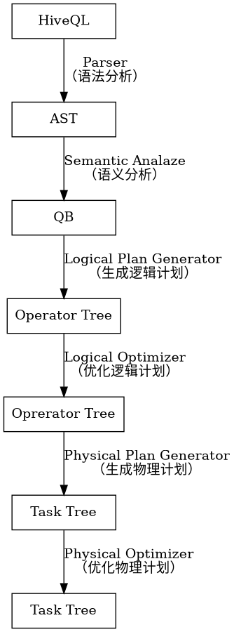

Hive将SQL编译成MR作业的过程分为六个阶段：

1. 语法分析：将SQL转化为AST
2. 语义分析：将AST转化为QueryBlock
3. 生成逻辑计划：将QueryBlock转化为OperatorTree
4. 优化逻辑计划：进行OperatorTree变换，合并不必要的ReduceSinkOperator，减少shuffle数据量
5. 生成物理计划：将OperatorTree转化为MR作业
6. 优化物理计划：进行MR作业变换，生成最终的执行计划

类`org.apache.hadoop.hive.ql.Driver`的`compile()`方法中实现了上述过程，主要代码如下：

```java
private void compile(String command, boolean resetTaskIds, boolean deferClose) throws CommandProcessorResponse {
    String queryStr = command;
    hookRunner.runBeforeParseHook(command);
    ASTNode tree = ParseUtils.parse(command, ctx);  // Context ctx = new Context(conf);
    hookRunner.runBeforeCompileHook(command);
    BaseSemanticAnalyzer sem = SemanticAnalyzerFactory.get(queryState, tree);
    sem.analyze(tree, ctx);
    sem.validate();
    schema = getSchema(sem, conf);
    plan = new QueryPlan(queryStr, sem, perfLogger.getStartTime(PerfLogger.DRIVER_RUN), queryId,
        queryState.getHiveOperation(), schema);
    if (plan.getFetchTask() != null) {
        plan.getFetchTask().initialize(queryState, plan, null, ctx.getOpContext());
    }
}
```

Hive SQL编译相关代码都在包`org.apache.hadoop.hive.ql.parse`中，使用时添加下述依赖即可：

```gradle
// https://mvnrepository.com/artifact/org.apache.hive/hive-exec
compile group: 'org.apache.hive', name: 'hive-exec', version: '2.3.4', classifier: 'core'
```

## 语法分析

Hive使用Antlr完成SQL的词法、语法解析，将输入SQL转化为抽象语法树（AST，Abstract Syntax Tree），由类`org.apache.hadoop.hive.ql.parse.ParseDriver`负责，主要代码为：

```java
public ASTNode parse(String command, Context ctx, String viewFullyQualifiedName) throws ParseException {
    HiveLexerX lexer = new HiveLexerX(new ANTLRNoCaseStringStream(command));
    TokenRewriteStream tokens = new TokenRewriteStream(lexer);
    HiveParser parser = new HiveParser(tokens);
    parser.setTreeAdaptor(adaptor);
    HiveParser.statement_return r = parser.statement();
    ASTNode tree = (ASTNode) r.getTree();
    tree.setUnknownTokenBoundaries();
    return tree;
}
```

HiveQL的语法文件包含词法规则HiveLexer.g和语法规则的4个文件SelectClauseParser.g、FromClauseParser.g、IdentifiersParser.g和HiveParser.g。

## 语义分析

语义分析功能由`BaseSemanticAnalyzer`及其子类实现。AST非常复杂，不够结构化，不方便直接翻译为MapReduce任务。语义分析阶段将AST转化为QueryBlock来将SQL进一步抽象和结构化。

QueryBlock是一条SQL最基本的组成单元，包括三个部分：输入源、计算过程和输出，即一个QueryBlock就是一个子查询，由`QB`类实现。

## 生成逻辑计划

## 优化逻辑计划

## 生成物理计划

## 优化物理计划
