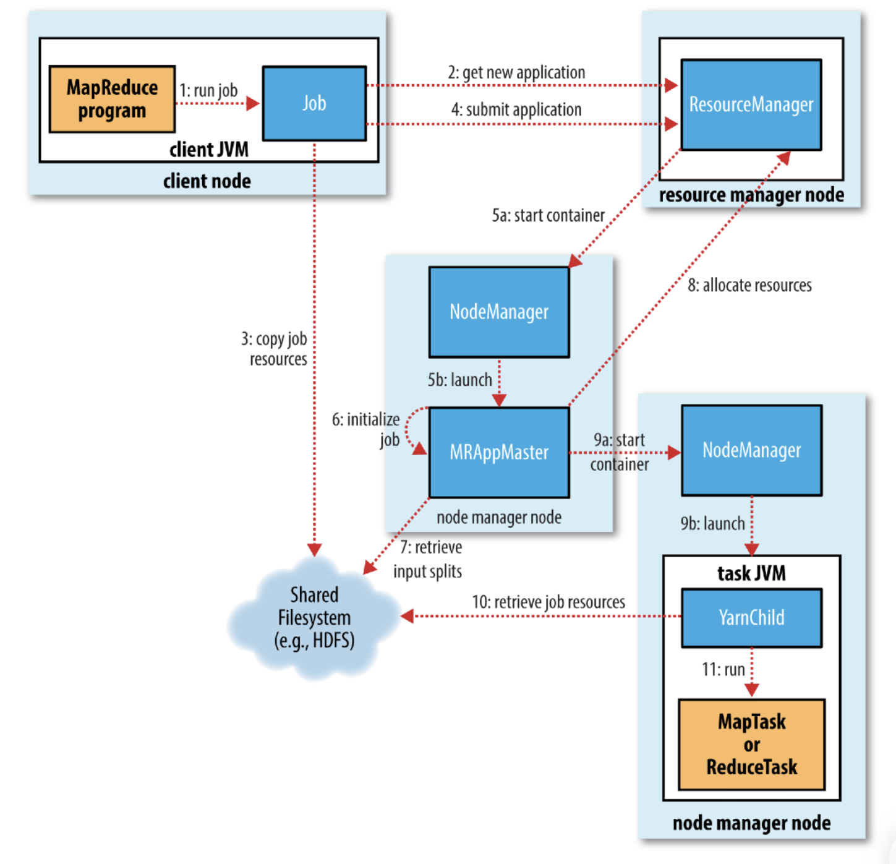

通过调用Job对象的`submit()`或`waitForCompletion()`（提交之前没有提交过的作业并等待它完成，内部调用`submit()`）方法运行MR作业。

MR作业运行过程涉及以下5个实体：

+ 客户端（Client）：提交MR作业
+ YARN资源管理器（YARN Resource Manager）：负责协调集群上计算资源的分配
+ YARN节点管理器（YARN Node Manager）：负责启动和监控集群中机器上的容器
+ Application Master：负责协调运行MR作业的任务。Application Master和MapReduce Task运行在由资源管理器分配、节点管理器管理的容器中
+ 分布式文件系统（Distributed Filesystem）：一般为HDFS，用于在实体间共享作业文件

1. `Job`的`submit()`方法创建一个`JobSubmitter`实例并调用其`submitJobInternal()`方法

2. `JobSubmitter`向资源管理器请求一个新应用ID并将其设置为MR作业的作业ID

3. `JobSubmitter`将运行作业所需要的资源（包括作业JAR文件、配置文件和输入分片）复制到共享系统上一个以作业ID命名的目录下

4. `JobSubmitter`调用资源管理器的`submitJob()`方法提交作业

5. (a) 资源管理器收到调用它的`submitJob()`消息后，将请求传递给YARN调度器（scheduler），调度器分配一个容器
  
  (b) 资源管理器在节点管理器的管理下在容器中启动Application Master进程
6. MR Application Master创建多个对象来接收来自任务的进度和完成报告，进而跟踪作业进度
7. MR Application Master从共享文件系统获取输入分片，为每个分片创建一个map任务对象，并创建属性`mapreduce.job.reduces`指定数目的reduce任务对象
8. MR Application Master为该作业的所有map任务和reduce任务向资源管理器申请容器
9. (a) 资源管理器的调度器为任务分配容器后，MR Application Master与容器所在结点的节点管理器通信启动容器
  
  (b) 节点管理器在单独的JVM中启动`YarnChild`
10. `YarnChild`获取任务运行需要的资源（包括作业的配置、JAR文件和所有来自分布式缓存的文件）
11. `YarnChild`运行map任务或reduce任务

## 作业提交

`Job`的`submit()`方法创建一个`JobSubmitter`实例并调用其`submitJobInternal()`方法。

`JobSubmitter`的`submitJobInternal()`方法实现的作业提交过程为：

1. 向资源管理器请求一个新应用ID并将其设置为MR作业的作业ID

2. 检查作业的输入输出目录

3. 计算作业的输入分片（Input Split），通过调用`InputFormat`的`getSplits()`方法实现

4. 如有需要，为作业使用DistributedCache设置必要的账号信息

5. 将作业所需要的资源（包括作业JAR文件、配置文件和计算得到的输入分片）复制到共享文件系统上一个以作业ID命名的目录下。属性`mapreduce.client.submit.file.replication`设置作业JAR文件的副本数，默认值为0，使用较多的副本数来确保运行作业时，集群中有多个副本可供节点管理器访问

6. 调用资源管理器的`submitJob()`方法提交作业

## 作业初始化

资源管理器收到调用它的`submitJob()`消息后，便将请求传递给YARN调度器（YARN scheduler）。调度器分配一个容器，然后资源管理器在节点管理器的管理下在容器中启动Application Master进程。

MR作业的Application Master是一个Java应用程序，其主类（MainClass）是`MRAppMaster`。MR作业初始化步骤如下：

+ 创建多个对象来接收来自任务的进度和完成报告，进而跟踪作业进度
+ 从共享文件系统获取客户端计算的输入分片
+ 创建和输入分片数目相同的map任务对象以及属性`mapreduce.job.reduces`（可通过`Job`的`setNumReduceTasks()`方法设置）指定数目的reduce任务对象，任务ID在此时分配。
+ 调用`setupJob()`方法设置`OutputCommitter`，默认值为`FileOutputCommitter`，将创建作业的最终输出目录及任务输出的临时工作空间

MR Application Master决定如何运行MR作业的各个任务。与在同一个节点顺序运行这些任务相比，如果在新的容器中分配和运行这些任务的开销大于并行运行它们的收益，MR Application Master将会在同一个JVM中运行这些任务。这被称为uberized，或作为uber任务执行。map任务数少于属性`mapreduce.job.ubertask.maxmaps`指定值（默认为10），reduce任务数少于属性`mapreduce.job.ubertask.maxreduces`指定值（默认为1），并且输入大小小于属性`mapreduce.job.ubertask.maxbytes`指定值（默认为HDFS块大小）的作业在启用uber任务时将以这种方式运行，属性`mapreduce.job.ubertask.enable`用于设置是否启用uber任务，为true时表示启用，可以针对单个作业或整个集群设置。

## 任务分配

如果作业不适合作为uber任务运行，MR Application Master将会为该作业的所有map任务和reduce任务向资源管理器申请容器。

首先为map任务申请容器，直到有5%map任务完成时才开始为reduce任务申请容器，并且map任务的请求优先级高于reduce任务的请求。因为所有的map任务必须在reduce的排序阶段启动前完成。

reduce任务能在集群的任意位置运行，而对于map任务的请求，调度器受到数据本地化（data locality）约束。有三种本地化级别：数据本地化的（data local，即任务在存储其输入数据的节点运行），机架本地化（rack loacl，即任务运行的节点和存储其输入数据的节点在同一个机架），无本地化（任务运行的节点和存储其输入数据的节点不在同一个机架，此时，执行任务的节点需要从别的机架上获取自己的数据）。可以通过作业的计数器查看在每个本地化级别上运行任务的数目。

请求也为任务指定了内存需求和CPU数目。默认每个map任务和reduce任务都分配1024M内存和一个虚拟内核。通过`mapreduce.map.memory.mb`、`mapreduce.reduce.memory.mb`、`mapreduce.map.cpu.vcores`和`mapreduce.reduce.cpu.vcores`四个属性对每个作业进行设置。

## 任务执行

资源管理器的调度器为任务分配一个容器后，MR Application Master通过与容器所在节点的节点管理器通信来启动容器。

任务由主类为`YarnChild`的一个Java应用程序执行。在它运行任务之前首先将任务需要的资源本地化（包括作业的配置、JAR文件和所有来自分布式缓存的文件）。最后，运行map任务或reduce任务。`YarnChile`在指定的JVM中运行，用户定义的map或reduce函数（甚至YarnChild）中的任何异常都不会影响到节点管理器。

每个任务都能够执行搭建（setup）和提交（commit）动作，它们和任务本身在同一个JVM中运行，并由作业的`OutputCommitter`确定。对于基于文件的作业，提交动作将任务输出由临时位置搬移到最终位置。提交协议确保当推测执行被启用时，只有一个任务副本被提交，其他的都被取消。
