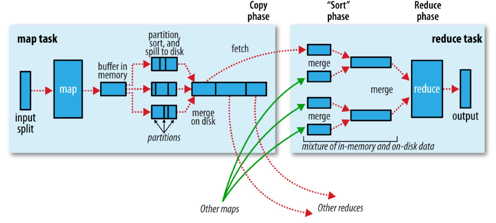

## Map端

系统利用缓冲的方式将map函数的输出写到内存并进行预排序，最后成为磁盘上一个的分区且有序的文件。涉及到的操作主要有溢出（spill）、分区（partiiton）、排序（sort）、combiner、合并（merge）、压缩。

每个map任务都有一个环形内存缓冲区（circular memory buffer）用于存储任务输出，大小由属性`mapreduce.task.io.sort.mb`设置，默认为100MB。当缓冲区内容达到阈值（由属性`mapreduce.map.sort.spill.percent`设置，默认为0.80，或80%）时，一个后台线程便开始把内容溢出（spill）到磁盘。在溢出写到磁盘的过程中，map输出继续写到缓冲区，但如果缓冲区被填满，map会被阻塞直到写磁盘过程完成。溢出写过程按轮询（round-robin）方式将缓冲区中的内容写到属性`mapreduce.cluster.local.dir`设置的目录下作业特定的子目录中。

在写磁盘之前，线程会根据数据最终要传的reducer把数据划分成相应的分区（partition）。在每个分区中，后台线程按键进行内存中排序，如果设置了combiner函数，它就在排序后的输出上运行。运行combiner函数使得map输出结果更紧凑，因此减少写到磁盘的数据和传输给reducer的数据。

每次内存缓冲区达到溢出阈值，就会新建一个溢出文件（spill file），因此在map任务写完其最后一个输出记录之后，会有几个输出文件。在任务完成之前，溢出文件被合并成一个已分区且已排序的输出文件，属性`mapreduce.task.io.sort.factor`设置一次最多合并多少流，默认为10。

如果溢出文件数目达到阈值（由属性`mapreduce.map.combine.minspills`设置，默认为3），则combiner就会在输出文件写到磁盘之前再次运行。否则，由于map输出规模减少，因而不值得调用combiner带来的开销，因此不会为该map输出再次运行combiner。

推荐将map输出写到磁盘时进行压缩，这样会加快写磁盘的速度，节约磁盘空间，并且减少传给reducer的数据量。属性`mapreduce.map.output.compress`设置是否对map输出进行压缩，默认为`false`，即不压缩map输出。另外，属性`mapreduce.map.output.compress.codec`设置压缩时使用的压缩库。

输出文件的分区通过HTTP传给reducer，属性`mapreduce.shuffle.max.threads`设置用于负责传输文件分区的工作线程的最大数目，该属性针对每个节点管理器（node manager），而不是针对每个map任务。默认值为0，表示机器上处理器数目的两倍。

## Reduce端

reduce任务分为三个阶段：复制（copy）、排序（sort）和reduce。

### 复制阶段（copy phase）

reduce任务复制集群上多个map任务输出中属于它的分区。每个map任务的完成时间可能不同，因此每个任务完成时，reduce任务就开始复制其输出。属性`mapreduce.reduce.shuffle.parallelcopies`设置reduce任务用于并行复制map输出的复制线程数目，默认值为5。

map输出小于阈值（属性`mapreduce.reduce.shuffle.input.buffer.percent`设置reduce任务JVM内存用于保存map输出的堆空间的百分比）时会被复制到reduce任务JVM的内存，否则，复制到磁盘。当内存缓冲区达到空间阈值（属性`mapreduce.reduce.shuffle.merge.percent`设置）或达到map输出数目阈值（属性`mapreduce.reduce.merge.inmem.threshold`）时，它将被合并后溢出写到磁盘。如果指定combiner，则会在合并时运行它来减少写到磁盘的数据量。

一个后台线程负责将磁盘上的副本合并成更大的排序文件，来为后面的合并节省时间。压缩的map输出在内存中解压缩后才能进行合并。

由于map任务成功完成后会通过心跳机制通知Application Master，所以，对于一个MR作业，其Application Master知道map输出与主机位置之间的映射关系。reducer中的一个线程定期询问Application Master来获取map输出主机的位置，知道获取所有输出位置。

## 排序阶段（sort phase）

复制完所有map输出后，reduce任务进入排序阶段，以多轮的方式合并map输出（维持其排序），最后一轮直接把数据输入reduce函数（而不是合并成一个单独的排序文件，从而减少了一轮磁盘读写过程）。最后的合并可能是内存和磁盘片段的混合合并。

属性`mapreduce.task.io.sort.factor`设置每轮合并的文件数，默认值为10。但是每轮合并的文件数可能与之不符，目标是合并最小数量的文件以便满足最后一轮的合并系数。比如有40个文件，第一轮只合并4个文件，随后的三轮每轮合并10个文件，最后一轮对4个已合并的文件和余下的6个未合并的文件合计10个文件进行合并。目的是尽量减少写到磁盘的数据量。

## reduce阶段（reduce phase）

对已排序输出中的每个键调用reduce函数，reduce函数的输出直接写到输出文件系统（对于HDFS，由于节点管理器（node manager）也运行着数据节点（datanode），第一个块副本将被写到本地磁盘）。

## shuffle调优

总的原则是为shuffle过程提供尽量多的内存空间，尽量减少磁盘IO以及网络数据传输。但同时要确保map函数和reduce函数能得到足够的内存来运行。所以，写map函数和reduce函数时尽量少用内存。

运行map任务和reduce任务的JVM，其内存大小由属性`mapred.child.java.opts`设置，任务节点上的内存应该尽可能设置的大些。

在map端，可以通过避免多次溢出写磁盘来获得最佳性能。如果能估算map输出大小，就可以合理地设置`mapreduce.task.io.sort.*`属性来尽可能减少溢出写到磁盘的次数，即增加`mapreduce.task.io.sort.mb`的值。MapReduce计数器`SPILLED_RECORDS`计算在任务运行整个阶段中溢出写到磁盘的记录数，包括map和reduce两端的次数。

在reduce端，中间数据全部驻留在内存时，就能获得最佳性能。默认情况下，所有内存一般都预留给reduce函数，如果reduce函数的内存需求不大，把`mapreduce.reduce.merge.inmem.threshold`设置为0，把`mapreduce.reduce.input.buffer.percent`设置为1.0就可以提升性能。

Haoop使用默认的4KB缓冲区，这是很低的，应该在集群中通过属性`io.file.buffer.size`增加这个值。

### map端调优属性

| 属性名称 | 类名 | 默认值 | 描述 |
|---|---|---|---|
|`mapreduce.task.` `io.sort.mb`|`int`|`100`|排序map输出时使用的内存缓冲区大小|
|`mapreduce.map.` `sort.spill.percent`|`float`|`0.80`|执行溢出写过程的map输出缓冲区阈值|
|`mapreduce.task.` `io.sort.factor`|`int`|`10`|排序文件时一次最多合并的流数。常将此值增加到100|
|`mapreduce.map.` `combine.minspills`|`int`|`3`|运行combiner所需的最少溢出文件数|
|`mapreduce.map.` `output.compress`|`Boolean`|`false`|是否压缩map输出|
|`mapreduce.map.` `output.compress.codec`|`ClassName`|`org.apache.` `hadoop.io.` `compress.` `DefaultCodec`|用于map输出的压缩编解码器|
|`mapreduce.shuffle.` `max.threads`|`int`|0|每个节点管理器上负责向reducer传输map输出的工作线程数|

### reduce端调优属性

| 属性名称 | 类型 | 默认值 | 描述 |
|---|---|---|---|
|`mapreduce.reduce.` `shuffle.parallelcopies`|`int`|`5`|reduce任务复制map输出的线程数|
|`mapreduce.reduce.` `shuffle.maxfetchfailures`|`int`|`10`|声明失败前reduce获取map输出的最大尝试次数|
|`mapreduce.task.io.` `sort.factor`|`int`|`10`|排序文件时一次最多合并的流数|
|`mapreduce.reduce.` `shufle.input.buffer.` `percent`|`float`|`0.70`|复制阶段，分配给map输出的缓冲区占堆空间的百分比|
|`mapreduce.reduce.` `shufle.merge.` `percent`|`float`|`0.66`|复制阶段，map输出溢出写到磁盘的缓冲区阈值|
|`mapreduce.reduce.` `merge.inmem.` `threshold`|`int`|`1000`|复制阶段，map输出溢出写到磁盘的map输出数目阈值，0或更小的值表示没有阈值限制|
|`mapreduce.reduce.` `input.buffer.percent`|`float`|`0.0`|reduce阶段，在内存中保存map输出的空间占整个堆空间的比例。reduce阶段开始时，内存中的map输出大小不能超过这个值。默认情况下，在reduce任务开始之前，所有map输出都合并到磁盘上，以便为reducer提供尽可能多的内存。然而，如果reducer需要的内存较少，可以增加此值来最小化访问磁盘的次数|
