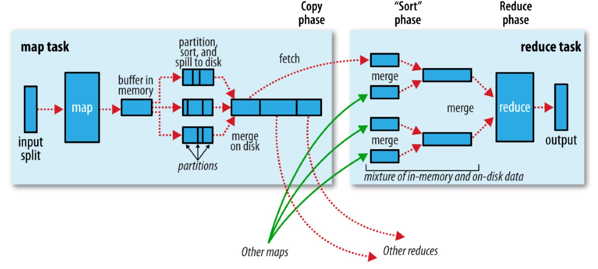
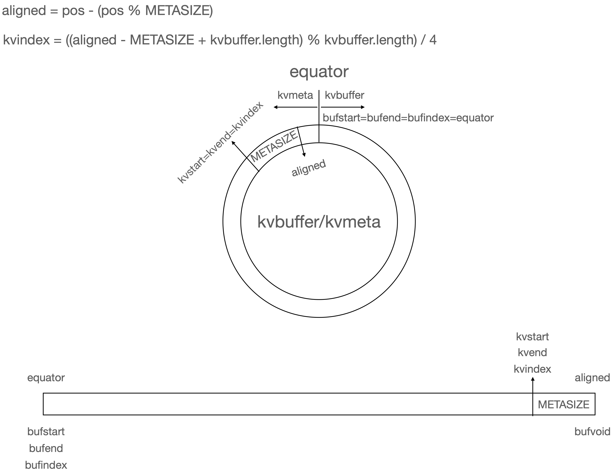

```toc
ordered: true
class-name: "table-of-contents"
```

MapReduce是一种编程模型，用于处理和生成大型数据集，设计灵感来源于Lisp等函数式语言中存在的map和reduce原语，采用分治思想将作业划分成并行运行的任务来缩短作业整体运行时间。用户通过指定map函数和reduce函数来执行并行化、分布式的大规模计算而无须关心并行化、容错、数据分发以及负载均衡等细节。

MapReduce程序将一个键值对集合作为输入，并生成一个键值对集合作为输出。map函数接收输入，并生成一个中间键值对集合；MapReduce框架会将所有共用一个键的值组合在一起，并将它们传递给reduce函数；reduce函数接收一个中间键以及该键的值的集合作为输入（中间值通过一个迭代器^[这样可以处理因为数据量太大而无法存放在内存中的存储值的列表（list）]来传递给用户所编写的Reduce函数），它会将这些值合并在一起，以此来生成一组更小的值的集合。通常每次调用reduce函数所产生的值的结果只有0个或者1个。

## Hadoop MapReduce

MRv1主要由编程模型（MapReduce API）、资源管理与作业控制模块（由JobTracker和TaskTracker组成）和数据处理引擎（由MakTask和ReduceTask组成）三部分组成，存在单点故障、扩展性差等问题。MapReduce On YARN（即MRv2）在编程模型和数据处理引擎方面的实现是一样的，资源管理模块由YARN实现，作业控制模块实现为YARN上的一个ApplicationMaster组件，即MRAppMaster，负责管理MapReduce作业的生命周期，包括作业管理、资源申请与再分配、Container启动与释放、作业恢复等。

### MapReduce作业运行过程

MapReduce作业运行入口为`Job#Submit()`或`Job#waitForCompletion`（提交之前没有提交过的作业并等待它完成，内部调用`submit()`）。

```Java
// 创建一个作业
Job job = Job.getInstance();
job.setJarByClass(MyJob.class);
// 设置作业的各种参数
job.setJobName("myjob");
job.setInputPath(new Path("in"));
job.setOutputPath(new Path("out"));
job.setMapperClass(MyJob.MyMapper.class);
job.setReducerClass(MyJob.MyReducer.class);
// 提交作业
job.submit()      // 或者 job.waitForCompletion(true);
```

MR作业运行过程涉及以下5个组件：

+ 客户端（Client）：提交MR作业
+ YARN资源管理器（YARN Resource Manager）：负责协调集群上计算资源的分配
+ YARN节点管理器（YARN Node Manager）：负责启动和监控集群中机器上的容器
+ Application Master：负责协调运行MR作业的任务。Application Master和MapReduce Task运行在由资源管理器分配、节点管理器管理的容器中
+ 分布式文件系统（Distributed Filesystem）：一般为HDFS，用于在组件间共享作业文件

```bob-svg
.-------------------------------------.                                  .---------------------------.
| client node                         |                                  | resource manager node     |
| .---------------------------------. |                                  | .-----------------------. |
| | client JVM                      | |                                  | | client JVM            | |
| | .---------.             .-----. | |    1.2: get new application      | |   .-----------------. | |
| | |MapReduce|1.1:run job  |     |-+-+----------------------------------+-+-->|                 | | |
| | | program |------------>| Job | | |    1.4: submit application       | |   | ResourceManager | | |
| | |         |             |     |-+-+----------------------------------+-+-->|                 | | |
| | '---------'             '--+--' | |                                  | |   '----+--------+---' | |
| |                            |    | |                                  | |        |        ^     | |
| '----------------------------+----' |                                  | '--------+--------|-----' |
|                              |      |                                  |          |        |       |
'------------------------------+------'                                  '----------+--------+-------'
                               |                             2.1.1: start container |        |
                               |                                  .-----------------'        |
                               |                                  |                          |
                               |              .-------------------|-----.                    |
                               |              | node manager node v     |                    |
                               |              |  .----------------+--.  |                    |
               1.3: copy job   |              |  |    NodeManager    |  |                    |
                    resources  |              |  '----------+--------'  |3: allocate resource|
                               |              |2.1.2:launch |    +------+--------------------'
                               |              |             |    |      |
                               |2.2:initialize|             v    |      |                .-----------------------.
                               |    job       |  .---------------+---.  |                | node manager node     |
                               |    +---------+--+                   |  |4.1.1:start     |  .-------------.      |
                               |    |         |  |    MRAppMaster    +--+----------------|->+ NodeManager |      |
                               |    +---------+->|                   |  |     container  |  '------+------'      |
                               |              |  '----------+--------'  |                |         |             |
                               |              |             |           |                |         |4.1.2:launch |
                               |              '-------------+-----------'                |         v             |
                               v       2.3:retrieve         |                            |  .-----------------.  |
                     .---------+------.    input splits     |                            |  | task JVM        |  |
                     |    Shared      |<--------------------+                            |  |  .-----------.  |  |
                     |  Filesystem    +<-------------------------------------------------+--+--+ YarnChild |  |  |
                     '----------------'            4.2: retrieve job resources           |  |  '-----+-----'  |  |
                                                                                         |  |4.3: run|        |  |
                                                                                         |  |        v        |  |
                                                                                         |  |  .------------. |  |
                                                                                         |  |  |  MapTask   | |  |
                                                                                         |  |  |     or     | |  |
                                                                                         |  |  | ReduceTask | |  |
                                                                                         |  |  '------------' |  |
                                                                                         |  '-----------------'  |
                                                                                         '-----------------------'
```

作业提交运行过程包括以下几个步骤：

1. 作业提交：主要为后续作业执行准备环境，主要涉及创建目录、上传文件等操作
    1. `Job`的`submit()`方法创建一个`JobSubmitter`实例并调用其`submitJobInternal()`方法
    2. `JobSubmitter`向资源管理器请求一个新应用ID并将其设置为MR作业的作业ID
    3. `JobSubmitter`将运行作业所需要的资源（包括作业JAR文件、配置文件和输入分片）复制到共享系统上一个以作业ID命名的目录下
    4. `JobSubmitter`调用资源管理器的`submitJob()`方法提交作业
2. 作业初始化：主要工作是根据输入数据量和作业配置参数将作业分解成若干个Map Task以及Reduce Task，并添加到相关数据结构中，以等待后续被调度执行
    1. 启动MRAppMaster
        1. 资源管理器收到调用它的`submitJob()`消息后，将请求传递给YARN调度器（scheduler），调度器分配一个容器
        2. 资源管理器在节点管理器的管理下在容器中启动MRAppMaster进程
    2. MRAppMaster创建多个对象来接收来自任务的进度和完成报告，进而跟踪作业进度
    3. MRAppMaster从共享文件系统获取输入分片，为每个分片创建一个map任务对象，并创建属性`mapreduce.job.reduces`指定数目的reduce任务对象
3. 分配容器：MRAppMaster为该作业的所有map任务和reduce任务向资源管理器申请容器。首先为Map Task申请容器，直到有5%Map Task完成时才开始为Reduce Task申请容器。
4. 任务执行
    1. 启动YARNChild
        1. 资源管理器的调度器为任务分配容器后，MR Application Master与容器所在结点的节点管理器通信启动容器
        2. 节点管理器在单独的JVM中启动`YarnChild`
    2. `YarnChild`获取任务运行需要的资源（包括作业的配置、JAR文件和所有来自分布式缓存的文件）
    3. `YarnChild`运行map任务或reduce任务

#### 作业提交

```Java
class Job extends JobContextImpl implements JobContext {
    // Job的submit()方法内部调用JobSubmitter实例的submitJobInternal()方法，最终通过调用ClientProtocol的submitJobInternal()方法提交作业
    void submit() {
        /** 根据配置项mapreduce.framework.name通过Java SPI机制加载ClientProtocolProvider和ClientProtocol，默认为LocalClientProtocolProvider和LocalJobRunner
          *
          * hadoop-mapreduce-client-jobclient和hadoop-mapreduce-client-common下目录META-INF/services下的文件org.apache.hadoop.mapreduce.protocol.ClientProtocolProvider，分别为org.apache.hadoop.mapred.LocalClientProtocolProvider和org.apache.hadoop.mapred.YarnClientProtocolProvider
          *
          * Iterable<ClientProtocolProvider> frameworkLoader = ServiceLoader.load(ClientProtocolProvider.class);
          * for (ClientProtocolProvider provider : providerList) {
          *     ClientProtocol clientProtocol = provider.create(conf);
          *     if (clientProtocol != null) {
          *         clientProtocolProvider = provider;
          *         client = clientProtocol;
          *         break;
          *     }
          * }
          * 对于LocalClientProtocolProvider，create()方法为
          * ClientProtocol create(Configuration conf) {
          *     String framework = conf.get(MRConfig.FRAMEWORK_NAME, MRConfig.LOCAL_FRAMEWORK_NAME);
          *     if (!MRConfig.LOCAL_FRAMEWORK_NAME.equals(framework)) {
          *         return null;
          *     }
          *     conf.setInt(JobContext.NUM_MAPS, 1);
          *     return new LocalJobRunner(conf);
          * }
          * 对于YarnClientProtocolProvider，create()方法为
          * ClientProtocol create(Configuration conf) {
          *     if (MRConfig.YARN_FRAMEWORK_NAME.equals(conf.get(MRConfig.FRAMEWORK_NAME))) {
          *         return new YARNRunner(conf);
          *     }
          *     return null;
          * }
          */
        connect();
        JobSubmitter submitter = getJobSubmitter(cluster.getFileSystem(), cluster.getClient());
        submitter.submitJobInternal(Job.this, cluster);
    }
}

class JobSubmitter {
    FileSystem jtFs;
    ClientProtocol submitClient;          // 客户端实例
    /**
      * 作业提交过程包含以下几个部分
      * + 向资源管理器请求一个新应用ID并将其设置为MR作业的作业ID
      * + 检查作业的输入输出目录
      * + 计算作业的输入分片（Input Split），通过调用`InputFormat`的`getSplits()`方法实现
      * + 如有需要，为作业使用DistributedCache设置必要的账号信息
      * + 将作业所需要的资源（包括作业JAR文件、配置文件和计算得到的输入分片）复制到共享文件系统上一个以作业ID命名的目录下
      * + 调用资源管理器的`submitJob()`方法提交作业
      */
    JobStatus submitJobInternal(Job job, Cluster cluster) {
        // 检查输出目录
        checkSpecs(job);

        Configuration conf = job.getConfiguration();
        // 作业工作目录 ${mapreduce.jobtracker.staging.root.dir}/<user>/.staging
        // 配置项mapreduce.jobtracker.staging.root.dir默认值为/tmp/hadoop/mapred/staging
        Path jobStagingArea = JobSubmissionFiles.getStagingDir(cluster, conf);

        // 向资源管理器请求一个新应用ID并将其设置为MapReduce作业ID
        JobID jobId = submitClient.getNewJobID();
        job.setJobID(jobId);

        Path submitJobDir = new Path(jobStagingArea, jobId.toString());  // ${mapreduce.jobtracker.staging.root.dir}/<user>/.staging/<jobId>

        // 检查作业工作目录是否存在并复制作业所需要的资源
        /**
          * 获取资源副本副本数
          * short replication = (short) conf.getInt(Job.SUBMIT_REPLICATION, Job.DEFAULT_SUBMIT_REPLICATION);
          * 通过命令行参数添加的资源
          * Collection<String> files = conf.getStringCollection("tmpfiles");
          * Collection<String> libjars = conf.getStringCollection("tmpjars");
          * Collection<String> archives = conf.getStringCollection("tmparchives");
          * String jobJar = job.getJar();
          * 通过Job API添加的资源
          * files.addAll(conf.getStringCollection(MRJobConfig.FILES_FOR_SHARED_CACHE));
          * libjars.addAll(conf.getStringCollection(MRJobConfig.FILES_FOR_CLASSPATH_AND_SHARED_CACHE));
          * archives.addAll(conf.getStringCollection(MRJobConfig.ARCHIVES_FOR_SHARED_CACHE));
          * 复制作业所需资源
          * uploadFiles(job, files, submitJobDir, mapredSysPerms, replication, fileSCUploadPolicies, statCache);
          * uploadLibJars(job, libjars, submitJobDir, mapredSysPerms, replication, fileSCUploadPolicies, statCache);
          * uploadArchives(job, archives, submitJobDir, mapredSysPerms, replication, archiveSCUploadPolicies, statCache);
          * uploadJobJar(job, jobJar, submitJobDir, replication, statCache);
          * addLog4jToDistributedCache(job, submitJobDir);
          */
        copyAndConfigureFiles(job, submitJobDir);
        // 作业配置文件
        Path submitJobFile = JobSubmissionFiles.getJobConfPath(submitJobDir);    // ${mapreduce.jobtracker.staging.root.dir}/<user>/.staging/<jobId>/job.xml
        // 计算作业输入分片
        /**
          * InputFormat<?, ?> input = ReflectionUtils.newInstance(job.getInputFormatClass(), conf);
          * List<InputSplit> splits = input.getSplits(job);
          * T[] array = (T[]) splits.toArray(new InputSplit[splits.size()]);
          * // 基于数据量对分片进行排序，优先处理数据量大的
          * Arrays.sort(array, new SplitComparator());
          * JobSplitWriter.createSplitFiles(jobSubmitDir, conf, jobSubmitDir.getFileSystem(conf), array);
          *
          * // createSplitFiles逻辑
          * FSDataOutputStream out = createFile(fs, JobSubmissionFiles.getJobSplitFile(jobSubmitDir), conf);
          * SplitMetaInfo[] info = writeNewSplits(conf, splits, out);
          * out.close();
          * writeJobSplitMetaInfo(fs,JobSubmissionFiles.getJobSplitMetaFile(jobSubmitDir), new FsPermission(JobSubmissionFiles.JOB_FILE_PERMISSION), splitVersion, info);
          */
        int maps = writeSplits(job, submitJobDir);
        /** 保存作业配置文件job.xml
          * FSDataOutputStream out = FileSystem.create(jtFs, jobFile, new FsPermission(JobSubmissionFiles.JOB_FILE_PERMISSION));
          * conf.writeXml(out);
          */
        writeConf(conf, submitJobFile);
        // 提交作业 最后调用资源管理器（LocalJobRunner、YARNRunner等）的submitJob()方法提交作业
        JobStatus status = submitClient.submitJob(jobId, submitJobDir.toString(), job.getCredentials());
        return status;
    }
}

class YARNRunner implements ClientProtocol {

    ResourceMgrDelegate resMgrDelegate;      // 资源管理器客户端句柄（YarnClient子类） new ResourceMgrDelegate(new YarnConfiguration(conf))
    ClientCache clientCache;                 // Hadoop IPC RPC类中对请求的客户端缓存类 new ClientCache(conf, resMgrDelegate)

    JobStatus submitJob(JobID jobId, String jobSubmitDir, Credentials ts) {
        ApplicationSubmissionContext appContext = createApplicationSubmissionContext(conf, jobSubmitDir, ts);
        ApplicationId applicationId = resMgrDelegate.submitApplication(appContext);     // 调用YarnClientImpl的submitApplication()方法
        ApplicationReport appMaster = resMgrDelegate.getApplicationReport(applicationId);
        return clientCache.getClient(jobId).getJobStatus(jobId);
    }
}
```

**文件上传** MapReduce作业文件的上传与下载是由DistributedCache工具完成，对于一个典型的MapReduce作业，可能包含以下资源^[支持HDFS文件，以`hdfs://...`格式指定文件路径即可]。另外，作业文件上传到HDFS后，可能会有大量节点同时从HDFS上下载这些文件，进而产生文件访问热点现象，造成性能瓶颈，可以通过配置项`mapreduce.client.submit.file.replication`（默认为10）设置作业文件的副本数以通过分摊负载方式避免产生访问热点。

```bob-svg
"${mapreduce.jobtracker.staging.root.dir}/<user>/.staging/<JobId>"
 ├── "archives/"                            # 依赖的归档文件
 ├── "files/"                                # 依赖的普通文件
 ├── "<appJar>"                             # 程序jar包
 ├── job.split                                 # InputSplit信息
 ├── job.splitmetainfo                           # InputSplit元数据信息
 ├── job.xml                                 # 作业配置文件
 └── "libjars/"                                # 依赖的第三方jar包
```

**计算输入分片** 调用`InputFormat#getSplits()`方法生成InputSplit元数据信息和原始InputSplit信息，InputSplit元数据信息用于生成Task本地性相关的数据结构，原始InputSplit信息则被Map Task初始化时使用，用以获取自己要处理的数据。InputFormat类主要用于数据分割（Data splits，定义了单个Map任务处理数据量及其可能的执行服务器信息）和记录读取（Record reader，从输入文件读取数据并将它们以键值对的形式提交给Mapper）。

```Java
abstract class FileInputFormat<K, V> extends InputFormat<K, V> {
    List<InputSplit> getSplits(JobContext job) {
        // 分片大小最小值，取文件格式分片最小值（默认是1）和作业设置的分片最小值（配置项mapreduce.input.fileinputformat.split.minsize设置，默认是1）中较大值
        long minSize = Math.max(getFormatMinSplitSize(), getMinSplitSize(job));
        // 分片大小最大值，配置项mapreduce.input.fileinputformat.split.maxsize设置，默认是Long.MAX_VALUE
        long maxSize = getMaxSplitSize(job);

        // 生成分片

        List<InputSplit> splits = new ArrayList<InputSplit>();
        // 获取输入文件，配置项mapreduce.input.fileinputformat.inputdir设置，配置项mapreduce.input.fileinputformat.input.dir.recursive设置是否递归遍历子目录
        List<FileStatus> files = listStatus(job);

        boolean ignoreDirs = !getInputDirRecursive(job) && job.getConfiguration().getBoolean(INPUT_DIR_NONRECURSIVE_IGNORE_SUBDIRS, false);
        for (FileStatus file: files) {
            if (ignoreDirs && file.isDirectory()) {
                continue;
            }
            Path path = file.getPath();
            long length = file.getLen();
            if (length != 0) {
                // 获取文件各个块的位置
                BlockLocation[] blkLocations;
                if (file instanceof LocatedFileStatus) {
                    blkLocations = ((LocatedFileStatus) file).getBlockLocations();
                } else {
                    FileSystem fs = path.getFileSystem(job.getConfiguration());
                    blkLocations = fs.getFileBlockLocations(file, 0, length);
                }

                if (isSplitable(job, path)) {
                    // 对于可切分文件，按照分片大小（Math.max(minSize, Math.min(maxSize, blockSize))）分割文件
                    // makeSplit(path, start, length, hosts, inMemoryHosts)中创建并返回FileSplit（InputSplit子类）
                    long blockSize = file.getBlockSize();
                    long splitSize = computeSplitSize(blockSize, minSize, maxSize);

                    long bytesRemaining = length;
                    while (((double) bytesRemaining)/splitSize > SPLIT_SLOP) {  // 超过分片大小1.1倍时才分片处理，直到文件小于分片大小1.1倍
                        int blkIndex = getBlockIndex(blkLocations, length-bytesRemaining);
                        splits.add(makeSplit(path, length-bytesRemaining, splitSize, blkLocations[blkIndex].getHosts(), blkLocations[blkIndex].getCachedHosts())); bytesRemaining -= splitSize;
                    }
                    // 余下部分单独作为一个分片
                    if (bytesRemaining != 0) {
                        int blkIndex = getBlockIndex(blkLocations, length-bytesRemaining);
                        splits.add(makeSplit(path, length-bytesRemaining, bytesRemaining, blkLocations[blkIndex].getHosts(), blkLocations[blkIndex].getCachedHosts()));
                    }
                 } else {
                    // 对于不可切分文件，将整个文件作为一个分片
                    splits.add(makeSplit(path, 0, length, blkLocations[0].getHosts(), blkLocations[0].getCachedHosts()));
                }
            } else { 
                // 对空文件创建空hosts
                splits.add(makeSplit(path, 0, length, new String[0]));
            }
        }

        job.getConfiguration().setLong(NUM_INPUT_FILES, files.size());
        return splits;
    }
}
```

#### 作业初始化

```Java
class YarnClientImpl extends YarnClient {

    ApplicationId submitApplication(ApplicationSubmissionContext appContext) {
        ApplicationId applicationId = appContext.getApplicationId();
        SubmitApplicationRequest request = (SubmitApplicationRequest)Records.newRecord(SubmitApplicationRequest.class);
        request.setApplicationSubmissionContext(appContext);

        this.rmClient.submitApplication(request);
        int pollCount = 0;
        EnumSet<YarnApplicationState> waitingStates = EnumSet.of(YarnApplicationState.NEW, YarnApplicationState.NEW_SAVING, YarnApplicationState.SUBMITTED);
        EnumSet failToSubmitStates = EnumSet.of(YarnApplicationState.FAILED, YarnApplicationState.KILLED);

        while(true) {
            while(true) {
                    try {
                        ApplicationReport appReport = this.getApplicationReport(applicationId);
                        YarnApplicationState state = appReport.getYarnApplicationState();
                        if (!waitingStates.contains(state)) {
                            if (failToSubmitStates.contains(state)) {
                                throw new YarnException("Failed to submit " + applicationId + " to YARN : " + appReport.getDiagnostics());
                            }

                            LOG.info("Submitted application " + applicationId);
                            return applicationId;
                        }

                        long elapsedMillis = System.currentTimeMillis() - startTime;
                        if (this.enforceAsyncAPITimeout() && elapsedMillis >= this.asyncApiPollTimeoutMillis) {
                            throw new YarnException("Timed out while waiting for application " + applicationId + " to be submitted successfully");
                        }

                        ++pollCount;
                        if (pollCount % 10 == 0) {
                            LOG.info("Application submission is not finished, submitted application " + applicationId + " is still in " + state);
                        }

                        try {
                            Thread.sleep(this.submitPollIntervalMillis);
                        } catch (InterruptedException var15) {
                            String msg = "Interrupted while waiting for application " + applicationId + " to be successfully submitted.";
                            LOG.error(msg);
                            throw new YarnException(msg, var15);
                        }
                    } catch (ApplicationNotFoundException var16) {
                        LOG.info("Re-submit application " + applicationId + "with the same ApplicationSubmissionContext");
                        this.rmClient.submitApplication(request);
                    }
                }
            }
        }
    }
}
```

资源管理器收到调用它的`submitJob()`消息后，便将请求传递给YARN调度器（YARN scheduler）。调度器分配一个容器，然后资源管理器在节点管理器的管理下在容器中启动Application Master进程。

MR作业的Application Master是一个Java应用程序，其主类（MainClass）是`MRAppMaster`。MR作业初始化步骤如下：

+ 创建多个对象来接收来自任务的进度和完成报告，进而跟踪作业进度
+ 从共享文件系统获取客户端计算的输入分片
+ 创建和输入分片数目相同的map任务对象以及属性`mapreduce.job.reduces`（可通过`Job`的`setNumReduceTasks()`方法设置）指定数目的reduce任务对象，任务ID在此时分配。
+ 调用`setupJob()`方法设置`OutputCommitter`，默认值为`FileOutputCommitter`，将创建作业的最终输出目录及任务输出的临时工作空间

MR Application Master决定如何运行MR作业的各个任务。与在同一个节点顺序运行这些任务相比，如果在新的容器中分配和运行这些任务的开销大于并行运行它们的收益，MR Application Master将会在同一个JVM中运行这些任务。这被称为uberized，或作为uber任务执行。map任务数少于属性`mapreduce.job.ubertask.maxmaps`指定值（默认为10），reduce任务数少于属性`mapreduce.job.ubertask.maxreduces`指定值（默认为1），并且输入大小小于属性`mapreduce.job.ubertask.maxbytes`指定值（默认为HDFS块大小）的作业在启用uber任务时将以这种方式运行，属性`mapreduce.job.ubertask.enable`用于设置是否启用uber任务，为true时表示启用，可以针对单个作业或整个集群设置。

#### 任务分配

如果作业不适合作为uber任务运行，MR Application Master将会为该作业的所有map任务和reduce任务向资源管理器申请容器。

首先为map任务申请容器，直到有 5%^[配置项`mapreduce.job.reduce.slowstart.completedmaps`指定，默认值0.05] map任务完成时才开始为reduce任务申请容器，并且map任务的请求优先级高于reduce任务的请求。因为所有的map任务必须在reduce的排序阶段启动前完成。reduce任务能在集群的任意位置运行，而对于map任务的请求，调度器受到数据本地化（data locality）约束。有三种本地化级别：数据本地化（data local，即任务在存储其输入数据的节点运行），机架本地化（rack loacl，即任务运行的节点和存储其输入数据的节点在同一个机架），无本地化（任务运行的节点和存储其输入数据的节点不在同一个机架，此时，执行任务的节点需要从别的机架上获取自己的数据）。可以通过作业的计数器查看在每个本地化级别上运行任务的数目。

请求也为任务指定了内存需求和CPU数目。默认每个map任务和reduce任务都分配1024M内存和一个虚拟内核。通过`mapreduce.map.memory.mb`、`mapreduce.reduce.memory.mb`、`mapreduce.map.cpu.vcores`和`mapreduce.reduce.cpu.vcores`四个属性对每个作业进行设置。

#### 任务执行

资源管理器的调度器为任务分配一个容器后，MR Application Master通过与容器所在节点的节点管理器通信来启动容器。任务由主类为`YarnChild`的一个Java应用程序执行。在它运行任务之前首先将任务需要的资源本地化（包括作业的配置、JAR文件和所有来自分布式缓存的文件）。最后，运行map任务或reduce任务。`YarnChile`在指定的JVM中运行，用户定义的map或reduce函数（甚至YarnChild）中的任何异常都不会影响到节点管理器。

每个任务都能够执行设置（setup）和提交（commit）动作，它们和任务本身在同一个JVM中运行，并由作业的`OutputCommitter`确定。对于基于文件的作业，提交动作将任务输出由临时位置搬移到最终位置。提交协议确保当推测执行被启用时，只有一个任务副本被提交，其他的都被取消。

#### 进度和状态更新

作业和它的每个任务都拥有状态数据，包括作业或任务的执行状态（running、successfully completed、failed）、map和reduce进度、作业计数器（counter）的值、状态信息（或描述）。当任务运行时，它将跟踪自己的进度（对于map任务为已处理的输入数据比例，对于reduce任务分为copy phase、sort phase、reduce phase三个阶段，各占1/3，各阶段内再按照已处理输入数据比例度量）。map或reduce任务运行时，通过umbilical接口向其application master报告进度和状态（包括计数器），application master进而汇总作业的状态数据。

Resource Manager Web UI显示所有运行应用及其对应Application Master Web UI的链接，Application Master Web UI页面显示MapReduce作业的更详细数据。

作业执行期间，客户端每秒^[配置项mapreduce.client.progressmonitor.pollinterval指定]从Application Master获取最新状态，客户端也可以使用`Job#getStatus()`方法获取JobStatus实例（包含了作业的所有状态数据）。

#### 作业完成

当Application Master收到作业最后一个任务完成的通知时，它将作业的状态置为成功。当Job拉取状态时将得知已成功完成，接着向用户打印信息并从`waitForCompletion()`方法中返回，作业的统计数据和计数器此时将输出到控制台。也可以通过在客户端设置`mapreduce.job.end-notification.url`让Application Master发送HTTP作业通知。作业完成后，Application Master和任务container清理工作状态（如删除中间结果），并调用`OutputCommitter#commitJob()`方法。Job History Server打包作业信息以供后续查看。

### 容错

**Task Failure** 当Application Master被通知一个任务尝试失败时，它将重新调度执行对应任务。配置项`mapreduce.map.maxattempts`设置map任务最大尝试次数，配置项`mapreduce.reduce.maxattempts`设置reduce任务最大尝试次数，超过最大尝试次数（默认为4）时，整个作业将失败^[被杀的任务尝试不计入任务失败次数]。任务失败存在以下情形
+ 当map/reduce任务中的用户代码抛出运行时异常时，任务将在JVM退出前向其Application Master报告错误信息，错误最后将输出到用户日志中。Application Master标记任务尝试（task attempt）为失败，并且释放容器（Container）^[对于Hadoop Streaming任务，Streaming进程退出码非0时将被标记为失败，由配置项`stream.non.zero.exit.is.failure`设置，默认为true]
+ 当任务所在的JVM异常退出时，Node Manager发现进程退出后将通知Application Master，Application Master将任务尝试标记为失败
+ 任务挂起（hanging）时，Application Master一段时间内（由配置项`mapreduce.task.timeout`设置，默认为10min^[为0时将禁用超时，长时间运行的任务将永不被标记为失败]）没有收到进度更新将标记任务为失败，之后任务所在的JVM将被自动杀掉。

配置项`mapreduce.map.failures.maxpercent`/`mapreduce.reduce.failures.maxpercent`设置标记整个任务失败时map/reduce任务的失败率阈值。

**Application Master Failure** Application Master向资源管理器周期性发送心跳，所以资源管理器可以检测到Application Master失败，此时将在新容器中启动新的Application Master实例，新Application Master将使用作业历史恢复任务状态而无需重新运行它们（配置项`yarn.app.mapreduce.am.job.recovery.enable`设置是否恢复任务，默认为true）。对于客户端，Application Master失败时，其拉取进度报告时会发生超时，此时其将向资源管理器请求新Application Master的地址^[作业初始化时，客户端将向资源管理器请求Application Master地址并缓存起来]。配置项`yarn.resoucemanager.am.max-attempts`设置Application Master失败的最大次数，默认为2

**Node Manager Failure** 节点管理器因故障失败或运行非常慢时，将停止向资源管理器发送心跳（或以极低的频率发送），资源管理器在一段时间内（配置项`yarn.resourcemanager.nm.liveness-monitor.expiry-interval-ms`设置，默认为10m）未收到节点管理器心跳时将通知该节点管理器已停止发送心跳并将其从它用来调度容器的节点池中移除。失败节点上运行的任务或Application Master都将按照前述方式恢复。另外，对于未完成作业，由于reduce任务无法获取失败节点管理器上运行成功的map任务存储在该节点本地文件系统的中间结果，Application Master将安排这些map任务重新运行

**Resource Manager Failure** 资源管理器失败是单点故障，所有运行中的作业都将失败并无法恢复。为了实现高可用性，需要以主备配置方式运行一对资源管理器，一旦主资源管理器失败，备用资源管理器立即接管。所有运行中应用的信息都存储在高可用状态存储中（ZooKeeper或HDFS），所以备用资源管理器可以恢复失败的主资源管理器的核心状态。节点管理器信息并未保存在状态存储中，但是当节点管理器向新资源管理器发送心跳时，新的资源管理器可以立即重新构建其信息。当新的资源管理器启动时，它将从状态存储中读取应用信息，然后重启所有集群上运行应用的Application Master。客户端和Node Manager必须被设置成处理资源管理器失败，它们将以轮询方式尝试连接每个资源管理器直到发现活跃的一个。如果活跃的失败了，它们将重试直到备用的变活跃

### Shuffle

Shuffle是指系统执行排序、将map输出作为输入传给reducer的过程。MapReduce通过Shuffle确保每个reducer的输入都是按键排序的。



#### Map端

系统利用缓冲的方式将map函数的输出写到内存并进行预排序，最后成为磁盘上一个的分区且有序的文件。涉及到的操作主要有溢出（spill）、分区（partiiton）、排序（sort）、combiner、合并（merge）、压缩。

每个map任务都有一个环形内存缓冲区（circular memory buffer）用于存储任务输出，大小由属性`mapreduce.task.io.sort.mb`设置，默认为100MB。当缓冲区内容达到阈值（由属性`mapreduce.map.sort.spill.percent`设置，默认为0.80，或80%）时，一个后台线程便开始把内容溢出（spill）到磁盘。在溢出写到磁盘的过程中，map输出继续写到缓冲区，但如果缓冲区被填满，map会被阻塞直到写磁盘过程完成。溢出写过程按轮询（round-robin）方式将缓冲区中的内容写到属性`mapreduce.cluster.local.dir`设置的目录下作业特定的子目录中。

在写磁盘之前，线程会根据数据最终要传的reducer把数据划分成相应的分区（partition）。在每个分区中，后台线程按键进行内存中排序，如果设置了combiner函数，它就在排序后的输出上运行。运行combiner函数使得map输出结果更紧凑，因此减少写到磁盘的数据和传输给reducer的数据。

每次内存缓冲区达到溢出阈值，就会新建一个溢出文件（spill file），因此在map任务写完其最后一个输出记录之后，会有几个输出文件。在任务完成之前，溢出文件被合并成一个已分区且已排序的输出文件，属性`mapreduce.task.io.sort.factor`设置一次最多合并多少流，默认为10。

如果溢出文件数目达到阈值（由属性`mapreduce.map.combine.minspills`设置，默认为3），则combiner就会在输出文件写到磁盘之前再次运行。否则，由于map输出规模减少，因而不值得调用combiner带来的开销，因此不会为该map输出再次运行combiner。

推荐将map输出写到磁盘时进行压缩，这样会加快写磁盘的速度，节约磁盘空间，并且减少传给reducer的数据量。属性`mapreduce.map.output.compress`设置是否对map输出进行压缩，默认为`false`，即不压缩map输出。另外，属性`mapreduce.map.output.compress.codec`设置压缩时使用的压缩库。

输出文件的分区通过HTTP传给reducer，属性`mapreduce.shuffle.max.threads`设置用于负责传输文件分区的工作线程的最大数目，该属性针对每个节点管理器（node manager），而不是针对每个map任务。默认值为0，表示机器上处理器数目的两倍。

#### Reduce端

reduce任务分为三个阶段：复制（copy）、排序（sort）和reduce。

**复制阶段（copy phase）** reduce任务复制集群上多个map任务输出中属于它的分区。每个map任务的完成时间可能不同，因此每个任务完成时，reduce任务就开始复制其输出。属性`mapreduce.reduce.shuffle.parallelcopies`设置reduce任务用于并行复制map输出的复制线程数目，默认值为5。

map输出小于阈值（属性`mapreduce.reduce.shuffle.input.buffer.percent`设置reduce任务JVM内存用于保存map输出的堆空间的百分比）时会被复制到reduce任务JVM的内存，否则，复制到磁盘。当内存缓冲区达到空间阈值（属性`mapreduce.reduce.shuffle.merge.percent`设置）或达到map输出数目阈值（属性`mapreduce.reduce.merge.inmem.threshold`）时，它将被合并后溢出写到磁盘。如果指定combiner，则会在合并时运行它来减少写到磁盘的数据量。

一个后台线程负责将磁盘上的副本合并成更大的排序文件，来为后面的合并节省时间。压缩的map输出在内存中解压缩后才能进行合并。

由于map任务成功完成后会通过心跳机制通知Application Master，所以，对于一个MR作业，其Application Master知道map输出与主机位置之间的映射关系。reducer中的一个线程定期询问Application Master来获取map输出主机的位置，知道获取所有输出位置。

**排序阶段（sort phase）** 复制完所有map输出后，reduce任务进入排序阶段，以多轮的方式合并map输出（维持其排序），最后一轮直接把数据输入reduce函数（而不是合并成一个单独的排序文件，从而减少了一轮磁盘读写过程）。最后的合并可能是内存和磁盘片段的混合合并。

属性`mapreduce.task.io.sort.factor`设置每轮合并的文件数，默认值为10。但是每轮合并的文件数可能与之不符，目标是合并最小数量的文件以便满足最后一轮的合并系数。比如有40个文件，第一轮只合并4个文件，随后的三轮每轮合并10个文件，最后一轮对4个已合并的文件和余下的6个未合并的文件合计10个文件进行合并。目的是尽量减少写到磁盘的数据量。

** reduce阶段（reduce phase）** 对已排序输出中的每个键调用reduce函数，reduce函数的输出直接写到输出文件系统（对于HDFS，由于节点管理器（node manager）也运行着数据节点（datanode），第一个块副本将被写到本地磁盘）。

### Task执行

**作业信息** Hadoop向Map/Reduce任务提供其运行环境的信息（如正在处理的文件名），可以通过Mapper或Reducer方法的context参数获取这些信息^[对于Hadoop Streaming程序，Hadooop将运行环境信息设置为环境变量（替换其中的非数字字母字符为下划线），也可以通过向Streaming加载程序提供`-cmdenv`选项设置环境变量]。

+ `mapreduce.job.id`：类型为String，作业ID^[Application ID格式为`application_<ts>_<counter>`（ts为资源管理器启动毫秒时间戳，counter是从1开始的序号，用0补齐4位），Job ID格式为`job_<ts>_<counter>`，Task ID格式为`task_<ts>_<counter>_m/r_<task_counter>`（task_counter是从0开始的序号，表示任务创建顺序，与启动顺序无关），Attempt ID格式为`attempt_<ts>_<counter>_m/r_<task_counter>_<attempt_counter>`（attempt_count为从0开始的序号，表示attempt启动顺序）]
+ `mapreduce.task.id`：类型为String，任务ID
+ `mapreduce.task.attempt.id`：类型为String，任务尝试ID
+ `mapreduce.task.partition`：类型为int，任务在作业中的索引
+ `mapreduce.task.ismap`：类型为boolean，是否是map任务

**推测执行（speculative execution）** 落伍者（运行较慢的任务）将影响整个作业的运行时间，Hadoop检测到任务运行慢于预期时将启动等价任务作为备用，被称为推测执行。推测执行并不是同时启动两个重复任务，而是调度器（scheduler）跟踪作业中所有同类型任务的进度，仅对其中显著慢于平均水平的一小部分任务启动推测任务，其中一个任务成功时，任何运行中的重复任务都被杀掉。推测执行有以下配置项
+ `mapreduce.map.speculative`：类型为boolean，是否为map任务启用推测执行，默认为true
+ `mapreduce.reduce.speculative`：类型为boolen，是否为redece任务启用推测执行，默认为true
+ `yarn.app.mapreduce.am.job.speculator.class`：类型为Class，指定实现推测执行的Speculator类，默认为`org.apache.hadoop.mapreduce.v2.app.speculate.DefaultSpeculator`
+ `yarn.app.mapreduce.am.job.task.estimator.class`：类型为Class，Speculator实例使用的TaskRuntimeEstimator实现，用于估算任务运行时间

**Output Committer** Hadoop MapReduce通过OutputCommitter保证作业/任务都完全成功或失败，OutputCommitter通过配置项`mapred.output.committer.class`设置，通过OutputFormat的`getOutputCommitter()`方法获取，默认是`FileOutputCommitter`，适用于所有输出为文件的MapReduce。可以自定义已存在的OutputCommitter或编写新的实现来对作业或任务做自定义设置或清理。`OutputCommitter#setupJob()`方法在作业运行前调用，一般用于初始化，对于FileOutputCommitter，创建最终输出目录（`${mapreduce.output.fileoutputformat.outputdir}`）以及用于任务输出的临时工作空间（最终输出目录下的`_temporary`子目录）。作业成功时，调用`commitJob()`方法，对于FileOutputCommitter，删除临时工作空间并在输出目录中创建隐藏的空标记文件（`_SUCCESS`）来表示作业成功执行。作业失败或被杀时，用一个表示作业失败或被杀的状态对象调用`abortJob()`方法，默认实现将删除作业的临时工作空间。对于任务，也有类似操作，`setupTask()`方法在任务运行前调用，默认实现不做任何处理，在任务进行输出时才创建用于存储的临时目录。任务的commit阶段是可选的，可通过在`needsTaskCommit()`方法中返回`false`来禁止。对于FileOutputCommitter，任务没有输出时将跳过commit阶段。任务成功时，调用`commitTask()`方法，默认实现将移动任务输出临时目录^[任务输出临时目录名称中包含了任务尝试ID来避免任务尝试冲突]到最终输出目录。任务失败或被杀时，调用`abortTask()`方法，默认实现删除任务输出临时目录。框架保证对于同一个任务的多个尝试仅有一个进行提交，其他都将中止。

    ```Java
    public abstract class OutputCommitter {
        public abstract void setupJob(JobContext jobContext) throws IOException;
        public void commitJob(JobContext jobContext) throws IOException {}
        public void abortJob(JobContext jobContext, JobStatus.State state) throws IOException {}
        public abstract void setupTask(TaskAttemptContext taskContext) throws IOException;
        public abstract boolean needsTaskCommit(TaskAttemptContext taskContext) throws IOException;
        public abstract void commitTask(TaskAttemptContext taskContext) throws IOException;
        public abstract void abortTask(TaskAttemptContext taskContext) throws IOException;
    }
    ```

**任务副作用文件（Task side-effect files）** map或reduce任务一般通过OutputCollector以键值对形式输出结果，也可以直接在HDFS等分布式文件系统中直接写入输出文件。任务可以通过作业配置的`mapreduce.task.output.dir`属性获取工作目录，对于MapReduce Java程序，也可以通过FileOutputFormat的静态方法`getWorkOutputPath()`获取表示工作目录的Path对象。OutputCommitter协议保证同个任务的多个实例不会写入同个文件，任务成功时其在工作目录中创建的副作用文件将会自动移动到输出目录，否则其副作用文件将被删除。

### 类型和格式

### 具体实现

```bob-svg
                                                            .------.
                                                            | HDFS |
                                                            '---+--'
                                                                ^
                                                                |
                                  .-----------------------------+--------------------------------------.
                                  |                             |                                      |
                                  |                     .-------+------.                               |
        .----------.              |                     |  JobHistory  |              .-------------.  | TaskUmbilical .-------.
        | Resource | AMRMProtocol |  .-----------.      | EventHandler |       +------+ TaskAttempt |<-+---------------+ Tasks |
        | Manager  +<-------------+--+ Container |      '-------+------'       |      |  Listener   |  |    Protocol   '-------'
        '----------'              |  | Allocator +<---------+   ^    +---------+      '-------------'  |
                                  |  '-----------'          |   |    |                .-----------.    | Container  .---------.
                                  |                         v   |    v         +----->+ Container +----+----------->+  Node   |
     .---------. MRClientProtocol |  .---------.          .-+---+----+---.     |      | Launcher  |    |  Manager   | Manager |
     |  Job    +------------------+->+ Client  +--------->+   Event      +<----+      '-----------'    |            '---------'
     | Client  |                  |  | Service |          |  Dispatcher  +<-----------.------------.   |
     '---------'                  |  '---------'          '-+-+-----+--+-'            | Speculator |   |
                                  |                         ^ ^     ^  ^              '------------'   |
                                  |  .-----------.          | |     |  |              .---------.      |
                                  |  |    Job    +<---------+ v     v  +------------->+  Task   |      |
                                  |  '-----------'       .----+-. .-+-----------.     | Cleaner |      |
                                  |                      | Task | | TaskAttempt |     '---------'      |
                                  |                      '------' '-------------'                      |
                                  |                                                                    |
                                  '--------------------------------------------------------------------'
```

MRAppMaster是MapReduce的ApplicationMaster实现，负责管理MapReduce作业的生命周期，包括作业管理、资源申请与再分配、Container启动与释放、作业恢复等。

MRAppMaster主要由以下几种组件/服务构成：
+ ContainerAllocator：与ResourceManager通信，为MapReduce作业申请资源，作业的每个任务资源需求可描述为五元组`<priority, hostname, capability, containers, relax_locality>`，分别表示作业优先级、期望资源所在的host、资源量、Container数目、是否松弛本地性。ContainerAllocator周期性通过RPC与ResourceManager通信，而ResourceManager则通过心跳应答的方式为之返回已经分配的Container列表、完成的Container列表等信息
+ ClientService：是一个接口，由MRClientService实现.MRClientService实现了MRClientProtocol协议，客户端可通过该协议获取作业的执行状态和控制作业
+ Job：表示一个MapReduce作业，负责监控作业的运行状态，维护了一个作业状态机，以实现异步执行各种作业相关的操作
+ Task：表示一个MapReduce作业中的某个任务，负责监控一个任务的运行状态，维护了一个任务状态机，以实现异步执行各种任务相关的操作
+ TaskAttempt：表示一个任务运行实例
+ TaskCleaner：负责清理失败任务或者被杀死任务使用的目录和产生的临时结果，维护了一个线程池和一个共享队列，异步删除任务产生的垃圾数据
+ Speculator：完成推测执行功能
+ ContainerLauncher：负责与NodeManager通信，以启动一个Container，当ResourceManager为作业分配资源后，ContainerLauncher会将任务执行相关信息填充到Container中，包括任务运行所需资源、任务运行命令、任务运行环境、任务依赖的外部文件等，然后与对应的NodeManager通信，要求它启动Container
+ TaskAttemptListener：负责管理各个任务的心跳信息，如果一个任务一段时间内未汇报心跳，则认为它死掉了，会将其从系统中移除。另外，还实现了TaskUmbilicalProtocol协议，任务会通过该协议汇报心跳，并询问是否能够提交最终结果
+ JobHistoryEventHandler：负责对作业的各个事件记录日志，如作业创建、作业开始运行、一个任务开始运行等，这些日志会被写到HDFS的某个目录下。这对于作业恢复非常有用，当MRAppMaster出现故障时，YARN会将其重新调度到另外一个节点上，为了避免重新计算，MRAppMaster首先从HDFS上读取上次运行产生的日志，以恢复已经运行完成的任务，进而能够只运行尚未完成的任务

YARN使用了基于事件驱动的异步编程模型，通过事件将各个组件联系起来，并由一个中央异步调度器统一将各种事件分配给对应的事件处理器。在MRAppMaster中，每种组件是一个事件处理器，当MRAppMaster启动时，它们会以服务的形式注册到MRAppMaster的中央异步调度器上，并告诉调度器它们处理的事件类型，当出现某一种事件时，MRAppMaster会查询`<事件,事件处理器>`表，并将该事件分配给对应的事件处理器。

| 事件类型 | 事件处理器 |
|---|----|
| ContainerAllocator.EventType | ContainerAllocator |
| JobEventType | Job（实现为JobImpl）|
| TaskEvent | Task（实现为TaskImpl）|
| TaskAttemptEvent | TaskAttempt（实现类为TaskAttemptImpl）|
| CommitterEventType | CommitterEventHandler |
| Speculator.EventType | Speculator |
| ContainerLauncher.EventType | ContainerLauncher |
| org.apache.hadoop.mapreduce.jobhistory.EventType | JobHistoryEventHandler |

#### MapReduce客户端

MapReduce客户端是MapReduce用户与YARN（和MRAppMaster）进行通信的唯一途径，通过该客户端，用户可以向YARN提交作业，获取作业的运行状态和控制作业。MapReduce客户端涉及两个RPC通信协议：

+ ApplicationClientProtocol。在YARN中，ResourceManager实现了ApplicationClientProtocol协议，任何客户端需使用该协议完成提交作业、杀死作业、改变作业优先级等操作。ResourceManager用Application表示作业提交的作业，并提供了以下接口供用户使用
    + `getNewApplication()`：获取一个Application ID
    + `submitApplication()`：提交一个Application
    + `forceKillApplication()`：杀死一个Application
    + `getApplicationReport()`：获取Application运行报告
    + `getClusterMetrics()`：获取集群所有Metric
    + `getAllApplications()`：列出所有Application
    + `getClusterNodes()`：获取集群中所有节点
    + `getQueueUserAcls()`：获取用户访问控制权限
+ MRClientProtocol。当作业的ApplicationMaster成功启动后，它会启动MRClientService服务，该服务实现了MRClientProtocol协议，从而允许客户端直接通过该协议与ApplicationMaster通信以控制作业和查询作业运行状态，以减轻ResourceManager负载
    + `getJobReport()`：获取作业运行报告
    + `getTaskReport()`：获取所有任务运行报告
    + `getTaskAttemptReport()`：获取所有任务实例的运行报告
    + `getCounters()`：获取所有Counter
    + `getTaskAttemptCompletionEvents()`：获取所有运行完成的任务
    + `getTaskReports()`：获取所有任务运行报告
    + `getDiagnostics()`：获取作业诊断信息
    + `killJob()`：杀死一个作业
    + `killTask()`：杀死一个任务
    + `killTaskAttempt()`：杀死一个任务实例
    + `failTaskAttempt()`：让一个任务实例运行失败

当用户通过JobClient提交作业时，客户端会通过Java标准库中的ServiceLoader动态加载所有的ClientProtocolProvider实现，默认情况下，YARN提供了两种实现：LocalClientProtocolProvider和YarnClientProtocolProvider。如果用户在配置文件中将选项`mapreduce.framework.name`置为"yarn"，则客户端会使用YarnClientProtocolProvider，该类会创建一个YARNRunner对象作为真正的客户端。用户的作业实际是通过YARNRunner类的`submitJob()`方法提交，在该函数内部，它会进一步调用ApplicationClientProtocol的`submitApplication()`函数，最终将作业提交到ResourceManager上。当ApplicationMaster成功启动后，客户端可以通过ClientServiceDelegate直接与ApplicationMaster交互（而不必与ResourceManager交互）以查询作业运行状态和控制作业。

在YARN中，应用程序的运行过程包括两个步骤：启动ApplicationMaster和运行应用程序内部的各类任务，ApplicationMaster是由ResourceManager直接与NodeManager通信而启动的，在它启动起来之前，客户端只能与ResourceManager交互以查询作业相关信息。一旦作业的ApplicationMaster成功启动，客户端可直接与它交互以查询作业信息和控制作业

#### MRAppMaster

按照作业大小，MRAppMaster提供了三种作业运行模式：
+ 本地模式：通常用于作业调试
+ Uber模式：通常用于小作业，所有Map Task和Reduce Task在同一个Container（MRAppMaster所在Container）中顺次执行，MRAppMaster无须再为每个任务分别申请资源，降低小作业延时。在YARN中，如果一个MapReduce作业同时满足以下条件，则认为是小作业，可运行在Uber模式下^[由于链式作业会并发执行不同资源需求的Map Task和Reduce Task，因此不允许运行在Uber模式下]
    + Map Task数目不超过`mapreduce.job.ubertask.maxmaps`（默认是9）
    + Reduce Task数目不超过`mapreduce.job.ubertask.maxreduces`（默认是1）
    + 输入文件大小不超过`mapreduce.job.ubertask.maxbytes`（默认是一个Block大小）
    + Map Task和Reduce Task需要的资源量不超过MRAppMaster可使用的资源量
+ Non-Uber模式：通常用于一般作业，MRAppMaster先为Map Task申请资源，当Map Task运行完成数目达到一定比例（由配置型`mapreduce.job.reduce.slowstart.completedmaps`设置，默认为0.05）后再为Reduce Task申请资源。MRAppMaster将一个作业的Map Task和Reduce Task分为四种状态，pending（刚启动但尚未向ResourceManager发送资源请求）、scheduled（已经向ResourceManager发送资源请求但尚未分配到资源）、assigned（已经分配到了资源且正在运行）、completed（已经运行完成）。对于Map Task，它的生命周期为scheduled -> assigned -> completed；对于Reduce Task，它的生命周期为pending -> scheduled -> assigned -> completed^[由于Reduce Task的执行依赖于Map Task的输出结果，为避免Reduce Task过早启动造成资源利用率低下，MRAppMaster让刚启动的Reduce Task处于pending状态，以便能够根据Map Task运行情况决定是否对其进行调度]。Reduce Task启动时机由以下三个参数控制
    + `mapreduce.job.reduce.slowstart.completedmaps`：当Map Task完成的比例达到该值后才会为Reduce Task申请资源，默认是0.05
    + `yarn.app.mapreduce.am.job.reduce.rampup.limit`：在Map Task完成前，最多启动的Reduce Task比例，默认为0.5
    + `yarn.app.mapreduce.am.job.reduce.preemption.limit`：当Map Task需要资源但暂时无法获取资源时，为了保证至少一个Map Task可以得到资源，最多可以抢占的Reduce Task比例，默认为0.5

**MRAppMaster工作流程** 在YARN中，NodeManager作为一种组合服务模式，允许动态加载应用程序临时需要的附属服务，利用这一特性，YARN将Shuffle HTTP Server组装成了一种服务，以便让各个NodeManager启动时加载它。当用户向YARN中提交一个MapReduce应用程序后，YARN将分两个阶段运行该应用程序，第一个阶段是由ResourceManager启动MRAppMaster，第二个阶段是由MRAppMaster创建应用程序，为它申请资源，并监控它的整个运行过程，直到运行成功。YARN的工作流程分为以下几个步骤：
1. 用户向YARN提交应用程序，其中包括MRAppMaster程序、启动MRAppMaster的命令、用户程序等
2. ResourceManager为该应用程序分配第一个Container，并与对应的NodeManager通信，要求它在这个Container中启动应用程序的MRAppMaster
3. MRAppMaster启动后，首先向ResourceManager注册，这样用户可以直接通过ResourceManager查看应用程序的运行状态，之后，它将为内部任务申请资源，并监控它们的运行状态，直到运行结束，即重复步骤4～7
4. MRAppMaster采用轮询的方式通过RPC协议向ResourceManager申请和领取资源
5. 一旦MRAppMaster申请到资源后，则与对应的NodeManager通信，要求它启动任务
6. NodeManager为任务设置好运行环境（包括环境变量、JAR包、二进制程序等）后，将任务启动命令写到一个脚本中，并通过运行该脚本启动任务
7. 各个任务通过RPC协议向MRAppMaster汇报自己的状态和进度，以让MRAppMaster随时掌握各个任务的运行状态，从而可以在任务失败时重新启动任务
8. 应用程序运行完成后，MRAppMaster向ResourceManager注销并关闭自己

**MRAppMaster中作业表示方式** MRAppMaster根据InputFormat组件的具体实现（通常是根据数据量切分数据），将作业分解成若干个Map Task和Reduce Task，其中每个Map Task处理一片InputSplit数据，而每个Reduce Task则进一步处理Map Task产生的中间结果。每个Map/Reduce Task只是一个具体计算任务的描述，真正的任务计算工作则是由运行实例TaskAttempt完成的，每个Map/Reduce Task可能顺次启动多个运行实例，直到这一份数据处理完成或者到达尝试次数上限。

在MRAppMaster中，Job、Task和TaskAttempt的生命周期均由一个有限状态机描述，其中TaskAttempt是实际进行计算的组件，其他两个只负责监控和管理。作业的创建入口在MRAppMaster类中，之后，MapReduce作业将依次经历作业/任务初始化和作业启动两个阶段。

1. **作业/任务初始化**：JobImpl首先收到JOB_INIT事件，然后触发调用函数`InitTransition()`，进而导致作业状态从NEW变为INITED，InitTransition函数主要工作是创建Map Task和Reduce Task
2. **作业启动** JobImpl接收到JOB_START事件后，将执行函数`StartTransition()`，进而触发Map Task和Reduce Task的调度执行，同时使得作业状态从INITED变为RUNNING，之后，每个Map Task和Reduce Task负责各自的状态变化，ContainerAllocator模块会首先为Map Task申请资源，然后是Reduce Task，一旦一个Task获取到了资源，就会创建一个运行实例Task Attempt。如果该实例运行成功，则Task运行成功，否则，Task还会启动下一个运行实例Task Attempt，直到一个Task Attempt运行成功或者达到尝试次数上限。当所有Task运行成功后，Job运行成功

```Java
// 作业的创建入口
public class MRAppMaster extends CompositeService {
    public void start() {
        ...
        // 创建Job
        job = createJob(getConfig());
        JobEvent initJobEvent = new JobEvent(job.getID(), JobEventType.JOB_INIT);
        // 发送JOB_INT，创建MapTask、ReduceTask
        jobEventDispatcher.handle(initJobEvent);
        // 启动作业，这是后续一切动作的触发之源
        startJobs();
        ...
    }
}

protected Job createJob(Configuration conf) {
    Job newJob = new JobImpl(
        jobId,
        appAttemptID,
        conf,
        dispatcher.getEventHandler(),
        taskAttemptListener,
        jobTokenSecretManager,
        fsTokens,
        clock,
        completedTasksFromPreviousRun,
        metrics,
        committer,
        newApiCommitter,
        currentUser.getUserName(),
        appSubmitTime,
        amInfos,
        context
    );
    ((RunningAppContext) context).jobs.put(newJob.getID(), newJob);
    dispatcher.register(JobFinishEvent.Type.class, createJobFinishEventHandler());
    return newJob;
}

// 作业/任务初始化
public static class InitTransition implements MultipleArcTransition<JobImpl, JobEvent, JobState> {
    ...
    createMapTasks(job, inputLength, taskSplitMetaInfo);
    createTasks(job);
}
private void createMapTasks(JobImpl job, long inputLength, TaskSplitMetaInfo[] splits) {
    for (int i = 0; i < job.numMapTasks; ++i) {
        TaskImpl task = new MapTaskImpl(
            job.jobId,
            i,
            job.eventHandler,
            job.remoteJobConfFile,
            job.conf,
            splits[i],
            job.taskAttemptListener,
            job.committer,
            job.jobToken,
            job.fsTokens,
            job.clock,
            job.completedTasksFromPreviousRun,
            job.applicationAttemptId.getAttemptId(),
            job.metrics,
            job.appContext
        );
        job.addTask(task);
    }
}

// 启动作业
public class MRAppMaster extends CompositeService {
    protected void startJobs() {
        JobEvent startJobEvent = new JobEvent(job.getID(), JobEventType.JOB_START);
        dispatcher.getEventHandler().handle(startJobEvent);
    }
}

public static class StartTransition implements SingleArcTransition<JobImpl, JobEvnet> {
    public void transition(JobImpl job, JobEvent event) {
        job.scheduleTasks(job.mapTasks);
        job.scheduleTasks(job.reduceTasks);
    }
}
```

**Job状态机** Job状态机维护了一个MapReduce应用程序的生命周期，即从提交到运行结束整个过程。一个Job由多个Map Task和Reduce Task构成，而Job状态机则负责管理这些任务，Job状态机由类JobImpl实现，主要包括14种状态和19种导致状态发生变化的事件。

Job状态包括：
1. NEW：作业初始状态，当一个作业被创建时，初始状态被置为NEW
2. INITED：作业经初始化后的状态，该状态意味着作业中的Map Task和Reduce Task被创建（但尚未开始运行）
3. SETUP：作业启动状态，该状态意味着作业的运行时间被设置，等待任务开始被调度
4. RUNNING：作业运行状态，当作业位于该状态时，MRAppMaster将为作业中的Map Task和Reduce Task申请资源，并将申请到的资源二次分配给各个任务，并与NodeManager通信以启动任务，直到全部任务成功运行完成
5. COMMITING：作业等待提交最终结果时所处的状态，作业运行过程中产生的结果将被存放到一个临时目录中，仅当所有任务运行成功后，才会移动到最终目录下（即提交最终结果）
6. SUCCEEDED：作业运行成功，当作业的最终结果被成功移动到最终目录下后，作业运行成功
7. ERROR：作业运行过程中出错后所处的状态，作业位于任何状态下时，均有可能因为执行异常出错导致作业运行失败
8. FAIL_WAIT：等待正在运行的任务被杀死时所处的状态。当失败的Map Task或者Reduce Task数目超过了一定的比例，将导致作业运行失败，此时作业将设定一个时间片以期望在该时间段内杀死所有正在运行的任务
9. FAIL_ABORT：作业运行失败将被注销时所处的状态。当作业处于SETUP、RUNNING或者COMMITING三种状态之一时，可能进入FAIL_ABORT状态，具体原因如下
    + SETUP -> FAIL_ABORT：作业启动时抛出异常
    + RUNNING -> FAIL_ABORT：失败的Map Task或者Reduce Task数目超过了一定的比例，导致作业运行失败，其中最多失败的Map Task比例由参数mapreduce.map.failures.maxpercent指定，最多失败的Reduce Task比例由参数mapreduce.reduce.failures.maxpercent，默认参数值均为0
    + COMMITING -> FAIL_ABOUT：作业提交最终结果失败
10. FAILED：作业运行失败所处的状态。当作业处于SETUP和FAIL_ABORT两种状态之一时，可能进入FAILED状态
    + SETUP -> FAILED：作业初始化失败
    + FAIL_ABORT -> FAILED：作业被成功注销（成功执行函数`OutputCommitter#abortJob()`）后，将转为FAILED状态
11. KILL_WAIT：作业等待被杀死时所处的状态。通常而言，一个处于RUNNING状态的作业收到来自客户端的杀死作业请求后，将被置为KILL_WAIT状态，此后，作业首先杀死所有正在运行的任务，然后自行退出
12. KILL_ABORT：作业被注销时所处的状态。位于该状态的作业，它内部的所有任务要么运行成功完成，要么被杀死。当作业处于SETUP、COMMITING或者KILL_WAIT三种状态之一时，可能进入KILL_ABORT状态
    + SETUP/COMMITING -> KILL_ABORT：处于SETUP或者COMMITING状态的作业收到来自客户端的杀死作业请求
    + KILL_WAIT -> KILL_ABORT：一个处于RUNNING状态的作业收到客户端的杀死作业请求后，将被置为KILL_WAIT状态，此后作业将尝试杀死所有正在运行的任务，待任务被杀死后，该作业进入KILL_ABORT状态
13. KILLED：作业被杀死后所处的状态
14. REBOOT：作业重启所处状态，当ResourceManager重启时，本来维护的作业信息可能丢失，而如果此时MRAppMaster与它通信，ResourceManager会通知它重新启动

Job状态转移事件：

1. JOB_DIAGNOSTIC_UPDATE：记录作业诊断信息。作业执行过程中收到杀死作业请求或者出现错误时，会记录作业的诊断信息，以表明作业是如何退出的。需要注意的是，该事件仅用于记录作业的诊断信息，并不会改变作业当前的状态
2. JOB_COUNTER_UPDATE：作业计数器更新。作业执行过程中，系统计数器和用户自定义计数器均会定期更新，每当有计数器更新时，会触发一个JOB_COUNTER_UPDATE事件。同JOB_DIAGNOSTIC_UPDATE事件一样，该事件不会改变作业的当前状体啊
3. JOB_INIT：作业初始化事件。当MRAppMaster初始化时，会发送一个JOB_INIT事件通知JobImpl初始化MapReduce作业
4. JOB_START：启动作业事件。当作业初始化完成后，MRAppMaster将向JobImpl发送JOB_START事件以启动MapReduce作业
5. JOB_KILL：杀死作业时出发的事件。一般而言，两种情况将触发该事件。用户请求杀死作业和框架主动杀死作业，对于后者，通常是由于作业请求的Container资源量超过了系统最大可分配的资源量
6. INTERNAL_ERROR：作业执行过程中遇到错误时触发的事件。该事件将直接导致作业运行失败
7. JOB_UPDATED_NODES：节点状态更新。作业执行过程中，可从ResourceManager端获取节点状态变化列表，MRAppMaster可根据节点状态变化调整任务运行状态，每次获取新的节点列表时将触发一个JOB_UPDATED_NODES事件
8. JOB_SETUP_COMPLETED：作业启动成功时触发的事件。作业启动的主要任务是调用`OutputCommitter#setupJob()`函数进行一些初始化工作，只要该函数执行成功，作业就会启动成功
9. JOB_SETUP_FAILED：作业启动失败时触发的事件。如果作业启动时执行`OutputCommitter#setupJob()`函数失败，则作业启动失败
10. JOB_TASK_ATTEMPT_COMPLETED：作业的一个任务实例运行完成时触发的事件。当作业的任何一个任务实例运行完成时，无论失败还是成功，均会触发一个JOB_TASK_ATTEMPT_COMPLETED事件
11. JOB_TASK_COMPLETED：作业的一个任务运行成功时出发的事件。当作业的任何一个任务成功运行完成时，会触发一个JOB_TASK_COMPLETED事件，该事件可能导致作业运行完成
12. JOB_COMPLETED：作业运行完成时触发的事件。如果一个作业没有任何任务，则将直接触发一个JOB_COMPLETED事件，进而让作业运行结束
13. JOB_MAP_TASK_RESCHEDULED：任务重新调度时触发的事件。当一个Map Task事件运行失败或者被杀死时，将触发一个JOB_MAP_TASK_RESCHEDULED事件，以重新调度该任务
14. JOB_TASK_ATTEMPT_FETCH_FAILURE：Reduce Task远程复制数据失败时触发的事件。如果一个Reduce Task远程复制某个Map Task中间结果失败，则会触发该事件
15. JOB_COMMIT_COMPLETED：作业成功提交最终结果时触发的事件。作业的所有任务成功运行完成后，将调用`OutputCommitter#commitJob()`函数提交最终结果，即将结果从临时目录移动到最终目录下
16. JOB_COMMIT_FAILED：作业提交最终结果失败时触发的事件。如果作业提交最终结果时执行`OutputCommitter#commitJob()`函数失败，则作业提交失败
17. JOB_ABORT_COMPLETED：作业注销成功时触发的事件。作业注销时，会执行`OutputCommitter#abortJob()`函数，只要该函数执行完成，则会触发JOB_ABORT_COMPLETED事件
18. JOB_FAIL_WAIT_TIMEDOUT：当失败的Map Task或者Reduce Task数目超过了一定的比例时，将导致作业运行失败，此时作业将设定一个时间片以期望在该时间段内杀死所有正在运行的任务，一旦设定的时间片到达后，将会触发一个JOB_FAIL_WAIT_TIMEDOUT事件，进而强制退出作业

**Task状态机** Task状态机维护了一个任务的生命周期，即从创建到运行结束整个过程，负责管理Task运行实例，由TaskImpl类实现，主要包括7种状态和9种Task状态转移事件

Task状体啊：

1. NEW：任务初始状态。当一个任务被创建时，状态被置为NEW
2. SCHEDULED：任务开始被调度时所处的状态。该状态意味着，MRAppMaster开始为任务（向ResourceManager）申请资源，但任务尚未获取到资源
3. RUNNING：任务的一个实例开始运行。该状态意味着，MRAppMaster已经为该任务申请到资源（Container），并与对应的NodeManager通信成功启动了Container
4. SUCCEEDED：任务的一个运行实例运行成功。该状态意味着，该任务成功运行并完成^[只要任务的一个实例运行成功，则意味着该任务运行成功]
5. KILL_WAIT：任务等待被杀死时所处的状态。通常而言，一个处于RUNNING状态的任务收到来自客户端的杀死任务请求后，将被置为KILL_WAIT状态。此后，任务首先杀死正在运行的任务是实例，然后退出
6. KILLED：任务被杀死所处的状态。当一个任务的所有运行实例被杀死后，才认为该任务被杀死
7. FAILED：任务运行失败所处的状态。每个任务的运行实例数目有一定上限，一旦超过该上限，才认为该任务运行失败，其中，Map Task运行实例数目上限由参数`mapreduce.map.maxattempts`指定，默认值为4，Reduce Task运行实例数目上限由参数`mapreduce.reduce.maxattempts`指定，默认值为4

Task状态转移事件：

1. T_SCHEDULE：任务开始调度时触发的事件。作业启动完成后（作业收到JOB_SETUP_COMPLETED事件），开始调度Map Task和Reduce Task，这同时意味着作业进入RUNNING状态
2. T_RECOVER：任务恢复时触发的事件。当ResourceManager重启时，将从日志中恢复之前作业的运行状态，仅当一个任务处于RUNNING、KILLED、FAILED或者SUCCEEDED状态之一时，才会进行恢复，其他状态的任务需要重新运行
3. T_ATTEMPT_LAUNCHED：任务的一个实例启动成功启动时触发的事件。当任务获取到资源并成功启动后，会触发一个T_ATTEMPT_LAUNCHED
4. T_ATTEMPT_COMMIT_PENDING：任务的一个实例运行成功完成后提交最终结果时触发的事件。在MapReduce中，一个任务可能有多个实例在运行，它们分别将结果写到一个独立的文件中，最先完成的实例才能够成功提交结果
5. T_ATTEMPT_SUCCEEDED：任务的一个实例运行成功时出发的事件
6. T_ATTEMPT_KILLED：任务的一个运行实例被杀死时触发的事件
7. T_ATTEMPT_FAILED：任务的一个运行实例运行失败时触发的事件
8. T_ADD_SPEC_ATTEMPT：为一个正在运行的实例启动一个备份任务的事件
9. T_KILL：杀死任务时触发的事件

**TaskAttempt状态机** TaskAttempt状态机维护了一个任务运行实例的生命周期，即从创建到运行结束整个过程，由TaskAttemptImpl类实现，主要包括13种状态和17种导致状态发生变化的事件。在YARN中，任务实例是运行在Container中的，Container状态变化往往伴随任务实例的状态变化。目前每个任务存在两种类型的实例：Avataar.VIRGIN和Avataar.SPECULATIVE，分别表示原始任务和备份任务（通过推测执行机制启动的）。

TaskAttempt状态：
1. NEW：任务实例初始状态。当一个任务实例被创建时，状态被置为NEW
2. UNASSIGNED：等待分配资源所处的状态。当一个任务实例被创建后，它会发出一个资源申请请求，等待MRAppMaster为它申请和分配资源
3. ASSIGNED：任务实例获取到一个Container。
4. RUNNING：任务实例成功启动。MRAppMaster将资源分配给某个任务后，会与对应的NodeManager通信，以启动Container。只要Container启动成功，则任务实例启动成功
5. COMMIT_PENDING：任务实例等待提交最终结果。任务实例运行成功后，需向MRAppMaster请求提交最终结果，一旦提交成功后，该任务的其他实例将被杀死
6. SUCCESS_CONTAINER_CLEANUP：Container运行完成，等待清理空间
7. SUCCEEDED：成功清理完成Container空间。任务实例运行完成后，需清理它使用的Container占用的空间，只有该空间清理完成后，才任务任务实例运行完成
8. FAIL_CONTAINER_CLEANUP：清理运行失败Container时所处的状态。当一个Container运行失败后，需清理它占用的资源（如临时文件、临时数据等）
9. FAIL_TASK_CLEANUP：清理完成运行失败的Container时所处的状态
10. FAILED：任务实例运行失败后所处的状态
11. KILL_CONTAINER_CLEANUP：清理被杀死的Container时所处的状态。当一个Container被杀死后，需清理它占用的资源
12. KILL_TASK_CLEANUP：清理完成被杀死的Container时所处的状态
13. KILLED：任务实例被杀死后所处的状态

TaskAttempt事件：
1. TA_SCHEDULE：一个任务实例开始调度。作业启动完成后（作业收到JOB_SETUP_COMPLETED事件），开始调度Map Task和Reduce Task，同时每个Task会创建一个任务实例
2. TA_RESCHEDULE：为任务重新调度一个实例。一个任务只要有曾经失败过的实例，则此后它所有的实例被调度时，均会触发一个TA_RESCHEDULE事件
3. TA_RECOVER：任务实例恢复时触发的事件。当ResourceManager重启时，将从日志中恢复之前作业的运行状态^[仅当一个任务实例处于KILLED、FAILED或SUCCEEDED状态之一时，才会进行恢复，其他状态的任务实例需重新运行]
4. TA_KILL：杀死一个任务实例
5. TA_FAILMSG：任务实例运行失败
6. TA_DIAGNOSTICS_UPDATE：更新任务诊断信息。通常而言，当发生异常时，会触发该事件，包括任务实例运行失败或被杀死、Container启动失败等，该事件不会改变运行实例的当前状态
7. TA_ASSIGNED：任务实例获取到资源。MRAppMaster收到ResourceManager分配的资源后，进一步分配给各个任务，如果一个任务实例获得资源，则会触发一个TA_ASSIGNED事件
8. TA_CONTAINER_LAUNCHED：任务实例对应的Container成功启动。MRAppMaster将资源分配给某个任务后，会与对应的NodeManager通信，以启动Container
9. TA_CONTAINER_LAUNCH_FAILED：任务实例对应的Container启动失败
10. TA_CONTAINER_COMPLETED：Container运行结束。当一个Container运行结束后，MRAppMaster可直接从ResourceManager上获知
11. TA_UPDATE：任务实例运行更新状态。各个任务运行实例需定期向MRAppMaster汇报进度和状态，每次汇报均会触发一个TA_UPDATE事件
12. TA_DONE：任务实例运行完成
13. TA_COMMIT_PENDING：任务实例请求提交最终结果
14. TA_TIMED_OUT：任务实例超时。任何一个正在运行的任务实例，必须每隔一段时间向MRAppMaster汇报进度和状态，否则MRAppMaster任务该任务实例处于僵死状态，会将它杀死
15. TA_CONTAINER_CLEANED：清理完成Container占用的空间。一个任务实例运行完成后，MRAppMaster会调用`ContainerManager#stopContainer()`函数，以清理Container占用的空间
16. TA_CLEANUP_DONE：清理任务实例完成空间。当任务实例运行失败或者被杀死时，通过调用函数`OutputCommitter#abortTask()`清理它占用的磁盘空间和产生结果
17. TA_TOO_MANY_FETCH_FAILURE：Reduce Task远程复制Map Task输出结果失败。当Reduce Task远程复制一个已经运行完成的Map Task输出数据时，可能因为磁盘或者网络等原因，导致数据损坏或者数据丢失，此时会触发一个TA_TOO_MANY_FETCH_FAILURE事件，从而触发MRAppMaster重新调度执行该Map Task

##### 资源申请与再分配

ContainerAllocator是MRAppMaster中负责申请和分配的模块。用户提交的作业被分解成Map Task和Reduce Task后，这些Task所需的资源统一由ContainerAllocator模块负责从ResourceManager中申请，而一旦ContainerAllocator得到资源后，需采用一定的策略进一步分配给作业的各个任务。在YARN中，作业的资源需求可描述为五元组`<priority, hostname, capability, containers, relax_locality>`，分别表示作业优先级、期望资源所在的host、资源量、Container数目、是否松弛本地性。ContainerAllocator周期性通过心跳与ResourceManager通信，以获取已分配的Container列表、完成的Container列表、最近更新的节点列表等信息，而ContainerAllocator根据这些信息完成相应的操作。

**资源申请过程** 当用户提交作业之后，MRAppMaster会为之初始化，并创建一系列Map Task和Reduce Task，由于Reduce Task依赖于Map Task之间结果，所以Reduce Task会延后调度。在ContainerAllocator中，当Map Task数目完成一定比例且Reduce Task可允许占用的资源（Reduce Task可占用资源比由`yarn.app.mapreduce.am.job.reduce.rampup.limit`指定）能够折合成整数个任务时，才会调度Reduce Task。ContainerAllocator将所有任务划分成三类，分别是Failed Map Task、Map Task和Reduce Task，并分别赋予它们优先级5、20、10，即当三种任务同时有资源需求时，会优先分配给Failed Map Task，然后是Reduce Task，最后是Map Task。

ContainerAllocator工作流程如下：
1. 将Map Task的资源请求发送给RM
2. 如果达到了Reduce Task调度条件，则开始为Reduce Task申请资源
3. 如果为某个Task申请到了资源，则取消其他重复资源的申请。

由于在HDFS中，任何一份数据通常有三备份，而对于一个任务而言，考虑到rack和any级别的本地性，它可能会对应7个资源请求，分别是：
+ `<20, "node1", "memory:1G", 1, true>`
+ `<20, "node2", "memory:1G", 1, true>`
+ `<20, "node3", "memory:1G", 1, true>`
+ `<20, "rack1", "memory:1G", 1, true>`
+ `<20, "rack2", "memory:1G", 1, true>`
+ `<20, "rack3", "memory:1G", 1, true>`
+ `<20, "*", "memory:1G", 1, true`
一旦任务获取了以上任意一种资源，都会取消其他6个的资源申请。

在作业运行过程中，会出现资源重新申请和资源取消的行为，具体如下：
+ 如果任务运行失败，则会重新为该任务申请资源
+ 如果一个任务运行速度过慢，则会为其额外申请资源以启动备份任务
+ 如果一个节点失败的任务数目过多，则会撤销对该节点的所有资源的申请请求

ContainerAllocator实际上是一接口，它只定义了三个事件：CONTAINER_REQ（请求Container）、CONTAINER_DEALLOCATE（释放Container）和CONTAINER_FAILED（Container运行失败），其实现是RMContainerAllocator。

RMContainerAllocator只接收和处理ContainerAllocator接口中定义的三种事件，它的运行是这三种事件驱动的。RMContainerAllocator中最核心的框架是维护了一个心跳信息。 `RMContainerAllocator#heartbeat()`中调用`getResource()`函数用于向RM发送心跳信息，并处理心跳应答。大部分情况下，心跳信息中并不包含新的资源请求信息，即空的心跳信息，这种心跳有以下作用，一是周期性发送心跳，告诉RM自己还活着，二是周期性询问RM，以获取新分配的资源和各个Container运行状态。`assign()`函数作用是将收到的Container分配给某个任务，如果这个Container无法分配下去，则会释放对应任务的其他资源请求，同时会向TaskAttempt发送一个TA_ASSIGNED事件，以通知ContainerLauncher启动Container。除了新分配和已经运行完成的Container列表外，ContainerAllocator还会从RM中获取节点更新列表，这个列表给出了最近发生变化的节点，比如新增节点、不可用节点等，一旦发现节点不可用，ContainerAllocator会将该节点上正运行的任务的状态置为被杀死状态，并重新为这些任务申请资源。

```Java
// RMCommunicator类
while (!stopped.get() && !Thread.currentThread().isInterrupted()) {
    try {
        Thread.sleep(rmPollInterval);
        try {
            heartbeat();
        } catch (YarnException e) {
            LOG.error("Error communicating with RM: " + e.getMessage(), e);
            return;
        } catch (Exception e) {
            LOG.error("ERROR IN CONTACTING RM. ", e);
            continue;
        }
        lastHeartbeatTime = context.getClock().getTime();
        executeHeartbeatCallbacks();
    } catch (InterruptedException e) {
        LOG.warn("Allocated thread interrupted. Returning.");
        return;
    }
}

// RMContainerAllocator类中的heartbeat()函数
protected synchronized void heartbeat() throws Exception {
    scheduleStates.updateAndLogIfChanged("Before Scheduling: ");
    List<Container> allocatedContainers = getResources();
    if (allocatedContainers.size() > 0) {
        scheduledRequests.assign(allocatedContainers);
    }
    ...
}
```

**资源再分配** 一旦MRAppMaster收到新分配的Container后，会将这些Container进一步分配给各个任务，Container分配过程如下：
1. 判断收到的Container包含的资源是否满足要求，如果不满足，则通过下次心跳通知ResourceManager释放该Container
2. 判断收到的Container所在节点是否被加入黑名单中，如果是，则寻找一个与该Container匹配的任务，并重新为该任务申请资源，同时通过下次心跳通知ResourceManager释放该Container
3. 根据Container的优先级，将它分配给对应类型的任务。如果优先级为PRIORITY_FAST_FAIL_MAP（对应数值为5），则分配给失败的Map Task；如果优先级为PRIORITY_REDUCE，则分配给Reduce Task；否则，分配给正常的Map Task。对于前两种情况，ContainerAllocator直接从对应队列中取出第一个任务即可，对于最后一种情况，则依次尝试从node-local（输入数据与Container在同一个节点）、rack-local（输入数据与Container在同一个机架）和no-local（输入数据与Container不在同一个机架）几个任务列表中查找Map Task

##### Container启动与释放

ContainerLauncher负责与各个NodeManager通信，以启动或者释放Container。在YARN中，运行Task所需的全部信息被封装到Container中，包括所需资源、依赖的外部文件、JAR包、运行时环境变量、运行命令等。

ContainerLauncher通过RPC协议ContainerManager与NodeManager通信，以控制Container的启动与释放，进而控制任务的执行，ContainerManager协议定义了三个RPC接口：
+ `startContainer()`：启动一个Container
+ `stopContainer()`：停止一个Container
+ `getContainerStatus()`：获取一个Container运行情况

ContainerLauncher是一个Java接口，定义了两种事件，CONTAINER_REMOTE_LAUNCH（启动一个Container）^[当ContainerAllocator为某个任务申请到资源后，会将运行该任务相关的所有信息封装到Container中，并要求对应的节点启动该Container]和CONTAINER_REMOTE_CLEANUP（停止/杀死一个Container）。ContainerLauncher接口由ContainerLauncherImpl类实现，它是一个服务，接收和处理来自事件调度器发送过来的CONTAINER_REMOTE_LAUNCH和CONTAINER_REMOTE_CLEANUP两种事件，它采用了线程池方式并行处理这两种事件。对于CONTAINER_REMOTE_LAUNCH事件，它会调用`Container#launch()`函数与对应的NodeManager通信，以启动Container（可以同时启动多个Container）；对于CONTAINER_REMOTE_CLEANUP事件，它会调用`Container#kill()`函数与对应的NodeManager通信，以杀死Container释放资源（可以同时杀死多个Container）。

```Java
// CONTAINER_REMOTE_LAUNCH事件处理
// 构造一个RPC client
proxy = getCMProxy(containerMgrAddress, containerID);
ContainerLaunchContext containerLaunchContext = event.getContainer();
StartContainerRequest startRequest = StartContainerRequest.newInstance(containerLaunchContext, event.getContainerToken());
List<StartContainerRequest> list = new ArrayList<StartContainerRequest>();
List.add(startRequest);
StartContainersRequest requestList = StartContainersRequest.newInstance(list);
// 调用RPC函数，获取返回值
StartContainersResponse response = proxy.getContainerManagementProtocol().startContainers(requestList);

// CONTAINER_REMOTE_CLEANUP事件处理
proxy = getCMProxy(this.containerMgrAddress, this.containerID);
// 杀死远程Container
List<ContainerId> ids = new ArrayList<ContainerId>();
ids.add(this.containerID);
StopContainersRequest request = StopContainersRequest.newInstance(ids);
StopContainersResponse response = proxy.getContainerManagementProtocol().stopContainers(request);
```

##### 推测执行机制

推测执行（Speculative Execution）机制为运行速度明显慢于其他任务的任务启动一个备份任务，让该备份任务与原始任务同时处理一份数据，谁先运行完，则将谁的结果作为最终结果。

推测算法重点关注新启动的备份任务实例是否有潜力比当前正在运行的任务实例完成得更早^[推测执行机制实际上采用了经典的算法优化方法：以空间换时间，它同时启动多个相同任务处理相同的数据，并让这些任务竞争以缩短数据处理时间]。其核心思想是某一时刻，判断一个任务是否拖后腿或者是否是值得为其启动备份任务时，采用的方法为，先假设为其启动一个备份任务，则可估算备份任务的完成时间estimatedEndTime2；同样，如果按照此刻该任务的计算速度，可估算该任务最有可能的完成时间estimatedEndTime1，这样estimatedEndTime1与estimatedEndTime2之差越大，表明为该任务启动备份任务的价值越大，即倾向于为这样的任务启动备份任务。

假设某一时刻，任务T的当前运行实例执行进度为progress，则可通过一定的算法推测出该任务实例的最终完成时刻estimatedEndTime1，从另一方面，如果此刻为该任务启动一个备份任务实例，则可推断出它可能的完成的时刻estimatedEndTime2，于是可得出以下几个公式：

```
// currentTimestamp为当前时刻，taskAttemptStartTime为该任务实例启动时刻，averageRunTime为已经成功运行完成的任务的平均运行时间
estimatedEndTime1 = estimatedRunTime + taskAttemptStartTime
estimatedRunTime = (currentTimestamp - taskAttemptStartTime) / progress
estimatedEndTime2 = currentTimestamp + averageRunTime
```

只有当estimatedEndTime2小于estimatedEndTime1时，才有必要启动备份任务实例。MRAppMaster总是选择`{estimatedEndTime1 - estimatedEndTime2}`差值最大的任务，并为之启动一个备份任务实例，且启动备份任务实例之前需检查是否满足一下条件：

+ 每个任务最多只能有一个备份任务实例
+ 已经完成的任务数目比例不小于MINIMUM_COMPLETE_PROPORTION_TO_SPECULATE（0.05），只有这样才能有足够的历史信息估算estimatedEndTime2。

为了防止大量任务同时启动备份任务造成资源浪费，默认实现中，每个作业同时启动的备份任务数目有一定的上限，该数目是以下三个数值的最大值（totalTaskNumber为Map Task或者Reduce Task总数，numberRunningTasks为当前正在运行的Map Task或者Reduce Task数目）：

+ MINIMUM_ALLOWED_SPECULATIVE_TASKS（常量10）
+ PROPORTION_TOTAL_TASKS_SPECULATABLE（常量0.01） * totalTaskNumber
+ PROPORTION_RUNNING_TASKS_SPECULATABLE（常量0.1） * numberRunningTasks

推测执行算法必须实现Speculator接口，Speculator是一个事件处理器，负责处理Speculator类型的事件，主要有四种类型：
+ ATTEMPT_STATUS_UPDATE：任务实例状态更新时触发的事件，Speculator可通过该事件获取任务实例最新的运行状态和进度
+ ATTEMPT_START：一个新的任务实例启动时触发的事件，Speculator收到该事件后将启动对该实例的监控
+ TASK_CONTAINER_NEED_UPDATE：Container数量变化时将触发的事件
+ JOB_CREATE：作业被创建时触发的事件，Speculator收到该事件后将做一些初始化工作

在MRAppMaster中，用户可单独为Map Task和Reduce Task设置是否启用推测执行机制，分别由配置项`mapreduce.map.speculative`和`mapreduce.reduce.speculative`设置，默认情况下这两个配置项均为true，表示启用推测执行机制。

推测执行实现类是通过配置项`yarn.app.mapreduce.am.job.speculator.class`指定的，默认值为DefaultSpeculator。DefaultSpeculator每隔一段时间会扫描一次所有正在运行的任务，如果一个任务可以启动备份任务，则会向Task发出一个T_ADD_SPEC_ATTEMPT事件，以启动另外一个任务实例（备份任务）。DefaultSpeculator依赖一个执行时间估算器，默认采用了LegacyTaskRuntimeEstimator，另一个实现ExponentiallySmoothedTaskRuntimeEstimator采用了平滑算法对结果进行平滑处理

##### 作业恢复

当一个作业的MRAppMaster运行失败时，ResourceManager会将其迁移到另外一个节点上执行。为了避免作业重新计算带来的资源浪费，MRAppMaster在运行过程中会记录一些运行时日志以便重启时恢复之前的作业运行状态。从作业恢复粒度角度看，存在三种不同级别的恢复机制，级别由低到高依次是作业级别、任务级别和记录级别。当前MRAppMaster采用了任务级别的恢复机制，即以任务为基本单位进行恢复，这种机制是基于事务型日志完成作业恢复的，它只关注两种任务：运行完成的任务和未运行完成的任务。作业执行过程中，MRAppMaster会以日志的形式将作业以及任务状态记录下来，一旦MRAppMaster重启，则可从日志中恢复作业的运行状态，其中已经运行完成的任务无须再运行，而未开始运行或者运行中的任务需重新运行。作业恢复采用了Redo日志的方式，即作业运行过程中，记录作业或者任务运行日志，当MRAppMaster重启恢复作业时，重做这些日志，以重构作业或者任务的内存信息，进而让作业沿着之前的断点继续开始执行。MRAppMaster以事件的形式记录作业和任务运行过程，采用序列化工具Apache Avro记录这些事件^[定义参考Events.avpr，Avro是一个数据序列化系统，通常用于支持大批量数据交换和跨语言RPC的应用，主要特点有：支持二进制序列化方式，可以便捷、快速地处理大量数据；支持动态模式，无须生成代码便可以方便地处理Avro格式数据；支持跨语言RPC等]。

|事件（HISTORYEVENT）|事件类型（AVRO EVENTTYPE）|含义|
|---|---|---|
|AMStartedEvent|AM_STARTED|启动MRAppMaster|
|JobSubmittedEvent|JOB_SUBMITTED|作业提交|
|JobInitedEvent|JOB_INITED|作业初始化|
|JobInfoChangeEvent|JOB_INFO_CHANGED|作业信息改变|
|JobFinishedEvent|JOB_FINISHED|作业运行完成|
|JobPriorityChangeEvent|JOB_PRIORITY_CHANGED|作业优先级改变|
|JobStatusChangedEvent|JOB_STATUS_CHANGED|作业状态改变|
|JobUnsuccessfulCompletionEvent|JOB_FAILED / JOB_KILLED|作业未成功运行完成（失败或者被杀死）|
|TaskStartedEvent|TASK_STARTED|任务启动|
|TaskFinishedEvent|TASK_FINISHED|任务运行完成|
|TaskFailedEvent|TASK_FAILED|任务运行失败|
|TaskUpdatedEvent|TASK_UPDATED|任务信息更新|
|TaskAttemptStartedEvent|MAP_ATTEMPT_STARTED / REDUCE_ATTEMPT_STARTED|任务实例启动|
|MapAttemptFinishedEvent|MAP_ATTEMPT_FINISHED|Map任务实例运行完成|
|TaskAttemptUnsuccessfulCompletionEvent|MAP_ATTEMPT_FAILED / MAP_ATTEMPT_KILLED / REDUCE_ATTEMPT_FAILED / REDUCE_ATTEMPT_KILLED|任务实例未成功运行完成|
|ReduceAttemptFinishedEvent|REDUCE_ATTEMPT_FINISHED|Reduce任务实例运行完成|
|NormalizedResourceEvent|NORMALIZED_RESOURCE|资源归一化|

当作业参数`yarn.app.mapreduce.am.job.recovery.enable`被置为true（默认值）时，MRAppMaster从第二次运行开始，将尝试读取前一次记录的日志，通过日志回放的方式恢复作业运行前的状态，整个过程如下：
1. MRAppMaster初始化时，解析前一次记录的事件日志，并将已经运行完成的任务放到completedTasksFromPreviousRun（类型为`Map<TaskId, TaskInfo>`）中
2. MRAppMaster构建新的JobImpl对象，并将completedTasksFromPreviousRun传递给该对象的构造函数
3. 当JobImpl经过初始化后，开始调度内部的TaskImpl，如果任务处于completedTasksFromPreviousRun中，则向TaskImpl发送一个T_RECOVER事件，以恢复该任务之前的运行状态和基本信息，否则按照正常逻辑，向TaskImpl发送一个T_SCHEDULE事件
4. TaskImpl收到T_RECOVER事件后，通过上次运行信息恢复状态，即根据日志信息将状态直接转移到最终状态FAILED、KILLED或SUCCEED

当前MRAppMaster的作业恢复机制仅能做到恢复上次已经运行完成的任务，对于正在运行的任务，则在前一次MRAppMaster运行实例退出时由ResourceManager强制将其杀死并回收资源

##### 数据处理引擎

MRAppMaster分别使用数据处理引擎MapTask和ReduceTask完成Map任务和Reduce任务的处理。

**批拷贝** Shuffle过程中，Reduce Task为同一个NodeManager上的多个Map Task建立一个HTTP连接，进而能够一次读取多个数据分片

**Shuffle插件化** Hadoop 2.0将Shuffle代码独立出来，成为一个可插拔模块，用户可根据需要实现自己的Shuffle。定制一个Shuffle插件需要一个运行在NodeManage上的`org.apache.hadoop.yarn.server.nodemanager.containermanager.AuxServices.AuxiliaryService`实现和一个运行在Reduce Task中的`org.apache.hadoop.mapred.ShuffleConsumerPlugin`实现，默认值分别是`org.apache.hadoop.mapred.ShuffleHandler`和`org.apache.hadoop.mapreduce.task.reduce.Shuffle`，可通过以下NodeManager配置项设置

|属性|默认值|解释|
|---|---|---|
|yarn.nodemanager.aux-services|mapreduce-shuffle|附属服务名称|
|yarn.nodemanager.aux-services.mapreduce-shuffle.class|org.apache.hadoop.mapred.ShuffleHandler|附属服务实现类|

**排序插件化** MapReduce固有实现采用了基于排序的数据聚集算法，且排序统一采用了自己实现的快速排序算法（对所有数据进行全排序）。用户可自定义一个排序算法实现诸如基于Hash的聚集算法或者Limit-N算法。定制化一个排序插件需要一个运行在Map Task中的`org.apache.hadoop.mapred.MapOutputCollector`实现和一个运行在Reduce Task中的`org.apache.hadoop.mapred.ShuffleConsumerPlugin`实现，默认值分别是`org.apache.hadoop.mapred.MapTask$MapOutputBuffer`和`org.apache.hadoop.mapreduce.task.reduce.Shuffle`，可通过以下作业配置项设置

|属性|默认值|解释|
|---|---|---|
|mapreduce.job.reduce.shuffle.consumer.plugin.class|org.apache.hadoop.mapreduce.task.reduce.Shuffle|ShuffleConsumerPlugin实现|
|mapreduce.job.map.output.collector.class|org.apache.hadoop.mapred.MapTask$MapOutputBuffer|MapOutputCollector实现|

###### Map Task实现

Map Task分为4种，分别是Job-setup Task、Job-cleanup Task、Task-cleanup Task和Map Task。Job-setup Task主要进行一些作业初始化工作（如创建作业临时输出目录），Job-cleanup Task主要进行一些作业收尾工作（如删除作业临时输出目录），Task-cleanup Task主要是任务失败或者被杀死后，用于清理已写入临时目录中数据的任务，Map Task主要处理数据，并将计算结果存到本地磁盘上。

**Map Task整体流程** 整体计算流程分为5个阶段，分别是：

1. Read阶段：Map Task通过RecordReader，从输入分片中解析出一个个键值对
2. Map阶段：将解析出的key/value交给用户编写的`map()`函数处理，并产生一系列新的键值对
3. Collect阶段：在用户编写的`map()`函数中，当数据处理完成后，一般会调用`OutputCollector.collect()`输出结果，在该函数内部，它会将生成的键值对分片（通过调用Partitioner），并写入一个环形内存缓冲区中
4. Spill阶段：即溢写，当环形缓冲区满后，MapReduce会将数据写到本地磁盘上，生成一个临时文件。在将数据写入本地磁盘之前，先要对数据进行一次本地排序，并在必要时对数据进行合并、压缩等操作
5. Combine阶段：当所有数据处理完成后，Map Task对所有临时文件进行一次合并，以确保最终只会生成一个数据文件

在Map Task中，最重要的部分是输出结果在内存和磁盘中的组织方式，具体涉及Collect、Spill、Combine三个阶段，即调用`OutputCollector.collect()`函数之后依次经历的几个阶段。

**Collect过程分析** `map()`函数处理完一个键值对并产生新的键值对后，会调用`OutputCollector.collect()`函数输出结果。如果Reduce Task数目为0，则使用NewDirectOutputCollector直接将结果写入HDFS中最为最终结果，否则使用NewOutputCollector。`NewOuputCollector.collect()`函数内先调用`Partitioner.getPartition()`函数获取记录的分区号partition，然后将三元组`<key, vlaue, partition>`传递给MapOutputBuffer.collect()函数做进一步处理。

**Spill过程分析** Spill过程由SpillThread线程^[SpillThread线程实际上是缓冲区kvbuffer的消费者]完成。SpillThread线程调用函数`sortAndSpill()`将环形缓冲区kvbuffer中区间`[bufstart, bufend]`内的数据写到磁盘上，`sortAndSpill()`函数内部工作流程如下：

1. 利用快速排序算法对缓冲区kvbuffer中区间`[bufstart, bufend]`内的数据进行排序，排序方式是先按照分区编号partition进行排序，然后按照key进行排序，这样，经过排序后，数据以分区为单位聚集在一起，且同一分区内所有数据按照key有序
2. 按照分区编号从小到大依次将每个分区中的数据写入任务工作目录下的临时文件output/spillN.out（N表示当前溢写次数）中，如果设置了Combiner，则写入文件之前，对每个分区中的数据进行一次聚集操作
3. 将分区数据的元信息写到内存索引数据结构SpillRecord中，其中每个分区的元信息包括在临时文件中的偏移量、压缩前数据大小和压缩后数据大小。如果当前内存中索引大小超过1MB，则将内存索引写到文件output/spillN.out.index中

```Java
// MapTask.java
class SpillThread extends Thread {
    public void run() {
        spillLock.lock();
        while (true) {
            spillDone.signal();
            while (kvstart == kvend) {
                spillReady.await();
            }
            spillLock.unlock();
            sortAndSpill();      // 排序，然后将缓冲区kvbuffer中的数据写到磁盘上
            spillLock.lock();
            // 重置各个指针，以便为下一次溢写做准备
            if (bufend < bufindex && bufindex < bufstart) {
                bufvoid = kvbuffer.length;
            }
            kvstart = kvend;
            bufstart = bufend;
        }
        spillLock.unlock();
    }
}
```

**Combine过程分析** 当所有数据处理完后，Map Task会将所有临时文件合并成一个大文件，并保存到文件output/file.out中，同时生成相应的索引文件output/file.out.index。在进行文件合并过程中，Map Task以分区为单位进行合并，对于某个分区，它将采用多轮递归合并的方式：每轮合并mapreduce.task.io.sort.factor（默认为100）个文件，并将产生的文件重新加入到待合并列表中，对文件排序后，重复以上过程，直到最终得到一个大文件。让每个Map Task最终只生成一个数据文件，可避免同时打开大量文件和同时读取大量小文件产生的随机读取带来的开销。

```Java
// MapTask.java
// MapTask入口函数run()
public void run(JobConf job, TaskUmbilicalProtocol umbilical) {
    ...
    if (jobCleanup) {
      runJobCleanupTask(umbilical, reporter);
      return;
    }
    if (jobSetup) {
      runJobSetupTask(umbilical, reporter);
      return;
    }
    if (taskCleanup) {
      runTaskCleanupTask(umbilical, reporter);
      return;
    }

    if (useNewApi) {
      runNewMapper(job, splitMetaInfo, umbilical, reporter);
    } else {
      runOldMapper(job, splitMetaInfo, umbilical, reporter);
    }
    ..
}

private <INKEY,INVALUE,OUTKEY,OUTVALUE> void runNewMapper(JobConf job, TaskSplitIndex splitIndex, TaskUmbilicalProtocol umbilical, TaskReporter reporter) {
    ...
    if (job.getNumReduceTasks() == 0) {
        // 如果Redece Task数目为0，则使用NewDirectOutputCollector，NewDirectOutputCollector直接将结果写入HDFS中作为最终结果
        output = new NewDirectOutputCollector(taskContext, job, umbilical, reporter);
    } else {
        // NewOutputCollector.write()内部调用MapOutputCollector.collect()，MapOutputCollector的一个实现为MapOutputCollector
        output = new NewOutputCollector(taskContext, job, umbilical, reporter);
    }
    MapContext<INKEY, INVALUE, OUTKEY, OUTVALUE> mapContext = new MapContextImpl<INKEY, INVALUE, OUTKEY, OUTVALUE>(job, getTaskID(), input, output, committer, reporter, split);
    Mapper<INKEY,INVALUE,OUTKEY,OUTVALUE>.Context mapperContext = new WrappedMapper<INKEY, INVALUE, OUTKEY, OUTVALUE>().getMapContext(mapContext);
    input.initialize(split, mapperContext);
    mapper.run(mapperContext);
    input.close();
    output.close(mapperContext);
    ...
}

// Mapper.java
public class Mapper<KEYIN, VALUEIN, KEYOUT, VALUEOUT> {
    public void run(Context context) {
        while (context.nextKeyValue()) {
            // 对输入分片中的每一个键值对调用一次map()函数，map()函数中调用context.write()输出结果
            map(context.getCurrentKey(), context.getCurrentValue(), context);
        }
    }
}

class NewOutputCollector<K,V> extends RecordWriter<K,V> {
    // collector为MapOutputBuffer实例
    MapOutputCollector<K,V> collector;
    Partitioner<K,V> partitioner;
    int partitions;
    ...
    public void write(K key, V value) {
      collector.collect(key, value, partitioner.getPartition(key, value, partitions));
    }
    ...
}
```

####### MapOutputBuffer实现

MapOutputBuffer内部使用了一个缓冲区暂时存储用户输出数据，当缓冲区使用率达到一定阈值后，再将缓冲区中的数据写到磁盘上。MapOutputBuffe采用了环形缓冲区保存数据，当缓冲区使用率达到一定阈值后，由线程SpillThread将数据写到一个临时文件中，当所有数据处理完毕后，对所有临时文件进行一次合并以生成一个最终文件^[数据缓冲区的设计方式直接影响到Map Task的写效率，有多种结构可供选择。最简单的是单向缓冲区，生产者向缓冲区中单向写入输出，当缓冲区写满后，一次性写到磁盘上，就这样，不断写缓冲区，直到所有数据写到磁盘上。单向缓冲区最大的问题是性能不高，不能支持同时读写数据。双缓冲区是对单向缓冲区的一个改进，它使用两个缓冲区，其中一个用于写入数据，另一个将写满的数据写到磁盘上，这样，两个缓冲区交替读写，进而提高效率。但是，双缓冲区只能在一定程度上让读写并行，仍会存在读写等待问题。一种更好的缓冲区设计方式是采用环形缓冲区：当缓冲区使用率达到一定阈值后，便开始向磁盘上写入数据，同时，生产者仍可以向不断增加的剩余空间中循环写入数据，进而达到真正的读写并行]。环形缓冲区使得Map Task的Collect阶段和Spill阶段可并行进行。



环形缓冲区实质为一个字节数组（`byte[] kvbuffer`），存放键值对的序列化数据和元数据。元数据由4个int组成，第一个存放value的起始位置（VALSTART = 0），第二个存放key的起始位置（KEYSTART = 1），第三个存放partition（PARTITION = 2），第四个存放value的长度（VALLEN = 3）。equator指针界定了元数据和序列化数据的共同起始存放位置，从该位置开始，元数据和序列化数据分别沿相反的方向增长内存使用空间，即序列化数据按索引递增的顺序存储，元数据则按索引递减的顺序存储。当该数组使用率超过`mapreduce.map.sort.spill.percent`后，便会触发线程SpillThread将数据写入磁盘，每次溢写后都会更新一次equator。

###### Reduce Task内部实现

根据MapReduce语义，Reduce Task需将key值相同的数据聚集到一起，并按组将数据交给`reduce()`函数处理。Hadoop采用了基于排序的数据聚集策略，由于各个Map Task已经先对各自的输出分片进行了局部排序，故Reduce Task只需进行一次归并排序即可保证数据整体有序。

Reduce Task分为4种，分别为Job-setup Task、Job-cleanup Task、Task-cleanup Task和Reduce Task。

**Reduce Task整体流程** 整体计算流程分为5个阶段：

1. Shuffle阶段（Copy阶段）：Reduce Task从各个Map Task上远程复制数据
2. Merge阶段：在远程复制数据的同时，Reduce Task启动了两个后台线程对内存和磁盘上的文件进行合并，以防止内存使用过多或磁盘上文件过多
3. Sort阶段：对从Map Task复制的局部排序的数据进行一次归并排序
4. Reduce阶段：Reduce Task将每组数据依次交给用户编写的`reduce()`函数
5. Write阶段：将计算结果写到HDFS上

**Shuffle阶段和Merge阶段** 在Reduce Task中，Shuffle阶段和Merge阶段是并行进行的。当远程复制数据量达到一定阈值后，便会触发相应的合并线程对数据进行合并，这两个阶段均由类ReduceCopier实现。总体上看，Shuffle&Merge阶段可进一步划分为三个子阶段
1. 准备运行完成的Map Task列表：GetMapEventsThread线程周期性通过RPC从MRAppMaster获取已完成Map Task列表，并保存到映射表mapLocations中
2. 远程复制数据：Reduce Task同时启动多个MapOutputCopier线程（由配置项mapreduce.reduce.shuffle.parallelcopies设置，默认值是5），这些线程从scheduledCopies列表中获取Map Task输出位置，并通过HTTP Get远程复制数据，对于获取的数据分片，如果大小超过一定阈值，则存放到磁盘上，否则直接放到内存中。不管是保存到内存中还是磁盘上，MapOutputCopier均会保存一个MapOutput对象描述数据的元信息，如果数据被保存到内存中，则将对象添加到列表mapOutputsFilesInMemory中，否则将该对象保存到列表mapOutputFilesOnDisk中。在Reduce Task中，大部分内存用于缓存从Map Task端复制的数据分片，这些内存占到JVM Max Heap Size（由参数-Xmx指定）的mapreduce.job.shuffle.input.buffer.percent（默认是0.7），并由类ShuffleRamManager管理。Reduce Task规定，如果一个数据分片大小未超过该内存的0.25倍，则可放到内存中。如果MapOutputCopier线程要复制的数据分片可存放到内存中，则它先要向ShuffleRamManager申请相应的内存，待允许后才会正式复制数据，否则需要等待它是释放内存。当远程复制出现错误时，Reduce Task提供了以下几个容错机制
    + 如果复制数据出错次数超过abortFailureLimit（$max{30, numMaps/10}$），则杀死该Reduce Task（等待调度器重新调度执行）
    + 如果复制数据出错次数超过maxFetchFailuresBeforeReporting（配置项mapreduce.reduce.shuffle.maxfetchfailures设置，默认是10），则进行一些必要的检查，以决定是否杀死该Reduce Task
    + 如果前两个条件均不满足，则采用对数回归模型推迟一段时间后重新复制对应Map Task的输出数据，延迟时间delayTime的集算法方法为$delayTime = 10000 * 1.3^{noFailedFetches}$（noFailedFetches为复制错误次数）
3. 合并内存文件和磁盘文件：为了防止内存或者磁盘上的文件数据过多，Reduce Task启动了LocalFSMerger和InMemFSMergeThread两个线程分别对内存和磁盘上的文件进行合并。对于磁盘上文件，当文件数目超过$2*ioSortFactor - 1$后（ioSortFactor由配置项io.sort.factor设置，默认是10），线程LocalFSMerger会从列表mapOutputFilesOnDisk中取出最小的ioSortFactor个文件进行合并，并将合并后的文件再次写到磁盘上。对于内存中的文件，当满足以下几个条件之一时，InMemFSMergeThread线程会将内存中所有数据合并后写到磁盘上
   + 所有数据复制完毕后，关闭ShuffleRamManager
   + ShuffleRamManager中已使用内存超过可用内存的mapreduce.job.shuffle.merge.percent（默认是60%）且内存文件数目超过2个
   + 阻塞在ShuffleRamManager上的请求数目超过复制线程数目mapreduce.reduce.shuffle.parallelcopies的75%

**Sort阶段和Reduce阶段** 为了提高效率，Hadoop将Sort阶段和Reduce阶段并行化，在Sort阶段，Reduce Task为内存和磁盘中的文件建立了小顶堆，保存了指向该小顶堆根结点的迭代器，且该迭代器保证以下两个约束条件：磁盘上文件数目小于mapreduce.task.io.sort.factor；当Reduce阶段开始时，内存中数据量小于最大可用内存的mapreduce.job.reduce.input.buffer.percent。在Reduce阶段，Reduce Task不断地移动迭代器，以将key相同的数据顺次交给`reduce()`函数处理，期间移动迭代器的过程实际上就是不断调整小顶堆的过程，这样，Sort和Reduce可并行进行。

##### 历史作业管理器

MRAppMaster提供了一个JobHistoryServer服务用于用户查看MapReduce历史作业信息，该服务主要由4个子服务组成：
+ HistoryClientService：为Web界面展示历史作业信息提供后端实现，它通过调用JobHistory中的相关API获取作业信息，如提交时间、提交用户、Counter值等，并将这些信息发送到前端
+ HSAdminService：用于支持命令`bin/mapred hsadmin`动态更新JobHisrotyServer访问和管理权限信息，支持管理员列表、超级用户组列表、用户与用户组映射关系等^[分别由core-site.xml中的配置项mapreduce.jobhistory.admin.acl、hadoop.proxyuser.groups、hadoop.proxyuser.hosts、hadoop.security.group.mapping设置]信息
+ AggregatedLogDeletionService：该服务周期性扫描所有历史作业日志目录，如果一个日志目录存放时间超过`yarn.nodemanager.log.retain-seconds`（单位是s，默认为3小时），则直接将其从HDFS上删除
+ JobHistory：该服务从HDFS上读取MapReduce历史作业日志，并将其解析成格式化信息，供前端查看。MRAppMaster将执行完成的作业信息保存到`mapreduce.jobhistory.intermediate-done-dir`指定的目录中，如果用户未设置该属性，则保存到`${yarn.app.mapreduce.am.staging-dir/history/done_intermediate}`目录中，其中每个作业保存作业配置文件（后缀为.xml）和作业执行日志（后缀为.jhist）两个文件，通过解析作业执行日志，JobHistory能够获取作业执行时的所有信息，包括作业提交时间、作业Counter、每个任务提交时间和运行时间、每个任务的的Counter等

### Hadoop MapReduce调优

对于任何一个作业，可从应用程序、参数和系统三个角度进行性能优化，其中，前两种需根据应用程序自身特点进行，而系统优化需从Hadoop平台设计缺陷出发进行系统级改进。

总的原则是为shuffle过程提供尽量多的内存空间，尽量减少磁盘IO以及网络数据传输。但同时要确保map函数和reduce函数能得到足够的内存来运行。所以，写map函数和reduce函数时尽量少用内存。

运行map任务和reduce任务的JVM，其内存大小由属性`mapred.child.java.opts`设置，任务节点上的内存应该尽可能设置的大些。

在map端，可以通过避免多次溢出写磁盘来获得最佳性能。如果能估算map输出大小，就可以合理地设置`mapreduce.task.io.sort.*`属性来尽可能减少溢出写到磁盘的次数，即增加`mapreduce.task.io.sort.mb`的值。MapReduce计数器`SPILLED_RECORDS`计算在任务运行整个阶段中溢出写到磁盘的记录数，包括map和reduce两端的次数。

在reduce端，中间数据全部驻留在内存时，就能获得最佳性能。默认情况下，所有内存一般都预留给reduce函数，如果reduce函数的内存需求不大，把`mapreduce.reduce.merge.inmem.threshold`设置为0，把`mapreduce.reduce.input.buffer.percent`设置为1.0就可以提升性能。

Haoop使用默认的4KB缓冲区，这是很低的，应该在集群中通过属性`io.file.buffer.size`增加这个值。

Map Task可调整参数：

|参数名称|参数含义|默认值|
|---|---|---|
|mapreduce.task.io.sort.mb|Map Task缓冲区所占内存大小|100MB|
|mapreduce.map.sort.spill.percent|缓冲区kvoffsets或者kvoffsets内存使用率达到该比例后，会触发溢写操作，将内存中数据写成一个文件|0.80|
|mapreduce.map.combine.minspills|运行combiner的最少溢写次数|3|
|mapreduce.map.output.compress|是否压缩Map Task中间输出结果|true|
|mapreduce.map.output.compress.codec|指定压缩Map Task中间输出结果的压缩器|org.apache.hadoop.io.compress.zlib|
|mapreduce.shuffle.max.threads|每个节点管理器上负责向reducer传输map输出的工作线程数|0|

##### reduce端调优配置项

|参数名称|参数含义|默认值|
|---|---|---|
|mapreduce.tasktracker.http.threads|HTTP Server上的线程数，该Server运行在每个TaskTracker上，用于处理Map Task输出|40|
|mapreduce.reduce.shuffle.maxfetchfailures|声明失败前reduce获取map输出的最大尝试次数|10|
|mapreduce.reduce.shuffle.parallelcopies|Reduce Task同时启动的数据复制线程数目|5|
|mapreduce.reduce.shuffle.input.buffer.percent|复制阶段，分配给map输出的缓冲区占堆空间的百分比，即ShuffleRamManager管理的内存占JVM Heap Max Size的比例|0.70|
|mapreduce.reduce.shuffle.merge.percent|当内存使用率超过该值后，会触发一次合并，以将内存中的数据写到磁盘上|0.66|
|mapreduce.reduce.merge.inmem.threshold|当内存中的文件超过该阈值时，会触发一次合并，将内存中的数据写到磁盘上|1000|
|mapreduce.task.io.sort.factor|文件合并时，一次合并的文件数目^[合并后，将合并后的文件放到磁盘上继续合并，每次合并时，选择最小的前mapreduce.task.io.sort.factor进行合并]|10或100|
|mapreduce.reduce.input.buffer.percent|Hadoop假设用户的`reduce()`函数需要所有的JVM内存，因此执行`reduce()`函数前要释放所有内存，如果设置了该值，可将部分文件保存在内存中（不必写到磁盘上）|0|
