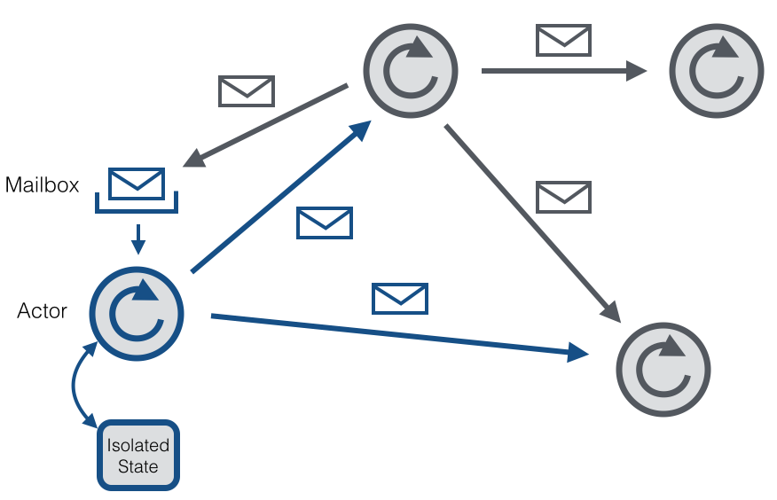
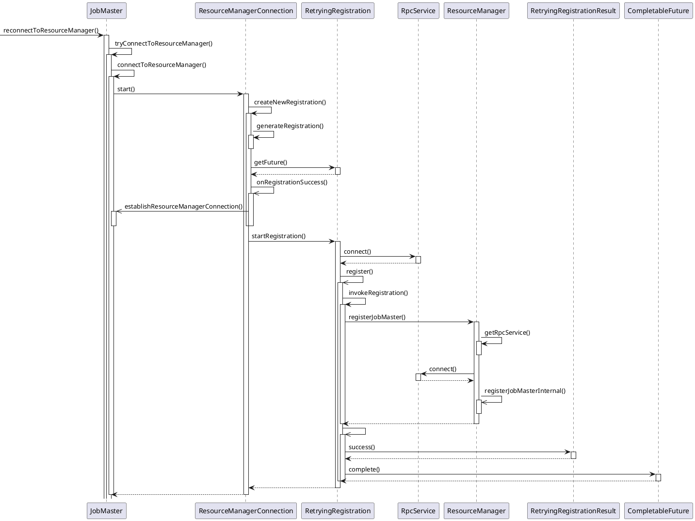

```toc
ordered: true
class-name: "table-of-contents"
```

RPC（Remote Procedure Call，远程过程调用） 是一种通过网络从远程计算机上请求服务的协议，通过TCP、UDP等传输协议为通信程序之间传递访问请求或者应答信息，跨越了OSI网络通信模型中的传输层和应用层，是一种常用的分布式网络通信协议，它允许运行于一台计算机的程序调用另一台计算机的子程序，同时将网络的通信细节隐藏起来，使得用户无须额外地为这个交互作用编程。

RPC框架（Thrift、Protocol Buffer、Avro）均由两部分组成：对象序列化和远程过程调用^[Protocol Buffer官方仅提供了序列化实现，为提供远程调用相关实现，但三方RPC库非常多]。

## RPC通信模型

```bob-svg
.-------------------------.      .--------------------------------.
| Client                  |      | Server                         |
| .----. .------. .----.  | 请求 |  .----. .----. .------. .----. |
| | 客 | | Stub | | 通 |--+------+->| 通 | | 调 | | Stub | | 服 | |
| | 户 | |  程  | | 信 |  |      |  | 信 | | 度 | |  程  | | 务 | |
| | 程 | |  序  | | 模 |  | 应答 |  | 模 | | 程 | |  序  | | 过 | |
| | 序 | |      | | 块 |<-+------+--| 块 | | 序 | |      | | 程 | |
| '----' '------' '----'  |      |  '----' '----' '------' '----' |
'-------------------------'      '--------------------------------'
```

RPC通常采用客户机/服务器模型，请求程序是一个客户机，服务提供程序是一个服务器，一个典型的RPC框架主要包括以下几个部分：
+ 通信模块：两个相互协作的通信模块实现请求-应答协议，它们在客户和服务器之间传递请求和应答消息^[请求-应答协议的实现方式有同步方式和异步方式，同步模式下客户端程序一直阻塞到服务器端发送的应答请求到达本地；异步模式下客户端将请求发送到服务器端后，不必等待应答返回，可以做其他事情，待服务器端处理完请求后，主动通知客户端]
+ Stub程序：客户端和服务端均包含Stub程序，可看做代理程序，使得远程函数调用表现得跟本地调用一样，对用户程序完全透明。在客户端，Stub程序将请求信息通过网络模块发送给服务器端，当服务器发送应答后，它会解码对应结果。在服务器端，Stub程序依次进行解码请求消息中的参数、调用相应的服务过程和编码应答结果的返回值等处理
+ 调度程序：调度程序接收来自通信模块的请求消息，并根据其中的标识选择一个Stub程序进行处理
+ 客户程序：请求的发出者^[如果是单机环境，客户程序可直接通过函数调用访问服务过程，但在分布式环境下，需要考虑网络通信，需要增加通信模块和Stub程序，同时保证函数调用的透明性]
+ 服务过程：请求的处理者

通常而言，一个RPC请求从发送到获取处理结果，经历的步骤如下：
1. 客户程序以本地方式调用系统产生的Stub程序
2. Stub程序将函数调用信息按照网络通信模块的要求封装成消息包，并交给通信模块发送到远程服务器端
3. 远程服务器接收此消息后，将此消息发送给相应的Stub程序
4. Stub程序拆封消息，形成被调过程要求的形式，并调用对应函数
5. 被调用函数按照所获参数执行，并将结果返回给Stub程序
6. Stub程序将此结果封装成消息，通过网络通信模块逐级地传送给客户程序

## RMI

## Hadoop RPC

Hadoop各个系统（HDFS、YARN、MapReduce等）均采用了Master/Slave结构，Master实际上是一个RPC Server，负责处理集群中所有Slave发送的服务请求，Slave实际上是RPC Client。

Hadoop RPC主要分为四个部分：
+ 序列化层：将用户请求中的参数或者应答转化成字节流以便跨机器传输。Protocol Buffers和Apache Avro均可用在序列化层，Hadoop本身也提供了一套序列化框架，一个类只要实现了Writable接口即可支持对象序列化与反序列化
+ 函数调用层：定位要调用的函数并执行该函数，Hadoop RPC采用Java反射机制与动态代理实现了函数调用
+ 网络传输层：描述了Client与Server之间消息传输的方式，Hadoop RPC采用了基于TCP/IP的Socket机制
+ 服务器端处理框架：可被抽象为网络I/O模型，描述了客户端与服务器端间信息交互方式，Hadoop RPC采用了基于Reactor设计模式的事件驱动I/O模型

Hadoop RPC（`org.apache.hadoop.ipc.RPC`）对外主要提供了两种接口：
+ `<T> ProtocolProxy <T> getProxy/waitForProxy()`：构造一个客户端代理对象，用于向服务器发送RPC请求
+ `Server RPC.Builder(Configuration).build()`：为某个协议实例构造一个服务器对象，用于处理客户端发送的请求

Hadoop RPC主要由三个大类组成，即RPC、Client和Server，分别对应对外编程接口、客户端实现和服务器实现。

**ipc.RPC** 实际上是对底层客户机-服务器网络模型的封装，定义了一系列构建（`getProxy()`、`waitForProxy()`）和销毁（`stopProxy()`）RPC客户端的方法，静态内部类`RPC.Builder`用于构建RPC服务器，该类提供了一系列`setXxx()`方法用于设置RPC协议、RPC协议实现对象、服务器绑定地址、端口号等基本参数，设置完成后，即可通过调用`RPC.Builder#build()`完成一个服务器对象的构建，之后直接调用`Server#start()`方法启动该服务器。Hadoop 2.x提供了Writable（WritableRpcEngine）和Protocol Buffers（ProtocolRpcEngine）两种序列化框架，默认实现方式是Writable方式，可通过调用`RPC#setProtocolEngine()`设置序列化方式。Hadoop RPC的远程过程调用流程为，Hadoop RPC使用了Java动态代理完成对远程方法的调用，用户只需实现`java.lang.reflect.InvocationHandler`接口，并按照自己需求实现`invoke()`方法即可完成动态代理类对象上的方法调用，在invoke方法中，将函数调用信息（函数名、函数参数列表等）打包成可序列化的`WritableRpcEngine.Invocation`（或`ProtocolRpcEngine.Invocation`）对象，并通过网络发送给服务器端，服务器端收到该调用信息后，解析出函数名、函数参数列表等信息，利用Java反射机制完成函数调用

**ipc.Client** 发送远程过程调用信息并接收执行结果，对外提供了一类执行远程调用的接口（名称都一样，只是参数列表不同）。Client类有两个重要的内部类，Call和Connection，Call类封装了一个RPC请求，包含5个成员变量（唯一标识id^[Hadoop RPC Server采用异步方式处理客户端请求，这使得远程过程调用的发生顺序与结果返回顺序无直接关系，Client端通过id识别不同的函数调用]、函数调用信息param、函数执行返回值value、出错或者异常信息error、执行完成标识符done），当客户端向服务器端发送请求时，只需填充id和param两个变量，value、error和done则由服务器端根据函数执行情况填充。Connection类封装了Client与每个Server之间维护的通信连接的基本信息及操作，基本信息包括通信连接唯一标识（remoteId）、与Server端通信的Socket（socket）、网络输入数据流（in）、网络输出数据流（out）、保存RPC请求的哈希表（calls），操作包括addCall（将一个Call对象添加到哈希表中）、sendRPCRequest（向服务器发送RPC请求）、receiveResponse（从服务器端接收已经处理完成的RPC请求）、run（Connection是一个线程类，它的run方法调用了receiveResponse方法，会一直等待接收RPC返回结果）。

当调用`call()`函数执行某个远程方法时，Client端处理流程如下：
1. 创建一个Connection对象，并将远程方法调用信息封装成Call对象，放到Connection对象中的哈希表中
2. 调用Connection类中的`sendRpcRequest()`方法将当前Call对象发送给Server端
3. Server端处理完RPC请求后，将结果通过网络返回给Client端，Client端通过`receiveRpcResponse()`函数获取结果
4. Client检查结果处理状态（成功还是失败），并将对应Call对象从哈希表中删除

**ipc.Server** 接受来自客户端的RPC请求，经过调用相应的函数获取结果后，返回给对应的客户端^[Hadoop采用了Master/Slave结构，Master通过ipc.Server接收并处理所有Slave发送的请求，ipc.Server采用了线程池、事件驱动、Reactor设计模式等提高并发处理能力的技术来实现高并发和可扩展性]。ipc.Server实际上实现了一个典型的Reactor设计模式，分为3个阶段：
+ 接收请求：接收来自各个客户端的RPC请求，并将它们封装成固定的格式（Call类）放到一个共享队列中（callQueue）中，以便进行后续处理。该阶段内部又分为建立连接和接收请求两个子阶段，分别由Listener和Reader两种线程完成。整个Server只有一个Listener线程，统一负责监听来自客户端的连接请求，一旦有新的请求到达，它会采用轮询的方式从线程池中选择一个Reader线程进行处理，而Reader线程可同时存在多个，它们分别负责接收一部分客户端连接的RPC请求，每个Reader线程负责哪些客户端连接由Listener决定，当前Listener只是采用了简单的轮询分配机制。Listener和Reader线程内部各自包含一个Selector对象，分别用于监听SelectionKey.OP_ACCEPT和SelectionKey.OP_READ事件。对于Listener线程，主循环监听是否有新的连接请求到达，并采用轮询策略选择一个Reader线程处理新连接；对于Reader线程，主循环监听它负责的客户端连接中是否有新的RPC请求到达，并将新的RPC请求封装成Call对象，放到共享队列callQueue中
+ 处理请求：从共享队列callQueue中获取Call对象，执行相应的函数调用，并将结果返回给客户端，这全部由Handler线程完成。Server端可同时存在多个Handler线程，它们并行从共享队列中读取Call对象，经执行对应的函数调用后，将尝试着直接将结果返回给对应的客户端
+ 返回结果：当函数调用返回结果很大或者网络速度过慢不能将结果一次性发送到客户端时，Handler将尝试着将后续发送任务交给Responder线程。Server端仅存在一个Responder线程，它的内部包含一个Selector对象，用于监听SelectionKey.OP_WRITE事件。当Handler没能将结果一次性发送到客户端时，会向该Selector对象注册SelectionKey.OP_WRITE事件，进而由Responder线程采用异步方式继续发送未发送完成的结果

```Java
// 使用Hadoop RPC可分为以下4个步骤：
// 1. 定义RPC协议，RPC协议是客户端和服务器端之间的通信接口，定义了服务器端对外提供的服务接口
interface ClientProtocol extends org.apache.hadoop.ipc.VersionedProtocol {
    // 版本号，默认情况下，不同版本号的RPC Client和Server之间不能相互通信
    public static final long versionID = 1L;
    String echo(String value) throws IOException;
    int add(int v1, int v2) throws IOException;
}

// 2. 实现RPC协议，Hadoop RPC协议通常是一个Java接口
public static class ClientProtocolImpl implements ClientProtocol {
    // 获取自定义的协议版本号
    public long getProtocolVersion(String protocol, long clientVersion) {
        return ClientProtocol.versionID;
    }
    // 获取协议签名
    public ProtocolSignature getProtocolSignature(String protocol, long clientVersion, int hashcode) {
        return new ProtocolSignature(ClientProtocol.versionID, null);
    }
    public String echo(String value) throws IOException {
        return value;
    }
    public int add(int v1, int v2) throws IOException {
        return v1 + v2;
    }
}

// 3. 构造并启动RPC Server，直接使用静态类Builder构造一个RPC Server，并调用函数start()启动该Server
Server server = new RPC.Builder(conf)
                       .setProtocol(ClientProtocol.class)
                       .setInstance(new ClientProtocolImpl())
                       .setBindAddress(ADDRESS)           // 服务器host
                       .setPort(0)                        // 服务器监听端口号，0表示由系统随机选择一个端口号
                       .setNumHandlers(5)                 // 服务器端处理请求的县城数目
                       .build();
server.start();         // 服务器处于监听状态，等待客户端请求到达

// 4. 构造RPC Client并发送RPC请求，使用静态方法getProxy构造客户端代理对象，通过代理对象调用远程方法
proxy = (ClientProtocol)RPC.getProxy(ClientProtocol.class, ClientProtocol.versionID, addr, conf);
int result = proxy.add(5, 6);
String echoResult = proxy.echo("result");
```
### Yarn RPC

YARN将Hadoop RPC中的序列化部分剥离开，集成现有的开源RPC框架^[RPC类变成了一个工厂，它将具体的RPC实现授权给RpcEngine实现类，现有开源RPC类只要实现RpcEngine接口，便可以集成到Hadoop RPC中]，配置项`rpc.engine.{protocol}`用于指定协议{protocol}采用的序列化方式。

<div class="wrapper" block="markdown">

```plantuml
@startuml
!include https://raw.githubusercontent.com/bschwarz/puml-themes/master/themes/sketchy-outline/puml-theme-sketchy-outline.puml
hide empty members
skinparam ArrowThickness 1

class RPC {
    Map<Class, RpcEngine> PROTOCOL_ENGINES
    Map<Class, RpcEngine> PROXY_ENGINES
    Object[][] call()
    Object getProxy()
    RPC.Server getServer()
    stopProxy()
    Object waitForProxy()
    RpcEngine getProtocolEngine()
    RpcEngine getProxyEngine()
    setProtocolEngine()
}

interface RpcEngine {
    Object getProxy()
    Object stopProxy()
    Object[] call()
    RPC.Server getServer()
}

class WritableRpcEngine
class AvroRpcEngine
class ProtobufRpcEngine

RPC o-- RpcEngine
RpcEngine <|-- WritableRpcEngine
RpcEngine <|-- AvroRpcEngine
RpcEngine <|-- ProtobufRpcEngine

@enduml
```

</div>

YARN提供的对外类是YarnRPC，只需使用该类便可以构建一个基于Hadoop RPC且采用Protocol Buffers序列化框架的通信协议。YarnRPC是一个抽象类，配置项`yarn.ipc.rpc.class`设置实际的实现，默认值是org.apache.hadoop.yarn.ipc.HadoopYarnProtoRPC。HadoopYarnProtoRPC通过RPC工厂生成器（工厂设计模式）RpcFactoryProvider生成客户端工厂（由配置项yarn.ipc.client.factory.class设置，默认值是org.apache.hadoop.yarn.factories.impl.pb.RpcClientFactoryPBImpl）和服务器工厂（由配置项yarn.ipc.server.factory.class设置，默认值是org.apache.hadoop.yarn.factories.impl.pb.RpcServerFactoryPBImpl），以根据通信协议的Protocol Buffers定义生成客户端对象和服务器对象

+ RpcClientFactoryPBImpl：根据通信协议接口及Protocol Buffers定义构造RPC客户端句柄^[RpcClientFactoryPBImpl对通信协议的存放位置和类命名有一定要求，假设通信协议接口Xxx所在Java包名为XxxPackage，则客户端实现代码必须位于Java包XxxPackage.impl.pb.client中（在接口包名后面增加.impl.pb.client），切实现类名为PBClientImplXxx（在接口名前面增加前缀PBClientImpl）]
+ RpcServerFactoryPBImpl：根据通信协议接口及Protocol Buffers定义构造RPC服务器句柄^[对通信协议的存放位置和类命名有一定要求。假设通信协议接口Xxx所在Java包名为XxxPackage，则客户端实现代码必须位于Java包 XxxPackage.impl.pb.server中（在接口包名后面增加.impl.pb.server），且实现类名为PBServiceImplXxx（在接口名前面增加前缀PBServiceImpl）]

<div class="wrapper" block="markdown">

```plantuml
@startuml
!include https://raw.githubusercontent.com/bschwarz/puml-themes/master/themes/sketchy-outline/puml-theme-sketchy-outline.puml

hide empty members
skinparam ArrowThickness 1

abstract class YarnRPC {
    Object getProxy()
    stopProxy()
    Server getServer()
    YarnRPC create()
}

class HadoopYarnProtoRPC {
    Object getProxy()
    stopProxy()
    Server getServer()
}

class RpcFactoryProvider {
    RpcServerFactory getServerFactory()
    RpcClientFactory getClientFactory()
}

class RpcServerFactoryPBImpl {
    Server getServer()
}

class RpcClientFactoryPBImpl {
    Object getClient()
    stopClient()
}

interface RpcClientFactory {
    Object getClient()
    stopClient()
}

interface RpcServerFactory {
    Server getServer()
}

YarnRPC <|-- HadoopYarnProtoRPC
YarnRPC ..> HadoopYarnProtoRPC

HadoopYarnProtoRPC <.. RpcFactoryProvider

RpcFactoryProvider <.. RpcServerFactoryPBImpl
RpcFactoryProvider <.. RpcClientFactoryPBImpl

RpcServerFactory <|.. RpcServerFactoryPBImpl
RpcClientFactory <|.. RpcClientFactoryPBImpl

@enduml
```

</div>

## Flink RPC

Flink基于Akka实现内部各组件（ResourceManager、Dispatcher、JobMaster、TaskExecutor等）间的RPC通信。Akka是一个开发并发、容错和可伸缩应用的框架，是Actor Model的一个实现。在Actor Model中，所有的实体被认为是独立的Actor，Actor和其他Actor通过发送异步消息通信（也可以使用同步模式执行同步操作，但是会限制系统的伸缩性），每个Actor都有一个邮箱（Mailbox），用于存储所收到的消息，另外，每一个Actor维护自身单独的状态。每个Actor是一个单一的线程，不断从其邮箱中拉取消息，并且连续不断地处理，对于已经处理过的消息的结果，Actor可以改变它自身的内部状态，或者发送一个新消息，或者孵化一个新的Actor。

Flink中的RPC实现主要在flink-runtime模块下的org.apache.flink.runtime.rpc包中，主要组件有RpcEndpoint、RpcService、RpcServer、AkkaInvocationHandler、AkkaRpcActor等，RpcEndpoint定义了一个Actor路径；RpcService提供了启动RpcServer、执行代码等方法；RpcServer/AkkaInvocationHandler提供了与Actor通信的接口；AkkaRpcActor为Flink封装的Actor。

### Actor Model

<div class="wrapper" block="markdown">



</div>

Actor Model是计算机科学领域并行计算的数学模型，定义了一系列系统组件应该如何动作和交互的通用规则，基于通信而非使用关联内存模型的全局状态实现消息传递，是一个通用的并发编程模型，而非某个语言或框架所有。Actor Model的理念非常简单：万物皆Actor。其主要概念包括：Actor（通信的主体）、Message（通信的内容）、Mailbox（单线程先到先处理的消息处理器）

Actor Model将Actor当作通用的并行计算原语：一个Actor对接收到的消息作出响应，本地策略可以创建出更多的参与者或发送更多的消息，同时准备接收下一条消息。Actor状态不能直接读取和修改，方法也不能直接调用，只能通过消息修改自身私有状态（避免锁）。每个Actor存在一个代表本身的地址，只能向该地址发送消息。

Actor由状态（state）、行为（behavior）、邮箱（mailbox）三者组成的：
+ 状态：指Actor对象的变量信息，状态Actor自身管理，避免并发环境下的锁和内存原子性等问题
+ 行为：指Actor中的计算逻辑，通过Actor接收到的消息来改变Actor的状态
+ 邮箱：Actor之间的通信桥梁，邮箱内部通过FIFO消息队列来存储发送发消息，而接收方则从邮箱中获取消息

Actor地址有多种实现方式：
+ 直接物理附着^[将指向Actor对象的地址直接物理地嵌入在组件硬件（如芯片、电路板、芯片载体等）中并通过物理线路直接连接到其他组件的演员对象上]
+ 内存或磁盘地址
+ 网络地址
+ 电子邮件地址

Actor只能向其通过以下方式获得地址的Actor发送消息：
+ 消息中包含地址
+ 接收消息前已经知道的地址
+ 处理消息时创建的Actor

收到消息时，Actor可以有三种行为：
+ 创建有限数量的Actor
+ 向已知地址的Actor发送有限数量的消息
+ 指定下一条消息到来时的行为

Actor Model有两种任务调度方式：
+ 基于线程的调度：为每个Actor分配一个线程，在接收一个消息时，如果当前Actor的邮箱为空则会阻塞当前线程
+ 基于事件的调度：消息到来时才会为Actor分配线程并执行

Actor Model的特点是：
+ Actor之间和内部计算具有固有的并发性
+ 动态创建Actor对象
+ 消息中包含Actor地址
+ 仅通过直接异步消息传递进行交互，并且没有关于消息接收顺序的限制。异步的发送消息是用Actor Model编程的重要特性之一，消息并不是直接发送到一个Actor，而是发送到一个Mailbox中的。这样的设计解耦了Actor之间的关系，每个Actor都以自己的步调运行，且发送消息时不会被堵塞

Actor Model的最根本优势是消息发送者与已经发送的消息解耦，这将支持异步通信和消息传递模式的控制结构。Actor Model主要问题在于难以保证原子性。

### Akka

ActorSystem是管理Actor生命周期的组件，Actor是负责进行通信的组件。

在Akka中可以认为Actor是一个容器，包含了状态、行为、邮箱Mailbox、子Actor和监管（Supervisor）策略，这些都封装在ActorRef（Actor的引用，出于与外界隔离的目的，Actor以ActorRef的形式展现给外界，Actor和ActorRef这种划分使得所有操作都能够透明，如重启Actor而不需要更新ActorRef）中，当Actor销毁时这些资源都会释放。另外，只能通过ActorRef来与Actor进行通信。

Actor状态可以是一个明确的状态机、一个计数器、一组监听器和待处理的请求等等。

Actor行为是一个函数，定义了在某个时间点处理对应消息所要采取的行为，每当Actor收到一个消息，它会与Actor的当前行为进行匹配，Actor对象在创建时所定义的初始行为是特殊的，因为Actor重启时会恢复这个初始行为。

邮箱（Mailbox）连接众多Actor。Actor之间并不直接通信，而是通过邮件Mail来互通有无。每个Actor有且仅有一个邮箱，所有发来的消息都在邮箱里按照发送操作的时间顺序排队（Actor分布在不同的线程中，不同的Actor发来的消息在运行时没有一个固定的顺序，同一个Actor发送到相同目标Actor的多个消息会按发送的顺序排队）。Akka有不同的邮箱实现可供选择，默认是FIFO，处理消息的顺序与消息入队列的顺序一致，也可以选择优先邮箱，根据消息优先级将消息放在非队尾的某个指定位置，甚至可能是队列头。

Akka Actor的处理流程：
1. 创建ActorSystem
2. 通过ActorSystem创建ActorRef，并将消息发送到ActorRef
3. ActorRef将消息传递到Dispatcher中
4. Dispatcher依次将消息发送到Actor邮箱中
5. Dispatcher将邮箱推送至一个线程中
6. 邮箱取出一条消息并委派给Actor的receive方法

Akka系统的精髓在于任务被拆开、委托，直到任务小到可以被完整地处理。如果一个Actor对某种状况无法进行处理，它会发送相应的失败消息给它的监管者请求帮助，这样的递归结构使得失败能够在正确的层次得到处理。

设计Akka系统的难度在于如何决定谁应该监管什么，以下是一些指导原则：
+ 如果一个Actor管理另一个Actor所做的工作，如分配一个子任务，那么父Actor应该监督子Actor。因为父Actor知道可能会出现哪些失败情况，以及如何处理它们
+ 如果一个Actor携带着重要数据（即它的状态要尽可能地不被丢失），这个Actor应该将任何可能出现危险的子任务分配给它所监管的子Actor，并酌情处理子任务的失败。根据请求的性质，可能的话最好为每一个请求创建一个子Actor，这样能简化收集回应的状态管理^[这在Erlang中被称为“Error Kernel Pattern”]
+ 如果Actor A需要依赖Actor B才能完成它的任务，A应该观测B的存活状态并对B的终止提醒消息进行响应。这与监管机制不同，因为观测方对监管机制没有影响；需要指出的是，仅仅是功能上的依赖并不足以用来决定是否在树形监管体系中添加子Actor

Actor是以一种严格的树形结构样式来创建的，沿着子Actor到父Actor的监管链，一直到Actor系统的根存在一条唯一的Actor名字序列，被称为路径。Actor路径遵循URI结构标准^[`[协议名]://[ActorSystem名称]@[主机名]:[端口]/[路径]`]，都有一个地址组件^["akka"表示Akka本地协议，"akka.tcp"表示Akka远程协议]描述访问这个Actor所需要的协议和位置，之后是以"/"分隔的从根到指定Actor所经过的树节点上Actor的名字。在路径树的根上是根监管者，所有其他Actor都可以通过它找到，其名字是"/"，在第二个层次上是以下这些：
+ "/user" 是所有由用户创建的顶级Actor的监管者，用`ActorSystem#actorOf()`创建的Actor在其下
+ "/system" 是所有由系统创建的顶级Actor的监管者
+ "/deadLetters" 是死信Actor，所有发往已经终止或不存在的Actor的消息会被重定向到这里
+ "/temp"是所有系统创建的短时Actor的监管者
+ "/remote" 是一个人造虚拟路径，用来存放所有其监管者是远程Actor引用的Actor

Akka有两种核心的异步通信方式：
+ tell方式：表示仅仅使用异步方式给某个Actor发送消息，无须等待Actor的响应结果，并且也不会阻塞后续代码的运行，`ActorRef#tell(message, actorRef)`第一个参数为消息，可以是任何可序列化的数据或对象，第二个参数表示发送者（发送消息的Actor的引用，`ActorRef.noSender()`表示无发送者）
+ ask方式：将返回结果包装在`scala.concurrent.Future`中，然后通过异步回调获取返回结果，用于需要从Actor获取响应结果的场景

```
// 1. 构建ActorSystem
ActorSystem system = ActorSystem.create("sys");
// 2. 构建Actor,获取该Actor的引用，即ActorRef
ActorRef helloActor = system.actorOf(Props.create(HelloActor.class), "helloActor");
// 3. 给helloActor发送消息
helloActor.tell("hello helloActor", ActorRef.noSender());
// 4. 关闭ActorSystem
system.terminate();

// 通过Actor路径获取ActorRef
ActorSelection as = system.actorSelection("/path/to/actor");
Timeout timeout = new Timeout(Duration.create(2, "seconds"));
Future<ActorRef> fu = as.resolveOne(timeout);
fu.onSuccess(
    new OnSuccess<ActorRef>() {
        @Override
        public void onSuccess(ActorRef actor) {
            System.out.println("actor:" + actor);
            actor.tell("hello actor", ActorRef.noSender());
        }
    },
    system.dispatcher());

fu.onFailure(
    new OnFailure() {
        @Override
        public void onFailure(Throwable failure) {
            System.out.println("failure:" + failure);
        }
    },
    system.dispatcher());

```

### Flink RPC实现

<div class="wrapper" block="markdown">

```plantuml
@startuml
!include https://raw.githubusercontent.com/bschwarz/puml-themes/master/themes/sketchy-outline/puml-theme-sketchy-outline.puml
hide empty members
skinparam ArrowThickness 1

interface RpcGateway {
    String getAddress();
    String getHostname();
}
abstract class RpcEndpoint {
    RpcService rpcService; 
    RpcServer rpcServer;

}
interface RpcService
class AkkaRpcService
interface RpcServer
interface TaskExecutorGateway
interface JobMasterGateway
interface ResourceManagerGateway
interface DispatcherGateway
interface InvocationHandler

RpcGateway <|.. RpcEndpoint
RpcGateway <|-- RpcServer
RpcGateway <|-- ResourceManagerGateway
RpcGateway <|-- DispatcherGateway
RpcGateway <|-- JobMasterGateway
RpcGateway <|-- TaskExecutorGateway

RpcEndpoint <|-- ResourceManager
RpcEndpoint <|-- Dispatcher
RpcEndpoint <|-- JobMaster
RpcEndpoint <|-- TaskExecutor

ResourceManagerGateway <|.. ResourceManager
DispatcherGateway <|.. Dispatcher
JobMasterGateway <|.. JobMaster
TaskExecutorGateway <|.. TaskExecutor

RpcService <|-- AkkaRpcService
RpcServer <|.. AkkaInvocationHandler
InvocationHandler <|.. AkkaInvocationHandler

@enduml
```

</div>

**RpcGateway** RPC客户端代理，用于定义RPC协议，是RPC客户端和RPC服务端沟通的桥梁。RPC服务端实现了接口中定义的方法，做具体的业务逻辑处理。RPC客户端是接口的代理对象，将对接口方法的调用转为Akka的消息发送。有以下几个子接口

+ JobMastergateway接口是JobMaster提供的对外服务接口
+ TaskExecutorGateway接口是TaskManager提供的对外服务接口
+ ResourceManagerGateway接口是ResourceManager资源管理器提供的对外服务接口
+ DispatcherGateway是Flink提供的作业提交接口

**RpcEndpoint** RPC服务端，是Akka中Actor的封装，在RpcGateway基础上提供了RPC服务组件的生命周期管理，Flink中所有提供远程调用服务的组件（Dispatcher、JobManager、ResourceManager、TaskExecutor等）都继承自RpcEndpoint。同一个RpcEndpoint中的所有调用只有一个线程处理，称为Endpoint主线程^[与Akka的Actor模型一样，所有对状态数据的修改在同一个线程中执行，所以不存在并发问题]。RpcEndpoint是RpcService、RpcServer的结合之处，在其本身的构造过程中使用`RpcService#startServer()`启动RpcServer，进入可以接收处理请求的状态，最后再将RpcServer绑定到主线程上真正执行起来，将Rpc调用委托RpcServer进行处理。主要有以下实现类：
+ Dispatcher：位于JobManager中，负责作业调度执行
+ ResourceManager：位于JobManager中，负责资源管理，和TaskExecutor一起构成资源管理的主从架构
+ JobMaster：位于JobManager中，应用程序中的主控程序，类似于Spark中的Driver。在提交成功一个作业后就会启动一个JobMaster负责作业的执行
+ TaskExecutor：TaskManager中，负责资源管理

**RpcService** 是RpcEndpoint的运行时环境，是Akka中ActorSystem的封装^[一个ActorSystem系统中有多个Actor，同样一个RpcService中有多个RpcEndpoint]，提供了启动/停止/连接RpcServer的方法，在ClusterEntrypoint（JobMaster）和TaskManagerRunner（TaskExecutor）启动的过程中被初始化并启动。主要方法包括：
+ connect()：连接到一个RpcEndpoint，返回一个RpcGateway，然后可以使用此RpcGateway进行远程方法调用
+ startServer()：启动一个RpcEndpoint，返回一个RpcServer
+ stopServer()：停止某个RpcEndpoint
+ scheduleRunnable()：延迟调用执行某任务
+ execute()：异步执行某任务

**AkkaRpcService** RpcService实现类，封装了ActorSystem，并保存了ActorRef到RpcEndpoint的映射关系，是Flink和Akka之间的通讯模块，负责处理Flink任务和Akka Actor之间的相互通信。当有客户端发送RPC请求时，Flink会将请求发送到对应的RpcEndpointName所绑定的ActorRef中进行处理，并将处理结果返回给客户端。在注册一个ActorRef作为RPC服务端之前，需要先定义一个实现了RpcEndpoint或ActorRpcEndpoint的类来作为服务端的业务逻辑实现，并在该类中重写onStart()和onStop()方法来分别处理服务端启动和停止时的逻辑。

**RpcServer** 是RPC服务端（RpcEndpoint）自身的代理对象，负责接收响应远端的RPC消息请求，供服务端调用自身非RPC方法，通过RpcEndpoint的getSelfGateway()方法获取其自身的Gateway对象然后调用该Endpoint的方法。其启动实质上是通知底层的AkkaRpcActor切换到START状态，开始处理远程调用请求

**AkkaInvocationHandler** 与AkkaRpcActor配合使用的调用处理程序，主要作用是将RPC请求包装成一个LocalRpcInvocation消息，并将其发送到AkkaRpcActor进行处理

**AkkaRpcActor** 是Flink集群内部通信的具体实现，负责处理以下类型消息：
+ LocalRpcInvocation（本地Rpc调用）：LocalRpcInvocation类型的调用指派给`RpcEndpoint`进行处理，如果有响应结果，则将响应结果返还给Sender
+ RunAsync & CallAsync：RunAsync、CallAsync类型的消息带有可以执行的代码，直接在Actor的线程中执行
+ ControlMessage（控制消息）：ControlMessage用来控制Actor的行为，ControlMessage#START启动Actor开始处理消息，ControlMessage#STOP停止处理消息，停止后收到的消息会被丢弃掉

**RPC服务端创建过程** RPC服务端是一个代理对象，创建入口为RpcEndpoint的构造方法，创建过程为（主要在AkkaRpcService中）：
1. 以Ask方式向SupervisorActor发送StartAkkaRpcActor消息，SupervisorActor收到消息后根据消息里的RpcEndpoint的配置信息创建Actor，并以Tell方式回复创建成功
2. 准备代理对象要实现的接口
3. 生成代理对象

**RPC客户端创建过程** RPC客户端是一个代理对象，创建入口为RpcService的connect()方法，创建过程为（主要在AkkaRpcService中）：
1. 使用ActorSystem.actorSelection(address).resolveOne()的方式来获取Actor的引用ActorRef，ActorRef可以用来向服务端Actor发送消息
2. ActorRef创建完成后，使用Ask方式向服务端发送一条握手消息，用来验证客户端和服务端彼此版本一致
3. 异步创建代理对象并返回

**RPC调用流程** 在RpcService中调用connect()方法与RpcEndpoint建立连接，connect()方法根据给的地址返回InvocationHandler，调用InvocationHandler的invoke()方法并传入RPC调用的方法和参数信息。RPCAkkaRpcActor是消息接收的入口，AkkaRpcActor在RpcEndpoint中构造生成，负责将消息交给不同的方法进行处理。具体步骤如下：
1. 通过客户端代理对象调用RpcGateway的方法会交由invoke方法执行
2. invoke将方法、参数信息封装为RpcInvocation对象，并通过ActorRef将消息发送给服务端Actor
    + 如果执行的方法有返回值就使用Akk Ask方式，否则以Tell方式发送消息
    + 通过连接的服务端的地址可以判断出服务端在远程还是本地
    + 如果在远程，消息类型为RemoteRpcInvocation，实现了序列化接口，对象可序列化传输
    + 如果在本地，消息类型为LocalRpcInvocation
3. 服务端Actor收到RpcInvocation消息，会从中获取到方法名、方法参数等相关信息，在主线程中通过反射的方式调用代理对象对应方法执行业务逻辑，如果方法有返回值，还会以Tell方法告知客户端结果


```Java
public abstract class RpcEndpoint implements RpcGateway {

    String endpointId;            // 该RpcEndpoint的唯一标识
    RpcService rpcService;        // 用于启动RpcServer、获取RpcGateway
    RpcServer rpcServer;          // 访问底层RpcServer的接口
    MainThreadExecutor mainThreadExecutor;

    RpcEndpoint(RpcService rpcService, String endpointId) {
        // 通过RpcService启动RpcServer，生成代理对象
        this.rpcServer = rpcService.startServer(this);
        // 主线程执行器，所有调用在主线程中串行执行
        this.mainThreadExecutor = new MainThreadExecutor(rpcServer, this::validateRunsInMainThread);
    }
    // 执行Rpc调用
    void runAsync(Runnable runnable) {
        rpcServer.runAsync(runnable);
    }
    CompletableFuture<V> callAsync(Callable<V> callable, Time timeout) {
        return rpcServer.callAsync(callable, timeout);
    }
    // 启动RpcEndpoint，通知底层RpcServer RpcEndpoint已准备好处理RPC
    void start() {
        rpcServer.start();
    }
}
/** 基于Akka的RpcService实现
 *  RpcService启动Akka Actor处理RPC
 */
class AkkaRpcService implements RpcService {

    ActorSystem actorSystem;
    Map<ActorRef, RpcEndpoint> actors = new HashMap<>();
    Supervisor supervisor;       // startSupervisorActor();

    // RPC服务端创建过程（RPC服务端是一个代理对象）
    // 启动指定RpcEndpoint上的RpcServer，创建Akka Actor并将Akka ActorRef绑定到指定的RpcEndpoint上，将其作为RPC服务端暴露出去，接收来自RPC客户端的RPC请求
    <C extends RpcEndpoint & RpcGateway> RpcServer startServer(C rpcEndpoint) {

        // 1. 以Ask方式向SupervisorActor发送StartAkkaRpcActor消息，SupervisorActor收到消息后根据消息里的RpcEndpoint的配置信息创建Actor，并以Tell方式回复创建成功
        SupervisorActor.ActorRegistration actorRegistration = SupervisorActor.startAkkaRpcActor(supervisor.getActor(), actorTerminationFuture -> Props.create(...), rpcEndpoint.getEndpointId());
        ActorRef actorRef = actorRegistration.getActorRef();
        actors.put(actorRef, rpcEndpoint);

        LOG.info("Starting RPC endpoint for {} at {} .", rpcEndpoint.getClass().getName(), actorRef.path());

        // 2. 准备代理对象实现的接口
        // 解析该RpcEndpoint实现的所有RpcGateway接口
        Set<Class<?>> implementedRpcGateways = new HashSet<>(RpcUtils.extractImplementedRpcGateways(rpcEndpoint.getClass()));

        // 添加RpcServer和AkkaBasedEndpoint类
        implementedRpcGateways.add(RpcServer.class);
        implementedRpcGateways.add(AkkaBasedEndpoint.class);

        // 3. 生成代理对象
        // 根据不同类型动态创建代理对象
        InvocationHandler akkaInvocationHandler = rpcEndpoint instanceof FencedRpcEndpoint ?  new FencedAkkaInvocationHandler<>(...) : new AkkaInvocationHandler();

        // 生成RpcServer对象，而后对该RpcServer的调用都会进入Handler的invoke方法处理，handler实现了多个接口的方法
        ClassLoader classLoader = getClass().getClassLoader();
        RpcServer server = (RpcServer) Proxy.newProxyInstance(
            classLoader,
            implementedRpcGateways.toArray(new Class<?>[implementedRpcGateways.size()]),
            akkaInvocationHandler);
        return server;
    }

    // RPC客户端创建过程（RPC客户端是一个代理对象）
    <C extends RpcGateway> CompletableFuture<C> connect(String address, Class<C> clazz) {

        // 1. 使用ActorSystem.actorSelection(address).resolveOne的方式来获取Actor的引用ActorRef（ActorRef用来向服务端发送请求）
        CompletableFuture<ActorRef> actorRefFuture = resolveActorAddress(address);

        // 2. ActorRef创建完成后，使用ask的方式向服务端发送一条握手消息(用来验证Client和Server彼此版本一致)
        CompletableFuture<HandshakeSuccessMessage> handshakeFuture =
            actorRefFuture.thenCompose((ActorRef actorRef) ->
                AkkaFutureUtils.toJava(
                    Patterns.ask(
                        actorRef,
                        new RemoteHandshakeMessage(clazz, getVersion()),
                        configuration.getTimeout().toMilliseconds())
                            .<HandshakeSuccessMessage>mapTo(ClassTag$.MODULE$.<HandshakeSuccessMessage>apply(HandshakeSuccessMessage.class))));

        // 3. 异步创建代理对象并返回
        CompletableFuture<C> gatewayFuture =
            actorRefFuture.thenCombineAsync(
                handshakeFuture,
                (ActorRef actorRef, HandshakeSuccessMessage ignored) -> {
                    InvocationHandler invocationHandler = invocationHandlerFactory.apply(actorRef);
                    ClassLoader classLoader = getClass().getClassLoader();
                    C proxy = (C)Proxy.newProxyInstance(classLoader, new Class<?>[] {clazz}, invocationHandler);
                    return proxy;},
                actorSystem.dispatcher());

        return guardCompletionWithContextClassLoader(gatewayFuture, flinkClassLoader);
    }

}

class SupervisorActor extends AbstractActor {

    // 发送消息
    static StartAkkaRpcActorResponse startAkkaRpcActor(ActorRef supervisor, StartAkkaRpcActor.PropsFactory propsFactory, String endpointId) {
        // 以Ask方式发送消息并等待结果
        // Ask在实现上是创建一个Actor等待响应结果，成功或者超时时，销毁Actor
        return Patterns.ask(supervisor, createStartAkkaRpcActorMessage(propsFactory, endpointId), RpcUtils.INF_DURATION)
            .toCompletableFuture()
            .thenApply(SupervisorActor.StartAkkaRpcActorResponse.class::cast)
            .join();
    }

    // 处理消息
    void createStartAkkaRpcActorMessage(StartAkkaRpcActor startAkkaRpcActor) {
        String endpointId = startAkkaRpcActor.getEndpointId();
        AkkaRpcActorRegistration akkaRpcActorRegistration = new AkkaRpcActorRegistration(endpointId);

        Props akkaRpcActorProps = startAkkaRpcActor.getPropsFactory().create(akkaRpcActorRegistration.getInternalTerminationFuture());

        LOG.debug("Starting {} with name {}.", akkaRpcActorProps.actorClass().getSimpleName(), endpointId);

        // 创建Actor
        ActorRef actorRef = getContext().actorOf(akkaRpcActorProps, endpointId);

        registeredAkkaRpcActors.put(actorRef, akkaRpcActorRegistration);
        // 回复消息
        getSender().tell(
            StartAkkaRpcActorResponse.success(ActorRegistration.create(actorRef, akkaRpcActorRegistration.getExternalTerminationFuture())),
            getSelf());
    }
}

interface RpcServer extends
    StartStoppable, MainThreadExecutable, RpcGateway
{
    // 开始处理RPC，继承自StartStoppable
    void start();
    // 停止处理RPC，继承自StartStoppable
    void stop();
    CompletableFuture<Void> getTerminationFuture();
}

class AkkaInvocationHandler implements
    InvocationHandler, AkkaBasedEndpoint, RpcServer
{
    Object invoke(Object proxy, Method method, Object[] args) {

        Class<?> declaringClass = method.getDeclaringClass();
        Object result;

        // 调用AkkaInvocationHandler实现的方法时，直接进行本地方法调用，否则进行RPC调用
        if (declaringClass.equals(AkkaBasedEndpoint.class)
                || declaringClass.equals(Object.class)
                || declaringClass.equals(RpcGateway.class)
                || declaringClass.equals(StartStoppable.class)
                || declaringClass.equals(MainThreadExecutable.class)
                || declaringClass.equals(RpcServer.class)) {
            result = method.invoke(this, args);
        } else {
            // RPC调用
            result = invokeRpc(method, args);
        }
        return result;
    }

    /** RPC调用
     *  判断远程方法是否需要等待结果
     *  + 如果无需等待，则向Actor发送tell类型的消息
     *  + 如果需要等待，则向Actor发送ask类型的消息
     */
    Object invokeRpc(Method method, Object[] args) {
        // 获取方法相应信息
        String methodName = method.getName();
        Class<?>[] parameterTypes = method.getParameterTypes();
        Annotation[][] parameterAnnotations = method.getParameterAnnotations();
        Class<?> returnType = method.getReturnType();
        Time futureTimeout = extractRpcTimeout(parameterAnnotations, args, timeout);

        // 创建RpcInvocationMessage
        RpcInvocation rpcInvocation = createRpcInvocationMessage(method.getDeclaringClass().getSimpleName(), methodName, parameterTypes, args);

        Object result;

        // 无返回则使用tell()方法，否则使用ask()方法
        if (Objects.equals(returnType, Void.TYPE)) {
            tell(rpcInvocation);
            result = null;
        } else {
            result = ask(rpcInvocation, futureTimeout);
        }
        return result;
    }

    void start() {
        rpcEndpoint.tell(ControlMessages.START, ActorRef.noSender());
    }
}

AkkaRpcActor<T extends RpcEndpoint & RpcGateway> extends AbstractActor {
    T rpcEndpoint;
    State state;

    AkkaRpcActor(
        T rpcEndpoint,
        CompletableFuture<Boolean> terminationFuture,
        int version,
        long maximumFramesize,
        ClassLoader flinkClassLoader)
    {
        ......
    }

    // 定义Akka消息处理逻辑，该
    Receive createReceive() {
        return ReceiveBuilder.create()
            .match(RemoteHandshakeMessage.class, this::handleHandshakeMessage)
            .match(ControlMessages.class, this::handleControlMessage)
            .matchAny(this::handleRpcMessage)
            .build();
    }

    // 当AkkaRpcActor收到RemoteHandshakeMessage消息时，生成客户端和服务器的通信地址，并返回给客户端以确认握手成功
    void handleHandshakeMessage(RemoteHandshakeMessage handshakeMessage) {
        getSender().tell(new Status.Success(HandshakeSuccessMessage.INSTANCE), getSelf());
    }

    void handleRpcMessage(Object message) {
        if (message instanceof RunAsync) {
            handleRunAsync((RunAsync) message);
        } else if (message instanceof CallAsync) {
            handleCallAsync((CallAsync) message);
        } else if (message instanceof RpcInvocation) {
            handleRpcInvocation((RpcInvocation) message);
        } else {
            ......
        }
    }

    void handleControlMessage(ControlMessages controlMessage) {
        switch (controlMessage) {
            case START:
                state = state.start(this, flinkClassLoader);
                break;
            case STOP:
                state = state.stop();
                break;
            case TERMINATE:
                state = state.terminate(this, flinkClassLoader);
                break;
            default:
                handleUnknownControlMessage(controlMessage);
    }
    // 通过查找RpcEndpoint上的方法，并使用提供的参数调用此方法来处理RPC调用
    // 当AkkaRpcActor收到RpcInvocation消息时，会首先执行方法调用，并生成异步或同步调用的结果，
    // 然后根据调用类型调用sendAsyncResponse()或者sendSyncResponse()方法将结果发送给请求方
    void handleRpcInvocation(RpcInvocation rpcInvocation) {
        Method rpcMethod = null;
        // 获取方法信息
        String methodName = rpcInvocation.getMethodName();
        Class<?>[] parameterTypes = rpcInvocation.getParameterTypes();

        // 在RpcEndpoint中查找指定方法
        // 实际执行代码为rpcEndpoint.getClass().getMethod(methodName, parameterTypes)
        rpcMethod = lookupRpcMethod(methodName, parameterTypes);

        if (rpcMethod.getReturnType().equals(Void.TYPE)) {
            // 无返回值时直接调用
            rpcMethod.invoke(rpcEndpoint, rpcInvocation.getArgs()).get();
        } else {
            Object result = rpcMethod.invoke(rpcEndpoint, rpcInvocation.getArgs()).get();
            // 返回结果给调用者
            sendResponse(result);
        }
    }

    // handleRunAsync()用于处理来自远程客户端的RunAsync请求。该请求用于在远程集群上异步运行指定任务，并返回任务的异步单元
    void handleRunAsync(RunAsync runAsync) {
        final long timeToRun = runAsync.getTimeNanos();
        final long delayNanos;

        if (timeToRun == 0 || (delayNanos = timeToRun - System.nanoTime()) <= 0) {
            // 到达调度时间时立即执行
            runAsync.getRunnable().run().get();
        } else {
            // 计算延迟时间
            FiniteDuration delay = new FiniteDuration(delayNanos, TimeUnit.NANOSECONDS);
            // 重新封装消息
            RunAsync message = new RunAsync(runAsync.getRunnable(), timeToRun);
            Object envelopedSelfMessage = envelopeSelfMessage(message);

            // 等待指定延迟时间后给自己再发送一个消息
            getContext().system().scheduler().scheduleOnce(delay, getSelf(), envelopedSelfMessage, getContext().dispatcher(), ActorRef.noSender());
        }
    }
}
```

### Flink RPC连接建立

<div class="wrapper" block="markdown">

```bob-svg
.----------------------------------------------------------------------------------------------------------------------.
|   JobManager                                                                                                         |
|                                              .-------------------.                                                   |
|                                              |     RpcService    |                                                   |
|                                              |  .-------------.  |                                                   |
|                                              |  | ActorSystem |  |                                                   |
|                                              |  '-------------'  |                                                   |
|                                              '----------+--------'                                                   |
|                                                         |                                                            |
|                                                         | startServer                                                |
|                                                         |                                                            |
|                                                         |                                                            |
|                  +--------------------------------------+--------------------------------------+                     |
|                  |                                      |                                      |                     |
|                  |                                      |                                      |                     |
|                  |                                      |                                      |                     |
|                  |                                      |                                      |                     |
|                  |                                      |                                      |                     |
|                  v                                      v                                      v                     |
|  .----------------------------------.  .-----------------------------------.  .-----------------------------------.  |
|  |            Dispatcher            |  |          ResourceManager          |  |             JobMaster             |  |
|  |          .------------.          |  |         .---------------.         |  |         .---------------.         |  |
|  |          |    Actor   |          |  |         |     Actor     |         |  |         |     Actor     |         |  |
|  |          '------------'          |  |         '---------------'         |  |         '---------------'         |  |
|  |                                  |  | .~~~~~~~~~~~~~~~~~~~~~~~~~~~~~~~. |  | .~~~~~~~~~~~~~~~~~~~~~~~~~~~~~~~. |  |
|  | .~~~~~~~~~~~~~~~~~~~~~~~~~~~~~~. |  | ! .---------------------------. ! |  | ! .---------------------------. ! |  |
|  | ! .--------------------------. ! |  | ! |      JobMasterGateway     | ! |  | ! |  ResrouceManagerGateway   | ! |  |
|  | ! |  ResourceManagerGateway  | ! |  | ! |      .--------------.     | ! |  | ! |      .--------------.     | ! |  |
|  | ! |      .------------.      | ! |  | ! |      |   ActorRef   |     | ! |  | ! |      |   ActorRef   |     | ! |  |
|  | ! |      |  ActorRef  |      | ! |  | ! |      '--------------'     | ! |  | ! |      '--------------'     | ! |  |
|  | ! |      '------------'      | ! |  | ! '---------------------------' ! |  | ! '---------------------------' ! |  |
|  | ! '--------------------------' ! |  | ! .---------------------------. ! |  | ! .---------------------------. ! |  |
|  | '~~~~~~~~~~~~~~~~~~~~~+~~~~~~~~' |  | ! |     TaskExecutorGateway   | ! |  | ! |     TaskExecutorGateway   | ! |  |
|  '---------------+-------+----------'  | ! |      .--------------.     | ! |  | ! |      .--------------.     | ! |  |
|                  |       !             | ! |      |   ActorRef   |     | ! |  | ! |      |   ActorRef   |     | ! |  |
|                  |       |             | ! |      '--------------'     | ! |  | ! |      '--------------'     | ! |  |
|                  |       |             | ! '---------------------------' ! |  | ! '---------------------------' ! |  |
|                  |       |             | ! .---------------------------. ! |  | ! .---------------------------. ! |  |
|                  |       |             | ! |     TaskExecutorGateway   | ! |  | ! |     TaskExecutorGateway   | ! |  |
|                  |       |             | ! |      .--------------.     | ! |  | ! |      .--------------.     | ! |  |
|                  |       |             | ! |      |   ActorRef   |     | ! |  | ! |      |   ActorRef   |     | ! |  |
|                  |       |             | ! |      '--------------'     | ! |  | ! |      '--------------'     | ! |  |
|                  |       |             | ! '---------------------------' ! |  | ! '---------------------------' ! |  |
|                  |       |             | '~~~~~~~~~~+~~~~~~~~~~~~~~~~~~~~' |  | '~~~~~~~~~~~~~~~~~~~~~~~+~~~~~~~' |  |
|                  |       |             '------------+-----+----------------'  '-------------------+-----+---------'  |
'------------------+-------+--------------------------+-----+---------------------------------------+-----+------------'
                   |       |                          |     |                                       |     !
                   |       |                          !     |                                       |     |
                   |       '~~~~~~~~~~~~~~~~~~~~~~~~~~+~~~~~+~~~~~~~~~~~~~~~~~~~~~~~~~~~~~~~~~~~~~~~+~~~~~+
                   |                                        |                                       |     |
                   '----------------------------------------+---------------------------------------'     |
                                                            |                                             |
                                                .-----------+----------------.              .-------------+-----------.
                                                |  "是"                      |              |  "是客户端对象，用来连" |
                                                |  RpcEndpoint               |              |  "接对应的RPC服务端"    |
                                                |  RpcServer                 |              '-------------------------'
                                                |  "RpcGateway的服务端实现"  |
                                                |  代理对象                  |
                                                '----------------------------'

                         .----------------------------------.
                         | TaskManager                      |
                         |       .-----------------.        |
                         |       |   RpcService    |        |
                         |       | .-------------. |        |
                         |       | | ActorSystem | |        |
                         |       | '------+------' |        |
                         |       '--------+--------'        |
                         |                | startServer     |
                         |                v                 |
                         | .~~~~~~~~~~~~~~+~~~~~~~~~~~~~~~. |           .--------------------------.
                         | !         TaskExecutor         | |           | 是                       |
                         | !       .--------------.       +-+-----------| Rpcendpoint              |
                         | !       |     Actor    |       ! |           | RpcServer                |
                         | !       '--------------'       ! |           | "RpcGateway的服务端实现" |
                         | ! .--------------------------. ! |           | "代理对象"               |
                         | ! | .----------------------. | ! |           '--------------------------'
                         | ! | |ResourceManagerGateway| | ! |
                         | ! | |    .-------------.   | | ! |
                         | ! | |    |    Actor    |   | | ! |            .-----------------.
                         | ! | |    '-------------'   | | ! |            |  "客户端对象"   |
                         | ! | '----------------------' +-+-+------------|  "用来连接对应" |
                         | ! | .----------------------. | ! |            |  "的RPC服务器"  | 
                         | ! | |   JobMasterGateway   | | ! |            '-----------------'
                         | ! | |    .-------------.   | | ! |
                         | ! | |    |    Actor    |   | | ! |
                         | ! | |    '-------------'   | | ! |
                         | ! | '----------------------' | ! |
                         | ! '--------------------------' ! |
                         | '~~~~~~~~~~~~~~~~~~~~~~~~~~~~~~' |
                         '----------------------------------'
```

</div>

RPC服务端提供RPC服务，其内部也有其他RPC服务的客户端。ResourceManager和Dispatcher在JobManager进程中，Flink集群先启动JobManager进程后启动TaskManager进程。有任务要运行时Dispatcher才创建JobMaster^[Dispatcher可创建多个JobMaster，一个JobGraph对应一个JobMaster]，ResourceManager地址是已知的，JobMaster连接上ResourceManager后调用ResourceManager的`registerJobManager()`方法注册自己，ResourceManager再回连JobMaster。

<div class="container" block="markdown">

```bob-svg
                     .-----------------.
                     | ResourceManager |
                     '-----------------'
       JM"主动连接RM"    ^           ^   "TM主动连接RM"
        RM"回连JM"      /             \    RM"回连TM"
                       /               \
                      v                 v
            .-----------.             .-------------.
            | JobMaster |<----------->| TaskManager |
            '-----------'             '-------------'
                         "TM主动连接JM"
                           JM"回连TM"
```

</div>

1. 连接建立过程：
+ JobMaster连接ResourceManager入口是JobMaster的reconnectToResourceManager()方法
+ TaskManager连接ResourceManager入口是TaskExecutor的reconnectToResourceManager()方法
+ TaskManager连接JobManager入口是TaskExecutor的disconnectAndTryReconnectToJobManager()方法
2. 地址获取：通过LeaderRetrievalService（具体为ResourceManagerLeaderRetriever）获取，没有启用HA时，ResourceManager、Dispatcher地址、WebMonitor地址都保存在StandaloneHaServices对象中，地址不会发生变化，地址为Akka地址，格式为'protocolPrefix://flink@hostname:port/user/rpc/endpointName'，hostname和port为JobManager的RPC host和port，三者仅在最后的endpointName上有区别。启用HA时，Zookeeper是通过NodeCache监听了一个节点的数据变化，这个节点保存了leader信息，K8S则是Watch了一个ConfigMap
3. 连接建立时机：第一次建立连接在`notifyLeaderAddress()`方法中，心跳超时或者切leader时会发生重连

JobMaster发现自己与ResourceManager心跳超时，JobMaster会重连ResourceManager；JobMaster发现ResourceManager切leader，JobMaster会重连新的ResourceManager；ResourceManager发现自己与JobMaster心跳超时，ResourceManager会通知JVM去重连ResourceManager

<div class="wrapper" block="markdown">


</div>

```Java
class JobMaster extends PermanentlyFencedRpcEndpoint<JobMasterId> implements JobMasterGateway, JobMasterService {

    ResourceManagerConnection resourceManagerConnection;
    ResourceManagerAddress resourceManagerAddress;
    ScheduledExecutorService futureExecutor = jobManagerSharedServices.getFutureExecutor();
    EstablishedResourceManagerConnection establishedResourceManagerConnection;
    SlotPoolService slotPoolService;
    HeartbeatManager<Void, Void> resourceManagerHeartbeatManager;

    // ResourceManager
    LeaderRetrievalService resourceManagerLeaderRetriever;     // highAvailabilityServices.getResourceManagerLeaderRetriever();

    // TaskManager

    void connectToResourceManager() {

        log.info("Connecting to ResourceManager {}", resourceManagerAddress);
        resourceManagerConnection =
            new ResourceManagerConnection(
                log,
                jobGraph.getJobID(),                            // JobId
                resourceId,                                     // JobManagerResourceId
                getAddress(),                                   // JobManagerRpcAddress
                getFencingToken(),                              // JobMasterId
                resourceManagerAddress.getAddress(),            // ResourceManagerAddress
                resourceManagerAddress.getResourceManagerId(),  // ResourceManagerId
                futureExecutor);                                // executor

        resourceManagerConnection.start();     // 实际调用RegisteredRpcConnection的start()方法
    }

    void establishResourceManagerConnection(JobMasterRegistrationSuccess success) {
        ResourceManagerId resourceManagerId = success.getResourceManagerId();

        log.info("JobManager successfully registered at ResourceManager, leader id: {}.", resourceManagerId);

        ResourceManagerGateway resourceManagerGateway = resourceManagerConnection.getTargetGateway();

        ResourceID resourceManagerResourceId = success.getResourceManagerResourceId();

        establishedResourceManagerConnection = new EstablishedResourceManagerConnection(resourceManagerGateway, resourceManagerResourceId);

        slotPoolService.connectToResourceManager(resourceManagerGateway);

        resourceManagerHeartbeatManager.monitorTarget(resourceManagerResourceId, new ResourceManagerHeartbeatReceiver(resourceManagerGateway));
    }

    class ResourceManagerConnection
        extends RegisteredRpcConnection<
            ResourceManagerId,
            ResourceManagerGateway,
            JobMasterRegistrationSuccess,
            RegistrationResponse.Rejection>
    {
        RetryingRegistration<
            ResourceManagerId,
            ResourceManagerGateway,
            JobMasterRegistrationSuccess,
            RegistrationResponse.Rejection> generateRegistration()
        {
            return new RetryingRegistration<...>(
                log,
                getRpcService(),                          // JobMaster的RpcService
                "ResourceManager",                        // TargetName
                ResourceManagerGateway.class,             // TargetType
                getTargetAddress(),                       // TargetAddress
                getTargetLeaderId(),                      // FencingToken
                jobMasterConfiguration.getRetryingRegistrationConfiguration())
            {
                @Override
                CompletableFuture<RegistrationResponse> invokeRegistration(
                    ResourceManagerGateway gateway,
                    ResourceManagerId fencingToken,
                    long timeoutMillis)
                {
                    Time timeout = Time.milliseconds(timeoutMillis);
                    return gateway.registerJobMaster(jobMasterId, jobManagerResourceID, jobManagerRpcAddress, jobID, timeout);
                }
            };
        }

        @Override
        void onRegistrationSuccess(JobMasterRegistrationSuccess success) {
            runAsync(() -> {
                // filter out outdated connections
                //noinspection ObjectEquality
                if (this == resourceManagerConnection) {
                    establishResourceManagerConnection(success);
                }
            });
        }
    }
}


class abstract class RegisteredRpcConnection<
    F extends Serializable,
    G extends RpcGateway,
    S extends RegistrationResponse.Success,
    R extends RegistrationResponse.Rejection>
{

    void start() {
        RetryingRegistration<F, G, S, R> newRegistration = createNewRegistration();
        newRegistration.startRegistration();
    }

    RetryingRegistration<F, G, S, R> createNewRegistration() {
        RetryingRegistration<F, G, S, R> newRegistration = generateRegistration();

        CompletableFuture<RetryingRegistration.RetryingRegistrationResult<G, S, R>> future = newRegistration.getFuture();

        future.thenAcceptAsync((RetryingRegistration.RetryingRegistrationResult<G, S, R> result) -> {
            targetGateway = result.getGateway();
            onRegistrationSuccess(result.getSuccess());},
            executor);

        return newRegistration;
    }
}

abstract class RetryingRegistration<
    F extends Serializable,
    G extends RpcGateway,
    S extends RegistrationResponse.Success,
    R extends RegistrationResponse.Rejection>
{

    RpcService rpcService;

    void startRegistration() {
        // 1. 建立与ResourceManager的连接
        CompletableFuture<G> rpcGatewayFuture = 
            rpcService.connect(targetAddress, targetType); // JobMaster的RpcService
        // 2. 向ResourceManager注册自己
        CompletableFuture<Void> rpcGatewayAcceptFuture =
            rpcGatewayFuture.thenAcceptAsync(
                (G rpcGateway) -> {
                    log.info("Resolved {} address, beginning registration", targetName);
                    //3. ResourceManager方法内部回连JobMaster
                    register(rpcGateway, 1, retryingRegistrationConfiguration.getInitialRegistrationTimeoutMillis());
                },
                rpcService.getScheduledExecutor());
    }

    void register(G gateway, int attempt, long timeoutMillis) {
        log.debug("Registration at {} attempt {} (timeout={}ms)", targetName, attempt, timeoutMillis);
        // invokeRegistration()方法为RetryingRegistration中的抽象方法，具体实现在JobMaster.ResourceManagerConnection中
        CompletableFuture<RegistrationResponse> registrationFuture = invokeRegistration(gateway, fencingToken, timeoutMillis);
        CompletableFuture<Void> registrationAcceptFuture =
            registrationFuture.thenAcceptAsync(
                (RegistrationResponse result) -> {
                    if (result instanceof RegistrationResponse.Success) {
                        log.debug("Registration with {} at {} was successful.", targetName, targetAddress);
                        S success = (S) result;
                        completionFuture.complete(RetryingRegistrationResult.success(gateway, success));
                    }
                    ......
                },
                rpcService.getScheduledExecutor());
    }
}

abstract class ResourceManager<WorkerType extends ResourceIDRetrievable>
    extends FencedRpcEndpoint<ResourceManagerId>
    implements ResourceManagerGateway
{
    CompletableFuture<RegistrationResponse> registerJobMaster(
        JobMasterId jobMasterId,
        ResourceID jobManagerResourceId,
        String jobManagerAddress,
        JobID jobId,
        Time timeout)
    {
        CompletableFuture<JobMasterGateway> jobMasterGatewayFuture =
            getRpcService()
            .connect(jobManagerAddress, jobMasterId, JobMasterGateway.class);
        CompletableFuture<RegistrationResponse> registrationResponseFuture =
            jobMasterGatewayFuture.thenAcceptAsync(
                (JobMasterGateway jobMasterGateway) -> {
                    return registerJobMasterInternal(
                        jobMasterGateway,
                        jobId,
                        jobManagerAddress,
                        jobManagerResourceId);
                },
                getMainThreadExecutor());

        return registrationResponseFuture;
    }

    RegistrationResponse registerJobMasterInternal(
        JobMasterGateway jobMasterGateway,
        JobID jobId,
        String jobManagerAddress,
        ResourceID jobManagerResourceId)
    {
        if (jobManagerRegistrations.containsKey(jobId)) {
            ......
        } else {
            // new registration for the job
            JobManagerRegistration jobManagerRegistration =
                    new JobManagerRegistration(jobId, jobManagerResourceId, jobMasterGateway);
            jobManagerRegistrations.put(jobId, jobManagerRegistration);
            jmResourceIdRegistrations.put(jobManagerResourceId, jobManagerRegistration);
        }

        log.info("Registered job manager {}@{} for job {}.", jobMasterGateway.getFencingToken(), jobManagerAddress, jobId);

        jobManagerHeartbeatManager.monitorTarget(jobManagerResourceId, new JobMasterHeartbeatSender(jobMasterGateway));

        return new JobMasterRegistrationSuccess(getFencingToken(), resourceId);
    }
}
```
