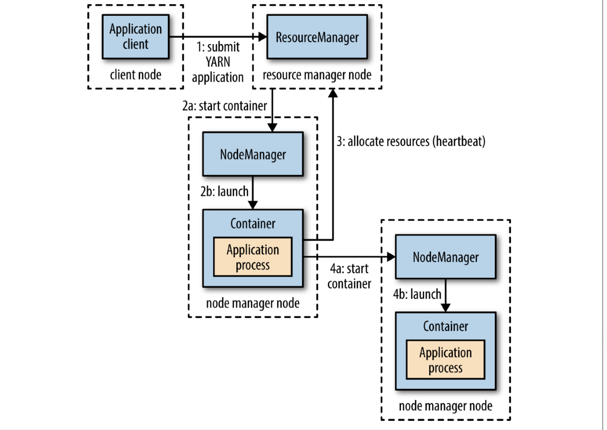

YARN应用运行过程涉及以下三个实体：

+ 资源管理器（Resource Manager）：管理集群上资源使用

+ 节点管理器（Node Manager）：运行在集群中所有节点上且能够启动和监控容器

+ 容器（Container）：用于执行特定应用程序，可以是一个Unix进程，也可以是一个Linux cgroup

首先，客户端联系资源管理器，要求它运行一个Application Master进程（步骤1）。然后，资源管理器通过调度器分配一个容器，并通过该容器所在节点的节点管理器在容器中启动applicaiton Master（步骤2a和2b）。Application Master向资源管理器请求更多的容器（步骤3）（Application Master启动后也可以仅仅在所处的容器中简单地运行一个计算，并将结果返回给客户端），以用于运行一个分布式计算（步骤4a和4b）。

客户端也有可能启动Application Master，这被称为非托管的Applicaiton Master（unmanaged application master）。

YARN本身不会为应用的各部分彼此间通信提供任何手段，而是由YARN应用自己负责。

## 资源请求

YARN有一个灵活的资源请求模型。当请求多个容器时，可以指定每个容器需要的计算机资源数量（内存和CPU），还可以指定对容器的本地限制要求。另外，YARN应用可以在运行中的任意时刻提出资源申请。

## 应用分类

按照应用到用户运行的作业之间的映射关系，可以对YARN应用分作以下三类：

1. 一个用户作业对应一个应用，如MapReduce

2. 作业的每个工作流或每个用户对话对应一个应用。比第一种情况效率高，因为容器可以在作业之间重用，并且有可能缓存作业之间的中间数据。如Spark

3. 多个用户共享一个长期运行的应用。这种应用通常是作为一种协调者的角色在运行。由于避免了启动新Application Master带来的开销，一个总是开启的Application Master意味着用户将获得非常低延迟的查询相应

## 构建YARN应用

distributed shell应用演示了如何使用YARN客户端API来处理客户端或Applicaiton Master与YARN守护进程之间的通信。

另外，Apache Slider可用于在YARN上运行现有的分布式应用，Apache Twill提供了一个简单的编程模型，用于开发YARN上的分布式应用。
