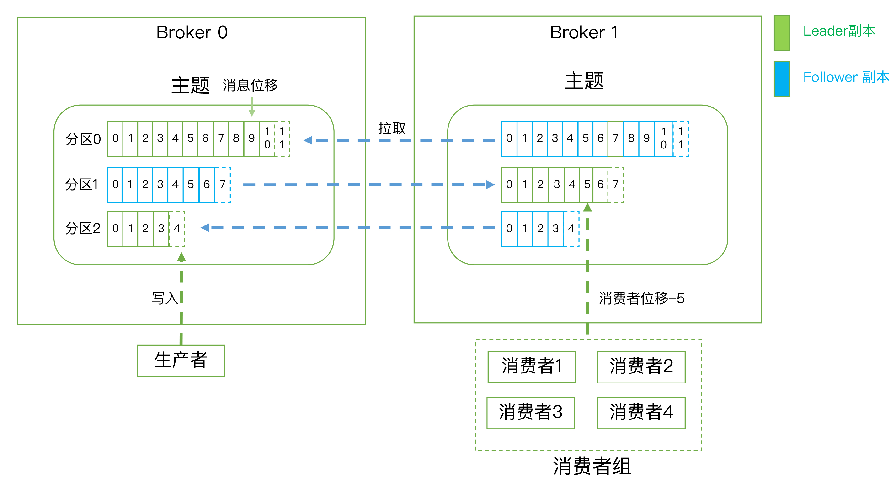

```markmap
# Kafka核心技术与实战

## Kafka原理

- 备份机制
- 请求处理
- 重平衡
- controller
- 高水位

## 生产者

- 分区机制
- 压缩算法
- 无消息丢失配置
- TCP连接管理
- 幂等性生产者与事务

## 消费者

- 消费者组
- 位移主题
- 重平衡
- 位移提交
- 异常处理
- 多线程开发
- TCP连接管理
- group监控

## 运维与监控

- 主题管理
- 动态配置
- 消费者组位移管理
- KafkaAdminClient
- 认证机制
- MirrorMaker
- 监控框架
- 授权管理
- Kafka调优
- 流处理应用搭建

## 高级Kafka应用

- Kafka Stream
- Kafka DSL

```

Apache Kafka是一款开源的基于日志结构（log-based）的分布式消息引擎系统（Messaging System），主要功能是提供一套完备的消息发布与订阅解决方案。Kafka也是一个分布式流处理平台（Distributed Streaming Platform，Kafka于0.10.0.0版本引入了流处理组件Kafka Streams），还能被用作分布式存储系统（`https://www.confluent.io/blog/okay-store-data-apache-kafka/`）。Kafka能够有效隔离上下游业务，将上游突增的流量缓存起来，以平滑的方式传导到下游子系统中，避免了流量的不规则冲击。

消息引擎系统是一组规范，企业利用这组规范在不同系统之间传递语义准确的消息，实现松耦合的异步式数据传递。可以理解为系统A发送消息给消息引擎系统，系统B从消息引擎系统中读取A发送的消息。消息的编码格式和传输协议是消息引擎系统的两个重要特征。

消息的编码格式需要满足消息表达业务语义而无歧义，同时还要能最大限度地提供可重用性以及通用性，常见的有CSV、XML、JSON或序列化框架（Protocol Buffer、Thrift）。Kafka使用纯二进制的字节序列作为消息编码格式。

常见的传输协议有两种：

+ 点对点模型（Peer to Peer，P2P）：也叫消息队列模型，同一条消息只能被下游的一个消费者消费

+ 发布/订阅模型：有一个主题（Topic）的概念，表示逻辑语义相近的消息容器，发送方被称为发布者（publisher），接收方被称为订阅者（Subscriber），可能存在多个发布者向相同的主题发送消息，而订阅者也可能存在多个，它们都能接收到相同主题的消息

Kafka同时支持这两种消息引擎模型。

消息引擎系统的主要作用是削峰填谷，即缓冲上游瞬时突发流量，使其更平滑，避免流量的震荡。消息引擎系统的另一大好处在于发送方和接收方的松耦合，这也在一定程度上简化了应用的开发，减少了系统间不必要的交互。

Kafka在设计之初就旨在提供三个方面的特性：

+ 提供一套API实现生产者和消费者
+ 降低网络传输和磁盘存储开销
+ 实现高伸缩性架构

## 术语



消息（Record）：指Kafka处理的主要对象

主题（Topic）：是承载消息的逻辑容器，在实际使用中多用来区分具体的业务，是发布订阅的对象

生产者（Producer）：向主题发布消息的客户端应用程序，生产者程序通常持续不断地向一个或多个主题发送消息

消费者（Consumer）：从主题订阅消息的客户端应用程序，消费者能同时订阅多个主题的消息

消费者组（Consumer Group）：指多个消费者实例共同组成的一个组，同时消费多个分区以实现高吞吐

消费者实例（Consumer Instance）：运行消费者应用的进程或线程

重平衡（Rebalance）：消费者组内某个消费者实例挂掉后，其他消费者实例自动重新分配订阅主题分区的过程。Rebalance是Kafka消费者实现高可用的重要手段

客户端（Client）：生产者和消费者统称为客户端

服务端（Broker）：服务代理节点，Kafka服务实例，Broker负责接收和处理客户端发送过来的请求，以及对消息进行持久化。一个Kafka集群由多个Broker组成，通常将不同的Broker部署到不同的机器上来实现高可用

副本机制（Replication）：把相同的数据复制到多台机器上来保证数据的持久化或消息不丢失。

副本（Replica）：Kafka中同一条消息能够被复制到多个地方以提供数据冗余，这些地方就是副本。副本还分为领导者副本和追随者副本，各自有不同的角色划分，副本是在分区层级下的，即每个分区可配置多个副本实现高可用

领导者副本（Leader Replica）：对外提供服务（与客户端程序进行交互）的副本

追随者副本（Follower Replica）：非领导者副本，只是被动的追随领导者副本，不对外提供服务。

分区机制（Partitioning）：将每个主题划分成多个分区（Partition），每个分区是一组有序的消息日志，生产者生产的每条消息只会被发送到一个分区中。Kafka的分区编号从0开始。分区机制用于提供伸缩性（Scalability）。副本是在分区层级定义的，每个分区下可以配置若干个副本，其中只能有一个领导者副本和N-1个追随者副本

分区（Partition）：一个有序不变的消息序列，每个主题下可以有多个分区

消息位移（Offset）：表示分区中每条消息的位置信息，是一个单调递增且不变的值

消费者位移（Consumer Offset）：表示消费者消费进度，每个消费者都有自己的消费者位移

Kafka的三层消息架构：

+ 第一层是主题层，每个主题可以配置M个分区，而每个分区又可以配置N个副本
+ 第二层是分区层，每个分区的N个副本中只能有一个充当领导者角色，对外提供服务；其他N-1个副本是追随者副本，只是提供数据冗余之用
+ 第三层是消息层，分区中包含若干条消息，每条消息的位移都是从0开始，依次递增
+ 客户端程序只能与分区的领导者副本进行交互

Kafka Broker持久化数据的方法：Kafka使用消息日志（Log）来保存数据，一个日志就是磁盘上一个只能追加写（Append-only）消息的物理文件。只能追加写入避免了缓慢的I/O操作，改为性能较好的顺序I/O写操作，这是Kafka高吞吐量特性的一个重要手段。Kafka通过日志段（Log Segment）机制定期地删除消息以回收磁盘，避免磁盘空间耗尽。在Kafka底层，一个日志又进一步细分成多个日志段，消息被追加写到当前最新的日志段中，当写满了一个日志段后，Kafka会自动切分出一个新的日志段，并将老的日志段封存起来，Kafka在后台还有定时任务会定期地检查老的日志段是否能够被删除，从而实现回收磁盘空间的目的。

## Kafka版本

版本命名：大版本号（Major Version）-小版本号（Minor Version）-修订版本号（Patch）

Kakfa目前总共演进了7个大版本，分别是0.7、0.8、0.9、0.10、0.11、1.0、2.0

0.7只提供了最基础的消息队列功能。

0.8引入了副本机制，Kafka成为了一个真正意义上完备的分布式高可靠消息队列解决方案。

0.8.2.0引入了新版本Producer API，即需要指定Broker地址的Producer。

0.9.0.0增加了安全认证/权限功能，使用Java重写了新版本的消费者API，引入了Kafka Connect组件用于实现高性能的数据抽取。新版本Producer API在这个版本中比较稳定了。

0.10.0.0引入了Kafka Streams，正式升级成分布式流处理平台。0.10.2.2起新版本Consumer API比较稳定了。

0.11.0.0提供了幂等性Producer API以及事务（Transaction）API，对Kafka消息格式做了重构。

1.0和2.0主要是Kafka Streams的各种改进。

## 集群参数配置

静态参数（Static Config）：必须在Kafka的配置文件server.properties中进行设置的参数，同时必须重启Broker进程才能令它们生效

主题级别参数的设置可以通过kafka-configs命令来修改

### Broker端参数

配置存储信息相关：

+ log.dirs：指定了Broker需要使用的若干个文件目录路径（用逗号分隔），最好保证这些目录挂载到不同的物理磁盘上，有两个好处
  + 提升读写性能
  + 实现故障转移（Failover）：Kafka1.1引入，坏掉的磁盘上的数据会自动地转移到其他正常的磁盘上，而且Broker还能正常工作
+ log.dir：只能表示单个路径，用于补充log.dirs。只要设置log.dirs就可以了，不要设置log.dir

ZooKeeper相关：

+ zookeeper.connect：指定ZooKeeper集群。可以通过chroot实现多个Kafka集群使用同一套Zookeeper集群（zk1:2181,zk2:2181,zk3:2181/kafka1和zk1:2181,zk2:2181,zk3:2181/kafka2，chroot只需要写一次，而且是加到最后的）

ZooKeeper是一个分布式协调框架，负责协调管理并保存Kafka集群的所有元数据信息，如集群有哪些Broker在运行、创建了哪些Topic、每个Topic都有多少分区以及这些分区的Leader副本都在哪些机器上等信息。

Broker连接相关（即客户端程序或其他Broker如何与该Broker进行通信的设置）：

+ listeners：监听器，指定外部连接者访问指定主机名和端口开放的Kafka服务的协议
+ advertised.listeners：Broker用于对外发布的监听器

监听器由逗号分隔的三元组组成，每个三元组的格式为<协议名称, 主机名, 端口号>。协议名称可以是标准的名字，如PLAINTEXT表示明文传输、SSL表示使用SSL或TLS加密传输等，也可以是自定义的协议名字。使用自定义协议名称后，必须指定listener.security.protocol.map参数来说明这个协议底层使用的安全协议（如listener.security.protocol.map=CONTROLLER:PLAINTEXT表示自定义协议CONTROLLER底层使用明文不加密传输数据）。另外，主机名最好不要使用IP地址

Topic管理相关：

+ auto.create.topics.enable：是否允许自动创建Topic。最好设置为false，即不允许自动创建Topic
+ unclean.leader.election.enable：是否允许Unclean Leader选举。
+ auto.leader.rebalance.enable：是否允许定期进行Leader选举。为true时表示允许Kafka定期地对一些Topic分区进行Leader重选举，Leader重选举代价很高，最好设置为false

数据留存相关：

+ log.retention.{hours|minutes|ms}：控制一条消息数据被保存多长时间
+ log.retention.bytes：指定Broker为消息保存的总磁盘容量大小，-1表示不限制
+ message.max.bytes：控制Broker能够接收大最大消息大小

### Topic级别参数

Topic级别参数会覆盖全局Broker参数的值，每个Topic都能设置自己的参数值

保存消息相关：

+ retention.ms：指定了Topic消息被保存的时长，默认为7天
+ retention.bytes：指定了要为该Topic预留多大的磁盘空间，默认值为-1，表示可以无限使用磁盘空间

处理消息相关：

+ max.message.bytes：指定了Kafka Broker能够正常接收该Topic地最大消息大小

有两种设置Topic级别参数地方法：

+ 创建Topic时通过kafka-topics.sh的--config选项进行设置
+ 通过kafka-configs修改Topic级别参数

### JVM参数

+ 环境变量KAFKA_HEAP_OPTS：JVM堆大小，推荐6GB
+ 环境变量KAFKA_JVM_PERFORMANCE_OPTS：指定GC参数，对于Java 7如果Broker所在机器的CPU资源非常充裕，建议使用CMS收集器（通过-XX:+UseCurrentMarkSweepGC指定），否则使用吞吐量收集器（通过-XX:+UseParallelGC指定），对于Java 8，推荐G1收集器

### 操作系统参数

+ 文件描述符限制：通过ulimit -n设置，推荐设置一个超大的值（ulimit -n 1000000）
+ 文件系统类型：推荐XFS
+ Swappiness（swap调优）：建议设置成一个接近0但不为0的值，如1
+ 提交时间（或Flush落盘时间）：向Kafka发送数据并不是真要等数据被写入磁盘才会认为成功，而是只要数据被写入到操作系统的页缓存（Page Cache）上就可以了，随后操作系统根据LRU算法会定期将页缓存上的脏数据落盘到物理磁盘上。这个定期由提交时间来确定，默认是5s。可以适当地增加间隔来降低物理磁盘的写操作

## 生产者

Kafka的Java生产者API主要的对象是KafkaProducer。通常开发一个生产者需要4步：

1. 构造生产者对象所需的参数对象
2. 利用第1步的参数对象创建KafkaProducer对象实例
3. 使用KafkaProducer的send方法发送消息
4. 调用KafkaProducer的close方法关闭生产者并释放各种系统资源

```java
Properties props = new Properties();
props.put("参数1", "参数1的值");
props.put("参数2", "参数2的值");
...
try (Producer<String, String> producer = new KafkaProducer<>(props)) {
   producer.send(new ProducerRecord<String, String>(...), callback);
}
```

### 分区机制（Partitioning）

分区（Partition）的作用就是提供负载均衡的能力，实现系统的高伸缩性（Scalability）。不同的分区能够放置到不同节点的机器上，而数据的读写操作也都是针对分区这个粒度进行的，这样每个节点的机器都能独立地执行各自分区的读写请求处理，还可以通过添加新的节点机器来增加整体系统的吞吐量。

不同的分布式系统对分区的叫法不尽相同，如在Kafka中叫分区，在MongoDB和Elasticsearch中就叫分片（Shard），在Hbase中则叫Region，在Cassandra中叫vnode。

分区策略是指决定生产者将消息发送到哪个分区的算法，比较常见的分区策略有：

+ 轮询策略（Round-robin策略）：顺序分配。轮询策略有非常优秀的负载均衡表现，它总是能保证消息最大限度地被平均分配到所有分区上，故默认情况下它是最合理的分区策略，也是最常用的分区策略之一
+ 随机策略（Randomness策略）：随机将消息放置到任意一个分区上。随即策略数据分布均匀性逊于轮询策略

   ```Java
   List<PartitionInfo> partitions = cluster.partitionsForTopic(topic);
   return ThreadLocalRandom.current().nextInt(partitions.size());
   ```

+ Key-ordering策略：根据消息的Key将其放置到某一个分区上。当不同Key速率相差很大时，可以考虑使用不同的Topic

   ```Java
   List<PartitionInfo> partitions = cluster.partitionsForTopic(topic);
   return Math.abs(key.hashCode()) % partitions.size();
   ```

+ 基于地理位置的分区策略：一般只针对大规模的Kafka集群，特别是跨城市、跨国家甚至是跨大洲的集群

   ```Java
   // 从所有分区中找出Leader副本在南方的所有分区，然后随机选择一个进行消息发送
   List<PartitionInfo> partitions = cluster.partitionsForTopic(topic);
   return partitions.stream().filter(p -> isSource(p.leader().host())).map(PartitionInfo::partition).findAny().get();
   ```

Kafka默认分区策略：如果指定了Key，那么默认实现Key-ordering策略，否则使用轮询策略。

Kafka支持自定义分区策略，需要实现接口`org.apache.kafka.clients.producer.Partitioner`，并显式配置生产者端参数`partitioner.class`。

这个接口只定义了两个方法：`partition()`和`close()`，通常只需要实现partition方法：

```Java
int partition(String topic, Object key, byte[] keyBytes, Object value, byte[] valueBytes, Cluster cluster);
```

### 压缩算法

> Producer端压缩，Broker端保持，Consumer端解压缩

压缩（compression）秉承了用时间去换空间的经典trade-off思想，即用CPU时间去换磁盘空间或I/O传输量，希望以较小的CPU开销带来更少的磁盘占用或更少的网络I/O传输。

Kafka的消息分为两层：消息集合（message set、record batch）以及消息（message、record）。一个消息集合中包含若干条日志项（record item），而日志项才是真正封装消息的地方。Kafka底层的消息日志由一系列消息集合日志项组成，Kafka通常不会直接操作具体的一条条消息，它总是在消息集合层面上进行写入操作。Kafka目前有V1和V2两版消息格式，V2版由0.11.0.0引入，把消息的公共部分抽取出来放到外层消息集合里面，保存压缩消息的方法也发生了变化，之前V1版本中保存压缩消息的方法是把多条消息进行压缩然后保存到外层消息的消息体字段中，而V2版本的做法是对整个消息集合进行压缩，比前者有更好的压缩效果。

在Kafka中，压缩可能发生在两个地方：生产者端和Broker端。生产者程序中配置compression.type参数即表示启用指定类型的压缩算法。大部分情况下Broker从Producer端接收到消息后仅仅是原封不动地保存而不会对其进行任何修改，有两种例外情况可能让Broker重新压缩消息：

+ Broker端指定了和Producer端不同的压缩算法，Broker端压缩算法由配置compression.type指定
+ Broker端发生了消息格式转换（主要是为了兼容老版本地消费者程序），这个过程中会涉及消息的解压缩和重新压缩，也无法使用Zero Copy特性（当数据在磁盘和网络进行传输时避免昂贵的内核态数据拷贝，从而实现快速的数据传输），对性能影响很大

通常来说解压缩发生在消费者程序中。Producer发送压缩消息到Broker后，Broker照单全收并原样保存起来，当Consumer程序请求这部分消息时，Broker依样原样发送出去，当消息到达Consumer端后，由Consumer自行解压缩还原成之前的消息。Kafka会采用的压缩算法封装进消息集合中，当Consumer读取到消息集合时，就能获取压缩算法。

Kafka支持GZIP、Snappy、LZ4、Zstandard（简写为zstd，2.1.0开始支持）等压缩算法。比较压缩算法优劣的两个指标是：压缩比和压缩/解压缩吞吐量。对于Kafka，在吞吐量方面LZ4 > Snappy > zstd和GZIP，在压缩比方面zstd > LZ4 > GZIP > Snappy。

推荐根据实际情况有针对性地启用合适的压缩算法。Producer程序运行机器上的CPU资源充足，且带宽资源有限时，推荐开启压缩。一旦启用压缩，最好规避掉不可抗拒的解压缩，如兼容老版本引入的解压缩，尽量保证不要出现消息格式转换的情况。

### 幂等生产者和事务生产者

> 幂等性Producer和事务型Producer都是kafka提供精确一次处理语义所提供的工具。幂等性Producer只能保证单分区、单会话上的消息幂等性，而事务能够保证跨分区、跨会话间的幂等性。但是比起幂等性Producer，事务型Producer的性能更差

消息交付可靠性保障：

+ 最多一次（at most once）：消息可能丢失，但绝不会被重复发送
+ 至少一次（at least once）：消息不会丢失，但有可能被重复发送
+ 精确一次（exactly once）：消息不会丢失，也不会被重复发送

kafka默认提供至少一次可靠性保障，禁止Producer重试即可提供最多一次可靠性保障，通过幂等性（Idempotence）和事务（Transaction）两种机制kafka可以提供精确一次保障。

在数学上，幂等是指某些操作或函数能够被执行多次，但每次得到的结果都是不变的。

幂等性Producer由0.11.0.0引入，Producer默认不是幂等的，通过设置参数`props.put("enable.idempotence", true)`或`props.put(ProducerConfig.ENABLE_IDEMPOTENCE_CONFIG, true)`来创建幂等性Producer。

幂等性Producer底层实现的原理是在Broker端多保存一些字段，当Producer发送了具有相同字段值的消息后，Broker能自动知晓这些消息已经重复，可以在后台默默地丢弃这些消息。

幂等性Producer的作用范围：只能保证单分区上的幂等性，即一个幂等性Producer能够保证某个主题的一个分区上不出现重复消息，它无法实现多个分区的幂等性。其次，它只能实现单会话上的幂等性，不能实现跨会话的幂等性（会话是指Producer进程的一次运行），当重启Producer进程后，幂等性保证就丧失了。

事务型Producer可以实现多分区以及多会话上的消息无重复。在数据库领域，事务提供的安全性保障是经典的ACID，即原子性（Atomicity）、一致性（Consistency）、隔离性（Isolation）和持久性（Durability）。

kafka 0.11.0.0引入了事务，提供已提交读（read committed）隔离级别。已提交读隔离级别是指当读取数据库时，只能看到已提交的数据，即无脏读，同时，当写入数据库时，也只能覆盖掉已提交的数据，即无脏写。kafka的读已提交能保证多条消息原子性地写入到目标分区，同时也能保证Consumer只能看到事务成功提交地消息。

事务型Producer能够保证将消息原子性写入到多个分区中，这批消息要么全部写入成功，要么全部失败。

设置事务型Producer：

1. 开启`enable.idempotence = true`
2. 设置Producer端参数`transactional.id`

另外，还需在Producer代码中做一些调整：

```Java
producer.initTransactions();  // 事务初始化
try {
   producer.beginTransaction();  // 事务开始
   producer.send(record1);
   producer.send(record2);
   producer.commitTransaction();  // 事务提交
} catch (KafkaException e) {
   producer.abortTransaction();  // 事务终止
}
```

Consumer端，读取事务型Producer发送的消息需要设置参数`isolaction.level`：

+ `read_uncommitted`：表明Consumer能够读取到kafka写入的任何消息，不论事务型Producer提交事务还是终止事务，其写入的消息都可以读取
+ `read_committed`：表明Consumer只会读取事务型Producer成功提交事务写入地消息，仍可读取非事务型Producer写入的所有消息。

### 生产者端TCP连接管理

Apache Kafka的所有通信都是基于TCP的，开发客户端时可以利用TCP本身提供的的高级功能，如多路复用请求以及同时轮询多个连接的能力。

Kafka Java Producer端管理TCP连接的方式是：

1. KafkaProducer实例创建时启动Sender线程，进而创建与bootstrap.servers中所有Broker的TCP连接
2. KafkaProducer实例首次更新元数据信息之后，还会再次创建与集群中所有Broker的TCP连接
3. 如果Producer端发送消息到某台Broker时发现没有与该Broker的TCP连接，也会立即创建连接
4. 如果设置Producer端的connections.max.idle.ms参数大于0，则步骤1中创建的TCP连接会被自动关闭；如果设置该参数为-1，那么步骤1中创建的TCP连接将无法被关闭，从而称为僵尸连接

配置项bootstrap.servers参数设置Producer启动时要连接的Broker地址。不建议把集群中所有的Broker信息都配置到bootstrap.servers中，建议指定3～4台。Producer一旦连接到集群中的任一台Broker，就能通过METADATA请求获取整个集群的元数据信息（包括Broker信息）。

### 无消息丢失配置

kafka只对已提交的消息（committed message）做有限度的持久化保证。

kafka无消息丢失配置最佳实践：

1. 一定要使用带有回调通知的send方法，即不要使用`producer.send(msg)`，而要使用`producer.send(msg, callback)`
2. 设置acks = all。Producer的一个参数，代表对已提交消息的定义，如果设置成all，则表明所有ISR都要接收到消息，该消息才算是已提交
3. 设置tetries为一个较大的值。Producer的参数，当出现网络的瞬时抖动时，消息发送可能会失败，配置了retries > 0的Producer能够自动重试消息发送，避免消息丢失
4. 设置`unclean.leader.election.enable = false`。Broker端参数，控制的是哪些Broker有资格竞选分区的Leader，如果一个Broker落后原先的Leader太多，那么它一旦成为新的Leader，必然会造成消息的丢失，故一般都要将该参数设置成false，即不允许这种情况的发生
5. 设置replication.factor >= 3。Broker端参数，增大冗余
6. 设置min.insync.replicas > 1。Broker端参数，控制的是消息至少要被写入到多少个副本才算是已提交，设置成大于1可以提升消息持久性
7. 确保replication.factor > min.insync.replicas。如果两者相等，那么只要有一个副本挂机，整个分区就无法正常工作了，推荐设置成replication.factor = min.insync.replicas + 1
8. 设置enable.auto.commit = false。Consumer端参数，采用手动提交位移的方式，确保消息消费完成再提交，即维持先消费消息，再更新位移的顺序。但这种处理方式可能导致消息的重复处理。

## 消费者

### 消费者组

消费者组（Consumer Group）是Kafka提供的可扩展且具有容错性的消费者机制。在一个Kafka集群中，Group ID标识唯一一个消费者组。消费者组下可以有一个或多个消费者实例，实例可以是一个单独的进程，也可以是同一进程下的线程，理想情况下，消费者实例的数量应该等于该组订阅主题的分区数。组内所有的消费者协调在一起来消费订阅的主题的所有分区，每个分区只能由同一个消费者组内的一个消费者实例来消费。

Kafka通过消费者组机制，实现了消息队列模型（所有实例都属于同一个组）和发布/订阅模型（所有实例分别属于不同的组）。

位移（Offset）记录了消费者的消费位置信息。老版本消费者组把位移保存在ZooKeeper中，新版本消费者组把位移保存在内部主题（__consumeer_offsets）中。ZooKeeper并不适合进行频繁的写更新，而消费者组的位移更新却是一个非常频繁的操作，这种大吞吐量的写操作会极大地拖慢ZooKeeper集群的性能。

重平衡（Rebalance）本质上是一种协议，规定了一个消费者组下的所有消费者如何分配订阅主题的每个分区。组成员数目发生变更、订阅主题数发生变更或订阅主题的分区数发生变更都会触发重平衡。重平衡发生时，消费者组下的所有消费者实例都会协调在一起共同参与，Kafka默认提供3种分配策略：。分配策略的目标是每个消费者实例都能够得到较为平均的分区数。在重平衡的过程中，消费者组下的所有消费者实例都会停止消费，等待重平衡完成。

### 位移主题

位移主题（Offsets Topic）用于保存消费者的位移消息。位移管理机制是将消费者的位移数据作为一条普通的Kafka消息，提交到__consumer_offsets中。位移主题包含3中消息格式：1）用于保存位移提交信息的消息，key中保存Group ID、主题名、分区号，value中保存了位移值和一些其它元数据（如时间戳和用户自定义的数据等）；2）用于保存消费者组信息的消息；3）墓碑（tombston）消息，用于删除消费者组过期位移甚至删除消费者组，消息体是null，一旦某个消费者组下的所有消费者实例都停止了，而且它们的位移数据都已被删除时，Kafka会向位移主题的对应分区写入墓碑消息，表明要彻底删除这个消费者组的信息。

当Kafka集群中的第一个消费者程序启动时，Kafka会自动创建位移主题，其分区数是50^[Broker端参数offsets.topic.num.partitions（默认为50）设置主题默认分区数]，副本数是3^[Broker端参数offsets.topic.replication.factor（默认值为3）设置默认副本数]。也可以选择使用Kafka API手动创建位移主题，需要在Kafka集群尚未启动任何消费者之前创建。

Kafka消费者提交位移时会写入位移主题。

Kafka使用Compact策略来删除位移主题中的过期消息。过期是指对于同一个Key的两条消息M1和M2，如果M1的发送时间早于M2，那么M1就是过期消息。Compact的过程就是扫描日志的所有消息，剔除过期的消息，然后把剩下的消息整理在一起。Kafka提供了专门的后台线程Log Cleaner定期地巡检待Compact的主题，看看是否存在满足条件的可删除数据。

**提交位移** 消费者位移提交在分区粒度上进行的，即消费者需要为分配给它的每个分区提交各自的位移数据。提交位移主要是为了表征消费者的消费进度，是实现消费者端语义保障的重要手段。提交位移分为自动提交和手动提交，而手动提交又分为同步提交和异步提交。消费者端配置项enable.auto.commit用于设置自动提交位移，为true时，消费者在后台定期提交位移，配置项auto.commit.interval.ms用来设置提交间隔，默认值为5s。在实际使用过程中，推荐使用手动提交机制，因为它更加可控，也更加灵活，另外，建议同时采用同步提交和异步提交两种方式。

同步提交使用API `KafkaConsumer#commitSync()`，它会提交`KafkaConsumer#poll()`返回的最新位移，并且一直等待，直到位移被成功提交才会返回，如果提交过程出现异常，则会将异常信息抛出。

异步提交使用API `KafkaConsumer#commitAsync()`，它会提交`KafkaConsumer#poll()`返回的最新位移，不会阻塞，直接返回，提供了回调函数（callback）用于实现提交之后的逻辑。

手动提交时将commitSync和commitAsync组合使用才能达到最理想的效果。对于常规性、阶段性的手动提交，调用commitAsync()避免程序阻塞，在消费者关闭前，调用commitSync()方法执行同步阻塞式的位移提交，以确保消费者关闭前能够保存正确的位移数据。利用commitSync的自动重试来规避瞬时错误（网络抖动、Broker端GC等），利用commitAsync获取较高TPS。

手动提交API `commitSync(Map<TopicPartition, OffsetAndMetadata>)`和`commitAsync(Map<TopicPartition, OffsetAndMetadata>)`用于细粒度的位移提交，参数是一个Map对象，键为TopicParition，即消费的分区，值是一个OffsetAndMetadata对象，主要保存位移数据。

```Java
// 设置自动提交位移
Properties props = new Properties();
props.put("enable.auto.commit", "true");
props.put("auto.commit.interval.ms", commitInterval);

// 同步提交
while (true) {
    ConsumerRecords<keyClass, valueClass> records = consumer.poll(Duration.ofSeconds(pollInterval));
    process(records);
    try {
        consumer.commitSync();
    } catch (CommitFailedException e) {
        handle(e);
    }
}

// 异步提交
while (true) {
    ConsumerRecords<keyClass, valueClass> records = consumer.poll(Duration.ofSedonds(pollInterval));
    process(records);
    consumer.commitAsync((offsets, exception) -> {
        if (exception != null) handle(exception);
    });
}

// 同步提交和异步提交组合使用
try {
    while (true) {
        ConsumerRecords<keyClass, valueClass> records = consumer.poll(Duration.ofSeconds(pollInterval));
        commitAsync();
    } catch(Exception e) {
        handle(e);
    } finally {
        try {
           consumer.commitSync();
        } finally {
            consumer.close();
        }
    }
}

// 细粒度提交
private Map<TopPartition, OffsetMetadata> offsets = new HashMap<>();
int count = 0;
...
while (true) {
    ConsumerRecords<keyClass, valueClass> records = consumer.poll(Duration.ofSeconds(pollInterval));
    for (ConsumerRecord<keyClass, valueClass> record : records) {
        process(record);
        offset.put(new TopicPartition(record.topic(), record.partition()), new OffsetAndMetadata(record.offset() + 1));
        if (count % 100 == 0)
            consumer.commitAsync(offsets, null);
        count++;
    }
}
```

消费者客户端在提交位移时出现不可恢复的严重错误或异常时，会抛出CommitFailedException异常，典型场景是消息处理的总时间超过了预设的max.poll.interval.ms配置项的值，有4种方法可以避免：缩短单条消息处理的时间；增加消费者端允许下游系统消费一批消息的最大时长；减少下游系统一次性消费的消息总数；下游系统使用多线程来加速消费。

### 消费者组重平衡

重平衡（Rebalance）是让一个消费者组下所有的消费者实例就如何消费订阅主题的所有分区达成共识的过程。在重平衡过程中，所有消费者实例共同参与，在Broker端协调者组件的帮助下，完成订阅主题分区的分配。在重平衡整个过程中，所有消费者实例都不能消费任何消息，对消费者的TPS影响很大。

协调者（Coordinator）专门为消费者组服务，负责为消费者组执行重平衡以及提供位移管理和成员管理。消费者提交位移时，其实是向协调者所在的Broker提交位移。消费者启动时，也是向协调者所在的Broker发送各种请求，然后由协调者负责执行消费者组的注册、成员管理记录等元数据操作。所有Broker在启动时，都会创建和开启相应的协调者组件。通过Group ID得到消费者组对应的位移主题的分区`partitionId = Math.abs(groupId.hashCode() % offsetsTopicPartitionCount)`，为消费者组服务的协调者就在该分区Leader副本所在的Broker上。

组成员数量发生变化、订阅主题数量发生变化、订阅主题的分区数发生变化都会触发重平衡。重平衡的通知机制是通过心跳线程来完成的。当协调者决定开启新一轮重平衡后，它会将REBALANCE_IN_PROGRESS封装进心跳请求的响应中，发还给消费者实例。当消费者实例发现心跳响应中包含了REBALANCE_IN_PROGRESS，就知道重平衡开始了。消费端配置项heartbeat.interval.ms设置心跳的时间间隔，其真正作用是控制重平衡通知的频率。

Kafka设计了一套消费者组状态机来帮助协调者完成整个重平衡流程。Kafka为消费者组定义了5中状态，分别是：Empty、Dead、PreparingRebalance、CompletingRebalance和Stable。

+ Empty表示组内没有任何成员，但消费者组可能存在已提交的位移数据，而且这些位移尚未过期
+ Dead表示组内没有任何成员且组的元数据信息已经在协调者端被移除，协调者组件保存着当前向它注册过的所有组信息
+ PreparingRebalance表示消费者组准备开启重平衡，此时所有成员都要重新请求加入消费者组
+ CompletingRebalance表示消费者组下所有成员已经加入，各个成员正在等待分配方案
+ Stable表示消费者组的稳定状态，该状态表明重平衡已经完成，组内各成员能够正常消费数据了

消费者组启动时的状态流转过程：一个消费者组最开始是Empty状态，当重平衡过程开启后，它会被置于PreparingRebalance状态等待成员加入，之后变更到CompletingRebalance状态等待分配方案，最后流转到Stable状态完成重平衡。当有新成员加入或已有成员退出时，消费者组的状态从Stable直接跳到PreparingRebalance状态，此时，所有现存成员就必须重新申请加入组，当所有成员都退出组后，消费者组状态变更为Empty。消费者组处于Empty状态时，Kafka定期自动删除过期位移。

在消费者端，重平衡分为两个步骤：加入组和等待领导者消费者（Leader Consumer）分配方案，分别对应JoinGroup请求和SyncGroup请求。当组内成员加入组时，它会向协调者发送JoinGroup请求，在该请求中，每个成员都要将自己订阅的主题上报，这样协调者就能收集到所有成员的订阅信息，一旦收集了全部成员的JoinGroup请求后，协调者会从这些成员中选择一个担任这个消费者组的领导者。通常情况下，第一个发送JoinGroup请求的成员自动成为领导者（这里的领导者是具体的消费者实例，既不是副本也不是协调者）。领导者消费者的任务是收集所有成员的订阅信息，然后根据这些信息，制定具体的分区消费分配方案。选出领导者后，协调者会把消费者组订阅信息封装进JoinGroup请求的响应体中，然后发给领导者，由领导者统一做出分配方案后，进入到下一步：发送SyncGroup请求，在这一步中，领导者向协调者发送SyncGroup请求，将刚刚做出的分配方案发给协调者。其他成员也会向协调者发送SyncGroup请求，只不过请求体中并没有实际的内容，主要目的是让协调者接收分配方案，然后统一以SyncGroup相应的方式分发给所有成员，这样组内所有成员就都知道自己该消费哪些分区了。

JoinGrou请求的主要作用就是将组成员订阅信息发送给领导者消费者，待领导者制定好分配方案后，重平衡流程进入到SyncGroup请求阶段。

SyncGroup请求的主要目的就是让协调者把领导者制定的分配方案下发给各个组内成员，当所有成员都成功接收到分配方案后，消费者组进入到Stable状态，即开始正常的消费工作。

协调者端重平衡分为新成员加入组、组成员主动离组、组成员崩溃离组、组成员提交位移等几个场景。

**新成员入组** 指组处于Stable状态后，有新成员加入。当协调者收到新的JoinGroup请求后，它会通过心跳请求响应的方式通知组内现有的所有成员，强制它们开启新一轮的重平衡

**组成员主动离组** 指消费者实例所在线程或进程调用close()方法发送LeaveGroup请求主动通知协调者它要退出。协调者收到LeaveGroup请求后，依然会以心跳响应的方式通知其他成员

**组成员崩溃离组** 指消费者实例出现严重故障，突然宕机导致的离组。协调者通常需要等待一段时间（配置项session.timeout.ms设置）才能感知到消费者组成员崩溃离组

**重平衡时协调者对组内成员提交位移的处理** 当重平衡开启时，协调者会给予成员一段缓冲时间，要求每个成员必须在这段时间内快速地上报自己的位移信息，然后再开启正常的JoinGroup/SyncGroup请求发送

重平衡影响消费者的TPS、过程很慢、效率不高，一定要避免因为各种参数或逻辑不合理而导致的组成员意外离组或退出的情形，如因未能及时发送心跳或消费时间过长导致消费者被踢出消费者组而引发重平衡。

消费者配置项session.timeout.out设置协调者两次收到消费者心跳请求的最大时间间隔，超出则认为消费者意外退出，默认值为10s，表示如果协调者10s内没有收到消费者组下某消费者实例的心跳，就判断该消费者实例已经挂了。而消费者配置项heartbeat.interval.ms用于设置消费者发送心跳请求的时间间隔。推荐设置session.timeout.ms = 6s，heartbeat.interval.ms = 2s，要保证消费者实例在被判断退出前能够发送至少3轮的心跳请求，即 session.timeout.ms >= 3 * heartbeat.interval.ms。

消费者配置项max.poll.interval.ms设置消费者程序两次调用poll方法的最大时间间隔，默认是5分钟，表示如果消费者程序如果在5分钟之内无法消费完poll方法返回的消息，那么消费者就会主动发起离开组的请求。推荐将该配置项设置的值大一点，为业务处理逻辑留下足够的空间。或者减小消费者配置项max.poll.records，该配置项用于设置poll()方法一次性返回消息数量的最大值。

另外，消费者端频繁的Full GC导致的长时间停顿也会引发重平衡过程。

### 多线程消费

在Kafka 0.10.1.0版本之前，发送心跳请求是在消费者主线程完成的，即调用KafkaConsumer.poll()方法的线程。从Kafka 0.10.1.0版本开始，KfakaConsumer变为了双线程设计，即用户主线程和心跳线程。用户主线程就是启动消费者应用程序main方法的线程，负责消息获取逻辑；心跳线程（Heartbeat Thread）负责定期给对应的Broker机器发送心跳请求，以标识消费者应用的存活性（liveness），另外，心跳线程会定期检查前段线程是否卡住，一旦发现卡住了，便会发起主动离组。引入心跳线程的目的是将心跳频率与主线程调用KafkaConsumer#poll()方法的频率分开，从而解耦真实的消息处理逻辑与消费者组成员存活性管理。

KafkaConsumer不是线程安全的（thread-safe），不能在多个线程中共享同一个KafkaConsumer实例，否则程序会抛出ConcurrentModificationException异常。但是，可以在其他线程中安全地调用KafkaConsumer#wakeup()来唤醒消费者。KafkaConsumer有两套多线程方案：

+ 消费者程序启动多个线程，每个线程维护专属的KafkaConsumer实例，负责完整的消息获取、消息处理流程
+ 消费者程序使用单或多线程获取消息，同时创建多个消费线程执行消息处理逻辑。获取消息的线程可以是一个，也可以是多个，每个线程维护专属的KafkaConsumer实例，处理消息则交由特定的线程来做，从而实现消息获取与消息处理的真正解耦

|方案|优点|缺点|
|---|---|---|
|多线程+多KafkaConsumer实例|方便实现；速度快，无线程间交互开销；易于维护分区内的消费顺序|占用更多系统资源；线程数受限于主题分区数；扩展性差；线程自己处理消息容易超时，从而引发重平衡|
|单线程+单KafkaConsumer实例+消息处理worker线程池|可独立扩展消息获取线程数和Worker线程数；伸缩性好|实现难度高；难以维护分区内的消息消费顺序；处理链路拉长，不易于位移提交管理|

```java
// 多线程 + 多KafkaConsumer实例
public class KafkaConsumerRunner implements Runnable {
    private final AtomicBoolean closed = new AtomicBoolean(false);
    private final KafkaConsumer consumer;

    public void run() {
        try {
            consumer.subscribe(Arrays.asList(topicList));
            while (!closed.get()) {
                ConsumerRecords records = consumer.poll(Duration.ofMillis(pollInterval));
                //  执行消息处理逻辑
            }
        } catch (WakeupException e) {
            // Ignore exception if closing
            if (!closed.get()) throw e;
        } finally {
            consumer.close();
        }
    }

    // Shutdown hook which can be called from a separate thread
    public void shutdown() {
        closed.set(true);
        consumer.wakeup();
    }
}

// 单线程+单KafkaConsumer实例+消息处理worker线程池 
private final KafkaConsumer<String, String> consumer;
private ExecutorService executors;
...

private int workerNum = ...;
executors = new ThreadPoolExecutor(workerNum, workerNum, 0L, TimeUnit.MILLISECONDS, new ArrayBlockingQueue<>(1000), new ThreadPoolExecutor.CallerRunsPolicy());
...
while (true) {
    ConsumerRecords<String, String> records = consumer.poll(Duration.ofSeconds(pollInterval));
    for (final ConsumerRecord record : records) {
        executors.submit(new Worker(record));
    }
}
...
```

### 重设消费者组位移

Kafka消费者读取消息支持重演（replayable）。Kafka是基于日志结构（log-based）的消息引擎，消费者在消费消息时，仅仅是从磁盘文件上读取数据，是只读的操作，不会删除消息数据，同时由于位移数据是由消费者控制的，因此它能很容易地修改位移的值，实现重复消费历史数据的功能。

重设位移可以从两个维度来进行：位移维度和时间维度。从位移维度是指根据位移值来重设，即直接把消费者的位移值重设成指定的位移值。从时间维度是指根据时间来重设，可以给定一个时间，让消费者把位移调整成大于该时间的最小位移，也可以给出一段时间间隔，让消费者直接将位移调回该时间间隔之前的位移值。Kafka支持7种重设策略：

+ Earlist：把位移值调整到当前最早位移处。Kafka会周期删除消息，最早位移不一定就是0
+ Latest：把位移调整到最新末端位移处
+ Current：把位移调整成消费者当前提交的最新位移处
+ Specified-Offset：把位移调整成指定位移，指定位移的绝对数值
+ Shift-By-N：把位移调整到消费者当前提交的最新位移+N处（N可以是负值），指定位移的相对数值
+ DateTime：把位移调整到大于给定时间的最小位移处
+ Duration：把位移调整到距离当前时间指定间隔的位移处，具体格式是PnDTnHnMnS

重设消费者组位移有两种方式：通过消费者API来实现和通过kafka-consumer-groups命令行脚本来实现。

通过KafkaConsumer的seek()方法、seekToBeginning()、seekToEnd()方法来重设位移。seek()方法一次只能重设一个分区的位移，seekToBeginning和seekToEnd可以一次重设多个分区的位移。

```java
void seek(TopicPartition partition, long offset);
void seek(TopicPartition partition, OffsetAndMetadata offsetAndMetadata);
void seekToBeginning(Collection<TopicPartition> partitions);
void seekToEnd(Collection<TopicPartition> partitions);
```

Earliest策略实现方式：

```java
Properties consumerProperties = new Properties();
// 禁止自动提交位移
consumerProperties.put(ConsumerConfig.ENABLE_AUTO_COMMIT_CONFIG, false);
consumerProperties.put(ConsumerConfig.GROUP_ID_CONFIG, groupID);
consumerProperties.put(ConsumerConfig.AUTO_OFFSET_RESET_CONFIG, "earliest");
consumerProperties.put(ConsumerConfig.KEY_DESERIALIZER_CLASS_CONFIG, StringDeserializer.class.getName());
consumerProperties.put(ConsumerConfig.VALUE_DESERIALIZER_CLASS_CONFIG, StringDeserializer.class.getName());
consumerProperties.put(ConsumerConfig.BOOTSTRAP_SERVERS_CONFIG, brokerList);

String topic = "topicName";

// Earliest策略实现方式

try (final KafkaConsumer<String, String> consumer = new KafkaConsumer<>(consumerProperties)) {
    consumer.subscribe(Collections.singleton(topic));
    // 调用带长整型的poll()方法，而不要调用KafkaConsumer#poll(Duration.ofSecond(seconds))
    consumer.poll(0);
    // 调用seekToBeginning()时需要一次性构造主题的所有分区对象
    consumer.seekToBeginning(consumer.partitionsFor(topic).stream().map(partitionInfo -> new TopicPartition(topic, partitionInfo.partition())).collect(Collectors.toList()));
}

// Latest策略实现方式

try (final KafkaConsumer<String, String> consumer = new KafkaConsumer<>(consumerProperties)) {
    consumer.subscribe(Collections.singleton(topic));
    // 调用带长整型的poll()方法，而不要调用KafkaConsumer#poll(Duration.ofSecond(seconds))
    consumer.poll(0);
    // 调用seekToEnd()时需要一次性构造主题的所有分区对象
    consumer.seekToEnd(consumer.partitionsFor(topic).stream().map(partitionInfo -> new TopicPartition(topic, partitionInfo.partition())).collect(Collectors.toList()));
}

// Current策略实现方式
// 首先调用partitionsFor()方法获取给定主题的所有分区，然后依次获取对应分区上的已提交位移，最后通过seek()方法重设位移到已提交位移处

try (final KafkaConsumer<String, String> consumer = new KafkaConsumer<>(consumerProperties)) {
    consumer.subscribe(Collections.singleton(topic));
    // 调用带长整型的poll()方法，而不要调用KafkaConsumer#poll(Duration.ofSecond(seconds))
    consumer.poll(0);
    consumer.partitionsFor(topic)
      .stream()
      .map(info -> new TopicPartition(topic, info.partition()))
      .forEach(tp -> {
          long committedOffset = consumer.committed(tp).offset();
          consumer.seek(tp, committedOffset);
      });
}

// Specified-Offset策略实现方式
// 直接调用seek()方法

try (final KafkaConsumer<String, String> consumer = new KafkaConsumer<>(consumerProperties)) {
    consumer.subscribe(Collections.singleton(topic));
    // 调用带长整型的poll()方法，而不要调用KafkaConsumer#poll(Duration.ofSecond(seconds))
    consumer.poll(0);
    long targetOffset = offset;
    consumer.partitionsFor(topic)
      .stream()
      .map(info -> newTopicPartition(topic, info.partition()))
      .forEach(tp -> consumer.seek(tp, targetOffset))
}

// Shift-By-N策略实现

try (final KafkaConsumer<String, String> consumer = new KafkaConsumer<>(consumerProperties)) {
    consumer.subscribe(Collections.singleton(topic));
    // 调用带长整型的poll()方法，而不要调用KafkaConsumer#poll(Duration.ofSecond(seconds))
    consumer.poll(0);
    long targetOffset = offset;
    consumer.partitionsFor(topic)
      .stream()
      .map(info -> newTopicPartition(topic, info.partition()))
      .forEach(tp -> {
         long targetOffset = consumer.committed(tp).offset() + N;
         consumer.seek(tp, targetOffset)
      })
}

// DateTime策略实现
// 构造LocalDateTime实例并查找对应的位移值，最后调用seek()

try (final KafkaConsumer<String, String> consumer = new KafkaConsumer<>(consumerProperties)) {
    consumer.subscribe(Collections.singleton(topic));
    // 调用带长整型的poll()方法，而不要调用KafkaConsumer#poll(Duration.ofSecond(seconds))
    consumer.poll(0);
    long ts = LocalDateTime.of(year, month, day, hour...).toInstant(ZoneOffset.ofHours(8)).toEpochMilli();
    Map<TopicPartition, Long> timeToSearch = consumer.partitionsFor(topic)
                                               .stream().map(info -> new TopicPartition(topic, info.partition()))
                                               .collect(Collectors.toMap(Function.identity(), tp -> ts));

    for (Map.Entry<TopicPartition, OffsetAndTimestamp> entry : consumer.offsetsForTimes(timeToSearch).entrySet()) {
        consumer.seek(entry.getKey(), entry.getValue().offset());
    }
}

// Duration策略实现


try (final KafkaConsumer<String, String> consumer = new KafkaConsumer<>(consumerProperties)) {
    consumer.subscribe(Collections.singleton(topic));
    // 调用带长整型的poll()方法，而不要调用KafkaConsumer#poll(Duration.ofSecond(seconds))
    consumer.poll(0);
    Map<TopicPartition, Long> timeToSearch = consumer.partitionsFor(topic)
                                               .stream()
                                               .map(info -> new TopicPartition(topic, info.partition()))
                                               .collect(Collectors.toMap(Function.identity(), tp -> System.currentTimeMillis() - durationMs));

    for (Map.Entry<TopicPartition, OffsetAndTimestamp> entry : consumer.offsetsForTimes(timeToSearch).entrySet()) {
        consumer.seek(entry.getKey(), entry.getValue().offset());
    }
}
```

通过kafka-consumer-groups脚本重设位移。Earliest策略直接指定`--to-earliest`，Latest策略直接指定`--to-latest`，Current策略直接指定`--to-current`，Specified-Offset策略直接指定`--to-offset`，Shift-By-N策略直接指定`--shift-by N`，DateTime策略直接指定`--to-datetime`，Duration策略直接指定`--by-duration <duration>`。

### 消费者端TCP连接管理

构建KafkaConsumer实例时不会创建任何TCP连接，TCP连接是在调用KafkaConsumer#poll()方法时被创建的。在poll方法内部有3个时机可以创建TCP连接：

+ 发起FindCoordinator请求时：消费者程序首次启动调用poll()方法时，会向集群中当前负载最小的Broker（消费者连接的所有Broker中带发送请求最少的Broker）发送FindCoordinator请求，获取其协调者所在的Broker
+ 连接协调者时：Broker处理完FindCoordinator请求后，会返回对应的响应结果，显式地告诉消费者其协调者所在的Broker，消费者知道了协调者所在的Broker后，会创建连向该Broker的TCP连接。只有成功连入协调者，协调者才能开启正常的组协调操作，如加入组、等待组分配方案、心跳请求处理、位移获取、位移提交等
+ 消费数据时：消费者会为每个要消费的分区创建连向该分区领导者副本所在的Broker的TCP连接

消费者程序首次启动时，对Kafka集群一无所知，用Borker节点ID为-1来表示尚未获取到Broker数据。另外，为了让组协调请求和数据获取请求使用不同的TCP连接，消费者与协调者建立TCP连接时会用Integer.MAX_VALUE减去协调者所在Broker的真实ID得到的值作为Borker节点ID。

消费者程序会创建3类TCP连接：确定协调者和获取集群元数据、连接协调者令其执行组成员管理操作、执行实际的消息获取。

消费者关闭TCP连接分为主动关闭和Kafka自动关闭。主动关闭是指显式地调用消费者API KafkaConsumer.close()方法或执行Kill命令来关闭消费者。自动关闭由消费者端参数connection.max.idle.ms控制，默认值为9分钟，即如果某个TCP连接上连续9分钟都没有任何请求通过，消费者会强行关闭这个TCP连接。

当消费者建立执行实际消息获取的TCP连接后，就会关闭用来确定协调者和获取集群元数据的TCP连接，之后会使用执行消息获取的TCP连接定期请求元数据。

### 消费进度监控

消费者Lag（Consumer Lag）用于表示Kafka消费者消费的滞后程度（即消费者当前落后于生产者的程度）。消费者Lag的单位时消息数，一般在主题级别讨论Lag，但是Kakfa监控Lag是在分区级别。

有3中方法监控消费者消费进度：

+ 使用Kafka自带的命令行工具kafka-consumer-groups脚本。通过命令`bin/kafka-consumer-groups.sh --bootstrap-server <Kafka broker连接信息> --describe --group <group名称>`来查看某个给定消费者的Lag值，Kafka连接信息就是`<主机名:端口>`对，而group名称就是消费者程序中设置的group.id的值，kafka-consumer-groups脚本会按照消费者组订阅主题的分区进行展示，每个分区一行数据，除了主题、分区等信息外，还会汇报每个分区当前最新生产的消息的位移值（LOG-END-OFFSET列值）、该消费者组当前最新消费消息的位移值（CURRENT-OFFSET值）、LAG值（LOG-END-OFFSET - CURRENT-OFFSET）、消费者实例ID、消费者连接Broker的主机名以及消费者的CLIENT-ID信息
+ 使用Kafka Java Consumer API编程。Java Consumer API分别提供了查询当前分区最新消息位移（KafkaConsumer#endOffsets()）和消费者组最新消费消息位移（AdminClient#listConsumerGroupOffsets()）两组方法，使用它们就能计算出对应的Lag
+ 使用Kafka自带的JMX监控指标。Kafka消费者提供了一个名为kafka.consumer:type=consumer-fetch-manager-metrics,client-id="{client-id}"的JMX指标，里面有很多属性，records-lag-max和records-lead-min两组属性分别表示此消费者在测试窗口时间内曾经达到的最大Lag值和最小Lead值（Lead值是指消费者最新消费消息的位移与分区当前第一条消息位移的差值），JMX指标kafka.consumer:type=consumer-fetch-manager-metrics,partition="{partition}",topic="{topic}",client-id="{client-id}"可以获取分区级别的Lag和Lead

## Broker

### 动态Broker参数

Kafka安装目录的config子目录下的文件server.properties保存了Broker端的配置项设置。

参数优先级：per-broker参数 > cluster-wide参数 > static参数 > kafka默认值。

Kafka 1.1.0版本之前，设置Broker端任何配置项都需要在server.properties中增加一行对应的配置，之后再启动Broker进程，令参数生效。Kafka 1.1.0版本正式引入了动态Broker参数（Dynamic Broker Configs），修改参数值后，无需重启Broker就能立即生效。相应的，server.properties中配置的参数被称为静态参数（Static Configs）。

Broker参数分为read-only、per-broker和cluster-wide三类。read-only参数只有重启Broker才能领修改生效；per-broker属于动态参数，修改后只会在对应的Broker上生效；cluster-wide参数也属于动态参数，修改后会在整个集群范围内生效。

动态Broker参数使用场景：

+ 动态调整Broker端各种线程池大小，实时应对突发流量
+ 动态调整Broker端连接信息或安全配置信息
+ 动态更新SSL Keystore有效期
+ 动态调整Broker端Compact操作性能
+ 实时变更JMX指标收集器（JMX Metrics Reporter）

Kafka将动态Broker参数保存在Zookeeper的持久化znode节点/config/brokers中。该节点下有固定以`<defualt>`为名的和以broker_id为名的两类子节点，分别保存cluster-wide范围的动态参数和per-broker范围的动态参数。

动态参数通过kafka-configs脚本设置。如果要设置cluster-wide范围的动态参数，需要显式指定entity-default。如果要设置per-broker范围的动态参数，需要使用--entity-name指定Broker。删除动态参数需要指定delte-config。

通过Kafka官网中的Broker端参数列表或直接运行无参数的kafka-configs脚本可以获取动态Broker参数列表。

+ log.retention.ms：设置日志留存时间
+ num.io.threads：设置Broker端io线程池线程数目
+ num.network.threads：设置Broker端网络线程池线程数目
+ ssl.keystore.type
+ ssl.keystore.location
+ ssl.keystore.password
+ ssl.key.password
+ num.replica.fetchers：设置追随者副本向领导者副本拉取数据时的线程数目

## 控制器

控制器组件（Controller）是Apache Kafka的核心组件，主要作用是在Apache Zookeeper的帮助下管理和协调整个Kafka集群。集群中任意一台Broker都能充当控制器的角色，但是，在运行过程中，只能有一个Broker称为控制器，行使管理和协调的职责。JMX指标activeController用于反映监控控制器的存活状态。

控制器重度依赖Zookeeper，大量使用Watch功能实现对集群的协调管理。

Broker在启动时，会尝试去Zookeeper中创建/controller节点，第一个成功创建/controller节点的Broker会被指定为控制器。

控制器的职责大致可以分为5种：

+ 主题管理：kafka-topics脚本提供的对Kafka主题的创建、删除以及分区增加的功能是控制器实现的
+ 分区重分配：kafka-reassign-partitions脚本提供的对已有主题分区进行细粒度的分配功能是控制器实现的
+ Preferred领导者选举：Preferred领导者选举主要是Kafka为了避免部分Broker负载过重而提供的一种换Leader的方案
+ 集群成员管理：依赖Watch功能和Zookeeper临时节点组合自动检测新增Broker、Broker主动关闭及被动宕机
+ 数据服务：向其他Broker提供数据服务，控制器上保存了最全的集群元数据信息，其他所有Broker会定期接收控制器发来的元数据更新请求，从而更新其内存中的缓存数据

控制器组件会利用Watch机制检查Zookeeper的/brokers/ids节点下的子节点数量变更，当有新Broker启动后，它会在/brokers下创建专属的znode节点，一旦创建完毕，Zookeeper会通过Watch机制将消息通知推送给控制器，这样，控制器就能自动地感知这个变化，进而开启后续的新增Broker作业。每个Broker启动后，会在/brokers/ids下创建一个临时znode，当Broker宕机或主动关闭后，该Broker与Zookeeper的会话结束，这个znode会被自动删除。同理，Zookeeper的Watch机制将这一变更推送给控制器，这样控制器就能知道有Broker关闭或宕机了。

控制器中保存的数据：

+ 获取某个Broker上的所有分区
+ 某组Broker上的所有副本
+ 某个Topic的所有副本
+ 某个Topic的所有分区
+ 当前存活的所有副本
+ 正在进行重分配的分区列表
+ 某组分区下的所有副本
+ 当前存活Broker列表
+ 正在关闭中的Broker列表
+ 正在进行Preferred Leader选举的分区
+ 分配给每个分区的副本列表
+ Topic列表
+ 每个分区的Leader和ISR信息
+ 移除某个Topic的所有信息

这些数据在Zookeeper中也保存了一份，每当控制器初始化时，它都会从Zookeeper上读取对应的元数据并填充到自己的缓存中。

控制器故障转移（Failover）：当运行中的控制器突然宕机或意外终止时，Kafka能够快速地感知到，并立即启用备用控制器来代替之前失败的控制器，用于解决控制器的单点失效（Single Point of Failture）问题。控制器宕机后，Zookeeper通过Watch机制感知到并删除了/controller临时节点，之后，所有存活的Broker开始竞选新的控制器身份，第一个成功创建/controller节点的Broker成为新的控制器。新控制器从Zookeeper中读取集群元数据信息，并初始化到自己的缓存中。至此，控制器的故障恢复完成，可以行使正常的工作职责。

在Kafka 0.11版本之前，控制器是多线程设计，会在内存创建很多个线程，并大量使用ReentrantLock同步机制来解决多线程访问共享可变数据引起的线程安全问题。Kafka 0.11版本重构了控制器的底层设计，**把多线程方案改成了单线程加事件队列的方案**。引入了一个事件处理线程，统一处理各种控制器事件，然后控制器将原来执行的操作全部建模成一个个独立的事件，发送到专属的事件队列中，供此线程消费。另外，还**将之前同步操作Zookeeper全部改为异步操作**。Kafka 2.2版本还支持不同优先级请求的处理，Kafka将控制器发送的请求与普通数据类请求分开，实现了控制器请求单独处理的逻辑。

当控制器组件出现问题时，如主题无法删除了，或者重分区hang住了，不用重启Kafka Broker或控制器，一个简单快速的方式是通过Zookeeper命令`rmr /controller`手动删除/controller节点，引发控制器的重选举，同时避免重启Broker导致的消息处理中断。

## 消息

### 高水位

Kafka中水位是用消息位移来表征的。

在Kafka中，高水位（High Watermark）的作用有两个：一是定义消息可见性，即用来标识分区下的哪些消息是可以被消费者消费的；一是帮助Kafka完成副本同步。

```bob-svg

|  已提交消息   |     未提交消息      |
+-+-+-+-+-+-+-+-+-+-+--+--+--+--+--+~~+
|0|1|2|3|4|5|6|7|8|9|10|11|12|13|14|15!
+-+-+-+-+-+-+-+-+-+-+--+--+--+--+--+~~+
                 ^                  ^
                 |                  |
               高水位          日志末端位移
                              Log End Offset
```

高水位标记第一条未提交消息的位移值，日志末端位移（Log End Offset，LEO）表示副本写入下一条消息的位移值。同一副本对象，其高水位值不会大于LEO值。在分区高水位以下的消息被认为是已提交消息，反之，即介于高水位和LEO之间的消息就是未提交消息，消费者只能消费已提交消息。高水位和LEO是副本对象的两个重要属性，所有副本都有对应的高水位和LEO值，分区的高水位就是其Leader副本的高水位。每个副本对象都保存了一组高水位值和LEO值，领导者副本所在的Broker上还保存了追随者副本的LEO值，把领导者副本所在Broker上保存的追随者副本称为远程副本（Remote Replica）。Kafka副本机制在运行过程中，会更新追随者副本上的高水位和LEO值，同时也会更新领导者副本的高水位和LEO以及所有远程副本的LEO，但不会更新远程副本的高水位值。远程副本用于确定分区高水位。追随者副本满足以下两个条件时，被认为与Leader副本保持同步：一是追随者副本在ISR中；一是追随者副本LEO值落后于领导者副本LEO值的时间，不超过Broker端配置项replica.tag.time.max.ms的值（默认为10s）。

领导者副本处理生产者请求的逻辑如下：

1. 写入消息到本地磁盘
2. 更新分区高水位值
   1. 获取领导者副本所在Broker端保存的所有追随者副本远程副本的LEO值（LEO-1, LEO-2, ..., LEO-n）
   2. 获取领导者副本高水位值：currentHW
   3. 更新currentHW = max{currentHW, min(LEO-1, LEO-2, ..., LEO-n)}

领导者副本处理拉取消息的逻辑如下：

1. 读取磁盘（或页缓存）中的消息数据
2. 使用追随者副本发送请求中的位移值更新远程副本LEO值
3. 更新分区高水位值

追随者副本从领导者副本拉取消息的处理逻辑如下：

1. 写入消息到本地磁盘
2. 更新LEO值
3. 更新高水位值
   1. 获取Leader发送的高水位值：currentHW
   2. 获取步骤2中更新过的LEO值：currentLEO
   3. 更新高水位为min(currentHW, currentLEO)

### Leader Epoch

Kafka 0.11版本中正式引入了Leader Epoch，来规避因高水位更新错配导致的各种不一致问题。Leader Epoch可以认为是领导者版本，由两部分组成：Epoch和起始位移。Epoch是一个单调增加的版本号，每当领导者副本发生变更时，都会增加该版本号，较小版本号的领导者副本被认为是过期的领导者副本，不能再行使领导者副本的权力。起始位移（Start Offset）是领导者副本在该Epoch值上写入的首条消息的位移。

Kafka Broker会在内存中为每个分区都缓存Leader Epoch数据，同时它还会定期地将这些信息持久化到一个checkpoint文件中。当领导者副本写入消息到磁盘时，Broker会尝试更新这部分缓存。如果该领导者副本是首次写入消息，那么Broker会向缓存中增加一个Leader Epoch条目，否则就不做更新。这样，每次有领导者副本变更时，新的领导者副本会查询这部分缓存，取出对应的Leader Epoch的起始位移，以避免数据丢失和不一致情况。

### 主题管理

从Kafka 2.2版本开始，推荐用--bootstrap-server参数替换--zookeeper参数，使用--zookeeper会绕过Kafka的安全认证体系。

+ 创建主题：`bin/kafka-topics.sh --bootstrap-server broker_host:port --create --topic my_topic_name --partitions <partition_num> --replication-factor <rep_factor>`
+ 查询所有主题的列表：bin/kafka-topics.sh --bootstrap-server broker_host:port --list
+ 查询某个主题的详细信息：`bin/kafka-topics.sh --bootstrap-server broker_host:port --describe --topic <topic_name>`。如果不指定具体的主题名称，那么Kafka将返回所有可见主题的详细信息
+ 增加主题分区：`bin/kafka-topics.sh --bootstrap-server broker_host:port --alter --topic <topic_name> --partitions <new_partition_num>`。目前Kafka不允许减少某个主题的分区数，指定的分区数一定要比原分区数大，否则，Kafka会抛出InvalidPartitionsException异常
+ 删除主题：`bin/kafka-topics.sh --bootstrap-server broker_host:port --delete --topic <topic_name>`
+ 修改主题级别参数：`bin/kafka-configs.sh --zookeeper zookeeper_host:port --entity-type topics --entity-name <topic_name> --alter --add-config <topic_config> = <value>`。设置常规的主题级别参数还是使用--zookeeper
+ 修改主题限速（设置领导者副本和追随者副本使用的带宽）：`bin/kafka-configs.sh --zookeeper zookeeper_host:port --alter --add-config 'leader.replication.throttled.rate=<leader_rate>,follower.replication.throttled.rate=<follower_rate>' --entity-type brokers --entity-name <broker_id>`。需要为主题副本所在的每一个Broker都进行设置。为该主题设置要限速的副本：`bin/kafka-configs.sh --zookeeper zookeeper_host:port --alter --add-config 'leader.replication.throttled.replicas=*,follower.replication.throttled.replicas=*' --entity-type topics --entity-name <borker_id>`
+ kafka-reassign-partitions脚本用于变更副本数目
+ 主题分区迁移

## 副本机制

副本机制（Replication）通常是指分布式系统在多台网络互联的机器上保存有相同的数据副本。副本机制有以下优点：

+ 提供数据冗余。即使系统部分组件失效，系统依然能够继续运转，增加整体可用性以及数据持久性
+ 提供高伸缩性。支持横向扩展，能够通过增加机器的方式来提升读性能，进而提高读操作吞吐量
+ 改善数据局部性。允许将数据放入与用户地理位置相近的地方，从而降低系统延时

Kafka副本（Replica）是一个只能追加写消息的提交日志，是在分区层级下定义的，每个分区有若干副本。

kafka使用基于领导者（Leader-based）的副本机制。在Kafka中，副本分为领导者副本（Leader Replica）和追随者副本（Follower Replica），每个分区在创建时都要选举一个副本，称为领导者副本，其余副本称为追随者副本。在Kafka中，追随者副本不对外提供服务，即任何一个追随者副本都不能响应消费者和生产者的读写请求，所有的请求都必须由领导者副本来处理。追随者副本唯一的任务就是从领导者副本异步拉取消息，并写入到自己的提交日志中，从而实现与领导者副本的同步。当领导者副本所在的Broker宕机时，Kafka依托于ZooKeeper提供的监控功能能够实时感知到，并立即开始新一轮的领导者选举，从追随者副本中选一个作为新的领导者。老Leader副本重启回来后，只能作为追随者副本加入到集群中。

追随者副本不对外提供服务有两个方面的好处：一是方便实现Read-Your-Writes，即使用消费者API向Kafka成功写入消息后，可以马上使用消费者API读取到刚才生产的消息；一是方便实现单调读（Monotonic Reads），即对于一个消费者而言，在多次消费消息时不会看到某条消息一会存在一会不存在。

**ISR副本集合（in-sync Replicas）** ISR中的副本都是与Leader同步的副本。Broker端设置项replica.lag.time.max.ms（默认值为10s）设置追随者副本能够落后领导者副本的最长时间间隔，用于判断追随者副本是否与领导者副本同步。ISR是一个动态调整的集合。

**Unclear领导者选举** Kafka把所有不在ISR中的存活副本都称为非同步副本，Broker端配置项unclean.leader.election.enable设置是否允许Unclean领导者选举，即ISR为空时是否选择非同步副本作为新的领导者副本。开启Unclean领导者选择可能会造成数据丢失，但是提高了高可用性；禁止Unclean领导者选举维护了数据的一致性，避免了消息丢失，但牺牲了高可用性。不建议开启Unclean领导者选举。

## 请求处理

[请求处理框架图]

Kafka在TCP基础上定义了一组请求协议，用于实现各种各样的交互操作，所有请求都是通过TCP网络以Socket的方式进行通讯的。

Kafka Broker端采用Reactor模式处理请求。Kafka的Broker端有SocketServer组件（类似于Reactor模式中的Dispatcher）、Acceptor线程、网络线程池和IO线程池。网络线程池中的线程将请求放到共享队列中，Broker端配置项num.network.threads用于调整网络线程池中的线程数，默认值为3，表示每台Broker启动时会创建3个网络线程，专门处理客户端发送的请求。IO线程池中的线程才是执行请求逻辑的线程，Broker端配置项num.io.threads用于设置IO线程池中的线程数目，默认值是8，表示每台Broker启动后自动创建8个IO线程处理请求。Acceptor线程采用轮询的方式将入站请求公平地发到所有网络线程中。当网络线程拿到请求后，将请求放入到一个共享请求队列中，IO线程负责从该队列中取出请求，执行真正的处理。当IO线程处理完请求后，会将生成的响应发送到网络线程池的响应队列中，然后由对应的网络线程负责将Reponse返回给客户端。

请求队列是所有网络线程共享的，而响应队列则是每个网络线程专属的。因为Dispatcher只是用于请求分发而不负责响应回传，只能让每个网络线程自己发送响应给客户端，所以响应没必要放在一个公共的地方。

Broker端还有一个Purgatory组件，用来缓存延时请求（Delayed Request）。延时请求是指一时未满足条件不能立刻处理的请求。如设置了acks=all的PRODUCE请求必须等待ISR中所有副本都接受了消息后才能返回，此时处理该请求的IO线程必须等待其他Broker的写入结果，当请求不能立刻处理时，就会暂存在Purgatory中，稍后一旦满足了完成条件，IO线程会继续处理该请求，并将Response放入对应网络线程的响应队列中。

如果是PRODUCE生产请求，则将消息写入到底层的磁盘日志中；如果是FETCH请求，则从磁盘或页缓存中读取消息。

Kafka中的请求可以分为数据类请求（用于操作消息数据）和控制类请求（用于执行特定的Kafka内部动作）。由于控制类请求可以直接令数据类请求失效，2.3版本实现了数据类请求和控制类请求的分离，使用两套网络线程池和IO线程池组合分别处理数据类请求和控制类请求。

数据类请求
PRODUCE请求用于生产消息
FETCH请求用于消费消息
METADATA请求用于请求Kafka集群元数据信息

控制类请求
LeaderAndIsr请求用于更新领导者副本、追随者副本以及ISR集合
StopReplica请求用于下线副本

## 拦截器

拦截器的基本思想就是允许应用程序在不修改逻辑的情况下，动态地实现一组可插拔地事件处理逻辑链，从而在主业务操作的前后多个时间点上插入对应的拦截逻辑。

kafka拦截器分为生产者拦截器和消费者拦截器。生产者拦截器允许在发送消息前以及消息提交成功后植入拦截器逻辑；而消费者拦截器支持在消费消息前以及提交位移后编写特定逻辑。它们都支持链的方式，即可以将一组拦截器串连成一个大的拦截器，kafka会按照添加顺序依次执行拦截器逻辑。

kafka拦截器的设置方法是通过参数interceptor.classes配置完成的，指定一组类的列表，每个类就是特定逻辑的拦截器实现类（指定拦截器类时要指定它们的全限定名）。

Producer端拦截器实现类需要继承`org.apache.kafka.clients.producer.ProducerInterceptor`接口，该接口有两个核心方法：

+ onSend：会在消息发送之前被调用
+ onAcknowledgement：会在消息成功提交或发送失败之后被调用，onAcknowledgement的调用要早于callback的调用

Consumer端拦截器实现类需要继承`org.apache.kafka.clients.consumer.ConsumerInterceptor`接口，该接口有两个核心方法：

+ onConsume：在消息返回给Consumer程序之前调用
+ onCommit：Consumer在提交位移之后调用该方法

kafka拦截器可以应用于包括客户端监控、端到端系统性能检测、消息审计等多种功能在内的场景。

## 工具脚本

Kafka默认提供了很多歌命令行脚本，用于实现各种各样的功能和运维管理。

connect-standalone和connect-distributed两个脚本分别是Kafka Connect组件单节点Standalone模式和多节点Distributed模式启动脚本。Kafka Connect组件用于实现Kafka与外部系统之间的数据传输。

kafka-acls脚本用于设置Kafka权限。

kafka-broker-api-versions脚本用于验证不同Kafka版本之间服务器和客户端的适配性。在0.10.2.0之前，Kafka是单向兼容的，即高版本的Broker能够处理低版本Client发送的请求，反过来则不行，自0.10.2.0版本开始，Kafka正式支持双向兼容，即低版本的Broker也能处理高版本Client的请求。

kafka-configs脚本用于设置Kafka参数。

kafka-producer-perf-test脚本用于测试生产者性能。

kafka-consumer-perf-test脚本用于测试消费者性能。

kafka-delegation-tokens脚本用于管理Delegation Token。

kafka-delete-records脚本用于删除Kafka的分区消息。

kafka-dump-log脚本用于查看kafka消息文件的内容，包括消息的各种元数据信息，甚至是消息体本身。

+ --files：指定消息文件
+ --deep-iteration：输出每条具体的信息。不指定时显示消息批次（RecordBatch）或消息集合（MessageSet）的元数据信息，如创建时间、使用的压缩算法、CRC校验值等
+ --print-data-log：显示消息里面的实际数据

kafka-log-dirs脚本用于查询各个Broker上的各个日志路径的磁盘占用情况。

kafka-mirror-maker脚本用于实现kafka集群间的消息同步。

kafka-preferred-replica-election脚本用于执行Preferred Leader选举，可以为指定的主题执行换Leader操作。

kafka-reassign-partitions脚本用于执行分区副本迁移以及副本文件路径迁移。

kafka-topics脚本用于所有主题管理操作。

kafka-run-class脚本用于执行任何带main()方法的Kafka类。

+ 通过工具类GetOffsetShell查看主题消息总数。`bin/kafka-run-class.sh kafka.tools.GetOffsetShell --broker-list kafka-host:port --time -2 --topic test-topic`

kefka-server-start脚本用于启动Kafka Broker进程。

kafka-server-stop脚本用于停止Kafka Broker进程。

kafka-streams-application-reset脚本用于给Kafka Streams应用程序重设位移，以便重新消费数据。

kafka-verifiable-producer用来测试生产者功能。

kafka-verifiable-consumer用来测试消费者功能。

trogdor脚本是Kafka测试框架，用于执行各种基准测试和负载测试。

kafka-console-producer脚本用于生产消息。

+ bin/kafka-console-producer.sh --broker-list kafka-host:port --topic test-topic --request-required-acks -1 --producer-property compression.type=lz4

kafka-console-consumer脚本用于消费消息。

+ bin/kafka-console-consumer.sh --bootstrap-server kafka-host:port --topic test-topic --group test-group --from-beginning --consumer-property enable.auto.commit=false。--from-begining等同于将Consumer端参数auto.offset.reset设置成earliest，表示从头开始消费消息主题，不指定时，默认从最新位移读取消息

## 认证与授权

认证（authentication），又称鉴权，是指通过一定的手段，完成对用户身份的确认。授权（authorization）是指对信息安全或计算机安全相关的资源定义与授予相应的访问权限。^[简单的讲，认证要解决的是你要证明你是谁的问题，授权要解决的则是你能做什么的问题]在Kafka中，认证和授权是两套独立的安全配置。

Kafka支持基于SSL和基于SASL的安全认证机制。基于SSL的认证主要是指Broker和客户端的双路认证（2-way authentication）。SASL是提供认证和数据安全服务的框架，Kafka支持的SASL机制有5种：GSSAPI、PLAIN、SCRAM、OAUTHBEARER、Delegation Token。

建议使用SSL来做通信加密，使用SASL来做Kafka的认证实现。SASL/GSSAPI适用于已经做了Kerberos认证的场景；SASL/PLAIN^[这里PLAIN指一种认证机制，而PLAINTEXT指未使用SSL时的明文传输]是一个简单的用户名/密码认证机制，通常与SSL加密搭配使用，配置和运维成本相对较小，适合于小型公司中的Kafka集群；SASL/SCRAM通过将认证用户信息保存在Zookeeper的方式解决了SASL/PLAIN不能动态增减认证用户的问题，适用于中小型公司的Kafka集群；SASL/OAUTHBEARER主要是为了实现与OAuth 2框架的集成^[OAuth是一个开发标准，允许用户授权第三方应用访问该用户在某网站上的资源，而无需将用户名和密码提供给第三方应用]，适用于支持OAuth 2.0框架的场景；Delegation Token是一种轻量级的认证机制，主要目的是补充现有的SASL或SSL认证，如果要使用Delegation Token，需要先配置好SASL认证，然后再利用Kafka提供的API去获取对应的Delegation Token，这样Broker和客户端在做认证的时候，可以直接使用这个token，不用每次都去KDC获取对应的ticket（Kerberos认证）或传输Keystore文件（SSL认证），适用于Kerberos认证中出现TGT分发性能瓶颈的场景。

常见的权限模型有四种：ACL（Access-Control List，访问控制列表）、RBAC（Role-Based Access Control，基于角色的权限控制）、ABAC（Attribute-Based Access Control，基于属性的权限控制）和PBAC（Policy-Based Access Control，基于策略的权限控制）。ACL模型表征的是用户与权限的直接映射关系，而RBAC模型加入了角色的概念，支持对用户进行分组。Kafka采用的是ACL模型。

Kafka提供了一个可插拔的授权实现机制，会将配置的所有ACL项保存在Zookeeper下的/kafka-acl节点中，可以通过Kafka自带的kafka-acls脚本动态地对ACL进行增删改查，并让它立即生效。

在Kafka中开启ACL只需在Broker端的配置文件server.properties中设置`authorizer.class.name=kafka.security.auth.SimpleAclAuthorizer`即可。开启ACL授权后，还必须显式地为不同用户设置访问某项资源的权限。默认情况下，没有配置任何ACL的资源是不能被访问的，但是超级用户能够访问所有的资源。设置超级用户只需在Broker端配置文件server.properties中设置`super.users=User:superuser1;User:superuser2`即可，如果在server.properties文件中设置`allow.everyone.if.no.acl.found=true`则所有用户都可以访问没有设置任何ACL的资源。kafka-acls脚本用于设置ACL、删除ACL、查询已有ACL等功能。

## Kafka调优

对Kafka而言，性能一般是指吞吐量和延时。吞吐量（TPS）是指Broker端进程或Client端应用程序每秒能处理的字节数或消息数；延时表示从生产者端发送消息到Broker端持久化完成之间的时间间隔，或从生产者发送消息到消费者成功消费该消息的总时长，即端到端的延时（End-to-End，E2E）。高吞吐量、低延时是调优Kafka集群的主要目标。

优化漏斗是一个调优过程中的分层漏斗，可以在每一层上执行相应的优化调整。总体来说，整体优化效果自上而下衰减。

第1层：应用程序层。是指优化Kafka客户端应用程序代码，如使用合理的数据结构、缓存计算开销大的运算结果或是复用构造成本高的对象实例等。不要频繁地创建生产者和消费者对象实例；物理资源（Socket连接、ByteBuffer缓冲区等）用完及时关闭；合理利用多线程来改善性能

第2层：框架层。是指合理设置Kafka集群的各种参数。尽力保持客户端版本和Broker端版本一致来享受Zero Copy等性能收益

第3层：JVM层。主要关注堆设置和GC方面的性能。推荐将Broker端JVM堆大小设置成6～8GB，可以查看GC log，将堆设置成Full GC之后堆上存活对象总大小的1.5~2倍^[可以手动运行`jmap -histo:live <pid>`来人为触发Full GC]；推荐使用G1收集器，Full GC频繁时可以配置JVM参数 -XX:+PrintAdaptiveSizePolicy查看Full GC原因，通过JVM启动参数-XX:+G1HeapRegionSize=N增加区域大小来解决大对象问题

第4层：操作系统层。最好在挂载文件系统时禁掉atime更新，记录atime需要操作系统访问inode资源，而禁掉atime可以避免inode访问时间的写入操作，减少文件系统的写操作数；选择ext4或XFS文件系统；将swap空间设置成一个很小的值（如1～10之间）来防止Linux的OOM Killer开启随意杀掉进程；调大ulimit -n和vm.max_map_count；操作系统页缓存越大越好，最小值要容纳一个日志段的大小，即Broker端参数log.segment.bytes的值

TPS调优：

+ Broker端：适当增加num.replica.fetchers参数值，但不用超过CPU核数；调优GC参数以避免经常性的Full GC
+ 生产者端：适当增加batch.size参数值；适当增加liner.ms参数值；设置compression.type=lz4或zstd；设置acks=0或1；设置retries=0；如果多线程共享同一个生产者实例，就增加buffer.memory参数值
+ 消费者端：采用多消费者进程或线程同时消费数据；增加fetch.min.bytes参数值

延时调优：

+ Broker端：适当增加num.replica.fetchers值
+ 生产者端：设置linger.ms=0；不启用压缩，即设置compression.type=none；设置acks=1
+ 消费者端：设置fetch.min.bytes=1

## 问题

1. 为什么Kafka不像MySQL那样允许追随者副本对外提供读服务？

   主从分离与否没有绝对的优劣，仅仅是一种架构设计，各自有适用的场景。对于读操作很多而写操作相对不频繁的负载类型而言，读写分离是非常不错的方案，可以添加很多follower横向扩展来提升读操作性能，Redis和MySQL的主要场景就是这类读多写少的场景。而Kafka的主要场景是消息引擎而不是以数据存储的方式对外提供读服务，通常涉及频繁的生产消息和消费消息，读写分离在这个场景下并不太适合，而且主写从读主要是为了减轻leader节点的压力，将读请求的负载均衡到follower节点，如果Kafka的分区相对均匀地分散到各个broker上，同样可以到达负载均衡的效果。另外，Kafka副本机制使用的是异步消息拉取，存在leader和follower之间的不一致性，如果要采用读写分离，必然要处理副本lag引入的一致性问题，比如如何实现read-your-writes、如何保证单调读（monotonic read）以及处理消息因果顺序颠倒的问题。

2. 消费过程中出现rebalance，可能造成因果关系只消费了因后rebalance，然后不处理之前的partition了，后面的消费者也无法处理该partition的果，如何处理这种情况？

   可以尝试sticky assignor，设置consumer端参数partition.assignment.strategy=org.apache.kafka.clients.consumer.StickyAssignor，Sticky算法会最大化保证消费分区方案不变更。

3. 单个Consumer程序使用多线程来消费消息
