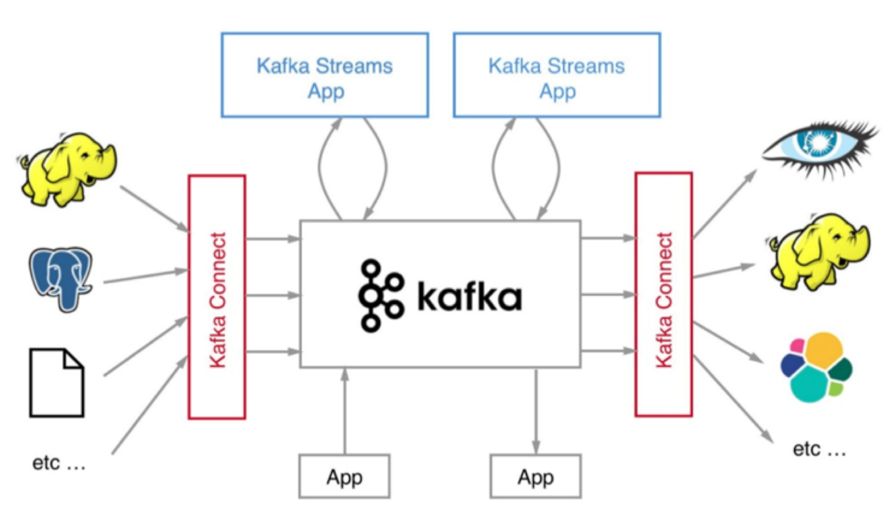
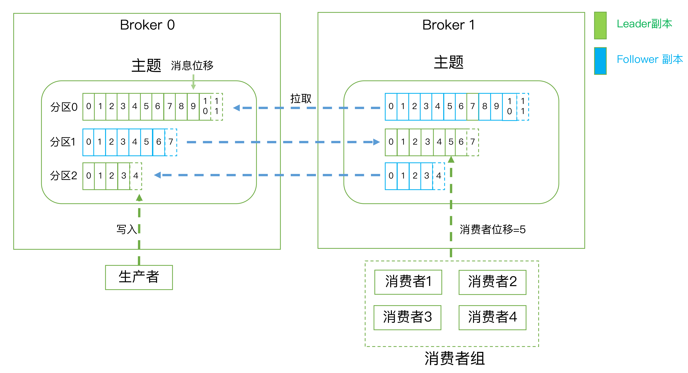

Apache Kafka是一款开源的分布式消息引擎系统（Messaging System），主要功能是提供一套完备的消息发布与订阅解决方案。Kafka也是一个分布式流处理平台（Distributed Streaming Platform，Kafka于0.10.0.0版本引入了流处理组件Kafka Streams），还能被用作分布式存储系统（`https://www.confluent.io/blog/okay-store-data-apache-kafka/`）

消息引擎系统是一组规范，企业利用这组规范在不同系统之间传递语义准确的消息，实现松耦合的异步式数据传递。可以理解为系统A发送消息给消息引擎系统，系统B从消息引擎系统中读取A发送的消息。消息的编码格式和传输协议是消息引擎系统的两个重要特征。

消息的编码格式需要满足消息表达业务语义而无歧义，同时还要能最大限度地提供可重用性以及通用性，常见的有CSV、XML、JSON或序列化框架（Protocol Buffer、Thrift）。Kafka使用纯二进制的字节序列作为消息编码格式。

常见的传输协议有两种：

+ 点对点模型（Peer to Peer，P2P）：也叫消息队列模型，同一条消息只能被下游的一个消费者消费

+ 发布/订阅模型：有一个主题（Topic）的概念，表示逻辑语义相近的消息容器，发送方被称为发布者（publisher），接收方被称为订阅者（Subscriber），可能存在多个发布者向相同的主题发送消息，而订阅者也可能存在多个，它们都能接收到相同主题的消息

Kafka同时支持这两种消息引擎模型。

消息引擎系统的主要作用是削峰填谷，即缓冲上游瞬时突发流量，使其更平滑，避免流量的震荡。消息引擎系统的另一大好处在于发送方和接收方的松耦合，这也在一定程度上简化了应用的开发，减少了系统间不必要的交互。

Kafka在设计之初就旨在提供三个方面的特性：

+ 提供一套API实现生产者和消费者
+ 降低网络传输和磁盘存储开销
+ 实现高伸缩性架构

## 术语



消息（Record）：指Kafka处理的主要对象

主题（Topic）：是承载消息的逻辑容器，在实际使用中多用来区分具体的业务，是发布订阅的对象

生产者（Producer）：向主题发布消息的客户端应用程序，生产者程序通常持续不断地向一个或多个主题发送消息

消费者（Consumer）：从主题订阅消息的客户端应用程序，消费者能同时订阅多个主题的消息

消费者组（Consumer Group）：指多个消费者实例共同组成的一个组，同时消费多个分区以实现高吞吐

消费者实例（Consumer Instance）：运行消费者应用的进程或线程

重平衡（Rebalance）：消费者组内某个消费者实例挂掉后，其他消费者实例自动重新分配订阅主题分区的过程。Rebalance是Kafka消费者实现高可用的重要手段

客户端（Client）：生产者和消费者统称为客户端

服务端（Broker）：服务代理节点，Kafka服务实例，Broker负责接收和处理客户端发送过来的请求，以及对消息进行持久化。一个Kafka集群由多个Broker组成，通常将不同的Broker部署到不同的机器上来实现高可用

副本机制（Replication）：把相同的数据复制到多台机器上来保证数据的持久化或消息不丢失。

副本（Replica）：Kafka中同一条消息能够被复制到多个地方以提供数据冗余，这些地方就是副本。副本还分为领导者副本和追随者副本，各自有不同的角色划分，副本是在分区层级下的，即每个分区可配置多个副本实现高可用

领导者副本（Leader Replica）：对外提供服务（与客户端程序进行交互）的副本

追随者副本（Follower Replica）：非领导者副本，只是被动的追随领导者副本，不对外提供服务。

分区机制（Partitioning）：将每个主题划分成多个分区（Partition），每个分区是一组有序的消息日志，生产者生产的每条消息只会被发送到一个分区中。Kafka的分区编号从0开始。分区机制用于提供伸缩性（Scalability）。副本是在分区层级定义的，每个分区下可以配置若干个副本，其中只能有一个领导者副本和N-1个追随者副本

分区（Partition）：一个有序不变的消息序列，每个主题下可以有多个分区

消息位移（Offset）：表示分区中每条消息的位置信息，是一个单调递增且不变的值

消费者位移（Consumer Offset）：表示消费者消费进度，每个消费者都有自己的消费者位移

Kafka的三层消息架构：

+ 第一层是主题层，每个主题可以配置M个分区，而每个分区又可以配置N个副本
+ 第二层是分区层，每个分区的N个副本中只能有一个充当领导者角色，对外提供服务；其他N-1个副本是追随者副本，只是提供数据冗余之用
+ 第三层是消息层，分区中包含若干条消息，每条消息的位移都是从0开始，依次递增
+ 客户端程序只能与分区的领导者副本进行交互

Kafka Broker持久化数据的方法：Kafka使用消息日志（Log）来保存数据，一个日志就是磁盘上一个只能追加写（Append-only）消息的物理文件。只能追加写入避免了缓慢的I/O操作，改为性能较好的顺序I/O写操作，这是Kafka高吞吐量特性的一个重要手段。Kafka通过日志段（Log Segment）机制定期地删除消息以回收磁盘，避免磁盘空间耗尽。在Kafka底层，一个日志又进一步细分成多个日志段，消息被追加写到当前最新的日志段中，当写满了一个日志段后，Kafka会自动切分出一个新的日志段，并将老的日志段封存起来，Kafka在后台还有定时任务会定期地检查老的日志段是否能够被删除，从而实现回收磁盘空间的目的。

## Kafka版本

版本命名：大版本号（Major Version）-小版本号（Minor Version）-修订版本号（Patch）

Kakfa目前总共演进了7个大版本，分别是0.7、0.8、0.9、0.10、0.11、1.0、2.0

0.7只提供了最基础的消息队列功能。

0.8引入了副本机制，Kafka成为了一个真正意义上完备的分布式高可靠消息队列解决方案。

0.8.2.0引入了新版本Producer API，即需要指定Broker地址的Producer。

0.9.0.0增加了安全认证/权限功能，使用Java重写了新版本的消费者API，引入了Kafka Connect组件用于实现高性能的数据抽取。新版本Producer API在这个版本中比较稳定了。

0.10.0.0引入了Kafka Streams，正式升级成分布式流处理平台。0.10.2.2起新版本Consumer API比较稳定了。

0.11.0.0提供了幂等性Producer API以及事务（Transaction）API，对Kafka消息格式做了重构。

1.0和2.0主要是Kafka Streams的各种改进。

## 集群参数配置

静态参数（Static Config）：必须在Kafka的配置文件server.properties中进行设置的参数，同时必须重启Broker进程才能令它们生效

主题级别参数的设置可以通过kafka-configs命令来修改

### Broker端参数

配置存储信息相关：

+ log.dirs：指定了Broker需要使用的若干个文件目录路径（用逗号分隔），最好保证这些目录挂载到不同的物理磁盘上，有两个好处
  + 提升读写性能
  + 实现故障转移（Failover）：Kafka1.1引入，坏掉的磁盘上的数据会自动地转移到其他正常的磁盘上，而且Broker还能正常工作
+ log.dir：只能表示单个路径，用于补充log.dirs。只要设置log.dirs就可以了，不要设置log.dir

ZooKeeper相关：

+ zookeeper.connect：指定ZooKeeper集群。可以通过chroot实现多个Kafka集群使用同一套Zookeeper集群（zk1:2181,zk2:2181,zk3:2181/kafka1和zk1:2181,zk2:2181,zk3:2181/kafka2，chroot只需要写一次，而且是加到最后的）

ZooKeeper是一个分布式协调框架，负责协调管理并保存Kafka集群的所有元数据信息，如集群有哪些Broker在运行、创建了哪些Topic、每个Topic都有多少分区以及这些分区的Leader副本都在哪些机器上等信息。

Broker连接相关（即客户端程序或其他Broker如何与该Broker进行通信的设置）：

+ listeners：监听器，指定外部连接者访问指定主机名和端口开放的Kafka服务的协议
+ advertised.listeners：Broker用于对外发布的监听器

监听器由逗号分隔的三元组组成，每个三元组的格式为<协议名称, 主机名, 端口号>。协议名称可以是标准的名字，如PLAINTEXT表示明文传输、SSL表示使用SSL或TLS加密传输等，也可以是自定义的协议名字。使用自定义协议名称后，必须指定listener.security.protocol.map参数来说明这个协议底层使用的安全协议（如listener.security.protocol.map=CONTROLLER:PLAINTEXT表示自定义协议CONTROLLER底层使用明文不加密传输数据）。另外，主机名最好不要使用IP地址

Topic管理相关：

+ auto.create.topics.enable：是否允许自动创建Topic。最好设置为false，即不允许自动创建Topic
+ unclean.leader.election.enable：是否允许Unclean Leader选举。
+ auto.leader.rebalance.enable：是否允许定期进行Leader选举。为true时表示允许Kafka定期地对一些Topic分区进行Leader重选举，Leader重选举代价很高，最好设置为false

数据留存相关：

+ log.retention.{hours|minutes|ms}：控制一条消息数据被保存多长时间
+ log.retention.bytes：指定Broker为消息保存的总磁盘容量大小，-1表示不限制
+ message.max.bytes：控制Broker能够接收大最大消息大小

### Topic级别参数

Topic级别参数会覆盖全局Broker参数的值，每个Topic都能设置自己的参数值

保存消息相关：

+ retention.ms：指定了Topic消息被保存的时长，默认为7天
+ retention.bytes：指定了要为该Topic预留多大的磁盘空间，默认值为-1，表示可以无限使用磁盘空间

处理消息相关：

+ max.message.bytes：指定了Kafka Broker能够正常接收该Topic地最大消息大小

有两种设置Topic级别参数地方法：

+ 创建Topic时通过kafka-topics.sh的--config选项进行设置
+ 通过kafka-configs修改Topic级别参数

### JVM参数

+ 环境变量KAFKA_HEAP_OPTS：JVM堆大小，推荐6GB
+ 环境变量KAFKA_JVM_PERFORMANCE_OPTS：指定GC参数，对于Java 7如果Broker所在机器的CPU资源非常充裕，建议使用CMS收集器（通过-XX:+UseCurrentMarkSweepGC指定），否则使用吞吐量收集器（通过-XX:+UseParallelGC指定），对于Java 8，推荐G1收集器

### 操作系统参数

+ 文件描述符限制：通过ulimit -n设置，推荐设置一个超大的值（ulimit -n 1000000）
+ 文件系统类型：推荐XFS
+ Swappiness（swap调优）：建议设置成一个接近0但不为0的值，如1
+ 提交时间（或Flush落盘时间）：向Kafka发送数据并不是真要等数据被写入磁盘才会认为成功，而是只要数据被写入到操作系统的页缓存（Page Cache）上就可以了，随后操作系统根据LRU算法会定期将页缓存上的脏数据落盘到物理磁盘上。这个定期由提交时间来确定，默认是5s。可以适当地增加间隔来降低物理磁盘的写操作

## 生产者

### 分区机制（Partitioning）

分区（Partition）的作用就是提供负载均衡的能力，实现系统的高伸缩性（Scalability）。不同的分区能够放置到不同节点的机器上，而数据的读写操作也都是针对分区这个粒度进行的，这样每个节点的机器都能独立地执行各自分区的读写请求处理，还可以通过添加新的节点机器来增加整体系统的吞吐量。

不同的分布式系统对分区的叫法不尽相同，如在Kafka中叫分区，在MongoDB和Elasticsearch中就叫分片（Shard），在Hbase中则叫Region，在Cassandra中叫vnode。

分区策略是指决定生产者将消息发送到哪个分区的算法，比较常见的分区策略有：

+ 轮询策略（Round-robin策略）：顺序分配。轮询策略有非常优秀的负载均衡表现，它总是能保证消息最大限度地被平均分配到所有分区上，故默认情况下它是最合理的分区策略，也是最常用的分区策略之一
+ 随机策略（Randomness策略）：随机将消息放置到任意一个分区上。随即策略数据分布均匀性逊于轮询策略

   ```Java
   List<PartitionInfo> partitions = cluster.partitionsForTopic(topic);
   return ThreadLocalRandom.current().nextInt(partitions.size());
   ```

+ Key-ordering策略：根据消息的Key将其放置到某一个分区上。当不同Key速率相差很大时，可以考虑使用不同的Topic

   ```Java
   List<PartitionInfo> partitions = cluster.partitionsForTopic(topic);
   return Math.abs(key.hashCode()) % partitions.size();
   ```

+ 基于地理位置的分区策略：一般只针对大规模的Kafka集群，特别是跨城市、跨国家甚至是跨大洲的集群

   ```Java
   // 从所有分区中找出Leader副本在南方的所有分区，然后随机选择一个进行消息发送
   List<PartitionInfo> partitions = cluster.partitionsForTopic(topic);
   return partitions.stream().filter(p -> isSource(p.leader().host())).map(PartitionInfo::partition).findAny().get();
   ```

Kafka默认分区策略：如果指定了Key，那么默认实现Key-ordering策略，否则使用轮询策略。

Kafka支持自定义分区策略，需要实现接口`org.apache.kafka.clients.producer.Partitioner`，并显式配置生产者端参数`partitioner.class`。

这个接口只定义了两个方法：`partition()`和`close()`，通常只需要实现partition方法：

```Java
int partition(String topic, Object key, byte[] keyBytes, Object value, byte[] valueBytes, Cluster cluster);
```

### 压缩算法

> Producer端压缩，Broker端保持，Consumer端解压缩

压缩（compression）秉承了用时间去换空间的经典trade-off思想，即用CPU时间去换磁盘空间或I/O传输量，希望以较小的CPU开销带来更少的磁盘占用或更少的网络I/O传输。

Kafka的消息分为两层：消息集合（message set、record batch）以及消息（message、record）。一个消息集合中包含若干条日志项（record item），而日志项才是真正封装消息的地方。Kafka底层的消息日志由一系列消息集合日志项组成，Kafka通常不会直接操作具体的一条条消息，它总是在消息集合层面上进行写入操作。Kafka目前有V1和V2两版消息格式，V2版由0.11.0.0引入，把消息的公共部分抽取出来放到外层消息集合里面，保存压缩消息的方法也发生了变化，之前V1版本中保存压缩消息的方法是把多条消息进行压缩然后保存到外层消息的消息体字段中，而V2版本的做法是对整个消息集合进行压缩，比前者有更好的压缩效果。

在Kafka中，压缩可能发生在两个地方：生产者端和Broker端。生产者程序中配置compression.type参数即表示启用指定类型的压缩算法。大部分情况下Broker从Producer端接收到消息后仅仅是原封不动地保存而不会对其进行任何修改，有两种例外情况可能让Broker重新压缩消息：

+ Broker端指定了和Producer端不同的压缩算法，Broker端压缩算法由配置compression.type指定
+ Broker端发生了消息格式转换（主要是为了兼容老版本地消费者程序），这个过程中会涉及消息的解压缩和重新压缩，也无法使用Zero Copy特性（当数据在磁盘和网络进行传输时避免昂贵的内核态数据拷贝，从而实现快速的数据传输），对性能影响很大

通常来说解压缩发生在消费者程序中。Producer发送压缩消息到Broker后，Broker照单全收并原样保存起来，当Consumer程序请求这部分消息时，Broker依样原样发送出去，当消息到达Consumer端后，由Consumer自行解压缩还原成之前的消息。Kafka会采用的压缩算法封装进消息集合中，当Consumer读取到消息集合时，就能获取压缩算法。

Kafka支持GZIP、Snappy、LZ4、Zstandard（简写为zstd，2.1.0开始支持）等压缩算法。比较压缩算法优劣的两个指标是：压缩比和压缩/解压缩吞吐量。对于Kafka，在吞吐量方面LZ4 > Snappy > zstd和GZIP，在压缩比方面zstd > LZ4 > GZIP > Snappy。

推荐根据实际情况有针对性地启用合适的压缩算法。Producer程序运行机器上的CPU资源充足，且带宽资源有限时，推荐开启压缩。一旦启用压缩，最好规避掉不可抗拒的解压缩，如兼容老版本引入的解压缩，尽量保证不要出现消息格式转换的情况。

### 幂等生产者和事务生产者

> 幂等性Producer和事务型ProDucer都是kafka提供精确一次处理语义所提供的工具。幂等性Producer只能保证单分区、单会话上的消息幂等性，而事务能够保证跨分区、跨会话间的幂等性。但是比起幂等性Producer，事务型Producer的性能更差

消息交付可靠性保障：

+ 最多一次（at most once）：消息可能丢失，但绝不会被重复发送
+ 至少一次（at least once）：消息不会丢失，但有可能被重复发送
+ 精确一次（exactly once）：消息不会丢失，也不会被重复发送

kafka默认提供至少一次可靠性保障，禁止Producer重试即可提供最多一次可靠性保障，通过幂等性（Idempotence）和事务（Transaction）两种机制kafka可以提供精确一次保障。

在数学上，幂等是指某些操作或函数能够被执行多次，但每次得到的结果都是不变的。

幂等性Producer由0.11.0.0引入，Producer默认不是幂等的，通过设置参数`props.put("enable.idempotence", true)`或`props.put(ProducerConfig.ENABLE_IDEMPOTENCE_CONFIG, true)`来创建幂等性Producer。

幂等性Producer底层实现的原理是在Broker端多保存一些字段，当Producer发送了具有相同字段值的消息后，Broker能自动知晓这些消息已经重复，可以在后台默默地丢弃这些消息。

幂等性Producer的作用范围：只能保证单分区上的幂等性，即一个幂等性Producer能够保证某个主题的一个分区上不出现重复消息，它无法实现多个分区的幂等性。其次，它只能实现单会话上的幂等性，不能实现跨会话的幂等性（会话是指Producer进程的一次运行），当重启Producer进程后，幂等性保证就丧失了。

事务型Producer可以实现多分区以及多会话上的消息无重复。在数据库领域，事务提供的安全性保障是经典的ACID，即原子性（Atomicity）、一致性（Consistency）、隔离性（Isolation）和持久性（Durability）。

kafka 0.11.0.0引入了事务，提供已提交读（read committed）隔离级别。已提交读隔离级别是指当读取数据库时，只能看到已提交的数据，即无脏读，同时，当写入数据库时，也只能覆盖掉已提交的数据，即无脏写。kafka的读已提交能保证多条消息原子性地写入到目标分区，同时也能保证Consumer只能看到事务成功提交地消息。

事务型Producer能够保证将消息原子性写入到多个分区中，这批消息要么全部写入成功，要么全部失败。

设置事务型Producer：

1. 开启`enable.idempotence = true`
2. 设置Producer端参数`transactional.id`

另外，还需在Producer代码中做一些调整：

```Java
producer.initTransactions();  // 事务初始化
try {
   producer.beginTransaction();  // 事务开始
   producer.send(record1);
   producer.send(record2);
   producer.commitTransaction();  // 事务提交
} catch (KafkaException e) {
   producer.abortTransaction();  // 事务终止
}
```

Consumer端，读取事务型Producer发送的消息需要设置参数`isolaction.level`：

+ `read_uncommitted`：表明Consumer能够读取到kafka写入的任何消息，不论事务型Producer提交事务还是终止事务，其写入的消息都可以读取
+ `read_committed`：表明Consumer只会读取事务型Producer成功提交事务写入地消息，仍可读取非事务型Producer写入的所有消息。

## 消息格式

## 无消息丢失配置

kafka只对已提交的消息（committed message）做有限度的持久化保证。

kafka无消息丢失配置最佳实践：

1. 一定要使用带有回调通知的send方法，即不要使用`producer.send(msg)`，而要使用`producer.send(msg, callback)`
2. 设置acks = all。Producer的一个参数，代表对已提交消息的定义，如果设置成all，则表明所有ISR都要接收到消息，该消息才算是已提交
3. 设置tetries为一个较大的值。Producer的参数，当出现网络的瞬时抖动时，消息发送可能会失败，配置了retries > 0的Producer能够自动重试消息发送，避免消息丢失
4. 设置`unclean.leader.election.enable = false`。Broker端参数，控制的是哪些Broker有资格竞选分区的Leader，如果一个Broker落后原先的Leader太多，那么它一旦成为新的Leader，必然会造成消息的丢失，故一般都要将该参数设置成false，即不允许这种情况的发生
5. 设置replication.factor >= 3。Broker端参数，增大冗余
6. 设置min.insync.replicas > 1。Broker端参数，控制的是消息至少要被写入到多少个副本才算是已提交，设置成大于1可以提升消息持久性
7. 确保replication.factor > min.insync.replicas。如果两者相等，那么只要有一个副本挂机，整个分区就无法正常工作了，推荐设置成replication.factor = min.insync.replicas + 1
8. 设置enable.auto.commit = false。Consumer端参数，采用手动提交位移的方式，确保消息消费完成再提交，即维持先消费消息，再更新位移的顺序。但这种处理方式可能导致消息的重复处理。

## 拦截器

拦截器的基本思想就是允许应用程序在不修改逻辑的情况下，动态地实现一组可插拔地事件处理逻辑链，从而在主业务操作的前后多个时间点上插入对应的拦截逻辑。

kafka拦截器分为生产者拦截器和消费者拦截器。生产者拦截器允许在发送消息前以及消息提交成功后植入拦截器逻辑；而消费者拦截器支持在消费消息前以及提交位移后编写特定逻辑。它们都支持链的方式，即可以将一组拦截器串连成一个大的拦截器，kafka会按照添加顺序依次执行拦截器逻辑。

kafka拦截器的设置方法是通过参数interceptor.classes配置完成的，指定一组类的列表，每个类就是特定逻辑的拦截器实现类（指定拦截器类时要指定它们的全限定名）。

Producer端拦截器实现类需要继承`org.apache.kafka.clients.producer.ProducerInterceptor`接口，该接口有两个核心方法：

+ onSend：会在消息发送之前被调用
+ onAcknowledgement：会在消息成功提交或发送失败之后被调用，onAcknowledgement的调用要早于callback的调用

Consumer端拦截器实现类需要继承`org.apache.kafka.clients.consumer.ConsumerInterceptor`接口，该接口有两个核心方法：

+ onConsume：在消息返回给Consumer程序之前调用
+ onCommit：Consumer在提交位移之后调用该方法

kafka拦截器可以应用于包括客户端监控、端到端系统性能检测、消息审计等多种功能在内的场景。

## 问题

1. 为什么Kafka不像MySQL那样允许追随者副本对外提供读服务？

   主从分离与否没有绝对的优劣，仅仅是一种架构设计，各自有适用的场景。对于读操作很多而写操作相对不频繁的负载类型而言，读写分离是非常不错的方案，可以添加很多follower横向扩展来提升读操作性能，Redis和MySQL的主要场景就是这类读多写少的场景。而Kafka的主要场景是消息引擎而不是以数据存储的方式对外提供读服务，通常涉及频繁的生产消息和消费消息，读写分离在这个场景下并不太适合，而且主写从读主要是为了减轻leader节点的压力，将读请求的负载均衡到follower节点，如果Kafka的分区相对均匀地分散到各个broker上，同样可以到达负载均衡的效果。另外，Kafka副本机制使用的是异步消息拉取，存在leader和follower之间的不一致性，如果要采用读写分离，必然要处理副本lag引入的一致性问题，比如如何实现read-your-writes、如何保证单调读（monotonic read）以及处理消息因果顺序颠倒的问题。

2. 消费过程中出现rebalance，可能造成因果关系只消费了因后rebalance，然后不处理之前的partition了，后面的消费者也无法处理该partition的果，如何处理这种情况？

   可以尝试sticky assignor，设置consumer端参数partition.assignment.strategy=org.apache.kafka.clients.consumer.StickyAssignor，Sticky算法会最大化保证消费分区方案不变更。

3. 单个Consumer程序使用多线程来消费消息
