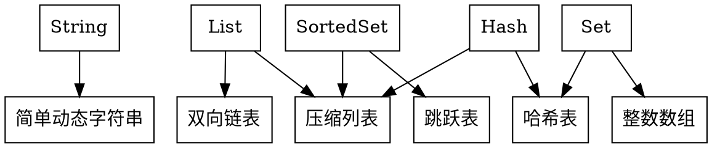

```bob-svg
应
用
维         ,--------,             ,--------,     ,------------,
度         |缓存应用|             |集群应用|     |数据结构应用|
           `--------`             `--------`     `------------`
~~~~~~~~~~~~~~~~~~~~~~~~~~~~~~~~~~~~~~~~~~~~~~~~~~~~~~~~~~~~~~~
                 ,--------,   !   ,--------,   !   ,--------,
     处理层      |线程模型|   !   |主从复制|   !   |数据分片|
系               `--------`   !   `--------`   !   `--------`
统               ,--------,   !   ,--------,   !
维   内存层      |数据结构|   !   |哨兵机制|   !
度               `--------`   !   `--------`   !
                     ,~~~~~~~~!~~~~~~~~,       !   ,--------,
     存储层          ! ,----, ! ,----, !       !   |负载均衡|
                     ! |AOF | ! |RDB | !       !   `--------`
                     ! `----` ! `----` !       !
                     `~~~~~~~~!~~~~~~~~`       !
            ,-------------,   !                !
            |epoll网络框架|   !                !
            `-------------`   !                !
                              !                !
              高性能主线      !   高可靠主线   !   高可扩展主线
                              !                !
```

Redis是一个键值对数据库服务器，服务器中的每个数据库都由一个redisDb结构表示。redisDb结构的dict字典保存了数据库中的所有键值对，被称为键空间（key space）。所有针对数据库的操作（如添加/删除/查询键值对）实际上都是通过对键空间进行操作来实现的。

```c
typedef struct redisDb {
    // ...
    dict *dict;
} redisDb;
```

## 对象

Redis基于简单动态字符串、压缩数组、跳跃表等创建了一个对象系统，这个系统包含了字符串对象^[字符串对象是Redis五种类型的对象中唯一一种会被其他四种类型对象嵌套的对象]、列表对象、哈希对象、集合对象和有序集合对象，针对不同的使用场景，为对象设置多种不同的数据结构实现，从而优化对象在不同场景下的使用效率。

Redis使用对象来表示数据库中的键和值^[Redis本身处理的参数也使用对象表示]，每个对象都由一个redisObject结构表示，键总是一个字符串对象，而值可以是字符串对象、列表对象、哈希对象、集合对象或者有序集合对象中的其中一种。

```c
typedef struct redisObject {
    unsigned type:4;
    unsigned encoding:4;
    unsigned lru:22;
    int refcount;
    void *ptr;
} robj;
```

type记录了对象所保存的值的类型，用于实现类型特定命令所进行的类型检查：

+ REDIS_STRING(0)：字符串
+ REDIS_LIST(1)：列表
+ REDIS_SET(2)：集合
+ REDIS_ZSET(3)：有序集
+ REDIS_HASH(4)：哈希表

encoding记录了对象所使用的编码：

+ REDIS_ENCODING_RAW(0)：编码为字符串
+ REDIS_ENCODING_INT(1)：编码为整数
+ REDIS_ENCODING_HT(2)：编码为哈希表
+ REDIS_ENCODING_ZIPMAP(3)：编码为zipmap
+ REDIS_ENCODING_LINKEDLIST(4)：编码为双端链表
+ REDIS_ENCODING_ZIPLIST(5)：编码为压缩列表
+ REDIS_ENCODING_INTSET(6)：编码为整数集合
+ REDIS_ENCODING_SKIPLIST(7)：编码为跳跃表

ptr指针指向对象的底层实现数据结构，由encoding属性决定。

refcount记录了对象的引用计数信息，对象的引用计数信息会随着对象的使用状态^[Rdis对象的整个生命周期可以划分为创建对象、操作对象、释放对象三个阶段]而不断变化：

+ 在创建一个新对象时，引用计数的值会被初始化为1
+ 当对象被一个新程序使用时，它的引用计数值会被增1
+ 当对象不再被一个程序使用时，它的引用计数值会被减1
+ 当对象的引用计数值变为0时，对象所占用的内存会被释放

lru记录了对象最后一次被命令程序访问的时间。如果服务器打开了maxmemory选项，并且服务器用于回收内存的算法为volatile-lru或者aLLKEYS-lru，那么当服务器占用的内存数超过了maxmemory选项设置的上限值时，空转时长较高的那部分键会优先被服务器释放，从而回收内存。

Redis使用对象机制实现了类型检查、命令多态以及基于引用计数的内存回收机制和对象共享机制。

**类型检查** 是指在执行命令前，根据对象的类型来判断一个对象是否可以执行给定的命令。

当执行一个数据处理命令时，Redis执行以下步骤：

1. 根据给定key，在数据库字典中查找和它相对应的redisObject，如果没有找到，就返回NULL
2. 检查redisObject的type属性和执行命令所需的类型是否相符，如果不相符，返回类型错误
3. 根据redisObject的encoding属性所指定的编码，选择合适的操作函数来处理底层的数据结构
4. 返回数据结构的操作结果作为命令的返回值

**多态命令** 是指根据值对象的编码方式，选择正确的命令实现代码来执行命令。

**内存回收机制** 是指当程序不再使用某个对象的时候，这个对象所占用的内存就会被自动释放。

**对象共享机制（flyweight模式）** 是指Redis会预分配一些常用的值对象，并在多个数据之间共享这些对象，用来减少内存占用，并避免频繁为小对象分配内存。Redis只对包含整数值的字符串对象进行共享。

Redis预分配的值对象：

+ 各种命令的返回值。执行成功时返回的`OK`，执行错误时返回的`ERROR`，类型错误时返回的`WRONGTYPE`，命令入队事务时返回的`QUEUED`等
+ 小于REDIS_SHARED_INTEGERS（默认为10000）的所有非负整数，即0-9999

### 字符串对象

字符串对象的编码可以是int、raw或embstr，可以保存二进制字节流。

如果字符串对象保存的是一个整数值，并且这个整数值可以用long类型来表示，那么字符串对象会将整数值保存在字符串对象结构的ptr属性里面并将字符串对象的编码设置为int。

如果字符串对象保存的是一个字符串值，并且这个字符串值的长度小于等于39字节，那么字符串对象将使用embstr编码的方式来保存这个字符串值。embstr编码是专门用于保存短字符串的一种优化编码方式，和raw编码一样，都使用redisObject结构和sdshdr结构来表示字符串对象，但raw编码会调用两次内存分配函数来分别创建redisObject结构和sdshdr结构，而embstr编码则通过调用一次内存分配函数来分配一块连续的空间，空间中依次包含redisObject和sdshdr两个结构。

如果字符串对象保存的是一个字符串值，并且这个字符串值的长度大于39字节，那么字符串对象将使用一个简单动态字符串（SDS）来保存这个字符串值，并将对象的编码设置为raw。

embstr编码与raw编码对比：

+ embstr编码创建字符串对象只需一次内存分配，而raw编码需要两次
+ 释放embstr编码的字符串对象只需调用一次内存释放函数，而raw编码需要两次
+ embstr编码的字符串对象的所有数据都保存在一块连续的内存里面，比raw编码的字符串对象能够更好地利用缓存带来的优势

可以用long double类型表示的浮点数在Redis中也是作为字符串值来保存的。保存一个浮点数到字符串对象里时，程序会先将这个浮点数转换成字符串值，然后再保存起转换所得的字符串值。在有需要的时候，程序会将保存在字符串对象里面的字符串值转换回浮点数值，执行某些操作，然后再将执行操作所得的浮点数值转换回字符串值，并继续保存在字符串对象里面。

字符串对象保存各类型值的编码方式：

|值|编码|
|---|---|
|可以用long类型保存的整数|int|
|可以用long double类型保存的浮点数|embstr或者raw|
|字符串值，或者因为长度太大而没办法用long类型表示的整数，又或者因为长度太大而没办法用long double类型标识的浮点数|embstr或者raw|

字符串命令：

|命令|int编码的实现方法|embstr编码的实现方法|raw编码的实现方法|
|---|---|---|---|
|SET|使用int编码保存值|使用embstr编码保存值|使用raw编码保存值|
|GET|复制对象所保存的整数值，将这个副本转换成字符串值，然后向客户端返回这个字符串值|直接向客户端返回字符串值|直接向客户端返回字符串值|
|APPEND|将对象转换成raw编码，然后按raw编码的方式执行此操作|将对象转换成raw编码，然后按raw编码的方式执行此操作|调用sdscatlen函数，将给定字符串追加到现有字符串的末尾|
|INCRBYFLOAT|取出整数值并将其转换成long double类型的浮点数，对这个浮点数进行加法计算，然后将得出的浮点数结果保存起来|取出字符串值并尝试将其转换成long double类型的浮点数，对这个浮点数进行加法计算，然后将得出的浮点数结果保存起来。如果字符串值不能被转换成浮点数，那么向客户端返回一个错误|取出字符串值并尝试将其转换成long double类型的浮点数，对这个浮点数进行加法计算，然后将得出的浮点数结果保存起来。如果字符串值不能被转换成浮点数，那么向客户端返回一个错误|
|INCRBY|对整数值进行加法计算，得出的计算结果会作为整数被保存起来|embstr编码不能执行此命令，向客户端返回一个错误|raw编码不能执行此命令，向客户端返回一个错误|
|DECRBY|对整数值进行减法计算，得出的计算结果会作为整数被保存起来|embstr编码不能执行此命令，向客户端返回一个错误|raw编码不能执行此命令，向客户端返回一个错误|
|STRLEN|复制对象所保存的整数值，将这个副本转换成字符串值，计算并返回这个字符串值的长度|调用sdslen函数，返回字符串的长度|调用sdslen函数，返回字符串的长度|
|SETRANGE|将对象转换成raw编码，然后按raw编码的方式执行此命令|将对象转换成raw编码，然后按raw编码的方式执行此命令|将字符串特定索引上的值设置为给定的字符|
|GETRANGE|复制对象所保存的整数值，将这个副本转换成字符串值，然后取出并返回字符串指定索引上的字符|直接取出并返回字符串指定索引上的字符|直接取出并返回字符串指定索引上的字符|

### 列表对象

列表对象的编码可以是ziplist或linkedlist。ziplist编码的列表对象使用压缩列表作为底层实现，每个压缩列表节点（entry）保存了一个列表元素。linkedlist编码的列表对象使用双端链表作为底层实现，每个双端链表节点（node）都保存了一个字符串对象，而每个字符串对象都保存了一个列表元素。

当列表对象同时满足以下两个条件时，将使用ziplist编码，否则将使用linkedlist编码：

+ 列表对象保存的所有字符串元素的长度都小于64字节（可使用list-max-ziplist-value选项修改）
+ 列表对象保存的元素数量小于512个（可食用list-max-ziplist-entries选项修改）

对于使用ziplist编码的列表对象来说，当使用ziplist编码所需的两个条件的任意一个不能被满足时，对象的编码转换操作就会被执行：原本保存在压缩列表里的所有列表元素都会被转移并保存到双端链表里面，对象的编码也会从ziplist变为linkedlist。

列表命令：

|命令|ziplist编码的实现方法|linkedlist编码的实现方法|
|---|---|---|
|LPUSH|调用ziplistPush函数，将新元素推入到压缩列表的表头|调用lsitAddNodeHead函数，将新元素推入到双端链表的表头|
|RPUSH|调用ziplistPush函数，将新元素推入到压缩列表的表尾|调用listAddNodeTail函数，将新元素推入到双端链表的表尾|
|LPOP|调用ziplistIndex函数定位压缩列表的表头节点，在向用户返回节点所保存的元素之后，调用ziplistDelete函数删除表头节点|调用listFirst函数定位双端链表的表头节点，在向用户返回节点所保存的元素之后，调用listDelNode函数删除表头节点|
|RPOP|调用ziplistIndex函数定位压缩列表的表尾节点，在向用户返回节点所保存的元素之后，调用ziplistDelete函数删除表尾节点|调用listLast函数定位双端链表的表尾节点，在向用户返回节点所保存的元素之后，调用listDelNode函数删除表尾节点|
|LINDEX|调用ziplistIndex函数定位压缩列表中的指定节点，然后返回节点所保存的元素|调用listIndex函数定位双端链表中的指定节点，然后返回节点所保存的元素|
|LLEN|调用ziplistLen函数返回压缩列表的长度|调用listLength函数返回双端链表的长度|
|LINSERT|插入新节点到压缩列表的表头或者表尾时，使用ziplistPush函数；插入新节点到压缩列表的其他位置时，使用ziplistInsert函数|调用listInsertNode函数，将新节点插入到双端链表的指定位置|
|LREM|遍历压缩列表节点，并调用ziplistDelete函数删除包含了给定元素的节点|遍历双端链表节点，并调用listDelNode函数删除包含了给定元素的节点|
|LTRIM|调用ziplistDeleteRange函数，删除压缩列表中所有不在指定索引范围内的节点|遍历双端链表节点，并调用listDelNode函数删除链表中所有不在指定索引范围内的节点|
|LSET|调用ziplistDelete函数，先删除压缩列表指定索引上的现有节点，然后调用ziplistInsert函数，将一个包含给定元素的新节点插入到相同索引上面|调用listIndex函数，定位到双端链表指定索引上的节点，然后通过赋值操作更新节点的值|

### 哈希对象

哈希对象的编码可以是ziplist或者hashtable。ziplist编码的哈希对象使用压缩列表作为底层实现，每当有新的键值对要加入到哈希对象时，程序会先将保存了键的压缩列表节点推入到压缩列表表尾，然后再将保存了值的压缩列表节点推入到压缩列表表尾。hashtable编码的哈希对象使用哈希表作为底层实现，哈希对象中的每个键值对都使用一个哈希表键值对（键和值都是字符串对象）来保存。

当哈希对象可以同时满足以下两个条件时，哈希对象使用ziplist编码：

+ 哈希对象保存的所有键值对的键和值的字符串长度都小于64字节（可使用hash-max-ziplist-value选项修改）
+ 哈希对象保存的键值对数量小于512个（可使用hash-max-ziplist-entries选项修改）

对于使用ziplist编码的列表对象来说，当使用ziplist编码所需的两个条件的任意一个不能被满足时，对象的编码转换操作就会被执行：原本保存在压缩列表里的所有键值对都会被转移并保存到字典里面，对象的编码也会从ziplist变为hashtable。

哈希命令：

|命令|ziplist编码实现方法|hashtable编码实现方法|
|---|---|---|
|HSET|首先调用ziplistPush函数，将键推入到压缩列表的表尾，然后再次调用ziplistPush函数，将值推入到压缩列表的表尾|调用dictAdd函数，将新节点添加到字典里面|
|HGET|首先调用ziplistFind函数，在压缩列表中查找指定键所对应的节点，然后调用ziplistNext函数，将指针移动到键节点旁边的值节点，最后返回值节点|调用dictFind函数，在字典中查找给定键，然后调用dictGetVal函数，返回该键所对应的值|
|HEXISTS|调用ziplistFind函数，在压缩列表中查找指定键所对应的节点，如果找到的话说明键值对存在，没找到的话就说明键值对不存在|调用dictFind函数，在字典中查找给定键，如果找到的话说明键值对存在，没找到的话就说明键值对不存在|
|HDEL|调用ziplistFind函数，在压缩列表中查找指定键所对应的节点，然后将相应的键节点、以及键节点旁边的值节点都删除掉|调用dictDelete函数，将指定键所对应的键值对从字典中删除掉|
|HLEN|调用ziplistLen函数，取得压缩列表包含节点的总数量，将这个数量除以2，得出的结果就是压缩列表保存的键值对的数量|调用dictSize函数，返回字典包含的键值对数量，这个数量就是哈希对象包含的键值对数量|
|HGETALL|遍历整个压缩列表，用ziplistGet函数返回所有键值对|遍历整个字典，用dictGetKey函数的键，用dictGetVal函数返回字典的值|

### 集合对象

集合对象的编码可以是intset或hashtable。intset编码的集合对象使用整数集合作为底层实现，集合对象包含的所有元素都被保存在整数集合里面。hashtable编码的集合对象使用字典作为底层实现，字典的每个键都是一个字符串对象，每个字符串对象包含了一个集合元素，而字典的值则全部被设置为NULL。

当集合对象可以同时满足以下两个条件时，对象使用intset编码：

+ 集合对象保存的所有元素都是整数值
+ 集合对象保存的元素数量不超过512个（可使用set-max-intset-entries设置）

不能满足这两个条件的集合对象需要使用hashtable编码。

对于使用intset编码的集合对象来说，当使用intset编码所需的两个条件的任意一个不能被满足时，对象的编码转换操作就会被执行：原本保存在整数集合中的所有元素都会被转移并保存到字典里面，并且对象的编码也会从intset变为hashtable。

集合命令：

|命令|intset编码的实现方法|hashtable编码的实现方法|
|---|---|---|
|SADD|调用intsetAdd函数，将所有元素添加到整数集合里面|调用dictAdd，以新元素为键，NULL为值，将键值对添加到字典里面|
|SCARD|调用intsetLen函数，返回整数集合所包含的元素数量，这个数量就是集合对象所包含的元素数量|调用dictSize函数，返回字典所包含的键值对数量，这个数量就是集合对象所包含的元素数量|
|SISMEMBER|调用intsetFind函数，在整数集合中查找给定的元素，如果找到了说明元素存在于集合，没找到则说明元素不存在于集合|调用dictFind函数，在字典的键中查找给定的元素，如果找到了说明元素存在于集合，没找到则说明元素不存在于集合|
|SMEMBERS|遍历整个整数集合，使用intsetGet函数返回集合元素|遍历整个字典，使用dictGetKey函数返回字典的键作为集合元素|
|SRANDMEMBER|调用intsetRandom函数，从整数集合中随机返回一个元素|调用dictGetRandomKey函数，从字典中随机返回一个字典键|
|SPOP|调用intsetRandom函数，从整数集合中随机取出一个元素，在将这个随机元素返回给客户端之后，调用intsetRemove函数，将随机元素从整数集合中删除掉|调用dictGetRandomKey函数，从字典中随机取出一个字典键，在将这个随机字典键的值返回给客户端之后，调用dictDelete函数，从字典中删除随机字典键所对应的键值对|
|SREM|调用intsetRemove函数，从整数集合中删除所有给定的元素|调用dictDelete函数，从字典中删除所有键为给定元素的键值对|

### 有序集合对象

有序集合每个元素的成员都是一个字符串对象，而每个元素的分值都是一个double类型的浮点数。

有序集合的编码可以是ziplist或者skiplist。ziplist编码的有序集合对象使用压缩列表作为底层实现，每个集合元素使用两个紧挨在一起的压缩列表节点来保存，第一个节点保存元素的成员（member），而第二个元素则保存元素的分值（score），压缩列表内，集合元素按分值从小到大进行排序。skiplist编码的有序集合对象使用zset结构作为底层实现，一个zset结构同时包含一个哈希表和一个跳跃表。跳跃表按分值从小到大保存了所有集合元素，每个跳跃表节点都保存了一个集合元素：跳跃表节点的object属性保存了元素的成员，而跳跃表节点的score属性则保存了元素的分值，通过跳跃表可以对有序集合进行范围型操作。哈希表为有序集合创建了一个从成员到分值的映射，哈希表中的每个键值对都保存了一个集合元素：字典的键保存了元素的成员，而字典的值则保存了元素的分值，通过哈希表可以用O(1)复杂度查找给定成员的分值。哈希表和跳跃表通过指针来共享相同元素的成员和分值。

当有序集合对象可以同时满足以下两个条件时，对象使用ziplist编码：

+ 有序集合保存的元素数量小于128个（可使用zset-max-ziplist-value选项设置）
+ 有序集合保存的所有元素成员的长度都小于 64 字节（可使用zset-max-ziplist-entries选项设置）

不能满足以上两个条件的有序集合对象将使用skiplist编码。

对于使用ziplist编码的有序集合对象来说，当使用ziplist编码所需的两个条件中的任意一个不能被满足时，程序就会执行编码转换操作，将原本储存在压缩列表里面的所有集合元素转移到zset结构里面，并将对象的编码从ziplist改为skiplist。

有序集合命令：

|命令|ziplist编码的实现方式|zset编码的实现方法|
|---|---|---|
|ZADD|调用ziplistInsert函数，将成员和分值作为两个节点分别插入到压缩列表|先调用zslInsert函数，将新元素添加到跳跃表，然后调用dictAdd函数，将新元素关联到字典|
|ZCARD|调用ziplistLen函数，获得压缩列表包含节点的数量，将这个数量除以2得出集合元素的数量|访问跳跃表数据结构的length属性，直接返回集合元素的数量|
|ZCOUNT|遍历压缩列表，统计分值在给定范围内的节点的数量|遍历跳跃表，统计分值在给定范围内的节点的数量|
|ZRANGE|从表头向表尾遍历压缩列表，返回给定索引范围内的所有元素|从表头向表尾遍历跳跃表，返回给定索引范围内的所有元素|
|ZREVRANGE|从表尾向表头遍历压缩列表，返回给定索引范围内的所有元素|从表尾向表头遍历跳跃表，返回给定索引范围内的所有元素|
|ZRANK|从表头向表尾遍历压缩列表，查找给定的成员，沿途记录经过节点的数量，当找到给定成员之后，途径节点的数量就是该成员所对应元素的排名|从表头向表尾遍历跳跃表，查找给定的成员，沿途记录经过节点的数量，当找到给定成员之后，途径节点的数量就是该成员所对应元素的排名|
|ZREVRANK|从表尾向表头遍历压缩列表，查找给定的成员，沿途记录经过节点的数量，当找到给定成员之后，途径节点的数量就是该成员所对应元素的排名|从表尾向表头遍历跳跃表，查找给定的成员，沿途记录经过节点的数量，当找到给定成员之后，途径节点的数量就是该成员所对应元素的排名|
|ZREM|遍历压缩列表，删除所有包含给定成员的节点，以及被删除成员节点旁边的分值节点|遍历跳跃表，删除所有给定成员的跳跃表节点，并在字典中解除被删除元素的成员和分值的关联|
|ZSCORE|遍历压缩列表，查找包含了给定成员的节点，然后取出成员节点旁边的分值节点保存的元素分值|直接从字典中取出给定成员的分值|

## 扩展数据类型

除了5大基本数据类型（String、List、Hash、Set、Sorted Set），Redis还提供了3种扩展数据类型，分别是Bitmap、HyperLogLog和GEO。另外，Redis还支持自定义数据类型。

扩展数据类型有两种实现途径：一种是基于现有的数据类型，通过数据编码或是实现新的操作的方式，来实现扩展数据类型，如基于Sorted Set和GeoHash编码实现GEO，以及基于String和位操作实现Bitmap；另一种是开发自定义的数据类型，具体的操作是增加新数据类型的定义，实现创建和释放函数和实现新数据类型支持的命令操作。

### GEO

GEO用于位置信息服务（LBS，Location-Based Service）应用。LBS应用访问的数据是和人或物关联的一组经纬度信息，而且要能查询相邻经纬度范围。

GEO类型的底层数据结构是用Sorted Set来实现的，Sorted Set的元素是物体标识，元素的权重分数为GeoHash编码的物体的经纬度。为了能高效对经纬度进行比较，Redis采用了GeoHash编码方法，基本原理是二分区间，区间编码，即对一组经纬度进行GeoHash编码时，要先对经度和维度分别编码，然后再把经纬度各自的编码组合成一个最终编码。对于一个地理位置信息来说，它的经度范围是\[-180, 180\]，GeoHash编码会把一个经度值编码成一个N位的二进制值，对经度范围\[-180, 180\]做N次的二分区操作。在进行第一次二区分时，经度范围\[-180, 180\]会被分成两个子区间：\[-180, 0)和\[0, 180\]（分别称为左、右分区），然后查看一下要编码的经度值落在了左分区还是右分区，如果是落在左分区，就用0表示；如果落在右分区，就用1表示。然后，我们再对经度值所属的分区再做一次二分区，同时再次查看经度值落在了二分区后的左分区还是右分区，按照刚才的规则再做1位编码。这样，每做完一次二分区，就可以得到1位编码值，当做完N次的二分区后，经度值就可以用一个N位的数来表示。对纬度的编码方式和对经度一样，只是纬度的范围是\[-90, 90\]。当一组经纬度值都编完码后，再把它们各自的编码值组合在一起，组合的规则是：最终编码值的偶数位上依次是经度的编码值，奇数位上依次是纬度的编码值。其中，偶数位从0开始，奇数位从1开始。GeoHash编码相当于把整个地理空间划分成了一个个方格，每个方格覆盖了一定范围内的经纬度值，对应了GeoHash中的一个分区，分区越多，每个方格能覆盖到的地理空间就越小，也就越精确。把所有方格的编码值映射到一维空间时，相邻方格的GeoHash编码值基本也是相尽的。

GEO命令：

GEOADD：用于把一组经纬度信息和相对应的一个ID记录到GEO类型集合中
GEOADIUS：会根据输入的经纬度位置，查找以这个经纬度为中心的一定范围内的其他元素

### 自定义数据类型

首先，为新数据类型定义好它的底层结构、type和encoding属性值，然后再实现新数据类型的创建、释放函数和基本命令。

1. 定义新类型和底层结构
2. 在RedisObject中添加新类型的定义
3. 开发新类型的创建和释放函数
4. 开发新类型的命令操作。首先，向新类型增加命令操作的实现;接着，在server.h文件中声明已经实现的命令；最后在server.c文件中的redisCommandTable里面，把新增命令和实现函数关联起来。

另外，如果希望新的数据类型能被持久化保存，还需要在Redis的RDB和AOF模块中增加对新数据类型进行持久化保存的代码。

## 数据结构

为了实现从键到值的快速访问，Redis使用了一个哈希表来保存所有键值对，哈希表中的元素保存的并不是值本身，而是指向具体值的指针。

对于哈希冲突，Redis采用链表法。

为了使rehash操作更高效，Redis默认使用了两个全局哈希表。一开始，刚插入数据时，默认使用哈希表1，此时哈希表2并没有被分配空间，随着数据逐步增多，Redis开始执行rehash，这个过程分为三步：

1. 给哈希表2分配更大的空间
2. 把哈希表1中的数据重新映射并复制到哈希表2中
3. 释放哈希表1的空间

之后便可以从哈希表1切换到哈希表2，用增大的哈希表2来保存更多数据，而原来的哈希表1留作下一次rehash扩容备用。

为了避免一次性复制大量数据导致Redis线程阻塞，Redis采用了渐进式rehash，即 复制数据时，Redis仍然正常处理客户端请求，每处理一个请求时，将哈希表1中rehashidx^[初始值为0]索引位置上的所有元素复制到哈希表2中并执行rehashidx++，当整个rehash执行结束，rehashidx设置为-1。

在渐进式rehash执行期间，新添加的键值对一律保存到哈希表2中，而哈希表1不再进行任何添加操作，这样便保证了哈希表1中的元素数目只减不增，并随着rehash操作的执行而最终变成空表。

渐进式rehash执行时，除了处理客户端请求时执行rehash，Redis本身还有一个定时任务在执行rehash，没有客户端请求时，这个定时任务会周期性地执行rehash。

Redis中键的数据类型为String，值的数据类型支持String（字符串）、List（列表）、Hash（哈希）、Set（集合）和SortedSet（有序集合）^[通常情况下，会把List、Hash、Set、SortedSet这四种数据类型称为集合类型，它们的特点是一个键对应了一个集合的数据]，对应的底层数据结构有6种，分别是简单动态字符串、双向链表（doublelist）、压缩列表（ziplist）、哈希表（hashtable）、跳表（skiplist）和整数数组。



当一个List只包含少量元素，并且每个元素是小整数值或长度比较短的字符串时，Redis就会使用压缩列表来做List的底层实现。

当一个Hash只包含少量键值对，并且每个键值对的键和值都是小整数值或长度比较短的字符串时，Redis就会使用压缩列表来做Hash的底层实现。

数组和压缩列表都是非常紧凑的数据结构，比链表占用的内存要少。Redis是内存数据库，大量数据存到内存中，需要尽可能的优化，提高内存的利用率。

数组和压缩列表对CPU高速缓存支持更友好，所以Redis在集合元素较少情况下，默认采用内存紧凑排列的方式存储，同时利用CPU高速缓存不会降低访问速度^[Redis底层使用数组和压缩列表对数据大小限制在64个字节下，当大于64个字节会改变存储数据的数据结构，所以随机访问对CPU高速缓存没啥影响]。当集合元素超过设定的阈值后，避免查询时间复杂度太高，转为哈希和跳表数据结构存储，保证查询效率

对于String类型，找到哈希桶就能直接增删改查了，操作复杂度为O(1)，而对于集合类型的值，第一步是通过哈希表找到对应的哈希桶位置，第二步是在集合中再增删改查，操作复杂度和底层数据结构、操作类型有关。

集合类型对单个元素进行增删改查操作，如Hash类型的HGET、HSET和HDEL，Set类型的SADD、SREM、SRANDMEMBER等，其复杂度由集合采用的数据结构决定。

集合类型同时对多个元素进行增删改查操作，如Hash类型的HMGET和HMSET，Set类型的SADD，其复杂度由单个元素操作复杂度和元素个数决定。

集合类型的遍历操作，返回集中的所有元素，如Hash类型的HGETALL，Set类型的SMEMBERS，或返回一个范围内的部分元素，如List类型的LRANGE和ZSet类型的ZRANGE，其复杂度一般是O(N)，比较耗时，应该尽量避免。SCAN系列操作（HSCAN、SSCAN、ZSCAN）实现了渐进式遍历，每次只返回有限数量的元素，避免了一次性返回所有元素而导致的Redis线程阻塞。

集合类型对集合中所有元素个数的统计操作，如LLEN和SCARD，由于底层数据结构中专门记录了元素的个数，其复杂度只有O(1)。

对于List类型的LPOP、RPOP、LPUSH、RPUSH这四个操作，它们是在列表的头尾增删元素，而压缩列表和双向链表都会记录表头和表尾的偏移量，这就可以通过偏移量直接定位，其复杂度为O(1)。

|名称|查找的时间复杂度|
|---|---|
|哈希表|O(1)|
|跳跃表|O(logN)|
|双向链表|O(N)|
|压缩列表|O(N)|
|整数数组|O(N)|

### 简单动态字符串（SDS）

```c
struct sdshdr {
    int len;
    int free;
    char buf;
}
```

Redis没有直接使用C语言传统的字符串表示（以空字符结尾的字符数组），而是构建了简单动态字符串（simple dynamic string, SDS）的抽象类型，并将SDS用作Redis的默认字符串表示。SDS被用于保存数据库中的字符串值和缓冲区（buffer）^[AOF缓冲区以及客户端状态中的输入缓冲区]

在Redis里，C字符串只会作为字符串字面量（string literal），用在一些无须对字符串进行修改的地方，当Redis需要一个可以被修改的字符串值时，就会使用SDS来表示字符串值。

sdshdr结构中：len记录了buf数组中已使用字节的数量（不包含结尾的空字符），等于SDS所保存字符串的长度，SDS使用len而不是空字符来判断字符串是否结束；free记录了buf数组中未使用字节的数量；buf字节数组用于保存字符串。

SDS遵循C字符串以空字符结尾的惯例，这样可以重用`<string.h>`函数库，保存空字符的1字节空间不计算在len属性里面，SDS的API将SDS保存的数据的末尾设置为空字符，并且总会在为buf数组分配空间时多分配一个字节来容纳这个空字符。

通过未使用空间，SDS实现了空间预分配和惰性空间释放两种优化策略：

+ 空间预分配：用于优化字符串增长操作，减少连续执行字符串增长操作所需的内存重分配次数。当SDS的API对一个SDS进行修改，并且需要对SDS进行空间扩展的时候，程序不仅会为SDS分配修改所必须要的空间，还会为SDS分配额外的未使用空间。如果对SDS进行修改之后，SDS的长度（len）小于1MB，那么程序分配和len属性同样大小的未使用空间；如果对SDS进行修改之后，SDS的长度将大于等于1MB，那么程序会分配1MB的未使用空间。字符串在刚创建的时候是不会有任何多余空间的，只有在用户对某个字符串进行了修改之后，Redis 才会为被修改的字符串分配额外的空间
+ 惰性空间释放：用于优化SDS的字符串缩短操作。当SDS的API需要缩短SDS保存的字符串时，程序并不立即使用内存重分配来回收缩短后多出来的字节，而是使用free属性将这些字节的数量记录起来，并等待将来使用

与C字符串相比，SDS具有以下优点：

+ 常数复杂度获取字符串长度
+ 杜绝缓冲区溢出
+ 减少修改字符串时带来的内存重分配次数
+ 二进制安全。C字符串中的字符必须符合某种编码，并且除了字符串的末尾之外，字符串里面不能包含空字符。这些限制使得C字符串只能保存文本数据，而不能保存像图片、音频、视频、压缩文件这样的二进制数据。SDS是二进制安全的（binary-safe），所有SDS API都会以处理二进制的方式来处理SDS存放在buf数组里的数据，程序不会对其中的数据做任何限制、过滤、或者假设

SDS主要操作API：

|函数|作用|时间复杂度|
|---|---|---|
|sdsnew|创建一个包含给定C字符串的SDS|O(N)|
|sdsempty|创建一个不包含任何内容的空字符串|O(1)|
|sdsfree|释放给定的SDS|O(1)|
|sdslen|返回SDS的已使用空间字节数|O(1)|
|sdsavail|返回SDS的未使用空间字节数|O(1)|
|sdsdup|创建一个给定SDS的副本|O(N)|
|sdsclear|清空SDS保存的字符串内容|O(1)|
|sdscat|将给定C字符串拼接到SDS字符串的末尾|O(N)|
|sdscatsds|将给定SDS字符串拼接到另一个SDS字符串的末尾|O(N)|
|sdscpy|将给定的C字符串复制到SDS里面，覆盖SDS原有字符串|O(N)|
|sdsgrowzero|用空字符将SDS扩展至给定长度|O(N)|
|sdsrange|保留SDS给定区间内的数据，不再区间内的数据会被覆盖或清除|O(N)|
|sdstrim|接收一个SDS和一个C字符串作为参数，从SDS左右两端分别移除所有在C字符串中出现过的字符|O(M*N)|
|sdscmp|对比两个SDS字符串是否相同|O(N)|

### 链表

```c
typedef struct list {
    listNode *head;
    listNode *tail;
    unsigned long len;
    void *(*dup)(void *ptr);
    void (*free)(void *ptr);
    int (*match)(void *ptr, void *key);
} list;

typedef struct listNode {
    struct listNode *prev;
    struct listNode *next;
    void *value;
} listNode;
```

链表提供了高效的节点重排能力，以及顺序性的节点访问方式，并且可以通过增删节点来灵活地调整链表的长度。

链表在Redis中用于列表的底层实现、发布与订阅、慢查询、监视器等，Redis服务器本身还使用链表来保存多个客户端的状态信息，以及使用链表来构建客户端输出缓冲区。

list结构为链表提供了表头指针head、表尾指针tail，以及链表长度计数器len。每个链表节点使用一个listNode结构表示，多个listNode可以通过prev和next指针组成双端链表。

head指向链表头节点

tail指向链表尾节点

len记录了链表长度

dup函数用于复制链表节点所保存的值

free函数用于释放链表节点所保存的值

match函数则用于对比链表节点所保存的值和另一个输入值是否相等

prev指向前一个节点

next指向后一个节点

value记录了节点的值

Redis的链表实现的特性如下：

+ 双端：链表节点带有prev和next指针，获取某个节点的前置节点和后置节点的复杂度都是O(1)
+ 无环：表头节点的prev指针和表尾节点的next指针都指向NULL，对链表的访问以NULL为终点
+ 带表头指针和表尾指针：通过list结构的head指针和tail指针，程序获取链表的表头节点和表尾节点的复杂度为O(1)
+ 带链表长度计数器：获取链表中节点数量的复杂度为O(1)

链表API：

|函数|作用|时间复杂度|
|---|---|---|
|listSetDupMethod|将给定的函数设置为链表的节点值的复制函数|O(1)|
|listGetDupMethod|返回链表当前正在使用的节点值复制函数|复制函数可以通过链表的dup属性直接获得，O(1)|
|listSetFreeMethod|将给定的函数设置为链表的节点值释放函数|O(1)|
|listGetFree|返回链表当前正在使用的节点值释放函数|释放函数可以通过链表的free属性直接获得，O(1)|
|listSetMatchMethod|将给定的函数设置为链表的节点值对比函数|O(1)|
|listGetMatchMethod|返回链表当前正在使用的节点值对比函数|对比函数可以通过链表的 match 属性直接获得， O(1)|
|listLength|返回链表的长度（包含了多少个节点）|链表长度可以通过链表的 len 属性直接获得， O(1) |
|listFirst|返回链表的表头节点|表头节点可以通过链表的 head 属性直接获得， O(1)|
|listLast|返回链表的表尾节点|表尾节点可以通过链表的 tail 属性直接获得， O(1)|
|listPrevNode|返回给定节点的前置节点|前置节点可以通过节点的 prev 属性直接获得， O(1)|
|listNextNode|返回给定节点的后置节点|后置节点可以通过节点的 next 属性直接获得， O(1)|
|listNodeValue|返回给定节点目前正在保存的值|节点值可以通过节点的 value 属性直接获得， O(1)|
|listCreate|创建一个不包含任何节点的新链表|O(1)|
|listAddNodeHead|将一个包含给定值的新节点添加到给定链表的表头|O(1)|
|listAddNodeTail|将一个包含给定值的新节点添加到给定链表的表尾|O(1)|
|listInsertNode|将一个包含给定值的新节点添加到给定节点的之前或者之后|O(1)|
|listSearchKey|查找并返回链表中包含给定值的节点|O(N)|
|listIndex|返回链表在给定索引上的节点|O(N)|
|listDelNode|从链表中删除给定节点|O(1)|
|listRotate|将链表的表尾节点弹出，然后将被弹出的节点插入到链表的表头， 成为新的表头节点|O(1)|
|listDup|复制一个给定链表的副本|O(N)|
|listRelease|释放给定链表，以及链表中的所有节点|O(N)|

### 字典

```c
typedef struct dict {
    dictType *type;
    void *privdata;
    dictht ht[2];
    int rehashidx;
} dict;

typedef struct dictht {
    dictEntry **table;
    unsigned long size;
    unsigned long sizemask;
    unsigned long used;
} dictht;

typedef struct dictEntry {
    void *key;
    union {
        void *val;
        uint64_t u64;
        int64_t s64;
    } v;
    struct dictEntry *next;
} dictEntry;

typedef struct dictType {
    unsigned int (*hashFunction) (const void *key);
    void *(*keyDup)(void *privdata, const void *key);
    void *(*valDup)(void *privdata, const void *obj);
    int (*keyCompare)(void *privdata, const void *key1, const void *key2);
    void (*keyDestructor)(void *privdata, void *key);
    void (*valDestructor)(void *privdata, void *obj);
} dictType;
```

Redis的数据库是使用字典来作为底层实现的，对数据库的增、删、查、改操作也是构建在对字典的操作之上的。

Redisd的字典使用哈希表作为底层实现，一个哈希表里可以包含多个哈希表节点，而每个哈希表节点就保存了字典中的一个键值对。

type指向一个dictType结构，每个dictType结构保存了一组用于操作特定类型键值对的函数，Redis会为用途不同的字典设置不同的类型特定函数

private记录了需要传给那些类型特定函数的可选参数

ht是一个包含两个项的数组，数组中的每个项都是一个dictht哈希表，一般情况下，字典只是用ht\[0\]哈希表，ht\[1\]哈希表只会在对ht\[0\]哈希表进行rehash时使用

rehashidx记录了rehash目前进度，-1表示目前没有进行rehash

table保存哈希表中的元素

size记录了哈希表的大小，即table数组的大小

used记录了哈希表已有元素的数量

sizemask总是等于size - 1，

key记录了键值对中的键

v记录了键值对中的值

next指向另一个和该键值对哈希值相同的键值对

Redis计算哈希值和索引值的方法如下，当字典被用作数据库的底层实现，或者哈希键的底层实现时，Redis使用MurmurHash2^[MurmuHash算法的优点在于即使输入的键是有规律的，算法仍能给出一个很好的随机分布性]算法来计算键的哈希值

```c
hash = dict->type->hashFunction(key);

index = hash & dict->ht[x].sizemask;
```

Redis的哈希表使用链表法来解决哈希冲突。因为dictEntry节点组成的链表没有指向链表表尾的指针，所以程序总是将新节点添加到链表的表头位置，复杂度为O(1)，排在其他已有节点的前面。

为了让哈希表的负载因子（load factor)维持在一个合理的范围之内，当哈希表保存的键值对数量太多或者太少时，程序需要对哈希表的大小进行相应的扩展或者收缩。当服务器目前没有在执行BGSAVE命令或者BGREWRITEAOF命令并且哈希表的负载因子大于等于1或服务器目前正在执行BGSAVE命令或者BGREWRITEAOF命令并且哈希表的负载因子大于等于5时，哈希表自动开始执行扩展操作；当哈希表的负载因子小于0.1时，哈希表自动开始执行收缩操作。哈希表的负载因子可以通过公式$load_factor = ht[0].used / ht[0].size$计算得出。

扩展和收缩哈希表的工作可以通过执行rehash操作来完成，Redis对字典的哈希表执行rehash的步骤如下：

1. 为字典的ht\[1\]哈希表分配空间。如果执行的是扩展操作，那么ht\[1\]的大小为第一个大于等于ht\[0\].used * 2的$2^n$；如果执行的是收缩操作，那么ht\[1\]的大小为第一个大于等于ht\[0\].used的$2^n$
2. 将保存在ht\[0\]中的所有键值对rehash到ht\[1\]上面：rehash指的是重新计算键的哈希值和索引值，然后将键值对放置到ht\[1\]哈希表的指定位置上
3. 当ht\[0\]包含的所有键值对都迁移到了ht\[1\]之后（ht\[0\]变为空表），释放ht\[0\]，将ht\[1\]设置为ht\[0\]，并在ht\[1\]新创建一个空白哈希表，为下一次rehash做准备

根据BGSAVE命令或BGREWRITEAOF命令是否正在执行，服务器执行扩展操作所需的负载因子并不相同，这是因为在执行BGSAVE命令或BGREWRITEAOF命令的过程中，Redis需要创建当前服务器进程的子进程，而大多数操作系统都采用写时复制（copy-on-write）技术来优化子进程的使用效率，所以在子进程存在期间，服务器会提高执行扩展操作所需的负载因子，从而尽可能地避免在子进程存在期间进行哈希表扩展操作，这可以避免不必要的内存写入操作，最大限度地节约内存。

**渐进式rehash** rehash不是一次性、集中式地完成的，而是分多次、渐进式地完成的。渐进式rehash采取分而治之的方式，将rehash键值对所需的计算工作均摊到对每个字典的添加、删除、查找和更新操作上，避免了集中式rehash带来的庞大计算量。渐进式rehash的详细步骤：

1. 为ht\[1\]分配空间，让字典同时持有ht\[0\]和ht\[1\]两个哈希表
2. 在字典中维持一个索引计数器rehashidx，并将它的值设置为0，表示rehash工作正式开始
3. 在rehash进行期间，每次对字典执行添加、删除、查找或者更新操作时，程序除了执行指定的操作以外，还会顺带将ht\[0\]哈希表在rehashidx索引上的所有键值对rehash到ht\[1\]，当rehash工作完成之后，程序将rehashidx的值加1
4. 随着字典操作的不断执行，最终在某个时间点上，ht\[0\]的所有键值对都会被rehash到ht\[1\]，这时程序将rehashidx属性的值设为-1，表示rehash操作已完成

在渐进式rehash进行期间，字典的删除、查找、更新等操作会在两个哈希表上进行。另外，在渐进式rehash执行期间，新添加到字典的键值对一律会被保存到ht\[1\]里面，而ht\[0\]则不再进行任何添加操作，这一措施保证了ht\[0\]包含的键值对数量会只减不增，并随着rehash操作的执行而最终变成空表。

字典API：

|函数|作用|时间复杂度|
|---|---|---|
|dictCreate|创建一个新的字典|O(1)|
|dictAdd|将给定的键值对添加到字典里面|O(1)|
|dictReplace|将给定的键值对添加到字典里面，如果键已经存在于字典，那么用新值取代原有的值|O(1)|
|dictFetchValue|返回给定键的值|O(1)|
|dictGetRandomKey|从字典中随机返回一个键值对|O(1)|
|dictDelete|从字典中删除给定键所对应的键值对|O(1)|
|dictRelease|释放给定字典，以及字典中包含的所有键值对|O(N)|

### 跳跃表

```c
typedef struct zskiplist {
    struct zskiplistNode *header, *tail;
    unsigned long length;
    int level;
} zskiplist;

typedef struct zskiplistNode {
    struct zskiplistNode *backward;
    double score;
    robj *obj;
    struct zskiplistLevel {
        struct zskiplistNode *forward;
        unsigned int span;
    } level[];
} zskiplistNode;
```

跳跃表（skiplist）本质是通过多级索引实现二分查找的有序链表，支持快速的插入、删除、查找操作，时间复杂度都是O(logn)，空间复杂度是O(n)，还可以通过改变索引构建策略，平衡执行效率和内存消耗。

header指向跳跃表的表头节点
tail指向跳跃表的表尾节点
level记录目前最大层数
length记录跳跃表的长度，即包含节点数目（不包含表头节点）
backward（后退指针）指向当前节点的前一个节点，用于从表尾向表头遍历时使用
level[]记录该节点的层信息，每个层都带有两个属性，前进指针和跨度，前进指针用于访问位于表尾方向的其他节点，而跨度则记录了前进指针所指向节点和当前节点的距离，指向NULL的所有前进指针的跨度都为0
score记录了节点的分值，在跳跃表中，节点按各自所保存的分值从小到大排列
obj记录了节点的成员对象，指向一个字符串对象。

每次创建一个新的节点的时候，都根据幂次定律（power law）随机生成一个介于1和32之间的值作为level数组的大小

在同一个跳跃表中， 各个节点保存的成员对象必须是唯一的， 但是多个节点保存的分值却可以是相同的： 分值相同的节点将按照成员对象在字典序中的大小来进行排序， 成员对象较小的节点会排在前面（靠近表头的方向）， 而成员对象较大的节点则会排在后面（靠近表尾的方向）。

跳跃表API：

|函数|作用|时间复杂度|
|---|---|---|
|zslCreate|创建一个新的跳跃表|O(1)|
|zslFree|释放给定跳跃表，以及表中包含的所有节点|O(N)|
|zslInsert|将包含给定成员和分值的新节点添加到跳跃表中|平均 O(\log N) ，最坏 O(N) |
|zslDelete|删除跳跃表中包含给定成员和分值的节点|平均 O(\log N) ，最坏 O(N) |
|zslGetRank|返回包含给定成员和分值的节点在跳跃表中的排位|平均 O(\log N) ，最坏 O(N)|
|zslGetElementByRank|返回跳跃表在给定排位上的节点|平均 O(\log N) ，最坏 O(N) |
|zslIsInRange|给定一个分值范围（range），如果给定的分值范围包含在跳跃表的分值范围之内， 那么返回 1 ，否则返回 0 |O(1)|
|zslFirstInRange|给定一个分值范围， 返回跳跃表中第一个符合这个范围的节点|平均 O(\log N) ，最坏 O(N) |
|zslLastInRange|给定一个分值范围， 返回跳跃表中最后一个符合这个范围的节点|平均 O(\log N) ，最坏 O(N) |
|zslDeleteRangeByScore|给定一个分值范围， 删除跳跃表中所有在这个范围之内的节点|O(N)|
|zslDeleteRangeByRank|给定一个排位范围， 删除跳跃表中所有在这个范围之内的节点|O(N)|

### 整数集合

```c
typedef struct intset {
    uint32_t encoding;
    uint32_t length;
    int8_t contents[];
} intset;
```

整数集合（intset）是Redis用于保存整数值的集合抽象数据结构，可以保存类型为int16_t、int32_t、或int64_t的整数值，并且保证集合中不会出现重复元素。

encoding记录了整数集合中元素的类型。

length记录了整数集合包含的元素数量，即contents数组的长度。

contents数组是整数集合的底层实现，整数集合的每个元素都是contents数组的一个数组项（item），每个项在数组中按值的大小从小到大有序地排列，并且数组中不包含任何重复项。

**升级策略** 将一个新元素添加到整数集合里面，并且新元素的类型比整数集合现有所有元素的类型都要长时，整数集合需要先进行升级，然后才能将新元素添加到整数集合里面。

升级整数集合并添加新元素需要分为三步进行：

1. 根据新元素的类型，扩展整数集合底层数组的空间大小，并为新元素分配空间
2. 将底层数组现有的所有元素都转换成与新元素相同的类型， 并将类型转换后的元素放置到正确的位上， 而且在放置元素的过程中， 需要继续维持底层数组的有序性质不变
3. 将新元素添加到底层数组里面

整数集合升级策略有两个好处，一个是提升整数集合的灵活性，C语言是静态类型语言，通常不会将两种不同类型的值放在同一个数据结构里面，因为整数集合可以通过自动升级底层数组来适应新元素，所以可以随意地将int16_t、int32_t或int64_t类型的整数添加到到集合中；另一个是尽可能节约内存，要让一个数组可以同时保存int16_t、int32_t、int64_t三种类型的值，最简单的做法就是直接使用int64_t类型的数组作为整数集合的底层实现，可能存在浪费内存的情况，而整数集合的升级策略可以确保升级操作只会在有需要的时候进行，可以尽量节省内存。

整数集合不支持降级操作，一旦对数组进行了升级，编码就会一直保持升级后的状态。

整数集合API：

|函数|作用|时间复杂度|
|---|---|---|
|intsetNew|创建一个新的整数集合|O(1)|
|intsetAdd|将给定元素添加到整数集合里面|O(N)|
|intsetRemove|从整数集合中移除给定元素|O(N)|
|intsetFind|检查给定值是否存在于集合|O(log N)|
|intsetRandom|从整数集合中随机返回一个元素|O(1)|
|intsetGet|取出底层数组在给定索引上的元素|O(1)|
|intsetLen|返回整数集合包含的元素个数|O(1)|
|intsetBlobLen|返回整数集合占用的内存字节数|O(1)|

### 压缩列表

```bob-svg
,-------+------+-----+------+------+---+------+-----,
|zlbytes|zltail|zllen|entry1|entry2|...|entryN|zlend|
`-------+------+-----+------+------+---+------+-----`
                         |
                         v
     ,---------------------+--------+-------,
     |previous_entry_length|encoding|content|
     `---------------------+--------+-------`
```

压缩列表（ziplist）是列表对象和哈希对象的底层实现之一。

压缩列表的设计不是为了查询，而是为了减少内存的使用和内存的碎片化，由一系列特殊编码的连续内存块组成的顺序型（sequential）数据结构。

一个压缩列表可以包含任意多个节点（entry），每个节点可以保存一个字节数组或者一个整数值。

zlbytes记录了整个压缩列表占用的内存字节数。在对压缩列表进行内存重分配，或者计算zlend的位置时使用。

zltail记录了压缩列表表尾节点距离压缩列表的起始地址的偏移量。通过这个偏移量，程序无须遍历整个压缩列表就可以确定表尾节点的地址

entry为长度不定的列表节点。节点的长度由节点保存的内容决定

zlend特殊值（0xFF），用于标记压缩列表的末端

每个压缩列表节点可以保存一个字节数组或一个整数值，其中，字节数组可以是以下三种长度中的一种：

+ 长度小于等于63（$2^6 - 1$）字节的字节数组
+ 长度小于等于16383（$2^{14} - 1$）字节的字节数组
+ 长度小于等于4294967295（$2^{32} - 1$）字节的字节数组

而整数值可以是以下六种长度的其中一种：

+ 4位长，介于0至12之间的无符号整数
+ 1字节长的有符号整数
+ 3字节长的有符号整数
+ int16_t类型整数
+ int32_t类型整数
+ int64_t类型整数

每个压缩列表节点都由previous_entry_length、encoding、content三个部分组成。

+ previous_entry_length记录了压缩列表中前一个节点的长度（以字节为单位），用于从表尾向表头遍历。如果前一节点的长度小于254字节，previous_entry_length占一个字节；如果前一节点的长度大于等于254字节，previous_entry_length占5个字节。
+ encoding记录了节点content属性所保存数据的类型以及长度。一字节、二字节或者五字节长，值的最高位为00、01或10的是字节数组编码，表示节点的content保存着字节数组，数组的长度由编码除去最高两位之后的其他位记录；一字节长，值的最高位以11开头的是整数编码，表示节点的content保存着整数值，整数值的类型和长度由编码除去最高两位之后的其他位记录
+ content记录了节点的值，可以是一个字节数组或者整数，值的类型和长度由节点的encoding属性决定

添加新节点或删除节点可能引发连锁更新。连锁更新在最坏情况下需要对压缩列表执行N次空间重分配操作，而每次空间重分配的最坏复杂度为O(N)，所以连锁更新的最坏复杂度为O(N^2)。

字节数组编码：

|编码|编码长度|content保存的值|
|---|---|---|
|00bbbbbb|1字节|长度小于等于63字节数组|
|01bbbbbb xxxxxxxx|2字节|长度小于等于16383字节的字节数组|
|10______ aaaaaaaa bbbbbbbb cccccccc dddddddd|5字节|长度小于等于4294967295的字节数组|

整数编码：

|编码|编码长度|content属性保存的值|
|---|---|---|
|11000000|1字节|int16_t类型的整数|
|1101000|1字节|int32_t类型的整数|
|11100000|1字节|int64_t类型的整数|
|11110000|1字节|24为有符号整数|
|11111110|1字节|8位有符号整数|
|1111xxxx|1字节|编码本身保存了一个介于0-12之间的值，无须content|

压缩列表API：

|函数|作用|算法复杂度|
|---|---|---|
|ziplistNew|创建一个新的压缩列表|O(1)|
|ziplistPush|创建一个包含给定值的新节点，并将这个新节点添加到压缩列表的表头或者表尾|平均O(N)，最坏O(N^2)|
|ziplistInsert|将包含给定值的新节点插入到给定节点之后|平均O(N)，最坏O(N^2)|
|ziplistIndex|返回压缩列表给定索引上的节点|O(N)|
|ziplistFind|在压缩列表中查找并返回包含了给定值的节点|因为节点的值可能是一个字节数组，所以检查节点值和给定值是否相同的复杂度为O(N)，而查找整个列表的复杂度为O(N^2)|
|ziplistNext|返回给定节点的下一个节点|O(1)|
|ziplistPrev|返回给定节点的前一个节点|O(1)|
|ziplistGet|获取给定节点所保存的值|O(1)|
|ziplistDelete|从压缩列表中删除给定的节点|平均O(N)，最坏O(N^2)|
|ziplistDeleteRange|删除压缩列表在给定索引上的连续多个节点|平均O(N)，最坏O(N^2)|
|ziplistBlobLen|返回压缩列表目前占用的内存字节数|O(1)|
|ziplistLen|返回压缩列表目前包含的节点数量|节点数量小于 65535 时 O(1) ， 大于 65535 时 O(N)|

因为 ziplistPush 、 ziplistInsert 、 ziplistDelete 和 ziplistDeleteRange 四个函数都有可能会引发连锁更新， 所以它们的最坏复杂度都是 O(N^2) 

## 线程模型

```bob-svg
```

Redis的网络IO和键值对读写是由一个线程来完成的，但Redis的其他功能，如持久化、异步删除、集群数据同步等，是由额外的线程执行的。

多线程可以增加系统吞吐率，但是对共享资源的并发访问控制^[互斥锁和同步原语。同步原语：当一个进程调用一个send原语时，在消息开始发送后，发送进程便处于阻塞状态，直至消息完全发送完毕，send原语的后继语句才能继续执行。当一个进程调用一个receive原语时，并不立即返回控制，而是等到把消息实际接收下来，并把它放入指定的接收区，才返回控制，继续执行该原语的后继指令。在这段时间它一直处于阻塞状态。上述的send和receive被称为同步通信原语或阻塞通信原语]会带来额外的开销，也会降低系统代码的易调试性和可维护性。为了避免这些问题，Redis采用了单线程模式。

单线程Redis很快的原因：一方面，Redis大部分操作在内存上完成，而且采用了高效地数据结构；另一方面，Redis采用了多路复用机制，使其在网络IO操作中能并发处理大量的客户端请求，实现高吞吐率。

单线程的一个潜在风险：fork子进程过程中会阻塞主线程，主线程内存越大，阻塞时间越长。

IO多路复用机制是指一个线程处理多个IO流，即 select/epoll机制。

## 持久化

Redis持久化主要由两大机制：AOF（Append Only File）日志和RDB快照。

### AOF日志

数据库的WAL（Write Ahead Log，写前日志），在实际写数据前，先把修改的数据记到日志文件中，以便故障时进行恢复。

AOF是写后日志，Redis先执行命令，把数据写入内存，然后才记录日志。AOF中记录的是以文本形式保存的Redis收到的每一条命令。为了避免额外的检查开销，Redis在向AOF里面记录日志的时候，并不会先去对这些命令进行语法检查，写后日志这种方式可以避免出现记录错误命令的情况^[先让系统执行命令，只有命令执行成功，才会被记录到日志中，否则，系统就会直接向客户端报错]。另外，AOF是在命令执行后才记录日志，不会阻塞当前的写操作。

AOF有两个潜在的风险：

+ 如果刚执行完一个命令，还未记日志就宕机了，那么这个命令和相应的数据就有丢失的风险。如果此时Redis是用作缓存，可以从后端数据库重新读入数据进行恢复，如果Redis是直接用作数据库，因为命令没有记入日志，所以就无法用日志进行恢复。

+ AOF可能会阻塞下一个操作。AOF日志是在主线程中执行的，如果在把日志文件写入磁盘时，磁盘写压力大，会导致写盘很慢，进而导致后续操作无法执行

AOF机制提供了三种写会策略，控制一个写命令执行完成后AOF日志写回磁盘的时机，即 AOF配置项appendfsync的三个可选值：

+ Always：同步写回，每个写命令执行完，立马同步地将日志写回磁盘
+ Everysec：每秒写回，每个写命令执行完，只是先把日志写到AOF文件的内缓冲区，每隔一秒把缓冲区中的内容写入磁盘
+ No：操作系统控制的写回，每个写命令执行完，只是先把日志写到AOF文件的内存缓冲区，由操作系统决定何时将缓冲区内容写回磁盘

|配置项|写回时机|优点|缺点|
|---|---|---|---|
|Always|同步写回|可靠性高，数据基本不丢失|每个写命令都要落盘，性能影响较大|
|Everysec|每秒写回|性能适中|宕机时丢失1s内的数据|
|No|操作系统控制的写回|性能好|宕机时丢失数据较多|

这三种策略都无法同时满足避免主线程阻塞和减少数据丢失问题，可以根据系统对高性能和高可靠性的要求来选择使用哪种写回策略。

AOF文件过大会带来三方面的性能问题。一是，文件系统本身对文件大小有限制，无法保存过大的文件；二是，如果文件太大，追加命令记录的效率会很低；三是，如果发生宕机，AOF中记录的命令要一个个被重新执行，用于故障恢复，如果日志文件太大，整个恢复过程就会非常缓慢。

AOF重写机制用于解决AOF文件过大的问题。AOF重写机制^[在Redis 4.0之前 AOF重写机制是指令整合]是指直接根据数据库里数据的最新状态，生成这些数据的插入命令，作为新日志。重写过程是由后台子进程bgrewriteaof来完成的，不会阻塞主线程。

重写的过程：每次执行重写时，主线程fork出后台的bgrewriteaof子进程^[内存分离]，这个子进程可以获取数据库最新数据，然后，bgrewriteaof子进程就可以在不影响主线程的情况下，逐一把数据库中的数据生成插入指令，记入重写日志。因为主线程未阻塞，仍然可以处理新来的命令。对于新来的写操作，Redis会把这个操作写到正在使用的AOF日志的缓冲区，这样，即使宕机，这个AOF日志的操作仍然是齐全的，可用于恢复。另外，这个操作也会被写到AOF重写日志的缓冲区，这样，重写日志也不会丢失最新的操作。等到复制数据的所有操作记录重写完成后，AOF重写日志记录的这些最新操作也会写入新的AOF文件，以保证数据库最新状态的记录。此时，可以用新的AOF文件替代旧文件。

AOF重写时，for子进程和AOF重写过程中父进程产生写入都可能引起阻塞。

fork采用操作系统提供的写时复制（COW，Copy On Write）机制，创建子进程时，子进程会复制父进程的页表^[虚拟内存和物理内存的映射关系]，而不会复制物理内存，复制页表完成后，子进程与父进程指向相同的内存地址空间，这样子进程就可以获取数据库最新数据。复制页表完成前，整个进程是阻塞的，阻塞时间取决于整个实例的大小，实例越大，内存页表越大，fork阻塞时间越久。

AOF重写过程中，如果父进程操作一个已经存在的key，父进程就会复制这个键对应的内存数据^[for子进程，主进程中的所有内存页都被标识为read-only]，申请新的内存空间。内存分配是以页为单位的，默认4k。如果父进程此时操作的是一个bigkey，重新申请大块内存耗时会长，可能产生阻塞风险。另外，如果操作系统开启了内存大页机制（HugePage，页面大小2M）。

Huge Page对提升TLB命中率比较友好^[在相同容量下，使用Huge Page可以减少页表项，TLB可以缓存更多的页表项，减少TLB miss的开销]，但是这个机制对于Redis这种常用fork的系统不太友好。fork后，父进程修改数据采用写时复制，复制的粒度为一个内存页，如果只是修改一个256B的数据，父进程需要读原来的内存页，然后再映射到新的物理地址写入。一读一写会造成读写放大。内存页越大，读写放大越严重，对Redis性能造成影响。使用Redis时建议关闭Huge Page。

有两个配置项在控制AOF重写的触发时机：

1. auto-aof-rewrite-min-size：表示运行AOF重写时文件的最小大小，默认为64MB

2. auto-aof-rewrite-percentage：当前AOF文件比上一次重写后AOF文件的增长比例

当AOF大小或增长同时超过这两个配置时，会触发AOF重写。另外，也可以手动发送`bgrewriteaof`指令。

### RDB快照

Redis采用全量内存快照方法，把某一时刻内存中的所有数据以文件的形式写到磁盘上，用于支持在宕机时快速恢复，这个快照文件就是RDB（Redis DataBase）文件。

Redis提供了两个命令来生成RDB文件：save和bgsave。save在主线程中执行，会导致阻塞；bgsave则创建一个子进程，专门用于写入RDB文件，避免了主线程的阻塞。默认使用bgsave。

全量快照存在的弊端：1）快照间隔过长会丢失数据；2）快照时间过短会产生额外开销，频繁写入全量数据会加大磁盘写入压力，fork子进程过程中会阻塞主线程，而且主线程内存越大，阻塞时间越长。

Redis 4.0提出了混合持久化，即 混合使用AOF日志和RDB快照，基本原理是内存快照以一定的频率执行，在两次快照之间，使用AOF日志记录这期间的所有命令操作，设置参数为aof-use-rdb-preamble。具体实现基于AOF重写机制，在进行AOF重写时，先进行全量的内存快照，写入到新的AOF文件（RDB格式），再将AOF缓冲区写入到同一个文件（AOF格式），用这个新的AOF文件替代原AOF文件^[Redis服务在读取AOF文件时通过是否以REDIS开头判断是否包含RDB]。

## 主从复制

Redis通过副本机制提供高可用性，并通过读写分离^[读操作主库、从库都可以接收；写操作，首先到主库执行，然后主库将写操作同步给从库]的主从库模式保证数据副本的一致。

Redis主从库同步有三种模式：全量复制、基于长连接的命令传播，以及增量复制。

全量复制用于第一次同步阶段，长连接复制用于主从库正常运行后的常规同步阶段，增量复制用于主从库间发生网络断连后的同步阶段。

**全量复制** 启动多个Redis实例时，通过replicaof命令形成主库和从库的关系，之后会按照三个阶段完成数据的第一次同步：

1. 主从库间建立连接、协商同步，主要是为全量复制做准备。具体操作是，从库向主库发送`psync ? -1`，主库收到psync命令后给从库返回`FULLRESYNC <runID> <offset>}`响应命令^[FULLRESYNC响应表示第一次复制采用全量复制]，从库收到命令后会记录下这两个参数。psync命令包含了主库的runID^[runID是每个Redis实例启动时都会自动生成的一个随机ID，用来唯一标记这个实例]和复制进度offset两个参数

2. 主库将所有数据同步给从库，从库收到数据后在本地完成数据加载。具体操作是，主库执行bgsave命令，生成RDB文件，接着将文件发送给从库，从库接收到RDB文件后，会先清空当前数据库，然后加载RDB文件^[从库在通过replicaof命令开始和主库同步前，可能保存了其他数据，为了避免之前数据的影响，从库需要先把当前数据库清空]。在主库将数据同步给从库的过程中，主库不会被阻塞，仍然可以正常接收请求，为了保证主从库的数据一致性，主库会在内存中用专门的replication buffer记录RDB文件生成后收到的所有写操作

3. 主库把第二阶段执行过程中新收到的写命令再发送给从库。具体操作是，当主库完成RDB文件发送后，会把此时replication buffer中的修改操作发给从库，从库再重新执行这些操作

可以通过“主-从-从”模式将主库生成RDB和传输RDB的压力，以级联的方式分散到从库上，即部署主从集群时，可以手动选择一个从库，用于级联其他的从库，然后，再选择一些从库，在这些从库上执行`replicaof replicaAddress`，让它们和刚才所选的从库建立主从关系。这样，这些从库在进行同步时不用再和主库进行交互，只要和级联的从库即兴写操作就行了，减轻了主库的压力。

**基于长连接的命令传播** 一旦主从库完成了全量复制，它们之间就会一直维护一个网络连接，主库会通过这个连接将后续陆续收到的命令操作再同步给从库。这个过程也称为基于长连接的命令传播，可以避免频繁建立连接的开销。

**增量复制** Redis 2.8之前，如果主从库在命令传播时出现了网络闪断，从库就会和主库重新进行一次全量复制，开销巨大。Redis 2.8及之后，网络断了之后，主从库会采用增量复制的方式继续同步，即仅把主从库网络断连期间主库收到的命令，同步给从库。

当主从库断连后，主库会把断连期间收到的写操作命令，写入replication buffer，同时也会把这些操作命令写入repl_backlog_buffer缓冲区。repl_backlog_buffer是一个环形缓冲区，主库会记录自己写到的位置，从库则会记录自己已经读到的位置。刚开始时，主库和从库的读写位置在一起，随着主库不断接收新的写操作，它在缓冲区中的写位置会逐步偏离起始位置，通常用偏移量来衡量这个偏移距离的大小，对主库来说，对应的偏移量就是master_repl_offset。主库接收的新写操作越多，这个值就越大。同样，从库在复制完写操作后，它在缓冲区中的读位置也开始逐步偏移刚才的起始位置，此时，从库已复制的偏移量slave_repl_offset也在不断增加。正常情况下，这两个偏移量基本相等。主从库的连接恢复之后，从库首先会给主库发送psync命令，并把自己当前的slave_repl_offset发给主库，主库会判断自己的master_repl_offset和slave_repl_offset之间的差距。在网络断连阶段，主库可能会收到新的写操作命令，所以，一般来说，master_repl_offset会大于slave_repl_offset。此时，主库只用把master_repl_offset和slave_repl_offset之间的命令操作同步给从库就行。

由于repl_backlog_buffer是一个环形缓冲区，所以在缓冲区写满后，主库会继续写入，此时，就会覆盖之前写入的操作。如果从库的读取速度比较慢，就有可能导致从库还未读取的操作被主库新写的操作覆盖了，这会导致主从库间的数据不一致。为了避免这一情况，可以调整repl_backlog_size参数，设置为缓冲空间大小的2倍。缓冲空间的计算公式是：`缓冲空间大小 = 主库写入速度 * 操作大小 - 主从库间网络传输命令速度 * 操作大小`。

## 哨兵机制

哨兵机制实现了主从库自动切换，是服务不间断的关键支撑。哨兵是一个运行在特殊模式下的Redis进程，主从库实例运行的同时，它也在运行。哨兵主要负责的就是三个任务：监控、选主和通知。

监控是指哨兵进程在运行时，周期性地给所有的主从库发送PING命令^[哨兵向主库发送INFO命令，主库接收到这个命令后，会把从库列表返回给哨兵，接着，哨兵就可以根据从库列表中的连接信息和每个从库建立连接，并在这个连接上持续地对从库进行监控]，检测它们是否仍然在线运行，如果从库没有在规定时间内响应哨兵的PING命令，哨兵就会把它标记为下线状态；同样，如果主库也没有在规定时间内响应哨兵的PING命令，哨兵就会判定主库下线，然后开始自动切换主库的流程。

选主是指主库挂了以后，哨兵就需要从很多个从库里，按照一定的规则选择一个从库实例，把它作为新的主库。

通知是指哨兵会把新主库的连接信息发给其他从库，让他们执行replicaof命令，和新主库建立连接，并进行数据复制。同时，哨兵把新主库的连接信息通知给客户端，让它们把请求操作发到新主库上。

选主时，首先排除下线或网络连接状态不好的从库，然后按照优先级、复制进度、ID号再对剩余的从库进行三轮打分，只要有得分最高的从库出现，就选它为新主库。

第一轮：优先级最高的从库得分高。通过slave-priority^[值越小优先级越高]配置项给不同的从库设置不同优先级
第二轮：和旧主库同步程度最接近的从库得分高。从库的slave_repl_offset越大得分越高
第三轮：ID号小的从库得分高。在优先级和复制进度都相同的情况下，ID号最小的从库得分最高，会被选为新主库

### 哨兵集群

支持哨兵集群的关键机制：

+ 基于pub/sub机制的哨兵集群组成过程
+ 基于INFO命令的从库列表，帮助哨兵和从库建立连接
+ 基于哨兵自身的pub/sub功能，实现了客户端和哨兵之间的事件通知

配置哨兵信息：`sentinel monitor <master-name> <ip> <redis-port> <quorum>`。

哨兵实例之间通过Redis提供的pub/sub（发布/订阅）机制相互发现。哨兵只要和主库建立了连接，就可以在主库上发布消息，如自己的连接信息，也可以从主库上订阅消息，获得其他哨兵发布的连接信息。当多个哨兵实例都在主库上做了发布和订阅操作后，它们之间就能知道彼此的IP地址和端口。

为了区分不同应用的消息，Redis以频道的形式，对这些消息进行管理。只有订阅了同一个频道的应用，才能通过发布的消息进行消息交换。哨兵通过频道"\__sentinel__:hello"进行通信。

**基于pub/sub机制的客户端事件通知** 哨兵就是运行在特定模式下的Redis实例，也提供pub/sub机制，客户端可以从哨兵订阅消息，不同的频道包含了主从库切换过程中的不同关键事件。客户端读取哨兵的配置文件后，可以获得哨兵的地址和端口，和哨兵建立网络连接，然后，可以在客户端执行`SUBSCRIBE`订阅命令，来获取不同的事件消息。当哨兵选出新主库后，客户端可以看到switch-master事件（`switch-master <master name> <oldip> <oldport> <newip> <newport>`）。

|事件|相关频道|
|---|---|
|主库下线事件| +sdown(实例进入主观下线状态)|
|| -sdown(实例退出主观下线状态)|
|| +odown(实例进入客观下线状态)|
|| -odown(实例退出客观下线状态)|
|从库重新配置事件| +slave-reconf-send(哨兵发送SLAVEOF命令重新配置从库)|
|| +slave-reconf-inprog(从库配置了新主库，但尚未进行同步)|
|| +slave-reconf-done(从库配置了新主库，且和新主库完成同步)|
|新主库切换| +switch-master(主库地址发生变化)|

基于pub/sub机制，哨兵和哨兵之间、哨兵和从库之间、哨兵和客户端之间就都能建立起连接了。

哨兵对主库的下线判断有主观下线和客观下线两种。哨兵进程会使用PING命令检测它自己和主、从库的网络连接情况，用来判断实例的状态。如果哨兵发现主库或从库对PING命令的响应超时了，那么，哨兵就会先把它标记为主观下线。但是在集群网络压力较大、网络拥塞或是主库本身压力较大的情况下，可能发生误判，误判会带来无谓的主从库切换，哨兵集群用于减少误判。哨兵集群是指采用多实例组成的集群模式进行部署，引入多个哨兵实例一起判断，避免单个哨兵因为自身网络状况不好而误判主库下线的情况。当有N个哨兵实例时，最好要有N/2+1^[可以自行设定]个实例判断主库为主观下线，才能最终判定主库为客观下线，进一步触发主从切换流程。

任何一个哨兵只要自身判断主库主观下线后，就会给其他实例发送is-master-down-by-addr命令，接着，其他实例会根据自己和主库的连接情况，做出Y或N的响应，一个哨兵获得了仲裁所需的赞成票数（通过哨兵配置文件中的quorum配置项设定）后，就可以标记主库为客观下线。此时，这个哨兵就可以再给其他哨兵发送命令，由自己来执行主从切换，并让所有其他哨兵进行投票，这个投票过程称为Leader选举^[最终执行主从切换的哨兵称为Leader]。在投票过程中，任何一个想成为Leader的哨兵，要满足两个条件：第一，拿到半数以上赞成票；第二，拿到的票数同时还需要大于等于哨兵配置文件中的quorum值^[如果哨兵集群只有2个实例，一个哨兵要想成为Leader，必须获得2票，如果有个哨兵挂掉了，此时的集群无法进行主从库切换，所以通常至少配置3个哨兵实例]。

## 数据分片

Redis应对数据量增多的两种方案：纵向扩展（scale up）和横向扩展（scale out）。纵向扩展指升级单个Redis实例的资源配置，包括增加内存容量、增加磁盘容量、使用更高配置的CPU，实施简单、直接。横向扩展指增加当前Redis实例的个数，扩展性更好。

切片集群（或分片集群）指启动多个Redis实例组成一个集群，然后按照一定的规则，把收到的数据划分成多份，每一份用一个实例来保存。

Redis Cluster用于实现切片集群。

**数据和实例对应关系** Redis Cluster方案采用哈希槽（Hash Slot）来处理数据和实例之间的映射关系。在Redis Cluster方案中，一个切片集群共有16384个哈希槽，每个键值对都会根据它的key，被映射到一个哈希槽（编号为CRC16(key) % 16384）中。部署Redis CLuster方案时，使用cluster create命令创建集群，Redis会自动把这些哈希槽平均分布在集群实例上。也可以使用cluster meet命令手动建立实例间的连接，形成集群，再使用cluster addslots命令，指定每个实例上哈希槽^[手动分配哈希槽时，需要把16384个槽都分配完，否则Redis无法正常工作]。

**客户端定位数据** 客户端和集群实例建立连接后，实例就会把哈希槽的分配信息发给客户端^[在集群刚刚创建的时候，每个实例会把自己的哈希槽信息发给和它相连接的其它实例，来完成哈希槽分配信息的扩散，当实例之间相互连接后，每个实例就有所有哈希槽的映射关系了]，客户端收到哈希槽信息后，会把哈希槽信息缓存在本地，当客户端请求键值对时，会先计算键所对应的哈希槽，然后根据哈希槽分配信息向对应实例发送请求。在集群中，实例和哈希槽的对应关系会发生变化，Redis Cluster方案提供了一种重定向机制，客户端给一个实例发送键值对的操作请求时，如果这个实例上并没有这个键值对映射的哈希槽，这个实例就会给客户端返回包含新实例访问地址的MOVED命令响应结果^[MOVED HashSlot Address]，客户端再次向新实例发送请求，同时更新本地缓存，更新哈希槽与实例的对应关系。

## 实践

### 分布式锁

在分布式系统中，当有多个客户端需要获取锁时，需要分布式锁。此时，锁保存在一个共享系统中，由共享系统来维护，可以被多个客户端共享访问和获取，加锁和释放锁的操作就变成了读取、判断和设置共享存储系统中的锁变量值。

**基于单个Redis节点实现分布式锁** 可以使用SETNX和DEL命令组合来实现加锁和释放锁操作，但是存在两个潜在的风险：一是假如某个客户端在执行了SETNX命令、加锁之后，紧接着却在操作共享数据时发生了异常，结果一直没有执行最后的DEL命令释放锁，锁就一直被这个客户端持有，其他客户端无法拿到锁；另一是假如客户端A执行了SETNX命令加锁后，假设客户端B执行了DEL命令来释放锁，此时客户端A的锁就被误释放了。

```redis
// 加锁
SETNX lock_key 1
// 业务逻辑
DO THINGS
// 释放锁
DEL lock_key
```

可以使用SET命令和Lua脚本组合来实现加锁和释放锁操作。使用命令`set <lock_key> <unique_value> NX PX <milliseconds>`来实现加锁操作，unique_value是客户端的唯一标识，用来区分来自不同客户端的锁操作，可以用一个随机生成的字符串来表示，milliseconds为过期时间，避免客户端发生异常而无法释放锁。执行Lua脚本来实现释放锁操作`redis-cli -eval unlock.script lock_key , unique_value`。释放锁时需要判断锁变量的值，是否等于执行释放锁操作的客户端的唯一标识，另外由于释放锁的逻辑包含了读取锁变量、判断值、删除锁变量等多个操作，而Redis支持以原子性的方式执行lua脚本，所以通过lua脚本来释放锁从而保证了锁释放操作的原子性，unlock.script伪代码如下：

```lua
if redis.call("get", KEYS[1]) == ARGV[1] then
    return redis.call("del", KEYS[1])
else
    return 0
end
```

**基于多个Redis节点实现高可靠的分布式锁** 分布式锁算法Redlock用于避免Redis实例故障而导致的锁无法工作的问题，其基本思路是：让客户端和多个独立的Redis实例依次请求加锁，如果客户端能够和半数以上的实例成功地完成加锁操作，那么就认为，客户端成功地获得分布式锁了，否则加锁失败。具体步骤如下：

1. 客户端获取当前时间
2. 客户端按顺序依次向N个Redis实例执行加锁操作
3. 一旦客户端完成了和所有Redis实例的加锁操作，客户端就要计算整个加锁过程的总耗时。客户端只有满足：1）客户端从超过半数（大于等于N/2+1）的Redis实例上成功获取到了锁；2）客户端获取锁的总耗时没有超过锁的有效时间 这两个条件后，才能认为是加锁成功。在满足了这两个条件后，需要重新计算锁的有效时间，计算的结果是锁的最初有效时间减去客户端为获取锁的总耗时，如果锁的有效时间已经来不及完成共享数据的操作了，可以释放锁，以免出现还没完成数据操作，锁就过期了的情况

### 旁路缓存

一个系统中的不同层之间的访问速度不一样，把一些需要频繁访问的数据放在缓存中，以加快它们的访问速度。计算机系统中默认有两种缓存：一是CPU里的末级缓存，即LLC，用来缓存内存中的数据，避免每次从内存中存取数据；二是内存中的高速页缓存，即 page cache，用来缓存磁盘中的数据，避免每次从磁盘中存取数据。缓存的两个特征：一是在分层系统中，数据暂存在快速子系统中有助于加速访问；一是缓存容量有限，缓存写满时，数据需要被淘汰。

当一个系统引入缓存时，需要面临最大的问题是：如何保证缓存和后端数据库的一致性问题，最常见的3个策略是Cache Aside、Read/Write Throught、Write Back。

+ Cache Aside：读操作命中缓存则直接返回，否则从后台数据库加载到缓存再返回，写操作直接更新数据库，然后删除缓存。优点是一切以后端数据库为准，可以保证缓存和数据库的一致性
+ Read/Write Throught：应用层读写只需要操作缓存，不需要关心后端数据库。应用层在操作缓存时，缓存层会自动从数据库中加载或写回到数据库中。优点是对于应用层的使用非常友好，只需要操作缓存即可
+ Write Back：写操作只写缓存，而读操作如果命中缓存则直接返回，否则需要从数据库中加载到缓存中，在加载之前，如果缓存已满，则先把需要淘汰的缓存数据写回到后端数据库中，再把对应的数据放入到缓存中。优点是写操作性能高，缺点是系统发生异常会导致缓存和数据库的不一致

Redis常被用作旁路缓存，旁路缓存是指缓存逻辑处理（读取缓存、读取数据库、更新缓存）都在应用程序中完成。无法修改源码的应用场景不能使用Redis做缓存。

把Redis用作缓存时，会把Redis部署在数据库的前端，业务应用在访问数据时，会先查询Redis中是否保存了相应的数据。根据数据是否存在缓存中，会有两种情况：

+ 缓存命中：Redis中有相应数据，就直接读取Redis，性能非常快
+ 缓存缺失：Redis中没有保存相应数据，从后台数据库中读取数据，性能较慢。一旦发生缓存缺失，为了让后续请求能从缓冲中读取到数据，需要把缺失的数据写入Redis，这个过程称为缓存更新

```java
String cacheKey = ...;
String cacheValue = redisCache.get(cacheKey)；
//缓存命中
if ( cacheValue != NULL)
   return cacheValue;
//缓存缺失
else
   cacheValue = getProductFromDB();
   redisCache.put(cacheValue)  //缓存更新
```

根据Redis缓存是否接受写请求，把它分为只读缓存和读写缓存。读写缓存提供了同步直写和异步写回两种模式。同步直写是指写请求发送给缓存的同时，也会发给后端数据库进行处理，等到缓存和数据库都写完数据，才给客户端返回，侧重于保证数据可靠性；异步写回是指所有写请求都先在缓存中处理，等到增改的数据要被从缓存中淘汰出来时，缓存将它们写回后端数据库，侧重于提供低延迟访问。

**缓存容量** 缓存容量需要结合应用数据实际访问特征和成本开销来综合考虑，建议设置为总数据量的15%到30%，兼顾访问性能和内存空间开销。使用命令`config set maxmemory <maxmemory>`设置Redis缓存大小。

Redis实现了8中内存淘汰策略，其中noeviction不进行数据淘汰，另外7种可以根据淘汰候选数据集的范围分为两类：一种是在设置了过期时间的数据中进行淘汰，包括volatile-random、volatile-ttl、volatile-lru、volatile-lfu；一直是在所有数据范围内进行淘汰，包括allkeys-lru、allkeys-random、allkeys-lfu。

+ noeviction：在使用的内存空间超过maxmemory值时，并不会淘汰数据，再有写请求时，直接返回错误，Redis默认策略
+ volatile-ttl：在设置了过期时间的键值对中，根据过期时间的先后进行删除，越早过期的越先被删除
+ volatile-random：在设置了过期时间的键值对中，进行随机删除
+ volatile-lru：使用LRU算法筛选设置了过期时间的键值对
+ volatile-lfu：使用LFU算法筛选设置了过期时间的键值对
+ allkeys-random：从所有键值对中随机选择并删除数据
+ allkeys-lru：使用LRU算法在所有数据中进行筛选
+ allkeys-lfu：使用LFU算法在所有数据中进行筛选

LRU（Least Recently Used）算法按照最近最少使用的原则来筛选数据，最不常用的数据会被筛选出来，而最近频繁使用的数据会留在缓存中。LRU会把所有数据组织成一个链表，链表的头和尾分别表示MRU端（最近最常使用的数据）和LRU端（最近最不常用的数据），数据被访问时会被移到MRU端，删除数据时从LRU端开始。

Redis默认会记录每个数据的最近一次访问的时间戳（RedisObject中的lru字段），决定淘汰数据时，第一次会随机选出N个数据（配置项maxmemory-samples用于设置选出的数据个数，`config set maxmemory-samples num`），把它们作为候选集合，比较这N个数据的lru字段，把lru字段值最小的数据淘汰出去。当需要再次淘汰数据时，Redis需要挑选lru字段值小于候选集合中最小的lru值的数据进入候选集合，当有新数据进入候选集合后，如果候选集合中的数据个数达到了maxmemory-samples，Redis就把候选集合中lru字段值最小的数据淘汰出去。候选集合的实现是一个链表，数据按照lru值由大到小排序，当第二次及后续进入候选集合的数据lru更小但是候选集合中已经没有空位置时，候选集合表头的数据会被移出候选集合，把位置空出来给新进入的数据。

建议优先使用allkeys-lru策略，如果业务应用中的数据访问频率相差不大，没有明显的冷热数据区分，建议使用allkeys-random策略，如果业务中有置顶的需求，可以使用volatile-lru策略，同时不给置顶数据设置过期时间。

一般来说，缓存系统对于选定的被淘汰数据，会根据其是干净数据还是脏数据，选择直接删除还是写回数据库，但是，在Redis中，被淘汰数据无论干净与否都会被直接删除，所以，使用Redis缓存时要特别注意：当数据修改成为脏数据时，需要在数据库中也把数据修改过来。

### 并发访问

在并发访问时，并发地RMW（Read-Modify-Write，读取-修改-写回）操作会导致数据错误，需要进行并发控制，即 保证临界区代码的互斥执行。为了保证并发访问的正确性，Redis提供了两种方法：加锁和原子操作。

Redis的原子操作采用了两种方法：

+ 把多个操作在Redis中实现成一个操作，即单命令操作，如INCR/DECR
+ 把多个操作写到一个Lua脚本中，以原子性方式执行单个Lua脚本

Redis会把整个Lua脚本作为一个整体执行，在执行的过程中不会被其他命令打断，从而保证了Lua脚本中操作的原子性。

可以使用eval命令用来执行脚本，也可以先使用script load命令把lua脚本加载到Redis中，并得到一个脚本唯一摘要值，再通过evalsha命令+脚本摘要值来执行脚本。

### ACID

ACID属性是指原子性（Atomicity）、一致性（Consistency）、隔离性（Isolation）、持久性（Durability）。这些属性既包括了对事务执行结果的要求，也有对数据库在事务执行前后的数据状态变化的要求。

+ 原子性是指一个事务中的多个操作必须都完成，或者都不完成
+ 一致性是指数据库中的数据在事务执行前后是一致的
+ 隔离性是指数据库在执行一个事务时，其它操作无法存取到正在执行事务访问的数据
+ 持久性是指数据库执行事务后，数据的修改要被持久化保存下来，当数据库重启后，数据的值需要是被修改后的值

Redis提供了MULTI、EXEC两个命令来执行事务：

1. 客户端使用MULTI命令显式地表示一个事务的开启
2. 客户端把事务中要执行的具体操作发送给服务器端。接收到数据读写命令后，Redis实例只是把它们暂存到一个命令队列中，并不会立即执行
3. 客户端向服务器端发送EXEC命令来提交事务。当服务器端收到EXEC命令后，才会实际执行命令队列中的所有命令

可以使用PIPELINE命令一次性把所有命令打爆照全部发送到服务端，服务端全部处理完成后返回。

Redis对事务原子性的保证情况：

+ 命令入队时就报错，会放弃事务执行，可以保证原子性
+ 命令入队时没报错，实际执行时报错，不保证原子性
+ EXEC命令执行时实例故障，如果开启了AOF日志，可以保证原子性^[redis-check-aof工具可以检查AOF日志文件，把未完成的事务操作从AOF文件中去除]

Redis对一致性的保证情况：在命令执行错误或Redis发生故障的情况下，一致性可以保证。

Redis对隔离性的保证情况：并发操作在EXEC命令前执行，隔离性需要watch机制来实现，否则隔离性无法保证；并发操作在EXEC命令后执行，隔离性可以保证。

Redis对持久性的保证情况：不管Redis采用什么持久化模式，都无法保证持久性。

Redis的事务机制可以保证一致性和隔离性，但是无法保证持久性，只有当事务中使用的命令语法有误时，原子性得不到保证。

Redis没有提供回滚机制，DISCARD命令用来主动放弃事务执行，把暂存的命令队列清空，没有回滚的效果。

WATCH机制的作用是检测一个或多个键的值在事务执行期间是否发生变化，如果发生变化，那么当前事务放弃执行。
